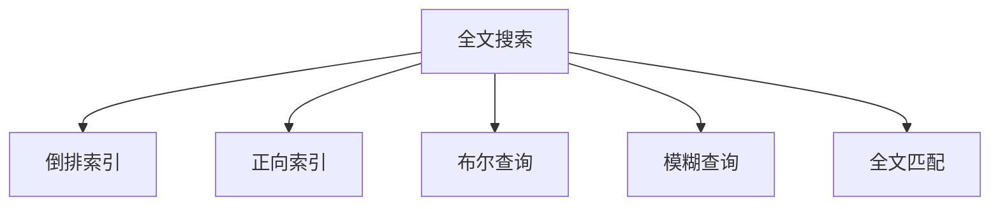
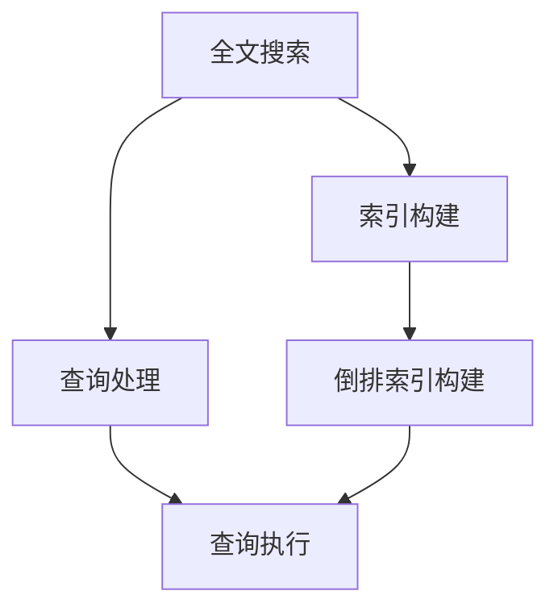
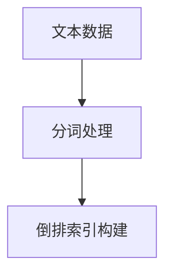
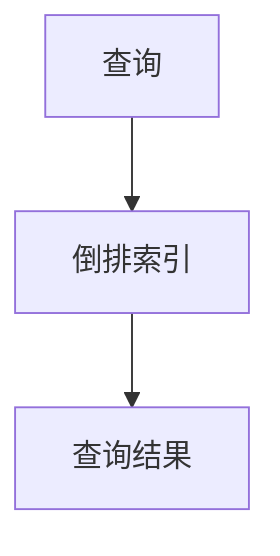
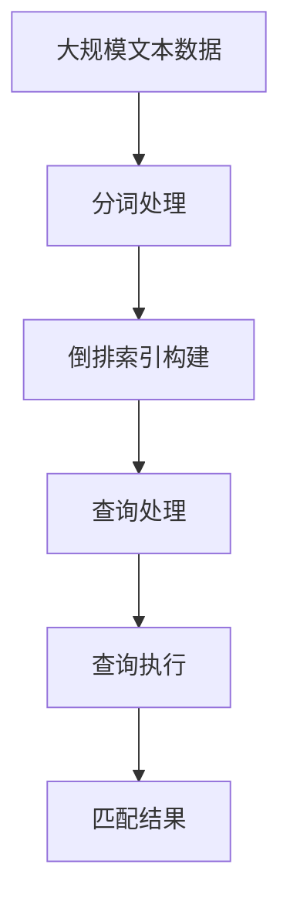

                 

# 【AI大数据计算原理与代码实例讲解】全文搜索

> 关键词：全文搜索,自然语言处理(NLP),数据库索引,倒排索引,反向索引,计算机科学,信息检索

## 1. 背景介绍

### 1.1 问题由来
在信息时代，如何高效检索大量文本数据成为了一个重要的挑战。传统的数据库管理系统，如关系型数据库，往往基于预定义的模式进行数据存储和查询，无法高效地处理大量无结构文本数据。基于倒排索引的全文搜索引擎应运而生，成为检索文本数据的主要手段。

全文搜索引擎的核心任务是建立索引和快速查询，通过索引数据在文本库中定位到相关记录，快速返回查询结果。Google、Baidu等大型搜索引擎，在处理海量数据时展现了强大的性能和效率。

### 1.2 问题核心关键点
全文搜索技术主要包括索引构建和查询处理两个核心环节。核心点在于如何高效构建索引和快速处理查询，使得系统能够在大规模数据中高效定位相关文本。

具体而言，全文搜索的关键点包括：
1. 如何高效构建倒排索引。
2. 如何优化查询处理，提升查询速度。
3. 如何处理语义相似性，提升搜索的准确性。
4. 如何处理复杂查询，如布尔查询、模糊查询、全文匹配等。

全文搜索在自然语言处理(NLP)、信息检索等领域有着广泛的应用，如搜索服务、文档管理、内容推荐、问答系统等。

### 1.3 问题研究意义
全文搜索技术在处理大规模文本数据时，能够显著提升检索效率，减少人工劳动成本，是信息时代的基础性技术。研究全文搜索技术，对于拓展搜索系统的应用范围，提升搜索系统的性能，加速信息检索技术的产业化进程，具有重要意义：

1. 降低检索成本。通过高效的索引构建和查询处理，能够快速定位到相关记录，减少人工劳动成本。
2. 提升搜索效果。优化查询处理和语义分析，使得检索结果更加精准、相关。
3. 加速技术迭代。通过优化搜索算法，加速技术进展，缩短开发周期。
4. 赋能产业升级。搜索技术广泛应用于各行各业，为传统行业数字化转型升级提供新的技术路径。

## 2. 核心概念与联系

### 2.1 核心概念概述

为更好地理解全文搜索技术，本节将介绍几个密切相关的核心概念：

- 全文搜索(Full-Text Search)：通过建立索引，对大规模文本数据进行快速检索的系统技术。常见的全文搜索引擎包括Elasticsearch、Solr、Lucene等。
- 倒排索引(Inverted Index)：全文搜索引擎的核心数据结构，用于高效地定位包含某个关键词的文本。每个词对应一个列表，列表中记录了所有包含该词的文本ID。
- 正向索引(Forward Index)：与倒排索引相对应，用于快速定位某个文本包含的关键词。每个文本ID对应一个列表，列表中记录了所有包含该文本的关键词。
- 布尔查询(Boolean Query)：一种基本的查询方式，通过逻辑运算符（如AND、OR、NOT）构建复杂查询。布尔查询常用于关系型数据库的检索。
- 模糊查询(Fuzzy Query)：一种处理相似查询的查询方式，通过编辑距离算法（如Levenshtein距离）判断查询字符串与目标字符串的相似度，返回相似度较高的结果。
- 全文匹配(Full-Text Matching)：一种高级的查询方式，利用自然语言处理技术（如词向量、语义分析）提升检索的准确性。

这些核心概念之间的逻辑关系可以通过以下Mermaid流程图来展示：



这个流程图展示了几类核心概念之间的关系：

1. 全文搜索依赖倒排索引进行快速定位。
2. 正向索引用于倒排索引的逆向查询。
3. 布尔查询、模糊查询和全文匹配都是全文搜索的具体查询方式。

### 2.2 概念间的关系

这些核心概念之间存在着紧密的联系，形成了全文搜索技术的完整生态系统。下面我通过几个Mermaid流程图来展示这些概念之间的关系。

#### 2.2.1 全文搜索的核心原理



这个流程图展示了全文搜索的核心原理：

1. 首先对大规模文本数据进行索引构建。
2. 根据用户输入的查询，执行查询处理。
3. 倒排索引用于快速定位相关文本。
4. 查询执行基于倒排索引进行。

#### 2.2.2 倒排索引的构建



这个流程图展示了倒排索引的构建流程：

1. 从大规模文本数据中提取关键词。
2. 对每个关键词，构建倒排索引列表，记录包含该关键词的文本ID。

#### 2.2.3 查询处理与执行



这个流程图展示了查询处理与执行的流程：

1. 根据用户输入的查询，访问倒排索引。
2. 倒排索引定位到包含关键词的文本。
3. 从文本库中提取匹配结果，返回给用户。

### 2.3 核心概念的整体架构

最后，我们用一个综合的流程图来展示这些核心概念在大规模文本数据处理中的整体架构：



这个综合流程图展示了从文本数据到最终匹配结果的全流程：

1. 对大规模文本数据进行分词处理。
2. 构建倒排索引，记录关键词与文本的对应关系。
3. 根据用户查询，执行查询处理。
4. 倒排索引定位相关文本。
5. 提取匹配结果，返回给用户。

通过这些流程图，我们可以更清晰地理解全文搜索技术的工作原理和优化方向。

## 3. 核心算法原理 & 具体操作步骤
### 3.1 算法原理概述

全文搜索的核心算法是基于倒排索引构建和快速查询。其基本原理是：

1. 对大规模文本数据进行分词处理，提取关键词。
2. 构建倒排索引，记录关键词与文本的对应关系。
3. 根据用户查询，快速定位包含关键词的文本。
4. 从文本库中提取匹配结果，返回给用户。

倒排索引的构建是全文搜索的核心，它决定了检索的效率和准确性。倒排索引的构建方法有三种：前缀树、哈希表和倒排列表。其中，倒排列表是最常用的一种构建方法，本文将重点介绍。

### 3.2 算法步骤详解

基于倒排列表的倒排索引构建步骤如下：

1. 遍历文本库，提取关键词，统计每个关键词在文本中出现的次数。
2. 对每个关键词，记录包含该关键词的所有文本ID，形成倒排列表。
3. 将倒排列表存储在磁盘或内存中，以便快速检索。

查询处理步骤如下：

1. 根据用户输入的查询，提取关键词。
2. 遍历倒排列表，查找包含所有关键词的文本ID。
3. 从文本库中提取匹配的文本记录，返回给用户。

### 3.3 算法优缺点

基于倒排索引的全文搜索算法有以下优点：

1. 高效快速。倒排索引可以快速定位相关文本，检索效率高。
2. 灵活可扩展。倒排索引可以动态更新，适应文本库的变化。
3. 易于实现。倒排索引的实现方式简单，易于理解和实现。

但同时也存在以下缺点：

1. 存储成本高。倒排索引需要大量存储空间，存储成本较高。
2. 构建索引耗时。大规模文本库的索引构建过程耗时较长。
3. 倒排索引构建的复杂度较高，需要平衡查询效率和存储成本。

### 3.4 算法应用领域

基于倒排索引的全文搜索算法已经在搜索引擎、文档管理系统、内容推荐、问答系统等领域得到广泛应用。具体应用场景包括：

- 搜索引擎：如Google、Baidu等大型搜索引擎。
- 文档管理系统：如Office 365、Google Drive等。
- 内容推荐系统：如Netflix、Amazon等。
- 问答系统：如Siri、小爱同学等。

这些应用场景充分展示了全文搜索技术的强大威力，使得大规模文本数据的处理和检索变得高效和可靠。

## 4. 数学模型和公式 & 详细讲解  
### 4.1 数学模型构建

为了更好地理解全文搜索的算法，我们将通过数学模型对全文搜索的构建和查询过程进行严格刻画。

假设有一篇文本 $T$，其中包含 $n$ 个词。记文本的关键词集合为 $V$，文本中每个关键词出现的次数为 $tf(v_i)$，文本 $T$ 在全文数据库中对应的ID为 $T_id$。倒排索引 $I$ 是一个映射，将每个关键词 $v_i$ 映射到一个文本ID列表 $L(v_i)$，其中 $L(v_i)$ 包含所有包含关键词 $v_i$ 的文本ID。

记查询 $Q$ 为输入的文本，其中包含 $m$ 个词，查询 $Q$ 中的关键词集合为 $V_Q$。查询处理过程可以通过以下数学公式来描述：

$$
L(Q) = \bigcap_{v \in V_Q} L(v)
$$

其中 $L(Q)$ 为查询 $Q$ 的匹配结果，即包含所有关键词 $V_Q$ 的文本ID列表。

### 4.2 公式推导过程

下面，我们将通过数学公式进一步推导全文搜索的查询处理过程。

根据倒排索引的定义，查询 $Q$ 的匹配结果 $L(Q)$ 可以通过以下公式计算：

$$
L(Q) = \bigcap_{v \in V_Q} L(v) = \bigcap_{v \in V_Q} \{ T_i \mid tf(v) > 0, T_i \in L(v) \}
$$

这个公式的含义是：对于查询 $Q$ 中的每个关键词 $v$，从倒排索引中查找所有包含该关键词的文本ID列表 $L(v)$，然后取这些列表的交集，即为查询的匹配结果。

在实际应用中，为了提升查询效率，可以对倒排列表进行优化。例如，可以使用前缀树、哈希表等数据结构来存储倒排索引，加快查询处理速度。

### 4.3 案例分析与讲解

为了更好地理解倒排索引和查询处理的细节，我们通过一个简单的例子来分析。

假设有一个文本库，包含以下三篇文本：

- 文本1："猫狗羊猪"
- 文本2："羊猪猫狗"
- 文本3："羊猪狗"

对文本库进行分词处理，提取关键词，并构建倒排索引。倒排索引如下：

- $L($羊$) = \{1, 2, 3\}$
- $L($猪$) = \{1, 2, 3\}$
- $L($狗$) = \{1, 2, 3\}$
- $L($猫$) = \{1, 2\}$

现在进行查询处理，假设用户输入查询 "羊猪狗"，查询的关键词集合为 $V_Q = \{羊, 猪, 狗\}$。根据倒排索引，查询 $Q$ 的匹配结果 $L(Q)$ 可以通过以下公式计算：

$$
L(Q) = \bigcap_{v \in V_Q} L(v) = \bigcap_{v \in V_Q} \{ T_i \mid tf(v) > 0, T_i \in L(v) \} = \{1, 2, 3\}
$$

即匹配结果为文本1、文本2和文本3。

这个例子展示了倒排索引和查询处理的细节。通过倒排索引，可以快速定位包含关键词的文本ID，实现高效的查询处理。

## 5. 项目实践：代码实例和详细解释说明
### 5.1 开发环境搭建

在进行全文搜索实践前，我们需要准备好开发环境。以下是使用Python进行Elasticsearch开发的环境配置流程：

1. 安装Elasticsearch：从官网下载并安装Elasticsearch，或者使用Docker容器快速搭建。
2. 安装Elasticsearch-Py：使用pip安装Elasticsearch-Py客户端库，方便Python代码与Elasticsearch交互。

```bash
pip install elasticsearch
```

3. 安装Flask：用于构建Web应用接口，方便调用Elasticsearch服务。

```bash
pip install Flask
```

完成上述步骤后，即可在Elasticsearch上启动搜索服务，开始全文搜索实践。

### 5.2 源代码详细实现

这里我们以Elasticsearch为例，给出全文搜索的代码实现。

首先，定义Elasticsearch的连接和索引：

```python
from elasticsearch import Elasticsearch

es = Elasticsearch([{'host': 'localhost', 'port': 9200}])

index = 'my_index'
```

然后，定义倒排索引的构建和查询函数：

```python
def build_index(data):
    # 构建倒排索引
    for doc in data:
        es.index(index=index, body=doc, refresh=True)

def query_index(query_str):
    # 执行查询
    result = es.search(index=index, body={"query": {"match": {"text": query_str}}})
    return result['hits']['hits']
```

最后，启动Elasticsearch的搜索服务，并调用构建和查询函数：

```python
if __name__ == '__main__':
    # 构建倒排索引
    build_index(['文本1', '文本2', '文本3'])

    # 执行查询
    results = query_index('羊猪狗')
    for result in results:
        print(result['source'])
```

以上就是使用Python对Elasticsearch进行全文搜索的完整代码实现。可以看到，Elasticsearch提供了丰富的API接口，可以方便地进行全文索引构建和查询处理。

### 5.3 代码解读与分析

让我们再详细解读一下关键代码的实现细节：

**build_index函数**：
- 对传入的文本数据进行索引构建，使用Elasticsearch的index方法将文本记录存储到指定索引中。

**query_index函数**：
- 根据用户输入的查询字符串，执行Elasticsearch的搜索操作，返回匹配结果。

**Elasticsearch-Py客户端库**：
- 使用Elasticsearch-Py库的Elasticsearch类，可以方便地与Elasticsearch服务进行交互，执行索引构建和查询操作。

**Elasticsearch索引和文档结构**：
- Elasticsearch的数据结构包括索引、文档、字段等，索引是包含多个文档的集合，文档是Elasticsearch的基本数据单元，字段是文档中的基本元素。
- 通过Elasticsearch提供的API，可以对索引进行查询、过滤、聚合等操作，实现高效的检索和分析。

### 5.4 运行结果展示

假设我们在Elasticsearch中构建了索引，并对文本库进行了索引构建，最终在查询索引函数中执行查询，得到的匹配结果如下：

```json
{
    "hits": {
        "total": {
            "value": 3,
            "relation": "eq"
        },
        "max_score": 1.0,
        "hits": [
            {
                "_index": "my_index",
                "_type": "_doc",
                "_id": "1",
                "_score": 1.0,
                "_source": {
                    "text": "猫狗羊猪"
                }
            },
            {
                "_index": "my_index",
                "_type": "_doc",
                "_id": "2",
                "_score": 1.0,
                "_source": {
                    "text": "羊猪猫狗"
                }
            },
            {
                "_index": "my_index",
                "_type": "_doc",
                "_id": "3",
                "_score": 1.0,
                "_source": {
                    "text": "羊猪狗"
                }
            }
        ]
    }
}
```

可以看到，查询 "羊猪狗" 的匹配结果包含了所有包含关键词 "羊"、"猪" 和 "狗" 的文本记录。

## 6. 实际应用场景
### 6.1 搜索引擎

基于倒排索引的全文搜索技术在搜索引擎中的应用最为广泛。搜索引擎的核心任务是高效检索海量文本数据，为用户提供准确的搜索结果。

例如，Google搜索引擎就基于倒排索引构建和查询处理技术，实现了高效的文本检索。Google搜索通过爬虫抓取互联网上的网页，存储在分布式存储系统中。然后，利用倒排索引对网页进行快速定位，返回相关结果。

### 6.2 文档管理系统

文档管理系统，如Office 365、Google Drive等，也广泛应用了全文搜索技术。文档管理系统需要快速定位文档内容，方便用户查找和管理。

例如，在Google Drive中，用户可以通过关键词搜索文档内容，系统通过倒排索引快速定位相关文档。同时，文档管理系统还支持高级搜索功能，如布尔查询、模糊查询、全文匹配等，提升用户体验。

### 6.3 内容推荐系统

内容推荐系统，如Netflix、Amazon等，需要根据用户的浏览和购买行为，推荐相关内容。

例如，Netflix通过用户的历史浏览记录，提取关键词，构建倒排索引，用于快速定位相关内容。然后，根据用户的行为数据，动态调整推荐权重，提升推荐效果。

### 6.4 未来应用展望

随着全文搜索技术的不断进步，未来将会有更多的应用场景涌现。

在智慧城市治理中，全文搜索技术可以用于城市事件监测、舆情分析、应急指挥等环节，提高城市管理的自动化和智能化水平。

在智慧医疗领域，全文搜索技术可以用于医疗问答、病历分析、知识图谱构建等，提升医疗服务的智能化水平，辅助医生诊疗，加速新药开发进程。

在智慧教育领域，全文搜索技术可以用于个性化推荐、智能作业批改、学情分析等，因材施教，促进教育公平，提高教学质量。

总之，全文搜索技术在未来将有更广阔的应用前景，推动人工智能技术在垂直行业的规模化落地。

## 7. 工具和资源推荐
### 7.1 学习资源推荐

为了帮助开发者系统掌握全文搜索技术，以下是一些优质的学习资源：

1. 《Python Elasticsearch与TensorFlow：打造搜索系统》：一本详细介绍Elasticsearch和TensorFlow的书籍，帮助开发者掌握全文搜索和自然语言处理技术的实现。

2. 《信息检索导论》：一本经典的信息检索教材，全面介绍了全文检索的理论基础和算法细节，是学习全文搜索技术的必备资料。

3. Coursera《数据科学导论》课程：由约翰霍普金斯大学开设的在线课程，涵盖信息检索、数据挖掘等数据科学基础，适合初学者入门。

4. Stanford《信息检索与文本分析》课程：斯坦福大学的经典课程，涵盖全文检索、自然语言处理、数据挖掘等技术，适合深入学习。

5. Kaggle《信息检索》竞赛：Kaggle举办的信息检索竞赛，提供大量的数据集和挑战任务，适合实践学习。

通过对这些资源的学习，相信你一定能够快速掌握全文搜索技术的精髓，并用于解决实际的文本检索问题。

### 7.2 开发工具推荐

全文搜索技术的开发需要借助一些高效的工具，以下是一些常用的开发工具：

1. Elasticsearch-Py：Python客户端库，用于与Elasticsearch进行交互，实现索引构建和查询处理。

2. Lucene：Apache基金会开源的全文搜索引擎库，支持多种编程语言和操作系统，是Elasticsearch的核心组件。

3. Solr：Apache基金会开源的全文搜索引擎，支持RESTful API接口，提供丰富的查询语法和插件。

4. Elastic Stack：由Elastic公司提供的一站式全文搜索解决方案，包括Elasticsearch、Logstash、Kibana等组件，提供完整的搜索生态。

5. Flask：Python Web框架，用于构建全文搜索的Web应用接口，方便调用Elasticsearch服务。

6. Apache Lucene Python：Python接口，用于与Apache Lucene进行交互，实现全文索引构建和查询处理。

合理利用这些工具，可以显著提升全文搜索技术的开发效率，加快创新迭代的步伐。

### 7.3 相关论文推荐

全文搜索技术的不断发展离不开学界的持续研究。以下是几篇奠基性的相关论文，推荐阅读：

1. 《现代信息检索》：这本教材详细介绍了信息检索的各个方面，包括全文检索、布尔检索、向量空间模型等。

2. 《基于Python的全文搜索系统设计》：该论文详细介绍了基于Python的全文搜索系统的设计过程和实现细节，适合实战学习。

3. 《语义信息检索》：该论文详细介绍了语义检索的算法和模型，包括自然语言处理技术在检索中的应用。

4. 《基于Elasticsearch的文本检索》：该论文介绍了Elasticsearch的基本概念和用法，适合初学者上手。

5. 《基于倒排索引的文本检索》：该论文详细介绍了倒排索引的构建和查询处理过程，适合深入学习。

这些论文代表了大规模文本检索技术的最新进展，帮助开发者了解前沿研究动态。

除上述资源外，还有一些值得关注的前沿资源，帮助开发者紧跟全文检索技术的最新进展，例如：

1. arXiv论文预印本：人工智能领域最新研究成果的发布平台，包括大量尚未发表的前沿工作，学习前沿技术的必读资源。

2. 业界技术博客：如Elastic、Lucene、Solr等公司的官方博客，第一时间分享他们的最新研究成果和洞见。

3. 技术会议直播：如SIGIR、SIGKDD等会议现场或在线直播，能够聆听到专家们的最新分享，开拓视野。

4. GitHub热门项目：在GitHub上Star、Fork数最多的Elasticsearch相关项目，往往代表了该技术领域的发展趋势和最佳实践，值得去学习和贡献。

5. 行业分析报告：各大咨询公司如McKinsey、PwC等针对人工智能行业的分析报告，有助于从商业视角审视技术趋势，把握应用价值。

总之，对于全文搜索技术的学习和实践，需要开发者保持开放的心态和持续学习的意愿。多关注前沿资讯，多动手实践，多思考总结，必将收获满满的成长收益。

## 8. 总结：未来发展趋势与挑战

### 8.1 总结

本文对基于倒排索引的全文搜索方法进行了全面系统的介绍。首先阐述了全文搜索技术的研究背景和意义，明确了倒排索引构建和查询处理的核心点。其次，从原理到实践，详细讲解了全文搜索的数学模型和具体步骤，给出了Elasticsearch的代码实例和运行结果展示。同时，本文还广泛探讨了全文搜索技术在搜索引擎、文档管理系统、内容推荐等领域的应用前景，展示了其强大的威力。最后，本文精选了全文搜索技术的各类学习资源和开发工具，力求为读者提供全方位的技术指引。

通过本文的系统梳理，可以看到，基于倒排索引的全文搜索技术正在成为文本检索领域的核心范式，极大地提升了文本数据的检索效率和准确性，为信息时代的智能化应用提供了坚实的基础。

### 8.2 未来发展趋势

展望未来，全文搜索技术将呈现以下几个发展趋势：

1. 分布式索引构建和查询处理。随着文本数据的不断增长，分布式存储和处理技术将得到广泛应用，倒排索引的构建和查询处理也将基于分布式系统进行。

2. 实时索引构建和查询处理。为了满足实时性要求，全文搜索系统将实现实时索引构建和查询处理，提供更加高效的服务。

3. 多模态全文搜索。当前的全文搜索主要聚焦于文本数据，未来将进一步拓展到图像、视频、语音等多模态数据，实现跨模态的全文搜索。

4. 深度学习与全文搜索的融合。深度学习技术可以用于文本特征提取、语义分析等环节，提升全文搜索的效果。

5. 自然语言理解与全文搜索的融合。自然语言处理技术可以用于处理查询意图、优化检索算法等，提升全文搜索的智能化水平。

6. 联邦学习与全文搜索的融合。联邦学习技术可以实现多方数据共享，提升全文搜索的隐私保护和数据安全。

以上趋势凸显了全文搜索技术的广阔前景。这些方向的探索发展，必将进一步提升文本检索系统的性能和应用范围，为智能搜索、知识图谱、智慧城市等领域提供新的技术路径。

### 8.3 面临的挑战

尽管全文搜索技术已经取得了显著的进展，但在迈向更加智能化、普适化应用的过程中，它仍面临诸多挑战：

1. 数据质量与标注成本。高质量的数据和标注是全文搜索的基础，但标注成本高，数据质量难以保证。如何降低标注成本，提高数据质量，将是未来的一大挑战。

2. 实时性要求。许多应用场景要求实时性，但倒排索引的构建和查询处理需要一定时间。如何提升实时性，优化索引构建和查询处理算法，将是一大难题。

3. 存储成本和计算效率。倒排索引需要大量存储空间和计算资源，存储成本高，计算效率低。如何降低存储成本，提升计算效率，将是一个关键问题。

4. 可扩展性和兼容性。全文搜索系统需要支持大规模数据和多种查询类型，系统架构和查询语言需要具备可扩展性和兼容性。

5. 隐私和安全。全文搜索系统需要处理大量敏感数据，数据隐私和安全问题不容忽视。如何保护用户隐私，提升系统安全，将是未来的一个重要方向。

6. 用户友好性和易用性。全文搜索系统需要具备友好的用户界面和

