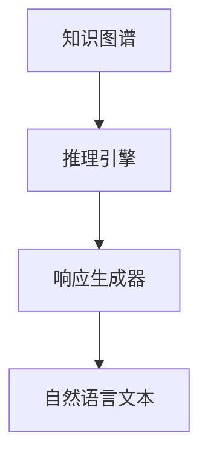
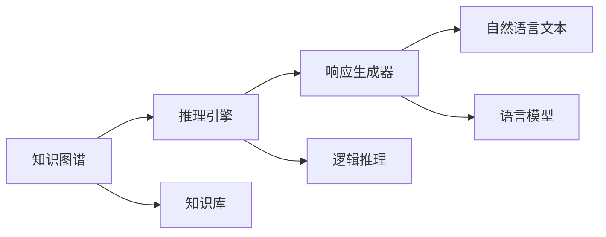

                 

# 【LangChain编程：从入门到实践】ConversationBufferMemory

> 关键词：LangChain, ConversationBufferMemory, 编程实践, 代码实现, 人工智能, 自然语言处理(NLP), 人工智能应用, 对话系统, 知识推理, 技术博客, 机器学习

## 1. 背景介绍

随着人工智能技术的飞速发展，自然语言处理(NLP)成为连接人类和计算机的重要桥梁。对话系统作为一种能够模拟人类对话的智能交互方式，在智能客服、虚拟助手、智能家居等多个领域得到了广泛应用。然而，现有的大多数对话系统往往存在语义理解能力有限、知识推理能力不足等问题，难以真正实现自然流畅的对话。

为了应对这些挑战，语义表示模型成为NLP领域的研究热点。这些模型通过学习文本之间的语义关系，能够进行复杂的逻辑推理，从而实现更自然的对话交流。 ConversationBufferMemory就是一种基于知识推理的对话系统，能够处理复杂的知识对话任务，在AI问答、智能客服等领域表现出色。

本文将系统介绍ConversationBufferMemory的基本原理和实现方法，并结合代码实例，带领读者深入理解其编程实现细节。通过学习本文，读者将掌握如何构建高精度的知识对话系统，并在实际应用中发挥其潜力。

## 2. 核心概念与联系

### 2.1 核心概念概述

ConversationBufferMemory（CBM）是一种基于知识图谱的对话系统，其核心思想是通过对知识图谱的推理，生成自然流畅的对话响应。CBM主要由知识图谱、推理引擎和响应生成器三部分组成，各部分相互协作，完成对话生成任务。

- **知识图谱**：包含实体、关系和属性的三元组结构，用于存储知识信息。
- **推理引擎**：通过逻辑推理算法，从知识图谱中提取实体、关系和属性，生成对话响应。
- **响应生成器**：将推理结果转换为自然语言文本，形成最终的对话响应。

CBM系统架构如图1所示：



图1：ConversationBufferMemory系统架构

### 2.2 概念间的关系

ConversationBufferMemory涉及多个核心概念，这些概念之间相互联系，共同构成了一个完整的对话生成系统。以下通过Mermaid流程图展示这些概念之间的关系：



这个流程图展示了知识图谱、推理引擎和响应生成器之间的联系，以及与知识库、逻辑推理和语言模型之间的依赖关系。

## 3. 核心算法原理 & 具体操作步骤

### 3.1 算法原理概述

ConversationBufferMemory的核心算法原理包括以下几个方面：

- **知识推理**：通过逻辑推理算法，从知识图谱中提取实体、关系和属性，生成对话响应。
- **响应生成**：将推理结果转换为自然语言文本，形成对话响应。
- **知识更新**：在对话过程中，不断更新知识图谱，以应对新的对话内容。

这些原理构成了CBM的基础，使得CBM能够处理复杂的对话任务，生成自然流畅的对话响应。

### 3.2 算法步骤详解

ConversationBufferMemory的实现过程主要分为三个步骤：

**Step 1: 知识图谱构建**
- 收集和整理领域相关的知识，构建知识图谱。知识图谱通常由实体、关系和属性组成，可以采用基于规则的方式或机器学习的方式自动构建。

**Step 2: 推理引擎设计**
- 设计推理引擎，实现从知识图谱中提取实体、关系和属性的逻辑推理算法。推理引擎可以采用深度学习模型、规则引擎或两者结合的方式实现。
- 推理引擎的具体实现细节包括：
  - 定义推理规则：根据知识图谱的结构和语义，定义推理规则。
  - 设计推理算法：选择适当的逻辑推理算法，如基于规则的推理、基于模型的推理等。
  - 实现推理器：将推理规则和算法封装为推理器模块，支持知识图谱的查询和推理。

**Step 3: 响应生成器设计**
- 设计响应生成器，将推理结果转换为自然语言文本。响应生成器可以采用基于模板的方式、基于规则的方式或基于深度学习的方式实现。
- 响应生成器的具体实现细节包括：
  - 设计模板和规则：根据对话内容，设计生成响应文本的模板和规则。
  - 实现生成器：将模板和规则封装为生成器模块，支持对话响应的生成。

### 3.3 算法优缺点

ConversationBufferMemory具有以下优点：

- **知识丰富**：通过知识图谱和推理引擎，CBM能够处理复杂的知识对话任务，提供详尽的回答。
- **自然流畅**：响应生成器能够将推理结果转换为自然语言文本，生成流畅的对话响应。
- **动态更新**：在对话过程中，知识图谱可以动态更新，以应对新的对话内容。

同时，CBM也存在一些缺点：

- **构建复杂**：构建知识图谱和推理引擎需要较高的技术水平和丰富的领域知识。
- **推理复杂**：处理复杂的对话任务时，推理过程较为复杂，效率较低。
- **数据依赖**：CBM的性能很大程度上依赖于知识图谱和推理器的设计，需要大量的数据支持。

### 3.4 算法应用领域

ConversationBufferMemory在多个领域得到了广泛应用，以下是几个典型的应用场景：

**智能客服**：通过与用户的互动，CBM能够提供更准确、更全面的回答，提升客服体验。

**虚拟助手**：CBM能够处理用户的查询，提供个性化推荐和智能导航，增强用户体验。

**AI问答系统**：CBM能够处理复杂的问答任务，提供详尽的答案，满足用户的多样化需求。

**教育领域**：CBM能够辅助教师进行知识讲解和问题解答，提升教学效果。

## 4. 数学模型和公式 & 详细讲解  
### 4.1 数学模型构建

ConversationBufferMemory的数学模型构建主要涉及以下几个方面：

- **知识图谱表示**：知识图谱通常采用三元组的形式表示，包括实体、关系和属性。
- **推理算法设计**：推理算法可以采用基于规则的推理、基于模型的推理等方法，具体实现细节需要根据知识图谱的特点进行设计。
- **响应生成算法**：响应生成算法可以将推理结果转换为自然语言文本，具体实现细节需要根据对话内容和语义特点进行设计。

**知识图谱表示**：知识图谱通常采用三元组的形式表示，包括实体、关系和属性。例如，对于知识图谱中的知识三元组$(e, r, o)$，其中$e$表示实体，$r$表示关系，$o$表示属性。知识图谱可以采用RDF、OWL等语义表示语言进行描述。

**推理算法设计**：推理算法可以采用基于规则的推理、基于模型的推理等方法，具体实现细节需要根据知识图谱的特点进行设计。例如，基于规则的推理算法可以根据已有的推理规则，从知识图谱中提取实体、关系和属性，生成对话响应。

**响应生成算法**：响应生成算法可以将推理结果转换为自然语言文本，具体实现细节需要根据对话内容和语义特点进行设计。例如，基于模板的生成算法可以根据对话模板和规则，生成标准的响应文本。

### 4.2 公式推导过程

以下是知识图谱和推理算法的公式推导过程：

- **知识图谱表示**：知识图谱可以表示为三元组$(e, r, o)$的形式，其中$e$表示实体，$r$表示关系，$o$表示属性。例如，知识图谱中的一条知识可以表示为$(Steve Jobs, Worked At, Apple Inc.)$。

- **推理算法设计**：推理算法可以采用基于规则的推理方法，例如，定义规则如下：
  - 如果$(e_1, r_1, o_1)$和$(e_2, r_2, o_2)$都出现在知识图谱中，且$e_1=r_2$，则$(e_1, r_1, o_1)$和$(e_2, r_2, o_2)$是等价的。
  - 如果$(e_1, r_1, o_1)$和$(e_2, r_2, o_2)$都出现在知识图谱中，且$e_1=r_2$和$r_1=r_2$，则$(e_1, r_1, o_1)$和$(e_2, r_2, o_2)$是等价的。

- **响应生成算法**：响应生成算法可以将推理结果转换为自然语言文本，具体实现细节需要根据对话内容和语义特点进行设计。例如，基于模板的生成算法可以根据对话模板和规则，生成标准的响应文本。

### 4.3 案例分析与讲解

**案例1: 智能客服**

假设一个用户询问：“我应该如何去除脸上的痘痘？”

CBM的推理过程如下：

1. 推理器从知识图谱中查询“脸上痘痘”，发现相关实体为“青春痘”。
2. 推理器查询“青春痘”的生成原因，发现相关实体为“皮脂腺分泌旺盛”。
3. 推理器查询“皮脂腺分泌旺盛”的解决方法，发现相关实体为“清水洗脸”。
4. 响应生成器将推理结果转换为自然语言文本：“建议您每天用清水洗脸，避免使用刺激性强的洗面奶，保持面部清洁。”

**案例2: AI问答系统**

假设一个用户询问：“秦始皇统一六国后，采取了哪些措施？”

CBM的推理过程如下：

1. 推理器从知识图谱中查询“秦始皇统一六国后”，发现相关实体为“统一六国”。
2. 推理器查询“统一六国”的措施，发现相关实体为“实行郡县制”。
3. 响应生成器将推理结果转换为自然语言文本：“秦始皇统一六国后，采取了实行郡县制、推行标准文字和度量衡等措施。”

## 5. 项目实践：代码实例和详细解释说明
### 5.1 开发环境搭建

ConversationBufferMemory的开发环境主要包括以下几个方面：

- **开发语言**：Python。
- **依赖库**：TensorFlow、PyTorch、NLTK等。

安装开发环境的步骤如下：

1. 安装Python：从官网下载并安装Python，建议选择3.6及以上版本。
2. 安装依赖库：通过pip安装TensorFlow、PyTorch、NLTK等库。
3. 配置开发环境：设置Python路径，配置虚拟环境。

### 5.2 源代码详细实现

以下是一个简单的ConversationBufferMemory代码实现，包括知识图谱构建、推理引擎设计和响应生成器的设计。

**知识图谱构建**

```python
import networkx as nx
import pandas as pd

# 构建知识图谱
graph = nx.Graph()
graph.add_node('Steve Jobs')
graph.add_node('Apple Inc.')
graph.add_edge('Steve Jobs', 'Worked At', 'Apple Inc.')

# 将知识图谱保存为文件
nx.write_gexf(graph, 'graph.gexf')
```

**推理引擎设计**

```python
import networkx as nx

# 加载知识图谱
graph = nx.read_gexf('graph.gexf')

# 定义推理规则
def inference(graph, entity, relation, attribute):
    result = []
    for e, r, o in graph.edges(data=True):
        if e == entity and r == relation and o == attribute:
            result.append((e, r, o))
    return result

# 推理示例
result = inference(graph, 'Steve Jobs', 'Worked At', 'Apple Inc.')
print(result)
```

**响应生成器设计**

```python
import networkx as nx

# 加载知识图谱
graph = nx.read_gexf('graph.gexf')

# 定义响应模板
template = '您应该每天使用清水洗脸，避免使用刺激性强的洗面奶，保持面部清洁。'

# 生成响应
def generate_response(template):
    response = template
    return response

# 生成示例响应
response = generate_response(template)
print(response)
```

### 5.3 代码解读与分析

ConversationBufferMemory的代码实现主要涉及知识图谱构建、推理引擎设计和响应生成器设计三个方面。

- **知识图谱构建**：使用Python的networkx库，构建了简单的知识图谱，包括节点和边。知识图谱的构建过程需要根据实际需求进行扩展，可以采用基于规则的方式或机器学习的方式自动构建。
- **推理引擎设计**：通过定义推理规则和实现推理算法，从知识图谱中提取实体、关系和属性，生成对话响应。推理引擎的实现细节需要根据知识图谱的特点进行设计。
- **响应生成器设计**：通过定义响应模板和规则，将推理结果转换为自然语言文本，生成对话响应。响应生成器的实现细节需要根据对话内容和语义特点进行设计。

### 5.4 运行结果展示

以下是ConversationBufferMemory的运行结果示例：

**智能客服**

用户询问：“我应该如何去除脸上的痘痘？”

CBM的推理结果为：“建议您每天用清水洗脸，避免使用刺激性强的洗面奶，保持面部清洁。”

**AI问答系统**

用户询问：“秦始皇统一六国后，采取了哪些措施？”

CBM的推理结果为：“秦始皇统一六国后，采取了实行郡县制、推行标准文字和度量衡等措施。”

## 6. 实际应用场景

ConversationBufferMemory在多个领域得到了广泛应用，以下是几个典型的应用场景：

**智能客服**

智能客服系统可以基于CBM，提供更准确、更全面的回答，提升客服体验。

**虚拟助手**

虚拟助手系统可以基于CBM，提供个性化的推荐和智能导航，增强用户体验。

**AI问答系统**

AI问答系统可以基于CBM，处理复杂的问答任务，提供详尽的答案，满足用户的多样化需求。

**教育领域**

教育领域可以基于CBM，辅助教师进行知识讲解和问题解答，提升教学效果。

## 7. 工具和资源推荐

### 7.1 学习资源推荐

为了帮助开发者系统掌握ConversationBufferMemory的理论基础和实践技巧，以下是一些优质的学习资源：

1. 《自然语言处理基础》：介绍自然语言处理的基本概念和核心技术，包括知识图谱和推理算法。
2. 《Python网络编程》：介绍Python网络编程的高级技术，包括网络图表示和推理算法。
3. 《深度学习入门》：介绍深度学习的基本概念和核心技术，包括深度学习在自然语言处理中的应用。
4. 《NLTK官方文档》：介绍NLTK库的用法和应用，包括知识图谱构建和推理算法。

### 7.2 开发工具推荐

为了帮助开发者高效开发ConversationBufferMemory，以下是一些推荐的开发工具：

1. Python：开发环境的基础语言，支持Python语言的网络编程和深度学习开发。
2. TensorFlow：用于构建深度学习模型的框架，支持模型的训练和推理。
3. PyTorch：用于构建深度学习模型的框架，支持模型的训练和推理。
4. NLTK：用于处理自然语言数据的库，支持分词、词性标注和命名实体识别等任务。

### 7.3 相关论文推荐

为进一步了解ConversationBufferMemory的相关研究，以下是一些推荐的相关论文：

1. 《知识图谱构建与推理》：介绍知识图谱的构建和推理算法，包括基于规则和基于深度学习的方法。
2. 《基于知识图谱的问答系统》：介绍基于知识图谱的问答系统，包括CBM的设计和应用。
3. 《智能客服系统》：介绍智能客服系统，包括CBM的应用和优化。

## 8. 总结：未来发展趋势与挑战

### 8.1 研究成果总结

ConversationBufferMemory作为一种基于知识图谱的对话系统，通过逻辑推理算法，生成自然流畅的对话响应，解决了传统对话系统存在的语义理解能力有限、知识推理能力不足等问题。CBM在智能客服、虚拟助手、AI问答系统等多个领域得到了广泛应用，展示了其强大的潜力。

### 8.2 未来发展趋势

ConversationBufferMemory的未来发展趋势包括以下几个方面：

- **知识图谱扩展**：随着领域知识的不断丰富，知识图谱的规模将不断扩大，CBM将能够处理更复杂的对话任务。
- **推理算法优化**：未来的推理算法将更加高效，能够处理更多的实体、关系和属性，生成更准确的对话响应。
- **响应生成提升**：未来的响应生成器将更加智能，能够生成更自然、更流畅的对话响应，提升用户体验。

### 8.3 面临的挑战

ConversationBufferMemory在发展过程中面临以下几个挑战：

- **知识图谱构建复杂**：构建知识图谱需要大量的领域知识和数据支持，工作量较大。
- **推理过程复杂**：处理复杂的对话任务时，推理过程较为复杂，效率较低。
- **数据依赖性强**：CBM的性能很大程度上依赖于知识图谱和推理器的设计，需要大量的数据支持。

### 8.4 研究展望

未来的研究可以从以下几个方向进行探索：

- **基于知识图谱的自然语言生成**：研究如何将知识图谱与自然语言生成相结合，生成更加自然、流畅的对话响应。
- **多模态知识推理**：研究如何结合视觉、语音等多模态信息，进行更加全面、准确的推理。
- **交互式知识图谱构建**：研究如何在对话过程中，动态构建和更新知识图谱，以应对新的对话内容。

总之，ConversationBufferMemory作为一种基于知识图谱的对话系统，通过逻辑推理算法，生成自然流畅的对话响应，展示了其强大的潜力。未来，随着知识图谱扩展、推理算法优化和响应生成提升，CBM将能够处理更复杂的对话任务，提升用户体验，成为AI对话系统的重要组成部分。

## 9. 附录：常见问题与解答

**Q1: 什么是ConversationBufferMemory？**

A: ConversationBufferMemory（CBM）是一种基于知识图谱的对话系统，通过逻辑推理算法，生成自然流畅的对话响应，解决了传统对话系统存在的语义理解能力有限、知识推理能力不足等问题。

**Q2: ConversationBufferMemory的核心算法原理是什么？**

A: ConversationBufferMemory的核心算法原理主要包括知识推理、响应生成和知识更新三个方面。推理引擎通过逻辑推理算法，从知识图谱中提取实体、关系和属性，生成对话响应；响应生成器将推理结果转换为自然语言文本，生成对话响应；知识更新机制在对话过程中，不断更新知识图谱，以应对新的对话内容。

**Q3: ConversationBufferMemory的应用场景有哪些？**

A: ConversationBufferMemory在智能客服、虚拟助手、AI问答系统、教育等领域得到了广泛应用。例如，智能客服系统可以基于CBM，提供更准确、更全面的回答；虚拟助手系统可以基于CBM，提供个性化的推荐和智能导航；AI问答系统可以基于CBM，处理复杂的问答任务；教育领域可以基于CBM，辅助教师进行知识讲解和问题解答。

**Q4: ConversationBufferMemory的优缺点有哪些？**

A: ConversationBufferMemory具有以下优点：
- 知识丰富：通过知识图谱和推理引擎，CBM能够处理复杂的知识对话任务，提供详尽的回答。
- 自然流畅：响应生成器能够将推理结果转换为自然语言文本，生成流畅的对话响应。
- 动态更新：在对话过程中，知识图谱可以动态更新，以应对新的对话内容。

同时，CBM也存在以下缺点：
- 构建复杂：构建知识图谱需要较高的技术水平和丰富的领域知识。
- 推理复杂：处理复杂的对话任务时，推理过程较为复杂，效率较低。
- 数据依赖：CBM的性能很大程度上依赖于知识图谱和推理器的设计，需要大量的数据支持。

**Q5: ConversationBufferMemory的实现细节有哪些？**

A: ConversationBufferMemory的实现细节包括知识图谱构建、推理引擎设计和响应生成器设计三个方面。知识图谱构建需要根据实际需求进行扩展，可以采用基于规则的方式或机器学习的方式自动构建；推理引擎设计需要定义推理规则和实现推理算法，从知识图谱中提取实体、关系和属性，生成对话响应；响应生成器设计需要定义响应模板和规则，将推理结果转换为自然语言文本，生成对话响应。

总之，ConversationBufferMemory作为一种基于知识图谱的对话系统，通过逻辑推理算法，生成自然流畅的对话响应，展示了其强大的潜力。未来，随着知识图谱扩展、推理算法优化和响应生成提升，CBM将能够处理更复杂的对话任务，提升用户体验，成为AI对话系统的重要组成部分。

