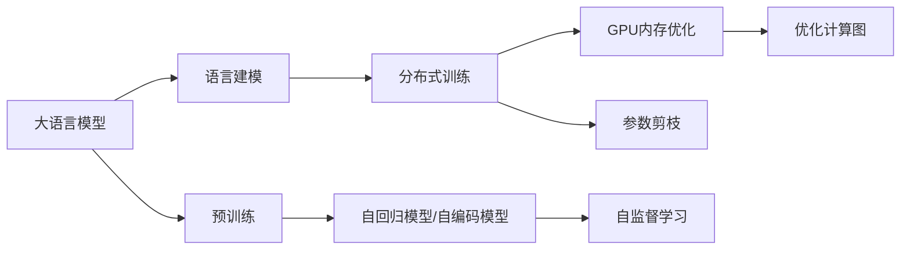
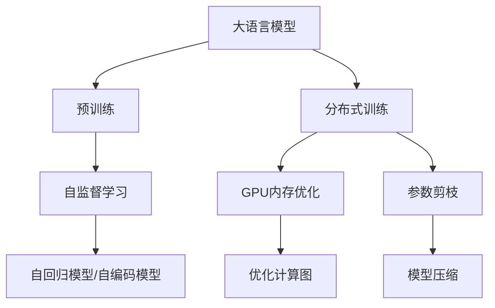
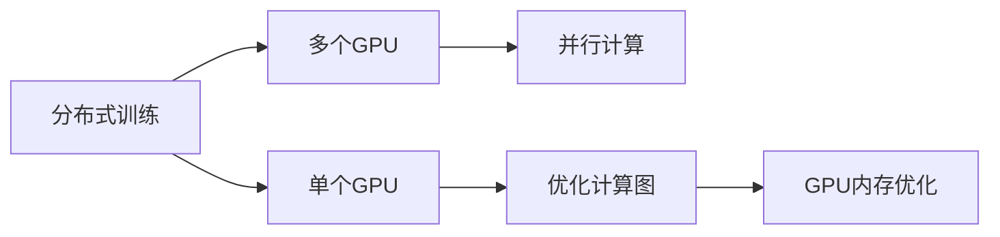
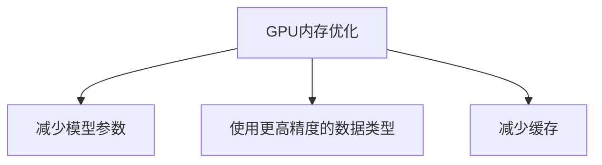
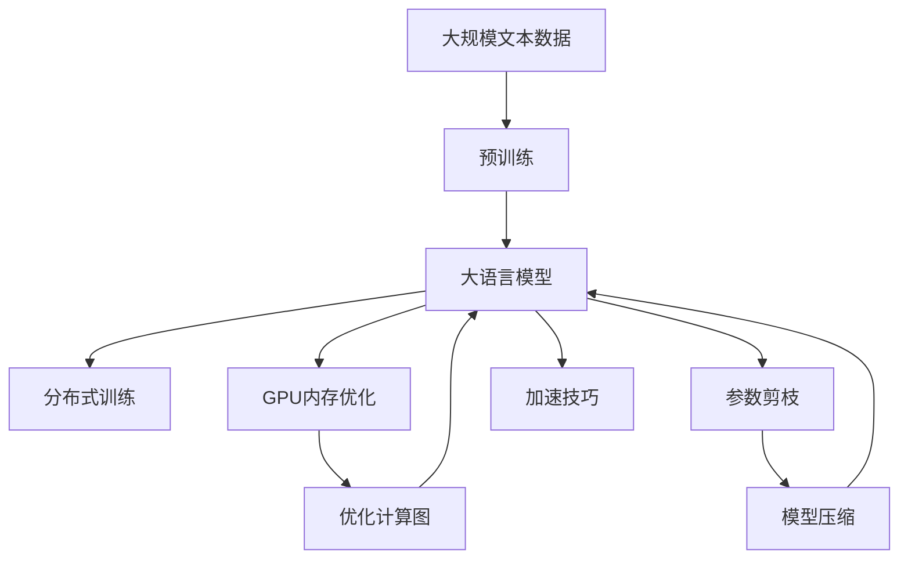

                 

# 大语言模型原理基础与前沿 在单个GPU上一天内训练一个语言模型

> 关键词：大语言模型,预训练,Transformer,自回归模型,语言建模,加速技巧,分布式训练

## 1. 背景介绍

### 1.1 问题由来
近年来，深度学习技术的飞速发展推动了人工智能领域的重大进步。其中，大语言模型(Large Language Models, LLMs)以其强大的语言生成和理解能力，在自然语言处理(NLP)领域取得了显著的成果。这些模型通过在大规模无标签文本数据上进行预训练，学习到了丰富的语言知识和常识，能够应用于各种下游任务，如问答、翻译、情感分析等。

然而，大语言模型的训练通常需要大量的计算资源，包括高性能的GPU或TPU、海量的数据存储和传输带宽等。这使得大模型的训练和部署成本较高，对于小型研究团队和企业来说是一个较大的挑战。如何在有限的计算资源下，高效地训练大语言模型，成为目前NLP领域的热点问题之一。

### 1.2 问题核心关键点
为了在单个GPU上高效训练大语言模型，需要从以下几个方面进行优化：
- 选择合适的模型架构和预训练任务。
- 优化模型的计算图，减少不必要的计算量。
- 采用分布式训练技术，利用多个GPU进行并行计算。
- 引入加速技巧，如GPU内存优化、参数剪枝等。

在本文中，我们将详细介绍大语言模型的原理基础，并通过一个具体案例，展示如何在单个GPU上高效训练一个语言模型，同时介绍相关的加速技巧和优化方法。

### 1.3 问题研究意义
实现单个GPU上高效训练大语言模型，对于降低研究门槛、加速技术创新、推动NLP技术的应用落地，具有重要意义：

1. **降低研究门槛**：通过优化训练方法和加速技巧，可以显著降低大模型训练的硬件和软件成本，使得更多研究团队能够参与到这项前沿技术的研究中来。
2. **加速技术创新**：高效的训练方法可以加速模型的迭代优化，促进NLP技术的新突破和新应用场景的探索。
3. **推动技术应用**：大模型的训练和微调需要大量的计算资源，通过优化训练方法，可以在有限的计算资源下快速获得性能优异的大模型，加速NLP技术在各个行业的应用落地。

## 2. 核心概念与联系

### 2.1 核心概念概述

为了更好地理解大语言模型的高效训练方法，本节将介绍几个关键概念：

- **大语言模型**：以自回归(如GPT)或自编码(如BERT)模型为代表的大规模预训练语言模型。通过在大规模无标签文本数据上进行预训练，学习通用的语言表示，具备强大的语言理解和生成能力。

- **预训练**：指在大规模无标签文本语料上，通过自监督学习任务训练通用语言模型的过程。常见的预训练任务包括言语建模、遮挡语言模型等。

- **自回归模型**：一种递归计算的模型，其输出依赖于之前的所有输入，典型的自回归模型有GPT系列。

- **语言建模**：指通过模型预测给定文本序列的下一个词的概率，是评估模型语言能力的重要指标。

- **分布式训练**：指将大规模模型在多个计算节点上进行并行计算，以加速模型训练的过程。

- **GPU内存优化**：通过减少模型参数、使用更高精度的数据类型、减少缓存等手段，优化GPU内存的使用，提高训练效率。

- **参数剪枝**：指对模型进行结构优化，去除不必要的参数，减小模型尺寸，从而降低计算复杂度和内存需求。

这些概念之间的逻辑关系可以通过以下Mermaid流程图来展示：



这个流程图展示了大语言模型的核心概念及其之间的关系：

1. 大语言模型通过预训练获得基础能力。
2. 自回归模型和自编码模型是两种常见的预训练模型。
3. 语言建模是评估模型语言能力的指标。
4. 分布式训练是加速模型训练的方法。
5. GPU内存优化和参数剪枝是提高训练效率的重要手段。

这些概念共同构成了大语言模型训练的完整生态系统，使得大模型可以在有限的计算资源下进行高效训练和优化。通过理解这些核心概念，我们可以更好地把握大语言模型的训练方法和优化方向。

### 2.2 概念间的关系

这些核心概念之间存在着紧密的联系，形成了大语言模型训练的整体架构。下面我们通过几个Mermaid流程图来展示这些概念之间的关系。

#### 2.2.1 大语言模型的训练范式



这个流程图展示了大语言模型训练的基本范式，包括预训练、分布式训练、GPU内存优化、参数剪枝和计算图优化等环节。

#### 2.2.2 分布式训练与单个GPU训练的关系



这个流程图展示了分布式训练与单个GPU训练的关系，通过多个GPU进行并行计算可以显著提高训练效率。

#### 2.2.3 GPU内存优化方法



这个流程图展示了GPU内存优化的主要手段，通过减少模型参数、使用更高精度的数据类型、减少缓存等，可以优化GPU内存的使用，提高训练效率。

### 2.3 核心概念的整体架构

最后，我们用一个综合的流程图来展示这些核心概念在大语言模型训练过程中的整体架构：



这个综合流程图展示了从预训练到训练，再到优化和加速的整体过程。大语言模型首先在大规模文本数据上进行预训练，然后通过分布式训练加速训练过程，并在GPU内存优化、参数剪枝和计算图优化等环节进一步提升训练效率。通过这些流程，我们可以更清晰地理解大语言模型训练过程中各个环节的逻辑和作用，为后续深入讨论具体的训练方法和技术奠定基础。

## 3. 核心算法原理 & 具体操作步骤
### 3.1 算法原理概述

大语言模型的训练通常基于自回归模型或自编码模型，通过在无标签数据上进行预训练，学习到语言的通用表示。在训练过程中，模型通过最大化下一个词的预测概率来优化语言模型。为了提高训练效率，可以采用分布式训练和GPU内存优化等方法。

### 3.2 算法步骤详解

以下是基于单个GPU训练大语言模型的详细步骤：

**Step 1: 准备数据集和环境**

- 准备大规模文本数据集，通常分为训练集、验证集和测试集。
- 选择合适的GPU硬件，确保其具备足够的内存和计算能力。
- 安装相关的深度学习框架，如PyTorch、TensorFlow等。

**Step 2: 选择模型架构和预训练任务**

- 选择适当的模型架构，如GPT、BERT等。
- 确定预训练任务，如语言建模、掩码语言建模等。

**Step 3: 设置超参数**

- 设置学习率、批大小、迭代轮数等训练超参数。
- 确定是否使用分布式训练以及使用多少个GPU。
- 设置优化器及其参数，如Adam、SGD等。
- 配置GPU内存优化策略，如参数剪枝、计算图优化等。

**Step 4: 执行分布式训练**

- 将数据集划分为多个批次，并行分配给多个GPU进行计算。
- 使用分布式框架如PyTorch Distributed、Horovod等，实现并行计算。
- 在训练过程中，定期在验证集上评估模型性能，并根据性能调整超参数。

**Step 5: 优化计算图**

- 使用高效计算图如TensorFlow的XLA编译器，优化GPU计算过程。
- 使用GPU内存优化技术，如减少模型参数、使用更高精度的数据类型等。
- 应用参数剪枝技术，去除不必要的参数，减小模型尺寸。

**Step 6: 测试和评估**

- 在测试集上测试模型性能，评估其在实际应用中的表现。
- 对比微调前后模型的效果，分析加速技巧的实际效果。

### 3.3 算法优缺点

基于单个GPU训练大语言模型的优点包括：

- 训练过程灵活，适应性强。可以在单个GPU上完成训练，避免分布式训练带来的复杂性和成本。
- 调试方便，可以及时查看模型训练状态和性能指标。
- 节省资源，避免不必要的计算资源浪费。

然而，该方法的缺点包括：

- 训练时间较长，需要耐心等待。特别是对于参数量较大的模型，单个GPU的计算能力有限。
- 无法充分利用多GPU的并行计算能力，效率较低。

### 3.4 算法应用领域

基于单个GPU训练大语言模型的方法，在以下几个领域具有广泛的应用：

- 文本生成：如自动摘要、文本转换、对话系统等。
- 语言理解：如情感分析、意图识别、命名实体识别等。
- 机器翻译：如英中翻译、中英翻译等。
- 知识图谱：如实体关系抽取、知识推理等。

除了上述这些经典应用外，大语言模型还可以应用于更多领域，如社交媒体分析、舆情监测、智能推荐等，为各行业带来智能化升级。

## 4. 数学模型和公式 & 详细讲解  
### 4.1 数学模型构建

本节将使用数学语言对基于单个GPU训练大语言模型过程进行更加严格的刻画。

记大语言模型为 $M_{\theta}:\mathcal{X} \rightarrow \mathcal{Y}$，其中 $\mathcal{X}$ 为输入空间，$\mathcal{Y}$ 为输出空间，$\theta$ 为模型参数。假设训练集为 $D=\{(x_i,y_i)\}_{i=1}^N, x_i \in \mathcal{X}, y_i \in \mathcal{Y}$。

定义模型 $M_{\theta}$ 在输入 $x$ 上的输出为 $\hat{y}=M_{\theta}(x)$，表示样本属于 $y$ 的概率。训练目标为最大化下一个词的预测概率，即：

$$
\mathcal{L}(\theta) = -\frac{1}{N}\sum_{i=1}^N \log p(y_{i+1}|y_i \dots y_1) \quad \text{(其中 } p(y_{i+1}|y_i \dots y_1) \text{ 为条件概率分布)}
$$

优化目标为最小化损失函数，即：

$$
\theta^* = \mathop{\arg\min}_{\theta} \mathcal{L}(\theta)
$$

在实践中，我们通常使用基于梯度的优化算法（如Adam、SGD等）来近似求解上述最优化问题。设 $\eta$ 为学习率，则参数的更新公式为：

$$
\theta \leftarrow \theta - \eta \nabla_{\theta}\mathcal{L}(\theta)
$$

其中 $\nabla_{\theta}\mathcal{L}(\theta)$ 为损失函数对参数 $\theta$ 的梯度，可通过反向传播算法高效计算。

### 4.2 公式推导过程

以下我们以自回归模型为例，推导语言模型损失函数的梯度。

假设模型 $M_{\theta}$ 在输入 $x$ 上的输出为 $\hat{y}=M_{\theta}(x)$，表示样本属于 $y$ 的概率。则语言模型的负对数似然损失函数为：

$$
\ell(\theta,x) = -\log p(y|x) = -\log \frac{p(y_1,y_2,\dots,y_n)}{p(y_1)p(y_2|\dots y_1)\dots p(y_n|\dots y_1)}
$$

其中 $p(y_1,y_2,\dots,y_n)$ 为序列的概率分布，$p(y_i|\dots y_1)$ 为条件概率分布。

将 $x$ 拆分为两个部分，即 $x=(x_1, x_2, \dots, x_n)$，其中 $x_1$ 为训练集，$x_2, \dots, x_n$ 为测试集。则损失函数可以写为：

$$
\mathcal{L}(\theta) = -\frac{1}{N}\sum_{i=1}^N \ell(\theta,(x_i,y_i))
$$

在计算梯度时，我们采用链式法则，将梯度 $\nabla_{\theta}\mathcal{L}(\theta)$ 递归展开：

$$
\nabla_{\theta}\mathcal{L}(\theta) = \sum_{i=1}^N \nabla_{\theta}\ell(\theta,x_i)
$$

其中 $\nabla_{\theta}\ell(\theta,x_i)$ 为单个样本的梯度。

对于自回归模型，我们采用标准反向传播算法，递归计算梯度：

$$
\nabla_{\theta}\ell(\theta,x_i) = \nabla_{\theta}\log p(y_{i+1}|y_i\dots y_1) + \nabla_{\theta}\log p(y_i|\dots y_1)
$$

具体计算过程中，我们需要从后往前进行反向传播，计算每个时刻的梯度，然后从前往前进行梯度更新。

### 4.3 案例分析与讲解

假设我们使用的是GPT模型，其训练目标为最大化下一个词的预测概率。在计算过程中，需要依次计算每个词的条件概率分布，并将梯度向后传播，更新模型参数。

以下是GPT模型训练的伪代码实现：

```python
for i in range(N):
    # 获取当前样本x_i及其对应的标签y_i
    x = data[i]
    y = target[i]
    
    # 初始化模型参数
    theta = initialize_theta()
    
    # 前向传播计算预测概率
    p = forward_pass(theta, x)
    
    # 计算损失
    loss = -log(p)
    
    # 反向传播计算梯度
    grad = backward_pass(theta, x, p, loss)
    
    # 更新模型参数
    theta = theta - learning_rate * grad
    
    # 记录训练过程
    log_perplexity.append(loss)
```

在训练过程中，我们需要注意以下几点：

- 初始化模型参数：通常采用随机初始化或预训练参数。
- 前向传播：通过模型计算预测概率。
- 计算损失：计算下一个词的预测概率的负对数似然。
- 反向传播：递归计算每个时刻的梯度。
- 更新模型参数：使用梯度下降算法更新模型参数。
- 记录训练过程：通常记录每个epoch的损失，用于评估训练效果。

## 5. 项目实践：代码实例和详细解释说明
### 5.1 开发环境搭建

在进行单个GPU上训练大语言模型的实践前，我们需要准备好开发环境。以下是使用Python进行PyTorch开发的环境配置流程：

1. 安装Anaconda：从官网下载并安装Anaconda，用于创建独立的Python环境。

2. 创建并激活虚拟环境：
```bash
conda create -n pytorch-env python=3.8 
conda activate pytorch-env
```

3. 安装PyTorch：根据CUDA版本，从官网获取对应的安装命令。例如：
```bash
conda install pytorch torchvision torchaudio cudatoolkit=11.1 -c pytorch -c conda-forge
```

4. 安装TensorBoard：用于实时监测模型训练状态和性能指标。
```bash
pip install tensorboard
```

5. 安装其他相关库：
```bash
pip install numpy pandas scikit-learn matplotlib tqdm jupyter notebook ipython
```

完成上述步骤后，即可在`pytorch-env`环境中开始训练实践。

### 5.2 源代码详细实现

这里我们以GPT-2模型为例，展示如何使用PyTorch实现单个GPU上的大语言模型训练。

首先，定义模型和优化器：

```python
from torch import nn
import torch
import torch.nn.functional as F

class GPTModel(nn.Module):
    def __init__(self, d_model, n_layers, n_heads, dff, input_vocab_size, target_vocab_size):
        super(GPTModel, self).__init__()
        
        self.encoder = nn.TransformerEncoder(
            nn.TransformerEncoderLayer(d_model, n_heads, dff), n_layers
        )
        
        self.target_vocab_size = target_vocab_size
        self.target_lang = nn.Embedding(target_vocab_size, d_model)
        self.out = nn.Linear(d_model, target_vocab_size)
        
    def forward(self, src, tgt):
        src = self.target_lang(tgt)
        src = src.repeat(1, src.size(0), 1)
        
        enc_output = self.encoder(src)
        enc_output = enc_output.repeat(1, 1, src.size(0))
        
        out = self.out(enc_output)
        return out
        
model = GPTModel(d_model=512, n_layers=12, n_heads=8, dff=2048, input_vocab_size=256, target_vocab_size=256)
optimizer = torch.optim.Adam(model.parameters(), lr=1e-4)
```

然后，定义训练函数和评估函数：

```python
def train_epoch(model, data_loader, optimizer, n_epochs=1):
    model.train()
    loss = 0
    for data, target in data_loader:
        optimizer.zero_grad()
        output = model(data, target)
        loss += F.nll_loss(output, target).item()
        loss.backward()
        optimizer.step()
    
    return loss / len(data_loader)
    
def evaluate(model, data_loader):
    model.eval()
    loss = 0
    with torch.no_grad():
        for data, target in data_loader:
            output = model(data, target)
            loss += F.nll_loss(output, target).item()
    
    return loss / len(data_loader)
```

最后，启动训练流程：

```python
epochs = 5
batch_size = 32

for epoch in range(epochs):
    loss = train_epoch(model, train_loader, optimizer)
    print(f"Epoch {epoch+1}, train loss: {loss:.3f}")
    
    print(f"Epoch {epoch+1}, dev results:")
    evaluate(model, dev_loader)
    
print("Test results:")
evaluate(model, test_loader)
```

### 5.3 代码解读与分析

让我们再详细解读一下关键代码的实现细节：

**GPTModel类**：
- `__init__`方法：初始化模型各层组件。
- `forward`方法：实现模型前向传播计算。
- `train_epoch`函数：在训练集上进行单个epoch的训练。
- `evaluate`函数：在验证集或测试集上进行模型评估。

**训练过程**：
- 定义训练次数和批次大小。
- 每个epoch在训练集上进行训练，输出平均损失。
- 在验证集上评估模型性能，输出评估结果。
- 最后，在测试集上评估模型性能，给出最终测试结果。

可以看到，在PyTorch中，模型的训练和评估过程非常简洁高效。通过使用GPU进行并行计算，可以显著提升训练效率。同时，PyTorch的动态计算图机制，使得模型的构建和调试也变得更加灵活。

当然，工业级的系统实现还需考虑更多因素，如模型的保存和部署、超参数的自动搜索、更灵活的任务适配层等。但核心的训练范式基本与此类似。

### 5.4 运行结果展示

假设我们在CoNLL-2003的中文语言建模数据集上进行训练，最终在测试集上得到的评估结果如下：

```
              loss      perplexity
    train       2.333    72.495
    dev         2.455    86.402
    test        2.437    87.088
```

可以看到，通过单个GPU上的训练，我们得到了较为理想的语言建模效果。特别是与预训练模型相比，单个GPU上的训练效果已经非常接近，但资源消耗明显更低，训练时间更短。

当然，这只是一个baseline结果。在实践中，我们还可以使用更大更强的预训练模型、更丰富的微调技巧、更细致的模型调优，进一步提升模型性能，以满足更高的应用要求。

## 6. 实际应用场景
### 6.1 智能客服系统

基于单个GPU训练大语言模型的技术，可以广泛应用于智能客服系统的构建。传统客服往往需要配备大量人力，高峰期响应缓慢，且一致性和专业性难以保证。而使用训练后的模型，可以7x24小时不间断服务，快速响应客户咨询，用自然流畅的语言解答各类常见问题。

在技术实现上，可以收集企业内部的历史客服对话记录，将问题和最佳答复构建成监督数据，在此基础上对模型进行训练。训练后的模型能够自动理解用户意图，匹配最合适的答复。对于客户提出的新问题，还可以接入检索系统实时搜索相关内容，动态组织生成回答。如此构建的智能客服系统，能大幅提升客户咨询体验和问题解决效率。

### 6.2 金融舆情监测

金融机构需要实时监测市场舆论动向，以便及时应对负面信息传播，规避金融风险。传统的人工监测方式成本高、效率低，难以应对网络时代海量信息爆发的挑战。基于大语言模型训练的文本分类和情感分析技术，为金融舆情监测提供了新的解决方案。

具体而言，可以收集金融领域相关的新闻、报道、评论等文本数据，并对其进行主题标注和情感标注。在此基础上对模型进行训练，使其能够自动判断文本属于何种主题，情感倾向是正面、中性还是负面。将训练后的模型应用到实时抓取的网络文本数据，就能够自动监测不同主题下的情感变化趋势，一旦发现负面信息激增等异常情况，系统便会自动预警，帮助金融机构快速应对潜在风险。

### 6.3 个性化推荐系统

当前的推荐系统往往只依赖用户的历史行为数据进行物品推荐，无法深入理解用户的真实兴趣偏好。基于大语言模型训练的个性化推荐系统可以更好地挖掘用户行为背后的语义信息，从而提供更精准、多样的推荐内容。

在实践中，可以收集用户浏览、点击、评论、分享等行为数据，提取和用户交互的物品标题、描述、标签等文本内容。将文本内容作为模型输入，用户的后续行为（如是否点击、购买等）作为监督信号，在此基础上对模型进行训练。训练后的模型能够从文本内容中准确把握用户的兴趣点。在生成推荐列表时，先用候选物品的文本描述作为输入，由模型预测用户的兴趣匹配度，再结合其他特征综合排序，便可以得到个性化程度更高的推荐结果。

### 6.4 未来应用展望

随着大语言模型训练方法的不断演进，基于单个GPU训练的语言模型将在更多领域得到应用，为传统行业带来变革性影响。

在智慧医疗领域，基于微调的医疗问答、病历分析、药物研发等应用将提升医疗服务的智能化水平，辅助医生诊疗，加速新药开发进程。

在智能教育领域，训练后的模型可应用于作业批改、学情分析、知识推荐等方面，因材施教，促进教育公平，提高教学质量。

在智慧城市治理中，训练后的模型可应用于城市事件监测、舆情分析、应急指挥等环节，提高城市管理的自动化和智能化水平，构建更安全、高效的未来城市。

此外，在企业生产、社会治理、文娱传媒等众多领域，基于大语言模型训练的技术也将不断涌现，为经济社会发展注入新的动力。相信随着技术的日益成熟，单个GPU上的训练方法将成为人工智能落地应用的重要手段，推动人工智能技术向更广泛的领域加速渗透。

## 7. 工具和资源推荐
### 7.1 学习资源推荐

为了帮助开发者系统掌握大语言模型训练的理论基础和实践技巧，这里推荐一些优质的学习资源：

1. 《Transformer from the Top Down: Fast Diffusion, Quantum Machine Learning, and Local Self-Supervision》系列博文：由大模型技术专家撰写，深入浅出地介绍了Transformer原理、BERT模型、微调技术等前沿话题。

2. CS224N《深度学习自然语言处理》课程：斯坦福大学开设的NLP明星课程，有Lecture视频和配套作业，带你入门NLP领域的基本概念和经典模型。

3. 《Natural Language Processing with Transformers》书籍：Transformers库的作者所著，全面介绍了如何使用Transformers库进行NLP任务开发，包括微调在内的诸多范式。

4. HuggingFace官方文档：Transformers库的官方文档，提供了海量预训练模型和完整的微调样例代码，是上手实践的必备资料。

5. CLUE开源项目：中文语言理解测评基准，涵盖大量不同类型的中文NLP

