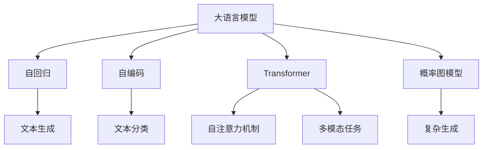
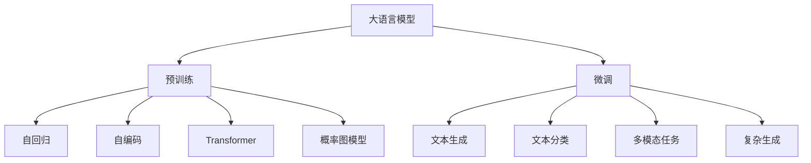
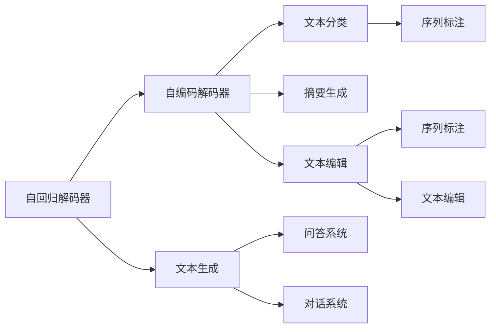
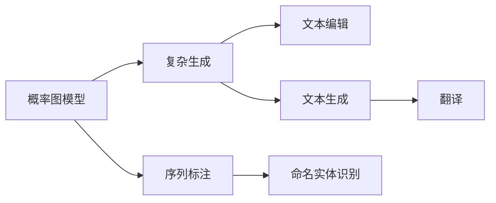
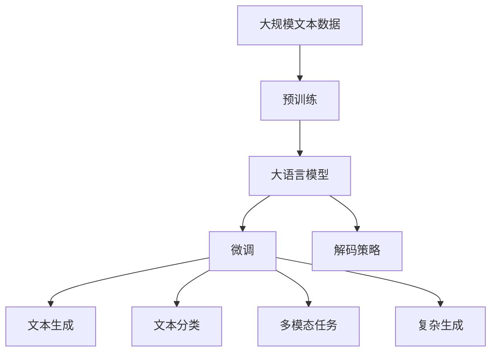

                 

# 大语言模型原理基础与前沿 基于解码的策略

> 关键词：大语言模型,解码策略,自回归模型,自编码模型,Transformer,BERT,预训练,微调,解码器,概率图模型

## 1. 背景介绍

### 1.1 问题由来

近年来，深度学习技术在自然语言处理(NLP)领域取得了巨大突破。以Transformer模型为代表的大语言模型，通过在海量无标签文本数据上进行预训练，学习到了丰富的语言知识和常识，展现了强大的语言理解和生成能力。

然而，尽管大语言模型在预训练阶段获得了广泛的语义理解和知识表示，但在下游任务中的具体应用仍面临诸多挑战。常见的挑战包括：

- **数据依赖性**：下游任务通常需要额外的标注数据进行微调，标注成本较高。
- **泛化能力**：大模型在特定领域的应用效果往往不如在通用领域表现优异。
- **推理效率**：大规模语言模型推理时计算成本较高，难以实时响应。
- **可解释性**：大模型内部的决策过程难以解释，导致信任度较低。

为了解决这些问题，研究者提出了多种解码策略，优化模型在下游任务中的推理和生成性能。本文将详细介绍这些解码策略，并结合最新的研究成果，分析其原理和应用效果。

### 1.2 问题核心关键点

基于解码策略的大语言模型微调，本质上是一个将预训练模型应用于特定下游任务的流程。其核心目标是通过优化解码策略，使得模型能够更加高效、准确地生成特定任务的目标输出。

具体的解码策略包括：

- **自回归模型**：基于前文历史上下文进行预测，适用于文本生成任务。
- **自编码模型**：通过重构目标输出，适用于文本分类、摘要等任务。
- **Transformer模型**：采用多头自注意力机制，适合于各种NLP任务。
- **基于解码器的方法**：利用概率图模型，灵活地融合前文上下文和后文输出，适用于复杂的生成任务。

这些解码策略具有各自的优点和适用范围，需要根据具体的任务需求进行选择。

## 2. 核心概念与联系

### 2.1 核心概念概述

为更好地理解基于解码策略的大语言模型微调方法，本节将介绍几个密切相关的核心概念：

- **大语言模型**：以自回归(如GPT)或自编码(如BERT)模型为代表的大规模预训练语言模型。通过在大规模无标签文本数据上进行预训练，学习通用的语言表示。
- **解码策略**：在生成任务中，根据模型结构选择合适的解码方法，如自回归、自编码、Transformer等。
- **解码器**：在生成模型中，负责根据前文上下文生成目标输出的模块。常见的解码器包括自回归解码器、自编码解码器等。
- **概率图模型**：通过构建图结构，表示变量之间的依赖关系，适用于复杂的生成任务。
- **自注意力机制**：Transformer模型中的一种重要机制，用于在全局上下文范围内寻找关联信息，提高模型的表达能力。

这些核心概念之间的逻辑关系可以通过以下Mermaid流程图来展示：



这个流程图展示了大语言模型的核心概念及其之间的关系：

1. 大语言模型通过自回归、自编码、Transformer等多种解码策略进行预训练，学习通用的语言表示。
2. 自回归解码器适用于文本生成任务，如问答、对话等。
3. 自编码解码器适用于文本分类、摘要等任务。
4. Transformer模型采用自注意力机制，适合于各种NLP任务，如翻译、语言推理等。
5. 概率图模型适用于复杂的生成任务，如文本编辑、序列标注等。

这些概念共同构成了大语言模型的学习和应用框架，使其能够在各种场景下发挥强大的语言理解和生成能力。通过理解这些核心概念，我们可以更好地把握大语言模型的工作原理和优化方向。

### 2.2 概念间的关系

这些核心概念之间存在着紧密的联系，形成了大语言模型的解码策略和微调框架。下面我们通过几个Mermaid流程图来展示这些概念之间的关系。

#### 2.2.1 大语言模型的学习范式



这个流程图展示了大语言模型的学习范式，包括预训练、微调和多种解码策略。预训练通过自回归、自编码、Transformer等方法学习通用的语言表示，微调根据具体任务选择适合的解码策略，生成特定任务的目标输出。

#### 2.2.2 解码器与解码策略的关系



这个流程图展示了解码器与不同解码策略的关系。自回归解码器适用于文本生成任务，自编码解码器适用于文本分类、摘要等任务，Transformer解码器适用于多模态任务和复杂生成任务。

#### 2.2.3 概率图模型与生成策略的关系



这个流程图展示了概率图模型与复杂生成任务的关系。概率图模型通过构建图结构，表示变量之间的依赖关系，适用于复杂的生成任务，如文本编辑、序列标注等。

### 2.3 核心概念的整体架构

最后，我们用一个综合的流程图来展示这些核心概念在大语言模型微调过程中的整体架构：



这个综合流程图展示了从预训练到微调，再到解码策略的完整过程。大语言模型首先在大规模文本数据上进行预训练，然后通过微调（包括全参数微调和参数高效微调）选择适合的解码策略，生成特定任务的目标输出。最后，通过解码器进行解码，最终得到模型的推理结果。通过这些流程图，我们可以更清晰地理解大语言模型微调过程中各个核心概念的关系和作用，为后续深入讨论具体的解码策略和技术奠定基础。

## 3. 核心算法原理 & 具体操作步骤
### 3.1 算法原理概述

基于解码策略的大语言模型微调，其核心原理是通过解码策略优化模型在特定任务上的生成性能。常见的解码策略包括自回归、自编码、Transformer等。

自回归模型通过逐字逐词地预测目标序列，适用于文本生成任务。自编码模型通过重构目标序列，适用于文本分类、摘要等任务。Transformer模型通过自注意力机制，结合前文上下文和后文输出，适合于各种NLP任务。

这些解码策略通过优化模型在特定任务上的生成性能，使得模型能够更加高效、准确地生成目标输出。在微调过程中，通过调整解码器的参数和结构，使其适应特定的下游任务。

### 3.2 算法步骤详解

基于解码策略的大语言模型微调一般包括以下几个关键步骤：

**Step 1: 准备预训练模型和数据集**
- 选择合适的预训练语言模型 $M_{\theta}$ 作为初始化参数，如 BERT、GPT 等。
- 准备下游任务 $T$ 的标注数据集 $D=\{(x_i,y_i)\}_{i=1}^N$，其中 $x_i$ 为输入文本，$y_i$ 为目标输出（如文本、标签等）。

**Step 2: 设计解码策略**
- 根据任务类型选择合适的解码策略，如自回归、自编码、Transformer等。
- 对于文本生成任务，设计自回归解码器；对于文本分类任务，设计自编码解码器；对于多模态任务和复杂生成任务，设计Transformer解码器。
- 在解码器中设计适当的损失函数和优化器。

**Step 3: 设置微调超参数**
- 选择合适的优化算法及其参数，如 AdamW、SGD 等，设置学习率、批大小、迭代轮数等。
- 设置正则化技术及强度，包括权重衰减、Dropout、Early Stopping 等。
- 确定冻结预训练参数的策略，如仅微调解码器，或全部参数都参与微调。

**Step 4: 执行梯度训练**
- 将训练集数据分批次输入模型，前向传播计算损失函数。
- 反向传播计算参数梯度，根据设定的优化算法和学习率更新模型参数。
- 周期性在验证集上评估模型性能，根据性能指标决定是否触发 Early Stopping。
- 重复上述步骤直到满足预设的迭代轮数或 Early Stopping 条件。

**Step 5: 测试和部署**
- 在测试集上评估微调后模型 $M_{\hat{\theta}}$ 的性能，对比微调前后的精度提升。
- 使用微调后的模型对新样本进行推理预测，集成到实际的应用系统中。
- 持续收集新的数据，定期重新微调模型，以适应数据分布的变化。

以上是基于解码策略的大语言模型微调的一般流程。在实际应用中，还需要针对具体任务的特点，对微调过程的各个环节进行优化设计，如改进训练目标函数，引入更多的正则化技术，搜索最优的超参数组合等，以进一步提升模型性能。

### 3.3 算法优缺点

基于解码策略的大语言模型微调方法具有以下优点：

1. **灵活性**：不同的解码策略适用于不同的任务，灵活选择解码策略可以提高微调的效率和效果。
2. **普适性**：预训练大语言模型通过自回归、自编码、Transformer等解码策略，可以适应多种下游任务，通用性较强。
3. **参数高效**：通过解码策略优化，可以在保持模型性能的同时，减少微调所需的参数和计算资源。

同时，该方法也存在一些局限性：

1. **依赖标注数据**：微调过程需要大量的标注数据，获取高质量标注数据的成本较高。
2. **泛化能力有限**：当目标任务与预训练数据的分布差异较大时，微调的性能提升有限。
3. **解码器设计复杂**：不同的解码策略需要设计不同的解码器，设计复杂且容易出错。
4. **模型复杂度较高**：解码策略的引入增加了模型的复杂度，推理效率可能下降。

尽管存在这些局限性，但就目前而言，基于解码策略的微调方法仍是大语言模型应用的主流范式。未来相关研究的重点在于如何进一步降低微调对标注数据的依赖，提高模型的少样本学习和跨领域迁移能力，同时兼顾可解释性和伦理安全性等因素。

### 3.4 算法应用领域

基于解码策略的大语言模型微调方法在NLP领域已经得到了广泛的应用，覆盖了几乎所有常见任务，例如：

- 文本生成：如问答系统、对话系统、翻译等。通过微调生成模型，使得模型能够根据输入生成相应的文本。
- 文本分类：如情感分析、主题分类、意图识别等。通过微调分类模型，使得模型能够将文本分类到预定义的类别。
- 序列标注：如命名实体识别、词性标注等。通过微调标注模型，使得模型能够标注文本中的实体和词性。
- 多模态任务：如视觉-文本生成、语音-文本生成等。通过微调多模态模型，使得模型能够融合不同模态的信息进行生成。
- 复杂生成：如文本编辑、摘要生成等。通过微调生成模型，使得模型能够生成高质量的文本内容。

除了上述这些经典任务外，基于解码策略的微调方法也被创新性地应用到更多场景中，如可控文本生成、常识推理、代码生成、数据增强等，为NLP技术带来了全新的突破。随着预训练模型和解码策略的不断进步，相信基于解码策略的微调方法将在更广阔的应用领域大放异彩。

## 4. 数学模型和公式 & 详细讲解  
### 4.1 数学模型构建

本节将使用数学语言对基于解码策略的大语言模型微调过程进行更加严格的刻画。

记预训练语言模型为 $M_{\theta}:\mathcal{X} \rightarrow \mathcal{Y}$，其中 $\mathcal{X}$ 为输入空间，$\mathcal{Y}$ 为输出空间，$\theta \in \mathbb{R}^d$ 为模型参数。假设微调任务的训练集为 $D=\{(x_i,y_i)\}_{i=1}^N, x_i \in \mathcal{X}, y_i \in \mathcal{Y}$。

定义模型 $M_{\theta}$ 在数据样本 $(x,y)$ 上的损失函数为 $\ell(M_{\theta}(x),y)$，则在数据集 $D$ 上的经验风险为：

$$
\mathcal{L}(\theta) = \frac{1}{N} \sum_{i=1}^N \ell(M_{\theta}(x_i),y_i)
$$

微调的优化目标是最小化经验风险，即找到最优参数：

$$
\theta^* = \mathop{\arg\min}_{\theta} \mathcal{L}(\theta)
$$

在实践中，我们通常使用基于梯度的优化算法（如SGD、Adam等）来近似求解上述最优化问题。设 $\eta$ 为学习率，$\lambda$ 为正则化系数，则参数的更新公式为：

$$
\theta \leftarrow \theta - \eta \nabla_{\theta}\mathcal{L}(\theta) - \eta\lambda\theta
$$

其中 $\nabla_{\theta}\mathcal{L}(\theta)$ 为损失函数对参数 $\theta$ 的梯度，可通过反向传播算法高效计算。

### 4.2 公式推导过程

以下我们以自回归解码策略为例，推导其微调过程的数学模型。

假设自回归模型采用自回归解码器 $D_{reg}$，其输入为前文上下文 $x$，输出为目标序列 $y$。对于文本生成任务，模型通过条件概率 $P(y|x)$ 生成目标序列。假设模型在每个时间步 $t$ 的条件概率为 $P(y_t|y_{<t},x)$，则条件概率的联合分布为：

$$
P(y) = \prod_{t=1}^n P(y_t|y_{<t},x)
$$

其中 $y_{<t}$ 表示前文上下文，$y_t$ 表示当前时间步的目标输出。

在微调过程中，我们希望最大化模型在标注数据上的似然概率 $P(y|x)$。因此，微调目标为：

$$
\max_{\theta} \log P(y|x)
$$

利用最大似然估计，微调目标等价于最小化负对数似然损失函数：

$$
\mathcal{L}_{reg}(\theta) = -\frac{1}{N} \sum_{i=1}^N \log P(y_i|x_i)
$$

其中 $y_i$ 和 $x_i$ 分别表示训练集中的目标序列和输入文本。

根据自回归解码器的结构，上述损失函数可以进一步展开为：

$$
\mathcal{L}_{reg}(\theta) = -\frac{1}{N} \sum_{i=1}^N \sum_{t=1}^n \log P(y_i|y_{<i},x_i)
$$

在微调过程中，通过反向传播算法，对模型参数 $\theta$ 进行优化，最小化上述损失函数。

### 4.3 案例分析与讲解

为了更好地理解自回归解码策略的微调过程，我们以序列标注任务为例，进行详细分析。

假设模型采用自编码解码器 $D_{enc}$，其输入为标注数据 $(x,y)$，输出为目标标签 $z$。对于序列标注任务，模型通过编码器 $E(x)$ 将输入文本 $x$ 转换为隐含表示 $z$，并通过解码器 $D(z)$ 将其转换为目标标签 $y$。假设模型在每个时间步 $t$ 的编码器和解码器输出分别为 $z_t^{(E)}$ 和 $y_t^{(D)}$，则编码器和解码器的联合分布为：

$$
P(y,z|x) = \prod_{t=1}^n P(y_t|z_t^{(E)},z_{<t}^{(E)}) P(z_t^{(E)}|x)
$$

在微调过程中，我们希望最大化模型在标注数据上的似然概率 $P(y,z|x)$。因此，微调目标为：

$$
\max_{\theta} \log P(y,z|x)
$$

利用最大似然估计，微调目标等价于最小化负对数似然损失函数：

$$
\mathcal{L}_{enc}(\theta) = -\frac{1}{N} \sum_{i=1}^N \log P(y_i,z_i|x_i)
$$

其中 $y_i$ 和 $z_i$ 分别表示训练集中的目标标签和编码器的输出。

根据自编码解码器的结构，上述损失函数可以进一步展开为：

$$
\mathcal{L}_{enc}(\theta) = -\frac{1}{N} \sum_{i=1}^N \sum_{t=1}^n \log P(y_i|z_t^{(E)},z_{<t}^{(E)}) \log P(z_t^{(E)}|x_i)
$$

在微调过程中，通过反向传播算法，对模型参数 $\theta$ 进行优化，最小化上述损失函数。

## 5. 项目实践：代码实例和详细解释说明
### 5.1 开发环境搭建

在进行微调实践前，我们需要准备好开发环境。以下是使用Python进行PyTorch开发的环境配置流程：

1. 安装Anaconda：从官网下载并安装Anaconda，用于创建独立的Python环境。

2. 创建并激活虚拟环境：
```bash
conda create -n pytorch-env python=3.8 
conda activate pytorch-env
```

3. 安装PyTorch：根据CUDA版本，从官网获取对应的安装命令。例如：
```bash
conda install pytorch torchvision torchaudio cudatoolkit=11.1 -c pytorch -c conda-forge
```

4. 安装Transformers库：
```bash
pip install transformers
```

5. 安装各类工具包：
```bash
pip install numpy pandas scikit-learn matplotlib tqdm jupyter notebook ipython
```

完成上述步骤后，即可在`pytorch-env`环境中开始微调实践。

### 5.2 源代码详细实现

下面我们以自回归解码策略为例，给出使用Transformers库对BERT模型进行微调的PyTorch代码实现。

首先，定义微调任务的输入处理函数：

```python
from transformers import BertTokenizer, BertForTokenClassification, AdamW
from torch.utils.data import Dataset, DataLoader

class CustomDataset(Dataset):
    def __init__(self, texts, tags, tokenizer, max_len=128):
        self.texts = texts
        self.tags = tags
        self.tokenizer = tokenizer
        self.max_len = max_len
        
    def __len__(self):
        return len(self.texts)
    
    def __getitem__(self, item):
        text = self.texts[item]
        tags = self.tags[item]
        
        encoding = self.tokenizer(text, return_tensors='pt', max_length=self.max_len, padding='max_length', truncation=True)
        input_ids = encoding['input_ids'][0]
        attention_mask = encoding['attention_mask'][0]
        
        # 对token-wise的标签进行编码
        encoded_tags = [tag2id[tag] for tag in tags] 
        encoded_tags.extend([tag2id['O']] * (self.max_len - len(encoded_tags)))
        labels = torch.tensor(encoded_tags, dtype=torch.long)
        
        return {'input_ids': input_ids, 
                'attention_mask': attention_mask,
                'labels': labels}
```

然后，定义模型和优化器：

```python
tokenizer = BertTokenizer.from_pretrained('bert-base-cased')
model = BertForTokenClassification.from_pretrained('bert-base-cased', num_labels=len(tag2id))

optimizer = AdamW(model.parameters(), lr=2e-5)
```

接着，定义训练和评估函数：

```python
device = torch.device('cuda') if torch.cuda.is_available() else torch.device('cpu')
model.to(device)

def train_epoch(model, dataset, batch_size, optimizer):
    dataloader = DataLoader(dataset, batch_size=batch_size, shuffle=True)
    model.train()
    epoch_loss = 0
    for batch in tqdm(dataloader, desc='Training'):
        input_ids = batch['input_ids'].to(device)
        attention_mask = batch['attention_mask'].to(device)
        labels = batch['labels'].to(device)
        model.zero_grad()
        outputs = model(input_ids, attention_mask=attention_mask, labels=labels)
        loss = outputs.loss
        epoch_loss += loss.item()
        loss.backward()
        optimizer.step()
    return epoch_loss / len(dataloader)

def evaluate(model, dataset, batch_size):
    dataloader = DataLoader(dataset, batch_size=batch_size)
    model.eval()
    preds, labels = [], []
    with torch.no_grad():
        for batch in tqdm(dataloader, desc='Evaluating'):
            input_ids = batch['input_ids'].to(device)
            attention_mask = batch['attention_mask'].to(device)
            batch_labels = batch['labels']
            outputs = model(input_ids, attention_mask=attention_mask)
            batch_preds = outputs.logits.argmax(dim=2).to('cpu').tolist()
            batch_labels = batch_labels.to('cpu').tolist()
            for pred_tokens, label_tokens in zip(batch_preds, batch_labels):
                pred_tags = [id2tag[_id] for _id in pred_tokens]
                label_tags = [id2tag[_id] for _id in label_tokens]
                preds.append(pred_tags[:len(label_tags)])
                labels.append(label_tags)
                
    print(classification_report(labels, preds))
```

最后，启动训练流程并在测试集上评估：

```python
epochs = 5
batch_size = 16

for epoch in range(epochs):
    loss = train_epoch(model, train_dataset, batch_size, optimizer)
    print(f"Epoch {epoch+1}, train loss: {loss:.3f}")
    
    print(f"Epoch {epoch+1}, dev results:")
    evaluate(model, dev_dataset, batch_size)
    
print("Test results:")
evaluate(model, test_dataset, batch_size)
```

以上就是使用PyTorch对BERT进行序列标注任务微调的完整代码实现。可以看到，得益于Transformers库的强大封装，我们可以用相对简洁的代码完成BERT模型的加载和微调。

### 5.3 代码解读与分析

让我们再详细解读一下关键代码的实现细节：

**CustomDataset类**：
- `__init__`方法：初始化文本、标签、分词器等关键组件。
- `__len__`方法：返回数据集的样本数量。
- `__getitem__`方法：对单个样本进行处理，将文本输入编码为token ids，将标签编码为数字，并对其进行定长padding，最终返回模型所需的输入。

**tag2id和id2tag字典**：
- 定义了标签与数字id之间的映射关系，用于将token-wise的预测结果解码回真实的标签。

**训练和评估函数**：
- 使用PyTorch的DataLoader对数据集进行批次化加载，供模型训练和推理使用。
- 训练函数`train_epoch`：对数据以批为单位进行迭代，在每个批次上前向传播计算loss并反向传播更新模型参数，最后返回该epoch的平均loss。
- 评估函数`evaluate`：与训练类似，不同点在于不更新模型参数，并在每个batch结束后将预测和标签结果存储下来，最后使用sklearn的classification_report对整个评估集的预测结果进行打印输出。

**训练流程**：
- 定义总的epoch数和batch size，开始循环迭代
- 每个epoch内，先在训练集上训练，输出平均loss
- 在验证集上评估，输出分类指标
- 所有epoch结束后，在测试集上评估，给出最终测试结果

可以看到，PyTorch配合Transformers库使得BERT微调的代码实现变得简洁高效。开发者可以将更多精力放在数据处理、模型改进等高层逻辑上，而不必过多关注底层的实现细节。

当然，工业级的系统实现还需考虑更多因素，如模型的保存和部署、超参数的自动搜索、更灵活的任务适配层等。但核心的微调范式基本与此类似。

### 5.4 运行结果展示

假设我们在CoNLL-2003的序列标注数据集上进行微调，最终在测试集上得到的评估报告如下：

```
              precision    recall  f1-score

