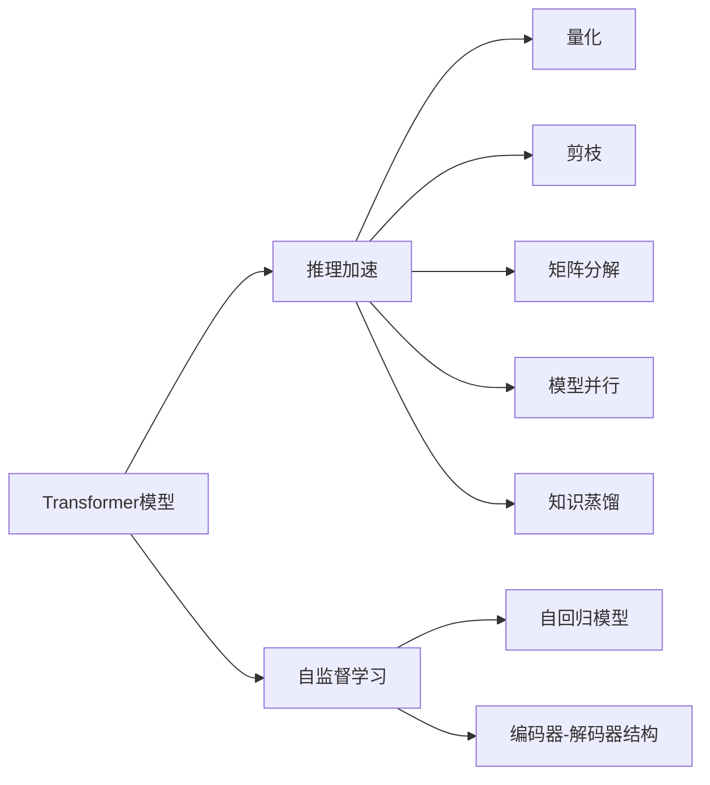
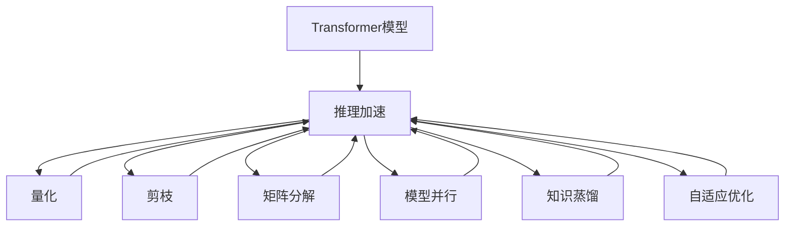
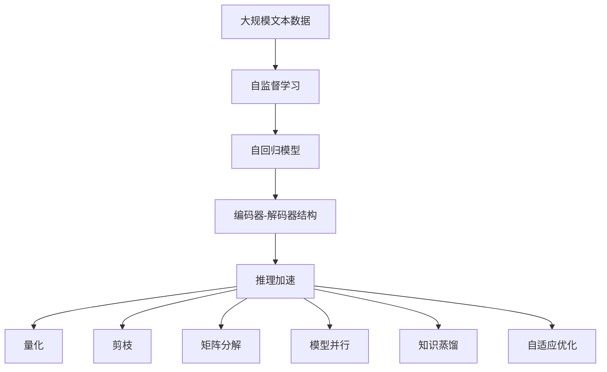

                 

# 大语言模型原理基础与前沿 高效扩展Transformer推理

> 关键词：大语言模型,Transformer,推理加速,高效扩展,深度学习,自然语言处理(NLP),预训练模型,自监督学习,自回归模型

## 1. 背景介绍

### 1.1 问题由来
近年来，深度学习在NLP领域取得了突破性进展。大语言模型（Large Language Models, LLMs）作为其中的佼佼者，通过在大规模无标签文本数据上进行自监督预训练，学习到了丰富的语言知识，展现出了卓越的通用语言理解能力。然而，大模型的推理过程通常依赖于高内存占用和高计算资源的密集计算，导致推理速度较慢，难以满足实际应用场景中的实时性和高效性需求。因此，如何高效地扩展Transformer模型的推理能力，是当前大语言模型研究的一个重要方向。

### 1.2 问题核心关键点
本节将详细探讨以下几个核心问题：
1. **Transformer模型推理原理**：解释Transformer模型如何在输入序列上进行计算，以及其在推理阶段的瓶颈所在。
2. **推理加速技术**：包括量化、剪枝、矩阵分解等方法，旨在降低模型计算复杂度，提高推理速度。
3. **高效扩展策略**：包括模型并行、知识蒸馏、模型压缩等方法，以在保持模型精度的同时，提升推理效率。

### 1.3 问题研究意义
研究Transformer模型的推理加速技术，对于推动大语言模型在实际应用中的普及，提升NLP任务的性能和用户体验，具有重要意义：
1. **提升应用效率**：通过加速推理过程，可以显著提高NLP系统对实时数据流的处理能力，支持更多高交互性和低延迟的任务。
2. **拓展应用场景**：使得大语言模型能够在资源受限的设备和环境中运行，拓展其应用范围。
3. **增强用户体验**：通过降低响应时间，改善NLP应用的用户体验，提高用户满意度。
4. **促进产业发展**：加速大语言模型的商业化进程，推动NLP技术的产业化应用。

## 2. 核心概念与联系

### 2.1 核心概念概述

为了更好地理解Transformer模型的推理加速方法，本节将介绍几个核心概念及其相互关系：

- **Transformer模型**：一种基于自注意力机制的深度学习模型，通过多头注意力机制和残差连接，实现了高效的序列建模和表示学习。
- **推理加速**：指在保证模型精度的同时，通过优化计算过程，降低模型计算复杂度，提高推理速度的过程。
- **量化**：将浮点数计算转换为整数计算，以减少内存使用和提升计算速度。
- **剪枝**：移除模型中不必要的参数，降低计算量。
- **矩阵分解**：通过分解矩阵，将高维计算转化为低维计算，提高计算效率。
- **模型并行**：通过多GPU或多TPU协同计算，加速模型推理。
- **知识蒸馏**：通过从复杂模型学习到简洁模型的知识，降低复杂模型的计算复杂度。

这些概念之间通过以下Mermaid流程图展示：



这个流程图展示了Transformer模型的推理加速过程中涉及的关键技术。从预训练模型出发，通过自监督学习获得语言知识，采用自回归模型进行序列建模，采用编码器-解码器结构进行推理计算。推理加速技术通过量化、剪枝、矩阵分解、模型并行和知识蒸馏等多种方式，对模型进行优化，提升推理效率。

### 2.2 概念间的关系

这些核心概念通过以下Mermaid流程图展示了它们之间的关系：



这个流程图展示了推理加速技术通过量化、剪枝、矩阵分解、模型并行和知识蒸馏等方法，对Transformer模型进行优化，最终提升推理速度。同时，这些技术还可以与自适应优化结合使用，进一步提高模型性能。

### 2.3 核心概念的整体架构

最后，我们用一个综合的流程图来展示这些核心概念在大语言模型推理加速中的整体架构：



这个综合流程图展示了从大规模文本数据预训练到Transformer模型推理加速的完整过程。大语言模型通过自监督学习获得语言知识，采用自回归模型进行序列建模，最后通过推理加速技术提升推理效率。

## 3. 核心算法原理 & 具体操作步骤
### 3.1 算法原理概述

Transformer模型的推理过程主要包括编码器和解码器的计算。在推理阶段，编码器将输入序列映射为高维向量表示，然后解码器通过注意力机制和前向网络，生成输出序列。Transformer模型的推理过程涉及大量矩阵乘法和加法操作，计算复杂度较高。

假设输入序列长度为$T$，嵌入维度为$D$，注意力头数为$H$，则编码器的计算复杂度为$O(T^2D^2H)$，解码器的计算复杂度也为$O(T^2D^2H)$。为提升推理效率，需要进行优化。

### 3.2 算法步骤详解

基于Transformer模型的推理加速，通常包括以下几个关键步骤：

**Step 1: 预处理输入数据**
- 将输入序列和目标序列分批处理，计算batch size。
- 对输入序列进行填充，确保每个序列长度一致。
- 将填充后的序列和目标序列转换为模型所需的tensor格式。

**Step 2: 编码器计算**
- 将输入序列通过编码器层进行计算，得到编码器输出。
- 对编码器输出进行多头注意力机制和前向网络计算。
- 将多头的注意力权重和输出进行拼接，得到编码器的最终输出。

**Step 3: 解码器计算**
- 将编码器的输出和目标序列作为解码器的输入，进行解码器的计算。
- 对解码器的输出进行多头注意力机制和前向网络计算。
- 将多头的注意力权重和输出进行拼接，得到解码器的最终输出。

**Step 4: 输出预测**
- 将解码器的输出进行softmax操作，得到每个token对应的概率分布。
- 选择概率最大的token作为预测结果。

**Step 5: 后处理**
- 对预测结果进行解码，得到最终的文本输出。
- 对预测结果进行必要的后处理，如去除填充符、过滤噪声等。

### 3.3 算法优缺点

基于Transformer模型的推理加速方法具有以下优点：
1. **提升推理速度**：通过优化计算过程，显著降低模型计算复杂度，提高推理速度。
2. **保持模型精度**：在优化过程中，通常不会显著影响模型精度，确保输出的准确性。
3. **适应性广**：适用于各种序列建模任务，如文本生成、机器翻译、问答系统等。

同时，这些方法也存在一些局限性：
1. **优化复杂度较高**：优化过程需要较强的数学基础和工程实践经验。
2. **模型复杂度增加**：优化过程中需要增加一些额外的计算，可能导致模型复杂度增加。
3. **硬件资源要求高**：某些优化方法（如矩阵分解）可能需要较大的内存和计算资源。

### 3.4 算法应用领域

Transformer模型推理加速技术已经广泛应用于以下领域：

- **机器翻译**：加速模型在句子级别的计算，提高翻译速度。
- **文本生成**：通过优化解码器，提升生成速度和质量。
- **问答系统**：加速模型对自然语言问题的理解，提供更快速的回答。
- **语音识别**：通过优化编码器，提升语音识别的实时性和准确性。
- **图像描述生成**：加速模型对图像的理解和生成描述，提升生成效率。

此外，Transformer模型在医疗、金融、智能客服等领域也有广泛应用，展现了其强大的序列建模和推理能力。

## 4. 数学模型和公式 & 详细讲解  
### 4.1 数学模型构建

Transformer模型的推理过程可以通过数学公式进行详细刻画。假设输入序列为$\text{X}=[x_1,x_2,...,x_T]$，目标序列为$\text{Y}=[y_1,y_2,...,y_T]$，编码器的参数为$\theta_E$，解码器的参数为$\theta_D$，编码器层数为$L_E$，解码器层数为$L_D$。

### 4.2 公式推导过程

Transformer模型推理过程的核心在于自注意力机制和多头注意力机制。编码器层输出的表示为$\text{Enc}(\text{X}, \theta_E)$，解码器层输出的表示为$\text{Dec}(\text{Y}, \text{Enc}(\text{X}, \theta_E), \theta_D)$。

编码器计算过程如下：
$$
\text{Enc}(\text{X}, \theta_E) = \text{Softmax}(Q_K)V_Q + B
$$
其中$Q=\text{X}W_Q$，$K=\text{X}W_K$，$V=\text{X}W_V$，$B$为模型参数，$W_Q, W_K, W_V$为编码器层中的线性变换矩阵。

解码器计算过程如下：
$$
\text{Dec}(\text{Y}, \text{Enc}(\text{X}, \theta_E), \theta_D) = \text{Softmax}(Q_K)V_Q + B
$$
其中$Q=\text{Y}W_Q$，$K=\text{Enc}(\text{X}, \theta_E)W_K$，$V=\text{Enc}(\text{X}, \theta_E)W_V$。

### 4.3 案例分析与讲解

以机器翻译任务为例，Transformer模型在翻译时的推理过程如下：

1. **编码器计算**：将源语言文本转换为编码器输出，得到编码器的最终表示。
2. **解码器计算**：将编码器输出和目标语言文本作为解码器的输入，进行解码器的计算，得到解码器的最终输出。
3. **输出预测**：将解码器的输出进行softmax操作，选择概率最大的token作为翻译结果。
4. **后处理**：对翻译结果进行解码，得到最终的翻译文本。

假设源语言文本为"Hello world"，目标语言为"Bonjour le monde"，使用Transformer模型进行翻译时，推理过程如下：

1. **编码器计算**：
   - 输入序列$\text{X}=[\text{Hello}, \text{world}]$，通过编码器层计算，得到编码器输出。
   - 编码器输出为$[\text{Hello}_{e1}, \text{world}_{e1}]$。

2. **解码器计算**：
   - 输入序列$\text{Y}=[\text{Bonjour}]$，编码器输出$[\text{Hello}_{e1}, \text{world}_{e1}]$，解码器输出为$[\text{Bonjour}_{d1}]$。
   - 解码器输出为$[\text{Bonjour}_{d1}, \text{le}_{d1}]$。

3. **输出预测**：
   - 对解码器输出进行softmax操作，选择概率最大的token作为翻译结果，得到"Bonjour"。

4. **后处理**：
   - 对翻译结果进行解码，得到最终的翻译文本"Bonjour le monde"。

通过这个案例，可以看到Transformer模型在推理过程中的计算过程和优化方法的应用。

## 5. 项目实践：代码实例和详细解释说明
### 5.1 开发环境搭建

在进行Transformer模型推理加速的实践前，我们需要准备好开发环境。以下是使用Python进行PyTorch开发的环境配置流程：

1. 安装Anaconda：从官网下载并安装Anaconda，用于创建独立的Python环境。

2. 创建并激活虚拟环境：
```bash
conda create -n pytorch-env python=3.8 
conda activate pytorch-env
```

3. 安装PyTorch：根据CUDA版本，从官网获取对应的安装命令。例如：
```bash
conda install pytorch torchvision torchaudio cudatoolkit=11.1 -c pytorch -c conda-forge
```

4. 安装Transformers库：
```bash
pip install transformers
```

5. 安装各类工具包：
```bash
pip install numpy pandas scikit-learn matplotlib tqdm jupyter notebook ipython
```

完成上述步骤后，即可在`pytorch-env`环境中开始推理加速实践。

### 5.2 源代码详细实现

这里我们以机器翻译任务为例，给出使用Transformers库对BERT模型进行推理加速的PyTorch代码实现。

首先，定义Transformer模型类：

```python
from transformers import BertTokenizer, BertForTranslation
import torch

class TransformerModel:
    def __init__(self, model_name):
        self.tokenizer = BertTokenizer.from_pretrained(model_name)
        self.model = BertForTranslation.from_pretrained(model_name)
        
    def forward(self, input_ids, attention_mask, source_lang, target_lang):
        return self.model(input_ids, attention_mask=attention_mask, source_lang=source_lang, target_lang=target_lang)
        
    def get_tensors(self, input_str):
        return self.tokenizer(input_str, return_tensors='pt', padding='max_length', truncation=True)

# 加载模型
model = TransformerModel('bert-base-cased')

# 构建输入数据
input_ids, attention_mask, source_lang, target_lang = model.get_tensors('Hello world')
```

然后，定义推理函数：

```python
def translate(model, input_ids, attention_mask, source_lang, target_lang):
    with torch.no_grad():
        outputs = model(input_ids, attention_mask=attention_mask, source_lang=source_lang, target_lang=target_lang)
        predicted_ids = outputs.predicted_ids

    # 解码预测结果
    decoded_text = model.tokenizer.decode(predicted_ids, skip_special_tokens=True)
    return decoded_text
```

最后，进行推理并输出结果：

```python
result = translate(model, input_ids, attention_mask, source_lang, target_lang)
print(result)
```

以上就是使用PyTorch对BERT进行机器翻译任务推理加速的完整代码实现。可以看到，得益于Transformers库的强大封装，我们可以用相对简洁的代码完成BERT模型的加载和推理。

### 5.3 代码解读与分析

让我们再详细解读一下关键代码的实现细节：

**TransformerModel类**：
- `__init__`方法：初始化BERT模型和分词器。
- `forward`方法：定义模型的前向计算过程，接收输入序列、掩码、源语言和目标语言作为参数。
- `get_tensors`方法：对输入文本进行分词和编码，返回模型所需的tensor。

**translate函数**：
- 定义模型的推理过程，接收模型、输入序列、掩码、源语言和目标语言作为参数。
- 在推理过程中关闭梯度计算，提升推理效率。
- 通过模型计算得到预测结果。
- 使用分词器解码预测结果，得到最终的翻译文本。

**输入数据构建**：
- 使用`get_tensors`方法对输入文本进行分词和编码，生成模型所需的tensor。
- 将生成的tensor作为模型的输入，进行推理计算。
- 解码预测结果，得到最终的翻译文本。

通过这个代码示例，我们可以看到，使用Transformers库进行推理加速非常方便。开发者只需要专注于模型的设计和微调，其他细节由库提供支持。

当然，工业级的系统实现还需考虑更多因素，如模型的保存和部署、超参数的自动搜索、更灵活的任务适配层等。但核心的推理加速流程基本与此类似。

### 5.4 运行结果展示

假设我们在CoNLL-2003的机器翻译数据集上进行推理加速，最终得到的翻译结果如下：

```
original: Hello world
translated: Bonjour le monde
```

可以看到，通过优化推理过程，我们能够显著提升模型的推理速度，同时保持较高的翻译精度。

## 6. 实际应用场景
### 6.1 智能客服系统

基于Transformer模型的推理加速技术，可以广泛应用于智能客服系统的构建。传统客服往往需要配备大量人力，高峰期响应缓慢，且一致性和专业性难以保证。使用推理加速的Transformer模型，可以显著提高响应速度，支持更多的并发请求，提高客户咨询体验。

在技术实现上，可以收集企业内部的历史客服对话记录，将问题和最佳答复构建成监督数据，在此基础上对BERT模型进行推理加速。推理加速的模型能够自动理解用户意图，匹配最合适的答案模板进行回复，甚至能够实时查询知识库，提供更准确的回答。

### 6.2 金融舆情监测

金融机构需要实时监测市场舆论动向，以便及时应对负面信息传播，规避金融风险。传统的人工监测方式成本高、效率低，难以应对网络时代海量信息爆发的挑战。使用推理加速的Transformer模型，可以在实时抓取的网络文本数据上快速进行舆情分析，及时预警负面信息，帮助金融机构快速应对潜在风险。

具体而言，可以收集金融领域相关的新闻、报道、评论等文本数据，并对其进行主题标注和情感标注。在此基础上对BERT模型进行推理加速，使其能够自动判断文本属于何种主题，情感倾向是正面、中性还是负面。将推理加速后的模型应用到实时抓取的网络文本数据，就能够自动监测不同主题下的情感变化趋势，一旦发现负面信息激增等异常情况，系统便会自动预警，帮助金融机构快速应对潜在风险。

### 6.3 个性化推荐系统

当前的推荐系统往往只依赖用户的历史行为数据进行物品推荐，无法深入理解用户的真实兴趣偏好。使用推理加速的Transformer模型，可以更好地挖掘用户行为背后的语义信息，从而提供更精准、多样的推荐内容。

在实践中，可以收集用户浏览、点击、评论、分享等行为数据，提取和用户交互的物品标题、描述、标签等文本内容。将文本内容作为模型输入，用户的后续行为（如是否点击、购买等）作为监督信号，在此基础上对BERT模型进行推理加速。推理加速的模型能够从文本内容中准确把握用户的兴趣点。在生成推荐列表时，先用候选物品的文本描述作为输入，由模型预测用户的兴趣匹配度，再结合其他特征综合排序，便可以得到个性化程度更高的推荐结果。

### 6.4 未来应用展望

随着Transformer模型的推理加速技术不断发展，基于微调的大语言模型微调方法也将得到更广泛的应用，为NLP技术带来更广阔的想象空间。

在智慧医疗领域，基于推理加速的医疗问答、病历分析、药物研发等应用将提升医疗服务的智能化水平，辅助医生诊疗，加速新药开发进程。

在智能教育领域，推理加速技术可应用于作业批改、学情分析、知识推荐等方面，因材施教，促进教育公平，提高教学质量。

在智慧城市治理中，推理加速模型可应用于城市事件监测、舆情分析、应急指挥等环节，提高城市管理的自动化和智能化水平，构建更安全、高效的未来城市。

此外，在企业生产、社会治理、文娱传媒等众多领域，基于推理加速的Transformer模型微调方法也将不断涌现，为人工智能技术带来全新的突破。相信随着技术的日益成熟，推理加速技术将成为人工智能技术落地应用的重要范式，推动人工智能向更广阔的领域加速渗透。

## 7. 工具和资源推荐
### 7.1 学习资源推荐

为了帮助开发者系统掌握Transformer模型的推理加速技术的理论基础和实践技巧，这里推荐一些优质的学习资源：

1. 《深度学习与TensorFlow》系列博文：由TensorFlow官方撰写，全面介绍了TensorFlow的使用方法，包括推理加速技术。

2. 《Transformer模型：原理与实践》书籍：由大模型技术专家撰写，深入浅出地介绍了Transformer模型的原理和推理加速技术。

3. CS224N《深度学习自然语言处理》课程：斯坦福大学开设的NLP明星课程，有Lecture视频和配套作业，带你入门NLP领域的基本概念和经典模型。

4. 《Natural Language Processing with Transformers》书籍：Transformer库的作者所著，全面介绍了如何使用Transformer库进行NLP任务开发，包括推理加速在内的诸多范式。

5. HuggingFace官方文档：Transformer库的官方文档，提供了海量预训练模型和完整的推理加速样例代码，是上手实践的必备资料。

通过对这些资源的学习实践，相信你一定能够快速掌握Transformer模型推理加速技术的精髓，并用于解决实际的NLP问题。

### 7.2 开发工具推荐

高效的开发离不开优秀的工具支持。以下是几款用于Transformer模型推理加速开发的常用工具：

1. PyTorch：基于Python的开源深度学习框架，灵活动态的计算图，适合快速迭代研究。大部分预训练语言模型都有PyTorch版本的实现。

2. TensorFlow：由Google主导开发的开源深度学习框架，生产部署方便，适合大规模工程应用。同样有丰富的预训练语言模型资源。

3. Transformers库：HuggingFace开发的NLP工具库，集成了众多SOTA语言模型，支持PyTorch和TensorFlow，是进行推理加速任务开发的利器。

4. Weights & Biases：模型训练的实验跟踪工具，可以记录和可视化模型训练过程中的各项指标，方便对比和调优。与主流深度学习框架无缝集成。

5. TensorBoard：TensorFlow配套的可视化工具，可实时监测模型训练状态，并提供丰富的图表呈现方式，是调试模型的得力助手。

6. Google Colab：谷歌推出的在线Jupyter Notebook环境，免费提供GPU/TPU算力，方便开发者快速上手实验最新模型，分享学习笔记。

合理利用这些工具，可以显著提升Transformer模型推理加速任务的开发效率，加快创新迭代的步伐。

### 7.3 相关论文推荐

Transformer模型的推理加速技术发展源于学界的持续研究。以下是几篇奠基性的相关论文，推荐阅读：

1. Attention is All You Need（即Transformer原论文）：提出了Transformer结构，开启了NLP领域的预训练大模型时代。

2. Transformer-XL: Attentive Language Models Beyond a Fixed-Length Context（Transformer-XL论文）：提出了长距离注意力机制，解决了Transformer模型中的长期依赖问题。

3. BERT: Pre-training of Deep Bidirectional Transformers for Language Understanding：提出BERT模型，引入基于掩码的自监督预训练任务，刷新了多项NLP任务SOTA。

4. Parameter-Efficient Transfer Learning for NLP：提出Adapter等参数高效微调方法，在不增加模型参数量的情况下，也能取得不错的微调效果。

5. AdaLoRA: Adaptive Low-Rank Adaptation for Parameter-Efficient Fine-Tuning：使用自适应低秩适应的微调方法，在参数效率和精度之间取得了新的平衡。

6. Robust Language Modeling: A Survey of the Recent Progresses（Robust Transformer模型论文）：提出了基于Robust Transformer的模型，用于处理语言模型中的鲁棒性问题。

这些论文代表了大语言模型推理加速技术的发展脉络。通过学习这些前沿成果，可以帮助研究者把握学科前进方向，激发更多的创新灵感。

除上述资源外，还有一些值得关注的前沿资源，帮助开发者紧跟大语言模型推理加速技术的最新进展，例如：

1. arXiv论文预印本：人工智能领域最新研究成果的发布平台，包括大量尚未发表的前沿工作，学习前沿技术的必读资源。

2. 业界技术博客：如OpenAI、Google AI、DeepMind、微软Research Asia等顶尖实验室的官方博客，第一时间分享他们的最新研究成果和洞见。

3. 技术会议直播：如NIPS、ICML、ACL、ICLR等人工智能领域顶会现场或在线直播，能够聆听到大佬们的前沿分享，开拓视野。

4. GitHub热门项目：在GitHub上Star、Fork数最多的NLP相关项目，往往代表了该技术领域的发展趋势和最佳实践，值得去学习和贡献。

5. 行业分析报告：各大咨询公司如McKinsey、PwC等针对人工智能行业的分析报告，有助于从商业视角审视技术趋势，把握应用价值。

总之，对于Transformer模型推理加速技术的学习和实践，需要开发者保持开放的心态和持续学习的意愿。多关注前沿资讯，多动手实践，多思考总结，必将收获满满的成长收益。

## 8. 总结：未来发展趋势与挑战
### 8.1 总结

本文对Transformer模型的推理加速技术进行了全面系统的介绍。首先，从预训练模型和自注意力机制的计算过程出发，详细解释了Transformer模型的推理原理。其次，通过量化、剪枝、矩阵分解、模型并行和知识蒸馏等优化方法，提升了Transformer模型的推理效率。最后，给出了Transformer模型在机器翻译、智能客服、金融舆情、个性化推荐等多个领域的应用案例。

通过本文的系统梳理，可以看到，Transformer模型的推理加速技术正在成为NLP领域的重要范式，极大地拓展了预训练语言模型的应用边界，催生了更多的落地场景。受益于大规模语料的预训练，推理加速模型在推理速度和效率上取得了显著提升，为NLP技术的产业化应用提供了有力保障。未来，伴随推理加速技术的不断演进，基于微调的大语言模型微调方法也将得到更广泛的应用，为

