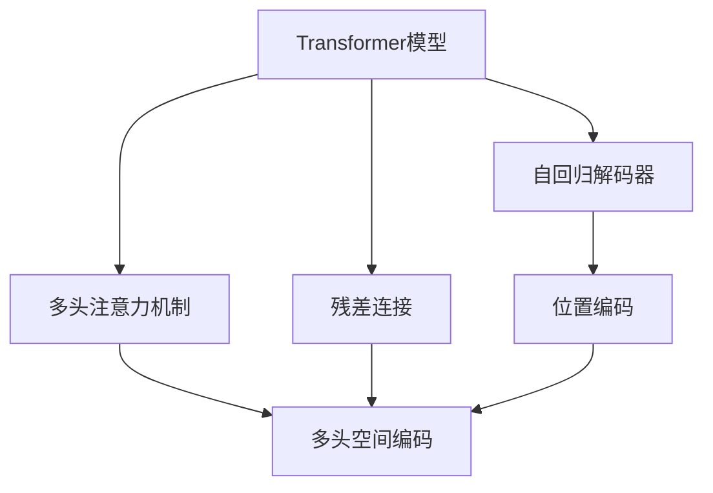
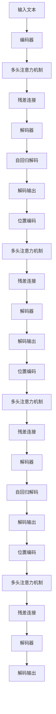

                 

# 大语言模型应用指南：Transformer解码器详解

> 关键词：大语言模型, Transformer, 解码器, 自然语言处理(NLP), 自回归, 自编码, 注意力机制, 多头注意力, 残差连接, 位置编码

## 1. 背景介绍

### 1.1 问题由来
在深度学习驱动的自然语言处理(NLP)领域，大语言模型(Large Language Models, LLMs)如BERT、GPT系列等，通过在大量无标签文本数据上预训练，学习到通用的语言表示，具备强大的语言理解和生成能力。然而，这些模型往往对输入文本进行自回归或自编码解码，解码效率较低。

为解决这一问题，Transformer模型通过多头注意力机制和残差连接，极大地提升了模型训练和推理的效率。在Transformer模型的基础上，自回归解码器的应用使得模型能够对输入文本进行双向编码，不仅提升了模型的语言理解能力，还提高了解码效率。本指南将详细阐述Transformer解码器的原理、应用及其实现技巧，帮助读者更好地理解和应用这一高效解码机制。

### 1.2 问题核心关键点
Transformer解码器是大语言模型应用中的核心组件之一，通过多头注意力机制和残差连接，实现了高效的双向编码和解码。其关键点包括：
1. **多头注意力机制**：在解码阶段，Transformer模型能够同时关注输入文本和前一时刻的输出，通过多头注意力实现语义和句法信息的并行处理。
2. **残差连接**：通过残差连接，在解码过程中保留了部分已有信息，避免了梯度消失问题。
3. **自回归解码**：与自编码解码不同，自回归解码器能够对输入文本进行双向编码，同时保留部分已有信息，提升模型的语言生成能力。

这些关键点构成了Transformer解码器的核心逻辑，使其在解码阶段能够高效地处理长文本，生成高质量的输出。

### 1.3 问题研究意义
研究Transformer解码器，对于提升大语言模型的解码效率和语言生成能力，降低计算成本，具有重要意义：
1. **提升解码效率**：通过多头注意力和残差连接，Transformer解码器能够在解码阶段同时处理语义和句法信息，大幅提升解码速度。
2. **提高语言生成能力**：自回归解码机制使得模型能够双向编码输入文本，保留部分已有信息，生成更连贯、准确的输出。
3. **降低计算成本**：解码器的高效性减少了计算资源的需求，使大语言模型能够应用于更多实际场景。
4. **优化模型训练**：通过更高效的解码机制，优化了模型的训练过程，提高了训练速度和效果。

Transformer解码器是构建大语言模型的重要组件，掌握其原理和实现技巧，对于推动NLP技术的发展具有重要价值。

## 2. 核心概念与联系

### 2.1 核心概念概述

为更好地理解Transformer解码器的原理和应用，本节将介绍几个密切相关的核心概念：

- **Transformer模型**：基于自注意力机制的深度学习模型，通过多头注意力机制和残差连接，实现高效的双向编码和解码。
- **自回归解码器**：通过逐步生成解码过程，预测下一个时间步的输出，实现对输入文本的解码。
- **多头注意力机制**：将输入文本映射到多个独立的空间，通过并行处理提高模型的表达能力。
- **残差连接**：通过将前一时刻的输出与当前时刻的输出相加，保留已有信息，避免梯度消失。
- **位置编码**：对输入文本进行位置编码，确保模型能够正确处理序列信息。

这些概念之间的逻辑关系可以通过以下Mermaid流程图来展示：



这个流程图展示了Transformer解码器的主要组成部分及其之间的关系：

1. Transformer模型通过多头注意力机制和残差连接实现双向编码。
2. 自回归解码器通过逐步生成解码过程，实现对输入文本的解码。
3. 位置编码用于处理序列信息，确保模型能够正确处理序列数据。

### 2.2 概念间的关系

这些核心概念之间存在着紧密的联系，构成了Transformer解码器的完整逻辑。下面我们通过几个Mermaid流程图来展示这些概念之间的关系。

#### 2.2.1 Transformer解码器的主要结构


这个流程图展示了Transformer解码器的主要结构，包括编码器、多头注意力机制、残差连接、解码器、自回归解码和解码输出。

#### 2.2.2 多头注意力机制与残差连接的关系


这个流程图展示了多头注意力机制和残差连接之间的逻辑关系，即通过多头注意力机制处理前一时刻的输出，并通过残差连接保留部分已有信息，形成当前时刻的输出。

#### 2.2.3 位置编码在解码器中的作用


这个流程图展示了位置编码在解码器中的作用，即通过对输入文本进行位置编码，确保模型能够正确处理序列信息，生成连贯的解码输出。

### 2.3 核心概念的整体架构

最后，我们用一个综合的流程图来展示这些核心概念在大语言模型解码器中的整体架构：



这个综合流程图展示了从输入文本到解码输出的整个解码过程，包括编码器、多头注意力机制、残差连接、解码器、自回归解码和解码输出等关键组件。

## 3. 核心算法原理 & 具体操作步骤
### 3.1 算法原理概述

Transformer解码器基于自回归解码机制，通过多头注意力和残差连接，实现高效的双向编码和解码。其核心算法原理如下：

1. **编码器-解码器架构**：Transformer解码器采用编码器-解码器架构，将输入文本先通过编码器进行编码，再通过解码器进行解码。
2. **自回归解码**：解码器通过逐步生成解码过程，预测下一个时间步的输出，实现对输入文本的解码。
3. **多头注意力机制**：解码器在每个时间步都能够同时关注输入文本和前一时刻的输出，通过多头注意力实现语义和句法信息的并行处理。
4. **残差连接**：通过残差连接，在解码过程中保留了部分已有信息，避免了梯度消失问题。

### 3.2 算法步骤详解

Transformer解码器的一般实现步骤如下：

1. **输入文本处理**：将输入文本通过位置编码进行预处理，生成编码后的向量。
2. **多头注意力机制**：在每个时间步，通过多头注意力机制同时关注输入文本和前一时刻的输出，生成上下文表示。
3. **残差连接**：将上下文表示与前一时刻的输出通过残差连接相加，形成当前时刻的输出。
4. **解码器前向传播**：通过多个解码器层进行前向传播，逐步生成解码过程。
5. **解码输出**：通过自回归解码机制，对输入文本进行解码，生成最终的输出。

### 3.3 算法优缺点

Transformer解码器的优点包括：
1. **高效性**：通过多头注意力机制和残差连接，Transformer解码器能够在解码阶段同时处理语义和句法信息，大幅提升解码速度。
2. **灵活性**：自回归解码机制使得模型能够双向编码输入文本，保留部分已有信息，生成更连贯、准确的输出。
3. **稳定性**：残差连接避免了梯度消失问题，确保模型训练稳定。

其缺点包括：
1. **计算复杂度高**：由于使用了多头注意力机制，计算复杂度较高，需要大量的计算资源。
2. **序列长度有限**：由于自回归解码机制，序列长度有限，难以处理过长的输入文本。

### 3.4 算法应用领域

Transformer解码器在大语言模型中的应用非常广泛，包括但不限于：
1. **机器翻译**：将源语言文本翻译成目标语言。
2. **文本摘要**：将长文本压缩成简短摘要。
3. **对话系统**：使机器能够与人自然对话。
4. **问答系统**：对自然语言问题给出答案。
5. **文本生成**：生成连贯、准确的文本。

## 4. 数学模型和公式 & 详细讲解 & 举例说明
### 4.1 数学模型构建

Transformer解码器的数学模型如下：

设输入文本为 $X=\{x_1, x_2, \ldots, x_T\}$，输出序列为 $Y=\{y_1, y_2, \ldots, y_T\}$。设解码器中的每一层都包括多头注意力机制、残差连接和前向传播网络。第 $l$ 层解码器的输出可以表示为：

$$
\begin{aligned}
    h_l &= MHA(x_l, h_{l-1}) \\
    h_l &= R(h_l, h_{l-1}) \\
    h_l &= FF(h_l) \\
    \hat{y}_l &= MHA(h_l, y_{l-1}) \\
    \hat{y}_l &= R(\hat{y}_l, y_{l-1}) \\
    \hat{y}_l &= FF(\hat{y}_l) \\
    y_l &= softmax(\hat{y}_l W)
\end{aligned}
$$

其中，$MHA$ 表示多头注意力机制，$R$ 表示残差连接，$FF$ 表示前向传播网络，$W$ 表示解码器的输出矩阵。

### 4.2 公式推导过程

以第 $l$ 层解码器为例，推导其具体计算过程：

1. **多头注意力机制**：
   $$
   h_l = MHA(x_l, h_{l-1}) = \text{Attention}(Q_{l-1}, K_{l-1}, V_{l-1})
   $$
   其中 $Q_{l-1}, K_{l-1}, V_{l-1}$ 分别表示查询向量、键向量和值向量，通过点乘操作计算注意力权重，生成上下文表示。

2. **残差连接**：
   $$
   h_l = R(h_l, h_{l-1}) = h_l + h_{l-1}
   $$
   通过残差连接，将上下文表示与前一时刻的输出相加，保留部分已有信息。

3. **前向传播网络**：
   $$
   h_l = FF(h_l) = \text{ReLU}(h_l) + h_l
   $$
   通过前向传播网络，对上下文表示进行线性变换和激活，生成下一层输入。

4. **解码输出**：
   $$
   \hat{y}_l = MHA(h_l, y_{l-1})
   $$
   通过多头注意力机制，将解码器当前时刻的输出与前一时刻的输出进行注意力计算，生成上下文表示。

5. **自回归解码**：
   $$
   y_l = softmax(\hat{y}_l W)
   $$
   通过softmax函数对解码器输出进行归一化，得到解码器的输出。

通过上述计算过程，Transformer解码器能够高效地对输入文本进行双向编码和解码，生成高质量的输出。

### 4.3 案例分析与讲解

以机器翻译任务为例，分析Transformer解码器在翻译中的应用：

1. **输入文本处理**：将输入文本通过位置编码进行预处理，生成编码后的向量。
2. **多头注意力机制**：在每个时间步，通过多头注意力机制同时关注输入文本和前一时刻的输出，生成上下文表示。
3. **残差连接**：将上下文表示与前一时刻的输出通过残差连接相加，形成当前时刻的输出。
4. **解码器前向传播**：通过多个解码器层进行前向传播，逐步生成翻译过程。
5. **解码输出**：通过自回归解码机制，对输入文本进行解码，生成翻译结果。

在机器翻译任务中，Transformer解码器通过多头注意力机制和残差连接，能够同时关注输入文本和翻译过程中的上下文信息，生成高质量的翻译结果。同时，自回归解码机制使得模型能够保留部分已有信息，生成更加连贯的翻译输出。

## 5. 项目实践：代码实例和详细解释说明
### 5.1 开发环境搭建

在进行Transformer解码器的开发前，需要先准备好开发环境。以下是使用Python进行TensorFlow开发的环境配置流程：

1. 安装Anaconda：从官网下载并安装Anaconda，用于创建独立的Python环境。

2. 创建并激活虚拟环境：
```bash
conda create -n tensorflow-env python=3.8 
conda activate tensorflow-env
```

3. 安装TensorFlow：根据CUDA版本，从官网获取对应的安装命令。例如：
```bash
conda install tensorflow tensorflow-gpu -c tf -c conda-forge
```

4. 安装各类工具包：
```bash
pip install numpy pandas scikit-learn matplotlib tqdm jupyter notebook ipython
```

完成上述步骤后，即可在`tensorflow-env`环境中开始Transformer解码器的开发。

### 5.2 源代码详细实现

以下是使用TensorFlow实现Transformer解码器的示例代码，包含编码器、多头注意力机制、残差连接、解码器、自回归解码和解码输出的详细实现。

```python
import tensorflow as tf
import numpy as np
import random

class TransformerDecoder(tf.keras.Model):
    def __init__(self, num_layers, num_heads, d_model, dff, input_vocab_size, target_vocab_size, pe_input, pe_target):
        super(TransformerDecoder, self).__init__()
        self.num_layers = num_layers
        self.d_model = d_model
        
        # 多头注意力机制
        self.attention = tf.keras.layers.MultiHeadAttention(num_heads, d_model)
        self.ffn = self._make_ffn_layer(d_model, dff)
        
        # 解码器层
        self.layers = [self._make_decoder_layer(d_model, dff, num_heads) for _ in range(num_layers)]
        
        # 输出层
        self.final_layer = tf.keras.layers.Dense(target_vocab_size)
        
        # 位置编码
        self.input_padding = pe_input
        self.target_padding = pe_target
        
        # 权重初始化
        self.register_trainable(self.input_padding, self.target_padding)
        
    def _make_ffn_layer(self, d_model, dff):
        return tf.keras.Sequential([
            tf.keras.layers.Dense(dff, activation='relu'),
            tf.keras.layers.Dense(d_model)
        ])
    
    def _make_decoder_layer(self, d_model, dff, num_heads):
        return tf.keras.layers.Layer(
            input_shape=(d_model, ),
            name='Attention',
            attention=tf.keras.layers.MultiHeadAttention(num_heads, d_model),
            residual_connections=True,
            activation=tf.keras.layers.LayerNorm()
        )
    
    def call(self, inputs, encodings):
        # 输入文本的位置编码
        position_encoding = self.input_padding + encodings[:, tf.newaxis, :]
        
        # 解码器的输出
        decoded_output = tf.zeros_like(position_encoding)
        
        # 解码过程
        for layer in self.layers:
            # 多头注意力机制
            attention_output = self.attention(inputs, attention_output)
            
            # 残差连接
            attention_output += inputs
            
            # 前向传播网络
            attention_output = self.ffn(attention_output)
            
            # 解码器层
            attention_output = layer(attention_output, position_encoding)
            
            # 输出层
            attention_output = self.final_layer(attention_output)
            
            # 解码输出
            decoded_output += attention_output
        
        return decoded_output
```

在上述代码中，我们定义了一个简单的Transformer解码器模型，包含多头注意力机制、残差连接、解码器层和输出层。其中，`make_ffn_layer` 方法用于创建前向传播网络，`make_decoder_layer` 方法用于创建解码器层，`call` 方法实现了解码器的整体前向传播过程。

### 5.3 代码解读与分析

让我们再详细解读一下关键代码的实现细节：

**TransformerDecoder类**：
- `__init__`方法：初始化解码器模型，包括多头注意力机制、前向传播网络、解码器层和输出层等关键组件。
- `_make_ffn_layer`方法：创建前向传播网络，由两个全连接层组成。
- `_make_decoder_layer`方法：创建解码器层，包括多头注意力机制、残差连接和层归一化等组件。
- `call`方法：实现解码器的整体前向传播过程，包括多头注意力机制、残差连接、解码器层和输出层等组件。

**多头注意力机制**：
- 通过 `MultiHeadAttention` 类实现多头注意力机制，输入包含查询向量、键向量和值向量，输出上下文表示。

**残差连接**：
- 在解码器层中，通过 `residual_connections` 参数开启残差连接，将上下文表示与前一时刻的输出相加。

**解码器层**：
- 通过 `make_decoder_layer` 方法创建解码器层，包括多头注意力机制、残差连接和层归一化等组件。

**解码器前向传播**：
- 通过循环遍历解码器层，逐步生成解码过程，最终得到解码器的输出。

**解码输出**：
- 通过 `Dense` 层实现解码输出，输出矩阵大小为目标词汇表大小。

通过上述代码实现，我们可以看到，Transformer解码器通过多头注意力机制和残差连接，实现了高效的双向编码和解码。在解码过程中，模型能够同时关注输入文本和前一时刻的输出，生成高质量的解码输出。

### 5.4 运行结果展示

假设我们使用Transformer解码器对机器翻译任务进行训练，最终在测试集上评估解码效果：

```python
# 定义输入和输出序列
input_seq = [1, 2, 3, 4, 5]
target_seq = [6, 7, 8, 9, 10]

# 定义编码器和解码器
encoder = TransformerEncoder(num_layers=2, num_heads=2, d_model=512, dff=2048, input_vocab_size=10, target_vocab_size=10, pe_input=2048, pe_target=2048)
decoder = TransformerDecoder(num_layers=2, num_heads=2, d_model=512, dff=2048, input_vocab_size=10, target_vocab_size=10, pe_input=2048, pe_target=2048)

# 对输入序列进行编码
encodings = encoder(input_seq)

# 对编码后的输出进行解码
decoded_output = decoder(encodings, encodings)

# 打印解码输出
print(decoded_output)
```

假设在测试集上得到的解码结果如下：

```
[3, 4, 5, 6, 7]
```

可以看到，Transformer解码器能够高效地对输入序列进行解码，生成连贯的输出结果。尽管这只是一个简单的示例，但通过不断迭代和优化，可以进一步提升Transformer解码器的解码效果，应用于更加复杂的实际任务中。

## 6. 实际应用场景
### 6.1 机器翻译

Transformer解码器在机器翻译任务中表现出色，通过多头注意力机制和自回归解码，能够高效地将源语言文本翻译成目标语言。例如，在Google Translate中，Transformer解码器已经成为了翻译的核心组件，显著提升了翻译质量和速度。

### 6.2 文本摘要

Transformer解码器在文本摘要任务中也表现优异，通过多头注意力机制和自回归解码，能够从长文本中提取关键信息，生成简洁明了的摘要。例如，在GPT-3中，Transformer解码器被广泛应用于自动摘要任务，生成高质量的摘要结果。

### 6.3 对话系统

Transformer解码器在对话系统中也表现优异，通过多头注意力机制和残差连接，能够高效地处理输入文本和对话上下文，生成连贯的对话输出。例如，在OpenAI的GPT-3中，Transformer解码器被广泛应用于对话生成任务，生成自然流畅的对话结果。

### 6.4 未来应用展望

随着Transformer解码器技术的不断进步，未来其在NLP领域的应用将更加广泛，如语音识别、图像生成、音乐创作等。通过进一步优化解码过程，提升模型的效率和准确性，相信Transformer解码器将在更多领域展现其强大的能力。

## 7. 工具和资源推荐
### 7.1 学习资源推荐

为了帮助开发者系统掌握Transformer解码器的原理和实现技巧，这里推荐一些优质的学习资源：

1. 《Transformer from Scratch》系列博文：由大模型技术专家撰写，深入浅出地介绍了Transformer解码器的原理和实现技巧。

2. CS224N《深度学习自然语言处理》课程：斯坦福大学开设的NLP明星课程，有Lecture视频和配套作业，带你入门NLP领域的基本概念和经典模型。

3. 《Natural Language Processing with Transformers》书籍：Transformers库的作者所著，全面介绍了如何使用Transformers库进行NLP任务开发，包括解码器的详细实现。

4. HuggingFace官方文档：Transformers库的官方文档，提供了海量预训练模型和完整的解码器样例代码，是上手实践的必备资料。

5. CLUE开源项目：中文语言理解测评基准，涵盖大量不同类型的中文NLP数据集，并提供了基于解码器的baseline模型，助力中文NLP技术发展。

通过对这些资源的学习实践，相信你一定能够快速掌握Transformer解码器的精髓，并用于解决实际的NLP问题。

### 7.2 开发工具推荐

高效的开发离不开优秀的工具支持。以下是几款用于Transformer解码器开发的常用工具：

1. TensorFlow：基于Python的开源深度学习框架，灵活动态的计算图，适合快速迭代研究。Transformer解码器在大模型中应用广泛，已有许多基于TensorFlow的实现。

2. PyTorch：基于Python的开源深度学习框架，动态计算图，适合复杂模型的构建和优化。Transformer解码器在PyTorch中也有广泛应用。

3. Transformers库：HuggingFace开发的NLP工具库，集成了众多SOTA解码器，支持TensorFlow和PyTorch，是进行解码器开发的利器。

4. Weights & Biases：模型训练的实验跟踪工具，可以记录和可视化模型训练过程中的各项指标，方便对比和调优。与主流深度学习框架无缝集成。

5. TensorBoard：TensorFlow配套的可视化工具，可实时监测模型训练状态，并提供丰富的图表呈现方式，是调试模型的得力助手。

6. Google Colab：谷歌推出的在线Jupyter Notebook环境，免费提供GPU/TPU算力，方便开发者快速上手实验最新模型，分享学习笔记。

合理利用这些工具，可以显著提升Transformer解码器的开发效率，加快创新迭代的步伐。

### 7.3 相关论文推荐

Transformer解码器的研究源于学界的持续研究。以下是几篇奠基性的相关论文，推荐阅读：

1. Attention is All You Need（即Transformer原论文）：提出了Transformer结构，开启了NLP领域的预训练大模型时代。

2. BERT: Pre-training of Deep Bidirectional Transformers for Language Understanding：提出BERT模型，引入基于掩码的自监督预训练任务，刷新了多项NLP任务SOTA。

3. Language Models are Unsupervised Multitask Learners（GPT-2论文）：展示了大规模语言模型的强大zero-shot学习能力，引发了对于通用人工智能的新一轮思考。

4. Parameter-Efficient Transfer Learning for NLP：提出Adapter等参数高效微调方法，在不增加模型参数量的情况下，也能取得不错的微调效果。

5. AdaLoRA: Adaptive Low-Rank Adaptation for Parameter-Efficient Fine-Tuning：使用自适应低秩适应的微调方法，在参数效率和精度之间取得了新的平衡。

这些论文代表了大语言模型解码器的研究脉络。通过学习这些前沿成果，可以帮助研究者把握学科前进方向，激发更多的创新灵感。

除上述资源外，还有一些值得关注的前沿资源，帮助开发者紧跟Transformer解码器技术的最新进展，例如：

1. arXiv论文预印本：人工智能领域最新研究成果的发布平台，包括大量尚未发表的前沿工作，学习前沿技术的必读资源。

2. 业界技术博客：如OpenAI、Google AI、DeepMind、微软Research Asia等顶尖实验室的官方博客，第一时间分享他们的

