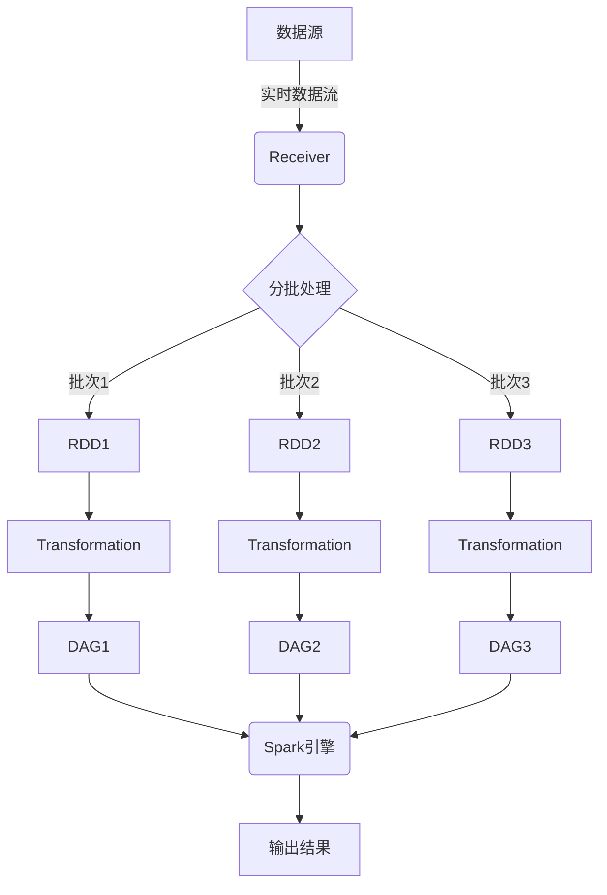

# Spark Streaming 原理与代码实例讲解

## 1. 背景介绍

### 1.1 问题的由来

在当今数据爆炸式增长的时代，实时数据处理已成为各行业的迫切需求。传统的批处理系统无法满足实时性要求,因此流式计算应运而生。流式计算是指持续不断地对无限数据流进行处理,以便实时地获取结果。

Apache Spark Streaming 作为 Apache Spark 生态系统中的一个重要组成部分,为实时数据处理提供了高度可扩展、高吞吐量和容错的解决方案。它能够从各种数据源(如 Kafka、Flume、Kinesis 等)实时获取数据流,并利用 Spark 强大的内存计算能力进行分布式流处理。

### 1.2 研究现状

近年来,随着大数据技术的不断发展,流式计算受到越来越多的关注。Apache Spark Streaming 作为流式计算领域的佼佼者,已被广泛应用于各种场景,如实时日志分析、网络监控、物联网数据处理等。

然而,Spark Streaming 的原理和实现细节对于许多开发者来说仍然是一个黑盒子。深入理解其内部机制对于高效利用该技术、优化性能和解决实际问题至关重要。

### 1.3 研究意义

本文旨在深入探讨 Spark Streaming 的原理和实现细节,帮助读者更好地理解和运用这一强大的流式计算框架。通过剖析 Spark Streaming 的核心概念、算法原理、数学模型以及代码实现,读者将能够:

1. 掌握 Spark Streaming 的工作原理和设计理念
2. 了解其内部数据处理流程和容错机制
3. 学习如何编写高效的 Spark Streaming 应用程序
4. 获取优化 Spark Streaming 性能的技巧和最佳实践

### 1.4 本文结构

本文将从以下几个方面全面介绍 Spark Streaming:

1. 背景介绍
2. 核心概念与联系
3. 核心算法原理与具体操作步骤
4. 数学模型和公式详细讲解与举例说明
5. 项目实践:代码实例和详细解释说明
6. 实际应用场景
7. 工具和资源推荐
8. 总结:未来发展趋势与挑战
9. 附录:常见问题与解答

## 2. 核心概念与联系

在深入探讨 Spark Streaming 的核心算法和实现细节之前,我们需要先了解一些基本概念。

### 2.1 Spark 基础概念

作为 Spark 生态系统的一部分,Spark Streaming 继承了 Spark 的许多核心概念和设计理念。

#### 2.1.1 RDD

RDD(Resilient Distributed Dataset)是 Spark 的基础数据结构,表示一个不可变、分区的记录集合。RDD 支持并行操作,可以在集群中高效地存储和处理数据。

#### 2.1.2 Transformation 和 Action

Spark 提供了两种操作:Transformation 和 Action。Transformation 是延迟计算的,它定义了对 RDD 的转换操作,但不会触发实际计算。Action 则会触发实际计算,并返回结果。

#### 2.1.3 DAG

Spark 将 Transformation 操作构建成了有向无环图(DAG),在执行 Action 时,会根据 DAG 计算每个 RDD 分区的结果。

### 2.2 Spark Streaming 核心概念

Spark Streaming 将实时数据流视为一系列不断到达的小批量数据集。它通过将数据流分成小批量,然后使用 Spark 引擎处理这些小批量数据,从而实现流式计算。

#### 2.2.1 DStream

DStream(Discretized Stream)是 Spark Streaming 中的基本抽象,表示一个持续不断的数据流。DStream 由一系列连续的 RDD 组成,每个 RDD 包含一个数据批次。

#### 2.2.2 输入 DStream

输入 DStream 表示从数据源(如 Kafka、Flume 等)接收的原始数据流。Spark Streaming 提供了多种内置的输入源。

#### 2.2.3 Transformation 和 Output Operation

与 Spark 类似,Spark Streaming 也提供了 Transformation 和 Output Operation。Transformation 用于对 DStream 进行转换操作,Output Operation 则用于将计算结果输出到外部系统(如文件系统、数据库等)。

#### 2.2.4 Spark Streaming 架构

Spark Streaming 架构由以下几个关键组件组成:

- **Receiver**: 从数据源接收数据,并将数据存储在 Spark 的内存中。
- **Batch Processing Engine**: 使用 Spark 引擎处理每个批次的数据。
- **Output Operation**: 将处理结果输出到外部系统。
- **Checkpoint & WAL**: 用于实现容错和恢复机制。

### 2.3 Spark Streaming 与其他流式计算框架的对比

除了 Spark Streaming,还有其他一些流行的流式计算框架,如 Apache Flink、Apache Storm 等。它们在设计理念、数据处理模型和容错机制等方面存在一些差异。

#### 2.3.1 Spark Streaming 与 Apache Flink

Apache Flink 采用了基于事件时间的数据处理模型,能够更好地处理乱序数据和延迟数据。而 Spark Streaming 则基于微批处理模型,更适合处理大规模数据流。

#### 2.3.2 Spark Streaming 与 Apache Storm

Apache Storm 是一个纯流式计算框架,采用了基于记录的数据处理模型。与之相比,Spark Streaming 的微批处理模型在处理大规模数据流时具有更好的吞吐量和延迟性能。

## 3. 核心算法原理与具体操作步骤

### 3.1 算法原理概述

Spark Streaming 的核心算法基于微批处理模型,将连续的数据流分成一系列小批量数据集(批次)进行处理。每个批次由一个 RDD 表示,Spark Streaming 使用 Spark 引擎对这些 RDD 进行转换操作和计算。

算法的基本流程如下:

1. 从数据源(如 Kafka)接收实时数据流。
2. 将数据流分成小批量数据集(批次),每个批次由一个 RDD 表示。
3. 对每个批次的 RDD 应用 Transformation 操作,构建出计算逻辑的 DAG。
4. 使用 Spark 引擎并行执行 DAG,计算出每个批次的结果。
5. 将计算结果输出到外部系统(如文件系统、数据库等)。

该算法的核心在于将连续的数据流离散化为一系列小批量数据集,然后利用 Spark 的分布式计算能力对每个批次进行高效处理。这种设计兼顾了低延迟和高吞吐量,同时也提供了容错和恢复机制。

### 3.2 算法步骤详解

下面我们将详细解释 Spark Streaming 算法的每个步骤。

#### 3.2.1 接收数据流

Spark Streaming 支持从多种数据源接收实时数据流,如 Kafka、Flume、Kinesis 等。它使用 Receiver 组件从数据源获取数据,并将数据存储在 Spark 的内存中。

#### 3.2.2 分批处理

Spark Streaming 将连续的数据流分成一系列小批量数据集(批次)。每个批次由一个 RDD 表示,包含在该批次时间段内到达的所有数据记录。

批次的时间间隔可以由用户配置,通常设置为几秒到几分钟。较小的批次间隔可以提供更低的延迟,但会增加系统开销。反之,较大的批次间隔可以提高吞吐量,但会增加延迟。

#### 3.2.3 Transformation 和 DAG 构建

对于每个批次的 RDD,Spark Streaming 允许用户应用各种 Transformation 操作,如 map、filter、join 等。这些 Transformation 操作会构建出一个计算逻辑的 DAG。

#### 3.2.4 并行计算

Spark Streaming 使用 Spark 引擎并行执行每个批次的 DAG,计算出最终结果。Spark 引擎会根据集群资源情况,将计算任务分配到不同的工作节点上执行。

#### 3.2.5 输出结果

计算完成后,Spark Streaming 会将结果输出到外部系统,如文件系统、数据库或消息队列等。用户可以通过 Output Operation 指定输出目标和格式。

### 3.3 算法优缺点

Spark Streaming 基于微批处理模型的算法具有以下优缺点:

**优点:**

1. **高吞吐量**: 批处理模型可以高效地处理大规模数据流,吞吐量较高。
2. **容错性强**: 利用 Spark 的容错机制,可以实现自动故障恢复和重新计算。
3. **兼容 Spark 生态系统**: 可以直接使用 Spark 的各种库和工具,如 Spark SQL、Spark MLlib 等。
4. **编程模型简单**: 与批处理类似的编程模型,易于上手和开发。

**缺点:**

1. **高延迟**: 由于需要等待批次填充完成,延迟会随着批次间隔的增加而增加。
2. **数据丢失风险**: 在故障发生时,可能会丢失部分数据。
3. **处理乱序数据能力较差**: 由于批处理模型的特性,处理乱序数据的能力有限。

### 3.4 算法应用领域

Spark Streaming 算法广泛应用于以下领域:

1. **实时日志分析**: 实时处理服务器日志、应用日志等,用于监控和故障排查。
2. **实时数据处理**: 处理来自物联网设备、社交媒体等的实时数据流。
3. **实时监控和报警**: 监控系统指标,实时检测异常并发出警报。
4. **实时推荐系统**: 基于用户实时行为数据,提供个性化推荐。
5. **金融风控**: 实时检测金融交易中的欺诈行为。

## 4. 数学模型和公式详细讲解与举例说明

在 Spark Streaming 中,一些关键算法和机制涉及到数学模型和公式。本节将详细讲解这些模型和公式,并通过实例进行说明。

### 4.1 数学模型构建

#### 4.1.1 数据流模型

我们可以将实时数据流建模为一个无限序列:

$$
S = \{d_1, d_2, d_3, \dots\}
$$

其中,每个 $d_i$ 表示一条数据记录。

Spark Streaming 将这个无限序列划分为一系列有限的批次,每个批次包含一定时间段内的数据记录。我们可以将第 $i$ 个批次表示为:

$$
B_i = \{d_j, d_{j+1}, \dots, d_k\}
$$

其中,$j$ 和 $k$ 分别表示该批次的起始和结束索引。

#### 4.1.2 窗口操作模型

Spark Streaming 支持对数据流进行窗口操作,即在一个滑动窗口内对数据进行计算。我们可以将窗口建模为一个函数:

$$
W(S, w, s) = \{B_i, B_{i+1}, \dots, B_j\}
$$

其中,
- $S$ 表示原始数据流
- $w$ 表示窗口长度
- $s$ 表示滑动步长
- $B_i, B_{i+1}, \dots, B_j$ 表示落入该窗口内的批次

通过调整 $w$ 和 $s$ 的值,我们可以控制窗口的范围和重叠程度。

### 4.2 公式推导过程

#### 4.2.1 数据流延迟模型

在实时数据处理中,延迟是一个关键指标。我们可以将端到端延迟建模为:

$$
L = L_s + L_p + L_o
$$