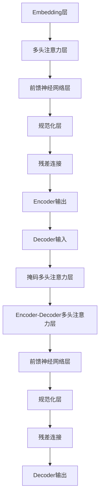

# T5原理与代码实例讲解

## 1. 背景介绍

### 1.1 问题的由来

在自然语言处理(NLP)领域中,机器翻译、文本摘要、问答系统等任务一直是研究的热点和难点。传统的Seq2Seq模型虽然取得了一定的成果,但仍然存在一些缺陷,如生成的文本质量不高、重复率高、缺乏一致性等。为了解决这些问题,谷歌大脑团队在2019年提出了T5(Text-to-Text Transfer Transformer)模型。

### 1.2 研究现状

T5模型是一种基于Transformer的统一的Seq2Seq框架,可以用于多种NLP任务,如机器翻译、文本摘要、问答等。它将所有NLP任务都转化为"文本到文本"的形式,通过预训练和微调的方式来解决各种下游任务。与之前的模型相比,T5具有以下优势:

1. 统一框架,可以一次性预训练,支持多种NLP任务
2. 预训练任务丰富,包括机器翻译、问答、文本摘要等多种形式
3. 模型结构简单,可扩展性强
4. 生成质量更高,重复率更低,一致性更好

目前,T5模型已经在多个NLP任务上取得了最先进的效果,成为了NLP领域的新标杆模型。

### 1.3 研究意义

深入理解T5模型的原理和实现细节,对于以下几个方面具有重要意义:

1. 帮助研究人员更好地把握Seq2Seq模型的发展方向
2. 为NLP任务的实际应用提供高质量的解决方案
3. 促进模型可解释性和可信赖性的研究
4. 为未来的模型创新提供借鉴和启发

### 1.4 本文结构

本文将全面介绍T5模型的理论基础、核心算法、数学模型、代码实现和应用场景等内容。具体来说,包括以下几个部分:

1. 核心概念与联系
2. 核心算法原理与具体操作步骤
3. 数学模型和公式详细讲解与举例说明
4. 项目实践:代码实例和详细解释说明
5. 实际应用场景
6. 工具和资源推荐
7. 总结:未来发展趋势与挑战
8. 附录:常见问题与解答

## 2. 核心概念与联系

T5模型的核心思想是将所有NLP任务统一转化为"文本到文本"的形式,通过预训练和微调的方式来解决各种下游任务。这种统一的框架具有以下几个关键概念:

1. **Encoder-Decoder框架**: T5采用了典型的Transformer的Encoder-Decoder结构,将输入文本映射为隐藏表示,再由Decoder生成目标文本。

2. **前缀语言模型(Prefix Language Model)**: T5将不同的NLP任务统一表示为"前缀+输入文本->目标文本"的形式,前缀用于指示任务类型。

3. **多任务混合数据预训练**: T5在预训练阶段使用了多种形式的语料,包括机器翻译、问答、文本摘要等,通过多任务学习提高泛化能力。

4. **扩展性**: T5的模型结构简单,可以轻松扩展到更大的规模,提高性能。

5. **迁移学习**: T5使用两阶段训练策略,先进行通用预训练,再对特定任务进行微调,实现知识迁移。

这些核心概念相互关联、环环相扣,共同构建了T5模型的理论基础。下一部分将详细介绍T5的核心算法原理。

## 3. 核心算法原理与具体操作步骤

### 3.1 算法原理概述

T5模型的核心算法基于Transformer的Encoder-Decoder结构,并引入了一些创新,主要包括以下几个方面:

1. **输入输出统一表示**

   T5将所有NLP任务统一表示为"前缀+输入文本->目标文本"的形式,例如:
   - 翻译: `translate English to German: This is a pen. -> Das ist ein Stift.`
   - 问答: `question: What is the capital of France? answer: Paris`

2. **前缀语言模型**

   T5使用前缀(prefix)来指示任务类型,例如"translate English to German:"表示英德翻译任务。模型根据前缀和输入生成对应的目标文本。

3. **多任务混合数据预训练**

   在预训练阶段,T5使用了多种形式的语料,包括机器翻译、问答、文本摘要等,并采用多任务学习的方式进行联合训练。

4. **双层解码结构**

   T5的Decoder分为两层:第一层用于生成目标文本,第二层用于检测是否生成了结束符号,从而控制生成长度。

5. **相对位置编码**

   T5采用了相对位置编码的方式,避免了绝对位置编码在长序列时的限制。

这些创新使得T5模型具有很强的泛化能力,可以在多种NLP任务上取得优异的表现。下面将详细介绍T5的算法步骤。

### 3.2 算法步骤详解

T5模型的算法步骤可以分为两个阶段:预训练(Pre-training)和微调(Fine-tuning)。

#### 3.2.1 预训练阶段

预训练阶段的目标是在大规模语料上训练一个通用的语言模型,为后续的微调任务提供一个良好的初始化。具体步骤如下:

1. **数据预处理**

   将多种形式的语料(如机器翻译、问答等)统一转化为"前缀+输入文本->目标文本"的格式,构建训练数据集。

2. **模型初始化**

   初始化T5模型的Transformer结构,包括Encoder、Decoder、词嵌入等模块。

3. **掩码语言模型训练**

   采用掩码语言模型(Masked Language Model)的方式进行预训练,即随机掩码部分输入token,让模型预测被掩码的token。

4. **多任务训练**

   在多种任务的训练数据上进行联合训练,模型学习生成各种形式的目标文本。

5. **保存预训练模型**

   训练收敛后,保存预训练模型的参数,作为后续微调的初始化。

预训练阶段的关键是使用多种形式的语料进行多任务学习,使模型获得强大的泛化能力。

#### 3.2.2 微调阶段

微调阶段的目标是在特定的NLP任务上进行进一步训练,提高模型在该任务上的性能。具体步骤如下:

1. **加载预训练模型**

   加载预训练阶段保存的模型参数。

2. **准备微调数据**

   准备特定任务的训练数据,转化为"前缀+输入文本->目标文本"的格式。

3. **微调训练**

   在特定任务的训练数据上进行模型微调,更新模型参数。

4. **模型评估**

   在开发集/测试集上评估微调后模型的性能表现。

5. **模型部署**

   将微调好的模型部署到实际的生产环境中。

微调阶段利用了预训练模型的知识,通过在特定任务上进行进一步训练,可以极大提高模型的性能。

通过上述两个阶段的训练,T5模型即可应用于多种NLP任务,展现出强大的泛化能力。

### 3.3 算法优缺点

T5算法具有以下优点:

1. **统一的框架**

   T5将所有NLP任务统一到"文本到文本"的形式,简化了模型的结构和训练过程。

2. **强大的泛化能力**

   通过多任务预训练,T5模型可以在多种NLP任务上取得优异的表现。

3. **高质量的生成**

   T5生成的文本质量更高,重复率更低,一致性更好。

4. **可扩展性强**

   T5的模型结构简单,可以轻松扩展到更大的规模,提高性能。

5. **高效的迁移学习**

   两阶段训练策略实现了高效的知识迁移,降低了微调的计算开销。

然而,T5算法也存在一些缺点:

1. **训练数据需求大**

   预训练阶段需要大量的多语料数据,对计算资源和存储空间的要求较高。

2. **微调效率较低**

   虽然比从头训练要高效,但微调阶段的训练速度仍然较慢。

3. **生成长度限制**

   由于Transformer结构的局限性,T5生成的文本长度仍有一定限制。

4. **缺乏可解释性**

   作为一个黑盒模型,T5的内部机理缺乏可解释性,难以理解。

5. **存在偏差和不确定性**

   生成的文本可能存在偏差和不确定性,需要人工检查和修正。

总的来说,T5算法在NLP任务上表现出色,但仍有一些需要改进和完善的地方。

### 3.4 算法应用领域

作为一种通用的Seq2Seq框架,T5模型可以应用于多种NLP任务,主要包括:

1. **机器翻译**

   T5可以用于多种语言之间的机器翻译任务,效果优于传统的翻译模型。

2. **文本摘要**

   T5可以生成高质量的文本摘要,包括新闻摘要、论文摘要等。

3. **问答系统**

   T5可以根据给定的问题和背景知识生成对应的答案,构建智能问答系统。

4. **数据到文本**

   T5可以将结构化数据(如表格、JSON等)转化为自然语言文本,实现数据到文本的生成。

5. **代码生成**

   T5还可以应用于代码生成任务,根据给定的需求生成对应的代码。

6. **文本分类**

   通过将文本分类任务转化为"文本到文本"的形式,T5也可以用于文本分类任务。

7. **蕴含关系识别**

   T5可以判断两个句子之间是否存在蕴含关系,用于自然语言推理任务。

8. **阅读理解**

   T5可以根据给定的文章和问题,生成对应的答案,解决阅读理解问题。

除了上述任务,T5还可以应用于其他一些NLP领域,展现出了强大的通用性和泛化能力。未来,T5模型有望在更多领域发挥重要作用。

## 4. 数学模型和公式详细讲解与举例说明

### 4.1 数学模型构建

T5模型的核心是基于Transformer的Encoder-Decoder架构,采用了自注意力机制和位置编码等技术。我们先回顾一下Transformer模型的基本结构:



T5模型在Transformer的基础上做了一些改进和创新,主要包括:

1. **输入输出统一表示**

   T5将所有NLP任务统一表示为"前缀+输入文本->目标文本"的形式,例如:

   ```
   translate English to German: This is a pen. -> Das ist ein Stift.
   ```

   这种统一的表示形式可以用一个函数$f$来描述:

   $$f(x) = y$$

   其中$x$表示"前缀+输入文本",$y$表示目标文本。模型的目标是学习这个映射函数$f$。

2. **前缀语言模型**

   T5使用前缀(prefix)来指示任务类型,例如"translate English to German:"表示英德翻译任务。模型根据前缀和输入生成对应的目标文本。

   设前缀为$p$,输入文本为$x$,目标文本为$y$,则模型需要学习的条件概率分布为:

   $$P(y|p,x)$$

3. **相对位置编码**

   T5采用了相对位置编码的方式,避免了绝对位置编码在长序列时的限制。相对位置编码可以表示为:

   $$PE_{rel}(pos, i, j) = \omega^