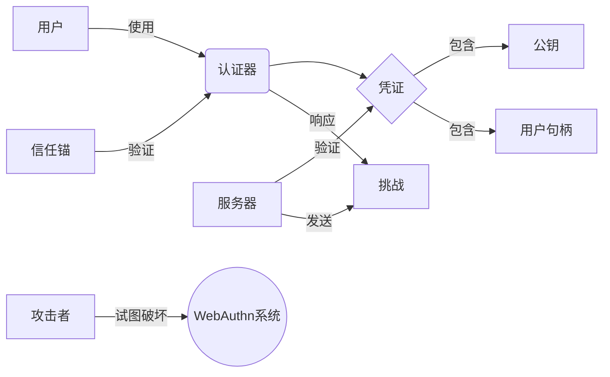
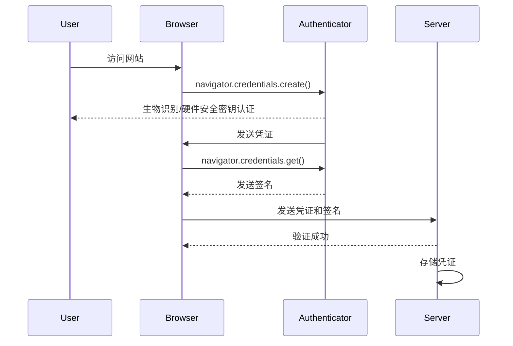
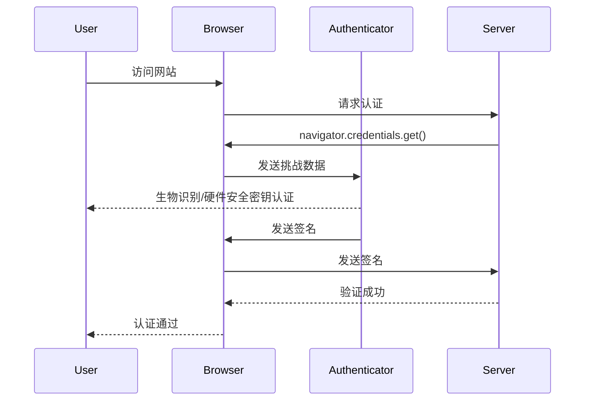

# WebAuthn 的基本原理

## 1. 背景介绍

### 1.1 问题的由来

在过去的几十年中，密码一直是最常用的身份验证方式。然而,传统的密码身份验证系统存在诸多缺陷和安全隐患,如密码可能被盗取或暴力破解、用户往往选择弱密码或在多个网站重复使用相同密码等。为了解决这些问题,Web认证(WebAuthn)规范应运而生。

WebAuthn是一种全新的无密码身份验证技术,旨在取代传统的密码登录方式。它利用公钥加密技术和硬件安全密钥,为用户提供更安全、更便捷的身份验证体验。WebAuthn的出现,标志着Web身份验证领域的一次重大变革。

### 1.2 研究现状

WebAuthn规范由万维网联盟(W3C)和国际互联网工程任务组(IETF)共同制定,于2019年3月获得正式发布。目前,主流浏览器和操作系统已经支持WebAuthn,如Chrome、Firefox、Windows 10和Android等。

越来越多的网站和应用程序开始采用WebAuthn技术,以提高用户体验和系统安全性。例如,Google、Dropbox、GitHub等知名公司已经在其产品和服务中实现了WebAuthn支持。

### 1.3 研究意义

WebAuthn的出现,为Web身份验证领域带来了全新的发展机遇。相比传统密码登录,WebAuthn具有以下优势:

1. **更高的安全性**:WebAuthn利用公钥加密技术和硬件安全密钥,能有效防止密码被盗取或暴力破解。
2. **更佳的用户体验**:用户无需记住复杂的密码,只需使用生物识别(如指纹、面部识别等)或硬件安全密钥即可完成身份验证。
3. **更好的可扩展性**:WebAuthn是一种开放标准,可以跨平台、跨设备使用,满足未来发展需求。

研究WebAuthn的基本原理,有助于我们深入理解这一全新的身份验证技术,把握其发展趋势,并为其在实际应用中的推广和落地提供理论支持。

### 1.4 本文结构

本文将全面介绍WebAuthn的基本原理,内容包括:

- 核心概念与联系
- 核心算法原理及具体操作步骤
- 数学模型和公式详细讲解
- 项目实践:代码实例和详细解释
- 实际应用场景
- 工具和资源推荐
- 总结:未来发展趋势与挑战
- 附录:常见问题与解答

## 2. 核心概念与联系

WebAuthn涉及了多个核心概念,包括:

1. **凭证(Credential)**:用于存储用户身份信息的数据结构,包括公钥、用户句柄等。
2. **认证器(Authenticator)**:用于生成和存储凭证的安全硬件或软件模块,如安全密钥、指纹识别器等。
3. **攻击者(Attacker)**:试图破坏身份验证系统安全性的恶意实体。
4. **信任锚(Trust Anchor)**:可信赖的根证书颁发机构,用于验证认证器的真实性。
5. **挑战(Challenge)**:由服务器发送的随机数据,用于防止重放攻击。
6. **用户句柄(User Handle)**:唯一标识用户的不可修改的随机数据。

这些概念之间存在着密切的联系,共同构建了WebAuthn的整体安全架构。下图展示了它们之间的关系:

## 3. 核心算法原理 & 具体操作步骤

WebAuthn的核心算法原理基于公钥加密技术,具体包括两个主要过程:注册(Registration)和认证(Authentication)。

### 3.1 算法原理概述

1. **注册过程**:用户首次访问网站时,需要通过认证器(如指纹识别器、安全密钥等)完成注册。在此过程中,认证器会生成一对公钥和私钥,并将公钥及其他用户信息(如用户句柄)打包成凭证,发送给服务器。服务器会验证凭证的真实性,并将其存储在数据库中。

2. **认证过程**:用户再次访问网站时,需要通过认证器进行身份验证。服务器会发送一个随机的挑战数据给认证器,认证器使用私钥对该数据进行签名,并将签名结果发送回服务器。服务器使用之前存储的公钥验证签名,如果验证通过,则认证成功。

这种基于公钥加密的机制,能够有效防止密码被盗取或暴力破解,从而大大提高了身份验证的安全性。

### 3.2 算法步骤详解

#### 注册过程

1. 用户访问网站,网站要求用户进行注册。
2. 网站调用`navigator.credentials.create()`方法,向认证器发起注册请求。
3. 认证器生成一对公钥和私钥,并提示用户进行生物识别(如指纹、面部识别等)或使用硬件安全密钥进行身份验证。
4. 用户通过身份验证后,认证器将公钥、用户句柄等信息打包成凭证,并将凭证发送给网站。
5. 网站接收到凭证后,调用`navigator.credentials.get()`方法,向认证器发送挑战数据,以验证凭证的真实性。
6. 认证器使用私钥对挑战数据进行签名,并将签名结果发送给网站。
7. 网站使用凭证中的公钥验证签名,如果验证通过,则将凭证存储在服务器数据库中,注册过程完成。

#### 认证过程

1. 用户再次访问网站。
2. 网站调用`navigator.credentials.get()`方法,向认证器发送挑战数据。
3. 认证器提示用户进行生物识别或使用硬件安全密钥进行身份验证。
4. 用户通过身份验证后,认证器使用之前生成的私钥对挑战数据进行签名,并将签名结果发送给网站。
5. 网站使用之前存储的凭证中的公钥验证签名,如果验证通过,则认证成功,允许用户访问。

### 3.3 算法优缺点

**优点**:

1. **无需密码**:用户无需记住复杂的密码,只需使用生物识别或硬件安全密钥即可完成身份验证,提高了用户体验。
2. **更高的安全性**:基于公钥加密技术,能有效防止密码被盗取或暴力破解,大大提高了系统安全性。
3. **防止重放攻击**:通过服务器发送随机的挑战数据,能够有效防止重放攻击。
4. **跨平台兼容性**:WebAuthn是一种开放标准,可以跨平台、跨设备使用,具有良好的可扩展性。

**缺点**:

1. **硬件需求**:需要支持WebAuthn的硬件设备,如指纹识别器、安全密钥等,可能会增加成本。
2. **兼容性问题**:虽然主流浏览器和操作系统已经支持WebAuthn,但一些旧版本可能无法兼容。
3. **用户教育**:需要向用户介绍新的身份验证方式,可能会遇到一定的用户接受度问题。

### 3.4 算法应用领域

WebAuthn可以应用于各种需要身份验证的场景,包括但不限于:

1. **网站登录**:替代传统的密码登录方式,提高安全性和用户体验。
2. **移动应用**:在移动应用中实现无密码登录,利用设备的生物识别功能进行身份验证。
3. **物联网设备**:为物联网设备提供安全的身份验证机制,保护设备免受未经授权的访问。
4. **企业内部系统**:在企业内部系统中采用WebAuthn,提高数据和系统的安全性。

## 4. 数学模型和公式 & 详细讲解 & 举例说明

WebAuthn的核心算法原理基于公钥加密技术,涉及到多种数学模型和公式。本节将详细介绍这些模型和公式,并通过案例进行讲解。

### 4.1 数学模型构建

WebAuthn使用了多种数学模型,包括:

1. **椭圆曲线密码学(ECC)**:用于生成公钥和私钥对,提供高强度的加密保护。
2. **哈希函数**:用于生成凭证的摘要,确保数据的完整性。
3. **数字签名**:使用私钥对数据进行签名,用于身份验证和数据完整性验证。

这些模型共同构建了WebAuthn的安全架构,确保了身份验证过程的安全性和可靠性。

### 4.2 公式推导过程

#### 1. 椭圆曲线密码学(ECC)

ECC是一种基于椭圆曲线理论的公钥加密算法,具有较小的密钥长度但能提供与RSA相当的安全强度。在WebAuthn中,ECC用于生成公钥和私钥对。

椭圆曲线上的点$P$可以表示为$(x, y)$,其中$x$和$y$是有限域$\mathbb{F}_p$上的元素,满足方程:

$$y^2 = x^3 + ax + b \pmod p$$

其中$a$和$b$是曲线参数,$p$是一个素数。

给定一个基点$G$,私钥$d$是一个随机选择的整数,公钥$Q$可以通过标量乘法计算得到:

$$Q = dG$$

加密和解密过程利用了椭圆曲线上的点运算,具有较高的计算复杂度,从而提供了更高的安全性。

#### 2. 哈希函数

哈希函数用于将任意长度的输入数据映射到固定长度的输出,常用于数据完整性验证和数字签名。WebAuthn中使用的哈希函数是SHA-256,它将输入数据映射到256位(32字节)的哈希值。

对于任意长度的输入消息$M$,SHA-256哈希函数可以表示为:

$$H(M) = h(h(h(...(h(M))...)))$$

其中$h$是压缩函数,通过迭代计算得到最终的哈希值$H(M)$。

#### 3. 数字签名

数字签名使用私钥对数据进行签名,接收方可以使用公钥验证签名,确保数据的完整性和发送者的身份。WebAuthn中使用ECDSA(Elliptic Curve Digital Signature Algorithm)算法进行数字签名。

假设要签名的数据为$M$,私钥为$d$,公钥为$Q$,签名过程如下:

1. 选择一个随机数$k$,满足$1 < k < n-1$,其中$n$是椭圆曲线的阶。
2. 计算$r = (k \cdot G)_x \bmod n$,其中$G$是基点,$(\cdot)_x$表示取$x$坐标。
3. 计算$s = k^{-1}(H(M) + dr) \bmod n$,其中$H(M)$是