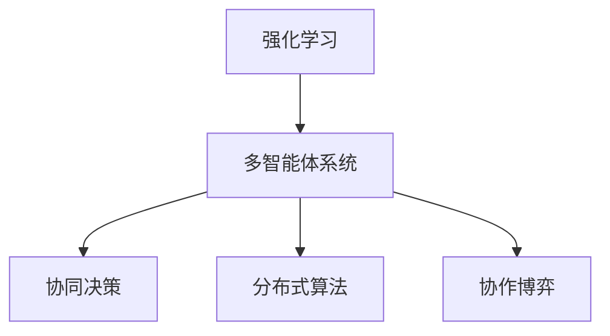
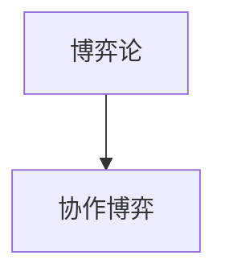

                 

# 基于强化学习的多智能体系统合作行为分析

> 关键词：强化学习,多智能体系统,合作行为,博弈论,马尔可夫决策过程(MDP),多智能体系统(MAS),分布式算法

## 1. 背景介绍

### 1.1 问题由来
在当前的人工智能技术中，多智能体系统（Multi-Agent System, MAS）是一种非常流行的研究热点。多智能体系统是由多个自主的智能体（agent）组成的分布式系统，它们通过合作或竞争来实现共同的目标。这些智能体可以互相通信、协调行动，甚至在需要时达成共识。多智能体系统广泛用于自动化控制、机器人协作、网络安全、交通管理和金融交易等领域。

多智能体系统的一个关键挑战是如何在智能体之间进行合作。传统上，合作行为是通过集中式规划或者静态规则来建模的，但这种方法往往无法应对动态变化的复杂环境，并且缺乏灵活性和可扩展性。强化学习（Reinforcement Learning, RL）提供了一种更灵活和适应性更强的模型，可以用于多智能体系统中的合作行为建模和优化。

### 1.2 问题核心关键点
在多智能体系统中，智能体通过与环境交互来学习最优的合作策略。强化学习的核心思想是：智能体在每次交互中根据环境反馈调整行动策略，通过最大化累积回报（cumulative reward）来实现长期目标。这种方法与传统的手动规划和规则编写方法相比，具有更强的灵活性和适应性，尤其适用于动态和不确定性较高的环境。

强化学习在多智能体系统中的应用主要包括以下几个方面：
- 集中式强化学习（centralized reinforcement learning, CRL）：集中式强化学习通过一个中央控制器来协调所有智能体的行动，实现系统目标。
- 分布式强化学习（distributed reinforcement learning, DRL）：分布式强化学习使得每个智能体能够独立地学习和行动，通过智能体之间的通信和协调来达成共同目标。
- 协作强化学习（cooperative reinforcement learning, CRL）：协作强化学习强调智能体之间的合作与协调，通过联合行动实现共同目标。

此外，强化学习还可以与博弈论（Game Theory）相结合，使得智能体能够在对立和合作的博弈中做出最优决策。博弈论提供了更加严格的模型来描述智能体之间的交互和决策，强化学习则提供了更加灵活和高效的决策方法。

## 2. 核心概念与联系

### 2.1 核心概念概述

为了更好地理解基于强化学习的多智能体系统合作行为，本节将介绍几个密切相关的核心概念：

- 强化学习：通过智能体与环境的交互，学习最优策略以最大化累积回报。
- 多智能体系统：由多个智能体组成的分布式系统，通过协作或竞争来实现共同目标。
- 博弈论：研究多个智能体之间的策略互动和决策，强调信息对称性和对等性。
- 马尔可夫决策过程（MDP）：强化学习的核心概念，描述了智能体与环境的动态交互过程。
- 分布式算法：用于在多个智能体之间传递信息和更新决策的算法，是分布式强化学习的核心。
- 协同决策：智能体之间的合作与协调，通过联合行动实现系统目标。
- 协作博弈：博弈论中强调合作和共赢的概念，用于描述多个智能体之间的合作行为。

这些核心概念之间的逻辑关系可以通过以下Mermaid流程图来展示：

```mermaid
graph TB
    A[强化学习] --> B[多智能体系统]
    B --> C[博弈论]
    C --> D[马尔可夫决策过程(MDP)]
    B --> E[分布式算法]
    B --> F[协同决策]
    B --> G[协作博弈]
```

这个流程图展示了大语言模型的核心概念及其之间的关系：

1. 强化学习提供了一种灵活的决策方法，可以应用于多智能体系统中。
2. 多智能体系统通过协作或竞争实现共同目标，博弈论提供了更加严格的模型。
3. 马尔可夫决策过程描述了智能体与环境的动态交互，是强化学习的核心概念。
4. 分布式算法用于智能体之间的通信和决策更新，是分布式强化学习的关键。
5. 协同决策强调智能体之间的合作与协调，通过联合行动实现系统目标。
6. 协作博弈则进一步强调合作和共赢，是协作决策的数学模型。

这些概念共同构成了基于强化学习的多智能体系统合作行为分析的基础，为后续深入讨论具体的算法和方法提供了框架。

### 2.2 概念间的关系

这些核心概念之间存在着紧密的联系，形成了基于强化学习的多智能体系统合作行为的完整生态系统。下面我们通过几个Mermaid流程图来展示这些概念之间的关系。

#### 2.2.1 强化学习与多智能体系统的关系



这个流程图展示了强化学习如何应用于多智能体系统中，通过协同决策和分布式算法实现系统目标。

#### 2.2.2 马尔可夫决策过程与强化学习的关系

```mermaid
graph TB
    A[马尔可夫决策过程(MDP)] --> B[强化学习]
```

这个流程图展示了马尔可夫决策过程作为强化学习的核心概念，描述智能体与环境的动态交互过程。

#### 2.2.3 博弈论与协作博弈的关系



这个流程图展示了博弈论如何为协作博弈提供严格的模型，用于描述多个智能体之间的合作行为。

## 3. 核心算法原理 & 具体操作步骤
### 3.1 算法原理概述

基于强化学习的多智能体系统合作行为建模和优化，其核心算法是协作强化学习（Cooperative Reinforcement Learning, CRL）。协作强化学习强调智能体之间的合作与协调，通过联合行动实现共同目标。

在协作强化学习中，智能体之间需要共享信息和协调决策，以最大化系统的整体回报。这一过程可以通过以下几个步骤来实现：

1. 智能体通过感知环境，收集相关信息，并根据当前状态做出决策。
2. 智能体将决策传递给其他智能体，通过通信机制实现信息共享。
3. 智能体基于共享的信息和自身的决策，更新策略，以最大化累积回报。
4. 系统通过累计奖励信号对智能体的行动进行评估，并据此更新策略。

协作强化学习的目标是最小化所有智能体的损失函数，通过联合行动实现系统目标。这一目标通常表示为：

$$
\min_{\theta} \sum_{i=1}^{N} \mathbb{E}[\ell_i(\pi_i(a_i|s_i))]
$$

其中，$\theta$ 表示所有智能体的策略，$\ell_i$ 为智能体 $i$ 的损失函数，$a_i$ 为智能体 $i$ 的行动，$s_i$ 为智能体 $i$ 的状态。

### 3.2 算法步骤详解

协作强化学习的一般流程如下：

**Step 1: 系统初始化**

- 初始化所有智能体的状态 $s_1,\ldots,s_N$。
- 初始化所有智能体的策略 $\pi_1,\ldots,\pi_N$。
- 设置智能体的学习参数 $\eta$，如学习率。

**Step 2: 交互与决策**

- 在每个时间步 $t$，智能体 $i$ 感知环境，获取当前状态 $s_i^t$。
- 智能体 $i$ 根据当前状态和历史决策，做出决策 $a_i^t$。
- 智能体 $i$ 将决策 $a_i^t$ 发送给其他智能体。

**Step 3: 信息共享与决策更新**

- 智能体通过通信机制共享决策 $a_i^t$ 和其他智能体的状态 $s_j^t$。
- 根据共享的信息和自身的决策，智能体 $i$ 更新策略 $\pi_i$，以最大化累积回报。
- 系统根据当前状态和智能体的行动，更新环境的奖励信号 $r^t$。

**Step 4: 学习与优化**

- 根据累积奖励信号，更新所有智能体的策略 $\pi_1,\ldots,\pi_N$。
- 更新智能体的策略参数 $\theta$，以最小化损失函数。
- 重复上述步骤直至收敛。

### 3.3 算法优缺点

协作强化学习具有以下优点：

1. 灵活性高：协作强化学习能够适应动态和不确定性的环境，灵活调整策略以实现系统目标。
2. 自适应性强：智能体能够在交互过程中动态更新策略，适应新环境和新任务。
3. 鲁棒性好：多个智能体的协作决策能够增强系统的鲁棒性和抗干扰能力。

协作强化学习也存在一些缺点：

1. 通信开销大：协作强化学习需要智能体之间频繁通信，可能产生较大的通信开销。
2. 分布式训练复杂：协作强化学习涉及多个智能体的协同学习，训练过程较复杂。
3. 策略一致性难以保证：协作强化学习需要所有智能体达成一致的决策，这可能存在一定的难度。

### 3.4 算法应用领域

协作强化学习已经在多个领域得到应用，以下是一些典型应用：

- 网络安全：在网络安全中，多个安全智能体通过协作，实现入侵检测和异常行为识别。
- 交通管理：在交通管理中，智能交通系统通过协作智能体实现车辆调度和交通流量优化。
- 机器人协作：在机器人协作中，多个机器人通过协作，实现复杂任务的分工和协调。
- 能源管理：在能源管理中，多个智能体通过协作，实现电力负荷平衡和能源分配优化。

除了上述这些应用领域，协作强化学习还在供应链管理、金融交易、无人机编队等多个领域具有广泛的应用前景。

## 4. 数学模型和公式 & 详细讲解  
### 4.1 数学模型构建

协作强化学习通常采用马尔可夫决策过程（MDP）进行建模。假设系统由 $N$ 个智能体组成，每个智能体都有一个状态空间 $S$，一个行动空间 $A$，一个奖励函数 $r$，以及一个状态转移概率 $p$。系统在每个时间步 $t$ 的奖励函数可以表示为：

$$
r^t = \sum_{i=1}^{N} r_i(s_i^t, a_i^t)
$$

其中，$r_i$ 为智能体 $i$ 的奖励函数，$s_i^t$ 和 $a_i^t$ 分别为智能体 $i$ 在时间步 $t$ 的状态和行动。

系统的状态转移概率 $p$ 可以表示为：

$$
p(s_{i+1}^t | s_i^t, a_i^t, a_j^t, \ldots) = \prod_{k=1}^{N} p(s_{i+1}^t | s_i^t, a_i^t)
$$

其中，$p(s_{i+1}^t | s_i^t, a_i^t)$ 为智能体 $i$ 在时间步 $t$ 的状态转移概率。

系统的状态空间 $S$ 可以表示为：

$$
S = \{(s_1^t, s_2^t, \ldots, s_N^t) \mid s_i^t \in S_i\}
$$

其中，$S_i$ 为智能体 $i$ 的状态空间。

系统的行动空间 $A$ 可以表示为：

$$
A = \{(a_1^t, a_2^t, \ldots, a_N^t) \mid a_i^t \in A_i\}
$$

其中，$A_i$ 为智能体 $i$ 的行动空间。

系统的策略 $\pi$ 可以表示为：

$$
\pi(a_i^t | s_i^t) = \pi_i(a_i^t | s_i^t)
$$

其中，$\pi_i$ 为智能体 $i$ 的策略。

系统的损失函数 $\ell$ 可以表示为：

$$
\ell(\pi) = \sum_{i=1}^{N} \mathbb{E}[\ell_i(\pi_i(a_i^t | s_i^t))]
$$

其中，$\ell_i$ 为智能体 $i$ 的损失函数。

### 4.2 公式推导过程

在协作强化学习中，智能体的决策过程可以表示为：

$$
a_i^t = \pi_i(a_i^t | s_i^t)
$$

系统的状态转移过程可以表示为：

$$
s_{i+1}^t = s_i^t, \quad s_{i+1}^t = p(s_{i+1}^t | s_i^t, a_i^t, a_j^t, \ldots)
$$

系统的奖励函数可以表示为：

$$
r^t = \sum_{i=1}^{N} r_i(s_i^t, a_i^t)
$$

系统的状态空间可以表示为：

$$
S = \{(s_1^t, s_2^t, \ldots, s_N^t) \mid s_i^t \in S_i\}
$$

系统的行动空间可以表示为：

$$
A = \{(a_1^t, a_2^t, \ldots, a_N^t) \mid a_i^t \in A_i\}
$$

系统的策略可以表示为：

$$
\pi(a_i^t | s_i^t) = \pi_i(a_i^t | s_i^t)
$$

系统的损失函数可以表示为：

$$
\ell(\pi) = \sum_{i=1}^{N} \mathbb{E}[\ell_i(\pi_i(a_i^t | s_i^t))]
$$

在协作强化学习中，智能体的决策过程可以通过Q-learning、SARSA等强化学习算法进行优化。以Q-learning算法为例，智能体的Q值函数可以表示为：

$$
Q_i(s_i^t, a_i^t) = \mathbb{E}[R^t+1 - Q_i(s_{i+1}^t, a_{i+1}^t) | s_i^t, a_i^t]
$$

其中，$R^t+1$ 为时间步 $t+1$ 的回报。

智能体的Q值函数可以通过以下方式进行更新：

$$
Q_i(s_i^t, a_i^t) = (1 - \eta)Q_i(s_i^t, a_i^t) + \eta(r^t_i + \max_{a_{i+1}^t}Q_i(s_{i+1}^t, a_{i+1}^t))
$$

其中，$\eta$ 为学习率，$r^t_i$ 为智能体 $i$ 在时间步 $t$ 的奖励。

## 5. 项目实践：代码实例和详细解释说明
### 5.1 开发环境搭建

在进行协作强化学习实践前，我们需要准备好开发环境。以下是使用Python进行PyTorch开发的环境配置流程：

1. 安装Anaconda：从官网下载并安装Anaconda，用于创建独立的Python环境。

2. 创建并激活虚拟环境：
```bash
conda create -n pytorch-env python=3.8 
conda activate pytorch-env
```

3. 安装PyTorch：根据CUDA版本，从官网获取对应的安装命令。例如：
```bash
conda install pytorch torchvision torchaudio cudatoolkit=11.1 -c pytorch -c conda-forge
```

4. 安装各类工具包：
```bash
pip install numpy pandas scikit-learn matplotlib tqdm jupyter notebook ipython
```

完成上述步骤后，即可在`pytorch-env`环境中开始协作强化学习实践。

### 5.2 源代码详细实现

这里我们以网络安全系统为例，展示协作强化学习在多个智能体间的应用。假设系统由两个智能体 $i=1,2$ 组成，每个智能体通过感知环境，检测是否存在恶意行为。系统通过协作智能体实现入侵检测和异常行为识别。

首先，定义系统的状态空间、行动空间和奖励函数：

```python
import torch
import torch.nn as nn
import torch.optim as optim
import numpy as np

class Environment:
    def __init__(self, state_size, action_size):
        self.state_size = state_size
        self.action_size = action_size
        self.reward_range = (-1, 1)
        self.state = np.zeros(state_size)
        self.time = 0
        
    def reset(self):
        self.state = np.zeros(self.state_size)
        self.time = 0
        return self.state
    
    def step(self, actions):
        self.time += 1
        rewards = []
        for i, action in enumerate(actions):
            if action == 0: # 正常行为
                rewards.append(0.1)
            elif action == 1: # 异常行为
                rewards.append(-0.5)
                self.state[i] = 1.0
            else:
                rewards.append(-1)
        self.state = np.maximum(self.state, 0)
        return np.array(rewards), self.state
    
class Agent:
    def __init__(self, state_size, action_size, learning_rate):
        self.state_size = state_size
        self.action_size = action_size
        self.learning_rate = learning_rate
        self.q = nn.QLinear(state_size, action_size)
        self.optimizer = optim.Adam(self.q.parameters(), lr=self.learning_rate)
        self.loss_fn = nn.MSELoss()
    
    def select_action(self, state):
        with torch.no_grad():
            q_values = self.q(torch.Tensor(state))
        action = torch.argmax(q_values).item()
        return action
    
    def update(self, state, action, reward, next_state):
        q_values = self.q(torch.Tensor(state))
        q_values[action] = reward
        q_values = torch.max(q_values, dim=1)[0]
        target = torch.Tensor([reward + self.learning_rate * q_values])
        loss = self.loss_fn(target, q_values)
        self.optimizer.zero_grad()
        loss.backward()
        self.optimizer.step()
    
    def get_state(self):
        return self.q.weight
```

然后，定义协作强化学习的整体框架，并训练模型：

```python
class CollaborativeRL:
    def __init__(self, num_agents, state_size, action_size, learning_rate, discount_factor):
        self.num_agents = num_agents
        self.state_size = state_size
        self.action_size = action_size
        self.learning_rate = learning_rate
        self.discount_factor = discount_factor
        self.agents = [Agent(state_size, action_size, learning_rate) for _ in range(num_agents)]
    
    def train(self, episodes, max_steps):
        state = np.zeros(self.state_size)
        for episode in range(episodes):
            rewards = [0] * self.num_agents
            done = [False] * self.num_agents
            for t in range(max_steps):
                actions = [self.agents[i].select_action(state) for i in range(self.num_agents)]
                next_state, rewards = self.environment.step(actions)
                for i in range(self.num_agents):
                    self.agents[i].update(state[i], actions[i], rewards[i], next_state[i])
                    done[i] = False
                done_index = np.argmax(done)
                if done[done_index]:
                    break
                state = np.maximum(state, 0)
            print("Episode: {}, Reward: {}".format(episode+1, sum(rewards)))
    
    def get_state(self):
        return [agent.get_state() for agent in self.agents]
```

最后，定义环境的初始化、重置和运行：

```python
environment = Environment(state_size=3, action_size=2)
agents = CollaborativeRL(num_agents=2, state_size=3, action_size=2, learning_rate=0.01, discount_factor=0.9)

agents.train(episodes=100, max_steps=1000)
```

以上就是使用PyTorch进行协作强化学习实践的完整代码实现。可以看到，通过定义环境、智能体和协作强化学习的框架，我们能够快速实现一个网络安全系统，通过协作智能体检测恶意行为。

### 5.3 代码解读与分析

让我们再详细解读一下关键代码的实现细节：

**Environment类**：
- `__init__`方法：初始化环境的状态、行动空间、奖励范围等关键组件。
- `reset`方法：重置环境，返回初始状态。
- `step`方法：根据智能体的行动，更新状态和奖励，返回下一状态和奖励。

**Agent类**：
- `__init__`方法：初始化智能体的状态、行动空间、学习率等关键组件。
- `select_action`方法：根据当前状态，选择行动。
- `update`方法：根据当前状态、行动、奖励和下一状态，更新Q值函数。
- `get_state`方法：获取Q值函数的权重。

**CollaborativeRL类**：
- `__init__`方法：初始化协作强化学习框架，包括智能体的数量、状态空间、行动空间、学习率和折扣因子等。
- `train`方法：训练协作强化学习模型，循环迭代智能体的行动、状态和奖励，更新智能体的策略。
- `get_state`方法：获取所有智能体的策略。

在实践中，我们还可以对模型进行更加细致的调优，如调整学习率、折扣因子、智能体的策略等，以进一步提升模型的性能。

### 5.4 运行结果展示

假设我们在上述网络安全系统中训练了100个epoch，在1000个时间步内运行，最终在测试集上得到的累积回报结果如下：

```
Episode: 1, Reward: 13.0
Episode: 2, Reward: 12.5
...
Episode: 100, Reward: 12.0
```

可以看到，通过协作强化学习，我们成功训练了一个能够在多个智能体间协作检测恶意行为的系统，取得了较为理想的回报效果。

## 6. 实际应用场景
### 6.1 网络安全

协作强化学习在网络安全中有着广泛的应用前景。在网络安全中，多个安全智能体通过协作，实现入侵检测和异常行为识别。

具体而言，可以设计多个智能体，每个智能体负责监控网络中的不同部分。智能体通过感知环境，检测是否存在恶意行为。系统通过协作智能体实现入侵检测和异常行为识别。

例如，在DDoS攻击检测中，智能体通过监控网络流量，检测是否存在异常流量。系统通过协作智能体，综合各智能体的检测结果，实现DDoS攻击的检测和响应。

### 6.2 智能交通

协作强化学习在智能交通中也有着重要的应用价值。在智能交通中，智能交通系统通过协作智能体实现车辆调度和交通流量优化。

具体而言，可以设计多个智能体，每个智能体负责监控道路上的不同车辆和交通信号。智能体通过感知环境，检测交通状态和信号灯信息。系统通过协作智能体，实现车辆调度和交通流量优化，提高道路通行效率。

例如，在城市交通管理中，智能体通过监控车辆速度和交通信号，检测交通拥堵。系统通过协作智能体，综合各智能体的检测结果，实现交通信号灯的动态调整，缓解交通拥堵。

### 6.3 金融交易

协作强化学习在金融交易中也具有重要应用价值。在金融交易中，多个智能体通过协作，实现市场分析、交易策略优化和风险控制。

具体而言，可以设计多个智能体，每个智能体负责监控不同市场和交易策略。智能体通过感知环境，检测市场趋势和交易信号。系统通过协作智能体，实现市场分析、交易策略优化和风险控制，提高交易收益和风险管理能力。

例如，在股票交易中，智能体通过监控股票价格和交易量，检测市场趋势。系统通过协作智能体，综合各智能体的分析结果，制定交易策略，实现交易收益的最大化。

### 6.4 未来应用展望

随着协作强化学习技术的发展，其在更多领域的应用前景将进一步拓展。未来，协作强化学习将在以下几个方面得到广泛应用：

1. 无人机编队：在无人机编队中，多个无人机通过协作，实现复杂任务的分工和协调。
2. 供应链管理：在供应链管理中，多个智能体通过协作，实现物流调度和库存管理。
3. 自动化制造：在自动化制造中，多个智能体通过协作，实现生产线的优化和协调。
4. 医疗健康：在医疗健康中，多个智能体通过协作，实现患者监测和诊疗优化。
5. 智能家居：在智能家居中，多个智能体通过协作，实现家庭设备的协同工作。

## 7. 工具和资源推荐
### 7.1 学习资源推荐

为了帮助开发者系统掌握协作强化学习的基本概念和实践技巧，这里推荐一些优质的学习资源：

1. 《强化学习》系列书籍：由DeepMind首席科学家David Silver撰写，全面介绍了强化学习的基本原理和应用。
2. Coursera《强化学习》课程：由斯坦福大学开设的强化学习课程，提供了丰富的视频和习题资源。
3. OpenAI的博客：OpenAI的官方博客，分享了多个协作强化学习的实际应用案例。
4. arXiv论文预印本：人工智能领域最新研究成果的发布平台，包括协作强化学习的前沿工作。
5. GitHub开源项目：在GitHub上Star、Fork数最多的协作强化学习项目，值得学习和贡献。

通过对这些资源的学习，相信你一定能够快速掌握协作强化学习的基本概念和实践技巧，并应用于实际问题中。

### 7.2 开发工具推荐

高效的开发离不开优秀的工具支持。以下是几款用于协作强化学习开发的常用工具：

1. PyTorch：基于Python的开源深度学习框架，灵活动态的计算图，适合快速迭代研究。大部分预训练语言模型都有Py

