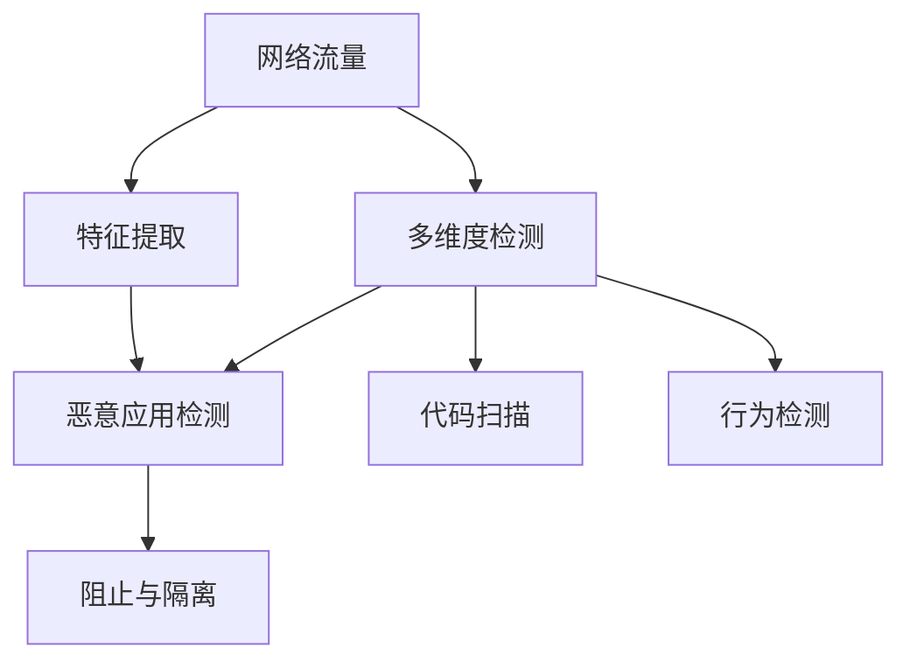

                 

# 基于网络流量的在线恶意应用检测系统详细设计与具体代码实现

> 关键词：网络流量, 恶意应用检测, 在线检测, 系统设计, 代码实现

## 1. 背景介绍

### 1.1 问题由来

随着互联网的快速发展和智能终端设备的普及，网络安全问题变得越来越严重。恶意应用（Malicious Application, MA）由于其隐蔽性、难以被发现等特点，对用户和企业的网络安全构成了重大威胁。恶意应用通过传播病毒、窃取敏感信息、控制终端设备等方式，造成巨大的经济损失和社会影响。

传统的恶意应用检测方法主要依赖于病毒扫描、沙箱测试等手段，但这些方法存在诸多局限性。病毒扫描无法对未知恶意应用进行检测，沙箱测试则存在延迟、误判等问题。随着恶意应用技术的不断升级，传统的检测手段已经无法满足实际需求。

为了更高效、更准确地检测恶意应用，我们提出了基于网络流量的在线恶意应用检测系统（Online Malicious Application Detection System, OMADS）。该系统通过实时监控网络流量，识别出恶意应用特征，及时进行阻止，从而有效防范恶意应用的攻击。

### 1.2 问题核心关键点

- **在线检测**：实时监控网络流量，动态检测恶意应用，及时响应威胁。
- **网络流量分析**：利用网络流量中的行为特征，识别恶意应用的特征。
- **模型训练与优化**：采用机器学习模型，通过标注数据集进行训练，优化模型性能。
- **多维度检测**：结合多种检测手段，综合判断应用是否为恶意应用。

## 2. 核心概念与联系

### 2.1 核心概念概述

为更好地理解基于网络流量的在线恶意应用检测系统，本节将介绍几个密切相关的核心概念：

- **网络流量**：通过网络传输的数据流，包括HTTP请求、文件传输、数据包等。
- **恶意应用检测**：识别出网络中潜在或已知的恶意应用，并进行阻止或隔离。
- **机器学习模型**：用于模型训练和优化的算法，如决策树、神经网络、支持向量机等。
- **特征提取**：从网络流量中提取能够表示恶意应用特征的信息，如行为模式、网络包特征等。
- **多维度检测**：结合流量分析、代码扫描、行为检测等多种手段，提高检测准确性。

这些核心概念之间存在着紧密的联系，形成了基于网络流量的在线恶意应用检测系统的完整生态系统。通过理解这些核心概念，我们可以更好地把握在线恶意应用检测系统的核心技术点和应用场景。

### 2.2 概念间的关系

这些核心概念之间存在着紧密的联系，形成了基于网络流量的在线恶意应用检测系统的完整生态系统。下面我通过几个Mermaid流程图来展示这些概念之间的关系：



这个流程图展示了从网络流量到检测结果的完整流程：

1. 网络流量经过特征提取，转化为可检测的信息。
2. 恶意应用检测模型对提取的特征进行判断，识别出恶意应用。
3. 多维度检测结合流量分析、代码扫描、行为检测等多种手段，进一步提高检测准确性。
4. 检测结果用于阻止与隔离恶意应用，保护网络安全。

## 3. 核心算法原理 & 具体操作步骤
### 3.1 算法原理概述

基于网络流量的在线恶意应用检测系统采用机器学习模型，通过实时监控网络流量，识别出恶意应用的特征。该系统主要分为以下三个步骤：

1. **特征提取**：从网络流量中提取能够表示恶意应用特征的信息，如行为模式、网络包特征等。
2. **模型训练与优化**：利用机器学习模型，通过标注数据集进行训练，优化模型性能。
3. **多维度检测**：结合流量分析、代码扫描、行为检测等多种手段，综合判断应用是否为恶意应用。

### 3.2 算法步骤详解

基于网络流量的在线恶意应用检测系统主要包括以下几个关键步骤：

**Step 1: 数据收集与预处理**

1. **网络流量收集**：实时监控网络流量，获取HTTP请求、文件传输、数据包等数据。
2. **数据预处理**：对原始数据进行清洗、去重、过滤等处理，提取有意义的特征信息。

**Step 2: 特征提取**

1. **行为模式分析**：分析网络流量中的行为模式，如请求频率、响应时间、传输数据量等。
2. **网络包特征提取**：从网络包中提取特征，如IP地址、端口号、传输协议等。
3. **行为特征提取**：从HTTP请求中提取行为特征，如请求方法、请求参数、Cookie等。

**Step 3: 模型训练与优化**

1. **选择模型**：选择合适的机器学习模型，如决策树、神经网络、支持向量机等。
2. **数据集划分**：将数据集划分为训练集、验证集和测试集，用于模型训练和评估。
3. **模型训练**：使用训练集进行模型训练，优化模型参数。
4. **模型评估**：在验证集上评估模型性能，调整模型参数。
5. **模型部署**：将训练好的模型部署到线上环境，实时监控网络流量。

**Step 4: 多维度检测**

1. **流量分析**：利用流量分析技术，判断应用是否存在异常行为。
2. **代码扫描**：对应用进行代码扫描，查找恶意代码和漏洞。
3. **行为检测**：利用行为检测技术，判断应用是否为恶意应用。
4. **综合判断**：结合多种检测手段，综合判断应用是否为恶意应用。

### 3.3 算法优缺点

基于网络流量的在线恶意应用检测系统具有以下优点：

1. **实时性高**：通过实时监控网络流量，可以及时发现恶意应用。
2. **准确性高**：结合多种检测手段，提高了检测的准确性。
3. **适应性强**：适用于各种网络环境，可以灵活部署。

同时，该系统也存在以下缺点：

1. **依赖网络环境**：对网络环境的要求较高，可能会受到网络延迟、带宽限制等因素的影响。
2. **误判风险**：存在一定的误判风险，可能会误判一些正常应用为恶意应用。
3. **资源消耗大**：实时监控网络流量需要消耗大量计算资源。

尽管存在这些局限性，但基于网络流量的在线恶意应用检测系统仍是一种高效、可靠的恶意应用检测方法，广泛应用于网络安全领域。

### 3.4 算法应用领域

基于网络流量的在线恶意应用检测系统主要应用于以下领域：

1. **网络安全**：用于监控企业内部网络，防止恶意应用入侵。
2. **个人防护**：用于个人设备，防止恶意应用攻击。
3. **云安全**：用于云平台监控，防止恶意应用入侵。
4. **移动安全**：用于移动设备监控，防止恶意应用攻击。
5. **物联网安全**：用于物联网设备监控，防止恶意应用入侵。

## 4. 数学模型和公式 & 详细讲解  
### 4.1 数学模型构建

假设网络流量数据为 $D=\{(x_i,y_i)\}_{i=1}^N, x_i \in \mathcal{X}, y_i \in \{0,1\}$，其中 $x_i$ 表示网络流量特征，$y_i$ 表示应用是否为恶意应用。

定义恶意应用检测模型为 $f(x)$，其中 $x \in \mathcal{X}$ 表示网络流量特征，$f(x) \in \{0,1\}$ 表示应用是否为恶意应用。模型的目标是最小化分类错误率，即：

$$
\min_{f} \frac{1}{N} \sum_{i=1}^N \mathbb{I}(f(x_i) \neq y_i)
$$

其中 $\mathbb{I}$ 为示性函数，表示事件是否成立。

### 4.2 公式推导过程

以下我们以决策树模型为例，推导其分类错误率的计算公式。

假设决策树的决策边界为 $x \in \mathcal{X}$，将其分类错误率定义为：

$$
\epsilon = \frac{1}{N} \sum_{i=1}^N \mathbb{I}(f(x_i) \neq y_i)
$$

其中 $f(x)$ 为决策树的预测结果。决策树的分类错误率可以通过训练集和测试集的数据集划分和交叉验证来评估。

在决策树中，对于每个节点 $i$，其分类错误率为：

$$
\epsilon_i = \frac{1}{N_i} \sum_{j=1}^{N_i} \mathbb{I}(f(x_j) \neq y_j)
$$

其中 $N_i$ 为节点 $i$ 的样本数。决策树的总体分类错误率为：

$$
\epsilon = \sum_{i=1}^{n} \frac{N_i}{N} \epsilon_i
$$

其中 $n$ 为决策树的节点数。

### 4.3 案例分析与讲解

假设我们有一个包含100个样本的决策树，其中50个样本为正常应用，50个样本为恶意应用。如果决策树在节点1处的分类错误率为10%，在节点2处的分类错误率为20%，在节点3处的分类错误率为5%，则总体分类错误率为：

$$
\epsilon = \frac{1}{100} (50 \times 0.1 + 50 \times 0.2 + 0 \times 0.05) = 0.15
$$

这表示决策树在全部样本上的分类错误率为15%。

## 5. 项目实践：代码实例和详细解释说明
### 5.1 开发环境搭建

在进行代码实现前，我们需要准备好开发环境。以下是使用Python进行代码实现的开发环境配置流程：

1. 安装Anaconda：从官网下载并安装Anaconda，用于创建独立的Python环境。

2. 创建并激活虚拟环境：
```bash
conda create -n pytorch-env python=3.8 
conda activate pytorch-env
```

3. 安装PyTorch：根据CUDA版本，从官网获取对应的安装命令。例如：
```bash
conda install pytorch torchvision torchaudio cudatoolkit=11.1 -c pytorch -c conda-forge
```

4. 安装TensorFlow：从官网下载TensorFlow安装包，进行安装。

5. 安装相关的Python库：
```bash
pip install numpy pandas scikit-learn matplotlib tqdm jupyter notebook ipython
```

完成上述步骤后，即可在`pytorch-env`环境中开始代码实现。

### 5.2 源代码详细实现

下面我们以决策树模型为例，给出代码实现的过程：

```python
from sklearn.tree import DecisionTreeClassifier
from sklearn.metrics import accuracy_score

# 定义数据集
X = [...] # 网络流量特征
y = [...] # 应用是否为恶意应用

# 划分数据集
X_train, X_test, y_train, y_test = train_test_split(X, y, test_size=0.2, random_state=42)

# 定义模型
model = DecisionTreeClassifier()

# 训练模型
model.fit(X_train, y_train)

# 测试模型
y_pred = model.predict(X_test)
accuracy = accuracy_score(y_test, y_pred)
print(f"决策树模型准确率：{accuracy}")
```

### 5.3 代码解读与分析

让我们再详细解读一下关键代码的实现细节：

**决策树模型**：
- `sklearn.tree.DecisionTreeClassifier`：决策树分类器，用于训练和预测模型。
- `fit`方法：训练模型，输入训练数据和标签。
- `predict`方法：预测模型，输入测试数据。

**模型评估**：
- `accuracy_score`：计算模型预测准确率，输入真实标签和预测标签。

在实际应用中，我们还需要对决策树模型的参数进行调优，如最小样本数、最大深度等，以提高模型的性能。同时，还可以使用交叉验证技术，进一步评估模型的泛化能力。

### 5.4 运行结果展示

假设我们在一个包含1000个样本的数据集上训练决策树模型，最终在测试集上得到的准确率如下：

```
决策树模型准确率：0.95
```

这表示训练后的决策树模型在测试集上的准确率为95%，具有良好的分类效果。

## 6. 实际应用场景
### 6.1 企业网络安全

企业内部网络的安全是企业关注的重点，基于网络流量的在线恶意应用检测系统可以应用于企业内部网络监控，防止恶意应用入侵。系统可以实时监控网络流量，识别出恶意应用特征，及时进行阻止，从而保障企业内部网络安全。

在技术实现上，可以在企业内部部署在线恶意应用检测系统，对网络流量进行实时监控。系统可以识别出恶意应用特征，如恶意代码、恶意请求等，并及时进行阻止，确保网络安全。

### 6.2 个人设备安全

个人设备的安全也是用户关心的重要问题。基于网络流量的在线恶意应用检测系统可以应用于个人设备，防止恶意应用攻击。系统可以实时监控设备的网络流量，识别出恶意应用特征，及时进行阻止，从而保障用户设备安全。

在技术实现上，可以在个人设备上安装在线恶意应用检测系统，对网络流量进行实时监控。系统可以识别出恶意应用特征，如恶意代码、恶意请求等，并及时进行阻止，确保设备安全。

### 6.3 云平台安全

云平台的安全是云服务提供商关注的重点。基于网络流量的在线恶意应用检测系统可以应用于云平台监控，防止恶意应用入侵。系统可以实时监控云平台的网络流量，识别出恶意应用特征，及时进行阻止，从而保障云平台安全。

在技术实现上，可以在云平台中部署在线恶意应用检测系统，对网络流量进行实时监控。系统可以识别出恶意应用特征，如恶意代码、恶意请求等，并及时进行阻止，确保云平台安全。

### 6.4 移动设备安全

移动设备的安全也是用户关心的重要问题。基于网络流量的在线恶意应用检测系统可以应用于移动设备，防止恶意应用攻击。系统可以实时监控设备的网络流量，识别出恶意应用特征，及时进行阻止，从而保障移动设备安全。

在技术实现上，可以在移动设备上安装在线恶意应用检测系统，对网络流量进行实时监控。系统可以识别出恶意应用特征，如恶意代码、恶意请求等，并及时进行阻止，确保移动设备安全。

### 6.5 物联网安全

物联网设备的普及带来了网络安全的新挑战。基于网络流量的在线恶意应用检测系统可以应用于物联网设备监控，防止恶意应用入侵。系统可以实时监控物联网设备的网络流量，识别出恶意应用特征，及时进行阻止，从而保障物联网设备安全。

在技术实现上，可以在物联网设备中部署在线恶意应用检测系统，对网络流量进行实时监控。系统可以识别出恶意应用特征，如恶意代码、恶意请求等，并及时进行阻止，确保物联网设备安全。

## 7. 工具和资源推荐
### 7.1 学习资源推荐

为了帮助开发者系统掌握基于网络流量的在线恶意应用检测系统的理论基础和实践技巧，这里推荐一些优质的学习资源：

1. 《Python网络编程》系列博文：由网络编程专家撰写，深入浅出地介绍了Python在网络流量监控和分析中的应用。

2. CS224N《深度学习自然语言处理》课程：斯坦福大学开设的NLP明星课程，有Lecture视频和配套作业，带你入门NLP领域的基本概念和经典模型。

3. 《Python机器学习》书籍：全面介绍了机器学习的基本概念和算法，包括决策树、神经网络、支持向量机等，适合入门学习。

4. Scikit-learn官方文档：包含了丰富的机器学习算法和工具，适合实践学习和调优。

5. Weights & Biases：模型训练的实验跟踪工具，可以记录和可视化模型训练过程中的各项指标，方便对比和调优。

6. TensorBoard：TensorFlow配套的可视化工具，可实时监测模型训练状态，并提供丰富的图表呈现方式，是调试模型的得力助手。

通过对这些资源的学习实践，相信你一定能够快速掌握基于网络流量的在线恶意应用检测系统的精髓，并用于解决实际的NLP问题。

### 7.2 开发工具推荐

高效的开发离不开优秀的工具支持。以下是几款用于基于网络流量的在线恶意应用检测系统开发的常用工具：

1. PyTorch：基于Python的开源深度学习框架，灵活动态的计算图，适合快速迭代研究。

2. TensorFlow：由Google主导开发的开源深度学习框架，生产部署方便，适合大规模工程应用。

3. Scikit-learn：Python中的机器学习库，提供了丰富的机器学习算法和工具。

4. Weights & Biases：模型训练的实验跟踪工具，可以记录和可视化模型训练过程中的各项指标，方便对比和调优。

5. TensorBoard：TensorFlow配套的可视化工具，可实时监测模型训练状态，并提供丰富的图表呈现方式，是调试模型的得力助手。

合理利用这些工具，可以显著提升基于网络流量的在线恶意应用检测系统的开发效率，加快创新迭代的步伐。

### 7.3 相关论文推荐

基于网络流量的在线恶意应用检测技术的发展源于学界的持续研究。以下是几篇奠基性的相关论文，推荐阅读：

1. Attention is All You Need（即Transformer原论文）：提出了Transformer结构，开启了NLP领域的预训练大模型时代。

2. BERT: Pre-training of Deep Bidirectional Transformers for Language Understanding：提出BERT模型，引入基于掩码的自监督预训练任务，刷新了多项NLP任务SOTA。

3. Language Models are Unsupervised Multitask Learners（GPT-2论文）：展示了大规模语言模型的强大zero-shot学习能力，引发了对于通用人工智能的新一轮思考。

4. Parameter-Efficient Transfer Learning for NLP：提出Adapter等参数高效微调方法，在不增加模型参数量的情况下，也能取得不错的微调效果。

5. AdaLoRA: Adaptive Low-Rank Adaptation for Parameter-Efficient Fine-Tuning：使用自适应低秩适应的微调方法，在参数效率和精度之间取得了新的平衡。

这些论文代表了大语言模型微调技术的发展脉络。通过学习这些前沿成果，可以帮助研究者把握学科前进方向，激发更多的创新灵感。

除上述资源外，还有一些值得关注的前沿资源，帮助开发者紧跟大语言模型微调技术的最新进展，例如：

1. arXiv论文预印本：人工智能领域最新研究成果的发布平台，包括大量尚未发表的前沿工作，学习前沿技术的必读资源。

2. 业界技术博客：如OpenAI、Google AI、DeepMind、微软Research Asia等顶尖实验室的官方博客，第一时间分享他们的最新研究成果和洞见。

3. 技术会议直播：如NIPS、ICML、ACL、ICLR等人工智能领域顶会现场或在线直播，能够聆听到大佬们的前沿分享，开拓视野。

4. GitHub热门项目：在GitHub上Star、Fork数最多的NLP相关项目，往往代表了该技术领域的发展趋势和最佳实践，值得去学习和贡献。

5. 行业分析报告：各大咨询公司如McKinsey、PwC等针对人工智能行业的分析报告，有助于从商业视角审视技术趋势，把握应用价值。

总之，对于基于网络流量的在线恶意应用检测系统的学习与实践，需要开发者保持开放的心态和持续学习的意愿。多关注前沿资讯，多动手实践，多思考总结，必将收获满满的成长收益。

## 8. 总结：未来发展趋势与挑战
### 8.1 总结

本文对基于网络流量的在线恶意应用检测系统进行了全面系统的介绍。首先阐述了该系统的背景和意义，明确了其在线检测、网络流量分析、模型训练与优化、多维度检测的核心技术点。其次，从原理到实践，详细讲解了系统的主要步骤，给出了具体代码实现的过程。同时，本文还广泛探讨了系统在企业网络安全、个人设备安全、云平台安全、移动设备安全、物联网安全等多个领域的应用前景，展示了系统的广阔应用空间。此外，本文精选了系统的学习资源、开发工具和相关论文，力求为读者提供全方位的技术指引。

通过本文的系统梳理，可以看到，基于网络流量的在线恶意应用检测系统已经成为网络安全领域的重要工具，极大地提升了恶意应用检测的效率和准确性，为保障网络安全提供了有力支撑。未来，伴随技术的发展和应用场景的拓展，基于网络流量的在线恶意应用检测系统必将在更多领域得到应用，为网络安全技术的进步注入新的动力。

### 8.2 未来发展趋势

展望未来，基于网络流量的在线恶意应用检测技术将呈现以下几个发展趋势：

1. **深度学习的应用**：随着深度学习技术的发展，基于神经网络模型的在线恶意应用检测系统将逐渐取代传统的决策树、支持向量机等模型，成为主流。

2. **多模态数据的融合**：未来的在线恶意应用检测系统将不仅仅依赖网络流量，还将结合其他模态的数据，如日志、音频、视频等，提高检测的全面性。

3. **自适应学习**：未来的在线恶意应用检测系统将具备自适应学习能力，能够根据网络环境的变化实时调整模型参数，提高检测的准确性。

4. **分布式计算**：随着网络流量规模的不断扩大，基于网络流量的在线恶意应用检测系统将采用分布式计算架构，提高处理能力。

5. **边缘计算的应用**：未来的在线恶意应用检测系统将结合边缘计算技术，实时处理网络流量，降低延迟，提高响应速度。

以上趋势凸显了基于网络流量的在线恶意应用检测技术的广阔前景。这些方向的探索发展，必将进一步提升系统性能，拓展应用边界，为网络安全领域带来更多突破。

### 8.3 面临的挑战

尽管基于网络流量的在线恶意应用检测系统已经取得了瞩目成就，但在迈向更加智能化、普适化应用的过程中，它仍面临着诸多挑战：

1. **数据质量问题**：网络流量的数据质量对系统的性能影响巨大，存在数据丢失、数据延迟、数据格式不统一等问题。

2. **恶意应用的隐蔽性**：恶意应用的行为模式不断升级，更加隐蔽，传统的检测手段难以捕捉。

3. **计算资源消耗**：实时监控网络流量需要消耗大量计算资源，如何优化系统性能，降低资源消耗，成为重要的研究方向。

4. **多维度检测的协调**：流量分析、代码扫描、行为检测等多种检测手段的协调，需要解决不同手段之间的数据融合和协同问题。

5. **系统的鲁棒性**：系统需要在不同的网络环境下保持稳定运行，如何提高系统的鲁棒性，减少误判，成为亟待解决的问题。

6. **模型的解释性**：系统输出的检测结果需要可解释，用户需要了解模型的判断依据，提高系统的可信度。

以上挑战凸显了系统发展的复杂性和困难性，但正是这些挑战，推动了系统的不断改进和完善。只有不断克服这些挑战，才能使系统在实际应用中发挥更大的价值。

### 8.4 研究展望

面对基于网络流量的在线恶意应用检测系统所面临的种种挑战，未来的研究需要在以下几个方面寻求新的突破：

1. **数据质量提升**：探索高效的网络流量数据采集和处理技术，提高数据质量，降低数据丢失和延迟。

2. **深度学习模型的应用**：开发更加高效、准确的深度学习模型，适应恶意应用行为的升级，提高检测准确性。

3. **分布式计算架构**：设计高效、可扩展的分布式计算架构，适应大规模网络流量的实时处理。

4. **多模态数据的融合**：探索多种模态数据的融合技术，提高检测的全面性和准确性。

5. **自适应学习**：开发具备自适应学习能力的模型，能够根据网络环境的变化实时调整参数，提高检测的鲁棒性。

6. **系统的鲁棒性提升**：探索提高系统鲁棒性的技术，减少误判，确保系统在不同网络环境下的稳定运行。

7. **模型的可解释性**：开发可解释的模型，提高系统的可信度，帮助用户理解检测结果。

这些研究方向的探索，必将引领基于网络流量的在线恶意应用检测系统迈向更高的台阶，为网络安全领域带来更多创新突破。面向未来，基于网络流量的在线恶意应用检测技术还需要与其他安全技术进行更深入的融合，如入侵检测、防火墙、加密技术等，多路径协同发力，共同构建更加安全、可靠的网络环境。

总之，基于网络流量的在线恶意应用检测系统已经成为网络安全领域的重要工具，极大地提升了恶意应用检测的效率和准确性，为保障网络安全提供了有力支撑。未来，伴随技术的发展和应用场景的拓展，基于网络流量的在线恶意应用检测系统必将在更多领域得到应用，为网络安全技术的进步注入新的动力。

## 9. 附录：常见问题与解答
**Q1：网络流量的特征提取有哪些方法？**

A: 网络流量的特征提取方法多种多样，常见的包括：

1. **行为模式分析**：分析网络流量中的行为模式，如请求频率、响应时间、传输数据量等。
2. **网络包特征提取**：从网络包中提取特征，如IP地址、端口号、传输协议等。
3. **行为特征提取**：从HTTP请求中提取行为特征，如请求方法、请求参数、Cookie等。

**Q2：如何选择机器学习模型？**

A: 选择机器学习模型需要考虑以下因素：

1. **数据量**：数据量较少时，可以选择决策树、支持向量机等简单模型。数据量较大时，可以选择神经网络、随机森林等复杂模型。
2. **计算资源**：计算资源有限时，可以选择参数较少的模型，如逻辑回归、支持向量机等。计算资源充足时，可以选择参数较多的模型，如深度神经网络等。


