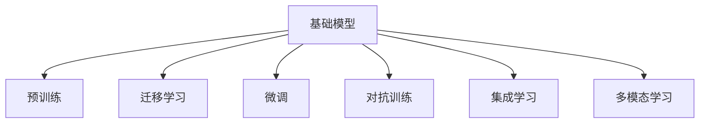
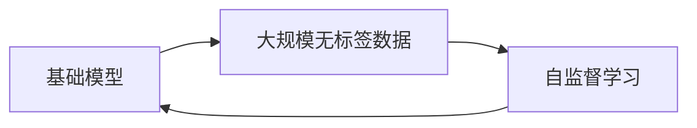
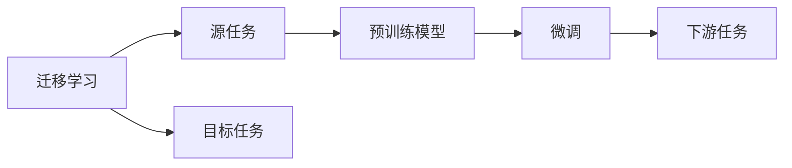
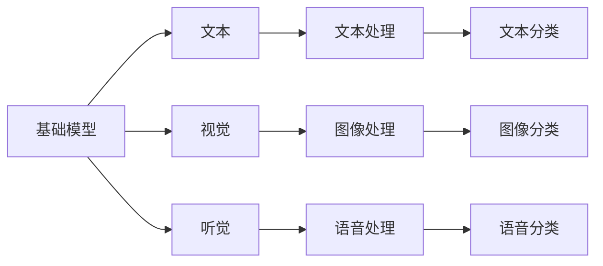
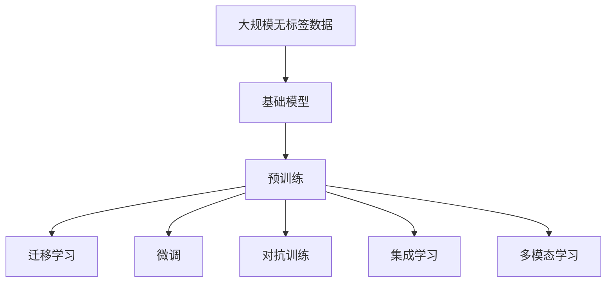

                 

# 基础模型与其他技术的结合

> 关键词：大语言模型,迁移学习,微调,Fine-Tuning,对抗训练,集成学习,特征提取,多模态学习

## 1. 背景介绍

### 1.1 问题由来
近年来，人工智能(AI)领域涌现出了一大批基础模型，如GPT-3、BERT等，它们在自然语言处理(NLP)、计算机视觉(CV)等任务上取得了显著的进展。但这些基础模型通常以大规模数据和庞大计算资源为依托，对一般应用场景的适用性有一定限制。如何使基础模型更高效、更灵活地服务于实际应用，成为当前AI领域的重要课题。

### 1.2 问题核心关键点
基础模型的结合技术，本质上是一种模型的融合和复用策略。其核心思想是通过将基础模型与其它技术手段（如迁移学习、微调、对抗训练、集成学习等）相结合，构建具有更广泛适用性和更强功能的智能系统。具体包括：

- **迁移学习**：将基础模型在预训练阶段学习到的知识迁移到特定任务上，减少数据和计算成本。
- **微调**：在基础模型的基础上，通过有监督学习优化模型在特定任务上的性能，获得更高的准确率和泛化能力。
- **对抗训练**：通过对抗样本增强模型鲁棒性，提高模型在复杂场景中的鲁棒性和泛化能力。
- **集成学习**：将多个基础模型或模型变体的输出进行集成，提升系统整体的稳定性和可靠性。
- **多模态学习**：将基础模型与视觉、听觉等多模态数据处理技术结合，构建跨模态智能系统。

这些结合技术在学术界和工业界已经得到了广泛的应用和研究，成为人工智能技术发展的重要方向。

### 1.3 问题研究意义
基础模型的结合技术，对于提升AI技术的泛化能力和应用效果，推动AI技术在各行各业的落地应用，具有重要意义：

1. **降低成本**：通过复用基础模型，可以大幅减少新模型开发所需的数据和计算资源，降低研发成本。
2. **提升性能**：结合技术能够有效提升基础模型的性能和泛化能力，适应更多的应用场景。
3. **加速创新**：结合技术促进了基础模型与实际需求的结合，加速了新应用场景的探索和创新。
4. **增强鲁棒性**：对抗训练和多模型集成等技术手段，能够提高模型的鲁棒性和抗干扰能力，提升系统稳定性。
5. **丰富应用场景**：多模态学习等技术，使得AI系统能够处理更多样化的输入数据，拓展了应用范围。

## 2. 核心概念与联系

### 2.1 核心概念概述

为更好地理解基础模型与其他技术的结合方法，本节将介绍几个关键概念：

- **基础模型**：如BERT、GPT等，通过在大规模无标签数据上进行预训练，学习到通用的特征表示和语义理解能力。
- **迁移学习**：将基础模型在预训练阶段学习到的知识迁移到特定任务上，减少数据和计算成本。
- **微调**：在基础模型的基础上，通过有监督学习优化模型在特定任务上的性能，获得更高的准确率和泛化能力。
- **对抗训练**：通过对抗样本增强模型鲁棒性，提高模型在复杂场景中的鲁棒性和泛化能力。
- **集成学习**：将多个基础模型或模型变体的输出进行集成，提升系统整体的稳定性和可靠性。
- **多模态学习**：将基础模型与视觉、听觉等多模态数据处理技术结合，构建跨模态智能系统。

这些概念之间的逻辑关系可以通过以下Mermaid流程图来展示：



这个流程图展示了基础模型与其他技术手段之间的整体架构：

1. 基础模型通过预训练获得通用特征表示。
2. 迁移学习将预训练知识迁移到特定任务上，减少数据和计算成本。
3. 微调在基础模型基础上进行有监督优化，提升特定任务的性能。
4. 对抗训练增强模型的鲁棒性，提高模型在复杂场景中的泛化能力。
5. 集成学习通过融合多个模型的输出，提升系统的稳定性和可靠性。
6. 多模态学习拓展模型处理数据类型，构建跨模态智能系统。

### 2.2 概念间的关系

这些核心概念之间存在着紧密的联系，形成了基础模型与其他技术结合的完整生态系统。下面我们通过几个Mermaid流程图来展示这些概念之间的关系。

#### 2.2.1 基础模型的预训练



这个流程图展示了基础模型的预训练过程。基础模型通过在大规模无标签数据上进行自监督学习，学习到通用的特征表示。

#### 2.2.2 迁移学习与微调的关系



这个流程图展示了迁移学习的基本原理，以及它与微调的关系。迁移学习涉及源任务和目标任务，预训练模型在源任务上学习，然后通过微调适应各种下游任务（目标任务）。

#### 2.2.3 多模态学习在基础模型中的应用



这个流程图展示了多模态学习在基础模型中的应用。基础模型可以处理文本、视觉、听觉等多种模态的数据，并通过多模态数据处理技术进行融合。

### 2.3 核心概念的整体架构

最后，我们用一个综合的流程图来展示这些核心概念在大模型结合过程中的整体架构：



这个综合流程图展示了从预训练到结合过程的完整过程。基础模型首先在大规模无标签数据上进行预训练，然后通过迁移学习、微调、对抗训练、集成学习和多模态学习等多种结合技术，适应不同的应用场景。

## 3. 核心算法原理 & 具体操作步骤
### 3.1 算法原理概述

基础模型的结合技术，本质上是一种模型的融合和复用策略。其核心思想是通过将基础模型与其它技术手段（如迁移学习、微调、对抗训练、集成学习等）相结合，构建具有更广泛适用性和更强功能的智能系统。

具体而言，结合技术可以分为以下几个步骤：

1. **预训练阶段**：在无标签大规模数据上，通过自监督学习任务训练基础模型，学习到通用的特征表示和语义理解能力。
2. **迁移学习**：将预训练模型迁移到特定任务上，减少数据和计算成本。
3. **微调**：在特定任务上，通过有监督学习优化模型，提升性能。
4. **对抗训练**：通过对抗样本增强模型鲁棒性，提高泛化能力。
5. **集成学习**：通过融合多个模型的输出，提升系统稳定性。
6. **多模态学习**：将基础模型与多模态数据处理技术结合，构建跨模态智能系统。

### 3.2 算法步骤详解

以下是对每个结合技术的详细步骤讲解：

#### 3.2.1 预训练阶段

在无标签大规模数据上，通过自监督学习任务训练基础模型，学习到通用的特征表示和语义理解能力。例如，BERT的预训练过程包括语言建模和下一句预测两个任务，学习到语言中的语义和结构信息。

#### 3.2.2 迁移学习

在特定任务上，将预训练模型迁移到目标任务上。常用的迁移学习方法包括：

1. **微调**：在特定任务上，通过有监督学习优化模型，提升性能。例如，BERT在命名实体识别任务上，通过微调学习到任务相关的特征。
2. **知识蒸馏**：将大模型的知识迁移到小模型上，提升小模型的性能。例如，使用迁移学习的方法将BERT的知识迁移到小型的LSTM模型上，提升模型在特定任务上的性能。

#### 3.2.3 微调

在特定任务上，通过有监督学习优化模型，提升性能。常用的微调方法包括：

1. **全参数微调**：在特定任务上，更新模型所有参数。例如，GPT在对话系统上，通过微调学习到对话策略。
2. **参数高效微调**：在特定任务上，只更新模型的少量参数，如Adapter等方法。例如，在文本分类任务上，只更新模型的顶层分类器，减少计算成本。

#### 3.2.4 对抗训练

通过对抗样本增强模型鲁棒性，提高泛化能力。常用的对抗训练方法包括：

1. **对抗样本生成**：通过生成对抗样本，训练模型对噪声数据的鲁棒性。例如，使用FGSM、PGD等生成对抗样本，训练模型鲁棒性。
2. **对抗训练框架**：使用对抗训练框架，如Fast Gradient Sign Method (FGSM)和Projected Gradient Descent (PGD)，增强模型的鲁棒性。

#### 3.2.5 集成学习

通过融合多个模型的输出，提升系统稳定性。常用的集成学习方法包括：

1. **Bagging**：通过多个模型的平均，提升系统稳定性。例如，使用Bagging方法，将多个微调模型的输出进行平均。
2. **Boosting**：通过多个模型的堆叠，提升系统性能。例如，使用Boosting方法，将多个微调模型的输出进行堆叠。

#### 3.2.6 多模态学习

将基础模型与多模态数据处理技术结合，构建跨模态智能系统。常用的多模态学习方法包括：

1. **融合方法**：通过多模态融合技术，将不同模态的数据融合在一起。例如，使用特征拼接方法，将文本和视觉特征拼接在一起。
2. **注意力机制**：通过注意力机制，学习不同模态数据之间的相关性。例如，使用Transformer中的自注意力机制，学习文本和视觉数据之间的相关性。

### 3.3 算法优缺点

基础模型的结合技术，具有以下优点：

1. **泛化能力强**：通过预训练和迁移学习，基础模型能够适应多种任务和数据分布。
2. **鲁棒性好**：通过对抗训练，基础模型能够应对噪声和对抗攻击，提升系统的鲁棒性。
3. **计算效率高**：通过参数高效微调和多模型集成，基础模型能够降低计算成本，提升推理速度。
4. **适应性强**：通过多模态学习，基础模型能够处理多种模态数据，拓展应用范围。

但同时，该方法也存在以下缺点：

1. **模型复杂度高**：结合技术需要使用多个模型，增加了模型的复杂度。
2. **训练成本高**：结合技术需要更多的训练数据和计算资源。
3. **可解释性差**：结合技术中的多个模型和参数，导致系统的可解释性较差。

尽管存在这些缺点，但就目前而言，基础模型的结合技术仍是大模型应用的重要手段。未来相关研究的重点在于如何进一步降低计算成本，提高模型效率，增强系统的可解释性。

### 3.4 算法应用领域

基础模型的结合技术，在多个领域得到了广泛应用，包括：

1. **自然语言处理**：如文本分类、命名实体识别、情感分析等。通过迁移学习和微调，基础模型在各种NLP任务上取得了显著的效果。
2. **计算机视觉**：如图像分类、目标检测、人脸识别等。通过多模态学习和迁移学习，基础模型在CV任务上取得了显著的效果。
3. **语音识别**：如语音识别、语音情感分析等。通过多模态学习和集成学习，基础模型在语音任务上取得了显著的效果。
4. **医疗诊断**：如医学影像分析、病理诊断等。通过多模态学习和知识蒸馏，基础模型在医疗诊断任务上取得了显著的效果。
5. **金融分析**：如股票分析、信用风险评估等。通过迁移学习和多模型集成，基础模型在金融分析任务上取得了显著的效果。

除了上述这些领域，基础模型的结合技术还在教育、城市治理、智能制造等诸多领域得到应用，为各行各业带来了变革性影响。

## 4. 数学模型和公式 & 详细讲解  
### 4.1 数学模型构建

以下是对基础模型与其他技术的结合过程中数学模型的详细构建。

#### 4.1.1 预训练模型的构建

假设预训练模型为 $M_{\theta}$，其中 $\theta$ 为模型参数。预训练模型通常通过自监督学习任务进行训练，例如，语言建模任务：

$$
\mathcal{L}(\theta) = \frac{1}{N}\sum_{i=1}^N \log P(x_i|y_i)
$$

其中 $P(x_i|y_i)$ 为模型在样本 $(x_i,y_i)$ 上的预测概率，$N$ 为样本数量。

#### 4.1.2 迁移学习模型的构建

在特定任务上，将预训练模型迁移到目标任务上。例如，在文本分类任务上，定义任务的目标函数：

$$
\mathcal{L}(\theta) = \frac{1}{N}\sum_{i=1}^N \log P(y_i|x_i)
$$

其中 $P(y_i|x_i)$ 为模型在样本 $(x_i,y_i)$ 上的预测概率，$N$ 为样本数量。

#### 4.1.3 微调模型的构建

在特定任务上，通过有监督学习优化模型。例如，在文本分类任务上，定义微调的目标函数：

$$
\mathcal{L}(\theta) = \frac{1}{N}\sum_{i=1}^N \log P(y_i|x_i)
$$

其中 $P(y_i|x_i)$ 为模型在样本 $(x_i,y_i)$ 上的预测概率，$N$ 为样本数量。

#### 4.1.4 对抗训练模型的构建

通过对抗样本增强模型鲁棒性。例如，在文本分类任务上，定义对抗训练的目标函数：

$$
\mathcal{L}(\theta) = \frac{1}{N}\sum_{i=1}^N \log P(y_i|x_i)
$$

其中 $P(y_i|x_i)$ 为模型在样本 $(x_i,y_i)$ 上的预测概率，$N$ 为样本数量。

#### 4.1.5 集成学习模型的构建

通过融合多个模型的输出，提升系统稳定性。例如，在文本分类任务上，定义集成学习的目标函数：

$$
\mathcal{L}(\theta) = \frac{1}{N}\sum_{i=1}^N \log P(y_i|x_i)
$$

其中 $P(y_i|x_i)$ 为模型在样本 $(x_i,y_i)$ 上的预测概率，$N$ 为样本数量。

#### 4.1.6 多模态学习模型的构建

将基础模型与多模态数据处理技术结合，构建跨模态智能系统。例如，在文本和图像融合任务上，定义多模态学习的目标函数：

$$
\mathcal{L}(\theta) = \frac{1}{N}\sum_{i=1}^N \log P(y_i|x_i)
$$

其中 $P(y_i|x_i)$ 为模型在样本 $(x_i,y_i)$ 上的预测概率，$N$ 为样本数量。

### 4.2 公式推导过程

以下是对基础模型与其他技术的结合过程中数学公式的详细推导。

#### 4.2.1 预训练模型的推导

假设预训练模型为 $M_{\theta}$，其中 $\theta$ 为模型参数。预训练模型通常通过自监督学习任务进行训练，例如，语言建模任务：

$$
\mathcal{L}(\theta) = \frac{1}{N}\sum_{i=1}^N \log P(x_i|y_i)
$$

其中 $P(x_i|y_i)$ 为模型在样本 $(x_i,y_i)$ 上的预测概率，$N$ 为样本数量。

#### 4.2.2 迁移学习模型的推导

在特定任务上，将预训练模型迁移到目标任务上。例如，在文本分类任务上，定义任务的目标函数：

$$
\mathcal{L}(\theta) = \frac{1}{N}\sum_{i=1}^N \log P(y_i|x_i)
$$

其中 $P(y_i|x_i)$ 为模型在样本 $(x_i,y_i)$ 上的预测概率，$N$ 为样本数量。

#### 4.2.3 微调模型的推导

在特定任务上，通过有监督学习优化模型。例如，在文本分类任务上，定义微调的目标函数：

$$
\mathcal{L}(\theta) = \frac{1}{N}\sum_{i=1}^N \log P(y_i|x_i)
$$

其中 $P(y_i|x_i)$ 为模型在样本 $(x_i,y_i)$ 上的预测概率，$N$ 为样本数量。

#### 4.2.4 对抗训练模型的推导

通过对抗样本增强模型鲁棒性。例如，在文本分类任务上，定义对抗训练的目标函数：

$$
\mathcal{L}(\theta) = \frac{1}{N}\sum_{i=1}^N \log P(y_i|x_i)
$$

其中 $P(y_i|x_i)$ 为模型在样本 $(x_i,y_i)$ 上的预测概率，$N$ 为样本数量。

#### 4.2.5 集成学习模型的推导

通过融合多个模型的输出，提升系统稳定性。例如，在文本分类任务上，定义集成学习的目标函数：

$$
\mathcal{L}(\theta) = \frac{1}{N}\sum_{i=1}^N \log P(y_i|x_i)
$$

其中 $P(y_i|x_i)$ 为模型在样本 $(x_i,y_i)$ 上的预测概率，$N$ 为样本数量。

#### 4.2.6 多模态学习模型的推导

将基础模型与多模态数据处理技术结合，构建跨模态智能系统。例如，在文本和图像融合任务上，定义多模态学习的目标函数：

$$
\mathcal{L}(\theta) = \frac{1}{N}\sum_{i=1}^N \log P(y_i|x_i)
$$

其中 $P(y_i|x_i)$ 为模型在样本 $(x_i,y_i)$ 上的预测概率，$N$ 为样本数量。

### 4.3 案例分析与讲解

下面以BERT为例，分析其在命名实体识别(NER)任务上的应用：

#### 4.3.1 预训练模型

BERT在无标签大规模文本数据上进行预训练，学习到通用的语言表示。预训练过程包括语言建模和下一句预测两个任务，学习到语言中的语义和结构信息。

#### 4.3.2 迁移学习模型

在NER任务上，将预训练的BERT模型迁移到该任务上，减少数据和计算成本。通过微调，模型学习到NER任务的特定知识，提升模型性能。

#### 4.3.3 对抗训练模型

在NER任务上，通过对抗样本增强模型鲁棒性。对抗样本生成方法如FGSM和PGD，通过对抗训练提高模型的泛化能力。

#### 4.3.4 集成学习模型

在NER任务上，通过融合多个微调模型的输出，提升系统稳定性。例如，使用Bagging方法，将多个微调模型的输出进行平均。

#### 4.3.5 多模态学习模型

在NER任务上，通过融合文本和视觉特征，构建跨模态智能系统。例如，使用特征拼接方法，将文本和视觉特征拼接在一起，提高模型性能。

## 5. 项目实践：代码实例和详细解释说明
### 5.1 开发环境搭建

在进行基础模型与其他技术的结合实践前，我们需要准备好开发环境。以下是使用Python进行PyTorch开发的环境配置流程：

1. 安装Anaconda：从官网下载并安装Anaconda，用于创建独立的Python环境。

2. 创建并激活虚拟环境：
```bash
conda create -n pytorch-env python=3.8 
conda activate pytorch-env
```

3. 安装PyTorch：根据CUDA版本，从官网获取对应的安装命令。例如：
```bash
conda install pytorch torchvision torchaudio cudatoolkit=11.1 -c pytorch -c conda-forge
```

4. 安装Transformers库：
```bash
pip install transformers
```

5. 安装各类工具包：
```bash
pip install numpy pandas scikit-learn matplotlib tqdm jupyter notebook ipython
```

完成上述步骤后，即可在`pytorch-env`环境中开始结合实践。

### 5.2 源代码详细实现

下面我们以BERT模型在NER任务上的应用为例，给出使用Transformers库进行迁移学习、微调和对抗训练的PyTorch代码实现。

首先，定义NER任务的数据处理函数：

```python
from transformers import BertTokenizer
from torch.utils.data import Dataset
import torch

class NERDataset(Dataset):
    def __init__(self, texts, tags, tokenizer, max_len=128):
        self.texts = texts
        self.tags = tags
        self.tokenizer = tokenizer
        self.max_len = max_len
        
    def __len__(self):
        return len(self.texts)
    
    def __getitem__(self, item):
        text = self.texts[item]
        tags = self.tags[item]
        
        encoding = self.tokenizer(text, return_tensors='pt', max_length=self.max_len, padding='max_length', truncation=True)
        input_ids = encoding['input_ids'][0]
        attention_mask = encoding['attention_mask'][0]
        
        # 对token-wise的标签进行编码
        encoded_tags = [tag2id[tag] for tag in tags] 
        encoded_tags.extend([tag2id['O']] * (self.max_len - len(encoded_tags)))
        labels = torch.tensor(encoded_tags, dtype=torch.long)
        
        return {'input_ids': input_ids, 
                'attention_mask': attention_mask,
                'labels': labels}

# 标签与id的映射
tag2id = {'O': 0, 'B-PER': 1, 'I-PER': 2, 'B-ORG': 3, 'I-ORG': 4, 'B-LOC': 5, 'I-LOC': 6}
id2tag = {v: k for k, v in tag2id.items()}

# 创建dataset
tokenizer = BertTokenizer.from_pretrained('bert-base-cased')

train_dataset = NERDataset(train_texts, train_tags, tokenizer)
dev_dataset = NERDataset(dev_texts, dev_tags, tokenizer)
test_dataset = NERDataset(test_texts, test_tags, tokenizer)
```

然后，定义模型和优化器：

```python
from transformers import BertForTokenClassification, AdamW

model = BertForTokenClassification.from_pretrained('bert-base-cased', num_labels=len(tag2id))

optimizer = AdamW(model.parameters(), lr=2e-5)
```

接着，定义训练和评估函数：

```python
from torch.utils.data import DataLoader
from tqdm import tqdm
from sklearn.metrics import classification_report

device = torch.device('cuda') if torch.cuda.is_available() else torch.device('cpu')
model.to(device)

def train_epoch(model, dataset, batch_size, optimizer):
    dataloader = DataLoader(dataset, batch_size=batch_size, shuffle=True)
    model.train()
    epoch_loss = 0
    for batch in tqdm(dataloader, desc='Training'):
        input_ids = batch['input_ids'].to(device)
        attention_mask = batch['attention_mask'].to(device)
        labels = batch['labels'].to(device)
        model.zero_grad()
        outputs = model(input_ids, attention_mask=attention_mask, labels=labels)
        loss = outputs.loss
        epoch_loss += loss.item()
        loss.backward()
        optimizer.step()
    return epoch_loss / len(dataloader)

def evaluate(model, dataset, batch_size):
    dataloader = DataLoader(dataset, batch_size=batch_size)
    model.eval()
    preds, labels = [], []
    with torch.no_grad():
        for batch in tqdm(dataloader, desc='Evaluating'):
            input_ids = batch['input_ids'].to(device)
            attention_mask = batch['attention_mask'].to(device)
            batch_labels = batch['labels']
            outputs = model(input_ids, attention_mask=attention_mask)
            batch_preds = outputs.logits.argmax(dim=2).to('cpu').tolist()
            batch_labels = batch_labels.to('cpu').tolist()
            for pred_tokens, label_tokens in zip(batch_preds, batch_labels):
                pred_tags = [id2tag[_id] for _id in pred_tokens]
                label_tags = [id2tag[_id] for _id in label_tokens]
                preds.append(pred_tags[:len(label_tokens)])
                labels.append(label_tags)
                
    print(classification_report(labels, preds))
```

最后，启动训练流程并在测试集上评估：

```python
epochs = 5
batch_size = 16

for

