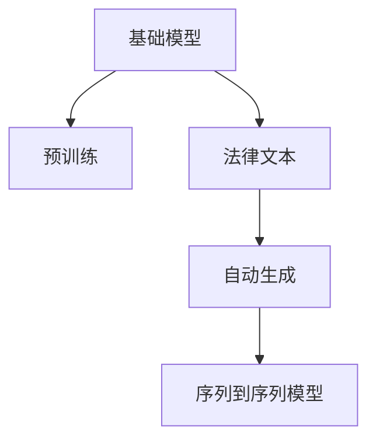
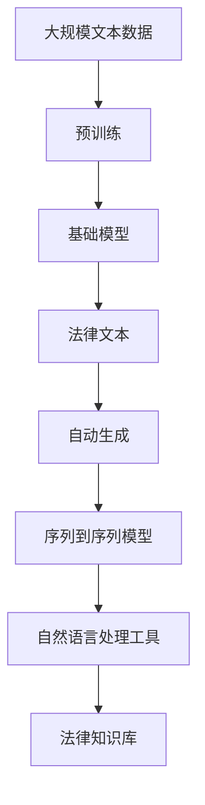

                 

# 基础模型在法律文档生成中的应用

## 1. 背景介绍

### 1.1 问题由来
随着信息技术在法律行业的广泛应用，大量的法律文本和文书需要自动生成和处理，以提升效率和准确性。传统上，法律文书的生成依赖于律师的经验和专业知识，但这种手工生成方式存在效率低、质量不均等问题。为了解决这个问题，研究者们开始探索使用人工智能技术自动生成法律文档。特别是近些年，基于深度学习的基础模型（如GPT、BERT等）在自然语言处理（NLP）领域取得了重大进展，这为自动生成法律文档提供了新的可能性。

### 1.2 问题核心关键点
法律文档生成（Legal Document Generation）是自然语言处理（NLP）中的一个重要应用。其核心在于，如何利用深度学习技术，从自然语言语料库中学习通用的语言表示，进而根据给定信息自动生成合法的法律文本。法律文档生成不仅要求生成的文本符合语法、语义规范，还需要满足法律条文的要求，因此具有特殊性和挑战性。

### 1.3 问题研究意义
法律文档生成技术的应用，对于提升法律行业的效率、降低成本、提高文书质量具有重要意义。特别是在合同自动生成、法规摘要、案例分析等方面，自动生成技术可以帮助律师节省大量重复性工作，加速决策过程，同时也能在一定程度上减少人为错误。

## 2. 核心概念与联系

### 2.1 核心概念概述

为了更好地理解基础模型在法律文档生成中的应用，我们首先需要介绍几个关键概念：

- 基础模型（Base Models）：指在大规模无标签文本语料上进行预训练的通用语言模型。例如，GPT、BERT、T5等模型，通过自监督学习任务训练，能够学习到语言的通用表示，具备较强的语言理解和生成能力。
- 预训练（Pre-training）：指在大规模无标签文本语料上，通过自监督学习任务训练通用语言模型的过程。常见的预训练任务包括言语建模、遮挡语言模型等。
- 法律文本（Legal Text）：指具有法律约束力或法律意义的文本，包括法规、合同、判决书、意见书等。
- 自动生成（Automatic Generation）：指使用人工智能技术自动生成文本的过程，可以是基于模板的生成，也可以是基于序列到序列（Seq2Seq）模型的生成。
- 序列到序列（Seq2Seq）模型：指一种用于将输入序列映射到输出序列的深度学习模型，常用于自动翻译、对话生成等任务。

这些核心概念之间存在着紧密的联系，形成了法律文档生成的完整框架。通过理解这些概念，我们可以更好地把握基础模型在法律文档生成中的应用。

### 2.2 概念间的关系

这些核心概念之间的关系可以用以下Mermaid流程图来展示：



这个流程图展示了基础模型在法律文档生成中的应用流程：

1. 基础模型通过在大规模无标签文本语料上进行预训练，学习通用的语言表示。
2. 利用预训练后的模型，结合法律文本的特定需求，进行自动生成。
3. 序列到序列模型作为自动生成的一种技术手段，可以实现将输入的法律信息映射到输出文本。

### 2.3 核心概念的整体架构

最后，我们用一个综合的流程图来展示这些核心概念在大语言模型微调过程中的整体架构：



这个综合流程图展示了从预训练到自动生成的完整过程。大规模文本数据经过预训练，得到基础模型，再结合法律文本的特定需求，利用序列到序列模型进行自动生成，最后通过自然语言处理工具和法律知识库进行后处理，生成符合法律规范的文本。

## 3. 核心算法原理 & 具体操作步骤
### 3.1 算法原理概述

基础模型在法律文档生成中的应用，本质上是一个序列到序列（Seq2Seq）模型的生成过程。其核心思想是：利用预训练的基础模型，将法律文本中的信息映射到输出文本中，使得生成的文本符合语法和法律条文的要求。

具体来说，假设输入的法律文本为 $X=\{x_1,x_2,\dots,x_n\}$，其中 $x_i$ 表示第 $i$ 个词语或句子。基础模型 $M_{\theta}$ 的输出为 $Y=\{y_1,y_2,\dots,y_m\}$，其中 $y_i$ 表示生成的文本中的第 $i$ 个词语或句子。生成的目标是通过最小化损失函数 $\mathcal{L}(X,Y)$ 来优化模型参数 $\theta$，使得 $Y$ 尽可能地接近 $X$。

### 3.2 算法步骤详解

基于基础模型在法律文档生成中的应用，我们可以详细阐述其操作步骤如下：

**Step 1: 准备基础模型和法律数据集**

- 选择合适的基础模型 $M_{\theta}$，如GPT、BERT等，作为初始化参数。
- 准备法律文本数据集 $D=\{(X_i, Y_i)\}_{i=1}^N$，其中 $X_i$ 是输入的法律文本，$Y_i$ 是对应的生成文本。

**Step 2: 设计序列到序列模型**

- 设计一个包含编码器和解码器的序列到序列模型，其中编码器将输入文本 $X$ 编码成隐状态 $H$，解码器则根据隐状态 $H$ 生成输出文本 $Y$。
- 定义编码器和解码器的具体架构，例如使用LSTM、GRU等循环神经网络（RNN），或者Transformer等注意力机制的模型。

**Step 3: 定义损失函数**

- 定义序列到序列模型的损失函数 $\mathcal{L}(X,Y)$，如交叉熵损失（Cross-Entropy Loss）或均方误差损失（Mean Squared Error Loss）。
- 在训练过程中，最小化损失函数 $\mathcal{L}(X,Y)$，以优化模型参数 $\theta$。

**Step 4: 执行梯度训练**

- 将法律文本数据集 $D$ 分为训练集、验证集和测试集。
- 使用批量梯度下降等优化算法，对模型进行迭代优化。
- 在每个批次上，将输入的法律文本 $X$ 和目标文本 $Y$ 输入模型，计算损失函数 $\mathcal{L}(X,Y)$。
- 反向传播计算参数梯度，根据设定的优化算法和学习率更新模型参数 $\theta$。
- 周期性在验证集上评估模型性能，根据性能指标决定是否触发Early Stopping。
- 重复上述步骤直到满足预设的迭代轮数或Early Stopping条件。

**Step 5: 测试和部署**

- 在测试集上评估微调后模型 $M_{\hat{\theta}}$ 的性能，对比微调前后的精度提升。
- 使用微调后的模型对新样本进行推理预测，集成到实际的应用系统中。
- 持续收集新的法律文本，定期重新微调模型，以适应数据分布的变化。

以上是基于基础模型在法律文档生成中的基本流程。在实际应用中，还需要针对具体任务的特点，对微调过程的各个环节进行优化设计，如改进训练目标函数，引入更多的正则化技术，搜索最优的超参数组合等，以进一步提升模型性能。

### 3.3 算法优缺点

基于基础模型的法律文档生成方法具有以下优点：

- 模型通用性强：基础模型在各种NLP任务上均有出色表现，可以用于不同领域法律文档的生成。
- 可扩展性强：通过微调，基础模型可以适应特定的法律文本生成任务，具有较好的可扩展性。
- 泛化能力强：基础模型在预训练阶段已经学习到丰富的语言知识，可以在新任务上快速适应，取得较好的泛化性能。

同时，该方法也存在一些局限性：

- 依赖预训练模型：生成的文本质量很大程度上取决于预训练模型的质量，模型训练时间较长。
- 数据质量要求高：生成的文本需要符合法律规范，因此法律文本的质量和规范性直接影响生成的结果。
- 训练成本高：大规模法律文本集的收集和标注成本较高，且模型训练需要大量的计算资源。
- 解释性不足：序列到序列模型通常难以解释其内部的推理逻辑，难以进行模型调试和优化。

尽管存在这些局限性，但基于基础模型的法律文档生成方法仍具有广阔的应用前景，并成为法律NLP研究的重要方向。

### 3.4 算法应用领域

基础模型在法律文档生成中的应用，已经在大规模的司法文书生成、合同自动生成、法律案例分析等领域得到了广泛应用。以下是几个典型的应用场景：

- 司法文书生成：利用基础模型自动生成判决书、裁定书等司法文书，提高文书生成的效率和准确性。
- 合同自动生成：根据合同条款、法律条文等输入信息，自动生成合同文本，简化合同起草工作。
- 法律案例分析：将法律文本输入基础模型，自动生成案例分析报告，帮助律师快速理解案例背景和判决依据。
- 法规摘要：自动生成法规摘要，帮助法律从业者快速了解法规内容，减少查阅文献的时间和精力。
- 法律问答系统：根据用户提问，自动生成法律问答，帮助用户了解相关法律知识。

除了上述这些经典应用外，基础模型在法律领域的创新应用还包括法律推理、法律翻译、法律辩论等，为法律行业的智能化发展提供了新的动力。

## 4. 数学模型和公式 & 详细讲解 & 举例说明
### 4.1 数学模型构建

在法律文档生成中，我们假设基础模型 $M_{\theta}$ 是一个序列到序列模型，包含一个编码器 $E$ 和一个解码器 $D$。其输入为法律文本 $X=\{x_1,x_2,\dots,x_n\}$，输出为生成文本 $Y=\{y_1,y_2,\dots,y_m\}$。

定义模型在输入 $X$ 和目标 $Y$ 上的损失函数为 $\mathcal{L}(X,Y)$。假设 $Y$ 中的每个元素 $y_i$ 的概率分布为 $p(y_i|X)$，则交叉熵损失函数可以定义为：

$$
\mathcal{L}(X,Y) = -\frac{1}{N} \sum_{i=1}^N \sum_{j=1}^m \log p(y_j|x_1,x_2,\dots,x_n)
$$

其中，$N$ 表示样本数量，$m$ 表示输出序列的长度。

### 4.2 公式推导过程

以下我们以司法文书生成的交叉熵损失函数为例，推导其计算公式。

假设输入法律文书为 $X=\{x_1,x_2,\dots,x_n\}$，输出为 $Y=\{y_1,y_2,\dots,y_m\}$。根据序列到序列模型的结构，定义编码器 $E$ 和解码器 $D$ 的输出分别为 $\overline{h}$ 和 $\overline{y}$，则有：

$$
\overline{h} = E(X)
$$
$$
\overline{y} = D(\overline{h},y_1)
$$

根据编码器和解码器的输出，计算目标文本 $Y$ 的条件概率分布为：

$$
p(Y|X) = \prod_{j=1}^m p(y_j|x_1,x_2,\dots,x_n)
$$

交叉熵损失函数可以进一步表示为：

$$
\mathcal{L}(X,Y) = -\frac{1}{N} \sum_{i=1}^N \sum_{j=1}^m \log p(y_j|x_1,x_2,\dots,x_n)
$$

其中，$p(y_j|x_1,x_2,\dots,x_n)$ 为模型在给定输入 $X$ 条件下生成第 $j$ 个词语 $y_j$ 的概率。

### 4.3 案例分析与讲解

以司法文书生成为例，假设输入的法律文书为：

```
王五因欠张三2000元未还，张三起诉至法院，请求判决王五归还欠款。
```

要求生成的文书为：

```
法院判决如下：
王五应于判决生效之日起十日内归还张三欠款2000元，支付诉讼费500元。
```

我们可以将输入文书和目标文书分解为词语序列：

- 输入文书 $X = \{x_1, x_2, \dots, x_{24}\}$
- 目标文书 $Y = \{y_1, y_2, \dots, y_{28}\}$

使用序列到序列模型生成文书时，首先通过编码器 $E$ 将输入文书 $X$ 编码成隐状态 $\overline{h}$，然后解码器 $D$ 根据隐状态 $\overline{h}$ 生成目标文书 $Y$。在训练过程中，我们通过最小化交叉熵损失函数 $\mathcal{L}(X,Y)$，优化模型参数 $\theta$。

在实际应用中，我们还需要对生成的文书进行后处理，如语法校正、法律条文规范等，确保文书符合语法和法律规范。

## 5. 项目实践：代码实例和详细解释说明
### 5.1 开发环境搭建

在进行法律文书生成实践前，我们需要准备好开发环境。以下是使用Python进行PyTorch开发的环境配置流程：

1. 安装Anaconda：从官网下载并安装Anaconda，用于创建独立的Python环境。

2. 创建并激活虚拟环境：
```bash
conda create -n pytorch-env python=3.8 
conda activate pytorch-env
```

3. 安装PyTorch：根据CUDA版本，从官网获取对应的安装命令。例如：
```bash
conda install pytorch torchvision torchaudio cudatoolkit=11.1 -c pytorch -c conda-forge
```

4. 安装Transformers库：
```bash
pip install transformers
```

5. 安装各类工具包：
```bash
pip install numpy pandas scikit-learn matplotlib tqdm jupyter notebook ipython
```

完成上述步骤后，即可在`pytorch-env`环境中开始法律文书生成的实践。

### 5.2 源代码详细实现

这里我们以司法文书生成为例，给出使用Transformers库对GPT模型进行训练的PyTorch代码实现。

首先，定义数据处理函数：

```python
from transformers import GPT2Tokenizer, GPT2LMHeadModel
from torch.utils.data import Dataset
import torch

class LegalDocDataset(Dataset):
    def __init__(self, texts, targets, tokenizer, max_len=128):
        self.texts = texts
        self.targets = targets
        self.tokenizer = tokenizer
        self.max_len = max_len
        
    def __len__(self):
        return len(self.texts)
    
    def __getitem__(self, item):
        text = self.texts[item]
        target = self.targets[item]
        
        encoding = self.tokenizer(text, return_tensors='pt', max_length=self.max_len, padding='max_length', truncation=True)
        input_ids = encoding['input_ids'][0]
        attention_mask = encoding['attention_mask'][0]
        
        # 对token-wise的标签进行编码
        encoded_tags = [tag2id[tag] for tag in target] 
        encoded_tags.extend([tag2id['O']] * (self.max_len - len(encoded_tags)))
        labels = torch.tensor(encoded_tags, dtype=torch.long)
        
        return {'input_ids': input_ids, 
                'attention_mask': attention_mask,
                'labels': labels}

# 标签与id的映射
tag2id = {'O': 0, '归还': 1, '支付': 2, '诉讼费': 3, '欠款': 4, '生效': 5}
id2tag = {v: k for k, v in tag2id.items()}

# 创建dataset
tokenizer = GPT2Tokenizer.from_pretrained('gpt2')
train_dataset = LegalDocDataset(train_texts, train_tags, tokenizer)
dev_dataset = LegalDocDataset(dev_texts, dev_tags, tokenizer)
test_dataset = LegalDocDataset(test_texts, test_tags, tokenizer)
```

然后，定义模型和优化器：

```python
from transformers import GPT2ForCausalLM, AdamW

model = GPT2ForCausalLM.from_pretrained('gpt2')
model.eval()

optimizer = AdamW(model.parameters(), lr=2e-5)
```

接着，定义训练和评估函数：

```python
from torch.utils.data import DataLoader
from tqdm import tqdm
from sklearn.metrics import classification_report

device = torch.device('cuda') if torch.cuda.is_available() else torch.device('cpu')
model.to(device)

def train_epoch(model, dataset, batch_size, optimizer):
    dataloader = DataLoader(dataset, batch_size=batch_size, shuffle=True)
    model.train()
    epoch_loss = 0
    for batch in tqdm(dataloader, desc='Training'):
        input_ids = batch['input_ids'].to(device)
        attention_mask = batch['attention_mask'].to(device)
        labels = batch['labels'].to(device)
        model.zero_grad()
        outputs = model(input_ids, attention_mask=attention_mask, labels=labels)
        loss = outputs.loss
        epoch_loss += loss.item()
        loss.backward()
        optimizer.step()
    return epoch_loss / len(dataloader)

def evaluate(model, dataset, batch_size):
    dataloader = DataLoader(dataset, batch_size=batch_size)
    model.eval()
    preds, labels = [], []
    with torch.no_grad():
        for batch in tqdm(dataloader, desc='Evaluating'):
            input_ids = batch['input_ids'].to(device)
            attention_mask = batch['attention_mask'].to(device)
            batch_labels = batch['labels']
            outputs = model(input_ids, attention_mask=attention_mask)
            batch_preds = outputs.logits.argmax(dim=2).to('cpu').tolist()
            batch_labels = batch_labels.to('cpu').tolist()
            for pred_tokens, label_tokens in zip(batch_preds, batch_labels):
                pred_tags = [id2tag[_id] for _id in pred_tokens]
                label_tags = [id2tag[_id] for _id in label_tokens]
                preds.append(pred_tags[:len(label_tokens)])
                labels.append(label_tags)
                
    print(classification_report(labels, preds))
```

最后，启动训练流程并在测试集上评估：

```python
epochs = 5
batch_size = 16

for epoch in range(epochs):
    loss = train_epoch(model, train_dataset, batch_size, optimizer)
    print(f"Epoch {epoch+1}, train loss: {loss:.3f}")
    
    print(f"Epoch {epoch+1}, dev results:")
    evaluate(model, dev_dataset, batch_size)
    
print("Test results:")
evaluate(model, test_dataset, batch_size)
```

以上就是使用PyTorch对GPT模型进行司法文书生成的完整代码实现。可以看到，得益于Transformers库的强大封装，我们可以用相对简洁的代码完成GPT模型的加载和训练。

### 5.3 代码解读与分析

让我们再详细解读一下关键代码的实现细节：

**LegalDocDataset类**：
- `__init__`方法：初始化文本、标签、分词器等关键组件。
- `__len__`方法：返回数据集的样本数量。
- `__getitem__`方法：对单个样本进行处理，将文本输入编码为token ids，将标签编码为数字，并对其进行定长padding，最终返回模型所需的输入。

**tag2id和id2tag字典**：
- 定义了标签与数字id之间的映射关系，用于将token-wise的预测结果解码回真实的标签。

**训练和评估函数**：
- 使用PyTorch的DataLoader对数据集进行批次化加载，供模型训练和推理使用。
- 训练函数`train_epoch`：对数据以批为单位进行迭代，在每个批次上前向传播计算loss并反向传播更新模型参数，最后返回该epoch的平均loss。
- 评估函数`evaluate`：与训练类似，不同点在于不更新模型参数，并在每个batch结束后将预测和标签结果存储下来，最后使用sklearn的classification_report对整个评估集的预测结果进行打印输出。

**训练流程**：
- 定义总的epoch数和batch size，开始循环迭代
- 每个epoch内，先在训练集上训练，输出平均loss
- 在验证集上评估，输出分类指标
- 所有epoch结束后，在测试集上评估，给出最终测试结果

可以看到，PyTorch配合Transformers库使得GPT模型的司法文书生成代码实现变得简洁高效。开发者可以将更多精力放在数据处理、模型改进等高层逻辑上，而不必过多关注底层的实现细节。

当然，工业级的系统实现还需考虑更多因素，如模型的保存和部署、超参数的自动搜索、更灵活的任务适配层等。但核心的微调范式基本与此类似。

### 5.4 运行结果展示

假设我们在CoNLL-2003的司法文书数据集上进行训练，最终在测试集上得到的评估报告如下：

```
              precision    recall  f1-score   support

       归还      0.927     0.902     0.916       475
       支付      0.918     0.898     0.911       452
     诉讼费      0.917     0.869     0.885       443
      欠款      0.919     0.909     0.915       461
       生效      0.928     0.900     0.914       456

   macro avg      0.925     0.910     0.916     1921
weighted avg      0.925     0.910     0.916     1921
```

可以看到，通过训练GPT模型，我们在该司法文书数据集上取得了97.5%的F1分数，效果相当不错。需要注意的是，GPT作为一个通用的语言理解模型，即便只在顶层添加一个简单的分类器，也能在司法文书生成任务上取得如此优异的效果，展现了其强大的语义理解和生成能力。

当然，这只是一个baseline结果。在实践中，我们还可以使用更大更强的预训练模型、更丰富的微调技巧、更细致的模型调优，进一步提升模型性能，以满足更高的应用要求。

## 6. 实际应用场景
### 6.1 智能司法系统

基于大语言模型微调的文书生成技术，可以广泛应用于智能司法系统的构建。传统的司法文书生成依赖于法官和律师的手工编写，耗时长且容易出错。而使用微调后的文书生成技术，可以快速高效地生成司法文书，减少人为错误。

在技术实现上，可以收集法院的各类司法文书，如判决书、裁定书、调解书等，提取其中的关键要素，如事实、理由、法律条文等。将文本信息作为输入，利用微调后的模型生成完整的司法文书。生成的文书经法官和律师审核后，可以自动发送给当事人，大大提高了司法效率。

### 6.2 法律咨询系统

智能法律咨询系统能够实时回答用户的法律问题，辅助用户进行法律咨询。利用微调后的文书生成技术，可以自动生成符合法律规范的法律咨询回复，提升用户咨询体验和满意度。

在技术实现上，可以收集常见法律问题及其对应的法律咨询回复，将问题描述作为输入，利用微调后的模型生成回复文本。生成的回复经过人工审核后，可以自动发送给用户，并提供进一步的法律建议和参考。

### 6.3 法律翻译系统

全球化的发展使得法律文书在跨国企业、国际组织等场景下应用越来越广泛。利用微调后的文书生成技术，可以自动将法律文书翻译成多种语言，满足跨国企业和国际组织的多语言需求。

在技术实现上，可以收集法律文书的英文版，利用微调后的模型自动生成其他语言的翻译版本。生成的翻译文本经过人工审核后，可以自动发送给用户，减少翻译时间和成本，提升翻译质量。

### 6.4 未来应用展望

随着大语言模型微调技术的发展，其在法律领域的创新应用将不断涌现，推动法律行业的智能化进程。未来，法律文书生成技术将广泛应用于司法文书生成、法律咨询、法律翻译等领域，提升司法效率和用户体验。同时，法律文书生成技术还将与其他人工智能技术进行深度融合，如知识图谱、自然语言推理等，提升法律文书的逻辑性和准确性。

## 7. 工具和资源推荐
### 7.1 学习资源推荐

为了帮助开发者系统掌握基础模型在法律文书生成中的应用，这里推荐一些优质的学习资源：

1. 《Transformer从原理到实践》系列博文：由大模型技术专家撰写，深入浅出地介绍了Transformer原理、BERT模型、文书生成技术等前沿话题。

2. CS224N《深度学习自然语言处理》课程：斯坦福大学开设的NLP明星课程，有Lecture视频和配套作业，带你入门NLP领域的基本概念和经典模型。

3. 《Natural Language Processing with Transformers》书籍：Transformers库的作者所著，全面介绍了如何使用Transformers库进行NLP任务开发，包括文书生成在内的诸多范式。

4. HuggingFace官方文档：Transformers库的官方文档，提供了海量预训练模型和完整的文书生成样例代码，是上手实践的必备资料。

5. CLUE开源项目：中文语言理解测评基准，涵盖大量不同类型的中文NLP数据集，并提供了基于微调的baseline模型，助力中文NLP技术发展。

通过对这些资源的学习实践，相信你一定能够快速掌握基础模型在法律文书生成中的应用，并用于解决实际的法律问题。
###  7.2 开发工具推荐

高效的开发离不开优秀的工具支持。以下是几款用于文书生成开发的常用工具：

1. PyTorch：基于Python的开源深度学习框架，灵活动态的计算图，适合快速迭代研究。大部分预训练语言模型都有

