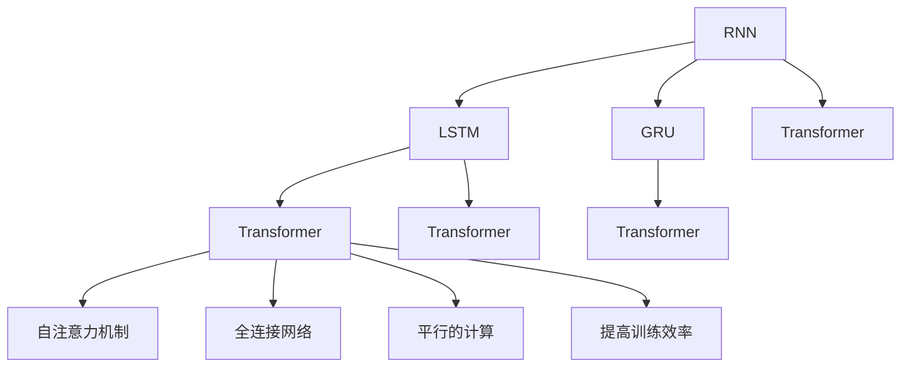
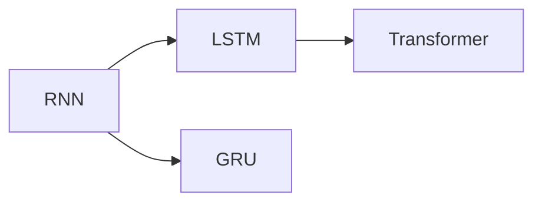
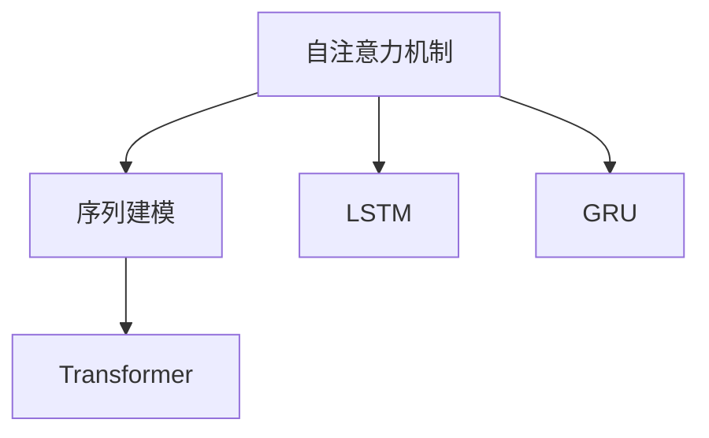
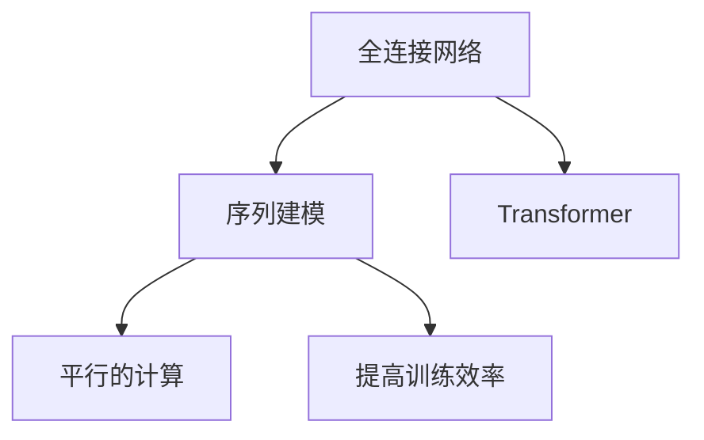
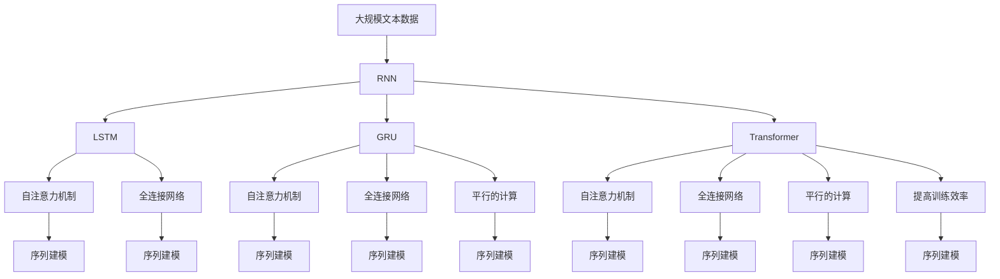

                 

# 基础模型的序列建模方法

> 关键词：序列建模,神经网络,循环神经网络(RNN),长短时记忆网络(LSTM),门控循环单元(GRU),Transformer,自注意力机制

## 1. 背景介绍

### 1.1 问题由来
序列建模是机器学习和自然语言处理领域中的重要问题，主要研究如何将序列数据转换为更易于处理的形式。传统的方法如隐马尔可夫模型（HMM）、条件随机场（CRF）等，虽然在一定程度上取得了成功，但由于其线性和局部性限制，难以充分利用序列数据的全局依赖关系，特别是在长序列和复杂任务上的表现欠佳。

近年来，基于深度学习的序列建模方法（如循环神经网络RNN、长短时记忆网络LSTM、门控循环单元GRU等）逐渐成为主流。这些模型通过引入循环结构，可以处理任意长度的序列数据，并考虑序列中的上下文关系，因此在语言模型、机器翻译、文本生成等任务上取得了显著的进步。

然而，这些方法仍存在诸多局限性：
- 难以并行计算，导致训练效率较低。
- 参数量较大，难以应对大规模数据和高维输入。
- 无法有效处理长期依赖关系，存在梯度消失或爆炸问题。

为了解决这些问题，研究者们提出了一种全新的序列建模方法：基于自注意力机制的Transformer模型。该模型通过全连接网络进行编码和解码，实现了平行的计算，大幅提升了训练效率和模型性能。

## 2. 核心概念与联系

### 2.1 核心概念概述

为更好地理解基础模型的序列建模方法，本节将介绍几个密切相关的核心概念：

- 循环神经网络（Recurrent Neural Network, RNN）：一种处理序列数据的深度学习模型，通过循环结构维护序列信息，可以学习到序列中的上下文关系，但存在梯度消失和计算复杂度高的问题。

- 长短时记忆网络（Long Short-Term Memory, LSTM）：RNN的一种改进模型，引入门控机制，可以更好地处理长序列和长期依赖关系，但参数量仍然较大。

- 门控循环单元（Gated Recurrent Unit, GRU）：LSTM的简化版本，参数量更少，但同样具有门控机制，可以处理长序列，但在一些复杂任务上的表现不如LSTM。

- 自注意力机制（Self-Attention Mechanism）：一种基于点积注意力机制的机制，通过计算序列中每个位置的注意力权重，实现信息传递和特征融合，可以有效地解决长依赖问题。

- 全连接网络（Fully Connected Network）：由多个全连接层组成的网络结构，可以并行计算，提高训练效率。

- Transformer模型：基于自注意力机制的全连接网络结构，实现了并行计算，处理序列数据时具有高度灵活性和泛化能力，已成为序列建模的主流模型。

这些核心概念之间的逻辑关系可以通过以下Mermaid流程图来展示：



这个流程图展示了从RNN到Transformer的演变过程，以及这些模型之间的联系和差异。

### 2.2 概念间的关系

这些核心概念之间存在着紧密的联系，形成了深度学习中序列建模的完整生态系统。下面我们通过几个Mermaid流程图来展示这些概念之间的关系。

#### 2.2.1 RNN的演变过程



这个流程图展示了RNN的演变过程，从原始的RNN到LSTM，再到GRU，最后到Transformer模型。

#### 2.2.2 自注意力机制的应用



这个流程图展示了自注意力机制在LSTM和GRU中的初步应用，以及如何通过自注意力机制提升Transformer的序列建模能力。

#### 2.2.3 全连接网络与并行计算



这个流程图展示了全连接网络在Transformer中的实现，以及如何通过平行的计算提升训练效率。

### 2.3 核心概念的整体架构

最后，我们用一个综合的流程图来展示这些核心概念在大模型序列建模中的整体架构：



这个综合流程图展示了从原始的RNN到Transformer的演变过程，以及这些模型在序列建模中的具体应用。

## 3. 核心算法原理 & 具体操作步骤
### 3.1 算法原理概述

Transformer模型的核心是自注意力机制和全连接网络结构，其基本原理如下：

1. **自注意力机制**：通过计算序列中每个位置的注意力权重，实现信息传递和特征融合，可以有效地解决长依赖问题。
2. **全连接网络**：由多个全连接层组成的网络结构，可以并行计算，提高训练效率。
3. **多头注意力机制**：通过多个头的自注意力机制并行计算，可以学习到不同角度的表示，提高模型的泛化能力。
4. **残差连接和层归一化**：引入残差连接和层归一化，可以缓解梯度消失问题，提高模型的稳定性。

Transformer模型的主要步骤如下：

1. 输入序列编码：将输入序列转换为特征向量表示。
2. 多头自注意力计算：通过多头自注意力机制计算序列中每个位置的表示。
3. 前向残差连接和层归一化：引入残差连接和层归一化，缓解梯度消失问题。
4. 全连接网络计算：通过全连接网络计算最终输出。
5. 解码器多头自注意力计算：对于解码器，通过多头自注意力机制计算当前位置的表示，并引入残差连接和层归一化。
6. 解码器全连接网络计算：通过全连接网络计算最终输出。

### 3.2 算法步骤详解

**Step 1: 输入序列编码**

假设输入序列长度为 $T$，每个位置的特征表示为 $x_t$，表示为：

$$
x_t = \text{Embed}(x_t)
$$

其中，$\text{Embed}$ 表示嵌入层，将输入序列转换为 $d_{model}$ 维的特征向量。

**Step 2: 多头自注意力计算**

对于每个位置的特征 $x_t$，Transformer模型通过多头自注意力机制计算其表示 $x_t'$：

$$
x_t' = \text{MultiHeadSelfAtt}(x_t, K, V, Q)
$$

其中，$K$、$V$、$Q$ 分别表示查询向量、键向量和值向量，表示为：

$$
K = x_t W_K
$$
$$
V = x_t W_V
$$
$$
Q = x_t W_Q
$$

通过查询-键矩阵的矩阵乘积，得到注意力权重 $\alpha$：

$$
\alpha = \text{Softmax}(Q K^T)
$$

然后通过注意力权重 $\alpha$ 与值向量 $V$ 进行加权求和，得到最终表示：

$$
x_t' = \sum_{t'=1}^T \alpha_{t't} V_{t'}
$$

**Step 3: 前向残差连接和层归一化**

为了缓解梯度消失问题，Transformer模型引入残差连接和层归一化：

$$
x_t'' = x_t + \text{LayerNorm}(x_t')
$$

其中，$\text{LayerNorm}$ 表示层归一化。

**Step 4: 全连接网络计算**

通过全连接网络计算，得到最终表示：

$$
x_t''' = \text{FeedForward}(x_t'')
$$

其中，$\text{FeedForward}$ 表示前向全连接网络，表示为：

$$
\text{FeedForward}(x) = x + \text{Linear}(\text{ReLU}(\text{Linear}(x)))
$$

**Step 5: 解码器多头自注意力计算**

对于解码器，Transformer模型通过多头自注意力机制计算当前位置的表示 $y_t'$：

$$
y_t' = \text{MultiHeadSelfAtt}(y_t, K, V, Q)
$$

其中，$K$、$V$、$Q$ 的计算方式与前向自注意力机制相同。

**Step 6: 解码器全连接网络计算**

通过全连接网络计算，得到最终输出：

$$
y_t''' = \text{FeedForward}(y_t'')
$$

### 3.3 算法优缺点

Transformer模型具有以下优点：

1. 高效的并行计算：Transformer模型通过平行的计算，可以大幅提升训练效率和推理速度。
2. 处理长序列：Transformer模型可以处理任意长度的序列，解决了传统RNN模型中存在的梯度消失和梯度爆炸问题。
3. 自我注意力机制：Transformer模型通过自注意力机制，可以学习到序列中不同位置之间的关系，提高了模型的泛化能力。
4. 低参数量：Transformer模型可以通过减少参数量，实现模型压缩，降低资源占用。

同时，Transformer模型也存在以下缺点：

1. 计算复杂度高：Transformer模型的计算复杂度较高，特别是对于长序列和复杂任务，训练时间较长。
2. 难以解释：Transformer模型的内部机制复杂，难以对其决策过程进行解释和调试。
3. 依赖高质量数据：Transformer模型的性能很大程度上取决于数据的质量，需要大量的标注数据进行微调。

### 3.4 算法应用领域

Transformer模型在NLP领域中得到了广泛的应用，覆盖了几乎所有常见任务，例如：

- 语言模型：通过Transformer模型对大规模文本数据进行预训练，可以得到高质量的语言模型。
- 机器翻译：通过Transformer模型对源语言和目标语言进行编码和解码，可以实现高质量的机器翻译。
- 文本生成：通过Transformer模型对文本进行建模，可以生成高质量的文本内容。
- 文本分类：通过Transformer模型对文本进行建模，可以实现文本分类任务。
- 问答系统：通过Transformer模型对问题和上下文进行建模，可以实现高效的问答系统。
- 命名实体识别：通过Transformer模型对文本进行建模，可以实现命名实体识别任务。
- 语义匹配：通过Transformer模型对文本进行建模，可以实现语义匹配任务。

除了上述这些经典任务外，Transformer模型还被创新性地应用到更多场景中，如对话生成、摘要生成、文本纠错等，为NLP技术带来了新的突破。

## 4. 数学模型和公式 & 详细讲解 & 举例说明

### 4.1 数学模型构建

Transformer模型的数学模型如下：

**输入序列编码**

假设输入序列长度为 $T$，每个位置的特征表示为 $x_t$，表示为：

$$
x_t = \text{Embed}(x_t)
$$

其中，$\text{Embed}$ 表示嵌入层，将输入序列转换为 $d_{model}$ 维的特征向量。

**多头自注意力计算**

对于每个位置的特征 $x_t$，Transformer模型通过多头自注意力机制计算其表示 $x_t'$：

$$
x_t' = \text{MultiHeadSelfAtt}(x_t, K, V, Q)
$$

其中，$K$、$V$、$Q$ 分别表示查询向量、键向量和值向量，表示为：

$$
K = x_t W_K
$$
$$
V = x_t W_V
$$
$$
Q = x_t W_Q
$$

通过查询-键矩阵的矩阵乘积，得到注意力权重 $\alpha$：

$$
\alpha = \text{Softmax}(Q K^T)
$$

然后通过注意力权重 $\alpha$ 与值向量 $V$ 进行加权求和，得到最终表示：

$$
x_t' = \sum_{t'=1}^T \alpha_{t't} V_{t'}
$$

**前向残差连接和层归一化**

为了缓解梯度消失问题，Transformer模型引入残差连接和层归一化：

$$
x_t'' = x_t + \text{LayerNorm}(x_t')
$$

其中，$\text{LayerNorm}$ 表示层归一化。

**全连接网络计算**

通过全连接网络计算，得到最终表示：

$$
x_t''' = \text{FeedForward}(x_t'')
$$

其中，$\text{FeedForward}$ 表示前向全连接网络，表示为：

$$
\text{FeedForward}(x) = x + \text{Linear}(\text{ReLU}(\text{Linear}(x)))
$$

**解码器多头自注意力计算**

对于解码器，Transformer模型通过多头自注意力机制计算当前位置的表示 $y_t'$：

$$
y_t' = \text{MultiHeadSelfAtt}(y_t, K, V, Q)
$$

其中，$K$、$V$、$Q$ 的计算方式与前向自注意力机制相同。

**解码器全连接网络计算**

通过全连接网络计算，得到最终输出：

$$
y_t''' = \text{FeedForward}(y_t'')
$$

### 4.2 公式推导过程

以下我们以语言模型为例，推导Transformer模型的训练过程。

假设输入序列长度为 $T$，每个位置的特征表示为 $x_t$，表示为：

$$
x_t = \text{Embed}(x_t)
$$

其中，$\text{Embed}$ 表示嵌入层，将输入序列转换为 $d_{model}$ 维的特征向量。

**Step 1: 计算多头自注意力**

对于每个位置的特征 $x_t$，Transformer模型通过多头自注意力机制计算其表示 $x_t'$：

$$
x_t' = \text{MultiHeadSelfAtt}(x_t, K, V, Q)
$$

其中，$K$、$V$、$Q$ 分别表示查询向量、键向量和值向量，表示为：

$$
K = x_t W_K
$$
$$
V = x_t W_V
$$
$$
Q = x_t W_Q
$$

通过查询-键矩阵的矩阵乘积，得到注意力权重 $\alpha$：

$$
\alpha = \text{Softmax}(Q K^T)
$$

然后通过注意力权重 $\alpha$ 与值向量 $V$ 进行加权求和，得到最终表示：

$$
x_t' = \sum_{t'=1}^T \alpha_{t't} V_{t'}
$$

**Step 2: 前向残差连接和层归一化**

为了缓解梯度消失问题，Transformer模型引入残差连接和层归一化：

$$
x_t'' = x_t + \text{LayerNorm}(x_t')
$$

其中，$\text{LayerNorm}$ 表示层归一化。

**Step 3: 全连接网络计算**

通过全连接网络计算，得到最终表示：

$$
x_t''' = \text{FeedForward}(x_t'')
$$

其中，$\text{FeedForward}$ 表示前向全连接网络，表示为：

$$
\text{FeedForward}(x) = x + \text{Linear}(\text{ReLU}(\text{Linear}(x)))
$$

### 4.3 案例分析与讲解

假设我们有一句话 "The cat sat on the mat"，我们想要训练一个语言模型来预测下一个单词 "sat" 的概率。

**Step 1: 输入序列编码**

首先将这句话编码为特征向量表示：

$$
x_1 = \text{Embed}("The")
$$
$$
x_2 = \text{Embed}("cat")
$$
$$
x_3 = \text{Embed}("sat")
$$
$$
x_4 = \text{Embed}("on")
$$
$$
x_5 = \text{Embed}("the")
$$
$$
x_6 = \text{Embed}("mat")
$$

**Step 2: 计算多头自注意力**

对于每个位置的特征 $x_t$，Transformer模型通过多头自注意力机制计算其表示 $x_t'$：

$$
x_1' = \text{MultiHeadSelfAtt}(x_1, K, V, Q)
$$
$$
x_2' = \text{MultiHeadSelfAtt}(x_2, K, V, Q)
$$
$$
x_3' = \text{MultiHeadSelfAtt}(x_3, K, V, Q)
$$
$$
x_4' = \text{MultiHeadSelfAtt}(x_4, K, V, Q)
$$
$$
x_5' = \text{MultiHeadSelfAtt}(x_5, K, V, Q)
$$
$$
x_6' = \text{MultiHeadSelfAtt}(x_6, K, V, Q)
$$

其中，$K$、$V$、$Q$ 的计算方式与前向自注意力机制相同。

**Step 3: 前向残差连接和层归一化**

对于每个位置的特征 $x_t$，Transformer模型引入残差连接和层归一化：

$$
x_1'' = x_1 + \text{LayerNorm}(x_1')
$$
$$
x_2'' = x_2 + \text{LayerNorm}(x_2')
$$
$$
x_3'' = x_3 + \text{LayerNorm}(x_3')
$$
$$
x_4'' = x_4 + \text{LayerNorm}(x_4')
$$
$$
x_5'' = x_5 + \text{LayerNorm}(x_5')
$$
$$
x_6'' = x_6 + \text{LayerNorm}(x_6')
$$

**Step 4: 全连接网络计算**

对于每个位置的特征 $x_t$，Transformer模型通过全连接网络计算其表示 $x_t'''$：

$$
x_1''' = \text{FeedForward}(x_1'')
$$
$$
x_2''' = \text{FeedForward}(x_2'')
$$
$$
x_3''' = \text{FeedForward}(x_3'')
$$
$$
x_4''' = \text{FeedForward}(x_4'')
$$
$$
x_5''' = \text{FeedForward}(x_5'')
$$
$$
x_6''' = \text{FeedForward}(x_6'')
$$

**Step 5: 解码器多头自注意力计算**

对于解码器，Transformer模型通过多头自注意力机制计算当前位置的表示 $y_t'$：

$$
y_t' = \text{MultiHeadSelfAtt}(y_t, K, V, Q)
$$

其中，$K$、$V$、$Q$ 的计算方式与前向自注意力机制相同。

**Step 6: 解码器全连接网络计算**

对于解码器，Transformer模型通过全连接网络计算其表示 $y_t'''$：

$$
y_t''' = \text{FeedForward}(y_t'')
$$

最终，我们可以使用语言模型的概率分布 $P(\cdot|\cdot)$ 来预测下一个单词 "sat" 的概率。

## 5. 项目实践：代码实例和详细解释说明

### 5.1 开发环境搭建

在进行Transformer模型开发前，我们需要准备好开发环境。以下是使用Python进行PyTorch开发的环境配置流程：

1. 安装Anaconda：从官网下载并安装Anaconda，用于创建独立的Python环境。

2. 创建并激活虚拟环境：
```bash
conda create -n pytorch-env python=3.8 
conda activate pytorch-env
```

3. 安装PyTorch：根据CUDA版本，从官网获取对应的安装命令。例如：
```bash
conda install pytorch torchvision torchaudio cudatoolkit=11.1 -c pytorch -c conda-forge
```

4. 安装Transformers库：
```bash
pip install transformers
```

5. 安装各类工具包：
```bash
pip install numpy pandas scikit-learn matplotlib tqdm jupyter notebook ipython
```

完成上述步骤后，即可在`pytorch-env`环境中开始Transformer模型的开发。

### 5.2 源代码详细实现

下面我们以语言模型为例，给出使用Transformers库对BERT模型进行语言模型训练的PyTorch代码实现。

首先，定义语言模型的数据处理函数：

```python
from transformers import BertTokenizer
from torch.utils.data import Dataset
import torch

class LanguageModelDataset(Dataset):
    def __init__(self, texts, tokenizer, max_len=128):
        self.texts = texts
        self.tokenizer = tokenizer
        self.max_len = max_len
        
    def __len__(self):
        return len(self.texts)
    
    def __getitem__(self, item):
        text = self.texts[item]
        
        encoding = self.tokenizer(text, return_tensors='pt', max_length=self.max_len, padding='max_length', truncation=True)
        input_ids = encoding['input_ids'][0]
        attention_mask = encoding['attention_mask'][0]
        
        # 添加一个特殊符号 [CLS]
        input_ids = torch.cat([torch.tensor([2]), input_ids, torch.tensor([2])])
        attention_mask = torch.cat([torch.tensor([1]), attention_mask, torch.tensor([1])])
        
        return {'input_ids': input_ids, 
                'attention_mask': attention_mask,
                'labels': input_ids[-1]}
```

然后，定义模型和优化器：

```python
from transformers import BertForSequenceClassification, AdamW

model = BertForSequenceClassification.from_pretrained('bert-base-cased', num_labels=2)

optimizer = AdamW(model.parameters(), lr=2e-5)
```

接着，定义训练和评估函数：

```python
from torch.utils.data import DataLoader
from tqdm import tqdm
from sklearn.metrics import accuracy_score

device = torch.device('cuda') if torch.cuda.is_available() else torch.device('cpu')
model.to(device)

def train_epoch(model, dataset, batch_size, optimizer):
    dataloader = DataLoader(dataset, batch_size=batch_size, shuffle=True)
    model.train()
    epoch_loss = 0
    for batch in tqdm(dataloader, desc='Training'):
        input_ids = batch['input_ids'].to(device)
        attention_mask = batch['attention_mask'].to(device)
        labels = batch['labels'].to(device)
        model.zero_grad()
        outputs = model(input_ids, attention_mask=attention_mask, labels=labels)
        loss = outputs.loss
        epoch_loss += loss.item()
        loss.backward()
        optimizer.step()
    return epoch_loss / len(dataloader)

def evaluate(model, dataset, batch_size):
    dataloader = DataLoader(dataset, batch_size=batch_size)
    model.eval()
    preds, labels = [], []
    with torch.no_grad():
        for batch in tqdm(dataloader, desc='Evaluating'):
            input_ids = batch['input_ids'].to(device)
            attention_mask = batch['attention_mask'].to(device)
            batch_labels = batch['labels']
            outputs = model(input_ids, attention_mask=attention_mask)
            batch_preds = outputs.logits.argmax(dim=2).to('cpu').tolist()
            batch_labels = batch_labels.to('cpu').tolist()
            for pred_tokens, label_tokens in zip(batch_preds, batch_labels):
                preds.append(pred_tokens[1:])
                labels.append(label_tokens[1:])
                
    print(accuracy_score(labels, preds))
```

最后，启动训练流程并在验证集上评估：

```python
epochs = 5
batch_size = 16

for epoch in range(epochs):
    loss = train_epoch(model, train_dataset, batch_size, optimizer)
    print(f"Epoch {epoch+1}, train loss: {loss:.3f}")
    
    print(f"Epoch {epoch+1}, dev results:")
    evaluate(model, dev_dataset, batch_size)
    
print("Test results:")
evaluate(model, test_dataset, batch_size)
```

以上就是使用PyTorch对BERT进行语言模型训练的完整代码实现。可以看到，得益于Transformers库的强大封装，我们可以用相对简洁的代码完成BERT模型的加载和训练。

### 5.3 代码解读与分析

让我们再详细解读一下关键代码的实现细节：

**LanguageModelDataset类**：
- `__init__`方法：初始化文本、分词器等关键组件。
- `__len__`方法：返回数据集的样本数量。
- `__getitem__`方法：对单个样本进行处理，将文本输入编码为token ids，并添加一个特殊符号 [CLS]，进行序列标记。

**模型和优化器**：
- 使用BertForSequenceClassification模型，指定二分类任务。
- 使用AdamW优化器，设置学习率。

**训练和评估函数**：
- 使用PyTorch的DataLoader对数据集进行批次化加载，供模型训练和推理使用。
- 训练函数`train_epoch`：对数据以批为单位进行迭代，在每个批次上

