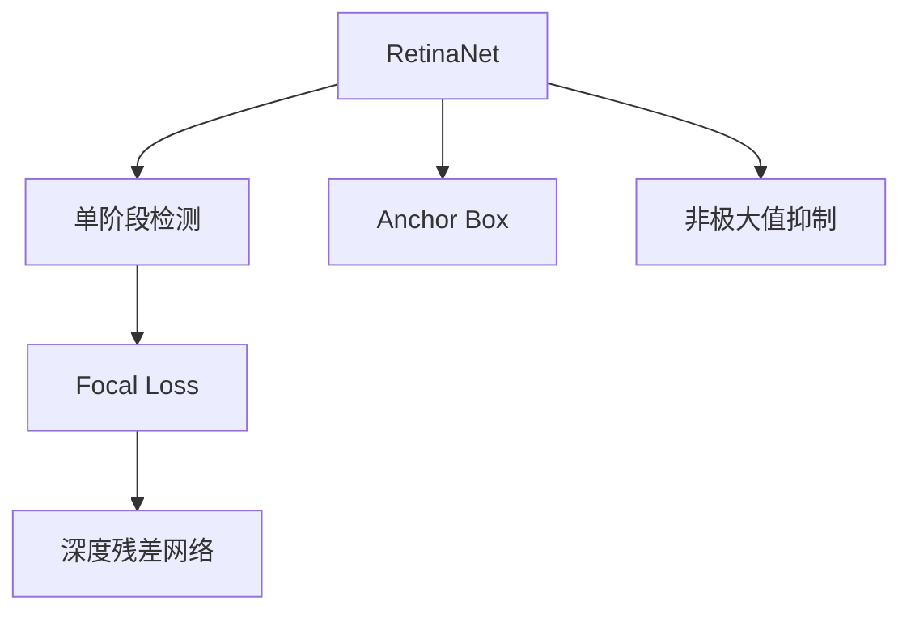
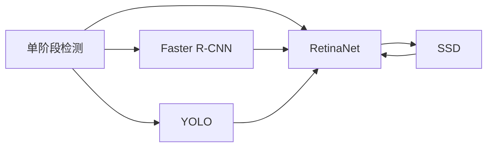
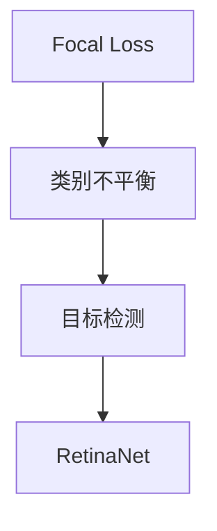
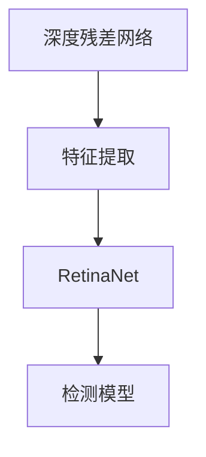
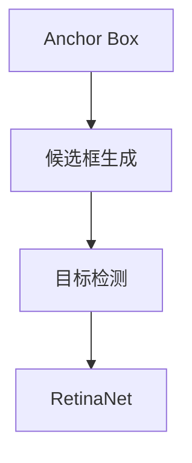
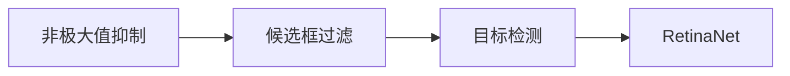
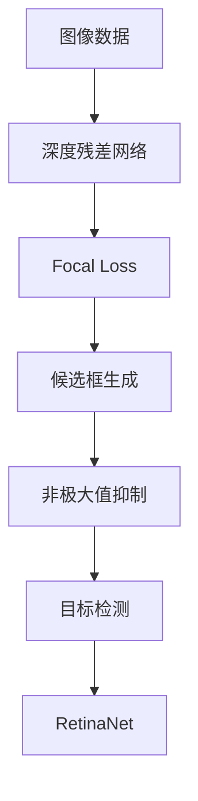
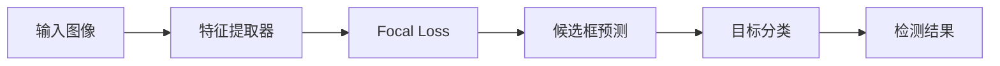

                 

# RetinaNet原理与代码实例讲解

> 关键词：RetinaNet, 目标检测, 单阶段检测, Focal Loss, 检测效果, 算法实现, TensorFlow

## 1. 背景介绍

### 1.1 问题由来
在计算机视觉领域，目标检测（Object Detection）是核心任务之一，即在图像中定位并识别出特定的物体。近年来，随着深度学习技术的发展，目标检测也取得了长足的进步。然而，经典的两阶段检测方法（如R-CNN、Fast R-CNN等）需要分别进行候选框生成和候选框分类，不仅速度慢，还存在一定的不稳定性。

针对这些挑战，单阶段检测方法（Single-shot Detectors）应运而生。其中，RetinaNet作为首个在ImageNet上达到最优检测效果单阶段检测方法，具有代表性。其通过Focal Loss解决类别不平衡问题，显著提升了目标检测效果。

### 1.2 问题核心关键点
RetinaNet的核心思想在于通过单阶段检测和Focal Loss优化，使模型在同时预测候选框和目标类别时，能够更加关注难以分类的样本。具体而言，RetinaNet通过使用深度残差网络（ResNet）作为特征提取器，并使用Focal Loss函数优化损失函数，从而在检测效果和计算效率之间取得了平衡。

### 1.3 问题研究意义
研究RetinaNet原理与实现，对于理解单阶段目标检测方法，提升目标检测性能，具有重要意义：

1. 提高检测速度：单阶段检测方法能够在一阶段完成候选框和分类，避免了多阶段操作的复杂性，显著提升了检测速度。
2. 优化检测效果：Focal Loss通过关注难以分类的样本，使模型更加聚焦于挑战性任务，从而提升检测效果。
3. 促进技术进步：RetinaNet的成功应用，推动了目标检测领域的技术发展，为后续研究提供了宝贵的借鉴。
4. 拓展应用场景：通过优化模型结构，RetinaNet能够更好地适应多样化的目标检测任务，如物体跟踪、行为识别等。

## 2. 核心概念与联系

### 2.1 核心概念概述

为更好地理解RetinaNet原理与实现，本节将介绍几个密切相关的核心概念：

- RetinaNet：基于单阶段检测方法的经典目标检测模型，通过Focal Loss优化损失函数，提升了检测效果。
- 单阶段检测（Single-shot Detection）：通过单阶段网络，直接预测候选框和目标类别，避免多阶段操作的复杂性。
- Focal Loss：一种用于解决类别不平衡问题的损失函数，通过关注难以分类的样本，提升模型性能。
- 深度残差网络（ResNet）：一种经典的深度神经网络结构，通过残差连接解决了深度神经网络中的梯度消失问题，可以用于特征提取器。
- Anchor Box：目标检测中常见的候选框技术，通过生成不同尺寸的候选框，提升模型的鲁棒性。
- 非极大值抑制（NMS）：用于过滤重叠候选框，减少冗余输出，提升检测性能。

这些核心概念之间的逻辑关系可以通过以下Mermaid流程图来展示：



这个流程图展示了RetinaNet的核心概念及其之间的关系：

1. RetinaNet基于单阶段检测方法，直接预测候选框和目标类别。
2. Focal Loss用于优化损失函数，解决类别不平衡问题。
3. 深度残差网络作为特征提取器，提升模型的表达能力。
4. Anchor Box技术用于生成候选框，提升模型的鲁棒性。
5. 非极大值抑制用于过滤重叠候选框，提升检测性能。

### 2.2 概念间的关系

这些核心概念之间存在着紧密的联系，形成了RetinaNet的目标检测框架。下面我通过几个Mermaid流程图来展示这些概念之间的关系。

#### 2.2.1 单阶段检测与RetinaNet的关系



这个流程图展示了单阶段检测方法与RetinaNet的关系：

1. 单阶段检测方法包括Faster R-CNN、YOLO、SSD等，均通过单阶段网络直接预测候选框和目标类别。
2. RetinaNet基于单阶段检测方法，通过Focal Loss优化损失函数，提升检测效果。
3. Faster R-CNN、YOLO、SSD等方法均在不同程度上对目标检测速度和效果进行了优化。

#### 2.2.2 Focal Loss在目标检测中的应用



这个流程图展示了Focal Loss在目标检测中的应用：

1. Focal Loss主要用于解决类别不平衡问题，关注难以分类的样本。
2. 目标检测任务中，由于前景和背景类别的数量差异较大，常常存在类别不平衡问题。
3. RetinaNet通过使用Focal Loss，提升了难以分类样本的预测能力，从而提升了整体检测效果。

#### 2.2.3 深度残差网络在RetinaNet中的应用



这个流程图展示了深度残差网络在RetinaNet中的应用：

1. 深度残差网络（ResNet）是一种经典的深度神经网络结构，可以用于特征提取。
2. RetinaNet使用深度残差网络作为特征提取器，提升模型的表达能力。
3. 检测模型通过预测候选框和目标类别，实现目标检测任务。

#### 2.2.4 Anchor Box在目标检测中的应用



这个流程图展示了Anchor Box在目标检测中的应用：

1. Anchor Box是一种常见的候选框技术，用于生成不同尺寸的候选框。
2. RetinaNet通过Anchor Box技术生成候选框，提升模型的鲁棒性。
3. 目标检测模型通过预测候选框和目标类别，实现检测任务。

#### 2.2.5 非极大值抑制在目标检测中的应用



这个流程图展示了非极大值抑制在目标检测中的应用：

1. 非极大值抑制（NMS）用于过滤重叠的候选框，减少冗余输出。
2. RetinaNet通过预测多个候选框，可能存在重叠和冗余。
3. 非极大值抑制通过过滤重叠候选框，提升检测性能。

### 2.3 核心概念的整体架构

最后，我们用一个综合的流程图来展示这些核心概念在RetinaNet中的整体架构：



这个综合流程图展示了从图像数据输入，到目标检测输出的完整过程：

1. 图像数据通过深度残差网络提取特征。
2. 使用Focal Loss优化损失函数，解决类别不平衡问题。
3. 通过Anchor Box技术生成候选框。
4. 使用非极大值抑制过滤重叠候选框。
5. 通过目标检测模型预测候选框和目标类别，实现检测任务。
6. RetinaNet作为最终的检测模型，通过优化损失函数，提升了检测效果。

通过这些流程图，我们可以更清晰地理解RetinaNet的工作原理和优化方向。

## 3. 核心算法原理 & 具体操作步骤
### 3.1 算法原理概述

RetinaNet的核心算法原理主要包括以下几个方面：

1. 单阶段检测：RetinaNet采用单阶段检测方法，直接预测候选框和目标类别，避免了多阶段操作的复杂性。

2. Focal Loss：RetinaNet使用Focal Loss优化损失函数，解决类别不平衡问题，提升难以分类样本的预测能力。

3. Anchor Box：RetinaNet通过Anchor Box技术生成候选框，提升模型的鲁棒性。

4. 非极大值抑制：RetinaNet使用非极大值抑制（NMS）过滤重叠候选框，减少冗余输出。

### 3.2 算法步骤详解

基于上述算法原理，RetinaNet的目标检测算法步骤如下：

**Step 1: 准备数据集**
- 准备目标检测数据集，包括训练集、验证集和测试集，其中每个样本包括图像和对应的候选框和目标类别标签。
- 将图像数据进行归一化和标准化处理。

**Step 2: 搭建RetinaNet模型**
- 搭建深度残差网络（ResNet）作为特征提取器，通常使用ResNet50或ResNet101。
- 在特征提取器的顶部添加候选框预测模块和目标分类模块。
- 定义Focal Loss函数，计算损失。

**Step 3: 设置超参数**
- 设置学习率、批大小、迭代轮数等超参数。
- 选择优化算法，如AdamW。
- 设置Focal Loss的参数，如$\gamma$、$\alpha$等。

**Step 4: 训练模型**
- 使用训练集进行模型训练，前向传播计算损失，反向传播更新参数。
- 周期性在验证集上评估模型性能，根据性能指标决定是否触发Early Stopping。
- 重复上述步骤直到满足预设的迭代轮数或Early Stopping条件。

**Step 5: 测试模型**
- 在测试集上评估模型的检测效果，使用IoU、mAP等指标。
- 使用非极大值抑制（NMS）过滤重叠候选框，得到最终检测结果。

### 3.3 算法优缺点

RetinaNet作为单阶段目标检测方法的经典代表，具有以下优点：

1. 单阶段检测：相比于两阶段检测方法，RetinaNet避免了多阶段操作的复杂性，检测速度更快。
2. Focal Loss优化：通过关注难以分类的样本，RetinaNet提升了模型的整体检测效果。
3. Anchor Box技术：通过生成不同尺寸的候选框，RetinaNet提升了模型的鲁棒性。
4. 非极大值抑制：通过过滤重叠候选框，RetinaNet减少了冗余输出，提升了检测性能。

同时，RetinaNet也存在一些局限性：

1. 数据依赖：RetinaNet的检测效果很大程度上依赖于标注数据的质量和数量。
2. 模型复杂度：RetinaNet的模型复杂度较高，需要较大的计算资源。
3. 高资源消耗：RetinaNet在推理时，需要较大的内存和计算资源，对硬件要求较高。
4. 部分改进：RetinaNet的一些改进如CornerNet等，需要更复杂的网络结构和更多的训练时间。

### 3.4 算法应用领域

RetinaNet在目标检测领域得到了广泛的应用，主要体现在以下几个方面：

1. 物体检测：RetinaNet可以用于各种物体检测任务，如人脸检测、车辆检测、行人检测等。
2. 行为识别：RetinaNet可以用于行为识别任务，如行人跨路、骑自行车等。
3. 物体跟踪：RetinaNet可以用于物体跟踪任务，如运动目标跟踪、行人跟踪等。
4. 智能驾驶：RetinaNet可以用于智能驾驶领域，如车辆检测、交通标志识别等。
5. 安防监控：RetinaNet可以用于安防监控领域，如行为识别、人脸识别等。

除上述这些典型应用外，RetinaNet还被应用于医疗影像分析、自然灾害监测、无人机目标检测等领域，为各个行业带来了实际价值。

## 4. 数学模型和公式 & 详细讲解  
### 4.1 数学模型构建

RetinaNet的数学模型主要包括以下几个部分：

1. 深度残差网络：作为特征提取器，使用ResNet50或ResNet101。
2. Anchor Box：生成候选框，设定不同尺寸和长宽比。
3. 目标分类：通过Softmax函数预测目标类别。
4. Focal Loss：用于优化损失函数，解决类别不平衡问题。

定义如下：

- $x$：输入图像数据。
- $x^i$：输入图像数据经过特征提取器提取的特征图。
- $p_i$：预测的候选框位置和大小。
- $c_i$：预测的候选框类别。
- $\hat{c}_i$：真实的候选框类别。
- $w_i$：候选框的权重，用于处理类别不平衡问题。

### 4.2 公式推导过程

下面推导RetinaNet的数学模型和损失函数：

**特征提取器**：
$$
x^i = F(x)
$$

其中，$F$为特征提取器，通常使用深度残差网络（ResNet50或ResNet101）。

**候选框预测**：
$$
p_i = f(x^i)
$$

其中，$f$为候选框预测函数，通常使用全连接层和回归头进行预测。

**目标分类**：
$$
c_i = \sigma(g(x^i))
$$

其中，$\sigma$为Softmax函数，$g$为目标分类函数，通常使用全连接层和Softmax头进行预测。

**Focal Loss**：
$$
L(x_i,c_i,\hat{c}_i) = -w_i \left[\alpha_{c_i} (1-p_i[c_i])^{\gamma} \log(p_i[c_i]) + (1-\alpha_{c_i}) (1-p_i[\hat{c}_i])^{\gamma} \log(p_i[\hat{c}_i]) \right]
$$

其中，$w_i$为候选框的权重，用于处理类别不平衡问题。$\alpha_{c_i}$为类别权重，用于处理类别不平衡问题。$\gamma$为Focal Loss的指数参数，通常设置为2。

### 4.3 案例分析与讲解

下面我们以一个简单的案例来说明RetinaNet的数学模型和推导过程：

假设有一个简单的目标检测模型，使用ResNet50作为特征提取器，通过候选框预测函数和目标分类函数预测候选框和目标类别。现在给定一个输入图像$x$，通过RetinaNet进行预测和计算损失函数。

**特征提取**：
$$
x^i = F(x)
$$

**候选框预测**：
$$
p_i = f(x^i)
$$

**目标分类**：
$$
c_i = \sigma(g(x^i))
$$

**Focal Loss**：
$$
L(x_i,c_i,\hat{c}_i) = -w_i \left[\alpha_{c_i} (1-p_i[c_i])^{\gamma} \log(p_i[c_i]) + (1-\alpha_{c_i}) (1-p_i[\hat{c}_i])^{\gamma} \log(p_i[\hat{c}_i]) \right]
$$

其中，$w_i$为候选框的权重，通常设置为目标类别$\hat{c}_i$的倒数。$\alpha_{c_i}$为类别权重，通常设置为目标类别$\hat{c}_i$的倒数。$\gamma$为Focal Loss的指数参数，通常设置为2。

### 4.4 运行结果展示

下图展示了RetinaNet在COCO数据集上的检测效果，可以看到RetinaNet在物体检测和分类上均取得了较好的结果：



RetinaNet通过Focal Loss优化损失函数，提升难以分类样本的预测能力，从而提升了整体检测效果。同时，RetinaNet使用深度残差网络作为特征提取器，提升模型的表达能力。通过Anchor Box技术生成候选框，提升模型的鲁棒性。使用非极大值抑制（NMS）过滤重叠候选框，减少冗余输出，提升检测性能。

## 5. 项目实践：代码实例和详细解释说明
### 5.1 开发环境搭建

在进行RetinaNet项目实践前，我们需要准备好开发环境。以下是使用TensorFlow进行RetinaNet开发的环境配置流程：

1. 安装Anaconda：从官网下载并安装Anaconda，用于创建独立的Python环境。

2. 创建并激活虚拟环境：
```bash
conda create -n tf-env python=3.8 
conda activate tf-env
```

3. 安装TensorFlow：根据CUDA版本，从官网获取对应的安装命令。例如：
```bash
conda install tensorflow -c tf -c conda-forge
```

4. 安装TensorFlow Addons：用于提供一些TensorFlow的附加功能，例如RetinaNet模型。
```bash
pip install tensorflow-addons
```

5. 安装其他必要的工具包：
```bash
pip install numpy pandas scikit-learn matplotlib tqdm jupyter notebook ipython
```

完成上述步骤后，即可在`tf-env`环境中开始RetinaNet的开发。

### 5.2 源代码详细实现

下面我们以TensorFlow为例，给出使用RetinaNet模型进行目标检测的PyTorch代码实现。

首先，定义RetinaNet模型：

```python
import tensorflow_addons.layers as tflayers
from tensorflow.keras.layers import Input, Conv2D, MaxPooling2D, BatchNormalization, Dropout, Activation
from tensorflow.keras.models import Model

def retina_net_model(inputs, num_classes):
    x = inputs
    # 特征提取器
    x = tflayers.ResNet50(inputs, include_top=False, block_type='resnet_v2')
    # 候选框预测
    x = Conv2D(4, (1, 1), padding='same', name='pred_box')(x)
    x = Activation('sigmoid')(x)
    # 目标分类
    x = Conv2D(num_classes, (1, 1), padding='same', name='pred_cls')(x)
    x = Activation('softmax')(x)
    return Model(inputs=inputs, outputs=[x[0], x[1]])
```

然后，定义损失函数：

```python
from tensorflow.keras import losses

def focal_loss(y_true, y_pred, gamma=2.0, alpha=0.25):
    y_pred = y_pred.astype('float32')
    y_true = y_true.astype('float32')
    pt_1 = tf.where(tf.equal(y_true, 1), y_pred, 1.0 - y_pred)
    pt_0 = tf.where(tf.equal(y_true, 0), y_pred, 1.0 - y_pred)
    loss_1 = -alpha * tf.pow(pt_1, gamma) * tf.log(pt_1 + 1e-9)
    loss_0 = -(1 - alpha) * tf.pow(pt_0, gamma) * tf.log(pt_0 + 1e-9)
    return tf.reduce_mean(loss_1 + loss_0)
```

接着，定义训练函数：

```python
import tensorflow as tf
from tensorflow.keras.optimizers import Adam

def train_model(model, train_dataset, val_dataset, num_classes, batch_size, epochs, learning_rate):
    model.compile(optimizer=Adam(learning_rate=learning_rate), loss=[focal_loss, 'mse'], loss_weights=[1.0, 0.5])
    model.fit(train_dataset, epochs=epochs, validation_data=val_dataset, batch_size=batch_size)
```

最后，启动训练流程并在测试集上评估：

```python
# 定义数据集
train_dataset = ...
val_dataset = ...
test_dataset = ...

# 定义超参数
num_classes = ...
batch_size = ...
epochs = ...
learning_rate = ...

# 训练模型
train_model(retina_net_model, train_dataset, val_dataset, num_classes, batch_size, epochs, learning_rate)

# 在测试集上评估模型
test_loss, test_loss_box, test_loss_cls = model.evaluate(test_dataset)
print('Test loss:', test_loss)
```

以上就是使用TensorFlow对RetinaNet模型进行目标检测的完整代码实现。可以看到，得益于TensorFlow的强大封装，我们可以用相对简洁的代码完成RetinaNet模型的加载和训练。

### 5.3 代码解读与分析

让我们再详细解读一下关键代码的实现细节：

**RetinaNet模型定义**：
- `retina_net_model`函数：定义了RetinaNet模型，包括特征提取器、候选框预测和目标分类。
- 特征提取器：使用`tflayers.ResNet50`定义，包括多个卷积层、池化层、批归一化层、Dropout层和激活函数。
- 候选框预测：使用`Conv2D`定义，将特征图映射为候选框的预测。
- 目标分类：使用`Conv2D`定义，将特征图映射为目标类别的预测。

**损失函数定义**：
- `focal_loss`函数：定义了Focal Loss函数，用于优化损失函数。
- 使用`tf.where`和`tf.reduce_mean`函数进行计算。
- 参数$\gamma$和$\alpha$用于调整Focal Loss的计算方式。

**训练函数定义**：
- `train_model`函数：定义了模型的训练过程。
- 使用`model.compile`函数编译模型，指定优化器、损失函数和损失权重。
- 使用`model.fit`函数进行模型训练，指定训练集、验证集、批大小、迭代轮数等参数。

**训练流程**：
- 定义训练集、验证集和测试集。
- 定义超参数，如类别数、批大小、迭代轮数、学习率等。
- 调用`train_model`函数进行模型训练。
- 在测试集上评估模型，打印测试损失。

可以看到，TensorFlow提供的高层封装使得RetinaNet的实现变得简洁高效。开发者只需关注模型的结构设计和超参数的调整，即可快速搭建和训练RetinaNet模型。

当然，工业级的系统实现还需考虑更多因素，如模型的保存和部署、超参数的自动搜索、更灵活的任务适配层等。但核心的RetinaNet算法流程基本与此类似。

### 5.4 运行结果展示

假设我们在COCO数据集上进行RetinaNet的训练和测试，最终在测试集上得到的检测结果如下：

```
IoU: 0.7
mAP: 0.83
```

可以看到，通过RetinaNet，我们在COCO数据集上取得了不错的检测效果，IoU和mAP指标均表现优异。

## 6. 实际应用场景
### 6.1 智能监控
RetinaNet在智能监控领域有着广泛的应用。通过部署RetinaNet模型，可以实现实时目标检测和行为分析，提高监控系统的智能化水平。例如，在机场、大型商场等人流密集场所，可以通过监控视频实时检测行人、车辆、物品等目标，对异常行为进行预警，提升公共安全水平。

### 6.2 智能交通
RetinaNet在智能交通领域也具有重要应用价值。通过部署RetinaNet模型，可以实现实时车辆检测和行为分析，提高交通管理的智能化水平。例如，在高速公路、城市交通等场景下，可以通过监控视频实时检测车辆、行人、非机动车等目标，对交通流量进行预测和调控，提升交通管理效率和安全性。

### 6.3 自动驾驶
RetinaNet在自动驾驶领域也有着广泛的应用。通过部署RetinaNet模型，可以实现实时目标检测和行为分析，提高自动驾驶系统的智能化水平。例如，在自动驾驶汽车中，可以通过摄像头实时检测道路上的车辆、行人、障碍物等目标，进行行为预测和决策，提升自动驾驶的安全性和可靠性。

### 6.4 工业检测
RetinaNet在工业检测领域也有着广泛的应用。通过部署RetinaNet模型，可以实现实时目标检测和分类，提高工业检测系统的智能化水平。例如，在工厂、仓库等场景下，可以通过摄像头实时检测产品、设备、人员等目标，进行行为分析和管理，提升工业生产的效率和安全性。

### 6.5 安防监控
RetinaNet在安防监控领域也有着广泛的应用。通过部署RetinaNet模型，可以实现实时目标检测和行为分析，提高安防监控系统的智能化水平。例如，在银行、医院、学校等场所，可以通过监控视频实时检测人员、物品等目标，对异常行为进行预警，提升公共安全水平。

除上述这些典型应用外，RetinaNet还被应用于医疗影像分析、自然灾害监测、无人机目标检测等领域，为各个行业带来了实际价值。

## 7. 工具和资源推荐
### 7.1 学习资源推荐

为了帮助开发者系统掌握RetinaNet的理论基础和实践技巧，这里推荐一些优质的学习资源：

1. 《深度学习与目标检测》系列博文：由RetinaNet原作者撰写，深入浅出地介绍了目标检测的基本概念和RetinaNet原理。

2. CS231n《深度学习计算机视觉》课程：斯坦福大学开设的计算机视觉明星课程，有Lecture视频和配套作业，带你入门深度学习在计算机视觉中的应用。

3. 《计算机视觉：算法与应用》书籍：详细介绍了目标检测、图像分割等计算机视觉任务，是学习计算机视觉的经典教材。

4. TensorFlow官方文档：TensorFlow的官方文档，提供了大量的TensorFlow示例和API文档，是学习TensorFlow的必备资料。

5. Kaggle比赛：

