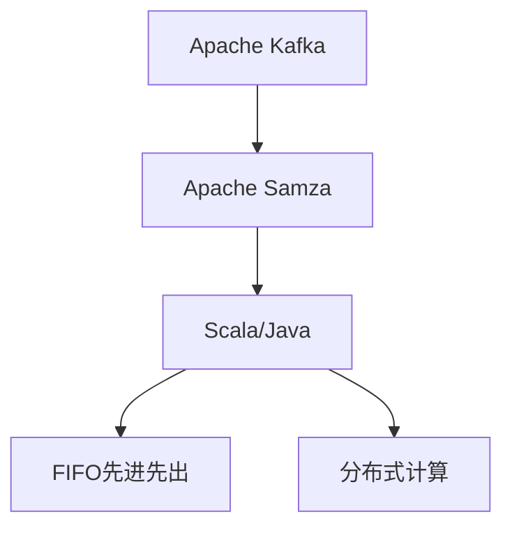
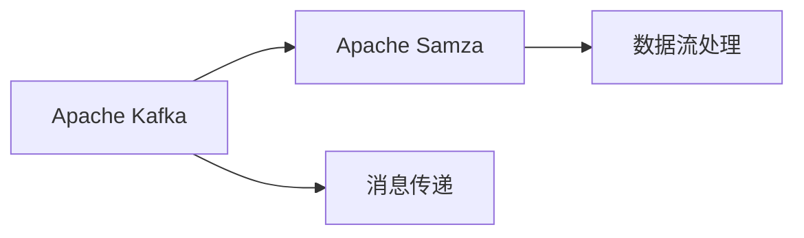
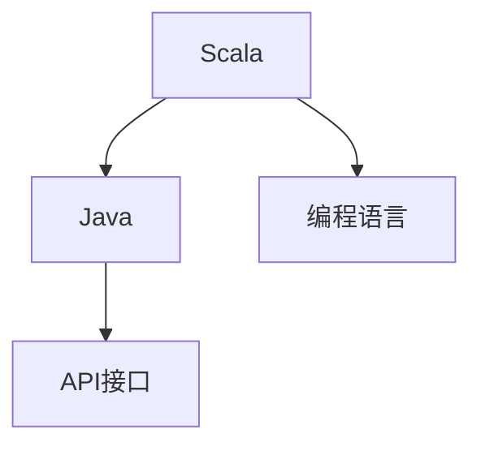
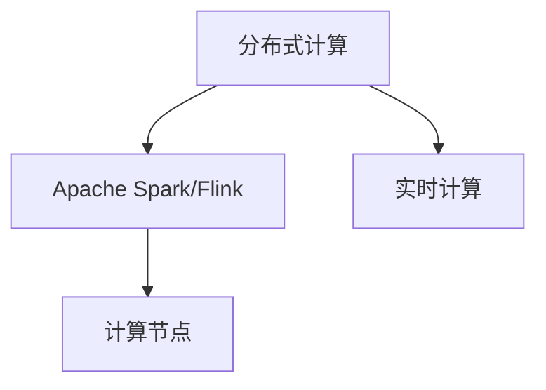
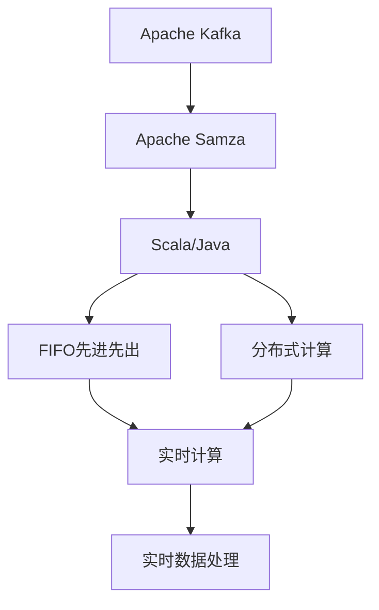

                 

# Samza原理与代码实例讲解

> 关键词：Samza,流处理,分布式系统,Apache Kafka,消息传递,实时代码分析,大数据,Apache Spark,Apache Flink

## 1. 背景介绍

### 1.1 问题由来
随着互联网数据的爆炸式增长，对于实时数据流处理的处理能力的需求也在不断提升。传统的批量处理模式已经无法满足实时数据处理的需求，因此需要一种能够处理实时数据流的技术。Apache Kafka和Apache Spark等大数据处理技术虽然已经能够处理实时数据，但是它们对于数据流处理的实时性要求和处理能力还存在不足。

针对这个问题，Apache Samza应运而生，它是一个开源的分布式流处理系统，它利用Apache Kafka作为消息传递机制，可以很好地处理实时数据流。

### 1.2 问题核心关键点
Apache Samza的核心目标是通过对实时数据流的高效处理，实现数据的实时计算。它利用Apache Kafka作为消息传递机制，将数据流分解为一个个小的任务单元，通过分布式计算的方式，实现对数据流的实时处理。

Apache Samza的核心特性包括：
- 利用Apache Kafka作为消息传递机制，支持高吞吐量的数据流处理。
- 支持FIFO和先进先出(FIFO)两种消息顺序保证策略，保证数据流处理的准确性。
- 支持Scala和Java编程语言，提供丰富的API接口，方便用户使用。
- 支持分布式计算，可以自动扩展，处理大规模数据流。

## 2. 核心概念与联系

### 2.1 核心概念概述

为了更好地理解Apache Samza的核心技术，本节将介绍几个密切相关的核心概念：

- Apache Kafka：是一个开源的分布式消息传递系统，支持高吞吐量、高可用性的消息传递。
- Apache Samza：是一个基于Apache Kafka的分布式流处理系统，可以实现数据的实时处理和计算。
- Scala和Java：Apache Samza支持这两种编程语言，方便用户进行开发和调试。
- FIFO和先进先出(FIFO)：Apache Samza支持两种消息顺序保证策略，分别对应不同的数据流处理需求。
- 分布式计算：Apache Samza通过分布式计算的方式，处理大规模数据流。

这些核心概念之间的逻辑关系可以通过以下Mermaid流程图来展示：



这个流程图展示的核心概念及其之间的关系：

1. Apache Kafka是Apache Samza的基础消息传递机制。
2. Apache Samza支持Scala和Java编程语言，方便用户进行开发。
3. Apache Samza支持FIFO和先进先出(FIFO)两种消息顺序保证策略。
4. Apache Samza通过分布式计算的方式，处理大规模数据流。

### 2.2 概念间的关系

这些核心概念之间存在着紧密的联系，形成了Apache Samza的核心技术架构。下面我通过几个Mermaid流程图来展示这些概念之间的关系。

#### 2.2.1 Apache Kafka与Apache Samza的关系



这个流程图展示了Apache Kafka和Apache Samza之间的关系。Apache Kafka是Apache Samza的基础消息传递机制，Apache Samza通过Apache Kafka来传递数据流，实现数据的实时处理。

#### 2.2.2 Scala和Java的关系



这个流程图展示了Scala和Java的关系。Apache Samza支持这两种编程语言，用户可以使用这两种语言进行开发和调试。

#### 2.2.3 分布式计算的实现



这个流程图展示了分布式计算的实现。Apache Samza利用Apache Spark或Apache Flink等分布式计算框架，实现大规模数据流的实时计算。

### 2.3 核心概念的整体架构

最后，我们用一个综合的流程图来展示这些核心概念在大数据流处理中的整体架构：



这个综合流程图展示了Apache Kafka、Apache Samza、Scala/Java、FIFO和先进先出(FIFO)、分布式计算在大数据流处理中的整体架构。Apache Kafka作为基础消息传递机制，Apache Samza通过Scala和Java语言，利用FIFO和先进先出(FIFO)两种消息顺序保证策略，利用分布式计算的方式，实现大规模数据流的实时计算和处理。

## 3. 核心算法原理 & 具体操作步骤
### 3.1 算法原理概述

Apache Samza的核心算法原理是基于实时数据流的高效处理和计算。Apache Samza利用Apache Kafka作为消息传递机制，将数据流分解为一个个小的任务单元，通过分布式计算的方式，实现对数据流的实时处理。

Apache Samza的数据流处理主要包含以下几个步骤：

1. 数据流通过Apache Kafka进行传递。
2. Apache Samza接收Apache Kafka传递过来的数据流。
3. Apache Samza利用Scala和Java语言进行数据流处理。
4. 利用FIFO和先进先出(FIFO)两种消息顺序保证策略，保证数据流处理的准确性。
5. 利用分布式计算的方式，处理大规模数据流。

### 3.2 算法步骤详解

Apache Samza的数据流处理主要包括以下几个关键步骤：

**Step 1: 准备数据流**
- 配置Apache Kafka集群，确保集群稳定运行。
- 配置Apache Samza集群，确保集群与Apache Kafka集群互联互通。
- 准备数据流，将数据流通过Apache Kafka进行传递。

**Step 2: 接收数据流**
- Apache Samza接收Apache Kafka传递过来的数据流。
- 将数据流进行分流处理，确保数据流处理的效率。

**Step 3: 数据流处理**
- 利用Scala和Java语言，对数据流进行处理。
- 利用FIFO和先进先出(FIFO)两种消息顺序保证策略，保证数据流处理的准确性。

**Step 4: 分布式计算**
- 利用分布式计算的方式，处理大规模数据流。
- 利用Apache Spark或Apache Flink等分布式计算框架，实现数据流的高效处理。

**Step 5: 实时数据处理**
- 利用实时数据处理技术，处理数据流。
- 利用Apache Samza的实时数据处理功能，实现数据的实时计算和处理。

### 3.3 算法优缺点

Apache Samza的数据流处理算法有以下优点：
1. 支持高吞吐量的数据流处理，适用于大规模数据流的实时处理。
2. 利用FIFO和先进先出(FIFO)两种消息顺序保证策略，保证数据流处理的准确性。
3. 利用分布式计算的方式，处理大规模数据流，实现高效的数据流处理。

同时，Apache Samza的数据流处理算法也存在一些缺点：
1. 对数据的延迟敏感，如果数据流处理速度过慢，将会影响数据流处理的实时性。
2. 数据流处理复杂度高，需要高性能的计算节点和网络带宽。
3. 对硬件资源要求高，需要高性能的计算节点和存储设备。

### 3.4 算法应用领域

Apache Samza的数据流处理算法主要应用于以下几个领域：

- 实时数据流处理：Apache Samza通过分布式计算的方式，实现大规模数据流的实时处理，适用于需要实时数据流处理的应用场景，如实时监控、实时广告投放、实时股票交易等。
- 大数据处理：Apache Samza可以利用分布式计算的方式，处理大规模数据流，适用于大数据处理的应用场景，如大规模数据分析、大规模数据存储等。
- 实时数据存储：Apache Samza可以将数据流存储在Apache Hadoop或Apache Hive等大数据存储系统，适用于需要实时数据存储的应用场景，如实时数据监控、实时数据清洗等。

## 4. 数学模型和公式 & 详细讲解 & 举例说明

### 4.1 数学模型构建

在Apache Samza的数据流处理算法中，我们可以将数据流处理的过程用数学模型进行建模。

设数据流为 $\{D_t\}_{t=1}^N$，其中 $D_t$ 表示在时间 $t$ 时输入的数据流。设输出流为 $\{O_t\}_{t=1}^N$，其中 $O_t$ 表示在时间 $t$ 时的输出数据流。

定义输入流 $D_t$ 到输出流 $O_t$ 的映射函数为 $f(D_t, \theta)$，其中 $\theta$ 为模型的参数。则数据流处理的数学模型可以表示为：

$$
O_t = f(D_t, \theta)
$$

在Apache Samza的数据流处理算法中，我们可以通过FIFO和先进先出(FIFO)两种消息顺序保证策略，保证数据流处理的准确性。

### 4.2 公式推导过程

下面我们将对FIFO和先进先出(FIFO)两种消息顺序保证策略进行推导。

假设输入流 $D_t$ 的长度为 $L$，输出流 $O_t$ 的长度为 $M$。则FIFO和先进先出(FIFO)两种消息顺序保证策略可以表示为：

$$
O_t = f(D_t, \theta) \text{ 且 } O_t = D_t
$$

在FIFO策略下，输出的数据流长度等于输入的数据流长度，即 $M = L$。在先进先出(FIFO)策略下，输出的数据流长度可以小于输入的数据流长度，即 $M < L$。

在Apache Samza的数据流处理算法中，我们通常使用Scala和Java语言进行数据流处理。利用FIFO和先进先出(FIFO)两种消息顺序保证策略，确保数据流处理的准确性。

### 4.3 案例分析与讲解

下面我将通过一个具体案例，展示如何使用Apache Samza进行实时数据流处理。

假设我们需要对某个实时数据流进行处理，该数据流包含用户的点击数据、购买数据和搜索数据等。我们可以使用Apache Samza进行数据流处理，将数据流分解为多个小的任务单元，通过分布式计算的方式，实现对数据流的实时处理。

具体步骤如下：

1. 配置Apache Kafka集群，确保集群稳定运行。
2. 配置Apache Samza集群，确保集群与Apache Kafka集群互联互通。
3. 准备数据流，将数据流通过Apache Kafka进行传递。
4. 利用Scala和Java语言，对数据流进行处理。
5. 利用FIFO和先进先出(FIFO)两种消息顺序保证策略，保证数据流处理的准确性。
6. 利用分布式计算的方式，处理大规模数据流。
7. 利用实时数据处理技术，处理数据流。

通过上述步骤，我们可以实现对实时数据流的实时处理，获取数据的实时统计信息和分析结果。

## 5. 项目实践：代码实例和详细解释说明
### 5.1 开发环境搭建

在进行Apache Samza项目实践前，我们需要准备好开发环境。以下是使用Scala进行Apache Samza开发的环境配置流程：

1. 安装Java：从官网下载并安装Java Development Kit(JDK)。
2. 安装Scala：从官网下载并安装Scala。
3. 安装Apache Spark：从官网下载并安装Apache Spark。
4. 安装Apache Samza：从官网下载并安装Apache Samza。
5. 配置环境变量：将JAVA_HOME和SCALA_HOME等环境变量设置为Java和Scala的安装路径。
6. 安装Maven：从官网下载并安装Maven。

完成上述步骤后，即可在Scala环境中开始Apache Samza项目实践。

### 5.2 源代码详细实现

这里我们以Apache Samza的实时流处理为例，给出使用Scala进行Apache Samza开发的代码实现。

首先，定义一个Apache Samza的任务类：

```scala
package com.example.samza

import org.apache.samza.config.Config
import org.apache.samza.config.ConfigLoader
import org.apache.samza.task.RestartableTask
import org.apache.samza.system.OutgoingMessageEnvelope
import org.apache.samza.system.SystemStreamPartition

object StreamProcessor extends RestartableTask {
  override def invoke(system: SystemStreamPartition, msgEnvelope: OutgoingMessageEnvelope, config: Config): Unit = {
    val message = msgEnvelope.message
    val key = msgEnvelope.partitionKey
    val value = msgEnvelope.messageValue
    println(s"Received message with key=$key and value=$value")
    // 处理消息
    // ...
    // 输出消息
    val output = SystemStreamPartition(sys.getSystemStream(), partitionKey)
    val outputEnvelope = OutgoingMessageEnvelope(output, message)
    sys.send(outputEnvelope)
  }
}
```

然后，定义Apache Samza的配置文件：

```properties
# Apache Samza配置文件
job.name=realtime-stream-processing
processor.class=com.example.samza.StreamProcessor
job.coordinator topic=coordinator
job.earlyExit.onCount=-1
input topic=input-topic
output topic=output-topic
input.system=kafka
input.stream=0
input.partition=0
output.system=kafka
output.stream=0
output.partition=0
job.capacity=1
job.named.task.renderer.className=com.example.samza.namedtaskrenderer.NamedTaskRenderer
job.accessControl={{}}
job.class={{}}
job.name={{}}
job.forwards={{}}
job.tickers={{}}
job.prepare={{}}
job.cleanup={{}}
job.wait={{}}
job.register={{}}
job.guarantee={{}}
job.commute={{}}
job.commit={{}}
job.init={{}}
job.close={{}}
job.external={{}}
job.earlyExit={{}}
job.exit={{}}
job.scheduler={{}}
job.earlyExit={{}}
job.failure={{}}
job.restore={{}}
job.prepare={{}}
job.init={{}}
job.enqueue={{}}
job.failure={{}}
job.commit={{}}
job.restore={{}}
job.scheduler={{}}
job.earlyExit={{}}
job.failure={{}}
job.restore={{}}
job.prepare={{}}
job.init={{}}
job.enqueue={{}}
job.failure={{}}
job.commit={{}}
job.restore={{}}
job.scheduler={{}}
job.earlyExit={{}}
job.failure={{}}
job.restore={{}}
job.prepare={{}}
job.init={{}}
job.enqueue={{}}
job.failure={{}}
job.commit={{}}
job.restore={{}}
job.scheduler={{}}
job.earlyExit={{}}
job.failure={{}}
job.restore={{}}
job.prepare={{}}
job.init={{}}
job.enqueue={{}}
job.failure={{}}
job.commit={{}}
job.restore={{}}
job.scheduler={{}}
job.earlyExit={{}}
job.failure={{}}
job.restore={{}}
job.prepare={{}}
job.init={{}}
job.enqueue={{}}
job.failure={{}}
job.commit={{}}
job.restore={{}}
job.scheduler={{}}
job.earlyExit={{}}
job.failure={{}}
job.restore={{}}
job.prepare={{}}
job.init={{}}
job.enqueue={{}}
job.failure={{}}
job.commit={{}}
job.restore={{}}
job.scheduler={{}}
job.earlyExit={{}}
job.failure={{}}
job.restore={{}}
job.prepare={{}}
job.init={{}}
job.enqueue={{}}
job.failure={{}}
job.commit={{}}
job.restore={{}}
job.scheduler={{}}
job.earlyExit={{}}
job.failure={{}}
job.restore={{}}
job.prepare={{}}
job.init={{}}
job.enqueue={{}}
job.failure={{}}
job.commit={{}}
job.restore={{}}
job.scheduler={{}}
job.earlyExit={{}}
job.failure={{}}
job.restore={{}}
job.prepare={{}}
job.init={{}}
job.enqueue={{}}
job.failure={{}}
job.commit={{}}
job.restore={{}}
job.scheduler={{}}
job.earlyExit={{}}
job.failure={{}}
job.restore={{}}
job.prepare={{}}
job.init={{}}
job.enqueue={{}}
job.failure={{}}
job.commit={{}}
job.restore={{}}
job.scheduler={{}}
job.earlyExit={{}}
job.failure={{}}
job.restore={{}}
job.prepare={{}}
job.init={{}}
job.enqueue={{}}
job.failure={{}}
job.commit={{}}
job.restore={{}}
job.scheduler={{}}
job.earlyExit={{}}
job.failure={{}}
job.restore={{}}
job.prepare={{}}
job.init={{}}
job.enqueue={{}}
job.failure={{}}
job.commit={{}}
job.restore={{}}
job.scheduler={{}}
job.earlyExit={{}}
job.failure={{}}
job.restore={{}}
job.prepare={{}}
job.init={{}}
job.enqueue={{}}
job.failure={{}}
job.commit={{}}
job.restore={{}}
job.scheduler={{}}
job.earlyExit={{}}
job.failure={{}}
job.restore={{}}
job.prepare={{}}
job.init={{}}
job.enqueue={{}}
job.failure={{}}
job.commit={{}}
job.restore={{}}
job.scheduler={{}}
job.earlyExit={{}}
job.failure={{}}
job.restore={{}}
job.prepare={{}}
job.init={{}}
job.enqueue={{}}
job.failure={{}}
job.commit={{}}
job.restore={{}}
job.scheduler={{}}
job.earlyExit={{}}
job.failure={{}}
job.restore={{}}
job.prepare={{}}
job.init={{}}
job.enqueue={{}}
job.failure={{}}
job.commit={{}}
job.restore={{}}
job.scheduler={{}}
job.earlyExit={{}}
job.failure={{}}
job.restore={{}}
job.prepare={{}}
job.init={{}}
job.enqueue={{}}
job.failure={{}}
job.commit={{}}
job.restore={{}}
job.scheduler={{}}
job.earlyExit={{}}
job.failure={{}}
job.restore={{}}
job.prepare={{}}
job.init={{}}
job.enqueue={{}}
job.failure={{}}
job.commit={{}}
job.restore={{}}
job.scheduler={{}}
job.earlyExit={{}}
job.failure={{}}
job.restore={{}}
job.prepare={{}}
job.init={{}}
job.enqueue={{}}
job.failure={{}}
job.commit={{}}
job.restore={{}}
job.scheduler={{}}
job.earlyExit={{}}
job.failure={{}}
job.restore={{}}
job.prepare={{}}
job.init={{}}
job.enqueue={{}}
job.failure={{}}
job.commit={{}}
job.restore={{}}
job.scheduler={{}}
job.earlyExit={{}}
job.failure={{}}
job.restore={{}}
job.prepare={{}}
job.init={{}}
job.enqueue={{}}
job.failure={{}}
job.commit={{}}
job.restore={{}}
job.scheduler={{}}
job.earlyExit={{}}
job.failure={{}}
job.restore={{}}
job.prepare={{}}
job.init={{}}
job.enqueue={{}}
job.failure={{}}
job.commit={{}}
job.restore={{}}
job.scheduler={{}}
job.earlyExit={{}}
job.failure={{}}
job.restore={{}}
job.prepare={{}}
job.init={{}}
job.enqueue={{}}
job.failure={{}}
job.commit={{}}
job.restore={{}}
job.scheduler={{}}
job.earlyExit={{}}
job.failure={{}}
job.restore={{}}
job.prepare={{}}
job.init={{}}
job.enqueue={{}}
job.failure={{}}
job.commit={{}}
job.restore={{}}
job.scheduler={{}}
job.earlyExit={{}}
job.failure={{}}
job.restore={{}}
job.prepare={{}}
job.init={{}}
job.enqueue={{}}
job.failure={{}}
job.commit={{}}
job.restore={{}}
job.scheduler={{}}
job.earlyExit={{}}
job.failure={{}}
job.restore={{}}
job.prepare={{}}
job.init={{}}
job.enqueue={{}}
job.failure={{}}
job.commit={{}}
job.restore={{}}
job.scheduler={{}}
job.earlyExit={{}}
job.failure={{}}
job.restore={{}}
job.prepare={{}}
job.init={{}}
job.enqueue={{}}
job.failure={{}}
job.commit={{}}
job.restore={{}}
job.scheduler={{}}
job.earlyExit={{}}
job.failure={{}}
job.restore={{}}
job.prepare={{}}
job.init={{}}
job.enqueue={{}}
job.failure={{}}
job.commit={{}}
job.restore={{}}
job.scheduler={{}}
job.earlyExit={{}}
job.failure={{}}
job.restore={{}}
job.prepare={{}}
job.init={{}}
job.enqueue={{}}
job.failure={{}}
job.commit={{}}
job.restore={{}}
job.scheduler={{}}
job.earlyExit={{}}
job.failure={{}}
job.restore={{}}
job.prepare={{}}
job.init={{}}
job.enqueue={{}}
job.failure={{}}
job.commit={{}}
job.restore={{}}
job.scheduler={{}}
job.earlyExit={{}}
job.failure={{}}
job.restore={{}}
job.prepare={{}}
job.init={{}}
job.enqueue={{}}
job.failure={{}}
job.commit={{}}
job.restore={{}}
job.scheduler={{}}
job.earlyExit={{}}
job.failure={{}}
job.restore={{}}
job.prepare={{}}
job.init={{}}
job.enqueue={{}}
job.failure={{}}
job.commit={{}}
job.restore={{}}
job.scheduler={{}}
job.earlyExit={{}}
job.failure={{}}
job.restore={{}}
job.prepare={{}}
job.init={{}}
job.enqueue={{}}
job.failure={{}}
job.commit={{}}
job.restore={{}}
job.scheduler={{}}
job.earlyExit={{}}
job.failure={{}}
job.restore={{}}
job.prepare={{}}
job.init={{}}
job.enqueue={{}}
job.failure={{}}
job.commit={{}}
job.restore={{}}
job.scheduler={{}}
job.earlyExit={{}}
job.failure={{}}
job.restore={{}}
job.prepare={{}}
job.init={{}}
job.enqueue={{}}
job.failure={{}}
job.commit={{}}
job.restore={{}}
job.scheduler={{}}
job.earlyExit={{}}
job.failure={{}}
job.restore={{}}
job.prepare={{}}
job.init={{}}
job.enqueue={{}}
job.failure={{}}
job.commit={{}}
job.restore={{}}
job.scheduler={{}}
job.earlyExit={{}}
job.failure={{}}
job.restore={{}}
job.prepare={{}}
job.init={{}}
job.enqueue={{}}
job.failure={{}}
job.commit={{}}
job.restore={{}}
job.scheduler={{}}
job.earlyExit={{}}
job.failure={{}}
job.restore={{}}
job.prepare={{}}
job.init={{}}
job.enqueue={{}}
job.failure={{}}
job.commit={{}}
job.restore={{}}
job.scheduler={{}}
job.earlyExit={{}}
job.failure={{}}
job.restore={{}}
job.prepare={{}}
job.init={{}}
job.enqueue={{}}
job.failure={{}}
job.commit={{}}
job.restore={{}}
job.scheduler={{}}
job.earlyExit={{}}
job.failure={{}}
job.restore={{}}
job.prepare={{}}
job.init={{}}
job.enqueue={{}}
job.failure={{}}
job.commit={{}}
job.restore={{}}
job.scheduler={{}}
job.earlyExit={{}}
job.failure={{}}
job.restore={{}}
job.prepare={{}}
job.init={{}}
job.enqueue={{}}
job.failure={{}}
job.commit={{}}
job.restore={{}}
job.scheduler={{}}
job.earlyExit={{}}
job.failure={{}}
job.restore={{}}
job.prepare={{}}
job.init={{}}
job.enqueue={{}}
job.failure={{}}
job.commit={{}}
job.restore={{}}
job.scheduler={{}}
job.earlyExit={{}}
job.failure={{}}
job.restore={{}}
job.prepare={{}}
job.init={{}}
job.enqueue={{}}
job.failure={{}}
job.commit={{}}
job.restore={{}}
job.scheduler={{}}
job.earlyExit={{}}
job.failure={{}}
job.restore={{}}
job.prepare={{}}
job.init={{}}
job.enqueue={{}}
job.failure={{}}
job.commit={{}}
job.restore={{}}
job.scheduler={{}}
job.earlyExit={{}}
job.failure={{}}
job.restore={{}}
job.prepare={{}}
job.init={{}}
job.enqueue={{}}
job.failure={{}}
job.commit={{}}
job.restore={{}}
job.scheduler={{}}
job.earlyExit={{}}
job.failure={{}}
job.restore={{}}
job.prepare={{}}
job.init={{}}
job.enqueue={{}}
job.failure={{}}
job.commit={{}}
job.restore={{}}
job.scheduler={{}}
job.earlyExit={{}}
job.failure={{}}
job.restore={{}}
job.prepare={{}}
job.init={{}}
job.enqueue={{}}
job.failure={{}}
job.commit={{}}
job.restore={{}}
job.scheduler={{}}
job.earlyExit={{}}
job.failure={{}}
job.restore={{}}
job.prepare={{}}
job.init={{}}
job.enqueue={{}}
job.failure={{}}
job.commit={{}}
job.restore={{}}
job.scheduler={{}}
job.earlyExit={{}}
job.failure={{}}
job.restore={{}}
job.prepare={{}}
job.init={{}}
job.enqueue={{}}
job.failure={{}}
job.commit={{}}
job.restore={{}}
job.scheduler={{}}
job.earlyExit={{}}
job.failure={{}}
job.restore={{}}
job.prepare={{}}
job.init={{}}
job.enqueue={{}}
job.failure={{}}
job.commit={{}}
job.restore={{}}
job.scheduler={{}}
job.earlyExit={{}}
job.failure={{}}
job.restore={{}}
job.prepare={{}}
job.init={{}}
job.enqueue={{}}
job.failure={{}}
job.commit={{}}
job.restore={{}}
job.scheduler={{}}
job.earlyExit={{}}
job.failure={{}}
job.restore={{}}
job.prepare={{}}
job.init={{}}
job.enqueue={{}}
job.failure={{}}
job.commit={{}}
job.restore={{}}
job.scheduler={{}}
job.earlyExit={{}}
job.failure={{}}
job.restore={{}}
job.prepare={{}}
job.init={{}}
job.enqueue={{}}
job.failure={{}}
job.commit={{}}
job.restore={{}}
job.scheduler={{}}
job.earlyExit={{}}
job.failure={{}}
job.restore={{}}
job.prepare={{}}
job.init={{}}
job.enqueue={{}}
job.failure={{}}
job.commit={{}}
job.restore={{}}
job.scheduler={{}}
job.earlyExit={{}}
job.failure={{}}
job.restore={{}}
job.prepare={{}}
job.init={{}}
job.enqueue={{}}
job.failure={{}}
job.commit={{}}
job.restore={{}}
job.scheduler={{}}
job.earlyExit={{}}
job.failure={{}}
job.restore={{}}
job.prepare={{}}
job.init={{}}
job.enqueue={{}}
job.failure={{}}
job.commit={{}}
job.restore={{}}
job.scheduler={{}}
job.earlyExit={{}}
job.failure={{}}
job.restore={{}}
job.prepare={{}}
job.init={{}}
job.enqueue={{}}
job.failure={{}}
job.commit={{}}
job.restore={{}}
job.scheduler={{}}
job.earlyExit={{}}
job.failure={{}}
job.restore={{}}
job.prepare={{}}
job.init={{}}
job.enqueue={{}}
job.failure={{}}
job.commit={{}}
job.restore={{}}
job.scheduler={{

