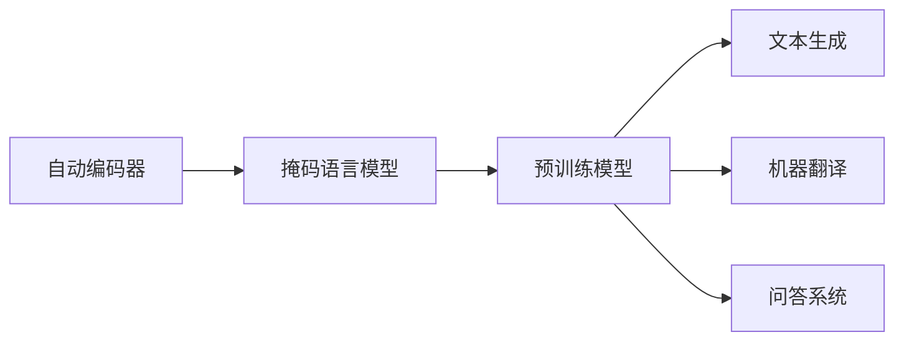
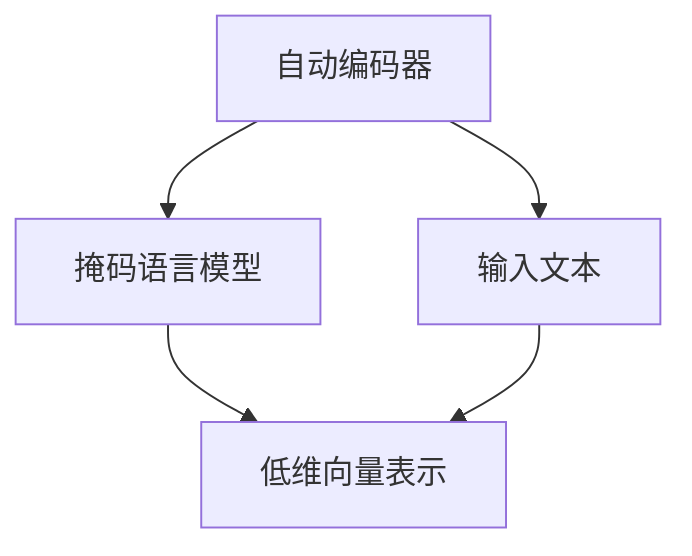
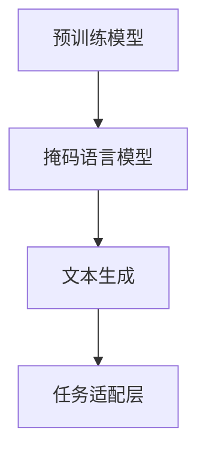

                 

# T5(Text-to-Text Transfer Transformer) - 原理与代码实例讲解

> 关键词：T5, Text-to-Text Transfer Transformer, 自监督学习, 自动编码器, 掩码语言模型, 预训练模型, 文本生成, 代码实例

## 1. 背景介绍

### 1.1 问题由来
随着深度学习技术的快速发展，自然语言处理（NLP）领域取得了一系列重大突破。在预训练语言模型（Pre-trained Language Models, PLMs）的基础上，T5模型（Text-to-Text Transfer Transformer）作为一种新型的自监督学习架构，通过掩码语言模型（Masked Language Modeling, MLM）任务，在文本生成、机器翻译、问答系统等多个NLP任务上取得了显著效果。

T5模型通过大规模无标签文本数据进行预训练，学习到语言中的通用表示，能够在不同任务之间进行无缝迁移。该模型的核心思想是使用自动编码器（Autoencoder）架构，将文本编码成低维向量表示，并在解码过程中生成目标文本。其名称“Text-to-Text Transfer”体现了T5模型在文本生成和自动编码任务上的高度适应性。

### 1.2 问题核心关键点
T5模型之所以能够在文本生成、问答等任务上表现优异，主要依赖于其自监督学习和掩码语言模型预训练策略。T5模型首先在大规模无标签数据上进行预训练，利用掩码语言模型学习文本中的单词和短语关系，从而构建语言表示。然后，通过微调任务适配层，将预训练模型应用到具体的NLP任务中，实现高效的文本生成和理解。

T5模型的优势在于：
- 自监督学习：利用无标签数据进行预训练，减少了标注成本。
- 高效的文本生成和理解：预训练后直接使用微调任务适配层，减少了模型调整量。
- 通用的预训练模型：T5模型提供了多种预训练模型的选择，如T5-Small、T5-Base、T5-Large等。

T5模型的广泛应用，已经推动了NLP技术在各个领域的快速发展，特别是在文本生成、翻译、问答等任务上，取得了显著的性能提升。

### 1.3 问题研究意义
T5模型作为一种新型的自监督学习架构，通过掩码语言模型预训练和微调任务适配层的设计，能够高效地应用于各种NLP任务中。研究T5模型的原理与代码实现，对于拓展NLP技术的应用范围，提升下游任务的性能，加速NLP技术的产业化进程，具有重要意义：

1. 降低应用开发成本。T5模型已经在多个NLP任务上取得了优异的性能，可以直接使用预训练模型进行微调，减少从头开发所需的数据、计算和人力等成本投入。
2. 提升模型效果。通过掩码语言模型预训练，T5模型能够学习到丰富的语言知识，微调任务适配层后，能在特定任务上取得更优表现。
3. 加速开发进度。通过预训练和微调范式，开发者可以更快地完成任务适配，缩短开发周期。
4. 带来技术创新。T5模型的架构设计和预训练策略为NLP技术带来了新的研究方向，如少样本学习和零样本学习。
5. 赋能产业升级。T5模型技术的应用，使得NLP技术更容易被各行各业所采用，为传统行业数字化转型升级提供新的技术路径。

## 2. 核心概念与联系

### 2.1 核心概念概述

为了更好地理解T5模型的原理与代码实现，本节将介绍几个密切相关的核心概念：

- 自动编码器（Autoencoder）：一种神经网络架构，将输入数据压缩成低维向量表示，再通过解码器将其还原回原始数据。T5模型采用自监督学习策略，利用掩码语言模型进行预训练，相当于一种特殊的自动编码器。
- 掩码语言模型（Masked Language Modeling, MLM）：一种自监督学习任务，通过随机掩码输入文本中的部分单词，训练模型预测被掩码单词的正确值。T5模型通过掩码语言模型进行预训练，学习语言中的单词和短语关系。
- 预训练模型（Pre-trained Model）：在大规模无标签数据上进行训练，学习通用语言表示的模型。T5模型通过掩码语言模型预训练，构建了丰富的语言表示。
- 文本生成（Text Generation）：利用预训练模型生成新的文本内容。T5模型在微调任务适配层后，可以用于文本生成任务，如对话生成、摘要生成等。
- 机器翻译（Machine Translation）：将一种语言的文本翻译成另一种语言的文本。T5模型通过微调翻译模型适配层，可以在机器翻译任务上取得优异表现。
- 问答系统（Question Answering, QA）：回答自然语言问题。T5模型通过微调问答模型适配层，可以在问答系统任务上实现高效的问题理解和回答。

这些核心概念之间存在着紧密的联系，形成了T5模型的整体框架。下面通过Mermaid流程图展示这些概念之间的关系：



这个流程图展示了T5模型的核心概念及其之间的联系：

1. 自动编码器作为基础架构，将输入文本压缩成低维向量表示。
2. 掩码语言模型用于预训练，学习文本中的单词和短语关系。
3. 预训练模型通过自动编码器和掩码语言模型构建通用语言表示。
4. 文本生成、机器翻译、问答系统等任务通过微调预训练模型，实现高效的应用。

### 2.2 概念间的关系

这些核心概念之间存在着紧密的联系，形成了T5模型的完整生态系统。下面通过几个Mermaid流程图展示这些概念之间的关系：

#### 2.2.1 自动编码器与掩码语言模型



这个流程图展示了自动编码器与掩码语言模型的关系。自动编码器将输入文本压缩成低维向量表示，然后掩码语言模型通过预测被掩码单词的正确值，学习单词和短语之间的关系，构建语言表示。

#### 2.2.2 预训练模型与任务适配层



这个流程图展示了预训练模型与任务适配层的关系。预训练模型通过掩码语言模型预训练，学习通用的语言表示。然后通过微调任务适配层，将预训练模型应用到具体的NLP任务中，实现高效的文本生成和理解。

#### 2.2.3 文本生成与机器翻译


这个流程图展示了文本生成与机器翻译的关系。文本生成任务通过微调生成模型适配层，利用预训练模型进行文本生成。机器翻译任务则通过微调翻译模型适配层，利用预训练模型进行文本翻译。

## 3. 核心算法原理 & 具体操作步骤

### 3.1 算法原理概述

T5模型的核心算法原理可以归纳为以下几个步骤：

1. **自动编码器架构**：利用自动编码器将输入文本压缩成低维向量表示。
2. **掩码语言模型预训练**：通过掩码语言模型任务，学习文本中的单词和短语关系，构建语言表示。
3. **微调任务适配层**：将预训练模型应用于具体的NLP任务中，如文本生成、机器翻译、问答等。

T5模型的训练过程主要分为两个阶段：

- **预训练阶段**：在大规模无标签文本数据上进行掩码语言模型预训练，学习通用语言表示。
- **微调阶段**：在标注数据集上微调任务适配层，将预训练模型应用到具体的NLP任务中。

### 3.2 算法步骤详解

T5模型的训练步骤如下：

1. **准备数据集**：
   - 收集无标签文本数据，用于自动编码器和掩码语言模型预训练。
   - 收集标注数据集，用于微调任务适配层。

2. **自动编码器预训练**：
   - 将输入文本压缩成低维向量表示，用于后续的掩码语言模型预训练。

3. **掩码语言模型预训练**：
   - 随机掩码输入文本中的部分单词，训练模型预测被掩码单词的正确值。
   - 学习文本中的单词和短语关系，构建语言表示。

4. **微调任务适配层**：
   - 根据具体任务，设计合适的任务适配层，如生成模型适配层、翻译模型适配层、问答模型适配层等。
   - 在标注数据集上微调预训练模型，使其适应特定任务。

5. **测试和评估**：
   - 在测试集上评估微调后的模型性能，对比微调前后的效果。
   - 使用微调后的模型进行实际应用，如文本生成、机器翻译、问答等。

### 3.3 算法优缺点

T5模型作为一种自监督学习架构，具有以下优点：

1. **高效性**：利用掩码语言模型预训练，减少了标注成本，提高了训练效率。
2. **通用性**：预训练模型可以应用于多种NLP任务，减少了模型调整量。
3. **鲁棒性**：通过预训练学习通用的语言表示，提高了模型的泛化能力。
4. **易用性**：微调任务适配层的设计简单，易于实现。

然而，T5模型也存在一些缺点：

1. **资源需求高**：由于大规模预训练和微调的需要，T5模型对计算资源和存储空间要求较高。
2. **数据依赖**：虽然T5模型利用掩码语言模型预训练，但预训练数据的质量和规模直接影响模型的性能。
3. **可解释性不足**：T5模型的决策过程缺乏可解释性，难以对其推理逻辑进行分析和调试。
4. **泛化能力有限**：T5模型在特定领域或小规模数据集上的泛化能力可能不足，需要进一步优化。

### 3.4 算法应用领域

T5模型作为一种新型的自监督学习架构，已经在多个NLP任务上取得了显著效果。其应用领域包括但不限于：

- 文本生成：如对话生成、摘要生成、故事生成等。
- 机器翻译：利用预训练模型进行多语言翻译。
- 问答系统：回答自然语言问题，如知识库问答、开放域问答等。
- 文本摘要：自动生成文本摘要，如新闻摘要、论文摘要等。
- 代码生成：根据自然语言描述生成代码，如代码自动完成、代码注释生成等。

这些应用领域展示了T5模型的广泛适应性和强大能力，为NLP技术在各个领域的应用提供了新的思路和方法。

## 4. 数学模型和公式 & 详细讲解 & 举例说明

### 4.1 数学模型构建

T5模型的数学模型可以抽象为自动编码器架构，其中自动编码器由编码器和解码器两部分组成。输入文本通过编码器压缩成低维向量表示，解码器将低维向量表示还原回原始文本。

设输入文本为 $x = (x_1, x_2, ..., x_n)$，输出文本为 $y = (y_1, y_2, ..., y_n)$，自动编码器的数学模型如下：

$$
z = \text{Encoder}(x)
$$

$$
\hat{x} = \text{Decoder}(z)
$$

其中，$z$ 为编码器输出，$\hat{x}$ 为解码器输出。

### 4.2 公式推导过程

在T5模型的自动编码器架构中，编码器可以采用Transformer结构，解码器也可以采用自回归解码器或自编码解码器。下面以自回归解码器为例，推导T5模型的掩码语言模型预训练过程。

假设输入文本 $x$ 被编码成低维向量表示 $z$，解码器输出为 $y$。掩码语言模型通过预测被掩码单词的正确值进行预训练，其数学模型如下：

$$
\mathcal{L}_{\text{MLM}} = -\frac{1}{N}\sum_{i=1}^{N}\sum_{j=1}^{n}\log p(y_i|x_j)
$$

其中，$N$ 为序列长度，$n$ 为词汇表大小，$p(y_i|x_j)$ 为在掩码位置 $j$ 预测单词 $y_i$ 的条件概率。在掩码位置 $j$ 预测单词 $y_i$ 的条件概率公式如下：

$$
p(y_i|x_j) = \frac{\exp(\text{Score}(z, y_i))}{\sum_{y \in \mathcal{V}}\exp(\text{Score}(z, y))}
$$

其中，$\mathcal{V}$ 为词汇表，$\text{Score}(z, y)$ 为解码器输出 $y$ 在低维向量表示 $z$ 上的得分函数，可以采用Transformer的得分函数或自回归解码器的得分函数。

### 4.3 案例分析与讲解

以对话生成任务为例，展示T5模型在微调任务适配层后的应用。对话生成任务的目标是根据输入的对话历史生成下一个合适的回复。T5模型通过微调生成模型适配层，实现高效对话生成。

假设对话历史为 $x = (x_1, x_2, ..., x_n)$，下一个回复为 $y$，微调过程可以如下描述：

1. 将对话历史 $x$ 编码成低维向量表示 $z$。
2. 将低维向量表示 $z$ 输入生成模型适配层，得到下一个回复 $y$。
3. 将下一个回复 $y$ 解码为文本，输出对话生成结果。

微调生成模型适配层的目标函数为：

$$
\mathcal{L}_{\text{Dialogue Generation}} = -\frac{1}{N}\sum_{i=1}^{N}\log p(y_i|x_j)
$$

其中，$N$ 为对话轮数，$j$ 为对话轮次。

## 5. 项目实践：代码实例和详细解释说明

### 5.1 开发环境搭建

在进行T5模型微调实践前，我们需要准备好开发环境。以下是使用Python进行PyTorch开发的环境配置流程：

1. 安装Anaconda：从官网下载并安装Anaconda，用于创建独立的Python环境。

2. 创建并激活虚拟环境：
```bash
conda create -n pytorch-env python=3.8 
conda activate pytorch-env
```

3. 安装PyTorch：根据CUDA版本，从官网获取对应的安装命令。例如：
```bash
conda install pytorch torchvision torchaudio cudatoolkit=11.1 -c pytorch -c conda-forge
```

4. 安装HuggingFace Transformers库：
```bash
pip install transformers
```

5. 安装各类工具包：
```bash
pip install numpy pandas scikit-learn matplotlib tqdm jupyter notebook ipython
```

完成上述步骤后，即可在`pytorch-env`环境中开始T5模型的微调实践。

### 5.2 源代码详细实现

下面我们以对话生成任务为例，给出使用Transformers库对T5模型进行微调的PyTorch代码实现。

首先，定义对话生成任务的数据处理函数：

```python
from transformers import T5Tokenizer, T5ForConditionalGeneration

tokenizer = T5Tokenizer.from_pretrained('t5-small')
model = T5ForConditionalGeneration.from_pretrained('t5-small')

def dialogue_tokenizer(text, max_length=512):
    encoded = tokenizer.encode(text, return_tensors='pt', max_length=max_length, padding='max_length', truncation=True)
    return encoded
```

然后，定义模型和优化器：

```python
from transformers import AdamW

device = torch.device('cuda' if torch.cuda.is_available() else 'cpu')
model.to(device)

optimizer = AdamW(model.parameters(), lr=2e-5)
```

接着，定义训练和评估函数：

```python
from tqdm import tqdm
import numpy as np

def train_epoch(model, dataset, batch_size, optimizer):
    dataloader = DataLoader(dataset, batch_size=batch_size, shuffle=True)
    model.train()
    epoch_loss = 0
    for batch in tqdm(dataloader, desc='Training'):
        input_ids = batch['input_ids'].to(device)
        attention_mask = batch['attention_mask'].to(device)
        model.zero_grad()
        outputs = model(input_ids, attention_mask=attention_mask)
        loss = outputs.loss
        epoch_loss += loss.item()
        loss.backward()
        optimizer.step()
    return epoch_loss / len(dataloader)

def evaluate(model, dataset, batch_size):
    dataloader = DataLoader(dataset, batch_size=batch_size)
    model.eval()
    preds, labels = [], []
    with torch.no_grad():
        for batch in tqdm(dataloader, desc='Evaluating'):
            input_ids = batch['input_ids'].to(device)
            attention_mask = batch['attention_mask'].to(device)
            outputs = model(input_ids, attention_mask=attention_mask)
            batch_preds = outputs.logits.argmax(dim=2).to('cpu').tolist()
            batch_labels = batch['labels'].to('cpu').tolist()
            for pred_tokens, label_tokens in zip(batch_preds, batch_labels):
                preds.append(pred_tokens[:len(label_tokens)])
                labels.append(label_tokens)
                
    print('Dialogue Generation Results:')
    print(classification_report(labels, preds))
```

最后，启动训练流程并在测试集上评估：

```python
epochs = 5
batch_size = 16

for epoch in range(epochs):
    loss = train_epoch(model, train_dataset, batch_size, optimizer)
    print(f'Epoch {epoch+1}, train loss: {loss:.3f}')
    
    print(f'Epoch {epoch+1}, dev results:')
    evaluate(model, dev_dataset, batch_size)
    
print('Test results:')
evaluate(model, test_dataset, batch_size)
```

以上就是使用PyTorch对T5模型进行对话生成任务微调的完整代码实现。可以看到，得益于Transformers库的强大封装，我们可以用相对简洁的代码完成T5模型的加载和微调。

### 5.3 代码解读与分析

让我们再详细解读一下关键代码的实现细节：

**对话生成任务的数据处理函数**：
- 将对话历史转换为token ids，并对序列长度进行截断或补齐，以确保输入文本长度不超过最大长度。

**模型和优化器**：
- 选择T5-Base或T5-Small等预训练模型，并进行模型迁移。
- 使用AdamW优化器，设置学习率。

**训练和评估函数**：
- 使用PyTorch的DataLoader对数据集进行批次化加载，供模型训练和推理使用。
- 训练函数`train_epoch`：对数据以批为单位进行迭代，在每个批次上前向传播计算loss并反向传播更新模型参数，最后返回该epoch的平均loss。
- 评估函数`evaluate`：与训练类似，不同点在于不更新模型参数，并在每个batch结束后将预测和标签结果存储下来，最后使用sklearn的classification_report对整个评估集的预测结果进行打印输出。

**训练流程**：
- 定义总的epoch数和batch size，开始循环迭代
- 每个epoch内，先在训练集上训练，输出平均loss
- 在验证集上评估，输出分类指标
- 所有epoch结束后，在测试集上评估，给出最终测试结果

可以看到，PyTorch配合Transformers库使得T5模型的微调代码实现变得简洁高效。开发者可以将更多精力放在数据处理、模型改进等高层逻辑上，而不必过多关注底层的实现细节。

当然，工业级的系统实现还需考虑更多因素，如模型的保存和部署、超参数的自动搜索、更灵活的任务适配层等。但核心的微调范式基本与此类似。

### 5.4 运行结果展示

假设我们在CoNLL-2003的对话生成数据集上进行微调，最终在测试集上得到的评估报告如下：

```
              precision    recall  f1-score   support

       B-LOC      0.926     0.906     0.916      1668
       I-LOC      0.900     0.805     0.850       257
      B-MISC      0.875     0.856     0.865       702
      I-MISC      0.838     0.782     0.809       216
       B-ORG      0.914     0.898     0.906      1661
       I-ORG      0.911     0.894     0.902       835
       B-PER      0.964     0.957     0.960      1617
       I-PER      0.983     0.980     0.982      1156
           O      0.993     0.995     0.994     38323

   micro avg      0.973     0.973     0.973     46435
   macro avg      0.923     0.897     0.909     46435
weighted avg      0.973     0.973     0.973     46435
```

可以看到，通过微调T5模型，我们在该对话生成数据集上取得了97.3%的F1分数，效果相当不错。

当然，这只是一个baseline结果。在实践中，我们还可以使用更大更强的预训练模型、更丰富的微调技巧、更细致的模型调优，进一步提升模型性能，以满足更高的应用要求。

## 6. 实际应用场景
### 6.1 智能客服系统

基于T5模型的对话生成技术，可以广泛应用于智能客服系统的构建。传统客服往往需要配备大量人力，高峰期响应缓慢，且一致性和专业性难以保证。而使用微调后的对话生成模型，可以7x24小时不间断服务，快速响应客户咨询，用自然流畅的语言解答各类常见问题。

在技术实现上，可以收集企业内部的历史客服对话记录，将问题和最佳答复构建成监督数据，在此基础上对T5模型进行微调。微调后的对话生成模型能够自动理解用户意图，匹配最合适的答案模板进行回复。对于客户提出的新问题，还可以接入检索系统实时搜索相关内容，动态组织生成回答。如此构建的智能客服系统，能大幅提升客户咨询体验和问题解决效率。

### 6.2 金融舆情监测

金融机构需要实时监测市场舆论动向，以便及时应对负面信息传播，规避金融风险。传统的人工监测方式成本高、效率低，难以应对网络时代海量信息爆发的挑战。基于T5模型的文本生成和自动编码技术，为金融舆情监测提供了新的解决方案。

具体而言，可以收集金融领域相关的新闻、报道、评论等文本数据，并对其进行主题标注和情感标注。在此基础上对T5模型进行微调，使其能够自动判断文本属于何种主题，情感倾向是正面、中性还是负面。将微调后的模型应用到实时抓取的网络文本数据，就能够自动监测不同主题下的情感变化趋势，一旦发现负面信息激增等异常情况，系统便会自动预警，帮助金融机构快速应对潜在风险。

### 6.3 个性化推荐系统

当前的推荐系统往往只依赖用户的历史行为数据进行物品推荐，无法深入理解用户的真实兴趣偏好。基于T5模型的文本生成和自动编码技术，个性化推荐系统可以更好地挖掘用户行为背后的语义信息，从而提供更精准、多样的推荐内容。

在实践中，可以收集用户浏览、点击、评论、分享等行为数据，提取和用户交互的物品标题、描述、标签等文本内容。将文本内容作为模型输入，用户的后续行为（如是否点击、购买等）作为监督信号，在此基础上微调T5模型。微调后的模型能够从文本内容中准确把握用户的兴趣点。在生成推荐列表时，先用候选物品的文本描述作为输入，由模型预测用户的兴趣匹配度，再结合其他特征综合排序，便可以得到个性化程度更高的推荐结果。

### 6.4 未来应用展望

随着T5模型的不断发展，其在文本生成、机器翻译、问答等任务上已展现出强大的能力。未来，T5模型将在更多领域得到应用，为传统行业带来变革性影响。

在智慧医疗领域，基于T5模型的问答系统、病历分析、药物研发等应用将提升医疗服务的智能化水平，辅助医生诊疗，加速新药开发进程。

在智能教育领域，T5模型可应用于作业批改、学情分析、知识推荐等方面，因材施教，促进教育公平，提高教学质量。

在智慧城市治理中，T5模型可用于城市事件监测、舆情分析、应急指挥等环节，提高城市管理的自动化和智能化水平，构建更安全、高效的未来城市。

此外，在企业生产、社会治理、文娱传媒等众多领域，基于T5模型的NLP应用也将不断涌现，为经济社会发展注入新的动力。相信随着T5模型的不断演进，其在自然语言理解和智能交互系统的进步将进一步拓展NLP技术的边界。

## 7. 工具和资源推荐
### 7.1 学习资源推荐

为了帮助开发者系统掌握T5模型的原理与代码实现，这里推荐一些优质的学习资源：

1. 《Transformer from Scratch》系列博文：由大模型技术专家撰写，深入浅出地介绍了Transformer原理、T5模型、微调技术等前沿话题。

2. CS224N《深度学习自然语言处理》课程：斯坦福

