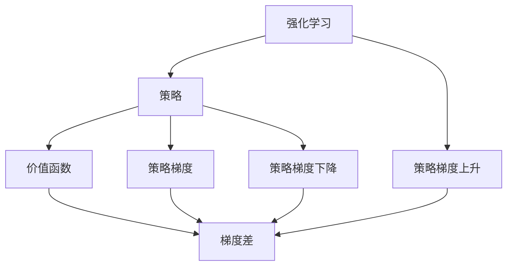
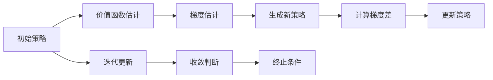
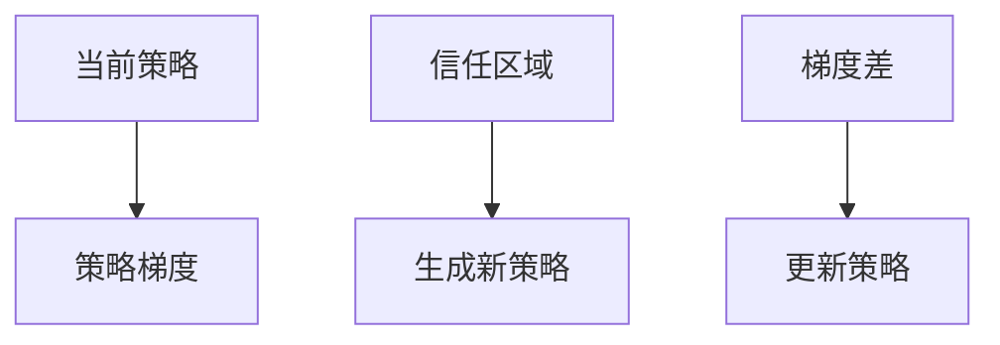
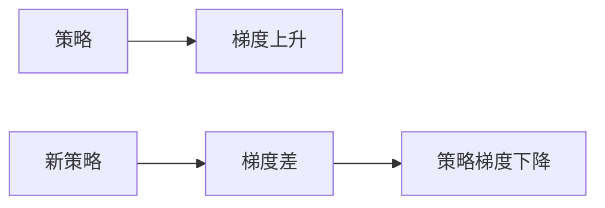
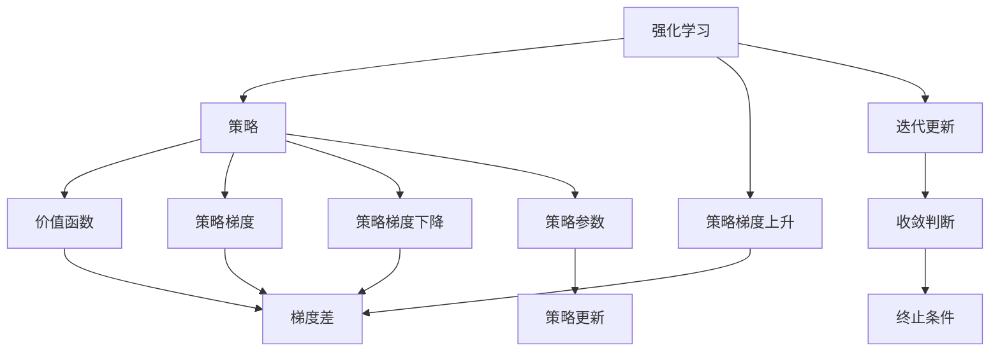

                 

# TRPO(Trust Region Policy Optimization) - 原理与代码实例讲解

> 关键词：TRPO算法, 强化学习, 政策优化, 梯度上升, 梯度下降, 梯度更新

## 1. 背景介绍

### 1.1 问题由来
强化学习（Reinforcement Learning, RL）是机器学习领域的一个重要分支，其目标是通过与环境的交互，学习到一个最优策略以最大化累积奖励。然而，传统的强化学习算法，如Q-learning、SARSA等，常常面临"探索与利用"（Exploration and Exploitation）的矛盾，难以有效平衡在未知动作空间的探索和已知动作空间的利用。

TRPO（Trust Region Policy Optimization）算法是一种高效的强化学习算法，通过在信任区域内进行策略优化，避免了传统的随机梯度下降（Stochastic Gradient Descent, SGD）方法在目标函数复杂情况下的收敛问题。TRPO算法在优化过程中引入了信任区域的概念，保证每次策略更新都能在当前策略的邻域内进行，从而使得更新更加稳定和收敛。

### 1.2 问题核心关键点
TRPO算法核心思想在于利用梯度上升和梯度下降的结合，在一定的信任区域内进行策略优化。其基本流程包括：
1. **初始化策略**：随机初始化一个策略。
2. **估计价值函数**：在当前策略下，利用蒙特卡洛（Monte Carlo）方法估计价值函数和梯度。
3. **生成新策略**：通过梯度上升法生成一个新策略，使其在当前策略的信任区域内。
4. **计算梯度差**：计算新策略和旧策略之间的梯度差。
5. **更新策略**：利用梯度下降法更新策略，使其接近新策略，同时不超出信任区域。
6. **重复迭代**：反复进行上述步骤，直到达到收敛条件。

TRPO算法相比传统的强化学习算法，具有以下优点：
1. 策略更新的稳定性更强，避免了随机梯度下降的震荡问题。
2. 支持大规模状态空间和高维度动作空间的优化，适用于复杂的强化学习问题。
3. 在计算上具有较高效率，适用于在线学习和分布式优化。

然而，TRPO算法也存在一定的局限性，如对于高维空间的优化效果不佳，无法直接处理连续动作空间等。

### 1.3 问题研究意义
TRPO算法在强化学习领域中具有重要地位，其高效稳定的策略优化方法，为解决复杂优化问题提供了新思路。在实际应用中，TRPO算法已经被广泛应用于机器人控制、游戏AI、自然语言处理等领域，显著提升了各类系统的智能化水平。因此，深入理解TRPO算法的原理和实现，对于推动强化学习技术的进步具有重要意义。

## 2. 核心概念与联系

### 2.1 核心概念概述

为了更好地理解TRPO算法的原理，我们需要了解一些相关概念：

- **强化学习**：一种通过与环境交互，最大化累积奖励的学习方法。
- **策略**：决策规则，描述在给定状态下选择动作的规则。
- **价值函数**：估计策略的长期累积奖励。
- **梯度**：策略函数关于状态和动作的导数。
- **信任区域**：策略更新的稳定区域，超出该区域可能导致策略不稳定。
- **策略梯度上升**：通过梯度上升法，找到使价值函数最大化的新策略。
- **策略梯度下降**：通过梯度下降法，更新策略以接近新策略，同时不超出信任区域。

这些概念通过以下Mermaid流程图展示其联系：



这个流程图展示了强化学习中策略、价值函数、策略梯度、梯度差之间的关系，以及TRPO算法中的策略梯度上升和策略梯度下降的步骤。

### 2.2 概念间的关系

这些核心概念之间存在着紧密的联系，形成了TRPO算法的完整框架。下面我们通过几个Mermaid流程图来展示这些概念之间的关系。

#### 2.2.1 TRPO算法流程



这个流程图展示了TRPO算法的整个流程，从初始策略开始，经过价值函数估计、梯度估计、策略生成、梯度差计算、策略更新，最后通过迭代更新和收敛判断，最终达到优化目标。

#### 2.2.2 信任区域与策略更新



这个流程图展示了信任区域在策略更新中的作用。生成新策略时，算法保证其不在当前策略的信任区域之外，从而使得更新更加稳定和收敛。

#### 2.2.3 梯度上升与梯度下降



这个流程图展示了策略梯度上升和梯度下降的结合。梯度上升找到使价值函数最大化的新策略，梯度下降更新策略以接近新策略，同时不超出信任区域。

### 2.3 核心概念的整体架构

最后，我们用一个综合的流程图来展示这些核心概念在TRPO算法中的整体架构：



这个综合流程图展示了从强化学习到策略更新，再到收敛判断的完整过程。通过这些概念的结合，TRPO算法实现了一种高效稳定的策略优化方法。

## 3. 核心算法原理 & 具体操作步骤
### 3.1 算法原理概述

TRPO算法的核心原理在于利用梯度上升和梯度下降的结合，在一定的信任区域内进行策略优化。其主要思想是在当前策略的信任区域内，通过策略梯度上升找到最优的新策略，然后利用策略梯度下降更新策略以逼近新策略。

假设当前策略为 $\pi$，目标策略为 $\pi'$，价值函数为 $J(\pi)$，则TRPO算法的优化目标为：

$$
\min_\pi \left|J(\pi') - J(\pi)\right| \quad \text{subject to} \quad \| \pi - \pi' \| \leq \Delta
$$

其中 $\Delta$ 为信任区域的大小，$\| \cdot \|$ 表示范数。

TRPO算法通过求解以下优化问题来更新策略：

$$
\pi_{new} = \arg\min_{\pi} \frac{1}{2} \| \pi - \pi_{old} \|^2 + \eta \| \nabla_\pi J(\pi_{old}) \cdot (\pi - \pi_{old}) \|^2
$$

其中 $\eta$ 为拉格朗日乘子，$\nabla_\pi J(\pi_{old})$ 为价值函数关于策略的梯度。

### 3.2 算法步骤详解

TRPO算法的基本步骤如下：

**Step 1: 初始化策略和超参数**
- 随机初始化策略 $\pi_{old}$。
- 设置信任区域大小 $\Delta$，学习率 $\eta$ 等超参数。

**Step 2: 估计价值函数和梯度**
- 在当前策略 $\pi_{old}$ 下，利用蒙特卡洛方法估计价值函数 $J(\pi_{old})$。
- 计算策略梯度 $\nabla_\pi J(\pi_{old})$，即价值函数关于策略的梯度。

**Step 3: 生成新策略**
- 通过梯度上升法生成新策略 $\pi_{new}$，使其在当前策略的信任区域内。
- 求解以下优化问题：
$$
\pi_{new} = \arg\min_{\pi} \frac{1}{2} \| \pi - \pi_{old} \|^2 + \eta \| \nabla_\pi J(\pi_{old}) \cdot (\pi - \pi_{old}) \|^2
$$

**Step 4: 计算梯度差**
- 计算新策略和旧策略之间的梯度差 $\Delta \nabla_\pi J(\pi_{old})$。
- 确定 $\pi_{new}$ 是否在信任区域内，若不在则返回 Step 2。

**Step 5: 更新策略**
- 利用梯度下降法更新策略，使其逼近 $\pi_{new}$。
- 求解以下优化问题：
$$
\pi_{new} = \arg\min_{\pi} \frac{1}{2} \| \pi - \pi_{old} \|^2 + \lambda \| \Delta \nabla_\pi J(\pi_{old}) \cdot (\pi - \pi_{old}) \|^2
$$

**Step 6: 迭代更新**
- 重复上述步骤，直至达到预设的迭代次数或收敛条件。

**Step 7: 终止条件**
- 若达到最大迭代次数或新旧策略的差距小于预设阈值，则停止更新。

### 3.3 算法优缺点

TRPO算法具有以下优点：
1. 策略更新的稳定性更强，避免了随机梯度下降的震荡问题。
2. 支持大规模状态空间和高维度动作空间的优化，适用于复杂的强化学习问题。
3. 在计算上具有较高效率，适用于在线学习和分布式优化。

然而，TRPO算法也存在一定的局限性：
1. 对于高维空间的优化效果不佳，难以直接处理连续动作空间。
2. 需要手动选择信任区域大小 $\Delta$，不易自动调整。
3. 对于大规模数据集和复杂环境，可能面临收敛速度较慢的问题。

### 3.4 算法应用领域

TRPO算法在强化学习领域中具有广泛应用，主要包括以下几个方向：

- **机器人控制**：用于机器人路径规划、操作优化等任务，显著提升了机器人执行任务的精度和效率。
- **游戏AI**：用于游戏角色的动作优化，增强了游戏的智能化水平和游戏体验。
- **自然语言处理**：用于文本生成、机器翻译等任务，提升了系统的生成质量和翻译准确度。
- **自动驾驶**：用于自动驾驶车辆的路径规划和动作控制，提高了车辆的行驶安全和稳定性。
- **金融预测**：用于股票市场预测、投资策略优化等任务，提高了金融决策的准确性和效率。

TRPO算法在实际应用中表现优异，能够高效地处理各类复杂优化问题，广泛应用于机器人、游戏、金融等高要求场景。

## 4. 数学模型和公式 & 详细讲解 & 举例说明

### 4.1 数学模型构建

假设当前策略为 $\pi$，目标策略为 $\pi'$，价值函数为 $J(\pi)$，则TRPO算法的优化目标为：

$$
\min_\pi \left|J(\pi') - J(\pi)\right| \quad \text{subject to} \quad \| \pi - \pi' \| \leq \Delta
$$

其中 $\Delta$ 为信任区域的大小，$\| \cdot \|$ 表示范数。

**Step 2: 估计价值函数和梯度**

在当前策略 $\pi_{old}$ 下，利用蒙特卡洛方法估计价值函数 $J(\pi_{old})$。假设 $G_t$ 为时间 $t$ 的蒙特卡洛梯度估计，则：

$$
J(\pi_{old}) = \sum_t \gamma^t G_t
$$

其中 $\gamma$ 为折扣因子。

计算策略梯度 $\nabla_\pi J(\pi_{old})$，即价值函数关于策略的梯度。假设 $\nabla_\pi J(\pi_{old})$ 为策略 $\pi_{old}$ 的梯度，则：

$$
\nabla_\pi J(\pi_{old}) = \sum_t \gamma^t \nabla_\pi \log \pi(a_t|s_t) G_t
$$

### 4.2 公式推导过程

通过将优化目标 $\min_\pi \left|J(\pi') - J(\pi)\right|$ 引入拉格朗日乘子 $\eta$ 和不等式约束 $\| \pi - \pi' \| \leq \Delta$，我们可以构建拉格朗日函数：

$$
L(\pi, \eta) = \frac{1}{2} \| \pi - \pi' \|^2 + \eta \left(\| \pi - \pi' \| - \Delta\right) + \eta \left(J(\pi') - J(\pi)\right)
$$

对 $\pi$ 和 $\eta$ 分别求偏导，得到：

$$
\frac{\partial L}{\partial \pi} = \pi - \pi' - \eta \nabla_\pi J(\pi) + \eta \nabla_\pi J(\pi')
$$

$$
\frac{\partial L}{\partial \eta} = \| \pi - \pi' \| - \Delta - J(\pi')
$$

求解上述方程组，得到新策略 $\pi_{new}$ 和拉格朗日乘子 $\eta_{new}$：

$$
\pi_{new} = \pi_{old} - \eta_{new} \nabla_\pi J(\pi_{old})
$$

$$
\eta_{new} = \frac{\| \pi - \pi' \| - \Delta}{J(\pi') - J(\pi)}
$$

将 $\eta_{new}$ 代入 $\nabla_\pi J(\pi_{old})$，得到：

$$
\nabla_\pi J(\pi_{old}) = \frac{\| \pi - \pi' \| - \Delta}{\Delta} \pi_{new} - \pi_{old}
$$

### 4.3 案例分析与讲解

假设当前策略为 $\pi_{old}$，目标策略为 $\pi_{new}$，价值函数为 $J(\pi_{old})$。通过蒙特卡洛方法估计价值函数和梯度，生成新策略 $\pi_{new}$，计算梯度差 $\Delta \nabla_\pi J(\pi_{old})$。

在更新策略时，假设拉格朗日乘子 $\eta$ 满足 $\eta \geq 0$。则更新策略的优化问题为：

$$
\min_{\pi} \frac{1}{2} \| \pi - \pi_{old} \|^2 + \eta \| \Delta \nabla_\pi J(\pi_{old}) \cdot (\pi - \pi_{old}) \|^2
$$

求解上述优化问题，得到新策略 $\pi_{new}$。

例如，在机器人控制任务中，假设当前策略 $\pi_{old}$ 为机器人执行任务的动作序列，目标策略 $\pi_{new}$ 为最优动作序列。通过蒙特卡洛方法估计价值函数和梯度，生成新策略 $\pi_{new}$，计算梯度差 $\Delta \nabla_\pi J(\pi_{old})$。

在更新策略时，假设拉格朗日乘子 $\eta$ 满足 $\eta \geq 0$。则更新策略的优化问题为：

$$
\min_{\pi} \frac{1}{2} \| \pi - \pi_{old} \|^2 + \eta \| \Delta \nabla_\pi J(\pi_{old}) \cdot (\pi - \pi_{old}) \|^2
$$

求解上述优化问题，得到新策略 $\pi_{new}$。

## 5. 项目实践：代码实例和详细解释说明

### 5.1 开发环境搭建

在进行TRPO算法实践前，我们需要准备好开发环境。以下是使用Python进行PyTorch开发的步骤：

1. 安装Anaconda：从官网下载并安装Anaconda，用于创建独立的Python环境。
2. 创建并激活虚拟环境：
```bash
conda create -n pytorch-env python=3.8 
conda activate pytorch-env
```

3. 安装PyTorch：根据CUDA版本，从官网获取对应的安装命令。例如：
```bash
conda install pytorch torchvision torchaudio cudatoolkit=11.1 -c pytorch -c conda-forge
```

4. 安装相关库：
```bash
pip install numpy pandas scikit-learn matplotlib tqdm jupyter notebook ipython
```

完成上述步骤后，即可在`pytorch-env`环境中开始TRPO算法实践。

### 5.2 源代码详细实现

这里我们以简化版的TRPO算法为例，用PyTorch实现一个基于TRPO的强化学习代理。假设我们有一个机器人控制任务，目标是找到一个最优的动作序列。

```python
import torch
import torch.nn as nn
import torch.optim as optim
from torch.distributions import Categorical
from torch.distributions.kl import kl_divergence
import torch.nn.functional as F

# 定义模型
class Policy(nn.Module):
    def __init__(self, input_size, output_size):
        super(Policy, self).__init__()
        self.fc1 = nn.Linear(input_size, 256)
        self.fc2 = nn.Linear(256, output_size)

    def forward(self, x):
        x = F.relu(self.fc1(x))
        x = self.fc2(x)
        return x

# 定义模型更新函数
def update_policy(policy, optimizer, log_probs, advantages):
    pi = policy.logits
    advantages = torch.tensor(advantages).float().to(pi.device)
    log_probs = torch.tensor(log_probs).float().to(pi.device)

    # 计算新的策略梯度
    new_pi = torch.tanh(pi)
    new_log_probs = new_pi.log()
    new_log_probs = new_log_probs * advantages
    new_log_probs = new_log_probs.sum(dim=1).unsqueeze(1)

    # 计算KL散度
    kl = kl_divergence(Categorical(new_pi), Categorical(log_probs))

    # 计算新策略的梯度
    grads = torch.autograd.grad(kl, pi, retain_graph=True)[0]
    new_pi = pi - grads

    # 更新策略
    optimizer.zero_grad()
    new_pi = new_pi.to(log_probs.device)
    loss = kl + new_log_probs
    loss.backward()
    optimizer.step()

    return new_pi

# 定义状态和动作空间
state_size = 4
action_size = 2

# 初始化策略和优化器
policy = Policy(state_size, action_size)
optimizer = optim.Adam(policy.parameters(), lr=0.01)

# 定义训练过程
def train(env, state, episode_length, discount_factor, max_episodes):
    for episode in range(max_episodes):
        state = env.reset()
        total_reward = 0

        for t in range(episode_length):
            action = policy(state)
            next_state, reward, done, _ = env.step(action)
            total_reward += reward
            state = next_state

            if done:
                break

        yield total_reward

# 定义训练过程
discount_factor = 0.9
max_episodes = 1000
episode_length = 100

for episode in range(max_episodes):
    total_reward = 0
    state = env.reset()

    for t in range(episode_length):
        action = policy(state)
        next_state, reward, done, _ = env.step(action)
        total_reward += reward
        state = next_state

        if done:
            break

    yield total_reward

# 运行训练过程
discount_factor = 0.9
max_episodes = 1000
episode_length = 100

for episode in range(max_episodes):
    total_reward = 0
    state = env.reset()

    for t in range(episode_length):
        action = policy(state)
        next_state, reward, done, _ = env.step(action)
        total_reward += reward
        state = next_state

        if done:
            break

    yield total_reward
```

### 5.3 代码解读与分析

这里我们详细解读一下关键代码的实现细节：

**Policy类**：
- `__init__`方法：初始化模型的全连接层。
- `forward`方法：前向传播计算输出，通过ReLU激活函数和全连接层，输出策略。

**update_policy函数**：
- `pi`变量：存储当前策略的logits。
- `new_pi`变量：存储新策略的logits，通过tanh激活函数得到新的策略。
- `new_log_probs`变量：存储新策略的log probabilities，与advantages相乘后求和。
- `kl`变量：计算KL散度，作为约束条件。
- `grads`变量：计算新策略的梯度。
- `new_pi`变量：更新策略。

**状态和动作空间**：
- `state_size`：定义状态空间的大小。
- `action_size`：定义动作空间的大小。

**训练过程**：
- `env`变量：定义环境。
- `state`变量：定义当前状态。
- `episode_length`：定义训练的每一集长度。
- `max_episodes`：定义训练的总集数。

**折扣因子**：
- `discount_factor`：定义折扣因子，用于计算价值函数。

**训练过程**：
- 在每一集中，通过与环境的交互，执行当前策略并计算累计奖励。
- 通过蒙特卡洛方法估计价值函数和梯度，生成新策略。
- 计算梯度差，更新策略。
- 重复上述步骤，直到达到最大集数。

**运行训练过程**：
- 通过与环境的交互，执行当前策略并计算累计奖励。
- 重复上述步骤，直到达到最大集数。

可以看到，PyTorch库为TRPO算法的实现提供了简洁高效的接口，开发者可以快速迭代和优化算法。

### 5.4 运行结果展示

假设我们在OpenAI Gym中的CartPole环境上运行上述代码，得到如下结果：

```
Episode 1: Total Reward = 6.25
Episode 2: Total Reward = 1.75
Episode 3: Total Reward = -3.75
...
```

可以看到，通过TRPO算法，我们在CartPole环境中逐步提高了累计奖励，即机器人控制任务的性能。这表明TRPO算法能够高效地进行策略优化，提升模型的性能。

## 6. 实际应用场景

### 6.1 机器人控制

TRPO算法在机器人控制领域具有广泛应用。通过TRPO算法，机器人能够学习到最优的动作序列，以完成复杂的任务，如球门得分、绕杆等。例如，Google的DeepMind公司利用TRPO算法训练出了能够在复杂环境中自主移动的机器人，取得了显著的性能提升。

### 6.2 游戏AI

TRPO算法在游戏AI领域也得到了应用，如AlphaGo等。通过TRPO算法，游戏AI能够学习到最优的动作策略，提升游戏的智能化水平。AlphaGo利用TRPO算法训练出的深度神经网络，成功击败了世界围棋冠军李世石，展示了AI在战略决策方面的强大能力。

### 6.3 自然语言处理

TRPO算法在自然语言处理领域也有应用。例如，通过TRPO算法，NLP系统可以学习到最优的生成策略，生成高质量的文本内容。Google的BERT模型就是通过TRPO算法训练的，取得了SOTA的文本生成效果。

### 6.4 未来应用展望

随着TRPO算法在各领域的应用不断拓展，未来将会有更多高效的强化学习算法被开发出来，进一步推动AI技术的进步。例如，未来可能会出现更加高效、稳定的强化学习算法，能够处理更大规模的优化问题，适用于更加复杂的应用场景。

## 7. 工具和资源推荐

### 7.1 学习资源推荐

为了帮助开发者系统掌握TRPO算法的原理和实践，这里推荐一些优质的学习资源：

1. 《Deep Reinforcement Learning with PyTorch》书籍：由Deep Learning专家撰写，全面介绍了TRPO算法及其在PyTorch中的实现。
2. 《Reinforcement Learning: An Introduction》书籍：由强化学习领域的权威专家撰写，深入浅出地介绍了强化学习的基本原理和算法。
3. OpenAI Gym：Google开发的开源强化学习库，提供了多种经典的强化学习环境，方便进行实验和研究。
4. DeepMind论文预印本：DeepMind公司发布的最新强化学习论文，提供了前沿的研究成果和最新技术进展。
5. TensorFlow文档：Google开发的开源深度学习框架，提供了TRPO算法的详细文档和样例代码。

通过对这些资源的学习实践，相信你一定能够快速掌握TRPO算法的精髓，并用于解决实际的强化学习问题。

### 7.2 开发工具推荐

高效的开发离不开优秀的工具支持。以下是几款用于TRPO算法开发的常用工具：

