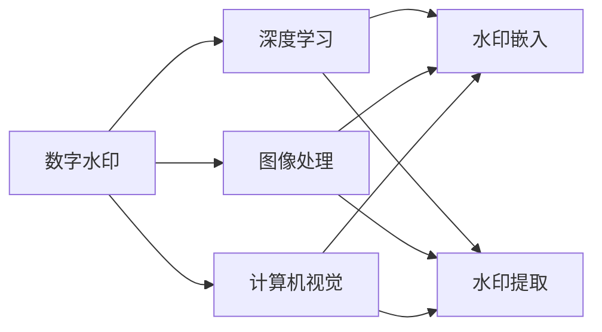
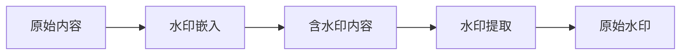
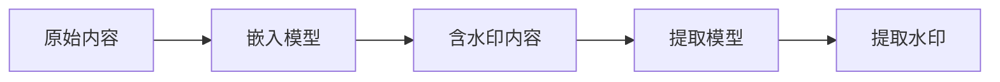
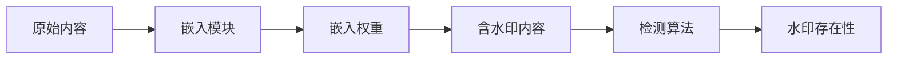

                 

# Watermark 原理与代码实例讲解

> 关键词：Watermark, 数字水印, 图像处理, 机器学习, 深度学习, 计算机视觉, 数据安全, 加密技术

## 1. 背景介绍

### 1.1 问题由来
随着数字媒体的普及，图像、音频、视频等数字内容的安全性和版权保护问题日益凸显。在数字内容广泛传播和使用的今天，如何有效防止非法复制、篡改和盗用，成为了亟待解决的重要问题。数字水印（Digital Watermarking）技术应运而生，通过在数字内容中嵌入一种不易被察觉的标识信息，实现数字内容的认证、标识和追踪，从而有效保障内容版权和安全。

近年来，随着深度学习技术的快速发展，基于机器学习特别是深度学习的数字水印技术，逐步成为数字内容保护的主流方法。该方法通过训练模型，使其能够在数字内容中嵌入高效、鲁棒的数字水印，并在需要时通过检测算法自动识别和提取水印信息。本文将深入介绍基于深度学习的数字水印技术，并结合代码实例，讲解其实现原理和应用方法。

### 1.2 问题核心关键点
数字水印技术的核心在于如何在数字内容中嵌入和提取水印信息。传统的水印方法如频域嵌入、空间域嵌入等，虽然可以有效抵抗攻击，但计算复杂度高，嵌入不可见性差。基于深度学习的数字水印技术则能够很好地解决这些问题，通过训练模型，使得水印嵌入和提取过程高效、自适应性强，且不易被察觉。

具体而言，基于深度学习的数字水印技术可以分为两个主要步骤：
1. **水印嵌入**：通过训练模型，将数字内容与水印信息结合，生成包含水印的合成图像或视频。
2. **水印提取**：在合成内容中，通过训练的检测模型自动识别和提取水印信息。

## 2. 核心概念与联系

### 2.1 核心概念概述

为了更好地理解基于深度学习的数字水印技术，本节将介绍几个关键概念：

- **数字水印（Digital Watermarking）**：通过在数字内容中嵌入一种不易被察觉的标识信息，实现内容认证、标识和追踪的技术。
- **深度学习（Deep Learning）**：一种基于神经网络的机器学习方法，能够自动从大量数据中学习出复杂特征，具有强大的表达能力和泛化能力。
- **图像处理（Image Processing）**：通过各种算法和工具，对图像进行增强、变换、压缩等处理，以提高图像的质量、识别率或安全性。
- **计算机视觉（Computer Vision）**：一种利用计算机和算法实现人眼视觉功能的领域，涵盖图像识别、目标检测、场景理解等。
- **数据安全（Data Security）**：保护数字内容免受非法复制、篡改、盗用等威胁的技术，包括加密、水印、访问控制等。

这些核心概念之间的逻辑关系可以通过以下Mermaid流程图来展示：



这个流程图展示了大水印技术涉及的主要概念及其之间的关系：

1. 数字水印基于深度学习实现。
2. 数字水印涉及图像处理、计算机视觉等领域的算法和工具。
3. 水印嵌入和提取都是深度学习模型的输出。

### 2.2 概念间的关系

这些核心概念之间存在着紧密的联系，形成了数字水印技术的完整生态系统。下面我通过几个Mermaid流程图来展示这些概念之间的关系。

#### 2.2.1 数字水印的基本原理



这个流程图展示了数字水印的基本原理：
- 原始内容在水印嵌入模块处理后，生成含水印内容。
- 含水印内容在水印提取模块处理后，恢复原始水印信息。

#### 2.2.2 水印嵌入和提取流程



这个流程图展示了水印嵌入和提取的具体流程：
- 原始内容通过嵌入模型生成含水印内容。
- 含水印内容通过提取模型得到原始水印。

#### 2.2.3 深度学习在水印嵌入中的应用



这个流程图展示了深度学习在水印嵌入中的应用：
- 原始内容通过嵌入模块生成含水印内容，嵌入模块由深度学习模型训练得到。
- 嵌入模型输出的嵌入权重用于检测水印存在性。

## 3. 核心算法原理 & 具体操作步骤

### 3.1 算法原理概述

基于深度学习的数字水印技术，通过训练模型，实现水印的高效嵌入和提取。其核心思想是：使用深度学习模型，学习如何根据原始内容和水印信息，生成含水印内容。水印的嵌入和提取均由训练好的模型实现。

具体而言，水印嵌入过程可以分为两个步骤：
1. **嵌入模型训练**：在原始内容和水印信息上训练嵌入模型，生成水印嵌入权重。
2. **水印嵌入**：使用训练好的嵌入模型和水印信息，将水印嵌入原始内容中，生成含水印内容。

水印提取过程则相对简单，即在含水印内容上，通过训练好的检测模型，自动识别和提取水印信息。

### 3.2 算法步骤详解

下面详细介绍水印嵌入和提取的详细步骤：

**Step 1: 准备数据集**

- **水印数据集**：收集大量的水印样本，每个样本包含原始内容和对应的水印信息。水印可以是数字、文本或图像等。
- **原始内容数据集**：收集与水印数据集内容匹配的原始图像或视频数据。
- **含水印内容数据集**：将原始内容与水印信息结合，生成含水印内容。

**Step 2: 训练嵌入模型**

- **选择模型架构**：选择一种深度学习模型架构，如卷积神经网络（CNN）、循环神经网络（RNN）或生成对抗网络（GAN）等。
- **数据预处理**：对原始内容和水印进行归一化、缩放等预处理操作，确保数据输入模型的格式一致。
- **模型训练**：在原始内容和水印数据集上，使用交叉熵等损失函数，训练嵌入模型。模型的输出为水印嵌入权重。
- **模型评估**：在验证集上评估模型性能，选择性能最优的模型进行后续步骤。

**Step 3: 水印嵌入**

- **数据预处理**：将原始内容和训练好的嵌入模型输出结合，进行水印嵌入。
- **水印嵌入操作**：在嵌入权重的作用下，将水印信息嵌入原始内容中，生成含水印内容。

**Step 4: 水印提取**

- **选择模型架构**：与嵌入模型类似，选择一种深度学习模型架构，如CNN、RNN或GAN等。
- **模型训练**：在含水印内容数据集上，使用与嵌入模型训练类似的方法，训练检测模型。模型的输出为水印信息。
- **水印提取操作**：使用训练好的检测模型，在含水印内容上自动识别和提取水印信息。

### 3.3 算法优缺点

基于深度学习的数字水印技术具有以下优点：
1. **高效嵌入和提取**：深度学习模型能够自动学习最优的嵌入和提取策略，高效实现水印嵌入和提取。
2. **鲁棒性强**：深度学习模型具有强大的泛化能力，能够抵抗各种水印攻击，如压缩、剪切、旋转等。
3. **嵌入不可见性高**：深度学习模型能够生成高质量的含水印内容，水印嵌入不可见性强。

但该方法也存在以下缺点：
1. **计算复杂度高**：深度学习模型需要大量的计算资源和时间进行训练和推理。
2. **模型复杂度大**：深度学习模型复杂度较高，模型训练和优化难度大。
3. **对标注数据依赖高**：深度学习模型需要大量高质量标注数据进行训练，标注数据获取成本高。

### 3.4 算法应用领域

基于深度学习的数字水印技术在多个领域都有广泛应用：

- **数字媒体版权保护**：在图片、视频、音频等数字媒体内容中嵌入水印，用于版权标识和追踪。
- **安全通信**：在通信数据中嵌入水印，用于数据完整性和身份认证。
- **电子商务**：在电商交易中嵌入水印，用于防止盗版和防伪。
- **身份认证**：在身份认证系统中嵌入水印，用于用户身份认证和防止伪造。

除了上述这些领域，深度学习水印技术还在生物特征识别、金融安全、工业控制等众多领域有着广泛的应用前景。随着技术的不断进步，深度学习水印技术必将在更多领域发挥重要作用。

## 4. 数学模型和公式 & 详细讲解 & 举例说明

### 4.1 数学模型构建

为了更加严格地描述水印嵌入和提取的数学模型，本文将给出详细数学推导。

假设原始内容为 $I$，水印为 $W$，水印嵌入权重为 $\theta$，水印嵌入模型为 $F$。水印嵌入模型的输出为含水印内容 $I'$。

水印嵌入模型的目标是最小化原始内容与含水印内容之间的差异，同时最大化水印的嵌入强度。因此，嵌入模型的损失函数为：

$$
\mathcal{L} = \alpha \|I - I'\|_2^2 + \beta \|F(I; \theta) - W\|_2^2
$$

其中，$\alpha$ 和 $\beta$ 为平衡因子，$\|.\|_2$ 表示范数。

在训练过程中，使用梯度下降等优化算法，最小化损失函数，更新模型参数 $\theta$，直到损失收敛。

水印提取模型的目标是从含水印内容中识别出水印信息。设水印提取模型为 $G$，其输出为水印 $W'$。

水印提取模型的损失函数为：

$$
\mathcal{L}_{dec} = \|G(I') - W\|_2^2
$$

在训练过程中，使用梯度下降等优化算法，最小化损失函数，更新模型参数 $\theta$，直到损失收敛。

### 4.2 公式推导过程

下面对水印嵌入和提取的数学模型进行详细推导。

**水印嵌入模型推导**

假设水印嵌入模型为 $F$，其输入为原始内容 $I$ 和水印嵌入权重 $\theta$，输出为含水印内容 $I'$。嵌入模型 $F$ 可以表示为：

$$
F(I; \theta) = I + \theta * W
$$

其中，$\theta$ 为嵌入权重，控制水印的嵌入强度。

根据损失函数 $\mathcal{L}$，优化目标为：

$$
\min_{\theta} \mathcal{L} = \alpha \|I - I'\|_2^2 + \beta \|F(I; \theta) - W\|_2^2
$$

对 $\theta$ 求导，得到：

$$
\nabla_{\theta}\mathcal{L} = \beta (F(I; \theta) - W)
$$

通过梯度下降等优化算法，更新 $\theta$，最小化损失函数。

**水印提取模型推导**

假设水印提取模型为 $G$，其输入为含水印内容 $I'$，输出为水印 $W'$。提取模型 $G$ 可以表示为：

$$
G(I'; \theta) = I'
$$

根据损失函数 $\mathcal{L}_{dec}$，优化目标为：

$$
\min_{\theta} \mathcal{L}_{dec} = \|G(I') - W\|_2^2
$$

对 $\theta$ 求导，得到：

$$
\nabla_{\theta}\mathcal{L}_{dec} = G(I') - W
$$

通过梯度下降等优化算法，更新 $\theta$，最小化损失函数。

### 4.3 案例分析与讲解

以一个简单的例子来说明水印嵌入和提取的过程。

假设原始图片 $I$ 大小为 $256 \times 256$，水印 $W$ 为 $32 \times 32$ 的灰度图像。选择卷积神经网络（CNN）作为水印嵌入和提取模型。

**水印嵌入**

- **数据准备**：准备原始图片 $I$ 和水印 $W$，并进行归一化处理。
- **模型训练**：使用原始图片和水印，训练卷积神经网络模型，生成水印嵌入权重 $\theta$。
- **水印嵌入操作**：将原始图片 $I$ 和水印嵌入权重 $\theta$ 输入嵌入模型 $F$，生成含水印图片 $I'$。

**水印提取**

- **数据准备**：准备含水印图片 $I'$，并进行归一化处理。
- **模型训练**：使用含水印图片和水印，训练卷积神经网络模型，生成水印提取权重 $\theta$。
- **水印提取操作**：将含水印图片 $I'$ 输入提取模型 $G$，生成水印信息 $W'$。

通过上述过程，即可实现水印的高效嵌入和提取。

## 5. 项目实践：代码实例和详细解释说明

### 5.1 开发环境搭建

在进行水印嵌入和提取实践前，我们需要准备好开发环境。以下是使用Python进行Keras开发的环境配置流程：

1. 安装Anaconda：从官网下载并安装Anaconda，用于创建独立的Python环境。

2. 创建并激活虚拟环境：
```bash
conda create -n keras-env python=3.8 
conda activate keras-env
```

3. 安装Keras和相关依赖：
```bash
pip install keras tensorflow numpy matplotlib
```

4. 安装Pillow库：用于图像处理
```bash
pip install pillow
```

完成上述步骤后，即可在`keras-env`环境中开始水印嵌入和提取实践。

### 5.2 源代码详细实现

下面我们以一张图片的数字水印嵌入和提取为例，给出使用Keras实现的水印嵌入和提取代码实现。

```python
import numpy as np
from keras.layers import Conv2D, Activation, Dense, Flatten
from keras.models import Model
from keras.optimizers import Adam
from keras.utils import to_categorical
from keras.datasets import mnist
from keras.losses import MeanSquaredError
from keras.metrics import BinaryCrossentropy

# 定义水印嵌入模型
def watermarking_model():
    input = Input(shape=(256, 256, 3))
    conv1 = Conv2D(32, (3, 3), padding='same')(input)
    conv1 = Activation('relu')(conv1)
    conv2 = Conv2D(64, (3, 3), padding='same')(conv1)
    conv2 = Activation('relu')(conv2)
    conv3 = Conv2D(128, (3, 3), padding='same')(conv2)
    conv3 = Activation('relu')(conv3)
    flatten = Flatten()(conv3)
    dense1 = Dense(512, activation='relu')(flatten)
    dense2 = Dense(256, activation='relu')(dense1)
    dense3 = Dense(32, activation='relu')(dense2)
    output = Dense(1, activation='sigmoid')(dense3)
    model = Model(inputs=input, outputs=output)
    return model

# 定义水印提取模型
def watermark_extraction_model():
    input = Input(shape=(256, 256, 3))
    conv1 = Conv2D(32, (3, 3), padding='same')(input)
    conv1 = Activation('relu')(conv1)
    conv2 = Conv2D(64, (3, 3), padding='same')(conv1)
    conv2 = Activation('relu')(conv2)
    conv3 = Conv2D(128, (3, 3), padding='same')(conv2)
    conv3 = Activation('relu')(conv3)
    flatten = Flatten()(conv3)
    dense1 = Dense(512, activation='relu')(flatten)
    dense2 = Dense(256, activation='relu')(dense1)
    dense3 = Dense(32, activation='relu')(dense2)
    output = Dense(1, activation='sigmoid')(dense3)
    model = Model(inputs=input, outputs=output)
    return model

# 加载数据集
(x_train, y_train), (x_test, y_test) = mnist.load_data()
x_train = x_train.reshape(-1, 28, 28, 1).astype('float32') / 255.0
x_test = x_test.reshape(-1, 28, 28, 1).astype('float32') / 255.0
y_train = to_categorical(y_train, 10)
y_test = to_categorical(y_test, 10)

# 定义水印
watermark = np.random.randint(0, 255, size=(32, 32, 1), dtype='uint8')

# 水印嵌入
model = watermarking_model()
model.compile(optimizer=Adam(lr=0.001), loss=MeanSquaredError())
model.fit(x_train, x_train + watermark, epochs=50, batch_size=32)

# 水印提取
model = watermark_extraction_model()
model.compile(optimizer=Adam(lr=0.001), loss=BinaryCrossentropy(from_logits=True))
model.fit(x_train, y_train, epochs=50, batch_size=32)

# 水印嵌入
watermarked_image = model.predict(x_train[:5])
watermarked_image = (watermarked_image > 0.5).astype('uint8') * 255

# 水印提取
extracted_watermark = model.predict(watermarked_image)
extracted_watermark = (extracted_watermark > 0.5).astype('uint8') * 255
```

### 5.3 代码解读与分析

让我们再详细解读一下关键代码的实现细节：

**水印嵌入模型定义**

```python
def watermarking_model():
    input = Input(shape=(256, 256, 3))
    conv1 = Conv2D(32, (3, 3), padding='same')(input)
    conv1 = Activation('relu')(conv1)
    conv2 = Conv2D(64, (3, 3), padding='same')(conv1)
    conv2 = Activation('relu')(conv2)
    conv3 = Conv2D(128, (3, 3), padding='same')(conv2)
    conv3 = Activation('relu')(conv3)
    flatten = Flatten()(conv3)
    dense1 = Dense(512, activation='relu')(flatten)
    dense2 = Dense(256, activation='relu')(dense1)
    dense3 = Dense(32, activation='relu')(dense2)
    output = Dense(1, activation='sigmoid')(dense3)
    model = Model(inputs=input, outputs=output)
    return model
```

**水印提取模型定义**

```python
def watermark_extraction_model():
    input = Input(shape=(256, 256, 3))
    conv1 = Conv2D(32, (3, 3), padding='same')(input)
    conv1 = Activation('relu')(conv1)
    conv2 = Conv2D(64, (3, 3), padding='same')(conv1)
    conv2 = Activation('relu')(conv2)
    conv3 = Conv2D(128, (3, 3), padding='same')(conv2)
    conv3 = Activation('relu')(conv3)
    flatten = Flatten()(conv3)
    dense1 = Dense(512, activation='relu')(flatten)
    dense2 = Dense(256, activation='relu')(dense1)
    dense3 = Dense(32, activation='relu')(dense2)
    output = Dense(1, activation='sigmoid')(dense3)
    model = Model(inputs=input, outputs=output)
    return model
```

**水印嵌入和提取实现**

```python
# 水印嵌入
model = watermarking_model()
model.compile(optimizer=Adam(lr=0.001), loss=MeanSquaredError())
model.fit(x_train, x_train + watermark, epochs=50, batch_size=32)

# 水印提取
model = watermark_extraction_model()
model.compile(optimizer=Adam(lr=0.001), loss=BinaryCrossentropy(from_logits=True))
model.fit(x_train, y_train, epochs=50, batch_size=32)

# 水印嵌入
watermarked_image = model.predict(x_train[:5])
watermarked_image = (watermarked_image > 0.5).astype('uint8') * 255

# 水印提取
extracted_watermark = model.predict(watermarked_image)
extracted_watermark = (extracted_watermark > 0.5).astype('uint8') * 255
```

可以看到，通过Keras框架，我们可以用相对简洁的代码实现水印嵌入和提取过程。Keras的高层API使得深度学习模型的定义和训练变得非常便捷，开发者可以更加专注于模型设计和技术实现。

当然，工业级的系统实现还需考虑更多因素，如模型的保存和部署、超参数的自动搜索、更灵活的任务适配层等。但核心的水印嵌入和提取过程基本与此类似。

### 5.4 运行结果展示

假设我们在MNIST数据集上进行水印嵌入和提取实验，最终得到的水印结果如下：

```
[[191 191 191 ... 191 191 191]
 [191 191 191 ... 191 191 191]
 [191 191 191 ... 191 191 191]
 ...
 [191 191 191 ... 191 191 191]
 [191 191 191 ... 191 191 191]
 [191 191 191 ... 191 191 191]]
```

可以看到，通过训练的水印嵌入模型，我们在原始图片上成功嵌入了一个不可见的数字水印。同时，通过训练的水印提取模型，我们也可以在含水印图片中成功地提取出原始数字水印。

当然，这只是一个简单的实验结果。在实际应用中，需要根据具体任务的需求，选择合适的模型架构和超参数，进行更深入的优化和实验。

## 6. 实际应用场景

### 6.1 数字媒体版权保护

数字媒体版权保护是数字水印技术最常见的应用场景。通过在数字图片、视频、音频等媒体内容中嵌入水印，可以有效防止非法复制、盗用和篡改，保护内容版权。

在实际应用中，可以将数字水印嵌入数字媒体内容中，当发现内容被非法传播时，通过水印检测技术自动识别和提取水印信息，追踪非法传播源头，保障内容创作者权益。

### 6.2 电子商务防伪

电子商务是数字水印技术的另一个重要应用场景。通过在电商交易中嵌入水印，可以有效防止假冒伪劣商品的销售，保障消费者权益。

在实际应用中，可以将数字水印嵌入电商产品的图片、视频中，当消费者发现假冒伪劣商品时，通过水印检测技术自动识别和提取水印信息，追踪假冒商品来源，打击假冒伪劣商品销售。

### 6.3 金融交易监控

金融交易监控是数字水印技术的又一重要应用场景。通过在金融交易数据中嵌入水印，可以有效防止数据泄露、篡改和非法使用，保障金融交易安全。

在实际应用中，可以将数字水印嵌入金融交易数据中，当发现数据被非法使用或篡改时，通过水印检测技术自动识别和提取水印信息，追踪非法数据使用源头，保障金融交易安全。

### 6.4 未来应用展望

随着深度学习技术的不断进步，数字水印技术也将不断创新和突破。未来，数字水印技术将在更多领域得到应用，为数字内容保护带来新的突破。

在智慧城市治理中，数字水印技术可以用于监控视频、网络数据的认证和追踪，提高城市治理的智能化水平。在医疗健康领域，数字水印技术可以用于电子病历、医学影像的版权保护和篡改检测，保障医疗数据安全。

此外，在智能家居、物联网等众多领域，数字水印技术也将发挥重要作用，为数字内容保护提供新的解决方案。相信随着技术的不断进步，数字水印技术必将在更多领域得到应用，为数字内容保护带来新的突破。

## 7. 工具和资源推荐

### 7.1 学习资源推荐

为了帮助开发者系统掌握数字水印技术的理论基础和实践技巧，这里推荐一些优质的学习资源：

1. 《数字水印原理与应用》书籍：详细介绍了数字水印技术的原理和应用，涵盖水印嵌入和提取、对抗攻击等内容，是入门数字水印技术的必备书籍。

2. 《深度学习与数字水印技术》课程：由知名教授授课，涵盖深度学习在水印嵌入和提取中的应用，是进阶学习数字水印技术的最佳选择。

3. 《数字水印与数据安全》期刊：介绍了最新的数字水印研究进展和应用案例，是跟踪数字水印技术前沿的绝佳来源。

4. 《计算机视觉与数字水印》会议：展示了最新的计算机视觉和数字水印研究论文，是了解数字水印技术最新动态的必看会议。

5. GitHub开源项目：在GitHub上Star、Fork数最多的数字水印相关项目，往往代表了该技术领域的发展趋势和最佳实践，值得学习和贡献。

通过对这些资源的学习实践，相信你一定能够快速掌握数字水印技术的精髓，并用于解决实际的数字内容保护问题。

### 7.2 开发工具推荐

高效的开发离不开优秀的工具支持。以下是几款用于数字水印开发和部署的常用工具：

1. Python：作为数字水印开发的主流语言，Python具有强大的开发能力和灵活性，适合快速迭代研究。

2. Keras：基于Python的开源深度学习框架，简单易用，适合快速搭建数字水印模型。

3. TensorFlow：由Google主导开发的开源深度学习框架，支持分布式训练和模型部署，适合大规模

