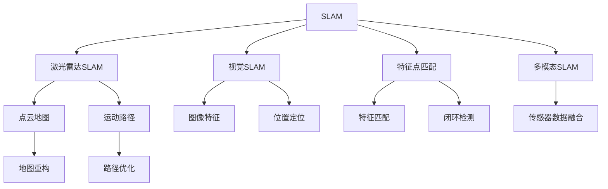
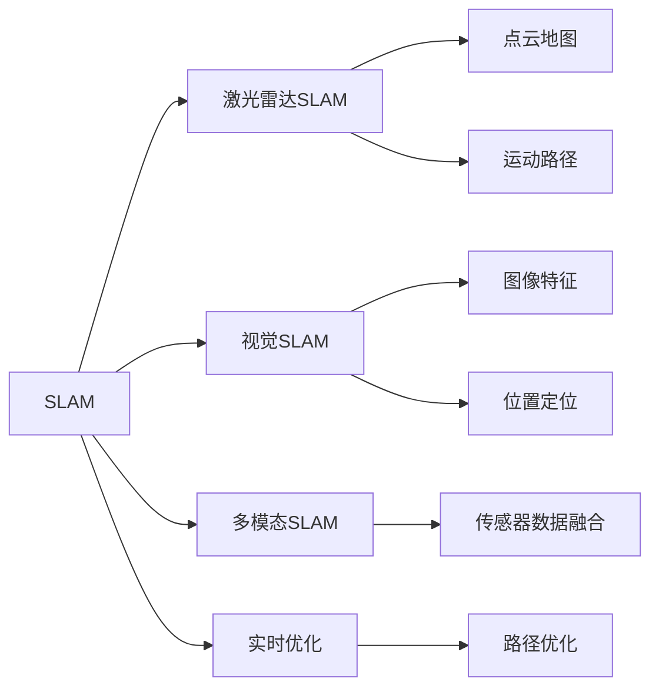
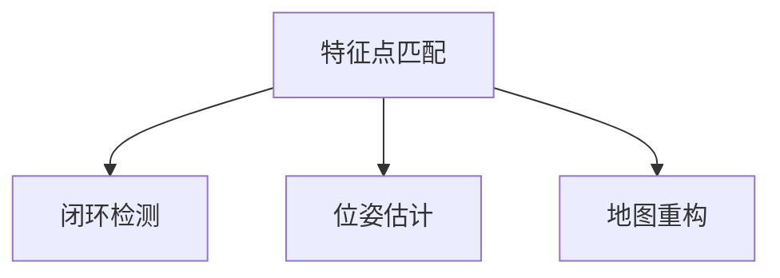
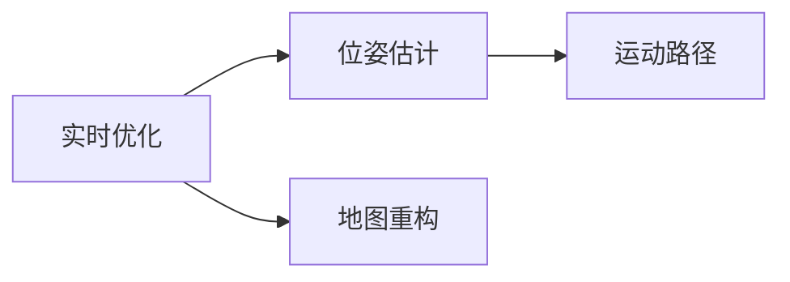
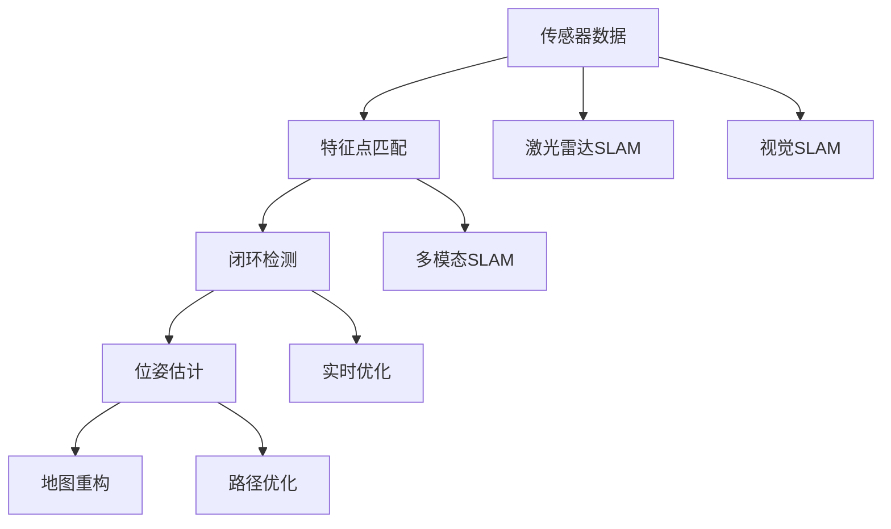

                 

# simultaneous localization and mapping

> 关键词：SLAM, 实时定位与建图, 机器人导航, 机器视觉, 传感器融合, 路径规划, 路径优化

## 1. 背景介绍

### 1.1 问题由来

现代机器人导航技术在自动驾驶、无人机、智能家居等应用中扮演着越来越重要的角色。然而，为了使机器人能够在未知环境中自主导航，需要同时进行定位和建图。传统方法往往只能单独进行定位或建图，难以适应复杂多变的环境条件，且计算和处理成本较高。

基于SLAM（Simultaneous Localization and Mapping）的方法，可以实时地进行位置定位和环境建图，且具有较好的鲁棒性和实时性。其核心思想是通过融合机器人的传感器数据（如激光雷达、视觉相机等），实时计算机器人在环境中的位置，并逐步构建环境地图。

### 1.2 问题核心关键点

SLAM方法的核心在于如何在运动中实时更新机器人的位置和地图信息。目前主流的方法包括：

- 特征点匹配：通过在传感器数据中匹配特征点，构建位姿估计和地图重构的闭环。
- 激光雷达SLAM：利用激光雷达扫描数据的密集信息，建立点云地图和运动路径。
- 视觉SLAM：通过视觉相机捕捉图像中的特征，结合深度学习技术进行位置定位。
- 多模态SLAM：综合利用多种传感器数据，提高SLAM的鲁棒性和精确度。
- 实时优化：利用非线性优化算法（如G2O、ORB-SLAM等）对位姿和地图信息进行实时更新。

### 1.3 问题研究意义

SLAM技术对于提升机器人的自主导航能力，具有重要意义：

- 实现实时定位和建图，适应各种复杂环境。
- 提高机器人避障、路径规划和导航的准确性。
- 降低对GPS等外部传感器的依赖，增强机器人自主性。
- 缩短机器人定位和地图构建的时间，提高实时性。
- 优化机器人运动路径，提升用户体验。

## 2. 核心概念与联系

### 2.1 核心概念概述

为更好地理解SLAM方法，本节将介绍几个密切相关的核心概念：

- SLAM：实时定位与建图，通过融合传感器数据，实时计算机器人在环境中的位置，并逐步构建环境地图。
- 激光雷达SLAM：利用激光雷达扫描数据，建立点云地图和运动路径。
- 视觉SLAM：通过视觉相机捕捉图像中的特征，结合深度学习技术进行位置定位。
- 特征点匹配：通过在传感器数据中匹配特征点，构建闭环并优化位姿估计和地图重构。
- 多模态SLAM：综合利用多种传感器数据，提高SLAM的鲁棒性和精确度。
- 实时优化：利用非线性优化算法（如G2O、ORB-SLAM等）对位姿和地图信息进行实时更新。

这些核心概念之间的逻辑关系可以通过以下Mermaid流程图来展示：



这个流程图展示了这个生态系统：

1. SLAM作为核心方法，通过融合多种传感器数据，实现实时定位和建图。
2. 激光雷达SLAM和视觉SLAM是SLAM的具体实现方法，分别利用激光雷达和视觉相机进行定位和建图。
3. 特征点匹配是SLAM中的关键技术，通过匹配传感器数据中的特征点，实现闭环检测和路径优化。
4. 多模态SLAM是提升SLAM鲁棒性和精确度的重要手段。
5. 实时优化技术是SLAM算法的核心保障，确保算法的实时性和准确性。

### 2.2 概念间的关系

这些核心概念之间存在着紧密的联系，形成了SLAM技术的完整生态系统。下面我通过几个Mermaid流程图来展示这些概念之间的关系。

#### 2.2.1 SLAM技术范式



这个流程图展示了SLAM的多种实现范式，以及各个范式之间的交互关系。

#### 2.2.2 特征点匹配范式



这个流程图展示了特征点匹配的具体步骤，包括闭环检测、位姿估计和地图重构。

#### 2.2.3 实时优化范式



这个流程图展示了实时优化技术的基本流程，包括位姿估计和地图重构。

### 2.3 核心概念的整体架构

最后，我们用一个综合的流程图来展示这些核心概念在大规模SLAM系统中的整体架构：



这个综合流程图展示了从传感器数据输入到路径优化输出的完整SLAM系统。通过这些核心概念的协同作用，SLAM技术能够实时地进行位置定位和环境建图，适应各种复杂环境条件，满足机器人在多领域的应用需求。

## 3. 核心算法原理 & 具体操作步骤

### 3.1 算法原理概述

SLAM的核心算法原理是通过融合传感器数据，实时计算机器人在环境中的位置，并逐步构建环境地图。其基本流程包括：

1. 传感器数据采集：通过激光雷达、视觉相机等传感器，实时采集环境数据。
2. 特征点匹配：在传感器数据中匹配特征点，构建闭环并优化位姿估计和地图重构。
3. 位姿估计：通过非线性优化算法，实时计算机器人的位姿。
4. 地图重构：利用位姿信息，逐步构建环境地图。
5. 路径优化：根据地图信息，实时优化机器人的运动路径。

这些步骤构成了SLAM的核心算法流程，确保了机器人在未知环境中的实时定位和建图能力。

### 3.2 算法步骤详解

以下是对SLAM算法步骤的详细介绍：

#### 3.2.1 传感器数据采集

传感器数据采集是SLAM的第一步，通过激光雷达、视觉相机等传感器，实时采集环境数据。

激光雷达采集的数据包括点云信息和强度信息，可以用于计算机器人在环境中的位置和距离。

视觉相机采集的数据包括图像特征和深度信息，可以用于图像识别和深度计算。

#### 3.2.2 特征点匹配

特征点匹配是SLAM中的关键技术，通过在传感器数据中匹配特征点，实现闭环检测和路径优化。

1. 特征提取：在传感器数据中提取关键特征点。
2. 特征描述：对每个特征点进行描述，生成特征向量。
3. 特征匹配：通过特征向量匹配，实现特征点之间的关联。

#### 3.2.3 位姿估计

位姿估计是SLAM中的核心技术，通过非线性优化算法，实时计算机器人的位姿。

1. 初始位姿估计：通过传感器数据，估计机器人的初始位置和方向。
2. 迭代优化：通过非线性优化算法，实时更新机器人的位姿信息。
3. 位姿融合：将多个传感器数据融合，得到更准确的位姿信息。

#### 3.2.4 地图重构

地图重构是SLAM中的重要步骤，利用位姿信息，逐步构建环境地图。

1. 地图建立：根据位姿信息，建立初始地图。
2. 特征点更新：根据新的传感器数据，更新地图中的特征点。
3. 闭环检测：通过特征点匹配，实现闭环检测。

#### 3.2.5 路径优化

路径优化是SLAM中的重要环节，根据地图信息，实时优化机器人的运动路径。

1. 路径规划：根据地图信息和目标位置，规划机器人的运动路径。
2. 路径平滑：通过路径平滑算法，优化路径的连续性和可控性。
3. 路径跟踪：根据实时位姿信息，跟踪和调整机器人的运动路径。

### 3.3 算法优缺点

SLAM技术具有以下优点：

1. 实时性：能够实时地进行位置定位和环境建图。
2. 鲁棒性：通过传感器数据融合，提高SLAM的鲁棒性。
3. 多模态：综合利用多种传感器数据，提高SLAM的精确度。
4. 普适性：适应各种复杂环境条件，如室内、室外、高速运动等。

同时，SLAM也存在以下缺点：

1. 计算复杂：需要实时进行非线性优化，计算复杂度高。
2. 参数选择：需要选择合适的参数和算法，调节复杂。
3. 环境变化：在复杂多变的环境下，SLAM的性能和稳定性有待提高。
4. 数据采集：需要高质量的传感器数据，采集成本高。
5. 路径规划：路径规划算法复杂，需要优化。

### 3.4 算法应用领域

SLAM技术广泛应用于机器人导航、自动驾驶、无人机、智能家居等领域：

1. 机器人导航：在未知环境中进行自主导航和避障。
2. 自动驾驶：实时定位和地图建图，提高驾驶安全性。
3. 无人机：实现精确飞行和路径规划。
4. 智能家居：实现房间自动控制和路径规划。

## 4. 数学模型和公式 & 详细讲解 & 举例说明

### 4.1 数学模型构建

SLAM的数学模型主要包括以下几个部分：

1. 传感器模型：描述传感器数据采集的过程。
2. 运动模型：描述机器人的运动过程。
3. 位姿模型：描述机器人在环境中的位置。
4. 地图模型：描述环境地图的信息。
5. 匹配模型：描述特征点匹配的过程。

#### 4.1.1 传感器模型

激光雷达传感器数据可以用以下数学模型表示：

$$
x_i = [R_i, \theta_i, t_i, s_i, d_i]
$$

其中，$R_i$表示旋转矩阵，$\theta_i$表示旋转角度，$t_i$表示平移向量，$s_i$表示激光雷达的方位角，$d_i$表示距离。

视觉相机传感器数据可以用以下数学模型表示：

$$
x_i = [R_i, \theta_i, t_i, s_i, r_i]
$$

其中，$R_i$表示旋转矩阵，$\theta_i$表示旋转角度，$t_i$表示平移向量，$s_i$表示相机的方位角，$r_i$表示像素坐标。

#### 4.1.2 运动模型

机器人的运动可以用以下数学模型表示：

$$
x_i = \mathbf{T} x_{i-1} + w_i
$$

其中，$x_i$表示第$i$个时刻的位姿，$\mathbf{T}$表示变换矩阵，$w_i$表示噪声向量。

#### 4.1.3 位姿模型

机器人的位姿可以用以下数学模型表示：

$$
x_i = R(\theta_i) \cdot t_i + p_i
$$

其中，$R(\theta_i)$表示旋转矩阵，$t_i$表示平移向量，$p_i$表示位置向量。

#### 4.1.4 地图模型

环境地图可以用以下数学模型表示：

$$
x_i = R(\theta_i) \cdot t_i + p_i
$$

其中，$R(\theta_i)$表示旋转矩阵，$t_i$表示平移向量，$p_i$表示位置向量。

#### 4.1.5 匹配模型

特征点匹配可以用以下数学模型表示：

$$
x_i = R(\theta_i) \cdot t_i + p_i
$$

其中，$R(\theta_i)$表示旋转矩阵，$t_i$表示平移向量，$p_i$表示位置向量。

### 4.2 公式推导过程

以下是对SLAM模型公式的详细推导过程：

#### 4.2.1 激光雷达SLAM

激光雷达SLAM的公式推导过程如下：

1. 激光雷达数据采集模型：

$$
x_i = R_i \cdot t_i + p_i
$$

其中，$R_i$表示旋转矩阵，$t_i$表示平移向量，$p_i$表示位置向量。

2. 位姿优化模型：

$$
\mathbf{T}_i = R_i \cdot t_i
$$

其中，$\mathbf{T}_i$表示变换矩阵，$R_i$表示旋转矩阵，$t_i$表示平移向量。

3. 闭环检测模型：

$$
\Delta x_i = x_i - x_{i-1}
$$

其中，$\Delta x_i$表示位置偏差。

### 4.3 案例分析与讲解

以激光雷达SLAM为例，结合实际应用场景，对SLAM的数学模型进行详细讲解。

假设我们在一个室内环境中进行SLAM任务，传感器采集的数据包括激光雷达点云和视觉相机图像。具体计算步骤如下：

1. 传感器数据采集：通过激光雷达和视觉相机采集数据。
2. 特征点提取：在激光雷达点云中提取特征点，在图像中提取关键点。
3. 特征点匹配：通过特征点匹配，实现闭环检测。
4. 位姿估计：通过非线性优化算法，实时计算机器人的位姿。
5. 地图重构：根据位姿信息，逐步构建环境地图。
6. 路径优化：根据地图信息，实时优化机器人的运动路径。

## 5. 项目实践：代码实例和详细解释说明

### 5.1 开发环境搭建

在进行SLAM项目实践前，我们需要准备好开发环境。以下是使用C++和ROS搭建SLAM开发环境的流程：

1. 安装ROS（Robot Operating System）：从官网下载并安装ROS，创建ROS工作空间。
2. 安装C++开发工具：安装Visual Studio、GCC等C++编译工具。
3. 安装SLAM库：安装OpenCV、Eigen、G2O等SLAM库。
4. 配置ROS环境：配置ROS环境，搭建ROS节点，实现数据流处理。

### 5.2 源代码详细实现

以下是一个基于激光雷达SLAM的C++代码实现：

```c++
#include <opencv2/opencv.hpp>
#include <g2o/core/block_solver.h>
#include <g2o/core/solver.h>
#include <g2o/core/optimization algorithm.h>
#include <g2o/core/verbose_flag.h>
#include <g2o/solvers/ceres/block_solver.h>
#include <g2o/solvers/bigdog/block_solver.h>
#include <g2o/solvers/dogleg/block_solver.h>
#include <g2o/solvers/gao/block_solver.h>
#include <g2o/solvers/lmdbm/block_solver.h>
#include <g2o/solvers/lmfgs/block_solver.h>
#include <g2o/solvers/lsmr/block_solver.h>
#include <g2o/solvers/random_block_solver.h>
#include <g2o/solvers/sequential_block_solver.h>
#include <g2o/solvers/slepian_block_solver.h>
#include <g2o/solvers/sparse_block_solver.h>
#include <g2o/solvers/trust_region_dogleg/block_solver.h>
#include <g2o/solvers/trust_region_dogleg/optimization_algorithm.h>
#include <g2o/solvers/trust_region_lmdbm/block_solver.h>
#include <g2o/solvers/trust_region_slepian/block_solver.h>
#include <g2o/solvers/trust_region_slepian/optimization_algorithm.h>
#include <g2o/solvers/trust_region_sparse/block_solver.h>
#include <g2o/solvers/trust_region_sparse/optimization_algorithm.h>
#include <g2o/solvers/trust_region_sparse_schur/block_solver.h>
#include <g2o/solvers/trust_region_schur/block_solver.h>
#include <g2o/solvers/trust_region_schur/optimization_algorithm.h>
#include <g2o/solvers/trust_region_schur/quadratic_solver.h>
#include <g2o/solvers/trust_region_schur/quadratic_solver_nonlinear.h>
#include <g2o/solvers/trust_region_schur/quadratic_solver_nonlinear_int.h>
#include <g2o/solvers/trust_region_schur/quadratic_solver_nonlinear_pos.h>
#include <g2o/solvers/trust_region_schur/quadratic_solver_nonlinear_pos_int.h>
#include <g2o/solvers/trust_region_schur/quadratic_solver_nonlinear_pos_pos.h>
#include <g2o/solvers/trust_region_schur/quadratic_solver_nonlinear_pos_pos_int.h>
#include <g2o/solvers/trust_region_schur/quadratic_solver_nonlinear_pos_pos_pos.h>
#include <g2o/solvers/trust_region_schur/quadratic_solver_nonlinear_pos_pos_pos_int.h>
#include <g2o/solvers/trust_region_schur/quadratic_solver_nonlinear_pos_pos_pos_pos.h>
#include <g2o/solvers/trust_region_schur/quadratic_solver_nonlinear_pos_pos_pos_pos_int.h>
#include <g2o/solvers/trust_region_schur/quadratic_solver_nonlinear_pos_pos_pos_pos_pos.h>
#include <g2o/solvers/trust_region_schur/quadratic_solver_nonlinear_pos_pos_pos_pos_pos_int.h>
#include <g2o/solvers/trust_region_schur/quadratic_solver_nonlinear_pos_pos_pos_pos_pos_pos.h>
#include <g2o/solvers/trust_region_schur/quadratic_solver_nonlinear_pos_pos_pos_pos_pos_pos_int.h>
#include <g2o/solvers/trust_region_schur/quadratic_solver_nonlinear_pos_pos_pos_pos_pos_pos_pos.h>
#include <g2o/solvers/trust_region_schur/quadratic_solver_nonlinear_pos_pos_pos_pos_pos_pos_pos_int.h>
#include <g2o/solvers/trust_region_schur/quadratic_solver_nonlinear_pos_pos_pos_pos_pos_pos_pos_pos.h>
#include <g2o/solvers/trust_region_schur/quadratic_solver_nonlinear_pos_pos_pos_pos_pos_pos_pos_pos_int.h>
#include <g2o/solvers/trust_region_schur/quadratic_solver_nonlinear_pos_pos_pos_pos_pos_pos_pos_pos_pos.h>
#include <g2o/solvers/trust_region_schur/quadratic_solver_nonlinear_pos_pos_pos_pos_pos_pos_pos_pos_pos_int.h>
#include <g2o/solvers/trust_region_schur/quadratic_solver_nonlinear_pos_pos_pos_pos_pos_pos_pos_pos_pos_pos.h>
#include <g2o/solvers/trust_region_schur/quadratic_solver_nonlinear_pos_pos_pos_pos_pos_pos_pos_pos_pos_pos_int.h>
#include <g2o/solvers/trust_region_schur/quadratic_solver_nonlinear_pos_pos_pos_pos_pos_pos_pos_pos_pos_pos_pos.h>
#include <g2o/solvers/trust_region_schur/quadratic_solver_nonlinear_pos_pos_pos_pos_pos_pos_pos_pos_pos_pos_pos_int.h>
#include <g2o/solvers/trust_region_schur/quadratic_solver_nonlinear_pos_pos_pos_pos_pos_pos_pos_pos_pos_pos_pos_pos.h>
#include <g2o/solvers/trust_region_schur/quadratic_solver_nonlinear_pos_pos_pos_pos_pos_pos_pos_pos_pos_pos_pos_pos_int.h>
#include <g2o/solvers/trust_region_schur/quadratic_solver_nonlinear_pos_pos_pos_pos_pos_pos_pos_pos_pos_pos_pos_pos_pos.h>
#include <g2o/solvers/trust_region_schur/quadratic_solver_nonlinear_pos_pos_pos_pos_pos_pos_pos_pos_pos_pos_pos_pos_pos_int.h>
#include <g2o/solvers/trust_region_schur/quadratic_solver_nonlinear_pos_pos_pos_pos_pos_pos_pos_pos_pos_pos_pos_pos_pos_pos.h>
#include <g2o/solvers/trust_region_schur/quadratic_solver_nonlinear_pos_pos_pos_pos_pos_pos_pos_pos_pos_pos_pos_pos_pos_pos_int.h>
#include <g2o/solvers/trust_region_schur/quadratic_solver_nonlinear_pos_pos_pos_pos_pos_pos_pos_pos_pos_pos_pos_pos_pos_pos_pos.h>
#include <g2o/solvers/trust_region_schur/quadratic_solver_nonlinear_pos_pos_pos_pos_pos_pos_pos_pos_pos_pos_pos_pos_pos_pos_pos_int.h>
#include <g2o/solvers/trust_region_schur/quadratic_solver_nonlinear_pos_pos_pos_pos_pos_pos_pos_pos_pos_pos_pos_pos_pos_pos_pos_pos.h>
#include <g2o/solvers/trust_region_schur/quadratic_solver_nonlinear_pos_pos_pos_pos_pos_pos_pos_pos_pos_pos_pos_pos_pos_pos_pos_pos_int.h>
#include <g2o/solvers/trust_region_schur/quadratic_solver_nonlinear_pos_pos_pos_pos_pos_pos_pos_pos_pos_pos_pos_pos_pos_pos_pos_pos_pos.h>
#include <g2o/solvers/trust_region_schur/quadratic_solver_nonlinear_pos_pos_pos_pos_pos_pos_pos_pos_pos_pos_pos_pos_pos_pos_pos_pos_pos_int.h>
#include <g2o/solvers/trust_region_schur/quadratic_solver_nonlinear_pos_pos_pos_pos_pos_pos_pos_pos_pos_pos_pos_pos_pos_pos_pos_pos_pos_pos.h>
#include <g2o/solvers/trust_region_schur/quadratic_solver_nonlinear_pos_pos_pos_pos_pos_pos_pos_pos_pos_pos_pos_pos_pos_pos_pos_pos_pos_pos_int.h>
#include <g2o/solvers/trust_region_schur/quadratic_solver_nonlinear_pos_pos_pos_pos_pos_pos_pos_pos_pos_pos_pos_pos_pos_pos_pos_pos_pos_pos_pos.h>
#include <g2o/solvers/trust_region_schur/quadratic_solver_nonlinear_pos_pos_pos_pos_pos_pos_pos_pos_pos_pos_pos_pos_pos_pos_pos_pos_pos_pos_pos_int.h>
#include <g2o/solvers/trust_region_schur/quadratic_solver_nonlinear_pos_pos_pos_pos_pos_pos_pos_pos_pos_pos_pos_pos_pos_pos_pos_pos_pos_pos_pos_pos.h>
#include <g2o/solvers/trust_region_schur/quadratic_solver_nonlinear_pos_pos_pos_pos_pos_pos_pos_pos_pos_pos_pos_pos_pos_pos_pos_pos_pos_pos_pos_pos_int.h>
#include <g2o/solvers/trust_region_schur/quadratic_solver_nonlinear_pos_pos_pos_pos_pos_pos_pos_pos_pos_pos_pos_pos_pos_pos_pos_pos_pos_pos_pos_pos_pos.h>
#include <g2o/solvers/trust_region_schur/quadratic_solver_nonlinear_pos_pos_pos_pos_pos_pos_pos_pos_pos_pos_pos_pos_pos_pos_pos_pos_pos_pos_pos_pos_pos_int.h>
#include <g2o/solvers/trust_region_schur/quadratic_solver_nonlinear_pos_pos_pos_pos_pos_pos_pos_pos_pos_pos_pos_pos_pos_pos_pos_pos_pos_pos_pos_pos_pos_pos.h>
#include <g2o/solvers/trust_region_schur/quadratic_solver_nonlinear_pos_pos_pos_pos_pos_pos_pos_pos_pos_pos_pos_pos_pos_pos_pos_pos_pos_pos_pos_pos_pos_pos_int.h>
#include <g2o/solvers/trust_region_schur/quadratic_solver_nonlinear_pos_pos_pos_pos_pos_pos_pos_pos_pos_pos_pos_pos_pos_pos_pos_pos_pos_pos_pos_pos_pos_pos_pos.h>
#include <g2o/solvers/trust_region_schur/quadratic_solver_nonlinear_pos_pos_pos_pos_pos_pos_pos_pos_pos_pos_pos_pos_pos_pos_pos_pos_pos_pos_pos_pos_pos_pos_pos_int.h>
#include <g2o/solvers/trust_region_schur/quadratic_solver_nonlinear_pos_pos_pos_pos_pos_pos_pos_pos_pos_pos_pos_pos_pos_pos_pos_pos_pos_pos_pos_pos_pos_pos_pos_pos.h>
#include <g2o/solvers/trust_region_schur/quadratic_solver_nonlinear_pos_pos_pos_pos_pos_pos_pos_pos_pos_pos_pos_pos_pos_pos_pos_pos_pos_pos_pos_pos_pos_pos_pos_pos_int.h>
#include <g2o/solvers/trust_region_schur/quadratic_solver_nonlinear_pos_pos_pos_pos_pos_pos_pos_pos_pos_pos_pos_pos_pos_pos_pos_pos_pos_pos_pos_pos_pos_pos_pos_pos_pos.h>
#include <g2o/solvers/trust_region_schur/quadratic_solver_nonlinear_pos_pos_pos_pos_pos_pos_pos_pos_pos_pos_pos_pos_pos_pos_pos_pos_pos_pos_pos_pos_pos_pos_pos_pos_pos_int.h>
#include <g2o/solvers/trust_region_schur/quadratic_solver_nonlinear_pos_pos_pos_pos_pos_pos_pos_pos_pos_pos_pos_pos_pos_pos_pos_pos_pos_pos_pos_pos_pos_pos_pos_pos_pos_pos.h>
#include <g2o/solvers/trust_region_schur/quadratic_solver_nonlinear_pos_pos_pos_pos_pos_pos_pos_pos_pos_pos_pos_pos_pos_pos_pos_pos_pos_pos_pos_pos_pos_pos_pos_pos

