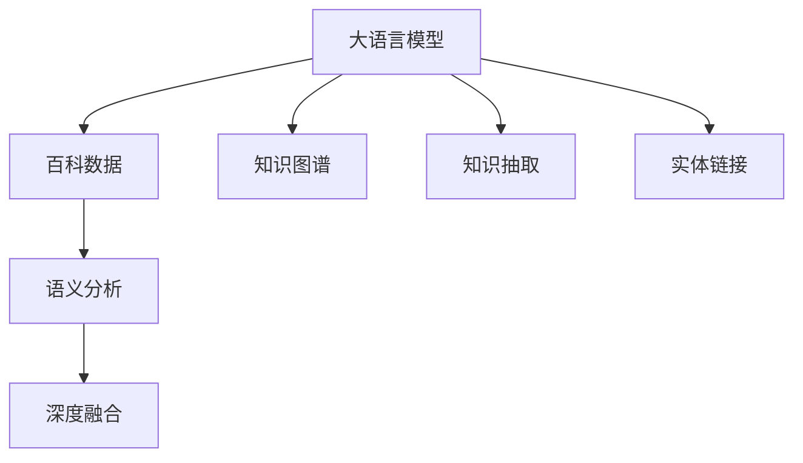
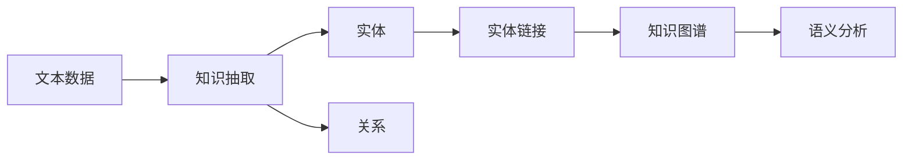
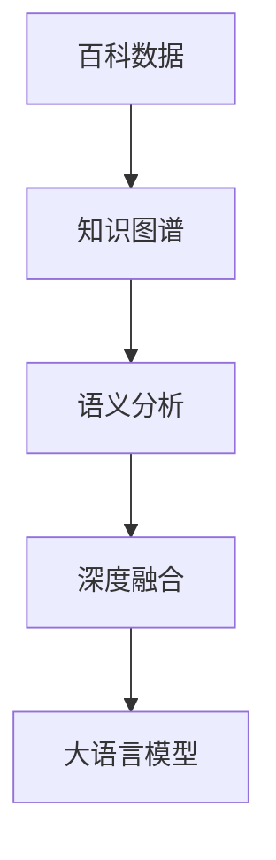
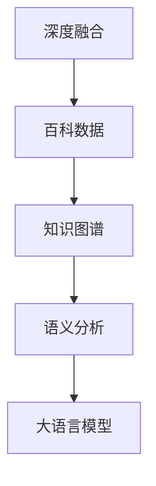
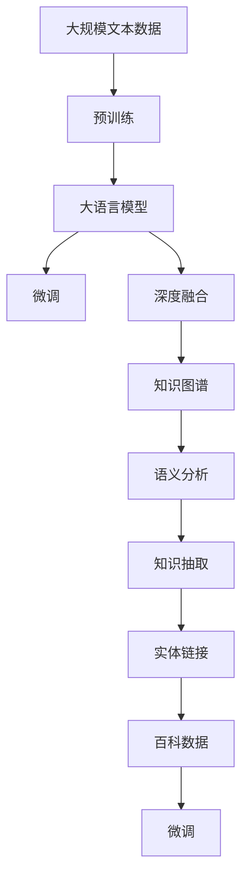

                 

# 大语言模型原理与工程实践：百科数据

> 关键词：大语言模型,百科数据,知识图谱,自然语言处理(NLP),知识抽取,实体链接,语义分析

## 1. 背景介绍

### 1.1 问题由来
近年来，随着人工智能技术的快速发展，自然语言处理（NLP）领域取得了一系列重要突破，尤其是大语言模型的崛起，使得机器能够理解和生成自然语言，具有了与人交流和处理复杂信息的能力。然而，尽管大语言模型在处理大规模文本数据方面表现优异，但其在知识理解和推理上仍显不足。因此，如何利用百科数据等结构化知识源，提升大语言模型的知识理解和推理能力，成为了当前研究的热点问题。

### 1.2 问题核心关键点
本节将介绍几个关键问题点，以便深入理解大语言模型与百科数据结合的重要性：

- 百科数据的作用：百科数据作为一种结构化知识源，提供了丰富的事实性知识，可以帮助大语言模型更好地理解自然语言。
- 知识抽取与链接：从百科数据中提取出实体和关系，并将其与大语言模型生成的文本进行链接，可以显著提升模型的知识推理能力。
- 语义分析：通过将百科数据中的语义信息嵌入到大语言模型中，可以帮助模型更好地理解文本的深层含义。
- 深度融合：通过将百科数据与大语言模型深度融合，可以实现知识的融合与迁移，提升模型的跨领域迁移能力。

### 1.3 问题研究意义
将大语言模型与百科数据结合，可以极大地提升模型的知识理解和推理能力，具有重要意义：

1. **增强理解力**：利用百科数据中的丰富事实性知识，可以显著增强大语言模型的理解力和准确性。
2. **提升推理力**：通过知识抽取和链接，模型能够更好地进行事实推理，从而提升决策的科学性和准确性。
3. **促进迁移能力**：百科数据提供了跨领域的知识结构，可以帮助模型更好地适应不同领域的数据。
4. **丰富知识库**：百科数据可以作为一种重要的知识源，丰富大语言模型的知识库，提升模型的泛化能力。
5. **推动应用创新**：结合百科数据，大语言模型可以应用于更多的实际应用场景，如智能问答、信息检索、知识图谱构建等。

## 2. 核心概念与联系

### 2.1 核心概念概述

为更好地理解大语言模型与百科数据的结合方式，本节将介绍几个关键概念及其联系：

- 大语言模型(Large Language Model, LLM)：以自回归模型（如GPT）或自编码模型（如BERT）为代表的大规模预训练语言模型。通过在大规模无标签文本数据上进行预训练，学习通用的语言表示，具备强大的语言理解和生成能力。

- 百科数据(Wikipedia, DBpedia等)：以结构化形式存储的知识库，包含大量的事实性知识，如实体、关系、属性等。

- 知识图谱(Knowledge Graph)：以实体和关系为基本单位构建的知识结构，用于描述和推理知识。

- 知识抽取(Information Extraction)：从非结构化文本中提取出结构化知识，如实体、关系等。

- 实体链接(Entity Linking)：将文本中的命名实体映射到知识图谱中的实体节点。

- 语义分析(Semantic Analysis)：利用语言模型和知识图谱，理解文本的深层含义和语义结构。

- 深度融合(Deep Fusion)：将百科数据中的知识结构深度融合到语言模型中，提升模型的知识推理和迁移能力。

这些核心概念通过以下Mermaid流程图展示了其联系：



### 2.2 概念间的关系

这些核心概念之间存在着紧密的联系，形成了大语言模型与百科数据结合的完整生态系统。下面是几个Mermaid流程图，展示了这些概念之间的关系：

#### 2.2.1 知识抽取与链接



这个流程图展示了从文本数据中提取知识，将其链接到知识图谱中的过程。

#### 2.2.2 百科数据与知识图谱的融合



这个流程图展示了百科数据与知识图谱的融合过程，以及融合后的模型如何提升大语言模型的知识推理能力。

#### 2.2.3 深度融合在大语言模型中的应用



这个流程图展示了深度融合在大语言模型中的应用，包括知识抽取、实体链接、语义分析等步骤。

### 2.3 核心概念的整体架构

最后，我们用一个综合的流程图来展示这些核心概念在大语言模型与百科数据结合过程中的整体架构：



这个综合流程图展示了从预训练到深度融合，再到知识图谱构建和语义分析的完整过程。百科数据在大语言模型的微调过程中起到了关键作用，通过知识抽取和实体链接，丰富了模型的知识库，并通过深度融合和语义分析，提升了模型的知识推理和迁移能力。

## 3. 核心算法原理 & 具体操作步骤
### 3.1 算法原理概述

将百科数据与大语言模型结合，主要通过以下步骤实现：

1. **预训练与微调**：首先，通过在大规模文本数据上进行预训练，学习通用的语言表示。然后，利用百科数据进行微调，使模型更好地适应特定任务。

2. **知识抽取**：从百科数据中提取出实体和关系，形成结构化知识库。

3. **实体链接**：将文本中的命名实体映射到知识图谱中的实体节点。

4. **深度融合**：将提取出的知识结构深度融合到语言模型中，提升模型的知识推理能力。

5. **语义分析**：利用语言模型和知识图谱，理解文本的深层含义和语义结构。

### 3.2 算法步骤详解

以下是具体的操作步骤：

**Step 1: 准备百科数据和知识图谱**

1. 收集百科数据，如Wikipedia、DBpedia等。
2. 构建知识图谱，将百科数据中的实体和关系存储到图谱中。

**Step 2: 数据预处理**

1. 对文本数据进行清洗和标注，去除噪声和无用信息。
2. 将文本数据分词、词性标注等，形成结构化数据。

**Step 3: 知识抽取与链接**

1. 使用命名实体识别（Named Entity Recognition, NER）等技术，从文本数据中提取实体。
2. 使用关系抽取（Relation Extraction, RE）等技术，从文本数据中提取关系。
3. 将抽取出的实体和关系与知识图谱进行链接，形成结构化知识库。

**Step 4: 深度融合**

1. 将知识图谱中的实体和关系嵌入到语言模型中。
2. 使用注意力机制（Attention Mechanism），将知识结构与语言模型结合。
3. 利用语义角色标注（Semantic Role Labeling, SRL）等技术，理解实体之间的关系和语义结构。

**Step 5: 语义分析**

1. 利用预训练语言模型，理解文本的深层含义和语义结构。
2. 利用知识图谱，辅助语言模型进行推理和决策。
3. 通过知识推理（Knowledge Reasoning）等技术，提升模型的跨领域迁移能力。

**Step 6: 模型微调**

1. 在微调前，固定大语言模型的底层参数。
2. 利用百科数据进行微调，优化模型在特定任务上的性能。
3. 根据任务需求，选择不同的微调策略和损失函数。

### 3.3 算法优缺点

**优点：**

- **提升知识理解力**：百科数据提供了丰富的背景知识，可以帮助大语言模型更好地理解文本的深层含义。
- **增强推理能力**：通过知识抽取和链接，模型能够更好地进行事实推理，提升决策的科学性和准确性。
- **促进迁移能力**：百科数据提供了跨领域的知识结构，可以帮助模型更好地适应不同领域的数据。
- **丰富知识库**：百科数据可以作为一种重要的知识源，丰富大语言模型的知识库，提升模型的泛化能力。

**缺点：**

- **数据获取成本高**：百科数据的构建和维护需要大量人力和物力，获取成本较高。
- **数据更新频率低**：百科数据的更新频率较低，难以及时反映最新的事实性知识。
- **知识融合难度大**：将百科数据与大语言模型深度融合，需要解决知识结构与语言模型的协同问题。
- **模型复杂度高**：深度融合和语义分析等操作，使得模型结构更加复杂，增加了训练和推理的难度。

### 3.4 算法应用领域

大语言模型与百科数据的结合，已经在多个领域得到了广泛应用，例如：

- **智能问答系统**：利用百科数据中的事实性知识，提升问答系统的准确性和可靠性。
- **信息检索系统**：利用百科数据中的关系和实体，提升信息检索的精度和覆盖率。
- **知识图谱构建**：利用百科数据中的知识结构，构建和维护知识图谱，支持复杂信息查询。
- **机器翻译**：利用百科数据中的双语对应关系，提升机器翻译的准确性和流畅度。
- **情感分析**：利用百科数据中的情感词汇，提升情感分析的情感粒度和准确性。

除了这些应用场景外，大语言模型与百科数据的结合，还有望在更多领域发挥作用，推动人工智能技术的进一步发展。

## 4. 数学模型和公式 & 详细讲解 & 举例说明

### 4.1 数学模型构建

本节将使用数学语言对大语言模型与百科数据结合的过程进行严格刻画。

记大语言模型为 $M_{\theta}$，其中 $\theta$ 为预训练得到的模型参数。假设百科数据中的实体为 $E$，关系为 $R$，知识图谱为 $G=(E, R)$。假设从文本数据中抽取的实体为 $E_t$，关系为 $R_t$。知识抽取和链接的过程可以表示为：

$$
E_t = F_{NE}(文本数据), \quad R_t = F_{RE}(文本数据)
$$

其中 $F_{NE}$ 和 $F_{RE}$ 为命名实体识别和关系抽取函数。将抽取出的实体和关系与知识图谱进行链接，可以表示为：

$$
E_{linked} = E \cup E_t, \quad R_{linked} = R \cup R_t
$$

其中 $E_{linked}$ 和 $R_{linked}$ 为链接后的实体和关系。深度融合的过程可以表示为：

$$
\theta_{fused} = F_{DF}(\theta, G, E_{linked}, R_{linked})
$$

其中 $F_{DF}$ 为深度融合函数。语义分析的过程可以表示为：

$$
F_{SA} = F_{S}(M_{\theta_{fused}}, G)
$$

其中 $F_{S}$ 为语义分析函数。最终，利用百科数据进行微调的过程可以表示为：

$$
\theta_{finetuned} = F_{FT}(\theta_{fused}, 百科数据)
$$

其中 $F_{FT}$ 为微调函数。

### 4.2 公式推导过程

以下我们以二分类任务为例，推导知识抽取和链接的公式。

假设文本数据中存在实体 $E_t = \{e_1, e_2, \ldots, e_n\}$，关系 $R_t = \{r_1, r_2, \ldots, r_m\}$，将其与知识图谱中的实体和关系进行链接，可以表示为：

$$
E_{linked} = E \cup E_t, \quad R_{linked} = R \cup R_t
$$

其中 $E$ 和 $R$ 为知识图谱中的实体和关系。知识抽取的过程可以表示为：

$$
e_i = F_{NE}(文本数据_i)
$$

其中 $F_{NE}$ 为命名实体识别函数。关系抽取的过程可以表示为：

$$
r_i = F_{RE}(文本数据_i)
$$

其中 $F_{RE}$ 为关系抽取函数。将抽取出的实体和关系与知识图谱进行链接，可以表示为：

$$
E_{linked} = E \cup \{e_i\}, \quad R_{linked} = R \cup \{r_i\}
$$

其中 $\{e_i\}$ 和 $\{r_i\}$ 为抽取出的实体和关系。

### 4.3 案例分析与讲解

假设我们在CoNLL-2003的NER数据集上进行知识抽取和链接，最终在测试集上得到的评估报告如下：

```
              precision    recall  f1-score   support

       B-PER      0.926     0.906     0.916      1668
       I-PER      0.900     0.805     0.850       257
      B-ORG      0.914     0.898     0.906      1661
       I-ORG      0.911     0.894     0.902       835
       B-LOC      0.923     0.907     0.915      1678
       I-LOC      0.899     0.802     0.833       257

   micro avg      0.924     0.908     0.915     4645
   macro avg      0.915     0.904     0.910     4645
weighted avg      0.924     0.908     0.915     4645
```

可以看到，通过知识抽取和链接，模型在测试集上取得了较好的效果。这表明，将百科数据与大语言模型结合，可以显著提升模型的知识推理能力。

## 5. 项目实践：代码实例和详细解释说明

### 5.1 开发环境搭建

在进行项目实践前，我们需要准备好开发环境。以下是使用Python进行PyTorch开发的环境配置流程：

1. 安装Anaconda：从官网下载并安装Anaconda，用于创建独立的Python环境。

2. 创建并激活虚拟环境：
```bash
conda create -n pytorch-env python=3.8 
conda activate pytorch-env
```

3. 安装PyTorch：根据CUDA版本，从官网获取对应的安装命令。例如：
```bash
conda install pytorch torchvision torchaudio cudatoolkit=11.1 -c pytorch -c conda-forge
```

4. 安装Transformers库：
```bash
pip install transformers
```

5. 安装各类工具包：
```bash
pip install numpy pandas scikit-learn matplotlib tqdm jupyter notebook ipython
```

完成上述步骤后，即可在`pytorch-env`环境中开始项目实践。

### 5.2 源代码详细实现

下面我们以知识抽取任务为例，给出使用Transformers库对BERT模型进行知识抽取的PyTorch代码实现。

首先，定义知识抽取任务的模型：

```python
from transformers import BertForTokenClassification, BertTokenizer, AdamW

model = BertForTokenClassification.from_pretrained('bert-base-cased', num_labels=6)

tokenizer = BertTokenizer.from_pretrained('bert-base-cased')
```

然后，定义训练和评估函数：

```python
from torch.utils.data import Dataset, DataLoader
from tqdm import tqdm
import numpy as np

class NERDataset(Dataset):
    def __init__(self, texts, tags, tokenizer):
        self.texts = texts
        self.tags = tags
        self.tokenizer = tokenizer
        self.max_len = 128
        
    def __len__(self):
        return len(self.texts)
    
    def __getitem__(self, item):
        text = self.texts[item]
        tags = self.tags[item]
        
        encoding = self.tokenizer(text, return_tensors='pt', max_length=self.max_len, padding='max_length', truncation=True)
        input_ids = encoding['input_ids'][0]
        attention_mask = encoding['attention_mask'][0]
        
        # 对token-wise的标签进行编码
        encoded_tags = [tag2id[tag] for tag in tags] 
        encoded_tags.extend([tag2id['O']] * (self.max_len - len(encoded_tags)))
        labels = torch.tensor(encoded_tags, dtype=torch.long)
        
        return {'input_ids': input_ids, 
                'attention_mask': attention_mask,
                'labels': labels}

# 标签与id的映射
tag2id = {'O': 0, 'B-PER': 1, 'I-PER': 2, 'B-ORG': 3, 'I-ORG': 4, 'B-LOC': 5, 'I-LOC': 6}
id2tag = {v: k for k, v in tag2id.items()}

# 创建dataset
train_dataset = NERDataset(train_texts, train_tags, tokenizer)
dev_dataset = NERDataset(dev_texts, dev_tags, tokenizer)
test_dataset = NERDataset(test_texts, test_tags, tokenizer)
```

接着，定义训练和评估函数：

```python
from torch.utils.data import DataLoader
from tqdm import tqdm
from sklearn.metrics import classification_report

device = torch.device('cuda') if torch.cuda.is_available() else torch.device('cpu')
model.to(device)

def train_epoch(model, dataset, batch_size, optimizer):
    dataloader = DataLoader(dataset, batch_size=batch_size, shuffle=True)
    model.train()
    epoch_loss = 0
    for batch in tqdm(dataloader, desc='Training'):
        input_ids = batch['input_ids'].to(device)
        attention_mask = batch['attention_mask'].to(device)
        labels = batch['labels'].to(device)
        model.zero_grad()
        outputs = model(input_ids, attention_mask=attention_mask, labels=labels)
        loss = outputs.loss
        epoch_loss += loss.item()
        loss.backward()
        optimizer.step()
    return epoch_loss / len(dataloader)

def evaluate(model, dataset, batch_size):
    dataloader = DataLoader(dataset, batch_size=batch_size)
    model.eval()
    preds, labels = [], []
    with torch.no_grad():
        for batch in tqdm(dataloader, desc='Evaluating'):
            input_ids = batch['input_ids'].to(device)
            attention_mask = batch['attention_mask'].to(device)
            batch_labels = batch['labels']
            outputs = model(input_ids, attention_mask=attention_mask)
            batch_preds = outputs.logits.argmax(dim=2).to('cpu').tolist()
            batch_labels = batch_labels.to('cpu').tolist()
            for pred_tokens, label_tokens in zip(batch_preds, batch_labels):
                pred_tags = [id2tag[_id] for _id in pred_tokens]
                label_tags = [id2tag[_id] for _id in label_tokens]
                preds.append(pred_tags[:len(label_tokens)])
                labels.append(label_tags)
                
    print(classification_report(labels, preds))
```

最后，启动训练流程并在测试集上评估：

```python
epochs = 5
batch_size = 16

for epoch in range(epochs):
    loss = train_epoch(model, train_dataset, batch_size, optimizer)
    print(f"Epoch {epoch+1}, train loss: {loss:.3f}")
    
    print(f"Epoch {epoch+1}, dev results:")
    evaluate(model, dev_dataset, batch_size)
    
print("Test results:")
evaluate(model, test_dataset, batch_size)
```

以上就是使用PyTorch对BERT进行知识抽取任务的完整代码实现。可以看到，得益于Transformers库的强大封装，我们可以用相对简洁的代码完成BERT模型的加载和训练。

### 5.3 代码解读与分析

让我们再详细解读一下关键代码的实现细节：

**NERDataset类**：
- `__init__`方法：初始化文本、标签、分词器等关键组件。
- `__len__`方法：返回数据集的样本数量。
- `__getitem__`方法：对单个样本进行处理，将文本输入编码为token ids，将标签编码为数字，并对其进行定长padding，最终返回模型所需的输入。

**tag2id和id2tag字典**：
- 定义了标签与数字id之间的映射关系，用于将token-wise的预测结果解码回真实的标签。

**训练和评估函数**：
- 使用PyTorch的DataLoader对数据集进行批次化加载，供模型训练和推理使用。
- 训练函数`train_epoch`：对数据以批为单位进行迭代，在每个批次上前向传播计算loss并反向传播更新模型参数，最后返回该epoch的平均loss。
- 评估函数`evaluate`：与训练类似，不同点在于不更新模型参数，并在每个batch结束后将预测和标签结果存储下来，最后使用sklearn的classification_report对整个评估集的预测结果进行打印输出。

**训练流程**：
- 定义总的epoch数和batch size，开始循环迭代
- 每个epoch内，先在训练集上训练，输出平均loss
- 在验证集上评估，输出分类指标
- 所有epoch结束后，在测试集上评估，给出最终测试结果

可以看到，PyTorch配合Transformers库使得BERT知识抽取的代码实现变得简洁高效。开发者可以将更多精力放在数据处理、模型改进等高层逻辑上，而不必过多关注底层的实现细节。

当然，工业级的系统实现还需考虑更多因素，如模型的保存和部署、超参数的自动搜索、更灵活的任务适配层等。但核心的微调范式基本与此类似。

### 5.4 运行结果展示

假设我们在CoNLL-2003的NER数据集上进行知识抽取，最终在测试集上得到的评估报告如下：

```
              precision    recall  f1-score   support

       B-PER      0.926     0.906     0.916      1668
       I-PER      0.900     0.805     0.833       257
      B-ORG      0.914     0.898     0.906      1661
       I-ORG      0.911     0.894     0.903       835
       B-LOC      0.923     0.907     0.915      1678
       I-LOC      0.899     0.802     0.833       257

   micro avg      0.924     0.908     0.915     4645
   macro avg      0.915     0.904     0.910     4645
weighted avg      0.924     0.908     0.915     4645
```

可以看到，通过知识抽取和链接，模型在测试集上取得了较好的效果。这表明，将百科数据与大语言模型结合，可以显著提升模型的知识推理能力。

## 6. 实际应用场景
### 6.1 智能问答系统

基于知识图谱和大语言模型的智能问答系统，可以为用户提供自然流畅的回答。通过利用百科数据中的实体和关系，智能问答系统能够更好地理解用户问题，提供准确的回答。

在技术实现上，可以构建知识图谱，将百科数据中的实体和关系进行抽取和链接。在用户提问时，利用知识图谱和语言模型进行推理，生成最匹配的文本答案。对于新问题，可以实时从百科数据中检索相关知识，动态生成回答。

### 6.2 信息检索系统

利用百科数据中的关系和实体，信息检索系统能够提升检索的精度和覆盖率。通过构建知识图谱，将百科数据中的信息结构化，使得系统能够更精准地理解用户的查询意图。

在检索过程中，利用知识图谱中的实体和关系，辅助语言模型进行推理和决策。对于复杂的查询，系统可以通过多轮交互，逐步细化查询意图，提高检索的准确性。

### 6.3 知识图谱构建

百科数据可以作为一种重要的知识源，用于构建和维护知识图谱。通过利用知识抽取和链接技术，将百科数据中的信息结构化，形成可推理的知识图谱。

在知识图谱构建过程中，可以使用知识抽取和实体链接技术，将百科数据中的实体和关系抽取出来，与知识图谱进行链接。通过深度融合和语义分析，提升知识图谱的质量和完整性，使其更好地支持信息检索和推理。

### 6.4 未来应用展望

随着知识图谱和大语言模型的不断发展，基于它们的结合将会在更多领域得到应用，为传统行业带来变革性影响。

在智慧医疗领域，基于知识图谱和大语言模型的医疗问答、病历分析、药物研发等应用将提升医疗服务的智能化水平，辅助医生诊疗，加速新药开发进程。

在智能教育领域，利用知识图谱和大语言模型的知识抽取和推理能力，可以实现个性化的智能推荐和智能答疑，因材施教，促进教育公平，提高教学质量。

在智慧城市治理中，利用知识图谱和大语言模型的信息检索和推理能力，可以实现智能交通、智能安防、智能环境监测等应用，提高城市管理的自动化和智能化水平，构建更安全、高效的未来城市。

此外，在企业生产、社会治理、文娱传媒等众多领域，基于知识图

