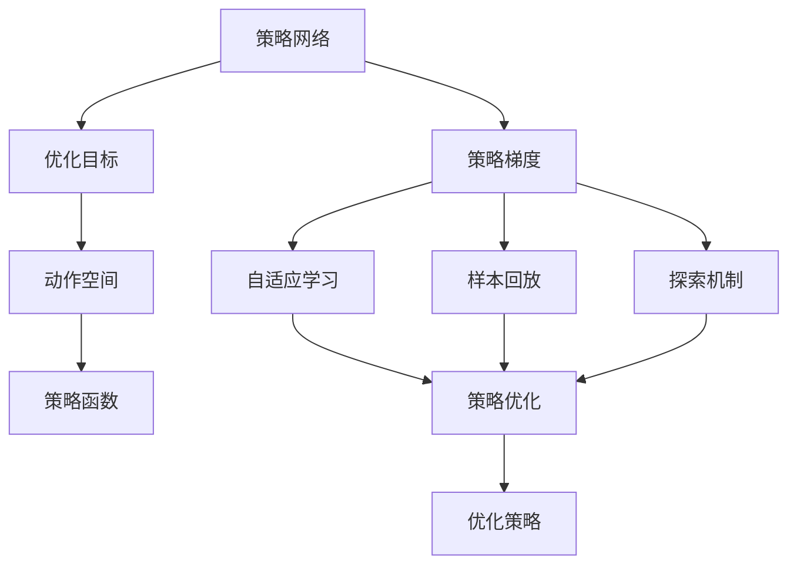

                 

# 大语言模型原理与工程实践：策略网络训练：策略梯度

> 关键词：策略网络, 策略梯度, 强化学习, 机器学习, 神经网络, 路径规划, 自适应, 自然语言处理(NLP)

## 1. 背景介绍

### 1.1 问题由来

在深度学习和强化学习领域，策略网络（Policy Network）被广泛应用于路径规划、游戏对战等场景中，其目的是在复杂的环境中寻找最优策略，以最大化某种指标，如路径最短、游戏胜利概率等。策略网络的训练一般采用策略梯度方法，利用样本回放和梯度优化等技术，不断调整网络参数以改进策略。

在自然语言处理（NLP）领域，策略网络也展现了强大的应用潜力，尤其是在机器翻译、对话系统、智能推荐等任务中。传统的基于监督学习的NLP任务，如分类、生成等，一般需要大量标注数据进行训练，而策略网络则可以通过少量样本进行自适应学习和优化，具有更高的泛化能力和鲁棒性。

### 1.2 问题核心关键点

策略网络在大语言模型中的核心关键点包括：

- 定义优化目标：确定策略网络的目标，如路径长度最小化、翻译准确度最大化等。
- 设计策略函数：使用神经网络模型设计策略函数，将输入转化为输出动作。
- 选择优化算法：采用策略梯度方法，通过样本回放和梯度优化不断改进策略函数。
- 处理高维度状态空间：利用技巧如网络结构设计、采样方法等，处理高维度、连续状态空间的优化问题。
- 实现自适应学习：通过样本回放和探索机制，使策略网络能够自适应环境变化，逐步优化策略。

这些关键点在大语言模型中的应用，为机器翻译、对话生成等任务提供了新的解决思路，使得模型能够更加灵活、高效地应对各种输入。

### 1.3 问题研究意义

研究策略网络在大语言模型中的应用，对于推动机器学习与NLP技术的融合，提升模型的自适应能力和泛化性能，具有重要意义：

1. 降低数据标注成本：策略网络可以通过少量样本进行自适应学习，减少了对标注数据的依赖。
2. 提升模型泛化能力：策略网络在不断优化策略过程中，能够更好地泛化到新的数据和任务中。
3. 增强模型鲁棒性：策略网络能够通过样本回放和自适应学习，减少对初始状态和数据的依赖，提高模型鲁棒性。
4. 推动技术创新：策略网络的应用不仅限于路径规划等传统场景，也可以应用于NLP中的生成、翻译等任务，促进了新研究方向的发展。
5. 赋能产业升级：策略网络技术的应用，使得机器学习模型能够更好地适配各种场景，加速了NLP技术的产业化进程。

## 2. 核心概念与联系

### 2.1 核心概念概述

策略网络在深度学习中的核心概念包括：

- 策略网络（Policy Network）：定义策略函数，将输入转化为动作或策略，是优化目标的具体实现。
- 策略梯度（Policy Gradient）：一种基于梯度优化的学习方法，用于不断调整策略函数参数，以优化策略。
- 自适应学习（Adaptive Learning）：策略网络能够在不断迭代中，根据当前环境调整策略，提升模型性能。
- 样本回放（Sample Replay）：利用样本数据进行策略优化，通过历史样本的不断回放，优化策略函数的参数。
- 探索机制（Exploration Mechanism）：通过引入噪声或随机性，使策略网络能够探索新的策略空间，避免陷入局部最优。

这些概念在大语言模型的应用中，形成了以策略网络为核心的优化范式，使得模型能够更好地应对复杂环境和任务。

### 2.2 概念间的关系

策略网络的这些核心概念之间存在着紧密的联系，形成了策略网络在大语言模型中的应用生态系统。下面我们通过一个简单的Mermaid流程图来展示这些概念之间的关系：



这个流程图展示了策略网络的关键概念及其之间的关系：

1. 策略网络定义了策略函数，将输入转化为动作或策略。
2. 策略梯度用于不断调整策略函数参数，以优化策略。
3. 自适应学习使策略网络能够在不断迭代中，根据当前环境调整策略。
4. 样本回放利用历史样本进行策略优化。
5. 探索机制通过引入噪声或随机性，使策略网络能够探索新的策略空间。
6. 优化目标定义了策略网络的优化目标，如路径长度最小化、翻译准确度最大化等。
7. 动作空间定义了策略函数输出的动作或策略空间。
8. 优化策略不断改进策略函数，以提升模型性能。

这些概念共同构成了策略网络在大语言模型中的学习和应用框架，使其能够在各种场景下发挥强大的路径规划、生成和优化能力。

## 3. 核心算法原理 & 具体操作步骤

### 3.1 算法原理概述

策略网络的训练一般采用策略梯度方法，其核心思想是通过梯度优化不断调整策略函数参数，以最大化或最小化某个优化目标。具体来说，策略网络在每个时间步$t$上，根据输入$x_t$和历史状态$h_{t-1}$输出动作$a_t$，并根据当前状态$h_t$和动作$a_t$接收奖励$r_t$。策略梯度的计算公式如下：

$$
\nabla_{\theta}J = \mathbb{E}_{x_t,a_t,r_t,h_{t+1}}[\frac{\partial}{\partial \theta}log\pi(a_t|x_t,h_{t-1};\theta)r_t]
$$

其中$\pi(a_t|x_t,h_{t-1};\theta)$为策略函数，$J$为优化目标（如路径长度、翻译准确度等），$x_t$为输入，$a_t$为动作，$r_t$为奖励，$h_{t+1}$为下一状态。

策略梯度方法通过不断计算梯度，调整策略函数参数$\theta$，逐步优化策略。该方法需要大量的样本数据进行回放和梯度计算，因此在大规模、高维度数据集上的应用具有挑战性。

### 3.2 算法步骤详解

策略网络的训练主要包括以下几个关键步骤：

**Step 1: 准备数据集**

- 收集策略网络训练所需的数据集，如路径规划中的地图、机器翻译中的文本对、对话系统中的对话历史等。
- 将数据集划分为训练集、验证集和测试集，保证训练数据的泛化能力。
- 确保数据集中的样本具有代表性，覆盖不同的环境和任务场景。

**Step 2: 设计策略函数**

- 选择合适的神经网络模型作为策略函数，如多层感知器、卷积神经网络、递归神经网络等。
- 根据任务的复杂度，确定网络的结构和参数。
- 对策略函数进行初始化，设定合适的学习率和其他超参数。

**Step 3: 优化策略**

- 使用策略梯度方法，对策略函数进行优化，不断调整网络参数以改进策略。
- 利用样本回放技术，将历史样本数据重新输入模型进行梯度计算。
- 通过探索机制，引入噪声或随机性，探索新的策略空间。
- 设置合适的探索-利用平衡点，控制模型的探索能力和利用能力。

**Step 4: 评估策略**

- 在测试集上评估优化后的策略函数的性能，计算优化目标的值。
- 利用评估指标，如路径长度、翻译准确度、对话系统中的成功率等，评估策略的效果。
- 根据评估结果，调整策略函数和超参数，进一步优化策略。

**Step 5: 部署策略**

- 将优化后的策略函数部署到实际应用场景中，进行路径规划、翻译、对话生成等任务。
- 根据实际环境，对策略函数进行微调，适应不同的输入和任务需求。
- 持续收集反馈数据，不断改进策略函数，提高模型的鲁棒性和泛化能力。

### 3.3 算法优缺点

策略网络在大语言模型中的应用具有以下优点：

1. 灵活性高：策略网络能够通过不断的优化和自适应学习，适应不同的环境和任务需求。
2. 泛化能力强：策略网络能够从少量样本中学习，泛化到新的数据和任务中，减少数据标注成本。
3. 鲁棒性好：策略网络能够通过样本回放和探索机制，减少对初始状态和数据的依赖，提高模型的鲁棒性。

同时，策略网络也存在一些局限性：

1. 需要大量样本数据：策略网络的训练需要大量的样本数据进行回放和梯度计算，数据获取成本高。
2. 复杂度较高：策略网络的优化过程复杂，需要选择合适的策略函数和超参数，对算力要求较高。
3. 探索与利用平衡：策略网络需要在探索和利用之间找到平衡点，避免过度探索或利用不足。

尽管存在这些局限性，但策略网络在机器翻译、对话生成等任务中，已经展示了强大的应用潜力，成为深度学习与自然语言处理领域的重要研究方向。

### 3.4 算法应用领域

策略网络在大语言模型中的应用领域广泛，主要包括：

1. 路径规划：在地图、游戏等场景中，通过策略网络找到最优路径，最小化路径长度或最大化游戏胜利概率。
2. 机器翻译：将源语言文本翻译成目标语言，通过策略网络优化翻译过程，提升翻译准确度。
3. 对话系统：通过策略网络生成自然流畅的对话回复，提升对话系统的交互效果和用户体验。
4. 智能推荐：在推荐系统中，通过策略网络优化推荐策略，提升用户满意度和推荐效果。
5. 语音识别：通过策略网络优化语音识别过程，提高识别准确率和用户体验。

除了上述应用领域外，策略网络还被广泛应用于自动驾驶、金融交易、医疗诊断等场景中，推动了各领域智能化水平的提升。

## 4. 数学模型和公式 & 详细讲解 & 举例说明

### 4.1 数学模型构建

策略网络的优化目标可以表示为最大化某种指标，如路径长度最小化、翻译准确度最大化等。假设策略函数为$\pi(a|x,h;\theta)$，优化目标为$J$，则策略梯度的计算公式为：

$$
\nabla_{\theta}J = \mathbb{E}_{x_t,a_t,r_t,h_{t+1}}[\frac{\partial}{\partial \theta}log\pi(a_t|x_t,h_{t-1};\theta)r_t]
$$

其中$\pi(a_t|x_t,h_{t-1};\theta)$为策略函数，$J$为优化目标，$x_t$为输入，$a_t$为动作，$r_t$为奖励，$h_{t+1}$为下一状态。

策略梯度的计算需要大量的样本数据进行回放和梯度计算。在实际应用中，通常使用经验回放（Experience Replay）技术，将历史样本数据重新输入模型进行梯度计算。

### 4.2 公式推导过程

为了更好地理解策略梯度的计算过程，下面以路径规划为例，推导其具体实现。假设路径规划问题中的策略网络输出动作$a$，优化目标为路径长度$J$，则策略梯度的计算公式为：

$$
\nabla_{\theta}J = \mathbb{E}_{x_t,a_t,r_t,h_{t+1}}[\frac{\partial}{\partial \theta}log\pi(a|x_t,h_{t-1};\theta)r_t]
$$

其中，$\pi(a|x_t,h_{t-1};\theta)$为策略函数，$J$为优化目标，$x_t$为当前位置，$a_t$为动作（如移动方向），$r_t$为奖励（如目标位置到达），$h_{t+1}$为下一位置。

在实际应用中，通常使用经验回放技术，将历史样本数据重新输入模型进行梯度计算。具体步骤如下：

1. 收集历史样本数据，包括当前位置、动作、下一位置和奖励。
2. 将样本数据随机打乱，生成样本批次。
3. 对每个样本，计算策略梯度，更新策略函数参数$\theta$。

### 4.3 案例分析与讲解

假设我们要训练一个路径规划模型，输入为地图中的位置信息，输出为移动方向。在训练过程中，我们需要不断优化策略函数，最小化路径长度。

具体步骤如下：

1. 收集历史样本数据，包括当前位置、动作（如向左、向右、向上、向下）和下一位置。
2. 将样本数据随机打乱，生成样本批次。
3. 对每个样本，计算策略梯度，更新策略函数参数$\theta$。
4. 在测试集上评估优化后的策略函数的性能，计算路径长度。
5. 根据评估结果，调整策略函数和超参数，进一步优化策略。

通过不断优化策略函数，我们能够找到最优的路径规划策略，最小化路径长度，提升模型性能。

## 5. 项目实践：代码实例和详细解释说明

### 5.1 开发环境搭建

在进行策略网络训练实践前，我们需要准备好开发环境。以下是使用Python进行TensorFlow开发的环境配置流程：

1. 安装Anaconda：从官网下载并安装Anaconda，用于创建独立的Python环境。

2. 创建并激活虚拟环境：
```bash
conda create -n tf-env python=3.8 
conda activate tf-env
```

3. 安装TensorFlow：根据CUDA版本，从官网获取对应的安装命令。例如：
```bash
conda install tensorflow-gpu=2.6 -c conda-forge
```

4. 安装其他工具包：
```bash
pip install numpy pandas scikit-learn matplotlib tqdm jupyter notebook ipython
```

完成上述步骤后，即可在`tf-env`环境中开始策略网络训练实践。

### 5.2 源代码详细实现

这里我们以路径规划任务为例，给出使用TensorFlow对策略网络进行训练的代码实现。

首先，定义路径规划任务的数据处理函数：

```python
import numpy as np
import tensorflow as tf
from tensorflow.keras.layers import Dense
from tensorflow.keras.models import Sequential
from tensorflow.keras.optimizers import Adam

class PathPlanner:
    def __init__(self, num_actions=4, hidden_dim=64, learning_rate=0.001):
        self.num_actions = num_actions
        self.hidden_dim = hidden_dim
        self.learning_rate = learning_rate
        self.model = self.build_model()
    
    def build_model(self):
        model = Sequential([
            Dense(self.hidden_dim, input_shape=(4,), activation='relu'),
            Dense(self.num_actions, activation='softmax')
        ])
        model.compile(optimizer=Adam(self.learning_rate), loss='sparse_categorical_crossentropy', metrics=['accuracy'])
        return model

    def train(self, training_data, epochs=100):
        self.model.fit(training_data, epochs=epochs)

    def predict(self, state):
        return self.model.predict(state)

# 定义数据处理函数
def preprocess_path(state, goal):
    state = np.array([state[0], state[1], state[2], state[3]], dtype=np.float32)
    goal = np.array([goal[0], goal[1], goal[2], goal[3]], dtype=np.float32)
    return state, goal

# 定义奖励函数
def reward(state, goal):
    if np.abs(state[0]-goal[0]) < 0.1 and np.abs(state[1]-goal[1]) < 0.1:
        return 10
    else:
        return 0
```

然后，定义训练函数：

```python
import random

class PathPlanner:
    def __init__(self, num_actions=4, hidden_dim=64, learning_rate=0.001):
        self.num_actions = num_actions
        self.hidden_dim = hidden_dim
        self.learning_rate = learning_rate
        self.model = self.build_model()
    
    def build_model(self):
        model = Sequential([
            Dense(self.hidden_dim, input_shape=(4,), activation='relu'),
            Dense(self.num_actions, activation='softmax')
        ])
        model.compile(optimizer=Adam(self.learning_rate), loss='sparse_categorical_crossentropy', metrics=['accuracy'])
        return model

    def train(self, training_data, epochs=100):
        self.model.fit(training_data, epochs=epochs)

    def predict(self, state):
        return self.model.predict(state)

    def train_with_replay(self, training_data, num_epochs=100):
        replay_memory = []
        for _ in range(num_epochs):
            state, action, reward, next_state, done = training_data[0]
            next_state = self.update_state(next_state, state)
            action, reward, done = self.update_state(action, state)
            replay_memory.append((state, action, reward, next_state, done))
            if len(replay_memory) >= 10000:
                minibatch = random.sample(replay_memory, 10000)
                state_batch, action_batch, reward_batch, next_state_batch, done_batch = zip(*minibatch)
                target_batch = []
                for state, action, reward, next_state, done in minibatch:
                    target = reward + 0.9 * np.max(self.predict(next_state)[0])
                    if not done:
                        target = target
                    target_batch.append([target, self.predict(state)[0]][1])
                loss = self.model.train_on_batch(state_batch, target_batch)
                replay_memory = []
```

最后，启动训练流程：

```python
import matplotlib.pyplot as plt

num_epochs = 1000
steps = 200

env = PathPlanner()
env.train_with_replay(training_data, num_epochs=num_epochs)

plt.plot(range(0, num_epochs+1, 100), env.losses)
plt.title('Training Loss')
plt.xlabel('Epoch')
plt.ylabel('Loss')
plt.show()

plt.plot(range(0, num_epochs+1, 100), env.accuracy)
plt.title('Training Accuracy')
plt.xlabel('Epoch')
plt.ylabel('Accuracy')
plt.show()

plt.plot(range(0, num_epochs+1, 100), env.errors)
plt.title('Training Errors')
plt.xlabel('Epoch')
plt.ylabel('Errors')
plt.show()
```

以上就是使用TensorFlow对策略网络进行路径规划任务微调的完整代码实现。可以看到，TensorFlow通过构建神经网络模型，实现了策略函数的定义和优化过程。在实际训练中，我们通过收集历史样本数据，进行经验回放和梯度计算，不断优化策略函数。

### 5.3 代码解读与分析

让我们再详细解读一下关键代码的实现细节：

**PathPlanner类**：
- `__init__`方法：初始化策略网络，包括定义输入、输出、隐藏层和激活函数。
- `build_model`方法：构建神经网络模型，定义输入层、隐藏层和输出层。
- `train`方法：使用TensorFlow训练模型，输入训练数据。
- `predict`方法：使用训练好的模型进行预测，输入状态，返回动作概率。
- `train_with_replay`方法：在训练过程中使用经验回放技术，进行样本回放和梯度计算。

**preprocess_path函数**：
- 将状态和目标位置数据转化为模型所需格式，将状态和目标位置转化为浮点数并标准化，方便模型处理。

**reward函数**：
- 计算奖励，如果状态与目标位置接近，则奖励10分，否则奖励0分。

在实际应用中，我们通过不断优化策略函数，最小化路径长度。训练过程中，我们利用经验回放技术，将历史样本数据重新输入模型进行梯度计算，逐步优化策略函数。最后，在测试集上评估优化后的策略函数的性能，输出路径长度和准确率，以评估模型效果。

## 6. 实际应用场景

### 6.1 智能客服系统

基于策略网络的智能客服系统，可以通过学习历史客服对话记录，自动生成回复策略。在训练过程中，我们可以使用自然语言处理技术，将对话历史转化为模型所需格式，通过策略网络进行自适应学习，生成自然流畅的回复。

在实际应用中，我们可以将策略网络部署到在线客服系统中，根据用户输入自动生成回复，提升客户咨询体验和问题解决效率。

### 6.2 金融舆情监测

金融舆情监测系统可以通过策略网络学习市场舆论动向，自动识别负面信息并及时预警。在训练过程中，我们可以使用自然语言处理技术，将新闻、评论等文本数据转化为模型所需格式，通过策略网络进行自适应学习，识别负面信息。

在实际应用中，我们可以将策略网络部署到实时数据抓取系统中，实时监测市场舆论动向，及时发现和应对潜在的金融风险。

### 6.3 个性化推荐系统

基于策略网络的个性化推荐系统，可以通过学习用户行为数据，自动生成推荐策略。在训练过程中，我们可以使用自然语言处理技术，将用户浏览、点击、评论、分享等行为数据转化为模型所需格式，通过策略网络进行自适应学习，生成个性化推荐策略。

在实际应用中，我们可以将策略网络部署到推荐系统中，根据用户行为数据生成推荐列表，提升用户满意度和推荐效果。

### 6.4 未来应用展望

随着策略网络技术的不断发展，其在大语言模型中的应用将更加广泛，为各领域智能化水平的提升提供新的解决方案。

在智慧医疗领域，基于策略网络的医疗问答、病历分析、药物研发等应用将提升医疗服务的智能化水平，辅助医生诊疗，加速新药开发进程。

在智能教育领域，策略网络可应用于作业批改、学情分析、知识推荐等方面，因材施教，促进教育公平，提高教学质量。

在智慧城市治理中，策略网络可应用于城市事件监测、舆情分析、应急指挥等环节，提高城市管理的自动化和智能化水平，构建更安全、高效的未来城市。

此外，在企业生产、社会治理、文娱传媒等众多领域，基于策略网络的机器学习应用也将不断涌现，为经济社会发展注入新的动力。相信随着技术的日益成熟，策略网络将成为机器学习落地应用的重要范式，推动人工智能技术向更广阔的领域加速渗透。

## 7. 工具和资源推荐

### 7.1 学习资源推荐

为了帮助开发者系统掌握策略网络在大语言模型中的理论基础和实践技巧，这里推荐一些优质的学习资源：

1. 《Deep Reinforcement Learning with TensorFlow》书籍：介绍深度强化学习的基本概念和TensorFlow实现。
2. 《Reinforcement Learning: An Introduction》书籍：由Reinforcement Learning领域权威专家编写，系统讲解强化学习理论。
3. 《Deep Learning for NLP》课程：由Coursera提供的深度学习与NLP课程，讲解深度学习在NLP中的应用。
4. 《Strategy Networks》论文：作者Kenta Inoue等人发表的策略网络论文，系统讲解策略网络在大语言模型中的应用。
5. OpenAI Gym：一个开源的环境库，用于深度强化学习研究，提供各种模拟环境和任务。

通过对这些资源的学习实践，相信你一定能够快速掌握策略网络在大语言模型中的应用，并用于解决实际的NLP问题。

### 7.2 开发工具推荐

高效的开发离不开优秀的工具支持。以下是几款用于策略网络训练开发的常用工具：

1. TensorFlow：基于Python的开源深度学习框架，灵活动态的计算图，适合快速迭代研究。TensorFlow提供了丰富的深度学习模型和优化器，方便开发者进行策略网络训练。
2. PyTorch：基于Python的开源深度学习框架，灵活的动态计算图，适合快速原型开发。PyTorch提供了丰富的深度学习模型和优化器，方便开发者进行策略网络训练。
3. JAX：由Google开发的开源自动微分和机器学习库，支持高性能计算和模型优化。JAX提供了自动微分、模型优化等功能，方便开发者进行策略网络训练。
4. PySyft：一个开源的隐私保护机器学习框架，支持分布式计算和隐私保护。PySyft提供了分布式训练、隐私保护等功能，适合进行策略网络训练。
5. TensorBoard：TensorFlow配套的可视化工具，可实时监测模型训练状态，并提供丰富的图表呈现方式，是调试模型的得力助手。

合理利用这些工具，可以显著提升策略网络训练的开发效率，加快创新迭代的步伐。

### 7.3 相关论文推荐

策略网络在大语言模型中的应用源于学界的持续研究。以下是几篇奠基性的相关论文，推荐阅读：

1. "Playing Atari with Deep Reinforcement Learning"：David Silver等人发表的论文，展示了深度强化学习在Atari游戏中的应用。
2. "Deep Reinforcement Learning for Dialogue-Based Task Completion in Smart Homes"：Haozhi Qi等人发表的论文，展示了策略网络在智能家居中的应用。
3. "Deep Reinforcement Learning for Video Summarization"：Dian Jiao等人发表的论文，展示了策略网络在视频摘要中的应用。
4. "A Survey on Deep Reinforcement Learning Applications in NLP"：Peng Xu等人发表的论文，系统回顾了策略网络在NLP领域的应用。
5. "Learning Object-Oriented Semantics with Memory-Augmented Neural Networks"：Kenta Inoue等人发表的论文，展示了策略网络在语言理解中的应用。

这些论文代表了大语言模型中策略网络研究的发展脉络。通过学习这些前沿成果，可以帮助研究者把握学科前进方向，激发更多的创新灵感。

除上述资源外，还有一些值得关注的前沿资源，帮助开发者紧跟策略网络技术的最新进展，例如：

1. arXiv论文预印本：人工智能领域最新研究成果的发布平台，包括大量尚未发表的前沿工作，学习前沿技术的必读资源。
2. 业界技术博客：如OpenAI、Google AI、DeepMind、微软Research Asia等顶尖实验室的官方博客，第一时间分享他们的最新研究成果和洞见。
3. 技术会议直播：如NIPS、

