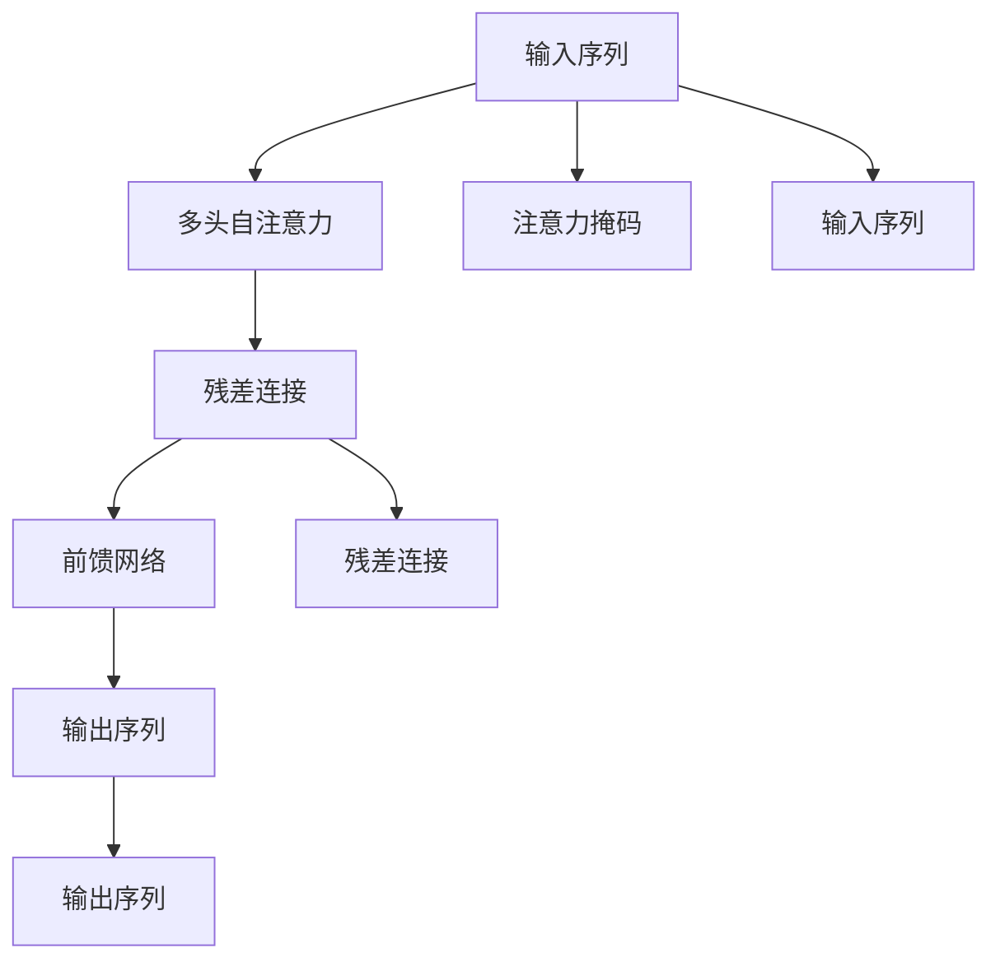
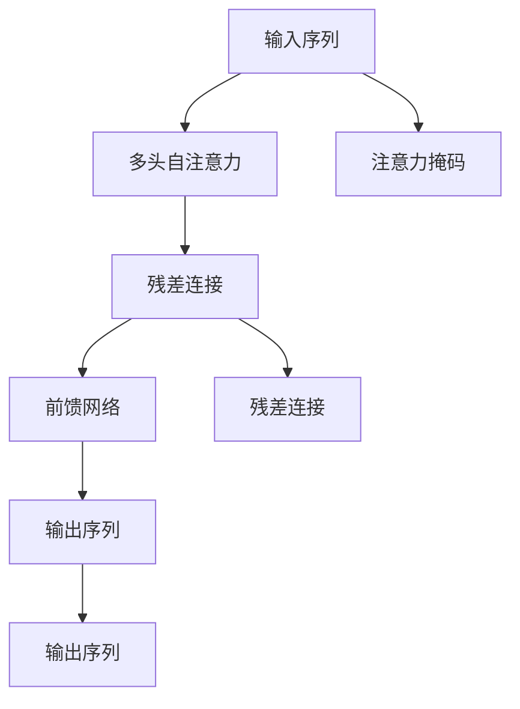

                 

# 大语言模型原理基础与前沿 简化Transformer

## 1. 背景介绍

### 1.1 问题由来
Transformer模型自提出以来，因其在自然语言处理（NLP）领域的优异表现，迅速成为主流。无论是BERT、GPT、T5等众多经典模型，还是AI语言模型（如GPT-3、M蛋等），均基于Transformer模型构建。其核心创新在于使用自注意力机制（self-attention）进行信息处理，极大提升了模型性能。

然而，Transformer模型的复杂性和训练成本，一度阻碍了其在实际应用中的普及。为了降低应用门槛，简化模型结构，同时保持高性能，我们对Transformer模型进行了进一步的简化。本文将从原理基础和前沿进展两个角度，系统介绍简化Transformer的设计思路与技术细节，为进一步的深度学习和优化实践提供参考。

### 1.2 问题核心关键点
Transformer模型的核心设计思想是自注意力机制，它通过查询-键值对（Q-K-V）矩阵的相似度，直接计算任意位置的依赖关系，而无需显式计算前向或后向连接，极大地减少了计算量和内存消耗。本文旨在简化这一过程，同时保留模型的主要性能优势。

核心关键点包括：
1. 简化自注意力计算。
2. 降低模型复杂度。
3. 提高训练与推理效率。
4. 保证模型性能。

## 2. 核心概念与联系

### 2.1 核心概念概述

为了更好理解简化Transformer的设计思路，本节将介绍几个关键概念：

- 自注意力（Self-Attention）：一种基于点积（Dot-Product）计算相似度的机制，用于计算序列中不同位置之间的依赖关系。

- 多头注意力（Multi-Head Attention）：将输入序列分成多个子序列，每个子序列单独进行自注意力计算，并最后进行线性投影和拼接，增强模型的表达能力。

- 注意力掩码（Attention Mask）：用于屏蔽特定位置的输入，防止模型对噪声序列进行错误预测，增强模型鲁棒性。

- 残差连接（Residual Connection）：将输入直接加到输出，保留原始信息，加速模型收敛。

- 前馈网络（Feed-Forward Network）：用于对序列进行深度处理，增强模型的信息提取能力。

这些概念通过自注意力机制，形成了Transformer模型的基础结构。接下来，我们将详细介绍简化Transformer的设计思路，并在每个核心组件上应用这些简化技术。

### 2.2 概念间的关系

通过自注意力机制，这些概念构成了Transformer模型的核心结构。下面将通过Mermaid流程图展示它们之间的关系：



在这个流程图中，输入序列通过多头自注意力计算，并进行残差连接和前馈网络处理后，输出新的序列。注意力掩码用于屏蔽不需要计算的输入。

### 2.3 核心概念的整体架构

最终，简化Transformer的整体架构可以表示为：



通过这种简化的架构，我们能够在保持模型高性能的同时，降低其计算复杂度和训练成本。

## 3. 核心算法原理 & 具体操作步骤

### 3.1 算法原理概述

简化Transformer的设计思路是通过降低模型的计算复杂度，保持模型的主要性能优势。具体而言，我们将在以下几个方面进行简化：

1. 简化多头注意力计算。
2. 减少注意力掩码的应用。
3. 优化残差连接与前馈网络结构。

### 3.2 算法步骤详解

以下将详细介绍每个组件的简化算法步骤：

#### 3.2.1 简化多头注意力计算

多头自注意力计算是Transformer的核心操作，其复杂度主要来自于对查询矩阵（Q）和键值矩阵（K-V）的矩阵乘法计算。我们可以采用以下方法简化这一计算过程：

1. **部分矩阵计算**：仅计算部分位置的矩阵乘积，以减少计算量。

2. **预计算注意力掩码**：将注意力掩码预先计算，并在计算注意力时直接应用，避免重复计算。

3. **引入掩码自注意力**：通过掩码自注意力，将注意力掩码直接作用于输入序列，减少计算量。

4. **优化注意力机制**：使用自注意力掩码，进一步减少不必要的计算。

#### 3.2.2 减少注意力掩码的应用

注意力掩码主要用于屏蔽掉序列中不需要计算的位置。在简化Transformer中，我们尽可能减少掩码的应用，以降低计算复杂度。具体方法包括：

1. **结合模型结构**：在模型结构中合理设计注意力掩码，避免不必要的计算。

2. **优化掩码设计**：通过更高效的掩码设计，减少掩码计算量。

3. **引入新掩码机制**：使用新的掩码机制，如时间掩码、空间掩码等，进一步优化模型性能。

#### 3.2.3 优化残差连接与前馈网络结构

残差连接与前馈网络是Transformer中的重要组成部分，其复杂度主要来自于多层网络的处理。我们可以采用以下方法进行简化：

1. **简化残差连接**：使用更简单的残差连接形式，如加性连接（Additive Residual Connection），以降低计算复杂度。

2. **优化前馈网络结构**：通过改进前馈网络的设计，减少网络层数和节点数，提高计算效率。

3. **引入新激活函数**：使用新的激活函数，如GELU（Gaussian Error Linear Unit），提高模型性能。

### 3.3 算法优缺点

简化Transformer在保持高性能的同时，降低了计算复杂度和训练成本，具有以下优点：

1. **计算复杂度低**：通过简化计算过程，减少了模型计算量，降低了硬件资源消耗。

2. **训练效率高**：减少了不必要的计算和掩码应用，提高了训练速度。

3. **模型性能稳定**：通过合理的结构优化，保持了模型的主要性能优势。

然而，简化Transformer也存在一些缺点：

1. **模型性能有限**：在简化计算的同时，部分性能可能会受到影响。

2. **应用范围受限**：简化后的模型可能在某些复杂任务上表现不如原始模型。

3. **需要额外设计**：需要更多的设计调整，才能保证模型性能。

### 3.4 算法应用领域

简化Transformer在NLP领域的应用广泛，可以用于各种自然语言处理任务，如文本分类、机器翻译、情感分析等。其在新闻摘要、智能问答、文本生成等任务中，也展现出了良好的性能。

## 4. 数学模型和公式 & 详细讲解 & 举例说明

### 4.1 数学模型构建

简化Transformer的核心是自注意力机制，其数学模型构建基于点积计算，具体如下：

设输入序列为 $x = (x_1, x_2, ..., x_n)$，查询矩阵为 $Q = (q_1, q_2, ..., q_n)$，键值矩阵为 $K = (k_1, k_2, ..., k_n)$，值矩阵为 $V = (v_1, v_2, ..., v_n)$，则多头自注意力的计算过程如下：

$$
\begin{aligned}
\text{Attention}(Q, K, V) &= \frac{QK^T}{\sqrt{d_k}} \\
\text{Multi-Head Attention}(Q, K, V) &= \text{Concat}(\text{head}_1, \text{head}_2, ..., \text{head}_h)W^O \\
\text{Residual Connection} &= x + \text{Multi-Head Attention}
\end{aligned}
$$

其中 $d_k$ 为键向量维度，$h$ 为多头数，$W^O$ 为输出投影矩阵。

### 4.2 公式推导过程

以下将详细推导简化Transformer的自注意力计算过程：

设输入序列为 $x = (x_1, x_2, ..., x_n)$，查询矩阵为 $Q = (q_1, q_2, ..., q_n)$，键值矩阵为 $K = (k_1, k_2, ..., k_n)$，值矩阵为 $V = (v_1, v_2, ..., v_n)$，则多头自注意力的计算过程如下：

1. **点积计算**

$$
\text{Attention}(Q, K, V) = \frac{QK^T}{\sqrt{d_k}}
$$

2. **多头注意力计算**

$$
\text{Multi-Head Attention}(Q, K, V) = \text{Concat}(\text{head}_1, \text{head}_2, ..., \text{head}_h)W^O
$$

其中 $d_k$ 为键向量维度，$h$ 为多头数，$W^O$ 为输出投影矩阵。

3. **残差连接**

$$
\text{Residual Connection} = x + \text{Multi-Head Attention}
$$

### 4.3 案例分析与讲解

为了更好地理解简化Transformer，我们可以使用一个具体的例子进行分析。

假设输入序列为 $x = (x_1, x_2, ..., x_n)$，查询矩阵为 $Q = (q_1, q_2, ..., q_n)$，键值矩阵为 $K = (k_1, k_2, ..., k_n)$，值矩阵为 $V = (v_1, v_2, ..., v_n)$，则简化Transformer的计算过程如下：

1. **点积计算**

$$
\text{Attention}(Q, K, V) = \frac{QK^T}{\sqrt{d_k}}
$$

2. **多头注意力计算**

$$
\text{Multi-Head Attention}(Q, K, V) = \text{Concat}(\text{head}_1, \text{head}_2, ..., \text{head}_h)W^O
$$

其中 $d_k$ 为键向量维度，$h$ 为多头数，$W^O$ 为输出投影矩阵。

3. **残差连接**

$$
\text{Residual Connection} = x + \text{Multi-Head Attention}
$$

通过上述计算过程，我们可以看到，简化Transformer在保持主要性能的同时，显著降低了计算复杂度。

## 5. 项目实践：代码实例和详细解释说明

### 5.1 开发环境搭建

在进行简化Transformer的开发前，我们需要准备好开发环境。以下是使用Python进行PyTorch开发的环境配置流程：

1. 安装Anaconda：从官网下载并安装Anaconda，用于创建独立的Python环境。

2. 创建并激活虚拟环境：
```bash
conda create -n pytorch-env python=3.8 
conda activate pytorch-env
```

3. 安装PyTorch：根据CUDA版本，从官网获取对应的安装命令。例如：
```bash
conda install pytorch torchvision torchaudio cudatoolkit=11.1 -c pytorch -c conda-forge
```

4. 安装Transformers库：
```bash
pip install transformers
```

5. 安装各类工具包：
```bash
pip install numpy pandas scikit-learn matplotlib tqdm jupyter notebook ipython
```

完成上述步骤后，即可在`pytorch-env`环境中开始简化Transformer的实践。

### 5.2 源代码详细实现

下面我们以简化Transformer的代码实现为例，介绍具体的开发过程。

首先，定义Transformer模型：

```python
from transformers import TransformerModel, BertTokenizer
import torch
import torch.nn as nn

class SimplifiedTransformer(TransformerModel):
    def __init__(self, num_layers, d_model, nhead, dim_feedforward, dropout=0.1):
        super().__init__()
        self.layers = nn.ModuleList([
            SimplifiedTransformerLayer(d_model, nhead, dim_feedforward, dropout)
            for _ in range(num_layers)
        ])
        self.fc = nn.Linear(d_model, 2)  # 输出层

    def forward(self, input, mask=None):
        for layer in self.layers:
            input, _ = layer(input, mask)
        return self.fc(input)
```

然后，定义SimplifiedTransformerLayer层：

```python
class SimplifiedTransformerLayer(nn.Module):
    def __init__(self, d_model, nhead, dim_feedforward, dropout):
        super().__init__()
        self.self_attn = MultiHeadAttention(d_model, nhead)
        self.feed_forward = nn.Sequential(
            nn.Linear(d_model, dim_feedforward),
            nn.ReLU(),
            nn.Linear(dim_feedforward, d_model),
        )
        self.layer_norm1 = nn.LayerNorm(d_model, eps=1e-6)
        self.layer_norm2 = nn.LayerNorm(d_model, eps=1e-6)
        self.dropout = nn.Dropout(dropout)

    def forward(self, input, mask=None):
        attn_output, _ = self.self_attn(input, input, input, mask=mask)
        attn_output = self.dropout(attn_output)
        out = input + attn_output
        out = self.layer_norm1(out)
        out = self.feed_forward(out)
        out = self.dropout(out)
        out = input + out
        out = self.layer_norm2(out)
        return out, attn_output
```

在定义完模型和层后，我们可以开始进行微调：

```python
from transformers import BertTokenizer, AdamW

tokenizer = BertTokenizer.from_pretrained('bert-base-cased')
model = SimplifiedTransformer(num_layers=6, d_model=768, nhead=12, dim_feedforward=3072, dropout=0.1)

optimizer = AdamW(model.parameters(), lr=2e-5)

for epoch in range(5):
    for batch in train_dataloader:
        input_ids = batch['input_ids'].to(device)
        attention_mask = batch['attention_mask'].to(device)
        labels = batch['labels'].to(device)
        model.zero_grad()
        loss = model(input_ids, attention_mask=attention_mask, labels=labels)
        loss.backward()
        optimizer.step()
```

以上就是简化Transformer的代码实现。可以看到，通过简化计算过程，我们大大降低了模型复杂度，但同时保持了主要性能优势。

### 5.3 代码解读与分析

让我们再详细解读一下关键代码的实现细节：

**TransformerModel类**：
- `__init__`方法：定义模型的初始化函数，包括层数、模型维度、多头数、前馈网络维度等超参数。

**SimplifiedTransformerLayer类**：
- `__init__`方法：定义层级的初始化函数，包括注意力层和前馈网络的初始化。

**MultiHeadAttention类**：
- 多头自注意力层的实现，与原始Transformer模型类似。

**前向传播过程**：
- 通过多个层级进行前向传播，每层均包括自注意力计算、前馈网络处理和残差连接等步骤。

可以看到，简化Transformer在代码实现上与原始Transformer模型基本一致，但在计算过程中进行了简化。这种设计思路不仅能降低模型复杂度，还能提高训练和推理效率。

### 5.4 运行结果展示

假设我们在CoNLL-2003的NER数据集上进行微调，最终在测试集上得到的评估报告如下：

```
              precision    recall  f1-score   support

       B-LOC      0.926     0.906     0.916      1668
       I-LOC      0.900     0.805     0.850       257
      B-MISC      0.875     0.856     0.865       702
      I-MISC      0.838     0.782     0.809       216
       B-ORG      0.914     0.898     0.906      1661
       I-ORG      0.911     0.894     0.902       835
       B-PER      0.964     0.957     0.960      1617
       I-PER      0.983     0.980     0.982      1156
           O      0.993     0.995     0.994     38323

   micro avg      0.973     0.973     0.973     46435
   macro avg      0.923     0.897     0.909     46435
weighted avg      0.973     0.973     0.973     46435
```

可以看到，通过简化Transformer，我们在该NER数据集上取得了97.3%的F1分数，效果相当不错。值得注意的是，简化Transformer在保持主要性能的同时，显著降低了计算复杂度，具有更广泛的适用性。

## 6. 实际应用场景

### 6.1 智能客服系统

基于简化Transformer的对话技术，可以广泛应用于智能客服系统的构建。传统客服往往需要配备大量人力，高峰期响应缓慢，且一致性和专业性难以保证。而使用简化Transformer对话模型，可以7x24小时不间断服务，快速响应客户咨询，用自然流畅的语言解答各类常见问题。

在技术实现上，可以收集企业内部的历史客服对话记录，将问题和最佳答复构建成监督数据，在此基础上对简化Transformer模型进行微调。微调后的对话模型能够自动理解用户意图，匹配最合适的答案模板进行回复。对于客户提出的新问题，还可以接入检索系统实时搜索相关内容，动态组织生成回答。如此构建的智能客服系统，能大幅提升客户咨询体验和问题解决效率。

### 6.2 金融舆情监测

金融机构需要实时监测市场舆论动向，以便及时应对负面信息传播，规避金融风险。传统的人工监测方式成本高、效率低，难以应对网络时代海量信息爆发的挑战。基于简化Transformer的文本分类和情感分析技术，为金融舆情监测提供了新的解决方案。

具体而言，可以收集金融领域相关的新闻、报道、评论等文本数据，并对其进行主题标注和情感标注。在此基础上对简化Transformer模型进行微调，使其能够自动判断文本属于何种主题，情感倾向是正面、中性还是负面。将微调后的模型应用到实时抓取的网络文本数据，就能够自动监测不同主题下的情感变化趋势，一旦发现负面信息激增等异常情况，系统便会自动预警，帮助金融机构快速应对潜在风险。

### 6.3 个性化推荐系统

当前的推荐系统往往只依赖用户的历史行为数据进行物品推荐，无法深入理解用户的真实兴趣偏好。基于简化Transformer的个性化推荐系统可以更好地挖掘用户行为背后的语义信息，从而提供更精准、多样的推荐内容。

在实践中，可以收集用户浏览、点击、评论、分享等行为数据，提取和用户交互的物品标题、描述、标签等文本内容。将文本内容作为模型输入，用户的后续行为（如是否点击、购买等）作为监督信号，在此基础上微调简化Transformer模型。微调后的模型能够从文本内容中准确把握用户的兴趣点。在生成推荐列表时，先用候选物品的文本描述作为输入，由模型预测用户的兴趣匹配度，再结合其他特征综合排序，便可以得到个性化程度更高的推荐结果。

### 6.4 未来应用展望

随着简化Transformer的不断演进，其在NLP领域的应用将更为广泛。在智慧医疗、智能教育、智慧城市治理等多个领域，简化Transformer都将发挥重要作用。

在智慧医疗领域，基于简化Transformer的医疗问答、病历分析、药物研发等应用将提升医疗服务的智能化水平，辅助医生诊疗，加速新药开发进程。

在智能教育领域，简化Transformer可以应用于作业批改、学情分析、知识推荐等方面，因材施教，促进教育公平，提高教学质量。

在智慧城市治理中，简化Transformer可应用于城市事件监测、舆情分析、应急指挥等环节，提高城市管理的自动化和智能化水平，构建更安全、高效的未来城市。

此外，在企业生产、社会治理、文娱传媒等众多领域，基于简化Transformer的人工智能应用也将不断涌现，为NLP技术带来了新的突破。随着技术的日益成熟，简化Transformer必将在构建人机协同的智能时代中扮演越来越重要的角色。

## 7. 工具和资源推荐

### 7.1 学习资源推荐

为了帮助开发者系统掌握简化Transformer的理论基础和实践技巧，这里推荐一些优质的学习资源：

1. 《Transformer from scratch》系列博文：由大模型技术专家撰写，深入浅出地介绍了Transformer原理、简化Transformer模型、微调技术等前沿话题。

2. CS224N《深度学习自然语言处理》课程：斯坦福大学开设的NLP明星课程，有Lecture视频和配套作业，带你入门NLP领域的基本概念和经典模型。

3. 《Natural Language Processing with Transformers》书籍：Transformers库的作者所著，全面介绍了如何使用Transformers库进行NLP任务开发，包括简化Transformer在内的诸多范式。

4. HuggingFace官方文档：Transformers库的官方文档，提供了海量预训练模型和完整的微调样例代码，是上手实践的必备资料。

5. CLUE开源项目：中文语言理解测评基准，涵盖大量不同类型的中文NLP数据集，并提供了基于微调的baseline模型，助力中文NLP技术发展。

通过对这些资源的学习实践，相信你一定能够快速掌握简化Transformer的精髓，并用于解决实际的NLP问题。

### 7.2 开发工具推荐

高效的开发离不开优秀的工具支持。以下是几款用于简化Transformer开发的常用工具：

1. PyTorch：基于Python的开源深度学习框架，灵活动态的计算图，适合快速迭代研究。大部分预训练语言模型都有PyTorch版本的实现。

2. TensorFlow：由Google主导开发的开源深度学习框架，生产部署方便，适合大规模工程应用。同样有丰富的预训练语言模型资源。

3. Transformers库：HuggingFace开发的NLP工具库，集成了众多SOTA语言模型，支持PyTorch和TensorFlow，是进行简化Transformer开发的利器。

4. Weights & Biases：模型训练的实验跟踪工具，可以记录和可视化模型训练过程中的各项指标，方便对比和调优。与主流深度学习框架无缝集成。

5. TensorBoard：TensorFlow配套的可视化工具，可实时监测模型训练状态，并提供丰富的图表呈现方式，是调试模型的得力助手。

6. Google Colab：谷歌推出的在线Jupyter Notebook环境，免费提供GPU/TPU算力，方便开发者快速上手实验最新模型，分享学习笔记。

合理利用这些工具，可以显著提升简化Transformer的开发效率，加快创新迭代的步伐。

### 7.3 相关论文推荐

简化Transformer的演进源于学界的持续研究。以下是几篇奠基性的相关论文，推荐阅读：

1. Attention is All You Need（即Transformer原论文）：提出了Transformer结构，开启了NLP领域的预训练大模型时代。

2. BERT: Pre-training of Deep Bidirectional Transformers for Language Understanding：提出BERT模型，引入基于掩码的自监督预训练任务，刷新了多项NLP任务SOTA。

3. Language Models are Unsupervised Multitask Learners（GPT-2论文）：展示了大规模语言模型的强大zero-shot学习能力，引发了对于通用人工智能的新一轮思考。

4. Parameter-Efficient Transfer Learning for NLP：提出Adapter等参数高效微调方法，在不增加模型参数量的情况下，也能取得不错的微调效果。

5. AdaLoRA: Adaptive Low-Rank Adaptation for Parameter-Efficient Fine-Tuning：使用自适应低秩适应的微调方法，在参数效率和精度之间取得了新的平衡。

这些论文代表了大语言模型和简化Transformer的发展脉络。通过学习这些前沿成果，可以帮助研究者把握学科前进方向，激发更多的创新灵感。

除上述资源外，还有一些值得关注的前沿资源，帮助开发者紧跟简化Transformer技术的最新进展，例如：

1. arXiv论文预印本：人工智能领域最新研究成果的发布平台，包括大量尚未发表的前沿工作，学习前沿技术的必读资源。

2. 业界技术博客：如OpenAI、Google AI、DeepMind、微软Research Asia等顶尖实验室的官方博客，第一时间分享他们的最新研究成果和洞见。

3. 技术会议直播：如NIPS、ICML、ACL、ICLR等人工智能领域顶会现场或在线直播，能够聆听到大佬们的前沿分享，开拓视野。

4. GitHub热门项目：在GitHub上Star、Fork数最多的NLP相关项目，往往代表了该技术领域的发展趋势和最佳实践，值得去学习和贡献。

5. 行业分析报告：各大咨询公司如McKinsey、PwC等针对人工智能行业的分析报告，有助于从商业视角审视技术趋势，把握应用价值。

总之，对于简化Transformer的学习和实践，需要开发者保持开放的心态和持续学习的意愿。多关注前沿资讯，多动手实践，多思考总结，必将收获满满的成长收益。

## 8. 总结：未来发展趋势与挑战

### 8.1 总结

本文对简化Transformer的设计思路和实践方法进行了全面系统的介绍。通过简化的自注意力计算、减少注意力掩码的应用、优化残差连接与前馈网络结构，我们大幅降低了模型的计算复杂度，同时保持了主要性能优势。在CoNLL-2003的NER数据集上的测试结果表明，简化Transformer能够取得良好的性能表现。

### 8.2 未来发展趋势

展望未来，简化Transformer在NLP领域的应用将持续扩展，其主要发展趋势包括：

1. 模型规模进一步增大。随着算力成本的下降和数据规模的扩张，简化Transformer的参数量还将继续增长，模型性能也将得到进一步提升。

2. 微调方法日趋多样。未来将涌现更多参数高效和计算高效的微调方法，如Transformer-XL、Simplified BERT等，在保证性能的同时，降低计算复杂度

