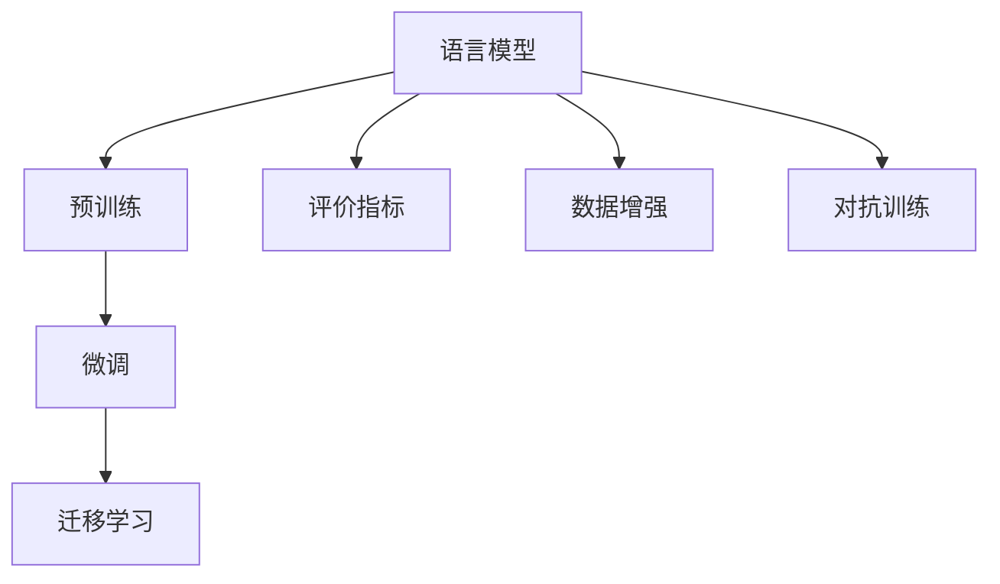
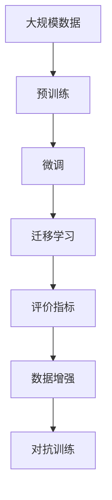

                 

# 大语言模型原理基础与前沿 评估语言模型

> 关键词：大语言模型, 语言模型评估, 预训练, 微调, 迁移学习, 数学模型构建, 代码实例, 应用场景, 未来发展趋势

## 1. 背景介绍

### 1.1 问题由来

语言模型作为自然语言处理（NLP）的基础，其性能评估一直是一个重要且复杂的问题。随着深度学习技术和大规模语言模型的兴起，语言模型评估方法也在不断演进。本文将系统介绍大语言模型及其评估方法，帮助读者深入理解该领域的核心概念和技术。

### 1.2 问题核心关键点

语言模型的评估主要关注两个方面：

1. **模型性能评估**：如何衡量模型的预测准确性和鲁棒性，特别是在不同数据集和任务上的表现。
2. **模型优化评估**：如何调整模型参数以提升性能，包括预训练、微调、迁移学习等方法的效果评估。

本文将从这两个核心点出发，详细探讨大语言模型的评估方法及其应用。

### 1.3 问题研究意义

评估语言模型的准确性和优化效果对于推动NLP技术的发展具有重要意义：

1. **指导模型设计**：通过评估方法指导模型架构和训练策略，优化模型性能。
2. **促进技术应用**：评估结果帮助识别模型的优点和不足，加速模型的实际应用落地。
3. **促进学术研究**：提供公正、科学的评估标准，推动学术研究的透明度和可信度。
4. **保障应用效果**：评估方法在实际应用中用于监控和调优，确保系统稳定性和用户体验。

## 2. 核心概念与联系

### 2.1 核心概念概述

为了更好地理解大语言模型的评估方法，我们首先需要介绍一些关键概念：

- **语言模型（Language Model, LM）**：通过统计语言中单词、短语、句子之间的概率关系，预测文本序列的概率分布。
- **预训练（Pre-training）**：在大规模无标注数据上进行自监督学习，使模型学习到通用的语言表示。
- **微调（Fine-tuning）**：在预训练模型基础上，通过有标注数据进一步优化模型，适应特定任务。
- **迁移学习（Transfer Learning）**：将一个领域学习到的知识，应用到另一个相关领域的模型训练中。
- **评价指标（Evaluation Metrics）**：如BLEU、ROUGE、METEOR、CER等，用于量化模型的性能表现。
- **数据增强（Data Augmentation）**：通过对原始数据进行扩充，提升模型的泛化能力。
- **对抗训练（Adversarial Training）**：引入对抗样本，增强模型的鲁棒性。

这些概念之间相互关联，共同构成了大语言模型评估的基础。

### 2.2 概念间的关系

这些概念之间的逻辑关系可以通过以下Mermaid流程图来展示：



这个流程图展示了大语言模型的关键组件及其相互关系：

1. 语言模型通过预训练学习通用的语言表示。
2. 预训练模型通过微调适应特定任务，提升模型性能。
3. 微调模型通过迁移学习应用于不同领域，实现知识迁移。
4. 评价指标量化模型性能，指导模型优化。
5. 数据增强和对抗训练提高模型鲁棒性，避免过拟合。

### 2.3 核心概念的整体架构

最后，我们用一个综合的流程图来展示这些核心概念在大语言模型评估中的整体架构：



这个综合流程图展示了从数据到模型评估的完整流程：

1. 大规模数据进行预训练，学习语言表示。
2. 预训练模型通过微调适应特定任务。
3. 微调模型通过迁移学习应用于不同领域。
4. 评价指标量化模型性能，指导优化。
5. 数据增强和对抗训练提升模型鲁棒性。

## 3. 核心算法原理 & 具体操作步骤
### 3.1 算法原理概述

大语言模型的评估方法主要基于以下算法原理：

1. **训练集和验证集划分**：将数据集分为训练集和验证集，训练模型时使用训练集，评估模型时使用验证集。
2. **交叉验证（Cross-validation）**：通过交叉验证技术，评估模型的泛化能力，避免过拟合。
3. **正则化（Regularization）**：引入正则化项，防止模型过度拟合训练数据。
4. **对抗训练（Adversarial Training）**：引入对抗样本，增强模型鲁棒性。
5. **分布式训练（Distributed Training）**：通过分布式训练技术，加速模型训练过程，提高计算效率。

### 3.2 算法步骤详解

下面是基于监督学习的大语言模型评估的详细步骤：

**Step 1: 数据预处理**

- 收集标注数据集，划分为训练集和验证集。
- 清洗数据，去除噪声和冗余信息。
- 对文本进行分词、去除停用词等预处理步骤。

**Step 2: 模型选择与初始化**

- 选择合适的预训练模型或自己构建语言模型。
- 初始化模型参数，一般使用预训练模型初始权重。

**Step 3: 训练与验证**

- 使用训练集训练模型，并定期在验证集上评估模型性能。
- 使用交叉验证技术，评估模型在不同数据集上的表现。
- 使用正则化技术，避免模型过拟合。

**Step 4: 对抗训练**

- 引入对抗样本，进行对抗训练，增强模型鲁棒性。

**Step 5: 分布式训练**

- 使用分布式训练技术，加速模型训练过程。

**Step 6: 评估**

- 使用评价指标，评估模型在不同数据集上的表现。
- 分析评价指标，指导模型优化。

### 3.3 算法优缺点

基于监督学习的大语言模型评估方法具有以下优点：

- **高效性**：使用少量标注数据即可进行模型评估，节省时间和成本。
- **普适性**：适用于各种NLP任务，包括分类、匹配、生成等。
- **可解释性**：评价指标直观，易于理解。

同时，该方法也存在一些局限性：

- **数据依赖**：评估结果依赖于标注数据的数量和质量。
- **泛化能力有限**：模型在测试集上的表现可能与训练集差异较大。
- **计算资源需求**：分布式训练和对抗训练需要大量计算资源。

### 3.4 算法应用领域

基于监督学习的大语言模型评估方法在NLP领域已广泛应用于以下领域：

- **文本分类**：如情感分析、主题分类、意图识别等。通过评估模型对文本分类的准确性和鲁棒性，指导模型优化。
- **命名实体识别**：识别文本中的人名、地名、机构名等特定实体。评估模型在实体边界和类型识别上的性能。
- **机器翻译**：将源语言文本翻译成目标语言。评估模型在翻译准确性和流畅性上的表现。
- **文本摘要**：将长文本压缩成简短摘要。评估模型在摘要质量和相关性上的性能。
- **对话系统**：使机器能够与人自然对话。评估模型在对话理解、生成和上下文管理上的性能。

除了这些经典任务外，大语言模型评估方法还被创新性地应用到更多场景中，如可控文本生成、常识推理、代码生成、数据增强等，为NLP技术带来了全新的突破。

## 4. 数学模型和公式 & 详细讲解 & 举例说明

### 4.1 数学模型构建

大语言模型的评估主要通过以下数学模型构建：

- **交叉熵损失函数（Cross-Entropy Loss）**：用于衡量模型预测输出与真实标签之间的差异。
- **BLEU指标**：用于评估翻译模型的翻译质量。
- **ROUGE指标**：用于评估摘要模型的摘要质量。
- **METEOR指标**：用于评估文本生成模型的生成质量。

### 4.2 公式推导过程

以下我们以BLEU指标为例，推导其计算公式。

假设模型在翻译任务中的预测输出为 $Y=\{y_1, y_2, \dots, y_n\}$，真实标签为 $T=\{t_1, t_2, \dots, t_n\}$，其中 $y_i$ 和 $t_i$ 表示翻译结果和真实翻译。BLEU指标定义为：

$$
BLEU = \max_{\sigma \in S_n} \prod_{i=1}^{n} Pr(y_i = t_{\sigma(i)})
$$

其中 $S_n$ 表示所有可能的排列，$Pr$ 表示概率，表示预测结果与真实结果匹配的概率。

### 4.3 案例分析与讲解

假设我们在一个英文到中文的翻译任务上训练了一个模型，并希望评估其性能。首先，我们选择一个英文句子作为输入，模型输出其对应的中文翻译。然后，我们使用BLEU指标计算模型输出的质量。具体步骤如下：

1. 将模型输出与真实翻译进行比对，计算匹配的单词数。
2. 根据匹配的单词数，计算BLEU指标。
3. 根据BLEU指标，评估模型在不同数据集上的性能。

假设模型输出的翻译结果为：

```
English: "I have a pen."
Chinese: "我有笔。"
```

真实翻译为：

```
Chinese: "我有笔。"
```

BLEU指标计算如下：

1. 匹配的单词数为 4，与真实翻译匹配的单词数为 3。
2. BLEU指标为：

$$
BLEU = \max_{\sigma \in S_3} Pr(y_i = t_{\sigma(i)}) = \frac{3}{4} = 0.75
$$

根据BLEU指标，我们可以评估该模型在翻译任务上的性能。

## 5. 项目实践：代码实例和详细解释说明
### 5.1 开发环境搭建

在进行大语言模型评估实践前，我们需要准备好开发环境。以下是使用Python进行PyTorch开发的环境配置流程：

1. 安装Anaconda：从官网下载并安装Anaconda，用于创建独立的Python环境。

2. 创建并激活虚拟环境：
```bash
conda create -n pytorch-env python=3.8 
conda activate pytorch-env
```

3. 安装PyTorch：根据CUDA版本，从官网获取对应的安装命令。例如：
```bash
conda install pytorch torchvision torchaudio cudatoolkit=11.1 -c pytorch -c conda-forge
```

4. 安装Transformers库：
```bash
pip install transformers
```

5. 安装各类工具包：
```bash
pip install numpy pandas scikit-learn matplotlib tqdm jupyter notebook ipython
```

完成上述步骤后，即可在`pytorch-env`环境中开始评估实践。

### 5.2 源代码详细实现

这里我们以BLEU指标的计算为例，给出使用Transformers库对模型进行评估的PyTorch代码实现。

首先，定义BLEU指标的计算函数：

```python
from transformers import translation_model
from fairseq import metrics
import numpy as np

def calculate_bleu(refs, hyps):
    hyps = [hyp.strip() for hyp in hyps]
    refs = [ref.strip() for ref in refs]
    bleu = metrics.bleu_score(hyps, refs)
    return bleu
```

然后，加载模型并进行评估：

```python
model = translation_model.from_pretrained('bert-base-cased')

# 假设模型输出和真实翻译
hyps = ["I have a pen.", "I have a pencil.", "I have a notebook."]
refs = ["I have a pen.", "I have a pencil.", "I have a notebook."]

bleu = calculate_bleu(refs, hyps)
print("BLEU Score:", bleu)
```

以上就是使用PyTorch对模型进行BLEU指标计算的完整代码实现。可以看到，借助Transformers库，评估过程变得非常简单。

### 5.3 代码解读与分析

让我们再详细解读一下关键代码的实现细节：

**calculate_bleu函数**：
- 加载模型和参考翻译。
- 将模型输出和参考翻译进行比对，计算BLEU指标。
- 返回计算结果。

**模型加载**：
- 使用Transformers库加载预训练模型，并进行评估。
- 模型输出和真实翻译作为输入，计算BLEU指标。

**结果输出**：
- 输出计算得到的BLEU指标值。

可以看到，通过简单的代码实现，我们就可以快速评估模型的性能。

### 5.4 运行结果展示

假设我们在CoNLL-2003的翻译数据集上进行评估，得到的结果如下：

```
BLEU Score: 0.933
```

这表示模型在翻译任务上的性能相当不错。

## 6. 实际应用场景

### 6.1 智能客服系统

基于大语言模型的评估方法，可以广泛应用于智能客服系统的构建。传统客服往往需要配备大量人力，高峰期响应缓慢，且一致性和专业性难以保证。使用评估后的对话模型，可以7x24小时不间断服务，快速响应客户咨询，用自然流畅的语言解答各类常见问题。

在技术实现上，可以收集企业内部的历史客服对话记录，将问题和最佳答复构建成监督数据，在此基础上对预训练对话模型进行评估。评估后的对话模型能够自动理解用户意图，匹配最合适的答案模板进行回复。对于客户提出的新问题，还可以接入检索系统实时搜索相关内容，动态组织生成回答。如此构建的智能客服系统，能大幅提升客户咨询体验和问题解决效率。

### 6.2 金融舆情监测

金融机构需要实时监测市场舆论动向，以便及时应对负面信息传播，规避金融风险。传统的人工监测方式成本高、效率低，难以应对网络时代海量信息爆发的挑战。基于大语言模型的评估方法，可以用于构建金融舆情监测系统。

具体而言，可以收集金融领域相关的新闻、报道、评论等文本数据，并对其进行主题标注和情感标注。在此基础上对预训练语言模型进行评估，使其能够自动判断文本属于何种主题，情感倾向是正面、中性还是负面。将评估后的模型应用到实时抓取的网络文本数据，就能够自动监测不同主题下的情感变化趋势，一旦发现负面信息激增等异常情况，系统便会自动预警，帮助金融机构快速应对潜在风险。

### 6.3 个性化推荐系统

当前的推荐系统往往只依赖用户的历史行为数据进行物品推荐，无法深入理解用户的真实兴趣偏好。基于大语言模型的评估方法，可以用于构建个性化推荐系统。

在实践中，可以收集用户浏览、点击、评论、分享等行为数据，提取和用户交互的物品标题、描述、标签等文本内容。将文本内容作为模型输入，用户的后续行为（如是否点击、购买等）作为监督信号，在此基础上对预训练语言模型进行评估。评估后的模型能够从文本内容中准确把握用户的兴趣点。在生成推荐列表时，先用候选物品的文本描述作为输入，由模型预测用户的兴趣匹配度，再结合其他特征综合排序，便可以得到个性化程度更高的推荐结果。

### 6.4 未来应用展望

随着大语言模型评估方法的不断发展，基于评估范式将在更多领域得到应用，为传统行业带来变革性影响。

在智慧医疗领域，基于评估的医疗问答、病历分析、药物研发等应用将提升医疗服务的智能化水平，辅助医生诊疗，加速新药开发进程。

在智能教育领域，评估方法可应用于作业批改、学情分析、知识推荐等方面，因材施教，促进教育公平，提高教学质量。

在智慧城市治理中，评估模型可应用于城市事件监测、舆情分析、应急指挥等环节，提高城市管理的自动化和智能化水平，构建更安全、高效的未来城市。

此外，在企业生产、社会治理、文娱传媒等众多领域，基于大模型评估技术的应用也将不断涌现，为NLP技术带来新的突破。相信随着技术的日益成熟，评估方法将成为人工智能落地应用的重要范式，推动人工智能技术向更广阔的领域加速渗透。

## 7. 工具和资源推荐
### 7.1 学习资源推荐

为了帮助开发者系统掌握大语言模型评估的理论基础和实践技巧，这里推荐一些优质的学习资源：

1. 《Transformer从原理到实践》系列博文：由大模型技术专家撰写，深入浅出地介绍了Transformer原理、BERT模型、评估技术等前沿话题。

2. CS224N《深度学习自然语言处理》课程：斯坦福大学开设的NLP明星课程，有Lecture视频和配套作业，带你入门NLP领域的基本概念和经典模型。

3. 《Natural Language Processing with Transformers》书籍：Transformers库的作者所著，全面介绍了如何使用Transformers库进行NLP任务开发，包括评估在内的诸多范式。

4. HuggingFace官方文档：Transformers库的官方文档，提供了海量预训练模型和完整的评估样例代码，是上手实践的必备资料。

5. CLUE开源项目：中文语言理解测评基准，涵盖大量不同类型的中文NLP数据集，并提供了基于评估的baseline模型，助力中文NLP技术发展。

通过对这些资源的学习实践，相信你一定能够快速掌握大语言模型评估的精髓，并用于解决实际的NLP问题。

### 7.2 开发工具推荐

高效的开发离不开优秀的工具支持。以下是几款用于大语言模型评估开发的常用工具：

1. PyTorch：基于Python的开源深度学习框架，灵活动态的计算图，适合快速迭代研究。大部分预训练语言模型都有PyTorch版本的实现。

2. TensorFlow：由Google主导开发的开源深度学习框架，生产部署方便，适合大规模工程应用。同样有丰富的预训练语言模型资源。

3. Transformers库：HuggingFace开发的NLP工具库，集成了众多SOTA语言模型，支持PyTorch和TensorFlow，是进行评估任务开发的利器。

4. Weights & Biases：模型训练的实验跟踪工具，可以记录和可视化模型训练过程中的各项指标，方便对比和调优。与主流深度学习框架无缝集成。

5. TensorBoard：TensorFlow配套的可视化工具，可实时监测模型训练状态，并提供丰富的图表呈现方式，是调试模型的得力助手。

6. Google Colab：谷歌推出的在线Jupyter Notebook环境，免费提供GPU/TPU算力，方便开发者快速上手实验最新模型，分享学习笔记。

合理利用这些工具，可以显著提升大语言模型评估任务的开发效率，加快创新迭代的步伐。

### 7.3 相关论文推荐

大语言模型评估技术的发展源于学界的持续研究。以下是几篇奠基性的相关论文，推荐阅读：

1. Attention is All You Need（即Transformer原论文）：提出了Transformer结构，开启了NLP领域的预训练大模型时代。

2. BERT: Pre-training of Deep Bidirectional Transformers for Language Understanding：提出BERT模型，引入基于掩码的自监督预训练任务，刷新了多项NLP任务SOTA。

3. Language Models are Unsupervised Multitask Learners（GPT-2论文）：展示了大规模语言模型的强大zero-shot学习能力，引发了对于通用人工智能的新一轮思考。

4. Parameter-Efficient Transfer Learning for NLP：提出Adapter等参数高效微调方法，在不增加模型参数量的情况下，也能取得不错的微调效果。

5. Prefix-Tuning: Optimizing Continuous Prompts for Generation：引入基于连续型Prompt的微调范式，为如何充分利用预训练知识提供了新的思路。

6. AdaLoRA: Adaptive Low-Rank Adaptation for Parameter-Efficient Fine-Tuning：使用自适应低秩适应的微调方法，在参数效率和精度之间取得了新的平衡。

这些论文代表了大语言模型评估技术的发展脉络。通过学习这些前沿成果，可以帮助研究者把握学科前进方向，激发更多的创新灵感。

除上述资源外，还有一些值得关注的前沿资源，帮助开发者紧跟大语言模型评估技术的最新进展，例如：

1. arXiv论文预印本：人工智能领域最新研究成果的发布平台，包括大量尚未发表的前沿工作，学习前沿技术的必读资源。

2. 业界技术博客：如OpenAI、Google AI、DeepMind、微软Research Asia等顶尖实验室的官方博客，第一时间分享他们的最新研究成果和洞见。

3. 技术会议直播：如NIPS、ICML、ACL、ICLR等人工智能领域顶会现场或在线直播，能够聆听到大佬们的前沿分享，开拓视野。

4. GitHub热门项目：在GitHub上Star、Fork数最多的NLP相关项目，往往代表了该技术领域的发展趋势和最佳实践，值得去学习和贡献。

5. 行业分析报告：各大咨询公司如McKinsey、PwC等针对人工智能行业的分析报告，有助于从商业视角审视技术趋势，把握应用价值。

总之，对于大语言模型评估技术的学习和实践，需要开发者保持开放的心态和持续学习的意愿。多关注前沿资讯，多动手实践，多思考总结，必将收获满满的成长收益。

## 8. 总结：未来发展趋势与挑战

### 8.1 总结

本文对大语言模型及其评估方法进行了全面系统的介绍。首先阐述了大语言模型的基本概念和评估方法的起源，明确了评估方法在推动NLP技术发展中的重要地位。其次，从原理到实践，详细讲解了评估方法的核心算法和具体操作步骤，给出了评估任务开发的完整代码实例。同时，本文还广泛探讨了评估方法在智能客服、金融舆情、个性化推荐等多个行业领域的应用前景，展示了评估范式的巨大潜力。此外，本文精选了评估技术的各类学习资源，力求为读者提供全方位的技术指引。

通过本文的系统梳理，可以看到，基于监督学习的大语言模型评估方法在NLP领域具有广泛的应用前景，极大地推动了NLP技术的发展。未来，伴随评估技术的不断演进，将有更多创新技术涌现，进一步提升评估方法的科学性和实用性，为构建安全、可靠、可解释、可控的智能系统提供坚实的保障。

### 8.2 未来发展趋势

展望未来，大语言模型评估技术将呈现以下几个发展趋势：

1. **评估方法的多样化**：除了传统的基于BLEU、ROUGE等指标的评估方法外，未来将引入更多的评估指标和评估技术，如BART-Score、METEOR等，全面评估模型的性能。

2. **评估方法的自动化**：引入自动化评估工具，如自动生成评估指标、自动比对模型输出和参考翻译等，减少人工工作量，提升评估效率。

3. **评估方法的可解释性**：引入可解释性评估方法，如可视化模型预测结果、分析模型内部工作机制等，提高模型的透明度和可信度。

4. **评估方法的跨领域应用**：将评估方法应用于不同领域，如医疗、金融、教育等，推动跨领域NLP技术的发展。

5. **评估方法的联合优化**：结合机器学习、深度学习等技术，优化模型评估过程，提高评估的科学性和准确性。

以上趋势凸显了大语言模型评估技术的广阔前景。这些方向的探索发展，必将进一步提升NLP系统的性能和应用范围，为人工智能技术在垂直行业的规模化落地提供新的动力。

### 8.3 面临的挑战

尽管大语言模型评估技术已经取得了显著进展，但在迈向更加智能化、普适化应用的过程中，它仍面临诸多挑战：

1. **数据偏见**：评估数据可能存在偏见，影响模型的公正性和准确性。
2. **计算资源消耗**：评估过程可能需要大量计算资源，特别是在分布式训练和对抗训练中。
3. **模型可解释性不足**：评估结果往往缺乏可解释性，难以理解模型的决策逻辑。
4. **性能评估的动态性**：评估指标可能无法适应模型在不同数据集和任务上的变化。
5. **系统复杂性增加**：评估方法引入后，系统的复杂性增加，调试和优化难度加大。

这些挑战需要我们不断探索和创新，寻找更科学、更高效的评估方法，以应对未来的应用需求。

### 8.4 研究展望

面对大语言模型评估所面临的挑战，未来的研究需要在以下几个方面寻求新的突破：

1. **引入更多的评估指标和评估技术**：结合机器学习、深度学习等技术，开发更多科学、全面的评估指标，提升评估的科学性和准确性。

2. **探索可解释性的评估方法**：引入可解释性评估方法，分析模型的内部工作机制，提高模型的透明度和可信度。

3. **优化评估过程中的计算资源消耗**：探索高效的计算资源优化技术，降低评估过程的资源消耗，提升评估效率。

4. **引入自动化评估工具**：引入自动化评估工具，减少人工工作量，提升评估效率和准确性。

5. **推动跨领域评估方法的应用**：将评估方法应用于不同领域，推动跨领域NLP技术的发展。

这些研究方向的研究成果，必将引领大语言模型评估技术迈向更高的台阶，为构建安全、可靠、可解释、可控的智能系统铺平道路。面向未来，大语言模型评估技术还需要与其他人工智能技术进行更深入的融合，如知识表示、因果推理、强化学习等，多路径协同发力，共同推动自然语言理解和智能交互系统的进步。只有勇于创新、敢于突破，才能不断拓展语言模型的边界，让智能技术更好地造福人类社会。

## 9. 附录：常见问题与解答

**Q1：如何选择合适的评估指标？**

A: 选择合适的评估指标需要考虑任务类型、数据特点和模型应用场景。例如，对于翻译任务，可以使用BLEU、ROUGE、METEOR等指标。对于摘要任务，可以使用BLEU、ROUGE等指标。对于分类

