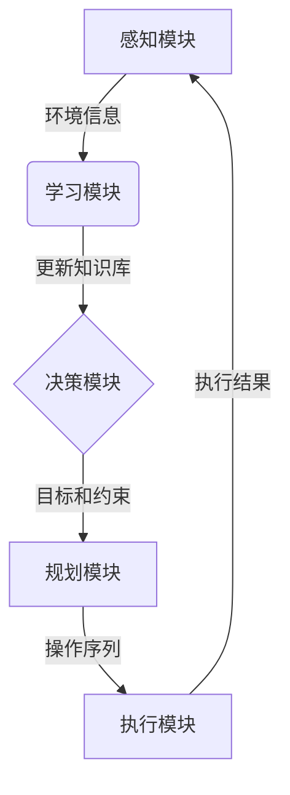

好的,我会严格遵守你提出的约束条件,以"AI Agent: AI的下一个风口 智能体与传统软件的关系"为主题,撰写一篇专业的技术博客文章。

# AI Agent: AI的下一个风口 智能体与传统软件的关系

## 1. 背景介绍

### 1.1 问题的由来

在过去几十年中,软件系统的复杂性不断增加,传统的软件开发模式已经难以满足日益增长的需求。同时,人工智能(AI)技术的快速发展为构建智能化软件系统提供了新的可能性。AI Agent作为AI与软件工程的结合体,正在成为软件开发的新趋势。

### 1.2 研究现状

目前,AI Agent的研究主要集中在以下几个方面:

1. **智能体架构**:探索AI Agent的体系结构,包括感知、决策、行为执行等模块的设计。
2. **智能决策**:研究AI Agent如何基于环境信息和知识库进行智能决策,例如强化学习、规划等技术。
3. **人机交互**:探索AI Agent与人类用户之间的自然交互方式,如自然语言处理、计算机视觉等。
4. **安全性和可解释性**:确保AI Agent的行为可控且可解释,避免不确定性和潜在风险。

### 1.3 研究意义

AI Agent的研究对于构建下一代智能软件系统具有重要意义:

1. **提高系统智能化水平**:AI Agent能够感知环境、学习知识、自主决策和行为,大大提高了软件系统的智能化水平。
2. **增强系统适应性**:AI Agent可以根据环境变化自主调整行为策略,使系统具有更强的适应性和鲁棒性。
3. **优化人机协作**:AI Agent与人类用户之间的自然交互,有助于提高协作效率和用户体验。
4. **拓展应用领域**:AI Agent技术在智能制造、智能家居、智能交通等领域具有广阔的应用前景。

### 1.4 本文结构

本文将全面介绍AI Agent的核心概念、算法原理、数学模型、实践案例和应用场景,并探讨其与传统软件的关系及未来发展趋势。文章结构如下:

```
1. 背景介绍
2. 核心概念与联系
3. 核心算法原理与具体操作步骤
4. 数学模型和公式详细讲解与举例说明
5. 项目实践:代码实例和详细解释说明
6. 实际应用场景
7. 工具和资源推荐
8. 总结:未来发展趋势与挑战
9. 附录:常见问题与解答
```

## 2. 核心概念与联系

AI Agent是指具有自主性、反应性、主动性和持续性等特征的软件实体。它能够感知环境,基于内部知识库进行推理和决策,并通过执行相应的行为与环境进行交互。AI Agent的核心概念包括:

1. **环境(Environment)**:AI Agent所处的外部世界,包括物理环境和虚拟环境。
2. **感知器(Sensors)**:用于获取环境信息的模块,如视觉、听觉、触觉等传感器。
3. **知识库(Knowledge Base)**:存储AI Agent所掌握的领域知识和经验的数据库。
4. **推理引擎(Reasoning Engine)**:基于知识库进行逻辑推理和决策的核心模块。
5. **规划器(Planner)**:根据目标和环境状态生成行为序列的模块。
6. **执行器(Actuators)**:执行AI Agent的行为操作,如机械臂、语音合成等。

AI Agent与传统软件系统的主要区别在于:

1. **自主性**:AI Agent能够根据环境变化自主做出决策和行为调整,而传统软件更多依赖预定义的规则和流程。
2. **智能化**:AI Agent融合了机器学习、知识表示等AI技术,具有一定的智能化水平,而传统软件更多依赖人工编码。
3. **交互性**:AI Agent能够与人类和环境进行自然交互,而传统软件的交互方式相对有限。
4. **适应性**:AI Agent能够通过学习不断优化自身行为策略,具有更强的适应性,而传统软件的适应性较差。

## 3. 核心算法原理与具体操作步骤

### 3.1 算法原理概述

AI Agent的核心算法原理主要包括以下几个方面:

1. **感知(Perception)**:从环境中获取信息,并对信息进行预处理和特征提取。
2. **学习(Learning)**:基于感知到的信息和反馈,不断优化知识库和决策策略。
3. **决策(Decision Making)**:根据当前状态、目标和知识库,选择最优的行为序列。
4. **规划(Planning)**:将决策生成的行为序列分解为可执行的操作步骤。
5. **执行(Execution)**:通过执行器执行规划好的操作,并观察执行结果。

这些算法原理相互关联、循环迭代,构成了AI Agent的核心工作流程,如下图所示:



### 3.2 算法步骤详解

1. **感知模块**
   - 从环境中获取原始数据,如图像、声音、文本等
   - 对原始数据进行预处理,如降噪、特征提取等
   - 将处理后的特征数据传递给学习模块

2. **学习模块**
   - 基于感知数据和反馈,使用机器学习算法更新知识库
   - 常用算法包括监督学习、无监督学习、强化学习等
   - 知识库中存储了环境模型、决策策略等关键知识

3. **决策模块**
   - 根据当前状态、目标和知识库,选择最优的行为序列
   - 常用算法包括马尔可夫决策过程、规划算法等
   - 考虑行为的效用、成本、约束等因素进行决策

4. **规划模块**
   - 将决策生成的行为序列分解为可执行的操作步骤
   - 常用算法包括启发式搜索、时间规划等
   - 生成的操作序列需要满足时序、资源等约束条件

5. **执行模块**
   - 通过执行器执行规划好的操作,如机械臂运动等
   - 观察执行结果,并将结果反馈给感知模块和学习模块
   - 形成闭环控制,持续优化Agent的行为策略

### 3.3 算法优缺点

AI Agent算法的优点:

1. **自适应性强**:能够根据环境变化自主调整决策和行为策略。
2. **智能化水平高**:融合了多种AI技术,具备一定的智能化能力。
3. **交互性好**:支持多模态交互,提高了人机协作效率。
4. **可扩展性强**:模块化设计,易于扩展和集成新功能。

AI Agent算法的缺点:

1. **决策复杂度高**:需要综合考虑多种因素进行决策,算法复杂度较高。
2. **数据驱动依赖**:算法性能很大程度上依赖于训练数据的质量和数量。
3. **可解释性差**:决策过程往往是一个黑箱,缺乏可解释性。
4. **安全性风险**:不确定的行为可能带来潜在的安全隐患。

### 3.4 算法应用领域

AI Agent算法在多个领域有着广泛的应用前景:

1. **智能制造**:智能机器人、自动化生产线等。
2. **智能家居**:智能家居助理、智能安防系统等。
3. **智能交通**:无人驾驶、智能交通管控系统等。
4. **游戏AI**:游戏角色AI、对战AI等。
5. **金融服务**:智能投资顾问、风险管理系统等。
6. **医疗健康**:智能诊断系统、康复机器人等。

## 4. 数学模型和公式详细讲解与举例说明

### 4.1 数学模型构建

AI Agent的数学模型通常建立在马尔可夫决策过程(MDP)的基础之上。MDP是一种描述序贯决策过程的数学框架,由以下五元组组成:

$$\langle S, A, P, R, \gamma\rangle$$

其中:

- $S$是状态空间,表示Agent可能处于的所有状态
- $A$是行为空间,表示Agent可以执行的所有行为
- $P(s'|s,a)$是状态转移概率,表示在状态$s$执行行为$a$后,转移到状态$s'$的概率
- $R(s,a)$是即时奖励函数,表示在状态$s$执行行为$a$所获得的即时奖励
- $\gamma \in [0,1)$是折现因子,用于平衡即时奖励和长期奖励

在MDP框架下,Agent的目标是找到一个策略$\pi: S \rightarrow A$,使得期望的累积奖励最大化:

$$\max_\pi \mathbb{E}\left[\sum_{t=0}^\infty \gamma^t R(s_t, a_t)\right]$$

其中$s_t$和$a_t$分别表示第$t$个时间步的状态和行为。

### 4.2 公式推导过程

为了求解最优策略$\pi^*$,我们可以引入状态值函数$V^\pi(s)$和行为值函数$Q^\pi(s,a)$:

$$V^\pi(s) = \mathbb{E}_\pi\left[\sum_{t=0}^\infty \gamma^t R(s_t, a_t) \mid s_0 = s\right]$$

$$Q^\pi(s,a) = \mathbb{E}_\pi\left[\sum_{t=0}^\infty \gamma^t R(s_t, a_t) \mid s_0 = s, a_0 = a\right]$$

这两个函数分别表示在策略$\pi$下,从状态$s$开始或从状态$s$执行行为$a$开始,所能获得的期望累积奖励。

利用贝尔曼方程,我们可以递推地求解$V^\pi$和$Q^\pi$:

$$V^\pi(s) = \sum_{a \in A} \pi(a|s) \left(R(s,a) + \gamma \sum_{s' \in S} P(s'|s,a) V^\pi(s')\right)$$

$$Q^\pi(s,a) = R(s,a) + \gamma \sum_{s' \in S} P(s'|s,a) \sum_{a' \in A} \pi(a'|s') Q^\pi(s',a')$$

进一步,我们可以定义最优值函数$V^*(s)$和$Q^*(s,a)$:

$$V^*(s) = \max_\pi V^\pi(s)$$

$$Q^*(s,a) = \max_\pi Q^\pi(s,a)$$

它们满足以下贝尔曼最优方程:

$$V^*(s) = \max_{a \in A} \left(R(s,a) + \gamma \sum_{s' \in S} P(s'|s,a) V^*(s')\right)$$

$$Q^*(s,a) = R(s,a) + \gamma \sum_{s' \in S} P(s'|s,a) \max_{a' \in A} Q^*(s',a')$$

通过求解这些方程,我们可以得到最优策略$\pi^*$:

$$\pi^*(s) = \arg\max_{a \in A} Q^*(s,a)$$

### 4.3 案例分析与讲解

考虑一个简单的网格世界案例,Agent的目标是从起点到达终点。每一步,Agent可以选择上下左右四个方向移动,但有一定概率会移动到其他方向。Agent获得的奖励是到达终点时获得+1分,其他情况获得-0.04分(作为行走代价)。

我们可以使用Q-Learning算法来求解最优策略。Q-Learning是一种基于时序差分的强化学习算法,它通过不断更新Q值来逼近$Q^*$函数。算法步骤如下:

1. 初始化Q表格$Q(s,a)$,所有元素初值为0
2. 对于每一个episode:
    - 初始化起始状态$s_0$
    - 对于每一个时间步$t$:
        - 选择行为$a_t = \arg\max_a Q(s_t, a)$,并执行该行为
        - 观察到新状态$s_{t+1}$和即时奖励$r_t$
        - 更新Q值:$Q(s_t, a_t) \leftarrow Q(s_t, a_t) +