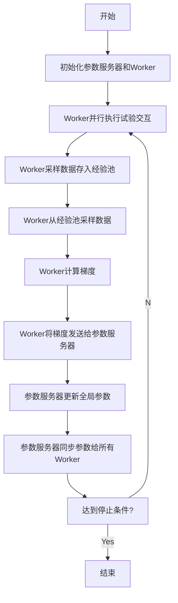
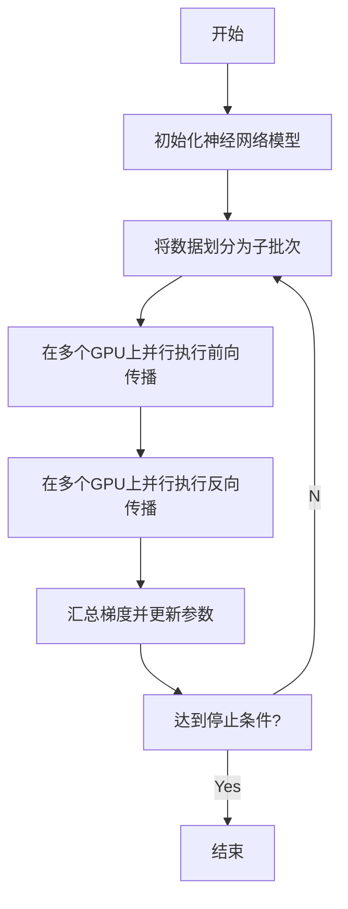

# 一切皆是映射：DQN训练加速技术：分布式训练与GPU并行

## 1. 背景介绍

### 1.1 问题的由来

在深度强化学习领域中,训练一个高质量的策略网络模型需要耗费大量的计算资源和时间。以 Deep Q-Network (DQN) 为例,它是强化学习中最成功的算法之一,在许多任务中取得了出色的表现。然而,DQN 的训练过程通常需要数百万次的试验交互,并且每一次试验都需要对当前状态进行价值评估和策略更新。这种计算量的需求使得 DQN 训练过程变得异常缓慢和低效。

因此,如何加速 DQN 训练过程成为了一个亟待解决的问题。传统的单机训练方式已经无法满足实时性和可扩展性的需求,因此需要探索新的训练加速技术。

### 1.2 研究现状

为了解决 DQN 训练缓慢的问题,研究人员提出了多种加速技术,主要包括:

1. **数据并行**:利用多个 GPU 同时处理不同的数据批次,从而加速训练过程。
2. **模型并行**:将神经网络模型划分为多个部分,并行运行在不同的设备上。
3. **分布式训练**:在多台机器上并行执行训练任务,充分利用集群的计算资源。
4. **异步更新**:允许多个 Worker 同时执行试验和更新,提高资源利用率。
5. **优化器加速**:采用更高效的优化算法,如 RMSProp、Adam 等,加快模型收敛速度。
6. **批量环境交互**:同时与多个环境交互,获取更多的训练数据。

虽然上述技术都能在一定程度上加速 DQN 训练,但它们也存在一些局限性,如通信开销大、收敛性能下降等。因此,如何有效结合和改进这些技术,设计出高效、可扩展的 DQN 训练加速方案,仍然是一个具有挑战性的研究课题。

### 1.3 研究意义

加速 DQN 训练过程具有重要的理论和实践意义:

1. **理论意义**:深入探究并优化强化学习算法的训练过程,有助于我们更好地理解算法的内在机制,从而推动算法理论的发展。
2. **实践意义**:高效的训练方法可以显著缩短模型训练时间,降低计算资源消耗,为强化学习在实际应用中的落地奠定基础。
3. **推动技术进步**:研究 DQN 训练加速技术所涉及的并行计算、分布式系统等领域,必将推动相关技术的发展和创新。

因此,研究 DQN 训练加速技术不仅可以提高强化学习算法的实用性,更重要的是为人工智能理论研究和系统优化提供新的思路和方法。

### 1.4 本文结构

本文将重点介绍两种 DQN 训练加速技术:分布式训练和 GPU 并行,并对它们的原理、实现方法和性能表现进行深入探讨。

文章的主要结构如下:

1. 背景介绍
2. 核心概念与联系
3. 核心算法原理与具体操作步骤
4. 数学模型和公式详细讲解及举例说明
5. 项目实践:代码实例和详细解释说明
6. 实际应用场景
7. 工具和资源推荐
8. 总结:未来发展趋势与挑战
9. 附录:常见问题与解答

## 2. 核心概念与联系

在介绍分布式训练和 GPU 并行技术之前,我们需要先了解一些核心概念,它们贯穿于整个 DQN 训练加速过程中。

1. **Experience Replay(经验回放)**:DQN 算法的关键创新之一,它将试验过程中产生的转换存储在经验池中,并从中采样数据用于训练,提高了数据利用效率。
2. **Target Network(目标网络)**:为了增加训练稳定性,DQN 算法维护了两个神经网络:在线网络(Online Network)用于预测当前状态的 Q 值,目标网络(Target Network)用于生成目标 Q 值。目标网络的参数是在线网络参数的滞后副本,并且会定期同步。
3. **$\epsilon$-greedy 策略**:在试验过程中,智能体以 $\epsilon$ 的概率选择随机动作(探索),以 $1-\epsilon$ 的概率选择当前状态下 Q 值最大的动作(利用)。这种策略平衡了探索和利用之间的关系。
4. **Prioritized Experience Replay(优先经验回放)**:传统的经验回放是从经验池中均匀采样数据,而优先经验回放则根据转换的重要程度(通常用 TD 误差衡量)分配不同的采样概率,从而提高训练效率。

分布式训练和 GPU 并行技术都与上述核心概念密切相关,它们的目标是加速 DQN 算法中的关键计算步骤,如经验采样、网络前向传播、梯度计算和参数更新等。下面我们将分别介绍这两种加速技术的原理和实现方法。

## 3. 核心算法原理与具体操作步骤

### 3.1 算法原理概述

#### 3.1.1 分布式训练

分布式训练的核心思想是将 DQN 训练任务分解为多个子任务,并行执行在不同的计算节点上,从而充分利用集群的计算资源。典型的分布式训练架构包括以下几个主要组件:

1. **Parameter Server(参数服务器)**:维护神经网络的全局参数,负责接收来自 Worker 的梯度并更新参数。
2. **Worker(工作节点)**:执行试验交互、数据采样、前向传播和反向传播等计算任务,并将梯度发送给参数服务器。
3. **环境模拟器**:提供模拟环境,供 Worker 与之交互以获取试验数据。
4. **经验池**:存储试验过程中产生的转换,可以是集中式的也可以是分布式的。

分布式训练过程中,多个 Worker 并行执行试验交互和数据采样,将采样到的数据发送给参数服务器进行梯度计算和参数更新。参数服务器会定期将更新后的参数同步给所有 Worker。通过这种方式,可以充分利用集群的计算能力,显著提高训练效率。

#### 3.1.2 GPU 并行

GPU 并行是在单机环境下的一种加速方案,它利用 GPU 的大规模并行计算能力,将 DQN 训练任务的计算密集型部分offload到 GPU 上执行。

GPU 并行主要包括以下两个层面:

1. **数据并行**:将一个批次的数据划分为多个子批次,并行执行在不同的 GPU 上。每个 GPU 只需处理子批次数据,最后将结果汇总即可。这种方式适用于前向传播、反向传播等可并行化的计算任务。
2. **模型并行**:将神经网络模型划分为多个部分,并行运行在不同的 GPU 上。每个 GPU 只需计算模型的一部分,通过高速互连在 GPU 之间传递中间结果。这种方式适用于超大型模型,可以突破单 GPU 显存的限制。

通过 GPU 并行,我们可以最大限度地利用 GPU 的并行计算能力,从而显著提升 DQN 训练的计算效率。

### 3.2 算法步骤详解

#### 3.2.1 分布式训练算法流程

下面我们详细介绍分布式训练算法的具体执行流程:

1. 初始化参数服务器和 Worker 节点,并在参数服务器上初始化神经网络参数。
2. 多个 Worker 并行执行试验交互,将产生的转换存储在经验池中。
3. 每个 Worker 从经验池中采样一批数据。
4. 每个 Worker 利用采样数据执行前向传播和反向传播,计算出神经网络参数的梯度。
5. 所有 Worker 将梯度发送给参数服务器。
6. 参数服务器汇总收到的梯度,并根据优化算法(如 RMSProp、Adam 等)更新全局参数。
7. 参数服务器将更新后的参数同步给所有 Worker。
8. 重复步骤 2-7,直到达到停止条件(如最大训练轮次或目标分数)。

在上述流程中,关键点在于如何高效地实现参数服务器和 Worker 之间的通信,以及如何合理划分任务以充分利用集群资源。我们将在后面的"项目实践"部分给出具体的代码实现。

#### 3.2.2 GPU 并行算法流程

GPU 并行算法流程相对简单,主要包括以下几个步骤:

1. 初始化神经网络模型,并将其复制到多个 GPU 上。
2. 将一个批次的数据划分为多个子批次。
3. 在多个 GPU 上并行执行前向传播,计算出每个子批次的输出。
4. 在多个 GPU 上并行执行反向传播,计算出每个子批次的梯度。
5. 汇总所有子批次的梯度,并使用优化算法更新神经网络参数。
6. 重复步骤 2-5,直到达到停止条件。

在 GPU 并行中,关键点在于如何高效地在 GPU 之间传输数据,以及如何平衡计算负载。我们将在后面的"项目实践"部分给出具体的代码实现。

### 3.3 算法优缺点

#### 3.3.1 分布式训练

**优点**:

1. **高度可扩展**:可以通过增加计算节点来线性扩展计算能力,满足大规模训练任务的需求。
2. **高效利用资源**:充分利用了集群的计算资源,避免了资源浪费。
3. **容错性强**:单个节点出现故障不会影响整个训练过程,具有较好的容错能力。
4. **适用于大规模数据**:可以存储和处理大规模的经验数据,提高了数据利用效率。

**缺点**:

1. **通信开销大**:参数服务器和 Worker 之间需要频繁通信,会产生一定的开销。
2. **收敛性能下降**:由于参数更新存在延迟,可能会导致收敛性能下降。
3. **系统复杂度高**:需要处理诸如负载均衡、容错、参数同步等复杂问题。
4. **资源利用率不均**:不同 Worker 之间的计算负载可能不均衡,导致资源利用率降低。

#### 3.3.2 GPU 并行

**优点**:

1. **高计算效率**:充分利用了 GPU 的大规模并行计算能力,显著提高了计算效率。
2. **编程模型简单**:相对于分布式训练,GPU 并行的编程模型更加简单和直观。
3. **无通信开销**:GPU 并行在单机环境下执行,不存在通信开销的问题。
4. **资源利用率高**:可以充分利用单机的多个 GPU 资源,提高资源利用率。

**缺点**:

1. **可扩展性有限**:受限于单机环境,GPU 并行的可扩展性较差,无法满足大规模训练任务的需求。
2. **显存容量限制**:单个 GPU 的显存容量有限,可能无法加载大型神经网络模型。
3. **成本较高**