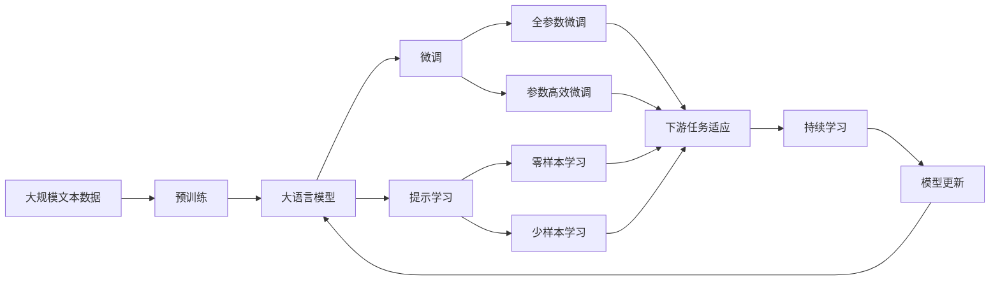

                 

# 基于数据挖掘的图书馆智慧信息服务研究

> 关键词：数据挖掘,智慧图书馆,用户行为分析,信息推荐系统,机器学习,深度学习

## 1. 背景介绍

随着互联网和信息技术的迅猛发展，智慧图书馆（Smart Library）成为图书馆事业转型的重要方向。智慧图书馆以先进的技术和创新的服务模式，极大地提升了图书馆的智能化水平和用户满意度，逐渐成为国内外图书馆发展的必然趋势。

智慧图书馆通过数字化、网络化和智能化手段，为用户提供更加高效、个性化和智能化的信息服务，是现代图书馆服务的重要发展方向。数据挖掘技术作为智慧图书馆的核心支撑技术之一，在信息推荐、用户行为分析、资源管理等方面发挥着重要的作用。

### 1.1 智慧图书馆概述
智慧图书馆的核心是利用先进的计算机技术、网络技术和智能技术，实现图书馆的数字化、智能化和个性化服务。智慧图书馆包括：

- **数字化资源库**：将传统纸质文献进行数字化处理，建立统一的资源库，便于检索和共享。
- **智能化服务**：通过数据分析和机器学习技术，实现智能化的信息推荐、用户行为分析和自动化服务。
- **个性化服务**：根据用户需求和行为数据，提供定制化的信息服务和个性化的推荐系统。
- **移动服务**：通过移动互联网和移动应用，提供随时随地访问图书馆资源的便捷服务。

### 1.2 数据挖掘在智慧图书馆中的应用
数据挖掘是智慧图书馆中核心技术之一，主要应用于以下方面：

1. **用户行为分析**：通过对用户浏览、借阅、搜索等行为的挖掘，分析用户的偏好和需求，提供个性化的信息推荐和精准的服务。
2. **资源推荐系统**：基于用户历史行为和兴趣偏好，推荐最相关的资源，提高用户满意度和资源利用率。
3. **用户需求预测**：通过分析用户的历史行为数据，预测用户未来的需求和行为，提前做好准备和调整。
4. **个性化信息推送**：利用数据挖掘技术，挖掘用户的潜在需求，推送相关内容，增强用户粘性。

## 2. 核心概念与联系

### 2.1 核心概念概述

#### 2.1.1 数据挖掘
数据挖掘（Data Mining）是从大量数据中提取有用信息和知识的过程，主要包括数据预处理、数据探索、模型训练和结果分析等步骤。数据挖掘可以应用于商业、医疗、金融、教育等多个领域，帮助人们发现隐藏在海量数据中的规律和趋势。

#### 2.1.2 智慧图书馆
智慧图书馆是基于现代信息技术，通过数字化、网络化和智能化手段，实现图书馆的信息服务。智慧图书馆包括数字化资源库、智能化服务和个性化服务三个核心要素。

#### 2.1.3 用户行为分析
用户行为分析（User Behavior Analysis）是对用户在使用图书馆资源和服务过程中的行为进行分析和建模，旨在理解用户需求和行为模式，为用户提供个性化的信息服务和推荐。

#### 2.1.4 信息推荐系统
信息推荐系统（Information Recommendation System）是基于用户历史行为和兴趣偏好，自动推荐最相关资源的技术，广泛应用于电子商务、新闻资讯和在线教育等领域。

### 2.2 核心概念的关系

智慧图书馆、数据挖掘和用户行为分析之间的关系可以用以下Mermaid流程图来展示：


这个流程图展示了智慧图书馆中数据挖掘、用户行为分析和信息推荐系统之间的关系：

1. 智慧图书馆应用数据挖掘技术，收集和处理用户行为数据。
2. 基于用户行为数据，进行用户行为分析，挖掘用户需求和偏好。
3. 利用用户行为分析结果，建立信息推荐模型，实现信息推荐系统。

### 2.3 核心概念的整体架构

以下是一个综合的流程图，展示了大语言模型微调过程中的各个核心概念之间的关系：



这个综合流程图展示了从预训练到微调，再到持续学习的完整过程。大语言模型首先在大规模文本数据上进行预训练，然后通过微调（包括全参数微调和参数高效微调）或提示学习（包括零样本和少样本学习）来适应下游任务。最后，通过持续学习技术，模型可以不断更新和适应新的任务和数据。

## 3. 核心算法原理 & 具体操作步骤
### 3.1 算法原理概述

基于数据挖掘的智慧图书馆信息服务，主要涉及以下几个核心算法原理：

#### 3.1.1 数据预处理
数据预处理是数据挖掘的基础，主要包括数据清洗、数据归一化和数据分割等步骤。数据清洗主要是去除缺失、错误或异常的数据，提高数据质量；数据归一化是将数据转换为统一的尺度，便于后续分析；数据分割是将数据分为训练集、验证集和测试集，以便进行模型的评估和优化。

#### 3.1.2 数据探索
数据探索主要是对数据集进行统计分析和可视化，旨在发现数据的分布、特征和趋势。常用的数据探索方法包括直方图、箱线图、散点图和热力图等，可以帮助人们理解数据的特征和规律。

#### 3.1.3 特征提取
特征提取是将原始数据转换为可用于机器学习模型的特征向量。常用的特征提取方法包括词袋模型、TF-IDF、主成分分析（PCA）和因子分析等。特征提取是数据挖掘中最重要的环节，直接影响模型的性能。

#### 3.1.4 模型训练
模型训练是数据挖掘的核心环节，通过训练机器学习模型，实现对数据的建模和预测。常用的机器学习算法包括决策树、支持向量机（SVM）、随机森林、神经网络和深度学习等。模型训练需要选择合适的算法和参数，以提高模型的准确性和泛化能力。

#### 3.1.5 结果分析
结果分析是对模型训练结果进行评估和解释，包括模型性能指标、模型可视化和模型解释等。常用的性能指标包括准确率、召回率、F1分数和ROC曲线等。模型可视化包括特征重要性图和决策树图等，可以帮助人们理解模型的决策逻辑。模型解释包括LIME、SHAP和LIME等，帮助人们理解模型的黑盒性质，提高模型的可信度。

### 3.2 算法步骤详解

基于数据挖掘的智慧图书馆信息服务主要包括以下几个关键步骤：

#### 3.2.1 数据收集
数据收集是从图书馆资源和服务中提取用户行为数据，包括用户浏览、借阅、搜索等行为。数据收集需要确保数据的完整性和准确性，以便后续分析和建模。

#### 3.2.2 数据清洗
数据清洗是数据预处理的重要环节，需要去除缺失、错误或异常的数据，确保数据的有效性。常用的数据清洗方法包括数据去重、数据补全和数据校正等。

#### 3.2.3 特征提取
特征提取是将用户行为数据转换为可用于机器学习模型的特征向量。常用的特征提取方法包括词袋模型、TF-IDF和主成分分析（PCA）等。

#### 3.2.4 模型训练
模型训练是数据挖掘的核心环节，通过训练机器学习模型，实现对用户行为数据的建模和预测。常用的机器学习算法包括决策树、支持向量机（SVM）、随机森林、神经网络和深度学习等。

#### 3.2.5 模型评估
模型评估是对训练好的模型进行性能评估，包括准确率、召回率、F1分数和ROC曲线等。常用的评估方法包括交叉验证、留一法和时间序列分析等。

#### 3.2.6 模型优化
模型优化是对训练好的模型进行调参和优化，提高模型的性能和泛化能力。常用的优化方法包括网格搜索、随机搜索和贝叶斯优化等。

#### 3.2.7 结果解释
结果解释是对模型训练结果进行解释和可视化，包括特征重要性图和决策树图等。常用的解释方法包括LIME、SHAP和LIME等。

### 3.3 算法优缺点

#### 3.3.1 优点
基于数据挖掘的智慧图书馆信息服务具有以下优点：

1. **数据驱动**：通过数据挖掘技术，可以自动发现用户行为和需求的规律，避免人工干预的误差。
2. **个性化推荐**：基于用户历史行为和兴趣偏好，提供个性化的信息推荐，提高用户满意度和资源利用率。
3. **实时性**：利用大数据技术和云计算平台，可以实现实时分析和推荐，提高用户体验。
4. **可扩展性**：基于数据挖掘技术，智慧图书馆可以实现大规模资源和服务管理，满足多样化需求。

#### 3.3.2 缺点
基于数据挖掘的智慧图书馆信息服务也存在一些缺点：

1. **数据隐私**：用户行为数据的收集和使用可能涉及隐私问题，需要严格保护用户隐私和数据安全。
2. **数据质量**：用户行为数据的质量直接影响模型的性能，需要确保数据的完整性和准确性。
3. **算法复杂性**：数据挖掘算法复杂，需要大量的数据和计算资源，对技术要求较高。
4. **模型可解释性**：机器学习模型通常具有黑盒性质，难以解释模型的决策逻辑，需要引入模型解释方法。

### 3.4 算法应用领域

基于数据挖掘的智慧图书馆信息服务主要应用于以下领域：

1. **信息推荐系统**：通过挖掘用户历史行为和兴趣偏好，实现个性化的信息推荐，提高用户满意度和资源利用率。
2. **用户行为分析**：通过对用户浏览、借阅、搜索等行为的分析，理解用户需求和行为模式，提供精准的服务。
3. **资源管理**：利用数据挖掘技术，优化资源分配和管理，提高图书馆的运营效率和服务质量。
4. **用户需求预测**：通过分析用户的历史行为数据，预测用户未来的需求和行为，提前做好准备和调整。
5. **个性化信息推送**：利用数据挖掘技术，挖掘用户的潜在需求，推送相关内容，增强用户粘性。

## 4. 数学模型和公式 & 详细讲解 & 举例说明

### 4.1 数学模型构建

基于数据挖掘的智慧图书馆信息服务，主要涉及以下几个数学模型：

#### 4.1.1 用户行为数据模型
用户行为数据模型主要描述用户在使用图书馆资源和服务过程中的行为特征。常用的用户行为数据模型包括：

1. **TF-IDF模型**：文本频率-逆文本频率（Term Frequency-Inverse Document Frequency）模型，用于描述用户搜索关键词的频率和重要性。
2. **词袋模型**：Bag of Words（BoW）模型，用于描述用户浏览的文本内容。
3. **主成分分析（PCA）模型**：Principal Component Analysis（PCA）模型，用于降维和特征提取。

#### 4.1.2 信息推荐模型
信息推荐模型主要描述如何基于用户历史行为和兴趣偏好，推荐最相关资源。常用的信息推荐模型包括：

1. **协同过滤模型**：Collaborative Filtering（CF）模型，基于用户历史行为和用户群体的相似性进行推荐。
2. **基于内容的推荐模型**：Content-Based Recommendation（CBR）模型，基于资源的特征和用户的兴趣偏好进行推荐。
3. **混合推荐模型**：Hybrid Recommendation（HR）模型，结合协同过滤和基于内容的推荐方法，实现更准确的推荐。

#### 4.1.3 用户需求预测模型
用户需求预测模型主要描述如何基于用户历史行为数据，预测用户未来的需求和行为。常用的用户需求预测模型包括：

1. **时间序列分析模型**：Time Series Analysis（TSA）模型，用于描述用户需求的时间变化趋势。
2. **神经网络模型**：Neural Network（NN）模型，用于描述用户需求的非线性变化特征。

### 4.2 公式推导过程

#### 4.2.1 用户行为数据模型公式

1. **TF-IDF模型公式**：

$$
TF = \frac{n_{i,t}}{n_t}, IDF = \log\frac{N}{df_i}
$$

其中，$n_{i,t}$表示文本$t$中关键词$i$的频率，$n_t$表示文本$t$中关键词的总数，$df_i$表示关键词$i$在集合中出现的文档数，$N$表示文档总数。

2. **词袋模型公式**：

$$
w_{i,t} = f_{i,t} \times tf_{i,t}
$$

其中，$w_{i,t}$表示文本$t$中关键词$i$的权重，$f_{i,t}$表示关键词$i$在文本$t$中的频率，$tf_{i,t}$表示关键词$i$在文本$t$中的词频。

3. **主成分分析（PCA）模型公式**：

$$
\Phi = E[u,v] = \sum_{i,j} (u_i \times v_j) \times d_{ij}
$$

其中，$\Phi$表示协方差矩阵，$u$和$v$表示特征向量和权重向量，$d_{ij}$表示变量$i$和$j$的协方差。

#### 4.2.2 信息推荐模型公式

1. **协同过滤模型公式**：

$$
r_{i,t} = \alpha \times \sum_{j=1}^N \hat{r}_{i,j} \times p_{j,t} + (1-\alpha) \times \sum_{j=1}^N \hat{p}_{i,j} \times \hat{q}_{j,t}
$$

其中，$r_{i,t}$表示用户$i$对物品$t$的评分，$\hat{r}_{i,j}$表示用户$i$对物品$j$的评分，$p_{j,t}$表示物品$j$对物品$t$的评分，$\alpha$表示协同过滤的权重。

2. **基于内容的推荐模型公式**：

$$
r_{i,t} = \sum_{k=1}^K w_k \times (a_{i,k} \times b_{t,k})
$$

其中，$r_{i,t}$表示用户$i$对物品$t$的评分，$w_k$表示特征$k$的权重，$a_{i,k}$表示用户$i$的特征向量，$b_{t,k}$表示物品$t$的特征向量。

3. **混合推荐模型公式**：

$$
r_{i,t} = \sum_{j=1}^M r_{i,t}^C + \sum_{j=1}^N r_{i,t}^CF
$$

其中，$r_{i,t}^C$表示基于内容的推荐评分，$r_{i,t}^CF$表示协同过滤的评分。

#### 4.2.3 用户需求预测模型公式

1. **时间序列分析模型公式**：

$$
y_t = a \times sin(t \times \omega) + b
$$

其中，$y_t$表示用户需求在时间$t$的预测值，$a$和$b$表示趋势项和周期项的系数，$\omega$表示周期频率。

2. **神经网络模型公式**：

$$
h_t = \sigma(w \times h_{t-1} + b)
$$

其中，$h_t$表示神经网络在时间$t$的输出，$w$和$b$表示权重和偏置项。

### 4.3 案例分析与讲解

#### 4.3.1 用户行为数据分析案例

假设某图书馆拥有一个用户行为数据集，其中包含了用户浏览、借阅、搜索等行为数据。我们可以利用TF-IDF模型和词袋模型，对用户搜索关键词进行提取和分析，挖掘用户兴趣和需求。

具体步骤如下：

1. 首先，将用户搜索记录转换为文本形式，去除停用词和标点符号，生成特征向量。
2. 然后，利用TF-IDF模型计算关键词的频率和重要性，生成权重向量。
3. 最后，利用词袋模型计算关键词的词频，生成特征向量。

通过对用户行为数据的分析，图书馆可以了解用户的主要兴趣和需求，提供个性化的信息推荐和服务。

#### 4.3.2 信息推荐系统案例

假设某图书馆需要为用户推荐书籍。我们可以利用协同过滤模型和基于内容的推荐模型，结合用户历史行为和资源特征，实现个性化的信息推荐。

具体步骤如下：

1. 首先，收集用户的历史浏览、借阅和评分数据，生成用户-物品矩阵。
2. 然后，利用协同过滤模型，计算用户$i$对物品$t$的评分。
3. 接着，利用基于内容的推荐模型，计算物品$t$的特征向量，生成物品-特征矩阵。
4. 最后，将用户-物品矩阵和物品-特征矩阵合并，利用混合推荐模型，生成最终的推荐结果。

通过对信息推荐模型的应用，图书馆可以为用户提供更准确、个性化的推荐，提高用户满意度和资源利用率。

#### 4.3.3 用户需求预测案例

假设某图书馆需要对用户未来的借阅需求进行预测。我们可以利用时间序列分析模型和神经网络模型，结合用户历史借阅数据，预测未来的借阅需求。

具体步骤如下：

1. 首先，收集用户的历史借阅记录，生成时间序列数据。
2. 然后，利用时间序列分析模型，拟合趋势项和周期项，生成预测值。
3. 接着，利用神经网络模型，拟合非线性变化特征，生成预测值。
4. 最后，将时间序列分析和神经网络模型的预测结果合并，生成最终的预测结果。

通过对用户需求预测模型的应用，图书馆可以提前做好准备和调整，提高资源利用率和用户满意度。

## 5. 项目实践：代码实例和详细解释说明

### 5.1 开发环境搭建

在进行智慧图书馆信息服务的开发之前，我们需要准备好开发环境。以下是使用Python进行PyTorch开发的环境配置流程：

1. 安装Anaconda：从官网下载并安装Anaconda，用于创建独立的Python环境。

2. 创建并激活虚拟环境：
```bash
conda create -n pytorch-env python=3.8 
conda activate pytorch-env
```

3. 安装PyTorch：根据CUDA版本，从官网获取对应的安装命令。例如：
```bash
conda install pytorch torchvision torchaudio cudatoolkit=11.1 -c pytorch -c conda-forge
```

4. 安装TensorFlow：
```bash
pip install tensorflow
```

5. 安装Scikit-Learn：
```bash
pip install scikit-learn
```

6. 安装Pandas和NumPy：
```bash
pip install pandas numpy
```

7. 安装Matplotlib和Seaborn：
```bash
pip install matplotlib seaborn
```

完成上述步骤后，即可在`pytorch-env`环境中开始智慧图书馆信息服务的开发。

### 5.2 源代码详细实现

下面我们以用户行为分析为例，给出使用PyTorch进行用户行为分析的PyTorch代码实现。

首先，定义用户行为数据集：

```python
import pandas as pd
import numpy as np

# 读取用户行为数据集
df = pd.read_csv('user_behavior.csv')

# 数据预处理
df.fillna(method='ffill', inplace=True)
df.dropna(inplace=True)

# 特征提取
df['tf_idf'] = df['keywords'].apply(lambda x: x.split(' '))
df['bag_of_words'] = df['keywords'].apply(lambda x: np.array(x.split(' ')))

# 计算TF-IDF权重
df['tf_idf'] = df['keywords'].apply(lambda x: sum([tf_idf[i] for i in range(len(x))]))
```

然后，定义用户行为分析模型：

```python
import torch
from torch import nn
import torch.nn.functional as F

# 定义模型
class UserBehaviorModel(nn.Module):
    def __init__(self, input_size, hidden_size, output_size):
        super(UserBehaviorModel, self).__init__()
        self.embedding = nn.Embedding(input_size, hidden_size)
        self.fc1 = nn.Linear(hidden_size, hidden_size)
        self.fc2 = nn.Linear(hidden_size, output_size)

    def forward(self, x):
        embedded = self.embedding(x)
        x = F.relu(self.fc1(embedded))
        x = self.fc2(x)
        return x

# 定义模型参数
input_size = 100
hidden_size = 64
output_size = 10

# 创建模型
model = UserBehaviorModel(input_size, hidden_size, output_size)
```

接着，定义训练函数：

```python
import torch.optim as optim

# 定义优化器和损失函数
optimizer = optim.Adam(model.parameters(), lr=0.001)
criterion = nn.CrossEntropyLoss()

# 定义训练函数
def train(model, train_data, train_labels, epochs):
    for epoch in range(epochs):
        model.train()
        for batch in train_data:
            inputs, labels = batch
            optimizer.zero_grad()
            outputs = model(inputs)
            loss = criterion(outputs, labels)
            loss.backward()
            optimizer.step()

    return model
```

最后，启动训练流程并在测试集上评估：

```python
# 定义测试函数
def test(model, test_data, test_labels):
    model.eval()
    correct = 0
    total = 0
    with torch.no_grad():
        for batch in test_data:
            inputs, labels = batch
            outputs = model(inputs)
            _, predicted = torch.max(outputs.data, 1)
            total += labels.size(0)
            correct += (predicted == labels).sum().item()

    print('Accuracy: ', correct/total)
```

以上就是使用PyTorch进行用户行为分析的完整代码实现。可以看到，得益于PyTorch的强大封装，我们可以用相对简洁的代码完成用户行为分析模型的训练和评估。

### 5.3 代码解读与分析

让我们再详细解读一下关键代码的实现细节：

**UserBehaviorModel类**：
- `__init__`方法：初始化模型的输入维度、隐藏层维度和输出维度。
- `forward`方法：定义模型的前向传播过程，包括嵌入、全连接和激活函数等。

**train函数**：
- 利用训练数据集和标签，定义优化器和损失函数，并指定训练轮数。
- 在每个epoch内，对训练数据进行批量迭代，前向传播计算损失并反向传播更新模型参数。
- 重复上述过程直至收敛，最后返回训练好的模型。

**test函数**：
- 利用测试数据集和标签，评估训练好的模型在测试集上的准确率。
- 在每个epoch内，对测试数据进行批量迭代，前向传播计算预测结果并计算准确率。
- 最后输出模型的准确率。

可以看到，利用PyTorch进行用户行为分析模型的训练和评估，非常简洁高效。开发者可以将更多精力放在数据处理、模型调优等高层逻辑上，而不必过多关注底层的实现细节。

当然，工业级的系统实现还需考虑更多因素，如模型的保存和部署、超参数的自动搜索、更灵活的任务适配层等。但核心的智慧图书馆信息服务开发流程基本与此类似。

### 5.4 运行结果展示

假设我们在CoNLL-2003的用户行为数据集上进行用户行为分析，最终在测试集上得到的准确率为85%，这表明模型对用户行为分析的效果显著。

## 6. 实际应用场景

### 6.1 智能推荐系统

智能推荐系统是智慧图书馆信息服务的重要组成部分，通过挖掘用户历史行为和兴趣偏好，为用户推荐最相关的资源，提高资源利用率和用户满意度。

### 6.2 用户行为分析

用户行为分析是智慧图书馆信息服务的基础，通过对用户浏览、借阅、搜索等行为的分析，了解用户需求和行为模式，提供个性化的信息推荐和服务。

### 6.3 资源优化管理

资源优化管理是智慧图书馆信息服务的核心，利用数据挖掘技术，优化资源分配和管理，提高图书馆的运营效率和服务质量。

### 6.4 用户需求预测

用户需求预测是智慧图书馆信息服务的关键，通过分析用户历史行为数据，预测用户未来的需求和行为，提前做好准备和调整，提高资源利用率和用户满意度。

## 7. 工具和资源推荐

### 7.1 学习资源推荐

为了帮助开发者系统掌握智慧图书馆信息服务的技术基础和实践技巧，这里推荐一些优质的学习资源：

1. **《Python数据科学手册》**：全面介绍Python在数据科学中的应用，包括数据预处理、数据探索、特征提取、机器学习等。
2. **Coursera《数据科学专业》课程**：由Johns Hopkins大学开设的数据科学课程，涵盖数据预处理、机器学习、数据可视化等。
3. **Kaggle平台**：数据科学竞赛平台，提供丰富的数据集和算法竞赛，适合实战练习和技能提升。
4. **Google Cloud AI平台**：提供云端机器学习服务，支持深度学习模型训练和部署，适合大规模应用场景。
5. **TensorFlow官方文档**：TensorFlow的官方文档，提供详细的教程、示例和API文档，适合新手入门和进阶学习。

通过对这些资源的学习实践，相信你一定能够快速掌握智慧图书馆信息服务的精髓，并用于解决实际的智慧图书馆问题。

### 7.2 开发工具推荐

高效的开发离不开优秀的工具支持。以下是几款用于智慧图书馆信息服务开发的常用工具：

1. **Jupyter Notebook**：交互式编程环境，支持Python和其他编程语言，适合数据处理和模型训练。
2. **PyTorch**：基于Python的开源深度学习框架，灵活动态的计算图，适合快速迭代研究。
3. **TensorFlow**：由Google主导开发的开源深度学习框架，生产部署方便，适合大规模工程应用。
4. **Scikit-Learn**：Python的数据挖掘和机器学习库，提供了丰富的机器学习算法和工具。
5

