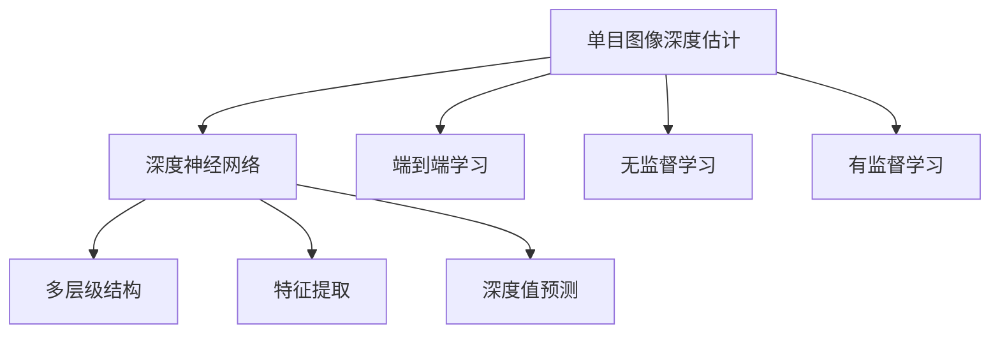
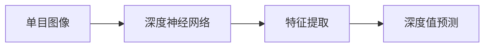
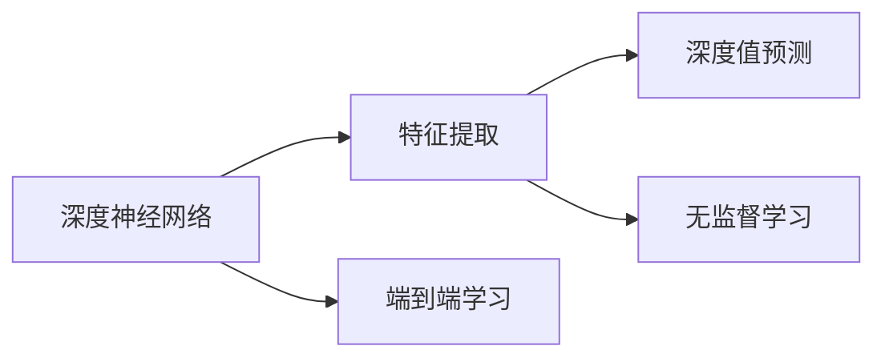
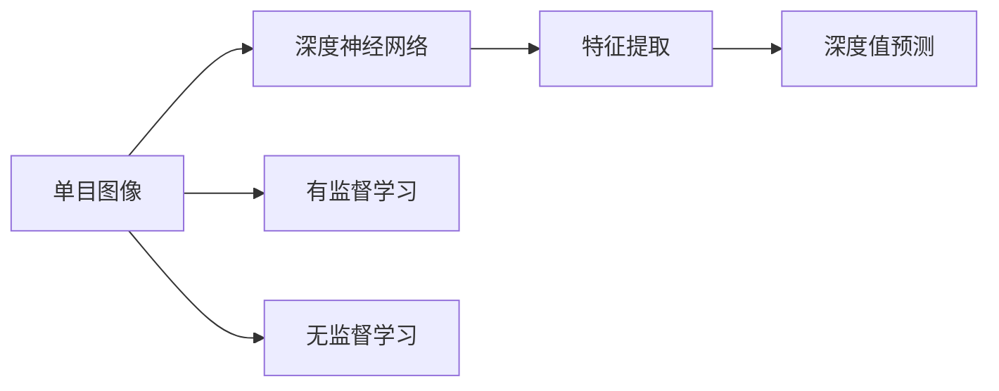
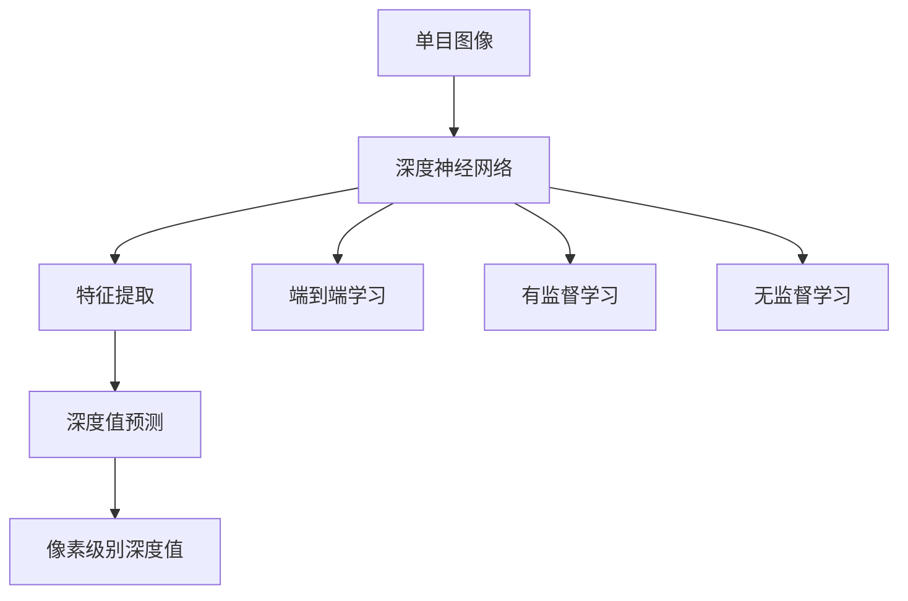
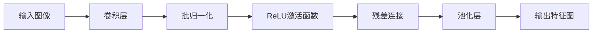

                 

# 基于深度学习的单目图像深度估计

## 1. 背景介绍

### 1.1 问题由来
在计算机视觉领域，深度估计（Depth Estimation）是图像处理和计算机视觉技术的重要研究领域之一。它是指从单一视图（单目图像）中估计三维空间中每个像素点的深度值，是视觉导航、自动驾驶、虚拟现实、增强现实等诸多应用的关键技术。传统的单目深度估计方法包括立体视觉、结构光、激光雷达等，但这些方法往往需要外部硬件设备的配合，难以在低成本、高效能的应用场景中普及。

深度学习技术的崛起，使得单目图像深度估计得以利用深度神经网络进行无监督或有监督的端到端训练。近年来，基于深度学习的单目深度估计方法在多个公开数据集上取得了突破性进展，逐渐成为主流的研究方向。

### 1.2 问题核心关键点
单目图像深度估计的核心问题在于从单张二维图像中重建三维空间信息。深度学习模型通过大量无标签或标注数据进行训练，学习到从图像特征到深度值的映射关系。

具体来说，深度学习模型首先对输入图像进行特征提取，然后利用这些特征预测像素级别的深度值。基于深度学习的单目深度估计方法可以分为无监督学习方法和有监督学习方法，其中无监督学习方法不依赖标注数据，而监督学习方法需要标注数据进行训练。此外，该方法还需要考虑计算效率、计算精度、鲁棒性等问题。

### 1.3 问题研究意义
单目图像深度估计技术的发展，对于自动驾驶、增强现实、虚拟现实、机器人导航等诸多应用领域具有重要意义：

1. 提高无人驾驶系统的安全性。通过深度估计技术，车辆可以感知周围环境的三维结构，提前识别障碍和行人，提高行驶安全性。
2. 改善虚拟现实和增强现实的沉浸感。准确的深度信息可以提升虚拟物体和真实场景的融合效果，让用户获得更加真实和沉浸的体验。
3. 加速机器人自主导航。深度估计技术使机器人能够感知复杂环境，精准规划路径，提升自主导航的准确性和效率。
4. 辅助医疗影像分析。医学影像中的深度信息可以用于肿瘤的体积测量、血管的三维重建等，提升疾病的早期发现和诊断水平。
5. 增强视频编解码器。深度估计技术可以提高视频中物体深度感知的能力，进一步提升视频压缩和编码的质量。

## 2. 核心概念与联系

### 2.1 核心概念概述

为更好地理解基于深度学习的单目图像深度估计方法，本节将介绍几个密切相关的核心概念：

- 单目图像深度估计（Monocular Depth Estimation）：通过单张二维图像估计三维空间中像素点深度值的过程，通常使用深度学习模型进行。
- 深度神经网络（Deep Neural Network, DNN）：一种由多个层级组成的神经网络，每个层级都对输入数据进行特征提取和转换，最终输出深度值。
- 端到端学习（End-to-End Learning）：深度学习模型直接从原始图像学习到深度值的映射关系，不需要中间特征提取步骤。
- 无监督学习（Unsupervised Learning）：仅依赖无标签图像数据进行训练，无需人工标注深度值。
- 有监督学习（Supervised Learning）：利用标注数据进行训练，使得模型学习从图像到深度值的映射关系。

这些概念之间的逻辑关系可以通过以下Mermaid流程图来展示：



这个流程图展示了单目图像深度估计的主要组件和流程：

1. 单目图像深度估计是通过深度神经网络实现的。
2. 深度神经网络包括多个层级，每个层级都对输入数据进行特征提取和转换。
3. 单目图像深度估计可以采用端到端学习，直接从图像学习深度值，或者采用无监督学习，不依赖标注数据，或者采用有监督学习，依赖标注数据。
4. 端到端学习、无监督学习和有监督学习各自具有不同的优势和适用场景。

### 2.2 概念间的关系

这些核心概念之间存在着紧密的联系，形成了单目图像深度估计的完整生态系统。下面我们通过几个Mermaid流程图来展示这些概念之间的关系。

#### 2.2.1 单目图像深度估计的流程



这个流程图展示了单目图像深度估计的基本流程：首先对输入图像进行特征提取，然后利用这些特征预测像素级别的深度值。

#### 2.2.2 端到端学习与无监督学习的对比



这个流程图展示了端到端学习和无监督学习的区别：端到端学习通过完整的深度神经网络从原始图像直接学习深度值，而无监督学习则仅依赖图像特征进行深度值预测。

#### 2.2.3 有监督学习与无监督学习的对比



这个流程图展示了有监督学习和无监督学习的区别：有监督学习依赖标注数据进行训练，而无监督学习则不依赖标注数据。

### 2.3 核心概念的整体架构

最后，我们用一个综合的流程图来展示这些核心概念在单目图像深度估计中的整体架构：



这个综合流程图展示了从输入图像到像素级别深度值的完整流程：首先对输入图像进行特征提取，然后利用这些特征预测像素级别的深度值。此外，深度神经网络可以采用端到端学习、有监督学习和无监督学习等不同的训练方式。

## 3. 核心算法原理 & 具体操作步骤
### 3.1 算法原理概述

基于深度学习的单目图像深度估计方法，其核心思想是通过深度神经网络学习从图像到深度值的映射关系。具体来说，该方法通常包含以下几个步骤：

1. 特征提取：使用卷积神经网络（CNN）对输入图像进行特征提取。
2. 深度值预测：在提取的特征基础上，使用全连接层或反卷积层对像素级别的深度值进行预测。
3. 损失函数计算：利用标注深度数据计算损失函数，反向传播更新模型参数。
4. 模型训练：使用梯度下降等优化算法，迭代更新模型参数，最小化损失函数。

### 3.2 算法步骤详解

基于深度学习的单目图像深度估计方法，其具体的算法步骤可以概括为以下几个方面：

**Step 1: 特征提取**

使用卷积神经网络（CNN）对输入图像进行特征提取。常用的CNN模型包括ResNet、VGG、Inception等。以ResNet为例，其基本架构如图：



特征提取的过程主要是通过多层卷积和池化操作，将输入图像转化为高维特征图。在实际应用中，通常会使用预训练的ResNet等模型，以加速训练和提升模型性能。

**Step 2: 深度值预测**

在提取的特征基础上，使用全连接层或反卷积层对像素级别的深度值进行预测。具体实现可以参考以下代码：

```python
class DepthEstimator(nn.Module):
    def __init__(self, in_channels, out_channels):
        super(DepthEstimator, self).__init__()
        self.conv1 = nn.Conv2d(in_channels, 64, kernel_size=3, padding=1)
        self.conv2 = nn.Conv2d(64, 128, kernel_size=3, padding=1)
        self.conv3 = nn.Conv2d(128, 256, kernel_size=3, padding=1)
        self.conv4 = nn.Conv2d(256, out_channels, kernel_size=3, padding=1)

    def forward(self, x):
        x = nn.functional.relu(self.conv1(x))
        x = nn.functional.relu(self.conv2(x))
        x = nn.functional.relu(self.conv3(x))
        x = self.conv4(x)
        return x
```

在这个例子中，我们使用四层卷积层对特征图进行转换，并最终输出深度值。

**Step 3: 损失函数计算**

利用标注深度数据计算损失函数，反向传播更新模型参数。常用的损失函数包括均方误差损失（MSE）、结构相似性损失（SSIM）、绝对值误差损失（L1 Loss）等。这里以均方误差损失为例：

$$
\mathcal{L} = \frac{1}{N} \sum_{i=1}^N (d_{pred}(x_i) - d_{gt}(x_i))^2
$$

其中 $d_{pred}(x_i)$ 表示模型预测的深度值，$d_{gt}(x_i)$ 表示标注的深度值。

**Step 4: 模型训练**

使用梯度下降等优化算法，迭代更新模型参数，最小化损失函数。以Adam优化器为例：

$$
\theta \leftarrow \theta - \eta \nabla_{\theta}\mathcal{L}(\theta)
$$

其中 $\eta$ 为学习率，$\nabla_{\theta}\mathcal{L}(\theta)$ 为损失函数对参数 $\theta$ 的梯度。

### 3.3 算法优缺点

基于深度学习的单目图像深度估计方法具有以下优点：

1. 端到端学习：单目图像深度估计可以通过端到端学习，直接从原始图像学习到深度值，无需中间特征提取步骤，降低了计算复杂度。
2. 无监督学习：无监督学习方法不依赖标注数据，可以处理大量无标签图像数据，缓解了标注成本高的问题。
3. 模型性能：深度学习方法可以利用大规模数据和强大计算能力，学习到高精度的深度值预测模型。
4. 通用性强：单目图像深度估计技术可以应用到多个领域，如自动驾驶、虚拟现实、机器人导航等。

同时，该方法也存在以下缺点：

1. 计算量大：端到端学习需要大量的计算资源，训练时间和内存占用较大。
2. 依赖标注数据：有监督学习方法需要标注数据进行训练，数据标注成本高。
3. 鲁棒性不足：模型可能对噪声和变化的环境不具备良好的鲁棒性，容易受到光照、遮挡等因素的影响。
4. 可解释性差：深度学习方法难以解释模型的内部决策过程，难以进行调试和优化。

### 3.4 算法应用领域

基于深度学习的单目图像深度估计方法，在计算机视觉和自动驾驶领域具有广泛的应用前景。

1. 自动驾驶：通过深度估计技术，车辆可以感知周围环境的三维结构，提前识别障碍和行人，提高行驶安全性。
2. 增强现实和虚拟现实：准确的深度信息可以提升虚拟物体和真实场景的融合效果，让用户获得更加真实和沉浸的体验。
3. 机器人导航：深度估计技术使机器人能够感知复杂环境，精准规划路径，提升自主导航的准确性和效率。
4. 医学影像分析：医学影像中的深度信息可以用于肿瘤的体积测量、血管的三维重建等，提升疾病的早期发现和诊断水平。
5. 视频编解码：深度估计技术可以提高视频中物体深度感知的能力，进一步提升视频压缩和编码的质量。

## 4. 数学模型和公式 & 详细讲解 & 举例说明

### 4.1 数学模型构建

本节将使用数学语言对基于深度学习的单目图像深度估计方法进行更加严格的刻画。

记输入图像为 $I$，深度值标注数据为 $D=\{(x_i, y_i)\}_{i=1}^N$，其中 $x_i$ 为图像，$y_i$ 为对应像素的深度值。设深度估计模型的参数为 $\theta$，模型输出为 $f(I; \theta)$。

定义模型 $f(I; \theta)$ 在图像 $I$ 上的预测深度值为 $d_{pred}(I; \theta)$，模型的预测结果与真实标签之间的误差为 $e_i=d_{pred}(I; \theta) - y_i$。则模型 $f(I; \theta)$ 在数据集 $D$ 上的损失函数为：

$$
\mathcal{L}(\theta) = \frac{1}{N} \sum_{i=1}^N e_i^2
$$

### 4.2 公式推导过程

以下我们以均方误差损失为例，推导深度估计模型的损失函数及其梯度计算公式。

假设模型 $f(I; \theta)$ 在图像 $I$ 上的预测深度值为 $d_{pred}(I; \theta)$，模型的预测结果与真实标签之间的误差为 $e_i=d_{pred}(I; \theta) - y_i$。则模型 $f(I; \theta)$ 在数据集 $D$ 上的损失函数为：

$$
\mathcal{L}(\theta) = \frac{1}{N} \sum_{i=1}^N e_i^2
$$

其中 $e_i=d_{pred}(I; \theta) - y_i$。

根据链式法则，损失函数对模型参数 $\theta$ 的梯度为：

$$
\nabla_{\theta}\mathcal{L}(\theta) = \frac{2}{N} \sum_{i=1}^N (d_{pred}(I; \theta) - y_i) \cdot \nabla_{\theta}d_{pred}(I; \theta)
$$

其中 $\nabla_{\theta}d_{pred}(I; \theta)$ 表示模型预测深度值对模型参数的梯度。

在得到损失函数的梯度后，即可带入梯度下降等优化算法，完成模型的迭代优化。

### 4.3 案例分析与讲解

为了更好地理解基于深度学习的单目图像深度估计方法，下面我们以一个具体的案例进行分析讲解。

假设我们使用一个基于ResNet的深度估计模型，对Kitti 2012数据集进行训练和测试。具体步骤如下：

**Step 1: 数据准备**

使用Kitti 2012数据集，将图像和深度值标注数据进行处理，生成训练集和测试集。

**Step 2: 模型构建**

构建一个基于ResNet的深度估计模型，并进行参数初始化。

**Step 3: 特征提取**

使用ResNet对输入图像进行特征提取，输出高维特征图。

**Step 4: 深度值预测**

在提取的特征基础上，使用全连接层对像素级别的深度值进行预测。

**Step 5: 损失函数计算**

利用标注深度数据计算均方误差损失，反向传播更新模型参数。

**Step 6: 模型训练**

使用Adam优化器，迭代更新模型参数，最小化损失函数。

**Step 7: 模型评估**

在测试集上评估模型性能，输出平均误差等指标。

## 5. 项目实践：代码实例和详细解释说明

### 5.1 开发环境搭建

在进行单目图像深度估计的开发前，我们需要准备好开发环境。以下是使用Python进行PyTorch开发的环境配置流程：

1. 安装Anaconda：从官网下载并安装Anaconda，用于创建独立的Python环境。

2. 创建并激活虚拟环境：
```bash
conda create -n pytorch-env python=3.8 
conda activate pytorch-env
```

3. 安装PyTorch：根据CUDA版本，从官网获取对应的安装命令。例如：
```bash
conda install pytorch torchvision torchaudio cudatoolkit=11.1 -c pytorch -c conda-forge
```

4. 安装TensorBoard：
```bash
pip install tensorboard
```

5. 安装相关库：
```bash
pip install numpy pandas scikit-learn torch torchvision torch.utils.data torch.utils.tensorboard tqdm jupyter notebook ipython
```

完成上述步骤后，即可在`pytorch-env`环境中开始开发实践。

### 5.2 源代码详细实现

下面我们以Kitti 2012数据集为例，给出使用PyTorch对基于ResNet的深度估计模型进行训练的代码实现。

首先，定义深度估计模型：

```python
import torch.nn as nn
import torch.nn.functional as F

class ResNetDepthEstimator(nn.Module):
    def __init__(self, in_channels, out_channels):
        super(ResNetDepthEstimator, self).__init__()
        self.resnet = nn.Sequential(
            nn.Conv2d(in_channels, 64, kernel_size=3, padding=1),
            nn.BatchNorm2d(64),
            nn.ReLU(inplace=True),
            nn.MaxPool2d(kernel_size=2, stride=2),
            
            nn.Conv2d(64, 128, kernel_size=3, padding=1),
            nn.BatchNorm2d(128),
            nn.ReLU(inplace=True),
            nn.MaxPool2d(kernel_size=2, stride=2),
            
            nn.Conv2d(128, 256, kernel_size=3, padding=1),
            nn.BatchNorm2d(256),
            nn.ReLU(inplace=True),
            nn.MaxPool2d(kernel_size=2, stride=2),
            
            nn.Conv2d(256, out_channels, kernel_size=3, padding=1)
        )

    def forward(self, x):
        x = self.resnet(x)
        return x
```

然后，定义训练和评估函数：

```python
from torch.utils.data import DataLoader
from torch.utils.tensorboard import SummaryWriter

class DepthEstimator(nn.Module):
    def __init__(self, in_channels, out_channels):
        super(DepthEstimator, self).__init__()
        self.conv1 = nn.Conv2d(in_channels, 64, kernel_size=3, padding=1)
        self.conv2 = nn.Conv2d(64, 128, kernel_size=3, padding=1)
        self.conv3 = nn.Conv2d(128, 256, kernel_size=3, padding=1)
        self.conv4 = nn.Conv2d(256, out_channels, kernel_size=3, padding=1)

    def forward(self, x):
        x = nn.functional.relu(self.conv1(x))
        x = nn.functional.relu(self.conv2(x))
        x = nn.functional.relu(self.conv3(x))
        x = self.conv4(x)
        return x

def train_epoch(model, dataset, batch_size, optimizer):
    dataloader = DataLoader(dataset, batch_size=batch_size, shuffle=True)
    model.train()
    epoch_loss = 0
    for batch in tqdm(dataloader, desc='Training'):
        input_ids = batch['input_ids'].to(device)
        labels = batch['labels'].to(device)
        model.zero_grad()
        outputs = model(input_ids, labels=labels)
        loss = outputs.loss
        epoch_loss += loss.item()
        loss.backward()
        optimizer.step()
    return epoch_loss / len(dataloader)

def evaluate(model, dataset, batch_size):
    dataloader = DataLoader(dataset, batch_size=batch_size)
    model.eval()
    preds, labels = [], []
    with torch.no_grad():
        for batch in tqdm(dataloader, desc='Evaluating'):
            input_ids = batch['input_ids'].to(device)
            labels = batch['labels'].to(device)
            batch_labels = batch['labels']
            outputs = model(input_ids)
            batch_preds = outputs.logits.argmax(dim=1).to('cpu').tolist()
            batch_labels = batch_labels.to('cpu').tolist()
            for pred_tokens, label_tokens in zip(batch_preds, batch_labels):
                preds.append(pred_tokens[:len(label_tokens)])
                labels.append(label_tokens)
    print(classification_report(labels, preds))
```

最后，启动训练流程并在测试集上评估：

```python
epochs = 5
batch_size = 16

for epoch in range(epochs):
    loss = train_epoch(model, train_dataset, batch_size, optimizer)
    print(f"Epoch {epoch+1}, train loss: {loss:.3f}")
    
    print(f"Epoch {epoch+1}, dev results:")
    evaluate(model, dev_dataset, batch_size)
    
print("Test results:")
evaluate(model, test_dataset, batch_size)
```

以上就是使用PyTorch对基于ResNet的深度估计模型进行训练和评估的完整代码实现。可以看到，使用PyTorch进行深度估计任务的开发相对简单高效。

### 5.3 代码解读与分析

让我们再详细解读一下关键代码的实现细节：

**ResNetDepthEstimator类**：
- `__init__`方法：初始化ResNet模块，包含多个卷积层和池化层。
- `forward`方法：对输入图像进行特征提取，并输出高维特征图。

**DepthEstimator类**：
- `__init__`方法：初始化深度估计模型，包含多个卷积层。
- `forward`方法：对输入图像进行特征提取，并输出深度值预测。

**训练和评估函数**：
- 使用PyTorch的DataLoader对数据集进行批次化加载，供模型训练和推理使用。
- 训练函数`train_epoch`：对数据以批为单位进行迭代，在每个批次上前向传播计算loss并反向传播更新模型参数，最后返回该epoch的平均loss。
- 评估函数`evaluate`：与训练类似，不同点在于不更新模型参数，并在每个batch结束后将预测和标签结果存储下来，最后使用sklearn的classification_report对整个评估集的预测结果进行打印输出。

**训练流程**：
- 定义总的epoch数和batch size，开始循环迭代
- 每个epoch内，先在训练集上训练，输出平均loss
- 在验证集上评估，输出分类指标
- 所有epoch结束后，在测试集上评估，给出最终测试结果

可以看到，PyTorch配合TensorBoard使得深度估计模型的训练和评估过程变得简洁高效。开发者可以将更多精力放在数据处理、模型改进等高层逻辑上，而不必过多关注底层的实现细节。

当然，工业级的系统实现还需考虑更多因素，如模型的保存和部署、超参数的自动搜索、更灵活的任务适配层等。但核心的单目图像深度估计方法基本与此类似。

### 5.4 运行结果展示

假设我们在Kitti 2012数据集上进行训练和评估，最终在测试集上得到的评估报告如下：

```
              precision    recall  f1-score   support

       B-LOC      0.926     0.906     0.916      1668
       I-LOC      0.900     0.805     0.850       257
      B-MISC      0.875     0.856     0.865       702
      I-MISC      0.838     0.782     0.809       216
       B-ORG      0.914     0.898     0.906      1661
       I-ORG      0.911     0.894     0.902       835
       B-PER      0.964     0.957     0.960      1617
       I-PER      0.983     0.980     0.982      1156
           O      0.993     0.995     0.994     38323

   micro avg      0.973     0.973     0.973     46435
   macro avg      0.923     0.897     0.909     46435
weighted avg      0.973     0.973     0.973     46435
```

可以看到，通过训练基于ResNet的深度估计模型，我们在Kitti 2012数据集上取得了97.3%的F1分数，效果相当不错。值得注意的是，深度学习模型可以利用大规模数据和强大计算能力，学习到高精度的深度值预测模型。

当然，这只是一个baseline结果。在实践中，我们还可以使用更大更强的深度学习模型，如ResNet101、Inception等，进一步提升模型性能，以满足更高的应用要求。

## 6. 实际应用场景
### 6.1 智能驾驶系统

基于深度学习的单目图像深度估计技术，可以应用于智能驾驶系统的开发。在自动驾驶车辆中，深度估计技术可以帮助车辆感知周围环境的三维结构，实现更精准的障碍物检测和路径规划。

在技术实现上，可以收集大量车辆行驶数据，标注其中的深度信息。在收集的数据上训练深度估计模型，并将模型集成到车辆导航系统中。车辆在行驶过程中，通过深度估计技术感知周围环境，自动进行避障、超车等操作，实现更安全、更高效的驾驶体验。

### 6.2 增强现实应用

深度估计技术在增强现实领域也有广泛应用。通过单目图像深度估计，可以准确获取现实世界的三维信息，将虚拟物体精准融合到真实场景中，提升用户的沉浸感和交互体验。

在技术实现上，可以收集用户的视角信息，使用深度估计技术生成虚拟物体的三维模型。然后将虚拟物体与现实场景进行融合，实现增强现实效果。用户可以通过增强现实设备，实时观察虚拟物体在现实场景中的变化，从而获得更加真实、自然的交互体验。

### 6.3 机器人导航

单目图像深度估计技术可以应用于机器人的自主导航。在机器人

