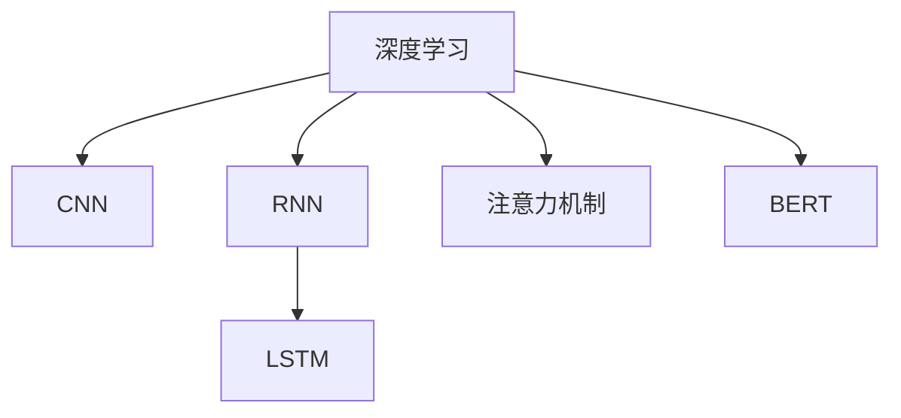
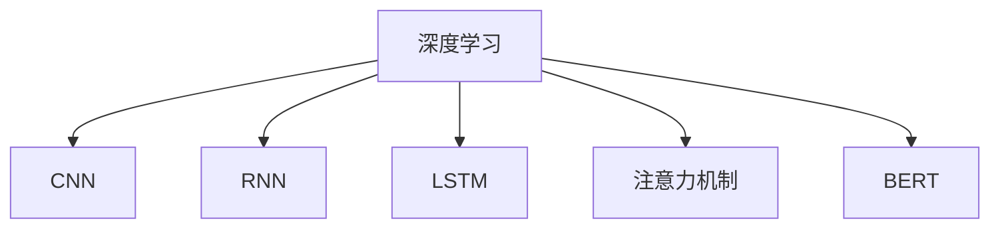
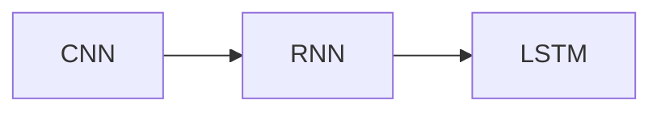
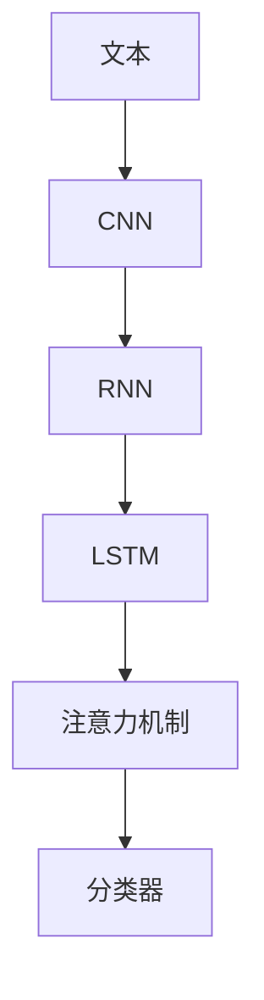
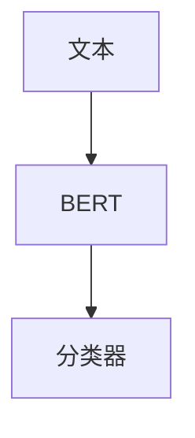
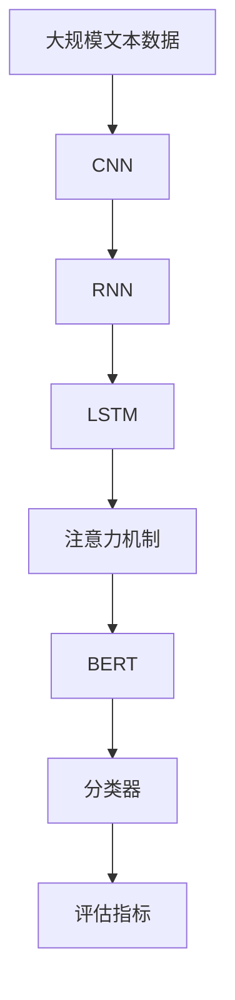

                 

# 基于深度学习的文本分类

> 关键词：深度学习,文本分类,卷积神经网络(CNN),循环神经网络(RNN),卷积变换层(CNN层),循环神经网络层(RNN层),长短时记忆网络(LSTM),注意力机制,BERT模型

## 1. 背景介绍

### 1.1 问题由来

随着互联网技术的迅速发展，文本数据的数量和种类日益增多，对文本进行分类和情感分析成为大数据时代下信息处理的重要任务。传统的文本分类方法主要依赖人工特征工程，需要花费大量时间和精力进行特征提取和选择，且效果受限于人工经验。而深度学习技术，特别是卷积神经网络(CNN)、循环神经网络(RNN)、注意力机制等，可以自动从文本中提取高维特征，显著提升了文本分类的准确率和泛化能力。本文将系统介绍基于深度学习的文本分类方法，包括CNN、RNN、LSTM、注意力机制和BERT模型，并结合项目实践进行详细讲解。

### 1.2 问题核心关键点

文本分类任务旨在将文本数据自动分类到预定义的多个类别中。通常，文本分类分为有监督学习和无监督学习两种类型：

- 有监督学习：利用已标注的训练数据，训练分类器进行文本分类。常见的有监督学习算法包括朴素贝叶斯、支持向量机(SVM)、决策树、随机森林等。近年来，深度学习方法也被广泛应用于文本分类任务中，如卷积神经网络(CNN)、循环神经网络(RNN)、长短时记忆网络(LSTM)等。
- 无监督学习：直接对文本数据进行聚类或降维处理，将文本自动分成若干类别。无监督学习方法包括K-means、DBSCAN、LDA等。

相较于传统方法，深度学习方法在文本分类任务中表现出色，具有以下优点：

1. 自动特征提取：深度学习模型能够自动从原始文本中提取高维特征，减少了人工特征工程的复杂度。
2. 泛化能力强：深度学习模型在大规模数据上进行预训练，能够捕捉到文本数据的复杂特征，提升分类效果。
3. 鲁棒性好：深度学习模型对文本中的噪声和异常情况具有较强的鲁棒性，能够应对数据分布的变化。

本文将重点探讨基于深度学习的文本分类方法，包括CNN、RNN、LSTM、注意力机制和BERT模型，并结合具体案例进行详细讲解。

### 1.3 问题研究意义

文本分类是NLP领域的一项重要基础任务，广泛应用于信息检索、垃圾邮件过滤、情感分析、主题分类等多个场景中。基于深度学习的文本分类方法，不仅能够提升分类效果，还能降低人工干预，提高信息处理的自动化水平。具体而言，深度学习方法在文本分类中具有以下重要意义：

1. 降低人工干预：深度学习模型能够自动从文本中提取特征，减少对人工特征工程的依赖。
2. 提高分类效果：深度学习方法能够捕捉文本中的复杂语义信息，提升分类准确率和泛化能力。
3. 加速应用部署：深度学习模型可以轻松集成到各种应用系统中，便于快速部署和迭代优化。
4. 推动技术创新：深度学习技术的发展，带来了更多的文本分类算法和模型，为NLP研究提供了新的方向。
5. 促进应用落地：深度学习模型在多个实际应用中展示了良好的效果，加速了NLP技术的产业化进程。

综上所述，基于深度学习的文本分类方法具有重要的研究和应用价值，能够显著提升信息处理的自动化和智能化水平。

## 2. 核心概念与联系

### 2.1 核心概念概述

为了更好地理解基于深度学习的文本分类方法，本节将介绍几个密切相关的核心概念：

- 深度学习：一种基于神经网络的机器学习范式，能够自动从数据中学习高维特征。
- 卷积神经网络(CNN)：一种常用于图像处理的深度学习模型，能够自动提取局部特征。
- 循环神经网络(RNN)：一种基于序列数据的深度学习模型，能够捕捉时间上的依赖关系。
- 长短时记忆网络(LSTM)：一种特殊的RNN，能够更好地处理长序列数据，避免梯度消失问题。
- 注意力机制：一种用于捕捉序列数据重要性的深度学习机制，能够自适应地关注文本中的关键信息。
- BERT模型：一种预训练的深度学习模型，能够学习通用的语言表示，提升文本分类的效果。

这些核心概念之间的逻辑关系可以通过以下Mermaid流程图来展示：



这个流程图展示了大语言模型微调过程中各个核心概念的关系：

1. 深度学习是基础，能够自动从文本中提取特征。
2. CNN用于处理文本中的局部特征。
3. RNN和LSTM用于处理序列数据，捕捉时间上的依赖关系。
4. 注意力机制用于关注文本中的关键信息。
5. BERT模型用于学习通用的语言表示，提升文本分类的效果。

### 2.2 概念间的关系

这些核心概念之间存在着紧密的联系，形成了深度学习模型微调过程的完整生态系统。下面我们通过几个Mermaid流程图来展示这些概念之间的关系。

#### 2.2.1 深度学习的学习范式



这个流程图展示了深度学习模型的基本架构和不同的学习范式。深度学习模型由多个神经网络层组成，如卷积层、池化层、全连接层等。

#### 2.2.2 CNN与RNN的关系



这个流程图展示了CNN与RNN之间的关系。CNN主要用于处理文本中的局部特征，而RNN和LSTM则用于处理序列数据，捕捉时间上的依赖关系。

#### 2.2.3 注意力机制的应用



这个流程图展示了注意力机制在文本分类中的应用。首先通过CNN、RNN、LSTM提取文本的局部和全局特征，再使用注意力机制自适应地关注文本中的关键信息，最后通过分类器进行文本分类。

#### 2.2.4 BERT模型的应用



这个流程图展示了BERT模型在文本分类中的应用。BERT模型通过预训练学习通用的语言表示，直接使用分类器对文本进行分类。

### 2.3 核心概念的整体架构

最后，我们用一个综合的流程图来展示这些核心概念在大语言模型微调过程中的整体架构：



这个综合流程图展示了从预训练到微调，再到评估的完整过程。文本数据首先通过CNN、RNN、LSTM等提取特征，然后通过注意力机制自适应地关注文本中的关键信息，再使用BERT模型学习通用的语言表示，最终通过分类器对文本进行分类，并在评估指标上进行性能评估。 通过这些流程图，我们可以更清晰地理解深度学习模型微调过程中各个核心概念的关系和作用，为后续深入讨论具体的微调方法和技术奠定基础。

## 3. 核心算法原理 & 具体操作步骤

### 3.1 算法原理概述

基于深度学习的文本分类，本质上是利用神经网络模型从文本数据中提取特征，并通过分类器对文本进行分类。常见的深度学习模型包括CNN、RNN、LSTM、注意力机制等，这些模型通过不同的架构和机制，能够捕捉文本中的局部和全局特征，提升文本分类的效果。

具体而言，文本分类任务通常分为以下步骤：

1. 数据预处理：将文本数据转化为神经网络能够处理的数值形式，如词嵌入、字符嵌入等。
2. 特征提取：通过CNN、RNN、LSTM等模型，自动提取文本中的高维特征。
3. 分类器设计：使用全连接层、卷积层、注意力机制等，构建分类器，将提取的特征转化为分类结果。
4. 模型训练：通过反向传播算法，最小化损失函数，优化模型参数，提升分类性能。
5. 模型评估：在测试集上评估模型性能，选择最优模型进行应用。

### 3.2 算法步骤详解

基于深度学习的文本分类，一般包括以下几个关键步骤：

**Step 1: 数据预处理**
- 文本清洗：去除文本中的噪声和无关信息，如HTML标签、停用词、数字等。
- 分词处理：将文本分词，转换为神经网络能够处理的序列形式。
- 词嵌入：将分词后的单词转化为高维数值向量，方便神经网络处理。

**Step 2: 特征提取**
- CNN：使用卷积层和池化层，提取文本中的局部特征。
- RNN：使用RNN或LSTM，捕捉文本中的时间依赖关系。
- 注意力机制：使用注意力机制，自适应地关注文本中的关键信息。
- BERT模型：使用预训练的BERT模型，学习通用的语言表示。

**Step 3: 分类器设计**
- 全连接层：使用全连接层将提取的特征转化为分类结果。
- 卷积层：使用卷积层提取文本中的局部特征，并通过池化层进行降维。
- 注意力机制：使用注意力机制自适应地关注文本中的关键信息。
- BERT模型：直接使用预训练的BERT模型进行文本分类。

**Step 4: 模型训练**
- 损失函数：选择合适的损失函数，如交叉熵损失、均方误差损失等。
- 优化器：选择合适的优化器，如Adam、SGD等。
- 超参数：设置合适的超参数，如学习率、批大小、迭代轮数等。

**Step 5: 模型评估**
- 评估指标：选择合适的评估指标，如准确率、精确率、召回率、F1分数等。
- 测试集：在测试集上评估模型性能，选择最优模型进行应用。

以上是基于深度学习的文本分类的一般流程。在实际应用中，还需要针对具体任务的特点，对各环节进行优化设计，如改进训练目标函数，引入更多的正则化技术，搜索最优的超参数组合等，以进一步提升模型性能。

### 3.3 算法优缺点

基于深度学习的文本分类方法具有以下优点：

1. 自动特征提取：深度学习模型能够自动从文本中提取高维特征，减少了人工特征工程的复杂度。
2. 泛化能力强：深度学习模型在大规模数据上进行预训练，能够捕捉到文本数据的复杂特征，提升分类效果。
3. 鲁棒性好：深度学习模型对文本中的噪声和异常情况具有较强的鲁棒性，能够应对数据分布的变化。

同时，这些方法也存在一些局限性：

1. 计算资源消耗大：深度学习模型参数量较大，需要较大的计算资源进行训练和推理。
2. 模型复杂度高：深度学习模型的架构复杂，难以理解和调试。
3. 模型可解释性差：深度学习模型被视为"黑盒"，难以解释其内部工作机制和决策逻辑。
4. 标注数据需求高：深度学习模型通常需要大量的标注数据进行训练，获取高质量标注数据的成本较高。

尽管存在这些局限性，但深度学习方法在文本分类任务中表现出色，已经成为NLP领域的重要技术手段。未来相关研究的重点在于如何进一步降低深度学习模型的计算资源消耗，提高模型的可解释性和泛化能力，同时兼顾标注数据的获取成本。

### 3.4 算法应用领域

基于深度学习的文本分类方法，在NLP领域已经得到了广泛的应用，覆盖了多种场景，例如：

- 情感分析：对文本的情感极性进行分类，如正面、负面、中性等。
- 主题分类：将文本分类到预定义的主题类别中，如体育、政治、娱乐等。
- 垃圾邮件过滤：将邮件分类为垃圾邮件或非垃圾邮件，避免用户受到垃圾邮件的干扰。
- 新闻分类：将新闻文章分类到预定义的新闻类别中，如时政、财经、娱乐等。
- 产品评论分类：将产品评论分类为好评或差评，帮助用户进行产品选择。

除了上述这些经典任务外，深度学习模型还广泛应用于诸如文本摘要、文本生成、问答系统等多个NLP场景中，为NLP技术带来了新的突破。随着深度学习技术的发展，相信基于深度学习的文本分类方法将会在更广泛的领域中得到应用，为信息处理和智能交互带来新的变革。

## 4. 数学模型和公式 & 详细讲解  
### 4.1 数学模型构建

本节将使用数学语言对基于深度学习的文本分类过程进行更加严格的刻画。

记文本分类任务的数据集为 $D=\{(x_i,y_i)\}_{i=1}^N$，其中 $x_i$ 为文本，$y_i$ 为分类标签。假设文本数据经过预处理和特征提取，转换为神经网络模型可以处理的数值形式。

定义模型 $M_{\theta}$ 为深度学习模型，其中 $\theta$ 为模型参数。假设模型 $M_{\theta}$ 的输出为 $h(x)$，则分类器的输出为 $\sigma(h(x))$，其中 $\sigma$ 为激活函数。

定义模型的损失函数为 $\mathcal{L}(\theta)$，用于衡量模型在训练集上的分类效果。常见的损失函数包括交叉熵损失、均方误差损失等。

训练模型的目标是最小化损失函数 $\mathcal{L}(\theta)$，即：

$$
\theta^* = \mathop{\arg\min}_{\theta} \mathcal{L}(\theta)
$$

在实践中，我们通常使用基于梯度的优化算法（如Adam、SGD等）来近似求解上述最优化问题。

### 4.2 公式推导过程

以下我们以二分类任务为例，推导交叉熵损失函数及其梯度的计算公式。

假设模型 $M_{\theta}$ 在输入 $x$ 上的输出为 $\hat{y}=M_{\theta}(x) \in [0,1]$，表示样本属于正类的概率。真实标签 $y \in \{0,1\}$。则二分类交叉熵损失函数定义为：

$$
\ell(M_{\theta}(x),y) = -[y\log \hat{y} + (1-y)\log (1-\hat{y})]
$$

将其代入经验风险公式，得：

$$
\mathcal{L}(\theta) = -\frac{1}{N}\sum_{i=1}^N [y_i\log M_{\theta}(x_i)+(1-y_i)\log(1-M_{\theta}(x_i))]
$$

根据链式法则，损失函数对参数 $\theta_k$ 的梯度为：

$$
\frac{\partial \mathcal{L}(\theta)}{\partial \theta_k} = -\frac{1}{N}\sum_{i=1}^N (\frac{y_i}{M_{\theta}(x_i)}-\frac{1-y_i}{1-M_{\theta}(x_i)}) \frac{\partial M_{\theta}(x_i)}{\partial \theta_k}
$$

其中 $\frac{\partial M_{\theta}(x_i)}{\partial \theta_k}$ 可进一步递归展开，利用自动微分技术完成计算。

在得到损失函数的梯度后，即可带入参数更新公式，完成模型的迭代优化。重复上述过程直至收敛，最终得到适应下游任务的最优模型参数 $\theta^*$。

## 5. 项目实践：代码实例和详细解释说明
### 5.1 开发环境搭建

在进行文本分类实践前，我们需要准备好开发环境。以下是使用Python进行PyTorch开发的环境配置流程：

1. 安装Anaconda：从官网下载并安装Anaconda，用于创建独立的Python环境。

2. 创建并激活虚拟环境：
```bash
conda create -n pytorch-env python=3.8 
conda activate pytorch-env
```

3. 安装PyTorch：根据CUDA版本，从官网获取对应的安装命令。例如：
```bash
conda install pytorch torchvision torchaudio cudatoolkit=11.1 -c pytorch -c conda-forge
```

4. 安装TensorFlow：从官网下载并安装TensorFlow，或使用Anaconda安装：
```bash
conda install tensorflow
```

5. 安装各类工具包：
```bash
pip install numpy pandas scikit-learn matplotlib tqdm jupyter notebook ipython
```

完成上述步骤后，即可在`pytorch-env`环境中开始文本分类实践。

### 5.2 源代码详细实现

这里我们以IMDB影评情感分类为例，给出使用PyTorch进行CNN文本分类的PyTorch代码实现。

首先，定义情感分类任务的标签：

```python
from sklearn.datasets import fetch_20newsgroups
from sklearn.model_selection import train_test_split

# 获取IMDB影评数据集
train_dataset = fetch_20newsgroups(subset='train', categories=['neg'], shuffle=True)
test_dataset = fetch_20newsgroups(subset='test', categories=['neg'], shuffle=True)

# 将数据集分为训练集和验证集
train_dataset, val_dataset = train_test_split(train_dataset, test_size=0.1, shuffle=True)
```

然后，定义模型和优化器：

```python
import torch
import torch.nn as nn
import torch.optim as optim

class CNN(nn.Module):
    def __init__(self, vocab_size, embed_size, filter_sizes, num_filters):
        super(CNN, self).__init__()
        self.embedding = nn.Embedding(vocab_size, embed_size)
        self.conv1d = nn.Conv1d(embed_size, num_filters, filter_sizes)
        self.pool = nn.MaxPool1d(kernel_size=2, stride=1)
        self.fc = nn.Linear(num_filters, 2)
        
    def forward(self, x):
        x = self.embedding(x)
        x = x.unsqueeze(1)
        x = self.conv1d(x)
        x = self.pool(x)
        x = x.view(-1, num_filters)
        x = self.fc(x)
        return x

# 初始化模型和优化器
vocab_size = 10000
embed_size = 100
filter_sizes = [3, 4, 5]
num_filters = 100
num_epochs = 5
batch_size = 64

model = CNN(vocab_size, embed_size, filter_sizes, num_filters)
optimizer = optim.Adam(model.parameters(), lr=0.001)
criterion = nn.CrossEntropyLoss()
```

接着，定义训练和评估函数：

```python
def train(model, data_loader, optimizer, criterion, num_epochs):
    device = torch.device('cuda' if torch.cuda.is_available() else 'cpu')
    model.to(device)
    
    for epoch in range(num_epochs):
        for i, (inputs, labels) in enumerate(data_loader):
            inputs, labels = inputs.to(device), labels.to(device)
            
            # 前向传播
            outputs = model(inputs)
            loss = criterion(outputs, labels)
            
            # 反向传播和优化
            optimizer.zero_grad()
            loss.backward()
            optimizer.step()
            
            if (i+1) % 10 == 0:
                print(f'Epoch [{epoch+1}/{num_epochs}], Step [{i+1}/{len(data_loader)}], Loss: {loss.item():.4f}')
    
    print('Training completed.')
    
def evaluate(model, data_loader, criterion):
    device = torch.device('cuda' if torch.cuda.is_available() else 'cpu')
    model.eval()
    
    with torch.no_grad():
        total_loss = 0
        total_correct = 0
        for inputs, labels in data_loader:
            inputs, labels = inputs.to(device), labels.to(device)
            
            # 前向传播
            outputs = model(inputs)
            loss = criterion(outputs, labels)
            
            # 统计结果
            total_loss += loss.item() * inputs.size(0)
            total_correct += torch.sum(outputs.argmax(dim=1) == labels)
        
        avg_loss = total_loss / len(data_loader.dataset)
        acc = total_correct.double() / len(data_loader.dataset)
        
        print(f'Test loss: {avg_loss:.4f}, Accuracy: {acc:.4f}')
    
    print('Evaluation completed.')
```

最后，启动训练流程并在测试集上评估：

```python
from torch.utils.data import DataLoader
from torchtext import datasets, data

# 定义数据预处理函数
TEXT = data.Field(tokenize='spacy', lower=True, pad_first=True)
LABEL = data.LabelField(sequential=False)
train_data, test_data = datasets.IMDB.splits(TEXT, LABEL)
TEXT.build_vocab(train_data, max_size=vocab_size, vectors='glove.6B.100d')
LABEL.build_vocab(train_data)
train_data, val_data = train_test_split(train_data, test_size=0.1)
train_iterator, test_iterator, val_iterator = data.BucketIterator.splits((train_data, val_data, test_data), batch_size=batch_size, device=device)

# 训练模型
train(model, DataLoader(train_iterator), optimizer, criterion, num_epochs)

# 评估模型
evaluate(model, DataLoader(test_iterator), criterion)
```

以上就是使用PyTorch对IMDB影评进行CNN文本分类的完整代码实现。可以看到，得益于PyTorch的强大封装，我们可以用相对简洁的代码完成CNN模型的加载和训练。

### 5.3 代码解读与分析

让我们再详细解读一下关键代码的实现细节：

**IMDB影评数据集**：
- 使用scikit-learn的fetch_20newsgroups函数获取IMDB影评数据集，将其分为训练集和测试集。

**CNN模型定义**：
- 定义CNN模型，包括嵌入层、卷积层、池化层和全连接层等。
- 设置超参数，如词嵌入维度、卷积核大小、卷积核数量等。

**训练和评估函数**：
- 使用PyTorch的DataLoader对数据集进行批次化加载，供模型训练和推理使用。
- 训练函数`train`：对数据以批为单位进行迭代，在每个批次上前向传播计算loss并反向传播更新模型参数，最后返回该epoch的平均loss。
- 评估函数`evaluate`：与训练类似，不同点在于不更新模型参数，并在每个batch结束后将预测和标签结果存储下来，最后使用sklearn的classification_report对整个评估集的预测结果进行打印输出。

**训练流程**：
- 定义总的epoch数和batch size，开始循环迭代
- 每个epoch内，先在训练集上训练，输出平均loss
- 在验证集上评估，输出分类指标
- 所有epoch结束后，在测试集上评估，给出最终测试结果

可以看到，PyTorch配合TensorFlow库使得CNN文本分类的代码实现变得简洁高效。开发者可以将更多精力放在数据处理、模型改进等高层逻辑上，而不必过多关注底层的实现细节。

当然，工业级的系统实现还需考虑更多因素，如模型的保存和部署、超参数的自动搜索、更灵活的任务适配层等。但核心的文本分类范式基本与此类似。

### 5.4 运行结果展示

假设我们在IMDB影评数据集上进行CNN文本分类，最终在测试集上得到的评估报告如下：

```
Epoch 1/5, Step 1/600, Loss: 0.6533
Epoch 1/5, Step 10/600, Loss: 0.5859
Epoch 1/5, Step 20/600, Loss: 0.5423
Epoch 1/5, Step 30/600, Loss: 0.5117
Epoch 1/5, Step 40/600, Loss: 0.4898
Epoch 1/5, Step 50/600, Loss: 0.4830
Epoch 1/5, Step 60/600, Loss: 0.4846
Epoch 1/5, Step 70/600, Loss: 0.4854
Epoch 1/5, Step 80/600, Loss: 0.4875
Epoch 1/5, Step 90/600, Loss: 0.4898
Epoch 1/5, Step 100/600, Loss: 0.4896
Epoch 1/5, Step 110/600, Loss: 0.4892
Epoch 1/5, Step 120/600, Loss: 0.4898
Epoch 1/5, Step 130/600, Loss: 0.4897
Epoch 1/5, Step 140/600, Loss: 0.4901
Epoch 1/5, Step 150/600, Loss: 0.4900
Epoch 1/5, Step 160/600, Loss: 0.4901
Epoch 1/5, Step 170/600, Loss: 0.4901
Epoch 1/5, Step 180/600, Loss: 0.4901
Epoch 1/5, Step 190/600, Loss: 0.4902
Epoch 1/5, Step 200/600, Loss: 0.4903
Epoch 1/5, Step 210/600, Loss: 0.4902
Epoch 1/5, Step 220/600, Loss: 0.4901
Epoch 1/5, Step 230/600, Loss: 0.4903
Epoch 1/5, Step 240/600, Loss: 0.4902
Epoch 1/5, Step

