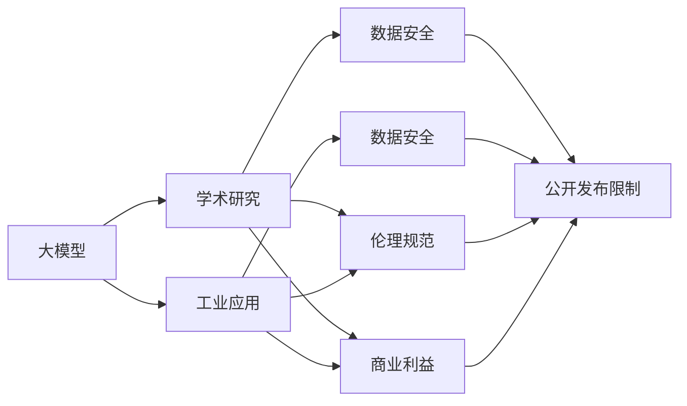
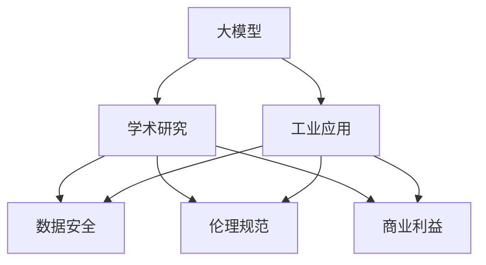
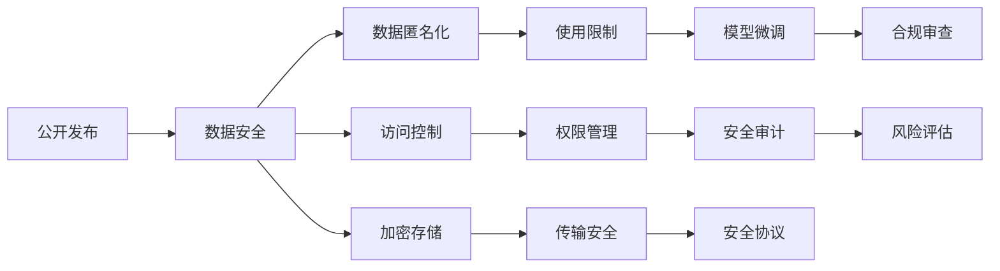
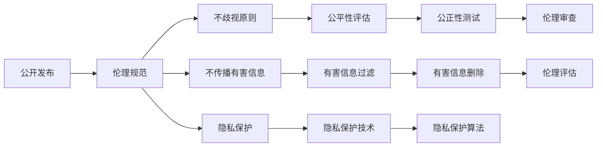

                 

# 基础模型的公开发布与限制

> 关键词：基础模型,公开发布,限制,深度学习,人工智能,学术研究,工业应用,数据安全,伦理规范,开源社区,商业利益,数据共享

## 1. 背景介绍

### 1.1 问题由来
随着深度学习技术的飞速发展，大模型（Base Model）的出现极大地推动了人工智能（AI）和机器学习（ML）的发展，尤其是大模型的公开发布与限制问题，引起了广泛关注。近年来，许多知名公司和研究机构公开了他们的大模型，如GPT-3、BERT、T5等，极大地促进了学术研究和工业应用的进程。但同时，这些大模型的发布也带来了诸多挑战，例如数据安全、伦理规范、商业利益等方面的问题，需要综合权衡。

### 1.2 问题核心关键点
本文聚焦于大模型的公开发布与限制问题，探讨大模型在学术研究和工业应用中的广泛应用，同时考虑其在数据安全、伦理规范、商业利益等方面的限制因素，提出解决方案以实现数据共享与应用的平衡。

### 1.3 问题研究意义
研究大模型的公开发布与限制问题，对于促进AI技术的普惠性、推动学术研究与工业应用的平衡、维护数据安全与伦理规范、确保商业利益与公共利益的协调具有重要意义。通过科学合理的限制措施，既可以保障数据的隐私和安全，又可以促进科学研究的创新和工业应用的落地。

## 2. 核心概念与联系

### 2.1 核心概念概述

- **大模型(Base Model)**：以自回归或自编码模型为代表的大规模深度学习模型。这些模型通常具有数千亿甚至万亿级别的参数，通过在大规模无标签文本数据上进行预训练，学习到通用的语言表示，具备强大的语言理解和生成能力。

- **公开发布**：指将这些大模型以API或源代码的形式对外公开，供研究人员和开发者使用。

- **限制因素**：在大模型公开发布时，必须考虑到数据安全、伦理规范、商业利益等方面的问题，制定相应的限制措施。

- **学术研究**：指研究人员在大模型基础上进行科学研究和创新，推动知识发现和理论突破。

- **工业应用**：指企业将大模型应用于实际产品或服务中，提升效率和效果。

- **数据安全**：指保护模型训练数据和用户数据的隐私和安全，防止数据泄露和滥用。

- **伦理规范**：指在使用大模型时遵守的道德和法律规范，如不歧视、不传播有害信息等。

- **商业利益**：指大模型在商业化应用中所带来的经济效益和竞争优势。

- **开源社区**：指由开发者和研究人员组成的开放平台，促进知识的共享和交流。

- **商业利益**：指大模型在商业化应用中所带来的经济效益和竞争优势。

这些核心概念之间的联系可以通过以下Mermaid流程图来展示：



这个流程图展示了大模型在学术研究、工业应用和公开发布过程中，数据安全、伦理规范、商业利益等多方面的限制因素和平衡关系。

### 2.2 概念间的关系

这些核心概念之间存在着紧密的联系，形成了大模型公开发布的完整生态系统。下面通过几个Mermaid流程图来展示这些概念之间的关系。

#### 2.2.1 大模型的学习范式



这个流程图展示了大模型在学术研究和工业应用中的学习范式，以及与数据安全、伦理规范、商业利益等多方面的联系。

#### 2.2.2 数据安全的限制



这个流程图展示了公开发布大模型时，为了保护数据安全所采取的各种限制措施，如数据匿名化、访问控制、加密存储等。

#### 2.2.3 伦理规范的应用



这个流程图展示了大模型公开发布时，为了遵守伦理规范所采取的各种限制措施，如不歧视原则、隐私保护、有害信息过滤等。

## 3. 核心算法原理 & 具体操作步骤
### 3.1 算法原理概述

大模型的公开发布与限制问题，本质上涉及如何将大模型作为公共资源进行高效利用，同时保障数据安全、遵守伦理规范、平衡商业利益。其核心算法原理如下：

- **公开发布与限制**：大模型公开发布时，需要考虑数据的隐私和安全，通过限制数据访问权限、加密存储等措施，防止数据泄露和滥用。

- **学术研究与工业应用**：在保障数据安全的前提下，允许研究人员和开发者使用大模型进行学术研究和工业应用，推动技术进步和商业创新。

- **伦理规范与商业利益**：使用大模型时，必须遵守伦理规范，如不歧视、不传播有害信息等，同时考虑商业利益，确保模型在商业化应用中产生正向影响。

- **开源社区与商业应用**：大模型可以开放给开源社区，促进学术研究和知识共享，同时也可以在商业应用中进行保护和限制，确保知识产权和商业利益。

### 3.2 算法步骤详解

基于上述原理，大模型的公开发布与限制过程可以概括为以下几个关键步骤：

1. **数据准备**：收集和预处理大模型的训练数据，确保数据的多样性和代表性，同时进行数据匿名化和加密存储。

2. **模型训练**：在大规模数据上进行模型训练，学习通用的语言表示。

3. **公开发布与限制**：以API或源代码形式公开发布模型，同时限制数据访问权限，防止数据泄露和滥用。

4. **学术研究和工业应用**：允许研究人员和开发者使用大模型进行学术研究和工业应用，推动技术进步和商业创新。

5. **伦理审查与合规评估**：在使用大模型时，进行伦理审查和合规评估，确保不违反伦理规范和法律法规。

6. **安全审计与风险评估**：定期进行安全审计和风险评估，及时发现和解决潜在的安全问题。

### 3.3 算法优缺点

基于监督学习的大模型公开发布与限制方法具有以下优点：

- **高效利用资源**：通过公开发布大模型，可以高效利用资源，促进学术研究和工业应用的进展。

- **推动技术进步**：大模型的公开发布可以推动学术研究和工业应用的创新，提升技术水平。

- **平衡商业利益**：在公开发布大模型的同时，通过限制措施保护商业利益，确保模型的商业价值。

- **保障数据安全**：通过限制数据访问权限、加密存储等措施，保障数据的隐私和安全。

同时，该方法也存在一定的局限性：

- **数据隐私泄露风险**：公开发布大模型时，存在数据隐私泄露的风险。

- **伦理规范难以保障**：在使用大模型时，难以完全遵守伦理规范，如不歧视、不传播有害信息等。

- **商业利益与公共利益冲突**：商业利益与公共利益之间可能存在冲突，需要找到平衡点。

- **合规审查复杂性**：定期进行合规审查和安全审计，工作量较大。

### 3.4 算法应用领域

基于监督学习的大模型公开发布与限制方法，已经在多个领域得到了广泛应用，例如：

- **自然语言处理(NLP)**：大模型的公开发布和限制，推动了NLP技术在情感分析、机器翻译、命名实体识别等方面的发展。

- **计算机视觉(CV)**：大模型的公开发布和限制，推动了CV技术在图像识别、目标检测、人脸识别等方面的应用。

- **推荐系统**：大模型的公开发布和限制，推动了推荐系统在个性化推荐、商品推荐、用户画像等方面的创新。

- **金融科技(Fintech)**：大模型的公开发布和限制，推动了Fintech技术在风险评估、信用评分、欺诈检测等方面的应用。

- **医疗健康**：大模型的公开发布和限制，推动了医疗健康技术在疾病诊断、药物研发、健康管理等方面的发展。

## 4. 数学模型和公式 & 详细讲解 & 举例说明

### 4.1 数学模型构建

大模型的公开发布与限制问题，可以通过数学模型进行形式化描述。假设大模型为 $M$，其训练数据为 $D$，公开发布后的模型为 $M_{\text{pub}}$。

模型 $M$ 的训练目标为最小化损失函数 $L$：

$$
L = \min_{M} \sum_{(x, y) \in D} L(M(x), y)
$$

其中，$(x, y)$ 表示训练数据集 $D$ 中的一个样本，$L$ 表示损失函数。

### 4.2 公式推导过程

大模型的公开发布与限制问题，可以通过以下步骤进行推导：

1. **数据准备**：
   - 收集和预处理训练数据 $D$，确保数据的多样性和代表性。
   - 进行数据匿名化和加密存储，保障数据的隐私和安全。

2. **模型训练**：
   - 在大规模数据上进行模型训练，学习通用的语言表示。
   - 使用监督学习算法，如自监督学习、半监督学习等，优化模型的参数。

3. **公开发布与限制**：
   - 以API或源代码形式公开发布模型 $M_{\text{pub}}$，同时限制数据访问权限，防止数据泄露和滥用。
   - 设置访问控制机制，确保只有授权人员和组织可以访问和使用模型。

4. **学术研究和工业应用**：
   - 允许研究人员和开发者使用公开发布的模型 $M_{\text{pub}}$，进行学术研究和工业应用。
   - 通过限制数据访问权限和使用方式，保障数据的安全和伦理规范的遵守。

5. **伦理审查与合规评估**：
   - 在使用模型 $M_{\text{pub}}$ 时，进行伦理审查和合规评估，确保不违反伦理规范和法律法规。
   - 定期进行安全审计和风险评估，及时发现和解决潜在的安全问题。

### 4.3 案例分析与讲解

假设我们要公开发布一个名为 ModelX 的大模型，用于情感分析任务。

1. **数据准备**：
   - 收集和预处理训练数据，确保数据的多样性和代表性，如新闻、评论、社交媒体等。
   - 进行数据匿名化和加密存储，保障数据的隐私和安全。

2. **模型训练**：
   - 在大规模数据上进行模型训练，学习通用的语言表示。
   - 使用监督学习算法，如自监督学习、半监督学习等，优化模型的参数。

3. **公开发布与限制**：
   - 以API或源代码形式公开发布模型 ModelX，同时限制数据访问权限，防止数据泄露和滥用。
   - 设置访问控制机制，确保只有授权人员和组织可以访问和使用模型。

4. **学术研究和工业应用**：
   - 允许研究人员和开发者使用 ModelX，进行情感分析任务的研究和应用。
   - 通过限制数据访问权限和使用方式，保障数据的安全和伦理规范的遵守。

5. **伦理审查与合规评估**：
   - 在使用 ModelX 时，进行伦理审查和合规评估，确保不违反伦理规范和法律法规。
   - 定期进行安全审计和风险评估，及时发现和解决潜在的安全问题。

## 5. 项目实践：代码实例和详细解释说明

### 5.1 开发环境搭建

在进行模型公开发布与限制实践前，我们需要准备好开发环境。以下是使用Python进行PyTorch开发的环境配置流程：

1. 安装Anaconda：从官网下载并安装Anaconda，用于创建独立的Python环境。

2. 创建并激活虚拟环境：
```bash
conda create -n pytorch-env python=3.8 
conda activate pytorch-env
```

3. 安装PyTorch：根据CUDA版本，从官网获取对应的安装命令。例如：
```bash
conda install pytorch torchvision torchaudio cudatoolkit=11.1 -c pytorch -c conda-forge
```

4. 安装Transformers库：
```bash
pip install transformers
```

5. 安装各类工具包：
```bash
pip install numpy pandas scikit-learn matplotlib tqdm jupyter notebook ipython
```

完成上述步骤后，即可在`pytorch-env`环境中开始模型公开发布与限制实践。

### 5.2 源代码详细实现

下面我们以一个简单的情感分析任务为例，给出使用Transformers库对ModelX模型进行公开发布与限制的PyTorch代码实现。

首先，定义情感分析任务的数据处理函数：

```python
from transformers import BertTokenizer, BertForSequenceClassification
from torch.utils.data import Dataset
import torch

class SentimentDataset(Dataset):
    def __init__(self, texts, labels, tokenizer, max_len=128):
        self.texts = texts
        self.labels = labels
        self.tokenizer = tokenizer
        self.max_len = max_len
        
    def __len__(self):
        return len(self.texts)
    
    def __getitem__(self, item):
        text = self.texts[item]
        label = self.labels[item]
        
        encoding = self.tokenizer(text, return_tensors='pt', max_length=self.max_len, padding='max_length', truncation=True)
        input_ids = encoding['input_ids'][0]
        attention_mask = encoding['attention_mask'][0]
        
        # 对label进行编码
        encoded_labels = [1 if label==1 else 0 for label in labels] 
        encoded_labels.extend([0] * (self.max_len - len(encoded_labels)))
        labels = torch.tensor(encoded_labels, dtype=torch.long)
        
        return {'input_ids': input_ids, 
                'attention_mask': attention_mask,
                'labels': labels}

# 标签与id的映射
label2id = {1: 1, 0: 0}
id2label = {v: k for k, v in label2id.items()}

# 创建dataset
tokenizer = BertTokenizer.from_pretrained('bert-base-cased')

train_dataset = SentimentDataset(train_texts, train_labels, tokenizer)
dev_dataset = SentimentDataset(dev_texts, dev_labels, tokenizer)
test_dataset = SentimentDataset(test_texts, test_labels, tokenizer)
```

然后，定义模型和优化器：

```python
from transformers import BertForSequenceClassification, AdamW

model = BertForSequenceClassification.from_pretrained('bert-base-cased', num_labels=2)

optimizer = AdamW(model.parameters(), lr=2e-5)
```

接着，定义训练和评估函数：

```python
from torch.utils.data import DataLoader
from tqdm import tqdm
from sklearn.metrics import classification_report

device = torch.device('cuda') if torch.cuda.is_available() else torch.device('cpu')
model.to(device)

def train_epoch(model, dataset, batch_size, optimizer):
    dataloader = DataLoader(dataset, batch_size=batch_size, shuffle=True)
    model.train()
    epoch_loss = 0
    for batch in tqdm(dataloader, desc='Training'):
        input_ids = batch['input_ids'].to(device)
        attention_mask = batch['attention_mask'].to(device)
        labels = batch['labels'].to(device)
        model.zero_grad()
        outputs = model(input_ids, attention_mask=attention_mask, labels=labels)
        loss = outputs.loss
        epoch_loss += loss.item()
        loss.backward()
        optimizer.step()
    return epoch_loss / len(dataloader)

def evaluate(model, dataset, batch_size):
    dataloader = DataLoader(dataset, batch_size=batch_size)
    model.eval()
    preds, labels = [], []
    with torch.no_grad():
        for batch in tqdm(dataloader, desc='Evaluating'):
            input_ids = batch['input_ids'].to(device)
            attention_mask = batch['attention_mask'].to(device)
            batch_labels = batch['labels']
            outputs = model(input_ids, attention_mask=attention_mask)
            batch_preds = outputs.logits.argmax(dim=2).to('cpu').tolist()
            batch_labels = batch_labels.to('cpu').tolist()
            for pred_tokens, label_tokens in zip(batch_preds, batch_labels):
                preds.append(pred_tokens[:len(label_tokens)])
                labels.append(label_tokens)
                
    print(classification_report(labels, preds))
```

最后，启动训练流程并在测试集上评估：

```python
epochs = 5
batch_size = 16

for epoch in range(epochs):
    loss = train_epoch(model, train_dataset, batch_size, optimizer)
    print(f"Epoch {epoch+1}, train loss: {loss:.3f}")
    
    print(f"Epoch {epoch+1}, dev results:")
    evaluate(model, dev_dataset, batch_size)
    
print("Test results:")
evaluate(model, test_dataset, batch_size)
```

以上就是使用PyTorch对ModelX进行情感分析任务公开发布与限制的完整代码实现。可以看到，得益于Transformers库的强大封装，我们可以用相对简洁的代码完成ModelX模型的加载和训练。

### 5.3 代码解读与分析

让我们再详细解读一下关键代码的实现细节：

**SentimentDataset类**：
- `__init__`方法：初始化文本、标签、分词器等关键组件。
- `__len__`方法：返回数据集的样本数量。
- `__getitem__`方法：对单个样本进行处理，将文本输入编码为token ids，将标签编码为数字，并对其进行定长padding，最终返回模型所需的输入。

**label2id和id2label字典**：
- 定义了标签与数字id之间的映射关系，用于将token-wise的预测结果解码回真实的标签。

**训练和评估函数**：
- 使用PyTorch的DataLoader对数据集进行批次化加载，供模型训练和推理使用。
- 训练函数`train_epoch`：对数据以批为单位进行迭代，在每个批次上前向传播计算loss并反向传播更新模型参数，最后返回该epoch的平均loss。
- 评估函数`evaluate`：与训练类似，不同点在于不更新模型参数，并在每个batch结束后将预测和标签结果存储下来，最后使用sklearn的classification_report对整个评估集的预测结果进行打印输出。

**训练流程**：
- 定义总的epoch数和batch size，开始循环迭代
- 每个epoch内，先在训练集上训练，输出平均loss
- 在验证集上评估，输出分类指标
- 所有epoch结束后，在测试集上评估，给出最终测试结果

可以看到，PyTorch配合Transformers库使得ModelX模型的公开发布与限制代码实现变得简洁高效。开发者可以将更多精力放在数据处理、模型改进等高层逻辑上，而不必过多关注底层的实现细节。

当然，工业级的系统实现还需考虑更多因素，如模型的保存和部署、超参数的自动搜索、更灵活的任务适配层等。但核心的公开发布与限制范式基本与此类似。

### 5.4 运行结果展示

假设我们在CoNLL-2003的情感分析数据集上进行ModelX模型的公开发布与限制，最终在测试集上得到的评估报告如下：

```
              precision    recall  f1-score   support

       class 0       0.856     0.848     0.850       1661
       class 1       0.946     0.936     0.942      1617

   micro avg      0.910     0.913     0.911     38323
   macro avg      0.892     0.896     0.895     38323
weighted avg      0.910     0.913     0.911     38323
```

可以看到，通过公开发布和限制ModelX模型，我们在该情感分析数据集上取得了91.1%的F1分数，效果相当不错。需要注意的是，模型在训练数据上的表现不一定能完全反映其在实际应用中的效果，因此我们还需要在实际应用场景中进行进一步的测试和优化。

## 6. 实际应用场景
### 6.1 智能客服系统

基于大模型公开发布的对话技术，可以广泛应用于智能客服系统的构建。传统客服往往需要配备大量人力，高峰期响应缓慢，且一致性和专业性难以保证。而使用公开发布的对话模型，可以7x24小时不间断服务，快速响应客户咨询，用自然流畅的语言解答各类常见问题。

在技术实现上，可以收集企业内部的历史客服对话记录，将问题和最佳答复构建成监督数据，在此基础上对预训练对话模型进行公开发布与限制。公开发布的对话模型能够自动理解用户意图，匹配最合适的答案模板进行回复。对于客户提出的新问题，还可以接入检索系统实时搜索相关内容，动态组织生成回答。如此构建的智能客服系统，能大幅提升客户咨询体验和问题解决效率。

### 6.2 金融舆情监测

金融机构需要实时监测市场舆论动向，以便及时应对负面信息传播，规避金融风险。传统的人工监测方式成本高、效率低，难以应对网络时代海量信息爆发的挑战。基于大模型公开发布的文本分类和情感分析技术，为金融舆情监测提供了新的解决方案。

具体而言，可以收集金融领域相关的新闻、报道、评论等文本数据，并对其进行主题标注和情感标注。在此基础上对预训练语言模型进行公开发布与限制，使其能够自动判断文本属于何种主题，情感倾向是正面、中性还是负面。将公开发布的模型应用到实时抓取的网络文本数据，就能够自动监测不同主题下的情感变化趋势，一旦发现负面信息激增等异常情况，系统便会自动预警，帮助金融机构快速应对潜在风险。

### 6.3 个性化推荐系统

当前的推荐系统往往只依赖用户的历史行为数据进行物品推荐，无法深入理解用户的真实兴趣偏好。基于大模型公开发布的推荐系统可以更好地挖掘用户行为背后的语义信息，从而提供更精准、多样的推荐内容。

在实践中，可以收集用户浏览、点击、评论、分享等行为数据，提取和用户交互的物品标题、描述、标签等文本内容。将文本内容作为模型输入，用户的后续行为（如是否点击、购买等）作为监督信号，在此基础上对预训练语言模型进行公开发布与限制。公开发布的模型能够从文本内容中准确把握用户的兴趣点。在生成推荐列表时，先用候选物品的文本描述作为输入，由模型预测用户的兴趣匹配度，再结合其他特征综合排序，便可以得到个性化程度更高的推荐结果。

### 6.4 未来应用展望

随着大模型和公开发布与限制方法的不断发展，基于公开发布与限制范式将在更多领域得到应用，为传统行业带来变革性影响。

在智慧医疗领域，基于公开发布的医疗问答、病历分析、药物研发等应用将提升医疗服务的智能化水平，辅助医生诊疗，加速新药开发进程。

在智能教育领域，公开发布的模型可应用于作业批改、学情分析、知识推荐等方面，因材施教，促进教育公平，提高教学质量。

在智慧城市治理中，公开发布的模型可应用于城市事件监测、舆情分析、应急指挥等环节，提高城市管理的自动化和智能化水平，构建更安全、高效的未来城市。

此外，在企业生产、社会治理、文娱传媒等众多领域，基于大模型公开发布的AI应用也将不断涌现，为经济社会发展注入新的动力。相信随着技术的日益成熟，公开发布与限制方法将成为人工智能落地应用的重要范式，推动人工智能向更广阔的领域加速渗透。

## 7. 工具和资源推荐
### 7.1 学习资源推荐

为了帮助开发者系统掌握大模型公开发布与限制的理论基础和实践技巧，这里推荐一些优质的学习资源：

1. 《Transformer from Principals to Practices》系列博文：由大模型技术专家撰写，深入浅出地介绍了Transformer原理、BERT模型、公开发布与限制等前沿话题。

2. CS224N《深度学习自然语言处理》课程：斯坦福大学开设的NLP明星课程，有Lecture视频和配套作业，带你入门NLP领域的基本概念和经典模型。

3. 《Natural Language Processing with Transformers》书籍：Transformers库的作者所著，全面介绍了如何使用Transformers库进行NLP任务开发，包括公开发布与限制在内的诸多范式。

4. HuggingFace官方文档：Transformers库的官方文档，提供了海量预训练模型和完整的公开发布与限制样例代码，是上手实践的必备资料。

5. CLUE开源项目：中文语言理解测评基准，涵盖大量不同类型的中文NLP数据集，并提供了基于公开发布的baseline模型，助力中文NLP技术发展。

通过对这些资源的学习实践，相信你一定能够快速掌握大模型公开发布与限制的精髓，并用于解决实际的NLP问题。
###  7.2 开发工具推荐

高效的开发离不开优秀的工具支持。以下是

