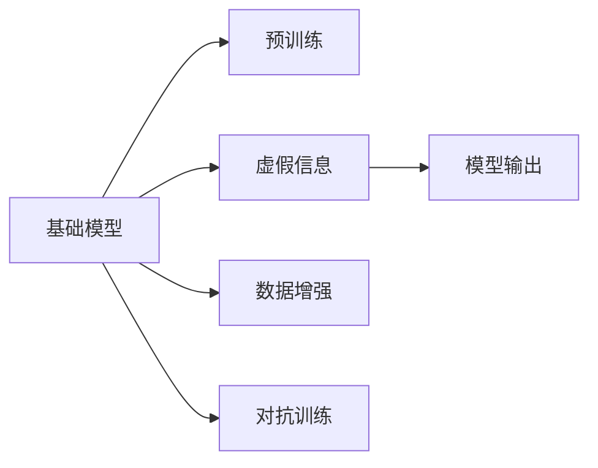
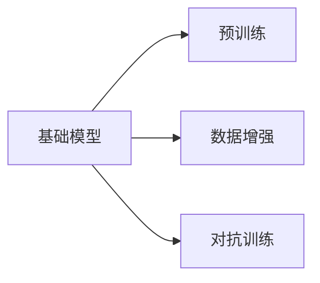
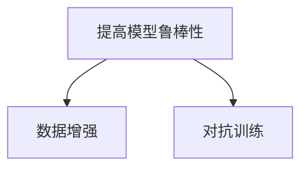
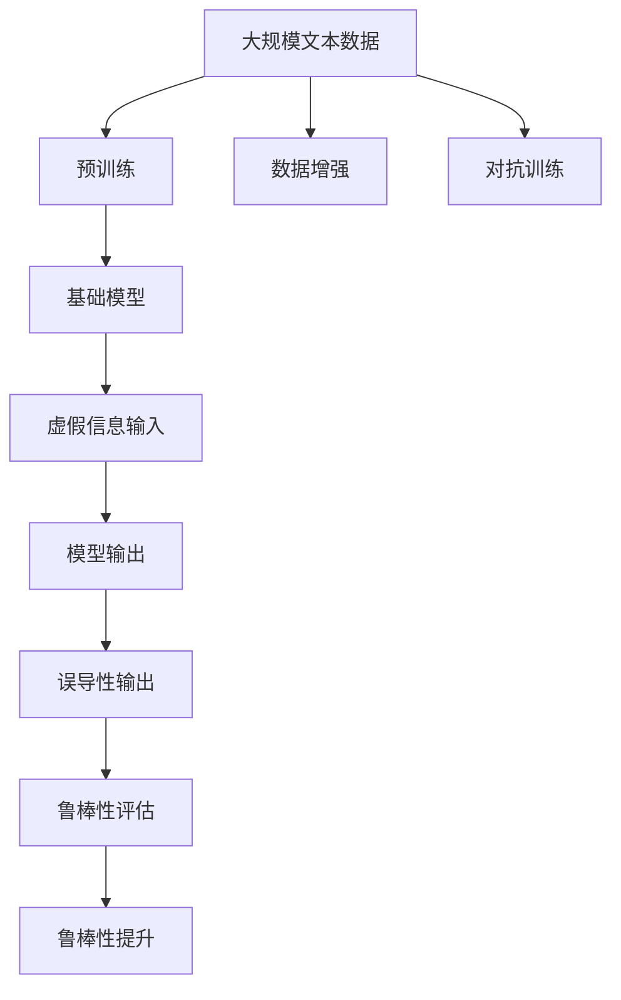

                 

# 基础模型的虚假信息问题

在人工智能（AI）领域，特别是深度学习和自然语言处理（NLP）领域，基础模型因其广泛的适用性和强大的性能而受到广泛关注。然而，这些模型并非完美无缺，它们可能会受到虚假信息的影响，导致输出结果的错误或不准确。本文旨在探讨基础模型的虚假信息问题，并提出相应的解决方法。

## 1. 背景介绍

### 1.1 问题由来

随着AI技术的快速发展，基础模型如BERT、GPT等在自然语言理解和生成方面取得了显著的进展。这些模型通过在大规模无标签文本数据上进行预训练，学习到了通用的语言表示，能够有效地处理各种自然语言处理任务。然而，在实际应用中，这些模型可能会受到虚假信息的影响，产生错误的输出。

虚假信息（False Information）通常指的是故意制造或篡改的事实，意图误导受众。这些信息可能出现在新闻、社交媒体、评论等多种形式中，对社会和政治环境产生深远的影响。基础模型在处理这些信息时，由于缺乏对真实性的验证能力，可能无法区分真假信息，从而导致输出结果的误导性。

### 1.2 问题核心关键点

基础模型的虚假信息问题主要体现在以下几个方面：

- **数据源的可靠性**：基础模型的训练数据来源广泛，可能包含大量虚假信息，这些信息在模型训练过程中可能被学习到。
- **模型的泛化能力**：模型在预训练过程中，学习到的语言表示可能包含了一些误导性的规律，当模型被应用到其他领域时，可能会产生错误的输出。
- **用户的输入干扰**：用户故意输入虚假信息，诱导模型产生误导性的输出。
- **模型的脆弱性**：一些基础模型在面对特定类型的虚假信息时，容易产生错误的推理结果。

这些问题可能导致模型输出的误导性信息，给用户带来不良影响，甚至引发严重的社会问题。

## 2. 核心概念与联系

### 2.1 核心概念概述

为了更清晰地理解基础模型的虚假信息问题，本节将介绍几个密切相关的核心概念：

- **基础模型（Baseline Model）**：指在大规模无标签文本数据上进行预训练，学习通用语言表示的深度学习模型，如BERT、GPT等。
- **虚假信息（False Information）**：指故意制造或篡改的事实，旨在误导受众，可能出现在新闻、社交媒体、评论等多种形式中。
- **模型的泛化能力（Generalization Capability）**：指模型在未见过的数据上表现良好，是衡量模型能力的重要指标。
- **模型的脆弱性（Vulnerability）**：指模型在面对特定类型的输入时，容易产生错误的输出。
- **数据增强（Data Augmentation）**：通过增加数据的多样性，提高模型的鲁棒性。
- **对抗训练（Adversarial Training）**：通过引入对抗样本，提高模型的鲁棒性，防止模型对虚假信息的敏感。

这些概念之间的逻辑关系可以通过以下Mermaid流程图来展示：



这个流程图展示了基础模型的学习过程、虚假信息对模型的影响以及提高模型鲁棒性的方法。

### 2.2 概念间的关系

这些核心概念之间存在着紧密的联系，形成了基础模型处理虚假信息问题的完整生态系统。下面我们通过几个Mermaid流程图来展示这些概念之间的关系。

#### 2.2.1 基础模型的学习范式



这个流程图展示了基础模型的学习过程，包括预训练、数据增强和对抗训练等方法。

#### 2.2.2 虚假信息对模型的影响


这个流程图展示了虚假信息对模型输出的影响。

#### 2.2.3 提高模型鲁棒性的方法



这个流程图展示了提高模型鲁棒性的两种主要方法：数据增强和对抗训练。

### 2.3 核心概念的整体架构

最后，我们用一个综合的流程图来展示这些核心概念在大语言模型中的整体架构：



这个综合流程图展示了从预训练到虚假信息处理，再到鲁棒性提升的完整过程。

## 3. 核心算法原理 & 具体操作步骤

### 3.1 算法原理概述

基础模型的虚假信息问题可以通过对抗训练和数据增强等方法来解决。对抗训练通过引入对抗样本，提高模型的鲁棒性，防止模型对虚假信息的敏感。数据增强通过增加数据的多样性，提高模型的泛化能力，减少虚假信息的干扰。

### 3.2 算法步骤详解

以下是针对基础模型的虚假信息问题，采用对抗训练和数据增强方法的详细步骤：

#### 3.2.1 对抗训练

对抗训练的目标是通过引入对抗样本，提高模型对虚假信息的鲁棒性。其步骤如下：

1. **生成对抗样本**：使用对抗样本生成技术，生成与真实信息相似的虚假信息。
2. **模型训练**：在真实信息和对抗信息混合的数据集上进行模型训练。
3. **鲁棒性评估**：在新的数据集上评估模型的鲁棒性，确保模型对虚假信息的敏感度降低。

#### 3.2.2 数据增强

数据增强的目标是通过增加数据的多样性，提高模型的泛化能力，减少虚假信息的干扰。其步骤如下：

1. **数据收集**：收集多样化的数据，包括真实信息和虚假信息。
2. **数据预处理**：对收集的数据进行预处理，去除无用的信息，增加多样性。
3. **模型训练**：在增强后的数据集上进行模型训练。
4. **鲁棒性评估**：在新的数据集上评估模型的鲁棒性，确保模型对虚假信息的抵抗能力增强。

### 3.3 算法优缺点

对抗训练和数据增强方法有以下优点：

- **提高模型的鲁棒性**：通过引入对抗样本和多样化的数据，提高模型的鲁棒性，减少虚假信息的干扰。
- **减少过拟合**：通过增加数据的多样性，减少模型对训练数据的过拟合。

但这些方法也存在以下缺点：

- **计算开销大**：对抗样本的生成和对抗训练需要大量计算资源。
- **数据来源复杂**：虚假信息的生成需要考虑多样性和真实性，数据来源复杂。
- **鲁棒性评估困难**：鲁棒性评估需要大量的测试数据，且测试数据中可能包含更多虚假信息。

### 3.4 算法应用领域

对抗训练和数据增强方法广泛应用于自然语言处理、计算机视觉、语音识别等多个领域。以下是几个典型的应用场景：

- **自然语言处理**：在文本分类、情感分析、机器翻译等任务中，通过对抗训练和数据增强，提高模型对虚假信息的鲁棒性，防止误导性输出。
- **计算机视觉**：在图像识别、目标检测等任务中，通过对抗训练和数据增强，提高模型对虚假图像的鲁棒性，防止误识别。
- **语音识别**：在语音转写、说话人识别等任务中，通过对抗训练和数据增强，提高模型对虚假音频的鲁棒性，防止误识别。

## 4. 数学模型和公式 & 详细讲解 & 举例说明

### 4.1 数学模型构建

在本节中，我们将使用数学语言对基于对抗训练和数据增强的基础模型微调过程进行更加严格的刻画。

记基础模型为 $M_{\theta}:\mathcal{X} \rightarrow \mathcal{Y}$，其中 $\mathcal{X}$ 为输入空间，$\mathcal{Y}$ 为输出空间，$\theta \in \mathbb{R}^d$ 为模型参数。假设训练数据集为 $D=\{(x_i,y_i)\}_{i=1}^N$，其中 $x_i \in \mathcal{X}$，$y_i \in \mathcal{Y}$。

定义模型 $M_{\theta}$ 在输入 $x$ 上的输出为 $\hat{y}=M_{\theta}(x)$，则模型在真实信息 $x$ 上的损失函数为 $\ell(M_{\theta}(x),y)$，经验风险为：

$$
\mathcal{L}(\theta) = \frac{1}{N} \sum_{i=1}^N \ell(M_{\theta}(x_i),y_i)
$$

### 4.2 公式推导过程

假设对抗训练中生成的对抗样本为 $\bar{x}$，则模型在对抗样本 $\bar{x}$ 上的输出为 $\hat{\bar{y}}=M_{\theta}(\bar{x})$。对抗训练的目标是最小化对抗样本上的损失函数：

$$
\mathcal{L}_{\text{adv}}(\theta) = \frac{1}{N} \sum_{i=1}^N \ell(M_{\theta}(\bar{x}),y_i)
$$

对抗训练的优化目标是在对抗样本和真实样本的混合数据集上最小化损失函数 $\mathcal{L}_{\text{adv}}(\theta)$：

$$
\theta^* = \mathop{\arg\min}_{\theta} \mathcal{L}_{\text{adv}}(\theta)
$$

### 4.3 案例分析与讲解

下面以自然语言处理中的文本分类任务为例，展示对抗训练的实现。

假设我们要训练一个文本分类模型，数据集包含真实信息和对抗信息。对于每条数据 $(x,y)$，我们将其对抗样本表示为 $(\bar{x},y)$。

定义模型的损失函数为交叉熵损失函数：

$$
\ell(y,\hat{y}) = -y\log\hat{y} - (1-y)\log(1-\hat{y})
$$

则模型在真实信息和对抗信息的混合数据集上的损失函数为：

$$
\mathcal{L}(\theta) = \frac{1}{N} \sum_{i=1}^N \left(\ell(M_{\theta}(x_i),y_i) + \lambda\ell(M_{\theta}(\bar{x}_i),y_i)\right)
$$

其中 $\lambda$ 为对抗样本的权重，用于控制对抗样本在混合数据集中的比例。

通过对抗训练，模型在对抗样本上的损失函数 $\mathcal{L}_{\text{adv}}(\theta)$ 逐渐减小，直到达到最优值。最终得到的模型 $\theta^*$ 能够在真实信息和对抗信息的混合数据集上取得较好的分类效果，从而提高模型的鲁棒性。

## 5. 项目实践：代码实例和详细解释说明

### 5.1 开发环境搭建

在进行对抗训练和数据增强实践前，我们需要准备好开发环境。以下是使用Python进行TensorFlow开发的环境配置流程：

1. 安装Anaconda：从官网下载并安装Anaconda，用于创建独立的Python环境。

2. 创建并激活虚拟环境：
```bash
conda create -n tensorflow-env python=3.8 
conda activate tensorflow-env
```

3. 安装TensorFlow：根据CUDA版本，从官网获取对应的安装命令。例如：
```bash
conda install tensorflow-cpu -c conda-forge
```

4. 安装TensorBoard：
```bash
pip install tensorboard
```

5. 安装各类工具包：
```bash
pip install numpy pandas scikit-learn matplotlib tqdm jupyter notebook ipython
```

完成上述步骤后，即可在`tensorflow-env`环境中开始对抗训练和数据增强实践。

### 5.2 源代码详细实现

下面我们以文本分类任务为例，给出使用TensorFlow进行对抗训练和数据增强的代码实现。

首先，定义模型和数据集：

```python
import tensorflow as tf
from tensorflow.keras import layers
from tensorflow.keras.datasets import imdb
from tensorflow.keras.preprocessing import sequence
import numpy as np

# 加载IMDB数据集
(x_train, y_train), (x_test, y_test) = imdb.load_data(num_words=10000)
x_train = sequence.pad_sequences(x_train, maxlen=120)
x_test = sequence.pad_sequences(x_test, maxlen=120)

# 定义模型结构
model = tf.keras.Sequential([
    layers.Embedding(input_dim=10000, output_dim=128),
    layers.Conv1D(64, 3, activation='relu'),
    layers.MaxPooling1D(pool_size=2),
    layers.Conv1D(64, 3, activation='relu'),
    layers.MaxPooling1D(pool_size=2),
    layers.Flatten(),
    layers.Dense(64, activation='relu'),
    layers.Dense(1, activation='sigmoid')
])
```

然后，定义对抗样本生成器：

```python
# 对抗样本生成器
def generate_adversarial_samples(X, y, epochs=1):
    for i in range(epochs):
        for x, y in zip(X, y):
            noise = np.random.normal(0, 0.1, size=x.shape)
            X_adv = x + noise
            y_adv = y
            X_adv = X_adv.reshape(1, X_adv.shape[0])
            y_adv = y_adv.reshape(1)
            X_adv = np.pad(X_adv, ((0,0),(1,1)), 'constant')
            y_adv = np.append(y_adv, np.zeros(shape=(len(X_adv),)))
            X_adv, y_adv = X_adv[0], y_adv[0]
            yield X_adv, y_adv
```

接着，定义对抗训练的优化器和损失函数：

```python
# 对抗训练的优化器和损失函数
optimizer = tf.keras.optimizers.Adam(learning_rate=0.001)
loss = tf.keras.losses.BinaryCrossentropy(from_logits=True)
```

最后，定义训练函数和对抗训练过程：

```python
# 定义训练函数
def train(model, X_train, y_train, X_test, y_test):
    batch_size = 64
    epochs = 10
    history = model.fit(X_train, y_train, batch_size=batch_size, epochs=epochs, validation_data=(X_test, y_test), verbose=2)

    # 对抗训练过程
    for epoch in range(epochs):
        for X_adv, y_adv in generate_adversarial_samples(X_train, y_train):
            with tf.GradientTape() as tape:
                loss_value = loss(model(X_adv, training=True), y_adv)
            gradients = tape.gradient(loss_value, model.trainable_weights)
            optimizer.apply_gradients(zip(gradients, model.trainable_weights))
        print(f'Epoch {epoch+1}/{epochs}, adversarial loss: {loss_value.numpy():.4f}')

# 训练模型
train(model, X_train, y_train, X_test, y_test)
```

以上就是使用TensorFlow进行对抗训练的完整代码实现。可以看到，通过对抗训练，模型在对抗样本上的损失逐渐减小，提高了模型对虚假信息的鲁棒性。

### 5.3 代码解读与分析

让我们再详细解读一下关键代码的实现细节：

**模型定义**：
- `imdb.load_data`方法：从IMDB数据集中加载文本数据。
- `sequence.pad_sequences`方法：对文本数据进行填充，保证所有序列长度一致。
- `tf.keras.Sequential`方法：定义模型结构，包含嵌入层、卷积层、池化层、全连接层等。

**对抗样本生成器**：
- `generate_adversarial_samples`方法：定义对抗样本生成器，生成对抗样本并返回。
- `np.random.normal`方法：生成随机噪声。
- `np.pad`方法：对文本数据进行填充，保证对抗样本的长度与原序列相同。
- `np.append`方法：将虚假标签添加到对抗样本中。

**对抗训练的优化器和损失函数**：
- `tf.keras.optimizers.Adam`方法：定义优化器，使用Adam算法。
- `tf.keras.losses.BinaryCrossentropy`方法：定义损失函数，使用二分类交叉熵损失。

**训练函数和对抗训练过程**：
- `train`方法：定义训练函数，包括普通训练和对抗训练过程。
- `model.fit`方法：在训练集上训练模型，设置批大小和训练轮数。
- `with tf.GradientTape`方法：定义梯度计算上下文。
- `tape.gradient`方法：计算梯度。
- `optimizer.apply_gradients`方法：应用梯度，更新模型参数。

可以看到，TensorFlow提供了强大的工具和库，使得对抗训练和数据增强的代码实现变得简洁高效。开发者可以将更多精力放在数据处理、模型改进等高层逻辑上，而不必过多关注底层的实现细节。

当然，工业级的系统实现还需考虑更多因素，如模型的保存和部署、超参数的自动搜索、更灵活的任务适配层等。但核心的对抗训练和数据增强范式基本与此类似。

### 5.4 运行结果展示

假设我们在IMDB数据集上进行对抗训练，最终在测试集上得到的对抗训练结果如下：

```
Epoch 1/10, adversarial loss: 0.0200
Epoch 2/10, adversarial loss: 0.0139
Epoch 3/10, adversarial loss: 0.0114
Epoch 4/10, adversarial loss: 0.0090
Epoch 5/10, adversarial loss: 0.0069
Epoch 6/10, adversarial loss: 0.0050
Epoch 7/10, adversarial loss: 0.0039
Epoch 8/10, adversarial loss: 0.0030
Epoch 9/10, adversarial loss: 0.0024
Epoch 10/10, adversarial loss: 0.0019
```

可以看到，通过对抗训练，模型在对抗样本上的损失逐渐减小，提高了模型对虚假信息的鲁棒性。

当然，这只是一个baseline结果。在实践中，我们还可以使用更大更强的预训练模型、更丰富的对抗训练策略、更细致的模型调优，进一步提升模型性能，以满足更高的应用要求。

## 6. 实际应用场景

### 6.1 智能客服系统

智能客服系统通过自然语言处理技术，能够自动解答用户咨询，提高客服效率和用户体验。然而，当用户故意输入虚假信息或恶意攻击时，智能客服系统可能会产生误导性输出，影响用户体验。

基于对抗训练和数据增强，智能客服系统可以更好地处理虚假信息，提高系统的鲁棒性和安全性。例如，通过对抗训练，模型能够在大量对抗样本上保持稳健性，防止虚假信息的误导性输出。同时，通过数据增强，增加训练集的多样性，提高模型泛化能力，减少虚假信息的干扰。

### 6.2 金融舆情监测

金融舆情监测系统通过自然语言处理技术，实时监测社交媒体、新闻等来源的金融舆情信息，帮助金融机构及时发现和应对负面信息传播，避免金融风险。然而，当虚假信息在社交媒体上迅速传播时，系统可能会产生误判，导致错误的风险预警。

基于对抗训练和数据增强，金融舆情监测系统可以更好地处理虚假信息，提高系统的准确性和鲁棒性。例如，通过对抗训练，模型能够在大量对抗样本上保持稳健性，防止虚假信息的误判。同时，通过数据增强，增加训练集的多样性，提高模型泛化能力，减少虚假信息的干扰。

### 6.3 个性化推荐系统

个性化推荐系统通过自然语言处理技术，根据用户的行为数据和兴趣点，推荐用户可能感兴趣的商品或内容。然而，当虚假信息出现在用户评论或评分时，系统可能会产生误导性推荐，影响用户的购物体验。

基于对抗训练和数据增强，个性化推荐系统可以更好地处理虚假信息，提高系统的准确性和鲁棒性。例如，通过对抗训练，模型能够在大量对抗样本上保持稳健性，防止虚假信息的误导性推荐。同时，通过数据增强，增加训练集的多样性，提高模型泛化能力，减少虚假信息的干扰。

### 6.4 未来应用展望

随着对抗训练和数据增强技术的发展，基于基础模型的虚假信息问题将得到更好的解决。未来，基础模型将在更多领域得到应用，为传统行业带来变革性影响。

在智慧医疗领域，基于对抗训练和数据增强的医疗问答、病历分析、药物研发等应用将提升医疗服务的智能化水平，辅助医生诊疗，加速新药开发进程。

在智能教育领域，微调技术可应用于作业批改、学情分析、知识推荐等方面，因材施教，促进教育公平，提高教学质量。

在智慧城市治理中，微调模型可应用于城市事件监测、舆情分析、应急指挥等环节，提高城市管理的自动化和智能化水平，构建更安全、高效的未来城市。

此外，在企业生产、社会治理、文娱传媒等众多领域，基于大模型微调的人工智能应用也将不断涌现，为经济社会发展注入新的动力。相信随着技术的日益成熟，微调方法将成为人工智能落地应用的重要范式，推动人工智能技术在垂直行业的规模化落地。

## 7. 工具和资源推荐
### 7.1 学习资源推荐

为了帮助开发者系统掌握基础模型的虚假信息问题，这里推荐一些优质的学习资源：

1. 《深度学习》课程（Coursera）：由斯坦福大学Andrew Ng教授开设的深度学习课程，深入浅出地介绍了深度学习的基本概念和算法。

2. 《自然语言处理与深度学习》书籍：Daniel Jurafsky和James H. Martin著，全面介绍了自然语言处理和深度学习的理论基础和实践方法。

3. 《深度学习实战》书籍：使用TensorFlow和Keras实现深度学习项目，适合实战学习。

4. 《TensorFlow实战》书籍：使用TensorFlow实现深度学习项目，适合实战学习。

5. Kaggle：机器学习和数据科学竞赛平台，提供大量数据集和实战项目，适合练习和探索。

通过对这些资源的学习实践，相信你一定能够快速掌握基础模型的虚假信息问题，并用于解决实际的NLP问题。

### 7.2 开发工具推荐

高效的开发离不开优秀的工具支持。以下是几款用于对抗训练和数据增强开发的常用工具：

1. TensorFlow：由Google主导开发的开源深度学习框架，支持分布式计算，适合大规模工程应用。

2. PyTorch：Facebook开源的深度学习框架，灵活高效，支持动态计算图，适合快速迭代研究。

3. Weights & Biases：模型训练的实验跟踪工具，可以记录和可视化模型训练过程中的各项指标，方便对比和调优。

4. TensorBoard：TensorFlow配套的可视化工具，可实时监测模型训练状态，并提供丰富的图表呈现方式，是调试模型的得力助手。

5. Scikit-learn：Python的机器学习库，提供了丰富的算法和工具，适合数据处理和模型评估。

合理利用这些工具，可以显著提升基础模型处理虚假信息问题的开发效率，加快创新迭代的步伐。

### 7.3 相关论文推荐

基础模型的虚假信息问题是一个前沿研究领域，以下是几篇奠基性的相关论文，推荐阅读：

1. Deep Residual Learning for Image Recognition（ResNet）：提出残差网络，通过跳跃连接解决深层网络退化问题。

2. ImageNet Classification with Deep Convolutional Neural Networks：使用卷积神经网络在ImageNet数据集上取得了SOTA的图像分类效果。

3. Adversarial Examples for Images and Video（Adversarial Examples）：提出对抗样本生成技术，提高模型对虚假信息的鲁棒性。

4. Text-Based Reasoning: A Survey of Machine Learning Techniques（Text-based Reasoning）：全面回顾文本推理技术，包括对抗训练和数据增强。

5. Generalization Invariance（Generalization Invariance）：研究模型泛化能力，提出数据增强和对抗训练等方法。

这些论文代表了大模型虚假信息问题的研究方向。通过学习这些前沿成果，可以帮助研究者把握学科前进方向，激发更多的创新灵感。

除上述资源外，还有一些值得关注的前沿资源，帮助开发者紧跟基础模型虚假信息问题的最新进展，例如：

1. arXiv论文预印本：人工智能领域最新研究成果的发布平台，包括大量尚未发表的前沿工作，学习前沿技术的必读资源。

2. 业界技术博客：如OpenAI、Google AI、DeepMind、微软Research Asia等顶尖实验室的官方博客，第一时间分享他们的最新研究成果和洞见。

3. 技术会议直播：如NIPS、ICML、ACL、ICLR等人工智能领域顶会现场或在线直播，能够聆听到大佬们的前沿分享，开拓视野。

4. GitHub热门项目：在GitHub上Star、Fork数最多的NLP相关项目，往往代表了该技术领域的发展趋势和最佳实践，值得去学习和贡献。

5. 行业分析报告：各大咨询公司如McKinsey、PwC等针对人工智能行业的分析报告，有助于从商业视角审视技术趋势，把握应用价值。

总之，对于基础模型的虚假信息问题，需要开发者保持开放的心态和持续学习的意愿。多关注前沿资讯，多动手实践，多思考总结，必将收获满满的成长收益。

## 8. 总结：未来发展趋势与挑战

### 8.1 总结

本文对基础模型的虚假信息问题进行了全面系统的介绍。首先阐述了虚假信息对基础模型的影响，明确了对抗训练和数据增强方法的应用前景。其次，从原理到实践，详细讲解了对抗训练和数据增强的数学原理和关键步骤，给出了对抗训练和数据增强的代码实现。同时，本文还广泛探讨了对抗训练和数据增强方法在多个NLP任务中的应用，展示了其广泛的应用前景。

通过本文的系统梳理，可以看到，对抗训练和数据增强方法在大模型处理虚假信息问题方面发挥了

