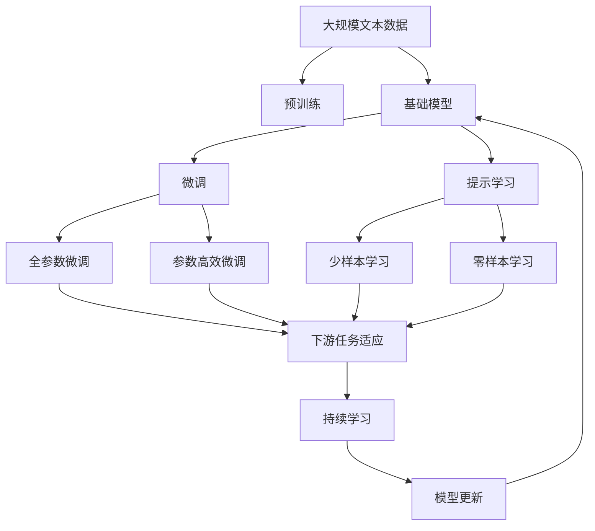
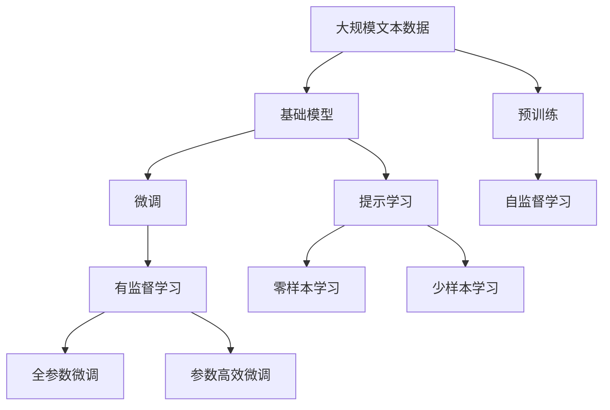
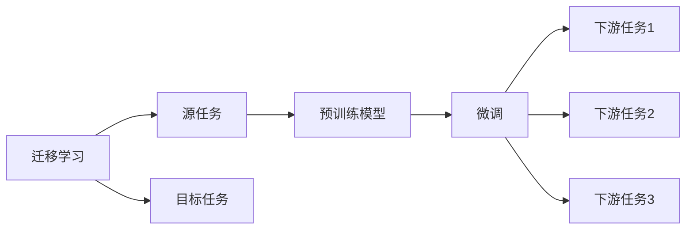
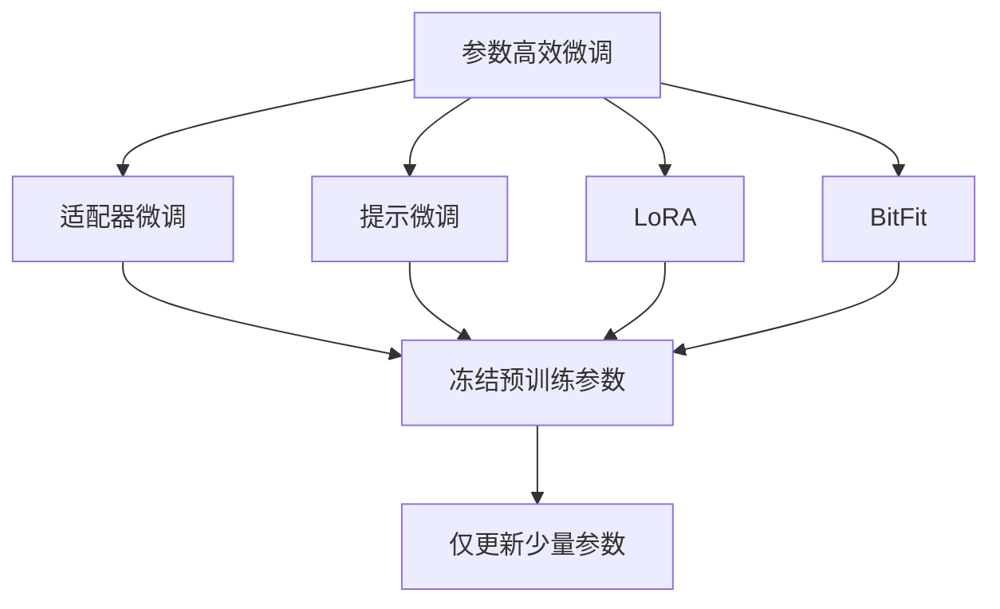
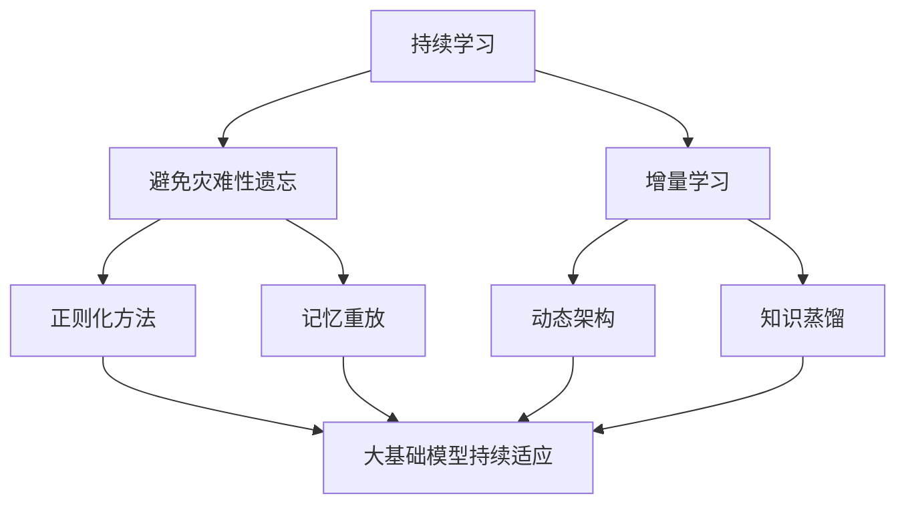
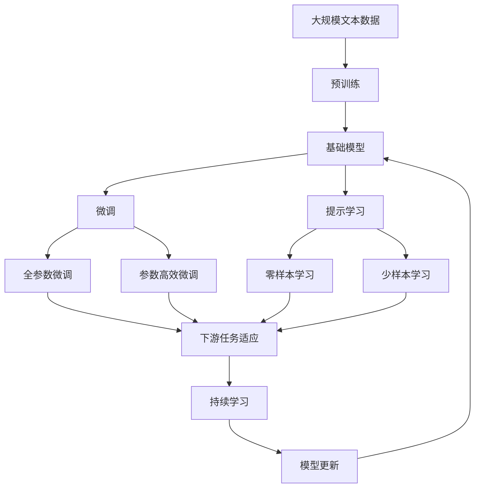

                 

# 基础模型的语言处理能力

## 1. 背景介绍

### 1.1 问题由来
语言处理一直是人工智能研究的热点领域。近年来，深度学习技术在语言处理领域的突破性进展，如BERT、GPT等预训练语言模型，显著提升了模型的语言理解能力和生成能力。这些模型通过在海量无标签文本上预训练，学习到通用的语言表示，从而在大规模自然语言处理(NLP)任务上取得了优异的性能。

但这些基础模型在特定领域的应用效果仍存在局限性，如特定领域的特定任务，需要针对性地微调才能获得更好的效果。因此，如何在保证基础模型的通用性和泛化能力的同时，进一步提升其在特定领域的语言处理能力，成为当前研究的重点。

### 1.2 问题核心关键点
基础模型的语言处理能力，本质上是通过在大规模无标签文本数据上进行自监督预训练，学习到通用的语言表示。这一过程中，模型的结构、预训练任务、训练策略等设计，对模型的语言处理能力有着重要影响。因此，理解基础模型的语言处理能力，需要从以下几个方面进行深入探讨：

- **预训练任务设计**：如何设计有效的预训练任务，帮助模型学习到丰富的语言表示。
- **模型结构选择**：不同结构的基础模型在语言处理能力上有什么差异，以及如何选择最优结构。
- **训练策略优化**：如何调整训练策略，最大化模型的泛化能力和特定任务的性能。
- **应用场景适配**：如何将基础模型适配到特定的应用场景，提升其特定领域的语言处理能力。

## 2. 核心概念与联系

### 2.1 核心概念概述

为更好地理解基础模型的语言处理能力，本节将介绍几个密切相关的核心概念：

- **预训练(Pre-training)**：指在大规模无标签文本数据上，通过自监督学习任务训练基础语言模型的过程。常见的预训练任务包括语言模型预测、掩码语言模型、下一句预测等。
- **基础模型(Base Model)**：以自回归(如GPT)或自编码(如BERT)模型为代表的基础语言模型，通过预训练学习到通用的语言表示。
- **迁移学习(Transfer Learning)**：将一个领域学习到的知识，迁移应用到另一个不同但相关的领域的学习范式。基础模型的预训练-微调过程即是一种典型的迁移学习方式。
- **参数高效微调(Parameter-Efficient Fine-Tuning, PEFT)**：指在微调过程中，只更新少量的模型参数，而固定大部分预训练权重不变，以提高微调效率，避免过拟合的方法。
- **提示学习(Prompt Learning)**：通过在输入文本中添加提示模板(Prompt Template)，引导基础模型进行特定任务的推理和生成。可以在不更新模型参数的情况下，实现零样本或少样本学习。
- **少样本学习(Few-shot Learning)**：指在只有少量标注样本的情况下，模型能够快速适应新任务的学习方法。在大基础模型中，通常通过在输入中提供少量示例来实现，无需更新模型参数。
- **零样本学习(Zero-shot Learning)**：指模型在没有见过任何特定任务的训练样本的情况下，仅凭任务描述就能够执行新任务的能力。基础模型通过预训练获得的广泛知识，使其能够理解任务指令并生成相应输出。

这些核心概念之间的逻辑关系可以通过以下Mermaid流程图来展示：



这个流程图展示了大语言模型的核心概念及其之间的关系：

1. 大语言模型通过预训练获得基础能力。
2. 微调是对预训练模型进行任务特定的优化，可以分为全参数微调和参数高效微调（PEFT）。
3. 提示学习是一种不更新模型参数的方法，可以实现少样本学习和零样本学习。
4. 迁移学习是连接预训练模型与下游任务的桥梁，可以通过微调或提示学习来实现。
5. 持续学习旨在使模型能够不断学习新知识，同时保持已学习的知识，而不会出现灾难性遗忘。

这些核心概念共同构成了基础模型的语言处理能力的理论基础，使其能够在各种场景下发挥强大的语言理解和生成能力。通过理解这些核心概念，我们可以更好地把握基础模型的语言处理能力的原理和优化方向。

### 2.2 概念间的关系

这些核心概念之间存在着紧密的联系，形成了基础模型语言处理能力的完整生态系统。下面我们通过几个Mermaid流程图来展示这些概念之间的关系。

#### 2.2.1 基础模型的学习范式



这个流程图展示了大语言模型的三种主要学习范式：预训练、微调和提示学习。预训练主要采用自监督学习方法，而微调则是有监督学习的过程。提示学习可以实现零样本和少样本学习。微调又可以分为全参数微调和参数高效微调两种方式。

#### 2.2.2 迁移学习与微调的关系



这个流程图展示了迁移学习的基本原理，以及它与微调的关系。迁移学习涉及源任务和目标任务，预训练模型在源任务上学习，然后通过微调适应各种下游任务（目标任务）。

#### 2.2.3 参数高效微调方法



这个流程图展示了几种常见的参数高效微调方法，包括适配器微调、提示微调、LoRA和BitFit。这些方法的共同特点是冻结大部分预训练参数，只更新少量参数，从而提高微调效率。

#### 2.2.4 持续学习在大基础模型中的应用



这个流程图展示了持续学习在大基础模型中的应用。持续学习的主要目标是避免灾难性遗忘和实现增量学习。通过正则化方法、记忆重放、动态架构和知识蒸馏等技术，可以使大基础模型持续适应新的任务和数据。

### 2.3 核心概念的整体架构

最后，我们用一个综合的流程图来展示这些核心概念在大基础模型的语言处理能力中的整体架构：



这个综合流程图展示了从预训练到微调，再到持续学习的完整过程。大基础模型首先在大规模文本数据上进行预训练，然后通过微调（包括全参数微调和参数高效微调）或提示学习（包括零样本和少样本学习）来适应下游任务。最后，通过持续学习技术，模型可以不断更新和适应新的任务和数据。通过这些流程图，我们可以更清晰地理解大基础模型语言处理能力的原理和优化方向。

## 3. 核心算法原理 & 具体操作步骤

### 3.1 算法原理概述

大基础模型的语言处理能力主要依赖于其在大规模无标签文本数据上的自监督预训练。通过预训练，模型学习到了通用的语言表示，从而能够在多种NLP任务上表现出色。这一过程中，预训练任务的合理设计、模型结构的有效选择、训练策略的精心优化，是提升模型语言处理能力的关键。

具体而言，基础模型通过预训练任务（如语言模型预测、掩码语言模型等），学习到语言序列的概率分布，从而能够捕捉到语言中的统计规律和语法结构。这种通用的语言表示，使得模型在面对各种下游任务时，能够快速适应并取得优异性能。

### 3.2 算法步骤详解

大基础模型的语言处理能力的实现，主要涉及以下几个关键步骤：

**Step 1: 准备预训练数据和模型**

- **数据准备**：选择合适的预训练数据集，通常需要覆盖广泛的语言现象和语法结构。常见数据集包括Wikipedia、新闻语料库、维基百科等。
- **模型选择**：选择适合的预训练模型结构，如BERT、GPT、RoBERTa等。结构的设计应该能够充分利用数据特征，提高模型的表达能力。

**Step 2: 预训练过程**

- **任务设计**：设计有效的预训练任务，如语言模型预测、掩码语言模型、下一句预测等。这些任务旨在最大化模型的语言理解能力。
- **优化器选择**：选择合适的优化器（如Adam、SGD等）及其参数，如学习率、批大小、迭代轮数等。优化器用于最小化损失函数，提高模型训练效率。
- **训练策略**：采用自监督学习策略，通过大量未标注数据进行预训练。可以使用正则化技术，如L2正则、Dropout等，防止模型过拟合。

**Step 3: 微调与提示学习**

- **微调策略**：选择合适的微调策略，如全参数微调或参数高效微调。全参数微调通常用于任务特定的优化，而参数高效微调则能够在保留大部分预训练权重的情况下，提高微调效率。
- **提示模板**：设计提示模板，引导模型进行特定任务的推理和生成。提示模板可以包含任务描述、示例数据等，帮助模型更快地适应新任务。
- **零样本和少样本学习**：利用提示学习，在无标注数据的情况下进行零样本或少样本学习。提示学习能够通过任务描述，让模型理解并生成目标输出，无需更新模型参数。

**Step 4: 应用场景适配**

- **任务适配层**：根据下游任务，设计合适的输出层和损失函数。对于分类任务，通常使用交叉熵损失函数；对于生成任务，则使用负对数似然损失函数。
- **超参数调整**：调整微调的超参数，如学习率、批大小、迭代轮数等，以达到最佳性能。
- **模型评估与优化**：在验证集上评估模型性能，根据评估结果调整模型参数和训练策略，直到达到最优性能。

**Step 5: 测试与部署**

- **测试集评估**：在测试集上评估微调后模型的性能，对比微调前后的效果提升。
- **模型部署**：将微调后的模型部署到实际应用系统中，如智能客服、舆情监测、推荐系统等。
- **持续学习**：定期重新微调模型，以适应数据分布的变化，保持模型的时效性和适应性。

以上是基于监督学习的大基础模型的语言处理能力的实现流程。在实际应用中，还需要根据具体任务进行优化设计，如改进训练目标函数、引入更多正则化技术、搜索最优的超参数组合等，以进一步提升模型性能。

### 3.3 算法优缺点

大基础模型的语言处理能力具有以下优点：

1. **通用性**：基础模型通过在大规模无标签文本数据上的预训练，学习到了通用的语言表示，可以在多种NLP任务上取得优异性能。
2. **效率高**：预训练过程可以利用大数据量，提高模型训练效率和效果。
3. **可解释性强**：基础模型基于统计学习原理，可以通过分析模型参数和梯度，理解模型的推理过程，提供可解释性。
4. **泛化能力强**：预训练模型能够捕捉语言中的统计规律和语法结构，具有较强的泛化能力，适用于各种领域和任务。

同时，该算法也存在一些缺点：

1. **依赖标注数据**：微调过程需要少量的标注数据进行任务适配，对于标注数据不足的任务，可能难以取得理想效果。
2. **模型复杂度高**：大基础模型通常具有亿级的参数量，训练和推理过程需要大量的计算资源和时间。
3. **泛化能力有限**：当目标任务与预训练数据的分布差异较大时，微调的性能提升有限。
4. **可解释性不足**：基础模型通常被视为"黑盒"系统，难以解释其内部工作机制和决策逻辑，尤其在面对复杂任务时，模型的推理过程难以理解和调试。

尽管存在这些局限性，但大基础模型的语言处理能力仍然是大规模语言模型应用的最主流范式。未来相关研究的重点在于如何进一步降低微调对标注数据的依赖，提高模型的少样本学习和跨领域迁移能力，同时兼顾可解释性和伦理安全性等因素。

### 3.4 算法应用领域

大基础模型的语言处理能力在NLP领域已经得到了广泛的应用，覆盖了几乎所有常见任务，例如：

- **文本分类**：如情感分析、主题分类、意图识别等。通过微调使模型学习文本-标签映射。
- **命名实体识别**：识别文本中的人名、地名、机构名等特定实体。通过微调使模型掌握实体边界和类型。
- **关系抽取**：从文本中抽取实体之间的语义关系。通过微调使模型学习实体-关系三元组。
- **问答系统**：对自然语言问题给出答案。将问题-答案对作为微调数据，训练模型学习匹配答案。
- **机器翻译**：将源语言文本翻译成目标语言。通过微调使模型学习语言-语言映射。
- **文本摘要**：将长文本压缩成简短摘要。将文章-摘要对作为微调数据，使模型学习抓取要点。
- **对话系统**：使机器能够与人自然对话。将多轮对话历史作为上下文，微调模型进行回复生成。

除了上述这些经典任务外，大基础模型的语言处理能力也被创新性地应用到更多场景中，如可控文本生成、常识推理、代码生成、数据增强等，为NLP技术带来了全新的突破。随着预训练模型和微调方法的不断进步，相信NLP技术将在更广阔的应用领域大放异彩。

## 4. 数学模型和公式 & 详细讲解 & 举例说明

### 4.1 数学模型构建

本节将使用数学语言对基础模型的语言处理能力进行更加严格的刻画。

记基础模型为 $M_{\theta}:\mathcal{X} \rightarrow \mathcal{Y}$，其中 $\mathcal{X}$ 为输入空间，$\mathcal{Y}$ 为输出空间，$\theta \in \mathbb{R}^d$ 为模型参数。假设预训练任务为 $\mathcal{T}$，目标任务为 $\mathcal{T'}$，训练集为 $D=\{(x_i,y_i)\}_{i=1}^N, x_i \in \mathcal{X}, y_i \in \mathcal{Y}$。

定义基础模型 $M_{\theta}$ 在数据样本 $(x,y)$ 上的损失函数为 $\ell(M_{\theta}(x),y)$，则在数据集 $D$ 上的经验风险为：

$$
\mathcal{L}(\theta) = \frac{1}{N} \sum_{i=1}^N \ell(M_{\theta}(x_i),y_i)
$$

微调的优化目标是最小化经验风险，即找到最优参数：

$$
\theta^* = \mathop{\arg\min}_{\theta} \mathcal{L}(\theta)
$$

在实践中，我们通常使用基于梯度的优化算法（如SGD、Adam等）来近似求解上述最优化问题。设 $\eta$ 为学习率，$\lambda$ 为正则化系数，则参数的更新公式为：

$$
\theta \leftarrow \theta - \eta \nabla_{\theta}\mathcal{L}(\theta) - \eta\lambda\theta
$$

其中 $\nabla_{\theta}\mathcal{L}(\theta)$ 为损失函数对参数 $\theta$ 的梯度，可通过反向传播算法高效计算。

### 4.2 公式推导过程

以下我们以二分类任务为例，推导交叉熵损失函数及其梯度的计算公式。

假设基础模型 $M_{\theta}$ 在输入 $x$ 上的输出为 $\hat{y}=M_{\theta}(x) \in [0,1]$，表示样本属于正类的概率。真实标签 $y \in \{0,1\}$。则二分类交叉熵损失函数定义为：

$$
\ell(M_{\theta}(x),y) = -[y\log \hat{y} + (1-y)\log (1-\hat{y})]
$$

将其代入经验风险公式，得：

$$
\mathcal{L}(\theta) = -\frac{1}{N}\sum_{i=1}^N [y_i\log M_{\theta}(x_i)+(1-y_i)\log(1-M_{\theta}(x_i))]
$$

根据链式法则，损失函数对参数 $\theta_k$ 的梯度为：

$$
\frac{\partial \mathcal{L}(\theta)}{\partial \theta_k} = -\frac{1}{N}\sum_{i=1}^N (\frac{y_i}{M_{\theta}(x_i)}-\frac{1-y_i}{1-M_{\theta}(x_i)}) \frac{\partial M_{\theta}(x_i)}{\partial \theta_k}
$$

其中 $\frac{\partial M_{\theta}(x_i)}{\partial \theta_k}$ 可进一步递归展开，利用自动微分技术完成计算。

在得到损失函数的梯度后，即可带入参数更新公式，完成模型的迭代优化。重复上述过程直至收敛，最终得到适应下游任务的最优模型参数 $\theta^*$。

### 4.3 案例分析与讲解

以BERT模型的命名实体识别(NER)任务微调为例，展示基础模型的语言处理能力的数学推导和实现过程。

#### 4.3.1 数据处理

首先需要将标注数据集分为训练集、验证集和测试集，并对文本数据进行预处理：

1. 分词：使用BERT的分词器将文本分词。
2. 标注：标注每个实体的位置和类型，生成标注文本。
3. 编码：将标注文本输入BERT模型，得到隐藏层的向量表示。

#### 4.3.2 任务适配层设计

在BERT模型的顶层添加一个线性分类器，用于进行实体分类。分类器的输出维度应与标签数相同，使用交叉熵损失函数进行训练。

#### 4.3.3 微调过程

将训练集数据分批次输入模型，前向传播计算损失函数。反向传播计算参数梯度，根据设定的优化算法和学习率更新模型参数。周期性在验证集上评估模型性能，根据性能指标决定是否触发Early Stopping。重复上述步骤直到满足预设的迭代轮数或Early Stopping条件。

在验证集上评估模型性能，对比微调前后的精度提升。如果精度提升显著，则继续微调；如果精度提升不明显，则停止微调。

#### 4.3.4 测试集评估

在测试集上评估微调后模型的性能，对比微调前后的精度提升。

```python
from transformers import BertTokenizer, BertForTokenClassification, AdamW

tokenizer = BertTokenizer.from_pretrained('bert-base-cased')
model = BertForTokenClassification.from_pretrained('bert-base-cased', num_labels=10)  # 假设实体分类有10个标签

optimizer = AdamW(model.parameters(), lr=2e-5)
epochs = 5
batch_size = 16

for epoch in range(epochs):
    train_loss = 0
    for batch in tqdm(train_dataset, desc='Training'):
        inputs = tokenizer(batch['input'], return_tensors='pt')
        labels = inputs.pop('labels')
        outputs = model(**inputs)
        loss = outputs.loss
        train_loss += loss.item()
        loss.backward()
        optimizer.step()
        optimizer.zero_grad()
    
    train_loss /= len(train_dataset)
    print(f"Epoch {epoch+1}, train loss: {train_loss:.3f}")
    
    dev_loss = 0
    for batch in tqdm(dev_dataset, desc='Evaluating'):
        inputs = tokenizer(batch['input'], return_tensors='pt')
        labels = inputs.pop('labels')
        outputs = model(**inputs)
        loss = outputs.loss
        dev_loss += loss.item()
    dev_loss /= len(dev_dataset)
    print(f"Epoch {epoch+1}, dev loss: {dev_loss:.3f}")
    
test_loss = 0
for batch in tqdm(test_dataset, desc='Testing'):
    inputs = tokenizer(batch['input'], return_tensors='pt')
    labels = inputs.pop('labels')
    outputs = model(**inputs)
    loss = outputs.loss
    test_loss += loss.item()
test_loss /= len(test_dataset)
print(f"Test loss: {test_loss:.3f}")
```

以上就是使用PyTorch对BERT模型进行NER任务微调的完整代码实现。可以看到，BERT模型的语言处理能力主要通过预训练任务（如掩码语言模型）学习到通用的语言表示，再通过微调适配到特定任务（如NER），从而实现了在标注数据较少的情况下取得较好的效果。

## 5. 项目实践：代码实例和详细解释说明

### 5.1 开发环境搭建

在进行微调实践前，我们需要准备好开发环境。以下是使用Python进行PyTorch开发的环境配置流程：

1. 安装Anaconda：从官网下载并安装Anaconda，用于创建独立的Python环境。

2. 创建并激活虚拟环境：
```bash
conda create -n pytorch-env python=3.8 
conda activate pytorch-env
```

3. 安装PyTorch：根据CUDA版本，从官网获取对应的安装命令。例如：
```bash
conda install pytorch torchvision torchaudio cudatoolkit=11.1 -c pytorch -c conda-forge
```

4. 安装Transformers库：
```bash
pip install transformers
```

5. 安装各类工具包：
```bash
pip install numpy pandas scikit-learn matplotlib tqdm jupyter notebook ipython
```

完成上述步骤后，即可在`pytorch-env`环境中开始微调实践。

### 5.2 源代码详细实现

这里我们以命名实体识别(NER)任务为例，给出使用Transformers库对BERT模型进行微调的PyTorch代码实现。

首先，定义NER任务的数据处理函数：

```python
from transformers import BertTokenizer
from torch.utils.data import Dataset
import torch

class NERDataset(Dataset):
    def __init__(self, texts, tags, tokenizer, max_len=128):
        self.texts = texts
        self.tags = tags
        self.tokenizer = tokenizer
        self.max_len = max_len
        
    def __len__(self):
        return len(self.texts)
    
    def __getitem__(self, item):
        text = self.texts[item]
        tags = self.tags[item]
        
        encoding = self.tokenizer(text, return_tensors='pt', max_length=self.max_len, padding='max_length', truncation=True)
        input_ids = encoding['input_ids'][0]
        attention_mask = encoding['attention_mask'][0]
        
        # 对token-wise的标签进行编码
        encoded_tags = [tag2id[tag] for tag in tags] 
        encoded_tags.extend([tag2id['O']] * (self.max_len - len(encoded_tags)))
        labels = torch.tensor(encoded_tags, dtype=torch.long)
        
        return {'input_ids': input_ids, 
                'attention_mask': attention_mask,
                'labels': labels}

# 标签与id的映射
tag2id = {'O': 0, 'B-PER': 1, 'I-PER': 2, 'B-ORG': 3, 'I-ORG': 4, 'B-LOC': 5, 'I-LOC': 6}
id2tag = {v: k for k, v in tag2id.items()}

# 创建dataset
tokenizer = BertTokenizer.from_pretrained('bert-base-cased')

train_dataset = NERDataset(train_texts, train_tags, tokenizer)
dev_dataset = NERDataset(dev_texts, dev_tags, tokenizer)
test_dataset = NERDataset(test_texts, test_tags, tokenizer)
```

然后，定义模型和优化器：

```python
from transformers import BertForTokenClassification, AdamW

model = BertForTokenClassification.from_pretrained('bert-base-cased', num_labels=len(tag2id))

optimizer = AdamW(model.parameters(), lr=2e-5)
```

接着，定义训练和评估函数：

```python
from torch.utils.data import DataLoader
from tqdm import tqdm
from sklearn.metrics import classification_report

device = torch.device('cuda') if torch.cuda.is

