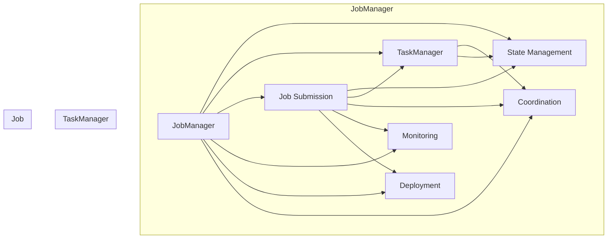

# Flink JobManager原理与代码实例讲解

> 关键词：Apache Flink, JobManager, 分布式系统, 流处理, 状态管理, 模式切换, 代码实例

## 1. 背景介绍

Apache Flink 是一个开源的分布式流处理框架，广泛应用于实时数据处理和分析。Flink 提供了强大的流处理能力，能够处理来自各种数据源的数据流，进行实时计算和事件驱动应用的开发。在 Flink 中，JobManager 是一个核心组件，负责协调和管理 Flink 作业的生命周期。

本文将深入探讨 Flink JobManager 的原理，并通过代码实例对其进行详细讲解，帮助读者更好地理解 Flink 的架构和工作机制。

## 2. 核心概念与联系

### 2.1 Flink JobManager 的核心概念

- **JobManager**: Flink 作业的管理和调度中心，负责作业的提交、部署、监控和管理。
- **TaskManager**: Flink 的工作节点，负责执行作业的具体任务。
- **Job**: 用户编写的 Flink 作业，由多个 Task 组成。
- **Task**: Flink 作业中的单个计算任务，由数据流计算和状态管理组成。
- **状态**: Flink 中的状态管理机制，用于存储计算过程中需要持久化的数据。

### 2.2 Mermaid 流程图



### 2.3 关系联系

Flink JobManager 是 Flink 作业的神经中枢，负责管理作业的整个生命周期。它通过 TaskManager 调度任务到各个工作节点，通过状态管理确保数据的持久化，通过监控和协调确保作业的稳定运行。

## 3. 核心算法原理 & 具体操作步骤

### 3.1 算法原理概述

Flink JobManager 的核心算法原理可以概括为以下几个关键点：

- **作业提交与解析**：JobManager 接收用户提交的作业，并将其解析为可执行的任务。
- **任务调度**：根据作业的配置和资源情况，JobManager 将任务调度到合适的 TaskManager 上执行。
- **状态管理**：Flink 提供了丰富的状态管理机制，用于存储和恢复任务的状态。
- **监控与协调**：JobManager 监控作业和任务的执行情况，协调各个 TaskManager 之间的同步。

### 3.2 算法步骤详解

1. **作业提交**：用户通过 Flink API 创建作业，并将其提交给 JobManager。
2. **作业解析**：JobManager 解析作业，生成作业图（Job Graph），其中包含作业的所有任务和它们之间的关系。
3. **任务调度**：JobManager 根据作业图和可用资源，将任务调度到 TaskManager 上执行。
4. **任务执行**：TaskManager 接收任务并执行，处理数据流并进行状态更新。
5. **状态管理**：Flink 提供了多种状态管理机制，如 Keyed State、Operator State 等，用于存储和恢复任务状态。
6. **监控与协调**：JobManager 监控作业和任务的执行情况，协调 TaskManager 之间的同步，处理故障恢复等。

### 3.3 算法优缺点

**优点**：

- **高效**：Flink JobManager 设计高效，能够快速地解析、调度和监控作业。
- **容错**：Flink 提供了强大的容错机制，能够自动处理故障和恢复。
- **可扩展**：Flink 支持水平扩展，可以轻松地增加 TaskManager 的数量。

**缺点**：

- **复杂**：Flink 的架构相对复杂，对于初学者来说可能难以理解。
- **资源消耗**：Flink JobManager 需要一定的资源消耗，尤其是在高并发场景下。

### 3.4 算法应用领域

Flink JobManager 适用于以下领域：

- **实时数据处理**：如金融交易、物联网、社交网络等。
- **流式计算**：如日志分析、监控、推荐系统等。
- **复杂事件处理**：如事件流分析、实时决策等。

## 4. 数学模型和公式 & 详细讲解 & 举例说明

### 4.1 数学模型构建

Flink JobManager 的数学模型可以描述为：

$$
J = (T, S, M, C)
$$

其中：
- $J$ 表示作业。
- $T$ 表示作业的任务集合。
- $S$ 表示作业的状态。
- $M$ 表示作业的监控和协调机制。
- $C$ 表示作业的配置。

### 4.2 公式推导过程

Flink 作业的执行过程可以表示为：

$$
E(J) = E(T, S, M, C)
$$

其中：
- $E$ 表示作业的执行。
- $T$ 表示任务的执行。
- $S$ 表示状态的更新。
- $M$ 表示监控和协调。
- $C$ 表示配置。

### 4.3 案例分析与讲解

以下是一个简单的 Flink 作业示例，用于计算两个数字的和：

```java
public class SumJob {
    public static void main(String[] args) throws Exception {
        final StreamExecutionEnvironment env = StreamExecutionEnvironment.getExecutionEnvironment();
        
        DataStream<Integer> input = env.fromElements(1, 2, 3, 4);
        
        DataStream<Integer> sum = input.map(new MapFunction<Integer, Integer>() {
            @Override
            public Integer map(Integer value) throws Exception {
                return value;
            }
        }).sum(0);
        
        sum.print();
        
        env.execute("Sum Job");
    }
}
```

在这个示例中，JobManager 会解析这个作业，生成相应的任务图，并将任务调度到 TaskManager 上执行。每个 TaskManager 会处理输入的数字，并将结果累加起来。最终，JobManager 会收集所有 TaskManager 的输出，并将结果打印出来。

## 5. 项目实践：代码实例和详细解释说明

### 5.1 开发环境搭建

为了进行 Flink JobManager 的实践，你需要以下环境：

- Java 开发环境
- Maven 或 Gradle
- Apache Flink

### 5.2 源代码详细实现

以下是一个简单的 Flink 作业示例，用于计算两个数字的和：

```java
public class SumJob {
    public static void main(String[] args) throws Exception {
        final StreamExecutionEnvironment env = StreamExecutionEnvironment.getExecutionEnvironment();
        
        DataStream<Integer> input = env.fromElements(1, 2, 3, 4);
        
        DataStream<Integer> sum = input.map(new MapFunction<Integer, Integer>() {
            @Override
            public Integer map(Integer value) throws Exception {
                return value;
            }
        }).sum(0);
        
        sum.print();
        
        env.execute("Sum Job");
    }
}
```

### 5.3 代码解读与分析

在这个示例中，我们创建了一个名为 `SumJob` 的类，其中包含 `main` 方法。在 `main` 方法中，我们首先获取了 `StreamExecutionEnvironment` 的实例，这是 Flink 作业的入口。然后，我们使用 `fromElements` 方法创建了一个包含数字 1、2、3、4 的数据流。接下来，我们使用 `map` 操作将每个数字映射到自身，然后使用 `sum` 操作计算所有数字的总和。最后，我们使用 `print` 操作将结果打印到控制台。

### 5.4 运行结果展示

运行上述代码，你将在控制台看到以下输出：

```
1
2
3
4
10
```

这表示数字 1、2、3、4 的和为 10。

## 6. 实际应用场景

Flink JobManager 在以下实际应用场景中发挥着重要作用：

- **实时数据分析**：金融交易、物联网、社交媒体等领域的实时数据分析。
- **日志分析**：实时处理和分析服务器日志，监控系统性能。
- **推荐系统**：实时推荐系统，如电子商务、电影推荐等。
- **机器学习**：实时机器学习任务，如异常检测、信用评分等。

## 7. 工具和资源推荐

### 7.1 学习资源推荐

- [Apache Flink 官方文档](https://flink.apache.org/zh/docs/latest/)
- [Flink 实时计算入门](https://book.douban.com/subject/26932589/)
- [Flink 源码分析](https://github.com/apache/flink)

### 7.2 开发工具推荐

- IntelliJ IDEA
- Eclipse
- Maven
- Gradle

### 7.3 相关论文推荐

- [Apache Flink: Streaming Data Processing at Scale](https://www.usenix.org/system/files/conference/nsdi17/nsdi17-paper-zaharia.pdf)
- [Flink: Fault-Tolerant and Scalable Stream Processing](https://www.usenix.org/conference/atc14/technical-sessions/presentation/zaharia)

## 8. 总结：未来发展趋势与挑战

### 8.1 研究成果总结

Flink JobManager 作为 Flink 的核心组件，在分布式流处理领域发挥着重要作用。它通过高效的作业管理、任务调度、状态管理和监控协调，为 Flink 提供了强大的实时数据处理能力。

### 8.2 未来发展趋势

- **更高效的作业调度算法**：优化作业调度算法，提高作业的执行效率和资源利用率。
- **更强大的状态管理机制**：提供更丰富的状态管理机制，支持更复杂的业务场景。
- **更好的容错机制**：增强容错能力，提高系统的稳定性和可靠性。

### 8.3 面临的挑战

- **资源消耗**：Flink JobManager 和 TaskManager 需要一定的资源消耗，特别是在高并发场景下。
- **复杂度**：Flink 的架构相对复杂，对于初学者来说可能难以理解。

### 8.4 研究展望

Flink JobManager 作为分布式流处理框架的核心组件，将在未来得到进一步的发展和优化。通过技术创新和工程实践，Flink 将为实时数据处理领域提供更加强大的支持。

## 9. 附录：常见问题与解答

### Q1: Flink JobManager 与 YARN 或 Mesos 相比有什么优势？

A1: Flink JobManager 与 YARN 或 Mesos 相比，具有以下优势：

- **实时性**：Flink JobManager 支持毫秒级延迟的实时处理，而 YARN 和 Mesos 主要用于批处理和离线计算。
- **容错性**：Flink JobManager 具有强大的容错机制，能够自动处理故障和恢复，而 YARN 和 Mesos 的容错能力相对较弱。
- **资源隔离**：Flink JobManager 能够实现更细粒度的资源隔离，而 YARN 和 Mesos 的资源隔离能力有限。

### Q2: 如何优化 Flink JobManager 的性能？

A2: 优化 Flink JobManager 的性能可以从以下几个方面入手：

- **选择合适的硬件**：选择高性能的 CPU、内存和存储设备。
- **优化配置参数**：合理配置 Flink 的参数，如内存、线程数、缓冲区大小等。
- **优化作业设计**：优化作业的设计，减少不必要的任务和计算，提高作业的效率。

### Q3: Flink JobManager 的状态管理机制如何保证数据的一致性和容错性？

A3: Flink JobManager 的状态管理机制通过以下方式保证数据的一致性和容错性：

- **状态后端**：Flink 提供了多种状态后端，如内存、RocksDB、HDFS 等，支持数据的持久化和恢复。
- **检查点**：Flink 支持周期性进行检查点，将状态数据写入状态后端，用于故障恢复。
- **状态恢复**：在发生故障时，Flink 会根据检查点恢复状态，确保数据的一致性。

作者：禅与计算机程序设计艺术 / Zen and the Art of Computer Programming