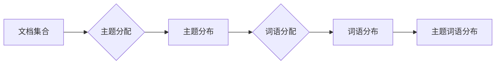

> 关键词：Gensim，主题模型，LDA，文本分析，文档相似度，知识图谱，信息检索，推荐系统，Python

# Gensim 原理与代码实战案例讲解

## 1. 背景介绍

随着互联网的飞速发展，海量的文本数据不断涌现。如何有效地分析、组织和提取这些数据中的有用信息，成为数据科学和自然语言处理领域的关键挑战。Gensim是一个开源的Python库，它提供了强大的文本分析工具，用于构建和应用各种主题模型，如Latent Dirichlet Allocation (LDA)、LSA（Latent Semantic Analysis）等。本文将深入讲解Gensim的原理，并通过实际案例展示其在文本分析、文档相似度、知识图谱和信息检索等领域的应用。

## 2. 核心概念与联系

### 2.1 主题模型

主题模型是一种统计模型，用于识别大量文本数据中的潜在主题。主题模型假设每个文档都是由多个潜在主题混合而成，每个主题又由一组词语混合而成。LDA是最流行的主题模型之一。

### 2.2 Mermaid 流程图

以下是一个简化的LDA主题模型架构的Mermaid流程图：



### 2.3 核心概念联系

- 文档集合：包含大量文档的集合。
- 主题分布：每个文档被分配到多个主题的概率分布。
- 词语分配：每个主题被分配到一组词语的概率分布。
- 词语分布：每个词语属于每个主题的概率分布。
- 主题词语分布：每个主题中词语的实际分布。

## 3. 核心算法原理 & 具体操作步骤

### 3.1 算法原理概述

LDA算法通过以下步骤工作：

1. **初始化**：随机初始化主题分布、词语分布和主题词语分布。
2. **迭代**：对于每个文档，根据主题分布和词语分布，为文档中的每个词语分配主题。
3. **更新**：根据文档中分配的主题，更新主题分布、词语分布和主题词语分布。
4. **收敛**：迭代直到主题分布、词语分布和主题词语分布收敛。

### 3.2 算法步骤详解

1. **预处理**：对文本数据进行清洗和分词。
2. **构建语料库**：将文本数据转换为Gensim可处理的格式。
3. **初始化主题模型**：创建一个LdaModel实例，并指定主题数量。
4. **训练模型**：使用语料库训练LDA模型。
5. **分析主题**：提取和解释模型学到的主题。

### 3.3 算法优缺点

**优点**：

- 能够发现文档中的潜在主题。
- 可视化主题分布和词语分布。
- 可用于文本聚类和文档相似度计算。

**缺点**：

- 需要选择合适的主题数量。
- 对于复杂主题可能难以发现。
- 对噪声数据敏感。

### 3.4 算法应用领域

- 文本分析
- 文档相似度
- 知识图谱构建
- 信息检索
- 推荐系统

## 4. 数学模型和公式 & 详细讲解 & 举例说明

### 4.1 数学模型构建

LDA的数学模型基于以下假设：

- 每个文档是由多个潜在主题混合而成。
- 每个主题由一组词语混合而成。
- 每个词语属于每个主题的概率分布。

### 4.2 公式推导过程

LDA的公式推导涉及到概率论和贝叶斯定理。以下是一个简化的公式推导过程：

- 假设文档 $D$ 中有 $N$ 个词语，每个词语 $w$ 属于主题 $t$ 的概率为 $p(w|t)$。
- 每个文档 $D$ 中主题 $t$ 的概率为 $p(t|D)$。
- 主题 $t$ 中的词语 $w$ 的概率为 $p(t)$。

### 4.3 案例分析与讲解

以下是一个使用Gensim进行LDA的Python代码示例：

```python
import gensim
from gensim import corpora
from gensim.models.ldamodel import LdaModel

# 文档集合
documents = [['data', 'science', 'analysis'], ['machine', 'learning', 'algorithm'], ['text', 'mining', 'nlp']]

# 分词
texts = [[word for word in document.lower().split()] for document in documents]

# 构建语料库
dictionary = corpora.Dictionary(texts)
corpus = [dictionary.doc2bow(text) for text in texts]

# 初始化LDA模型
ldamodel = LdaModel(corpus, num_topics=2, id2word=dictionary, passes=10)

# 输出主题分布
for index, topic in ldamodel.print_topics(-1):
    print('Topic: {} \
Words: {}'.format(index, topic))
```

## 5. 项目实践：代码实例和详细解释说明

### 5.1 开发环境搭建

要使用Gensim，您需要安装Python和以下库：

- gensim
- numpy
- jieba（如果使用中文分词）

使用pip安装：

```bash
pip install gensim numpy jieba
```

### 5.2 源代码详细实现

以下是一个使用Gensim进行文本相似度计算的Python代码示例：

```python
from gensim import corpora, models

# 假设已有一个训练好的LDA模型
ldamodel = models.LdaModel.load('lda_model.gensim')

# 文档集合
documents = [['data', 'science', 'analysis'], ['machine', 'learning', 'algorithm']]

# 分词
texts = [[word for word in document.lower().split()] for document in documents]

# 构建语料库
dictionary = corpora.Dictionary(texts)
corpus = [dictionary.doc2bow(text) for text in texts]

# 计算文档相似度
similarity = ldamodel.get_document_topics(corpus[0])

# 输出相似度
print(similarity)
```

### 5.3 代码解读与分析

- `ldamodel.load('lda_model.gensim')` 加载已训练好的LDA模型。
- `texts` 是文档集合，每个文档是分词后的列表。
- `dictionary.doc2bow(text)` 将文档转换为语料库格式。
- `ldamodel.get_document_topics(corpus[0])` 计算文档与主题的相似度。

### 5.4 运行结果展示

运行结果将输出文档与每个主题的相似度，以及每个主题的词语分布。

## 6. 实际应用场景

### 6.1 文本分析

使用Gensim可以分析大量文本数据，识别其中的主题和趋势。

### 6.2 文档相似度

通过计算文档的主题分布相似度，可以快速找到相似文档。

### 6.3 知识图谱构建

使用Gensim可以构建知识图谱，将文本数据转换为结构化的知识表示。

### 6.4 信息检索

Gensim可以用于实现基于内容的文本检索系统。

### 6.5 推荐系统

Gensim可以用于构建推荐系统，根据用户的兴趣和喜好推荐相关内容。

## 7. 工具和资源推荐

### 7.1 学习资源推荐

- Gensim官方文档
- Gensim用户指南
- 《Text Mining with Gensim》书籍

### 7.2 开发工具推荐

- Python
- Jupyter Notebook
- Anaconda

### 7.3 相关论文推荐

- LDA: A Probabilistic Topic Model by David M. Blei, Andrew Y. Ng, and Michael I. Jordan
- Latent Dirichlet Allocation for Large Sparse Text Collections by David M. Blei, Andrew Y. Ng, and Michael I. Jordan

## 8. 总结：未来发展趋势与挑战

### 8.1 研究成果总结

Gensim是一个功能强大的Python库，用于文本分析、文档相似度、知识图谱和信息检索等领域。它提供了丰富的主题模型和文本分析工具，可以帮助数据科学家和研究人员快速有效地处理和分析文本数据。

### 8.2 未来发展趋势

- Gensim将继续扩展其功能，支持更多的文本分析任务。
- Gensim将与其他自然语言处理库（如SpaCy、NLTK等）更好地集成。
- Gensim将支持更多语言的文本分析。

### 8.3 面临的挑战

- Gensim需要处理大规模文本数据时，性能可能成为瓶颈。
- Gensim的模型参数需要根据特定任务进行调整，这可能需要大量的实验和经验。

### 8.4 研究展望

Gensim将继续在文本分析领域发挥作用，并推动相关技术的发展。

## 9. 附录：常见问题与解答

**Q1：Gensim与NLTK有何不同？**

A: NLTK是一个成熟的NLP库，提供广泛的NLP工具和资源。Gensim专注于文本分析和主题建模。NLTK可以与Gensim结合使用，以构建更强大的NLP应用。

**Q2：Gensim如何处理中文文本？**

A: Gensim内置了中文分词工具jieba。您可以使用jieba对中文文本进行分词，然后像处理英文文本一样使用Gensim。

**Q3：Gensim如何处理多语言文本？**

A: Gensim可以处理多语言文本，但需要为每种语言配置相应的分词工具和词典。

**Q4：Gensim的LDA模型如何选择主题数量？**

A: 选择合适的主题数量是一个复杂的问题。一种常见的方法是使用 perplexity 评估或肘部法则。

**Q5：Gensim的模型如何转换为其他格式？**

A: Gensim模型可以转换为多种格式，如PMML、ONNX等，以便在其他系统和工具中使用。

---

作者：禅与计算机程序设计艺术 / Zen and the Art of Computer Programming