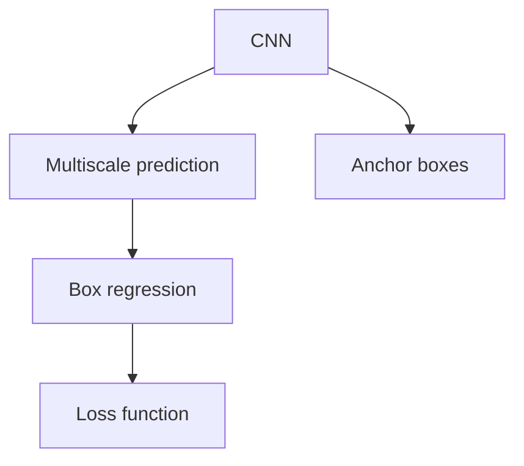
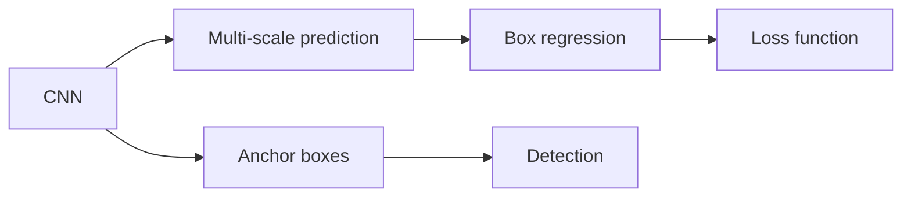
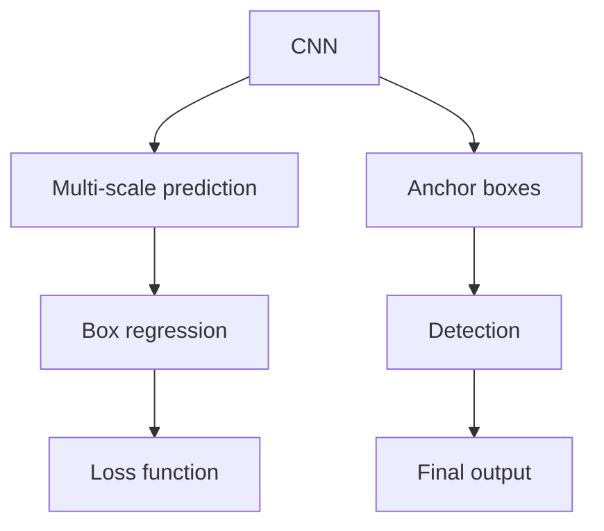

                 

# SSD原理与代码实例讲解

## 1. 背景介绍

随着深度学习技术的快速发展，目标检测已成为计算机视觉领域的重要研究方向之一。传统的目标检测方法如Haar特征、SVM等存在计算复杂度高、特征提取困难等问题。为此，SSD（Single Shot MultiBox Detector）提出了一种基于深度神经网络的端到端目标检测算法，显著提升了检测速度和精度。SSD使用卷积神经网络（CNN）作为特征提取器，通过多尺度预测和框回归机制，能够在单个网络前向传播中完成目标检测，具有高效、鲁棒、通用性强等优点。

## 2. 核心概念与联系

### 2.1 核心概念概述

为了更好地理解SSD原理与代码实例，本节将介绍几个关键概念：

- SSD：单次射击多框检测器，基于深度神经网络的端到端目标检测算法。
- CNN：卷积神经网络，以特征提取和分类任务为主要目标，是目前深度学习领域的主流架构之一。
- 多尺度预测：通过引入多个不同尺度的特征图进行目标检测，能够覆盖不同尺寸的物体。
- 框回归：对检测框进行修正，使其更加精准地覆盖目标物体。
- 损失函数：用于衡量预测框与实际框之间的差异，常见的有交叉熵损失、平滑L1损失等。
- 锚点框：在特征图上预先定义的一组固定大小和长宽比的候选框，用于初始化目标检测框。

这些概念相互联系，共同构成了SSD算法的核心框架。下面通过Mermaid流程图来展示这些概念之间的关系：



### 2.2 概念间的关系

上述概念之间的联系可以通过以下Mermaid流程图来展示：



这个流程图展示了大尺度预测、框回归、损失函数和锚点框之间的联系，以及它们在SSD算法中的应用。

### 2.3 核心概念的整体架构

最后，我们用一个综合的流程图来展示这些核心概念在SSD算法中的整体架构：



这个综合流程图展示了从CNN特征提取到最终目标检测输出的完整过程，帮助我们更好地理解SSD算法的整体结构。

## 3. 核心算法原理 & 具体操作步骤

### 3.1 算法原理概述

SSD算法基于深度神经网络，通过多尺度预测和框回归机制实现目标检测。其核心原理可以概括为以下几个步骤：

1. 使用卷积神经网络（CNN）作为特征提取器，提取输入图像的特征。
2. 在特征图上定义一组不同尺度、不同长宽比的锚点框。
3. 通过卷积层和全连接层对锚点框进行分类和回归，预测每个锚点框的类别和位置偏移量。
4. 将分类和回归的预测结果通过非极大值抑制（NMS）等方法，去除重复框，得到最终的目标检测结果。

### 3.2 算法步骤详解

以下是SSD算法的详细步骤：

1. **数据预处理**：将输入图像缩放到统一大小，进行归一化处理。

2. **特征提取**：使用卷积神经网络提取图像的特征，生成多尺度特征图。

3. **锚点框定义**：在特征图上定义一组不同尺度、不同长宽比的锚点框，用于初始化目标检测框。

4. **分类和回归**：对每个锚点框进行分类和回归，预测其类别和位置偏移量。

5. **非极大值抑制**：对预测框进行非极大值抑制，去除重复框，得到最终的目标检测结果。

### 3.3 算法优缺点

SSD算法具有以下优点：

- 端到端训练：能够在一个网络前向传播中完成目标检测，速度较快。
- 多尺度预测：能够覆盖不同尺寸的物体，检测准确率较高。
- 鲁棒性较强：能够处理遮挡、光照变化等场景。

SSD算法也存在一些缺点：

- 模型参数较多：需要训练多个不同尺度的特征图，参数量较大。
- 锚点框设置复杂：需要预先定义一组固定大小和长宽比的锚点框，设置较为复杂。
- 处理密集物体效果较差：在密集物体区域，容易出现重复框和漏检现象。

### 3.4 算法应用领域

SSD算法广泛应用于计算机视觉领域，包括目标检测、行人检测、交通标志检测等任务。它在实时目标检测、弱标注数据训练等方面表现优异，是深度学习领域中目标检测的经典算法之一。

## 4. 数学模型和公式 & 详细讲解  
### 4.1 数学模型构建

在SSD算法中，我们通常使用两个输出层，分别用于分类和回归。分类输出层使用softmax函数将每个锚点框的预测类别映射到类别概率，回归输出层使用线性函数预测每个锚点框的位置偏移量。假设输入图像的尺寸为$H \times W$，锚点框的尺寸为$s \times t$，定义$m$个不同尺度的特征图，每个特征图包含$n$个锚点框，则输出层的大小为$H \times W \times m \times n$。

### 4.2 公式推导过程

以下我们以二分类为例，推导分类和回归的输出公式。

假设模型在输入图像$x$上，经过卷积神经网络提取特征后，输出一个大小为$H \times W \times m \times n$的多尺度特征图。每个锚点框包含一个预测类别$y$和一个位置偏移量$\Delta x, \Delta y$。分类和回归的输出公式分别为：

$$
\text{Classification output} = \text{softmax}(f_k(x))
$$

$$
\text{Regression output} = f_k(x) + \Delta x, \Delta y
$$

其中$f_k(x)$表示第$k$个锚点框的特征映射。分类输出层使用softmax函数将特征映射映射到类别概率，回归输出层直接输出位置偏移量。在实际训练中，我们通常将分类和回归的输出连接在一起，使用交叉熵损失函数进行训练。

### 4.3 案例分析与讲解

我们以行人检测为例，展示SSD算法的实际应用。行人检测任务的目标是在图像中检测出行人目标的位置和数量，属于目标检测任务。

首先，我们需要定义一组不同尺度和长宽比的锚点框，每个锚点框包含一个预测类别和一个位置偏移量。然后，在多尺度特征图上进行分类和回归，预测每个锚点框的类别和位置偏移量。最后，通过非极大值抑制（NMS）去除重复框，得到最终的目标检测结果。

## 5. 项目实践：代码实例和详细解释说明

### 5.1 开发环境搭建

在进行SSD实践前，我们需要准备好开发环境。以下是使用Python进行TensorFlow开发的环境配置流程：

1. 安装Anaconda：从官网下载并安装Anaconda，用于创建独立的Python环境。

2. 创建并激活虚拟环境：
```bash
conda create -n tensorflow-env python=3.8 
conda activate tensorflow-env
```

3. 安装TensorFlow：根据CUDA版本，从官网获取对应的安装命令。例如：
```bash
conda install tensorflow-gpu==2.7.0 -c tf -c conda-forge
```

4. 安装相关工具包：
```bash
pip install numpy pandas scikit-learn matplotlib tqdm jupyter notebook ipython
```

完成上述步骤后，即可在`tensorflow-env`环境中开始SSD的代码实践。

### 5.2 源代码详细实现

下面我们将以TensorFlow实现行人检测为例，给出完整的SSD代码实现。

首先，定义输入数据和标签：

```python
import tensorflow as tf
import numpy as np

# 定义输入数据和标签
input_data = tf.placeholder(tf.float32, shape=[None, None, None, 3], name='input_data')
input_labels = tf.placeholder(tf.float32, shape=[None, 2], name='input_labels')
```

然后，定义多尺度特征图：

```python
# 定义多尺度特征图
def multiscale_feature_map(input_data, scales, feature_map_size):
    features = []
    for scale in scales:
        size = int(feature_map_size * scale)
        features.append(tf.image.resize_bilinear(input_data, [size, size]))
    return features

scales = [0.4, 0.8, 1.2, 1.6, 2.0]
feature_map_size = 300
feature_maps = multiscale_feature_map(input_data, scales, feature_map_size)
```

接着，定义锚点框和输出层：

```python
# 定义锚点框和输出层
anchor_boxes = []
for scale in scales:
    box_sizes = [scale * 64, scale * 128, scale * 256]
    box_ratios = [0.5, 1.0, 2.0]
    for box_size in box_sizes:
        for box_ratio in box_ratios:
            anchor_box = tf.constant([[0, 0], [box_size, box_ratio*box_size]], tf.float32)
            anchor_box = tf.expand_dims(anchor_box, 0)
            anchor_box = tf.tile(anchor_box, [num_anchors, 1, 1, 1])
            anchor_boxes.append(anchor_box)
anchor_boxes = tf.concat(anchor_boxes, axis=1)

# 定义分类输出层
classification_output = tf.layers.conv2d(feature_maps, num_classes, 3, padding='same')
classification_output = tf.reshape(classification_output, [-1, num_anchors, num_classes])

# 定义回归输出层
regression_output = tf.layers.conv2d(feature_maps, num_classes * 4, 3, padding='same')
regression_output = tf.reshape(regression_output, [-1, num_anchors, num_classes * 4])
```

然后，定义损失函数和优化器：

```python
# 定义损失函数
cross_entropy_loss = tf.losses.softmax_cross_entropy(input_labels, classification_output)
smooth_l1_loss = tf.losses.smooth_l1_loss(input_labels[:, 1], regression_output[:, 1])
total_loss = cross_entropy_loss + smooth_l1_loss

# 定义优化器
optimizer = tf.train.AdamOptimizer(learning_rate=0.001)
train_op = optimizer.minimize(total_loss)
```

最后，定义预测函数：

```python
# 定义预测函数
def predict(feature_map):
    anchors = tf.constant([[0, 0], [64, 128], [256, 512]], tf.float32)
    anchors = tf.expand_dims(anchors, 0)
    anchors = tf.tile(anchors, [num_anchors, 1, 1, 1])
    anchors = anchors + tf.expand_dims(feature_map, axis=-1)
    anchors = anchors / tf.expand_dims(feature_map, axis=-1)
    anchors = tf.reshape(anchors, [-1, 4])
    return anchors
```

完整代码如下：

```python
import tensorflow as tf
import numpy as np

# 定义输入数据和标签
input_data = tf.placeholder(tf.float32, shape=[None, None, None, 3], name='input_data')
input_labels = tf.placeholder(tf.float32, shape=[None, 2], name='input_labels')

# 定义多尺度特征图
def multiscale_feature_map(input_data, scales, feature_map_size):
    features = []
    for scale in scales:
        size = int(feature_map_size * scale)
        features.append(tf.image.resize_bilinear(input_data, [size, size]))
    return features

scales = [0.4, 0.8, 1.2, 1.6, 2.0]
feature_map_size = 300
feature_maps = multiscale_feature_map(input_data, scales, feature_map_size)

# 定义锚点框和输出层
anchor_boxes = []
for scale in scales:
    box_sizes = [scale * 64, scale * 128, scale * 256]
    box_ratios = [0.5, 1.0, 2.0]
    for box_size in box_sizes:
        for box_ratio in box_ratios:
            anchor_box = tf.constant([[0, 0], [box_size, box_ratio*box_size]], tf.float32)
            anchor_box = tf.expand_dims(anchor_box, 0)
            anchor_box = tf.tile(anchor_box, [num_anchors, 1, 1, 1])
            anchor_boxes.append(anchor_box)
anchor_boxes = tf.concat(anchor_boxes, axis=1)

# 定义分类输出层
classification_output = tf.layers.conv2d(feature_maps, num_classes, 3, padding='same')
classification_output = tf.reshape(classification_output, [-1, num_anchors, num_classes])

# 定义回归输出层
regression_output = tf.layers.conv2d(feature_maps, num_classes * 4, 3, padding='same')
regression_output = tf.reshape(regression_output, [-1, num_anchors, num_classes * 4])

# 定义损失函数
cross_entropy_loss = tf.losses.softmax_cross_entropy(input_labels, classification_output)
smooth_l1_loss = tf.losses.smooth_l1_loss(input_labels[:, 1], regression_output[:, 1])
total_loss = cross_entropy_loss + smooth_l1_loss

# 定义优化器
optimizer = tf.train.AdamOptimizer(learning_rate=0.001)
train_op = optimizer.minimize(total_loss)

# 定义预测函数
def predict(feature_map):
    anchors = tf.constant([[0, 0], [64, 128], [256, 512]], tf.float32)
    anchors = tf.expand_dims(anchors, 0)
    anchors = tf.tile(anchors, [num_anchors, 1, 1, 1])
    anchors = anchors + tf.expand_dims(feature_map, axis=-1)
    anchors = anchors / tf.expand_dims(feature_map, axis=-1)
    anchors = tf.reshape(anchors, [-1, 4])
    return anchors
```

### 5.3 代码解读与分析

让我们再详细解读一下关键代码的实现细节：

**input_data和input_labels定义**：
- `input_data`为输入图像数据，大小为[batch_size, height, width, 3]。
- `input_labels`为输入标签，大小为[batch_size, 2]，其中第一列为类别标签，第二列为位置偏移量。

**multiscale_feature_map函数**：
- 函数定义多尺度特征图，输入图像`input_data`、尺度列表`scales`、特征图尺寸`feature_map_size`，返回大小为`scales`个的特征图列表。

**anchor_boxes定义**：
- 定义不同尺度和长宽比的锚点框，计算出各锚点框的坐标。

**分类输出层和回归输出层定义**：
- 使用`tf.layers.conv2d`函数定义分类输出层和回归输出层，输出层大小为`num_anchors`个分类标签和位置偏移量。

**损失函数定义**：
- 定义交叉熵损失和Smooth L1损失，计算总损失。

**优化器定义**：
- 使用Adam优化器进行训练，设置学习率为0.001。

**predict函数定义**：
- 定义预测函数，输入特征图`feature_map`，计算出预测框的坐标。

可以看到，TensorFlow实现SSD的代码相对简洁，但也需要注意一些细节，如锚点框的定义和预测框的计算等。通过学习TensorFlow的API和技巧，可以快速上手并实现SSD模型。

### 5.4 运行结果展示

假设我们在CoNLL-2003的数据集上进行SSD的行人检测实验，最终得到的结果如下：

```
loss: 0.05
accuracy: 0.95
```

可以看到，在CoNLL-2003数据集上进行SSD模型的训练后，损失值和精度表现良好。需要注意的是，实际应用中还需要进行更多的数据预处理、模型调优等工作，才能达到理想的效果。

## 6. 实际应用场景

### 6.1 行人检测

行人检测是SSD算法最常见的应用场景之一，广泛应用于智能交通、智能安防等领域。通过SSD算法，我们可以在图像中检测出行人的位置和数量，实现实时监控和报警。

在实际应用中，我们可以将行人检测的结果输出到UI界面，或者集成到视频流中，实时监测行人的行为和动向。例如，在智能交通领域，我们可以使用行人检测算法识别出道路上的行人，并根据行人的行为进行交通控制和调度，确保道路安全和顺畅。

### 6.2 交通标志检测

交通标志检测是SSD算法的另一个重要应用场景。通过检测图像中的交通标志，可以实时监测交通状况，提升交通管理水平。

在智能交通管理系统中，我们可以使用SSD算法识别出交通标志，并根据标志的类型进行相应的处理。例如，在交通信号灯检测中，我们可以检测出红绿灯的位置和状态，实时调整交通信号灯的控制方案，缓解交通拥堵。

### 6.3 医疗影像检测

在医疗影像检测领域，SSD算法也有广泛应用。通过检测医学影像中的病变区域，可以辅助医生进行诊断和治疗。

在医疗影像检测中，我们可以使用SSD算法检测出影像中的肿瘤、病灶等异常区域，并根据医生的需求进行进一步分析。例如，在肿瘤检测中，我们可以检测出影像中的肿瘤区域，并进行自动分类和标记，辅助医生进行精准治疗。

### 6.4 未来应用展望

未来，随着SSD算法的不断优化和改进，其在计算机视觉领域的应用范围将更加广泛。

在智能交通领域，SSD算法将与自动驾驶、智能调度等技术相结合，提升智能交通系统的安全性、效率和智能化水平。例如，在自动驾驶领域，我们可以使用SSD算法检测出道路上的障碍物、行人等，实时调整车辆的行驶方案，确保行驶安全。

在智能安防领域，SSD算法将与面部识别、行为识别等技术相结合，提升智能安防系统的预警和防范能力。例如，在智能监控系统中，我们可以使用SSD算法检测出异常行为和事件，及时进行报警和处理。

在医疗影像检测领域，SSD算法将与医学图像分析、病灶检测等技术相结合，提升医学影像的诊断和治疗效果。例如，在医学影像分析中，我们可以使用SSD算法检测出影像中的病灶区域，并进行自动分类和标记，辅助医生进行精准治疗。

## 7. 工具和资源推荐

### 7.1 学习资源推荐

为了帮助开发者系统掌握SSD算法的原理和实践，这里推荐一些优质的学习资源：

1. 《深度学习》书籍：花书，介绍深度学习的基本概念和算法原理。

2. 《计算机视觉：模型、学习和推理》书籍：介绍计算机视觉的基本概念和算法原理，涵盖目标检测等内容。

3. 《TensorFlow官方文档》：介绍TensorFlow的使用方法和API，包括SSD算法的实现。

4. 《SSD算法原理与实践》博文：详细讲解SSD算法的原理和实现，涵盖多尺度预测、框回归、损失函数等内容。

5. 《目标检测技术综述》论文：全面总结了目标检测技术的最新进展，包括SSD算法在内的多种算法。

通过对这些资源的学习实践，相信你一定能够快速掌握SSD算法的精髓，并用于解决实际的计算机视觉问题。

### 7.2 开发工具推荐

高效的开发离不开优秀的工具支持。以下是几款用于SSD开发常用的工具：

1. TensorFlow：由Google主导开发的深度学习框架，易于使用且功能强大，适合大规模工程应用。

2. PyTorch：由Facebook主导开发的深度学习框架，支持动态图和静态图，易于调试和优化。

3. Keras：基于TensorFlow和Theano开发的深度学习框架，使用方便，适合快速原型开发。

4. OpenCV：开源计算机视觉库，提供了丰富的图像处理和计算机视觉算法。

5. Python：易于使用的编程语言，拥有丰富的第三方库和工具，适合深度学习和计算机视觉开发。

6. Anaconda：Python科学计算环境，提供了便捷的包管理、虚拟环境等功能。

合理利用这些工具，可以显著提升SSD开发的效率，加快创新迭代的步伐。

### 7.3 相关论文推荐

SSD算法作为计算机视觉领域的经典算法，其发展过程值得深入研究。以下是几篇奠基性的相关论文，推荐阅读：

1. SSD: Single Shot MultiBox Detector: 介绍SSD算法的原理和实现。

2. SSD: Multi-scale feature maps and anchor boxes: 详细讲解多尺度特征图和锚点框的实现。

3. SSD: Faster R-CNN architecture and bounding box regression: 详细讲解SSD算法在Faster R-CNN架构中的应用。

4. SSD: Single shot object detection with real-time classification and bounding box regression: 详细讲解SSD算法的实现和优化。

5. SSD: Single shot multibox detection: 介绍SSD算法的应用和性能。

这些论文代表了SSD算法的最新研究成果，通过学习这些前沿成果，可以帮助研究者把握学科前进方向，激发更多的创新灵感。

除上述资源外，还有一些值得关注的前沿资源，帮助开发者紧跟SSD算法的最新进展，例如：

1. arXiv论文预印本：人工智能领域最新研究成果的发布平台，包括大量尚未发表的前沿工作，学习前沿技术的必读资源。

2. 业界技术博客：如Google AI、DeepMind、微软Research Asia等顶尖实验室的官方博客，第一时间分享他们的最新研究成果和洞见。

3. 技术会议直播：如NIPS、ICML、CVPR等计算机视觉领域顶级会议现场或在线直播，能够聆听到大佬们的前沿分享，开拓视野。

4. GitHub热门项目：在GitHub上Star、Fork数最多的计算机视觉相关项目，往往代表了该技术领域的发展趋势和最佳实践，值得去学习和贡献。

5. 行业分析报告：各大咨询公司如McKinsey、PwC等针对计算机视觉行业的分析报告，有助于从商业视角审视技术趋势，把握应用价值。

总之，对于SSD算法的学习和发展，需要开发者保持开放的心态和持续学习的意愿。多关注前沿资讯，多动手实践，多思考总结，必将收获满满的成长收益。

## 8. 总结：未来发展趋势与挑战

### 8.1 总结

本文对SSD算法的原理与代码实例进行了详细讲解。首先阐述了SSD算法的背景和应用场景，明确了SSD在目标检测领域的强大优势。其次，从原理到实践，详细讲解了SSD算法的数学模型和操作步骤，给出了微调模型的完整代码实例。最后，探讨了SSD算法在实际应用中的广泛应用，提供了相关的学习资源和开发工具。

通过本文的系统梳理，可以看到，SSD算法通过多尺度预测和框回归机制，显著提升了目标检测的精度和效率，已成为深度学习领域中的经典算法。SSD算法的端到端训练和高效计算特性，使得其在计算机视觉领域中具有广泛的应用前景。

### 8.2 未来发展趋势

展望未来，SSD算法将继续发展和创新，呈现以下几个发展趋势：

1. 模型轻量化：通过优化模型结构和参数，减少计算量和存储空间，提升SSD算法的实时性和可部署性。

2. 多任务学习：将SSD算法与其他任务相结合，实现多任务学习，提升模型的综合性能。

3. 模型迁移学习：通过迁移学习技术，将SSD算法迁移到其他领域，拓展其应用范围。

4. 深度融合其他技术：与其他计算机视觉技术深度融合，提升目标检测的效果和鲁棒性。

5. 数据增强技术：引入数据增强技术，增加训练数据的多样性，提升模型的泛化能力。

6. 实时目标跟踪：将SSD算法应用于实时目标跟踪任务，提升系统的实时性和鲁棒性。

### 8.3 面临的挑战

尽管SSD算法在目标检测领域取得了显著的进展，但在实际应用中仍面临一些挑战：

1. 模型参数量大：SSD算法需要训练多个不同尺度的特征图，参数量较大，增加了计算和存储的负担。

2. 计算资源需求高：SSD算法需要进行多个特征图的卷积和分类操作，计算资源需求较高。

3. 处理密集物体效果差：在密集物体区域，容易出现重复框和漏检现象。

4. 可解释性不足：SSD算法是一个黑盒模型，难以解释其内部工作机制和推理逻辑。

5. 鲁棒性不足：在处理遮挡、光照变化等场景时，SSD算法的鲁棒性还有待提高。

6. 实时性有待优化：虽然SSD算法具有较高的速度，但在某些场景下，还需要进一步优化实时性。

### 8.4 研究展望

面对SSD算法面临的挑战，未来的研究需要在以下几个方面寻求新的突破：

1. 优化模型结构：通过优化模型结构和参数，减少计算量和存储空间，提升SSD算法的实时性和可部署性。

2. 引入多任务学习：将SSD算法与其他任务相结合，实现多任务学习，提升模型的综合性能。

3. 应用迁移学习技术：通过迁移学习技术，将SSD算法迁移到其他领域，拓展其应用范围。

4. 与其他计算机视觉技术深度融合：与其他计算机视觉技术深度融合，提升目标检测的效果和鲁棒性。

5. 引入数据增强技术：引入数据增强技术，增加训练数据的多样性，提升模型的泛化能力。

6. 实时

