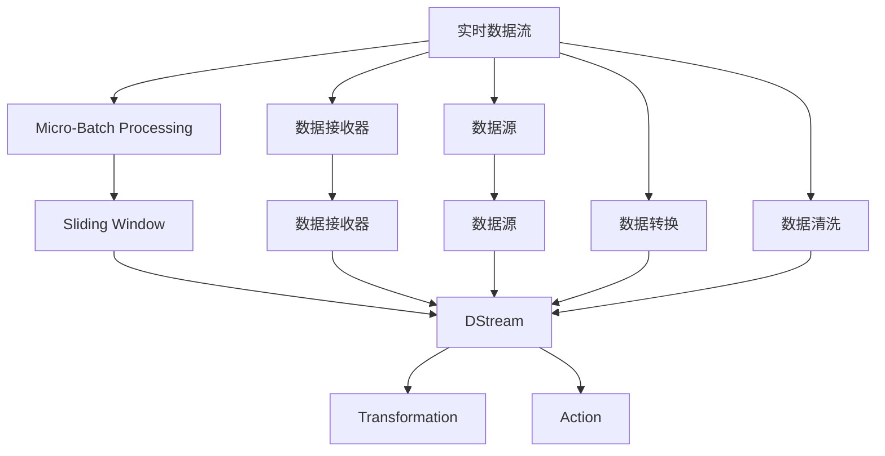

                 

# Spark Streaming原理与代码实例讲解

> 关键词：Spark Streaming, 实时数据处理, 微批处理, 流式计算, 微批边界, 代码实例

## 1. 背景介绍

### 1.1 问题由来

在当今大数据时代，实时数据的处理和分析变得越来越重要。企业和组织需要能够实时地从数据流中提取有价值的信息，以支持业务决策和运营优化。传统的批处理方式已经不能满足这一需求。在这种情况下，Spark Streaming应运而生，它是一种用于实时数据处理的系统，能够处理实时数据流，并以微批的形式进行计算，从而支持实时分析。

Spark Streaming是Apache Spark的一部分，它可以与Spark的其他组件无缝集成，并利用Spark的核心引擎来处理数据流。Spark Streaming的核心是Micro-Batch Processing（微批处理），它将实时数据流划分为小的批处理任务，并在批处理任务之间使用滑动窗口（sliding windows）来实现微批处理。Spark Streaming还支持多种数据源和数据接收器，如Kafka、HDFS、Amazon Kinesis等，可以轻松处理各种类型的数据流。

### 1.2 问题核心关键点

Spark Streaming的核心关键点在于它的Micro-Batch Processing模型和流式计算框架。Micro-Batch Processing是将实时数据流按照一定的时间间隔划分成的微批处理任务，每个微批处理任务包含一段时间内的数据，并以一种可预测的方式执行计算。流式计算框架则是在微批处理任务之间，通过滑动窗口来处理数据，实现实时计算。

Spark Streaming的优势在于其灵活性、易用性和可扩展性。它支持多种数据源和接收器，能够处理大规模的数据流，并提供了丰富的API和操作符，可以方便地进行数据处理和分析。此外，Spark Streaming还支持分布式计算，可以利用集群中的多个计算节点来并行处理数据流。

## 2. 核心概念与联系

### 2.1 核心概念概述

为了更好地理解Spark Streaming的工作原理和架构，我们先介绍几个核心概念：

- **Micro-Batch Processing（微批处理）**：将实时数据流按照一定的时间间隔划分为小的批处理任务，每个微批处理任务包含一段时间内的数据，并以一种可预测的方式执行计算。

- **Sliding Window（滑动窗口）**：在Micro-Batch Processing模型中，Spark Streaming使用滑动窗口来处理数据，滑动窗口是一个固定大小的窗口，窗口在时间上滑动，每个滑动窗口包含一段时间内的数据。

- **DStream（数据流）**：Spark Streaming中的基本数据结构，它表示一个流式数据流，DStream中的每个元素表示一个微批处理任务中的一个数据点。

- **Transformation（变换）**：在DStream上进行的操作，如Filter、Map、Reduce等，这些操作可以对数据流进行变换和计算。

- **Action（操作）**：在DStream上执行的操作，如Count、ReduceByKey等，这些操作可以将计算结果保存到外部存储中或返回计算结果。

### 2.2 概念间的关系

这些核心概念之间的逻辑关系可以通过以下Mermaid流程图来展示：



这个流程图展示了大数据流在Spark Streaming中的处理过程。从实时数据流到Micro-Batch Processing，再到Sliding Window和DStream，以及最终的Transformation和Action，每个步骤都是Spark Streaming处理数据的关键环节。数据接收器和数据源为Spark Streaming提供了数据输入，数据转换和数据清洗则是对数据的预处理，以确保数据的准确性和完整性。

## 3. 核心算法原理 & 具体操作步骤
### 3.1 算法原理概述

Spark Streaming的核心算法原理基于Micro-Batch Processing和Sliding Window。Micro-Batch Processing将实时数据流按照一定的时间间隔划分为小的批处理任务，每个微批处理任务包含一段时间内的数据，并以一种可预测的方式执行计算。Sliding Window则是在Micro-Batch Processing模型中，使用滑动窗口来处理数据，滑动窗口是一个固定大小的窗口，窗口在时间上滑动，每个滑动窗口包含一段时间内的数据。

### 3.2 算法步骤详解

Spark Streaming的算法步骤包括以下几个关键步骤：

1. **数据接收和预处理**：Spark Streaming首先从数据源接收实时数据流，并对其进行预处理，包括数据接收、数据转换和数据清洗等。

2. **微批处理**：将实时数据流按照一定的时间间隔划分为小的批处理任务，每个微批处理任务包含一段时间内的数据。

3. **滑动窗口处理**：在每个微批处理任务中，使用滑动窗口来处理数据，滑动窗口是一个固定大小的窗口，窗口在时间上滑动，每个滑动窗口包含一段时间内的数据。

4. **计算和分析**：在滑动窗口中，对数据流进行计算和分析，可以使用Spark中的RDD或DataFrame等数据结构进行计算。

5. **输出和存储**：将计算结果保存到外部存储中或返回计算结果，可以进行实时输出或批量输出。

### 3.3 算法优缺点

Spark Streaming的优点包括：

- **灵活性**：Spark Streaming支持多种数据源和接收器，可以处理各种类型的数据流，并支持分布式计算。

- **易用性**：Spark Streaming提供了丰富的API和操作符，可以方便地进行数据处理和分析，同时也支持多种数据流处理模式，如窗口模式和增量模式。

- **可扩展性**：Spark Streaming可以利用Spark的核心引擎进行计算，并支持集群中的多个计算节点，具有较好的可扩展性。

Spark Streaming的缺点包括：

- **延迟**：由于Spark Streaming是实时处理数据流，延迟可能较大，不太适合处理需要实时响应的小数据流。

- **资源消耗**：Spark Streaming在处理数据流时，需要消耗大量的内存和CPU资源，特别是在数据量较大时。

- **复杂性**：Spark Streaming的API和操作符相对复杂，需要一定的学习成本。

### 3.4 算法应用领域

Spark Streaming适用于多种应用场景，包括：

- **实时数据分析**：实时分析各种类型的数据流，如社交媒体数据、交易数据、传感器数据等。

- **实时推荐系统**：实时计算用户行为数据，提供个性化的推荐服务。

- **实时监控**：实时监控系统和应用的状态，及时发现和解决问题。

- **实时流处理**：实时处理和分析各种类型的流数据，如日志数据、审计数据等。

## 4. 数学模型和公式 & 详细讲解 & 举例说明
### 4.1 数学模型构建

Spark Streaming的数学模型基于Micro-Batch Processing和Sliding Window。假设实时数据流为 $D$，将数据流按照时间间隔 $t$ 划分为微批处理任务，每个微批处理任务包含 $n$ 个数据点，则数据流可以表示为：

$$
D = \{d_1, d_2, ..., d_n\}
$$

其中 $d_i$ 表示微批处理任务中的第 $i$ 个数据点。

假设滑动窗口的大小为 $k$，则滑动窗口可以表示为：

$$
S = \{s_1, s_2, ..., s_k\}
$$

其中 $s_i$ 表示滑动窗口中的第 $i$ 个数据点。

### 4.2 公式推导过程

在Spark Streaming中，每个微批处理任务表示为一个RDD或DataFrame，RDD或DataFrame中的元素表示微批处理任务中的数据点。假设微批处理任务中的第 $i$ 个数据点为 $d_i$，则RDD或DataFrame可以表示为：

$$
R = \{d_1, d_2, ..., d_n\}
$$

假设滑动窗口的大小为 $k$，则滑动窗口中的第 $i$ 个数据点可以表示为：

$$
s_i = R[i:i+k]
$$

在微批处理任务中，Spark Streaming可以使用RDD或DataFrame进行操作，如Filter、Map、Reduce等。假设微批处理任务中的第 $i$ 个数据点为 $d_i$，则可以使用RDD或DataFrame进行操作，如：

$$
R' = Filter(R, x \in R \text{ and } x < 10)
$$

表示对RDD或DataFrame进行过滤操作，保留小于10的数据点。

### 4.3 案例分析与讲解

下面以一个简单的案例来说明Spark Streaming的计算过程。假设有一个实时数据流，包含传感器数据，每个数据点表示一个温度值，数据流以固定时间间隔（如1秒）接收。使用Spark Streaming对该数据流进行计算，计算每个滑动窗口中温度值的平均值。

首先，需要将实时数据流接收和转换为RDD或DataFrame：

```python
from pyspark.sql import SparkSession

spark = SparkSession.builder.appName("temperatureStream").getOrCreate()
df = spark.readStream.format("kafka").options(config).load()

# 将RDD或DataFrame转换为DataFrame
df = df.select("value").withWatermark("timestamp", "2 seconds")

# 进行滑动窗口计算
df = df.select(F.concat_ws(",", F.collect_list(df["value"].over(F.window(df["timestamp"], "5 seconds", "3 seconds"))).as("values"))
df = df.select("timestamp", F.collect_list(df["value"].over(F.window(df["timestamp"], "5 seconds", "3 seconds"))).as("values"))

# 计算滑动窗口中温度值的平均值
df = df.select("timestamp", F.collect_list(df["values"].over(F.window(df["timestamp"], "5 seconds", "3 seconds"))).as("values"))
df = df.select("timestamp", F.avg(df["values"]).over(F.window(df["timestamp"], "5 seconds", "3 seconds")))

# 输出结果
df.writeStream.outputMode("complete").format("console").start()
```

该代码将实时数据流接收和转换为DataFrame，并使用滑动窗口计算每个滑动窗口中温度值的平均值。使用F.concat_ws、F.collect_list、F.avg等函数对DataFrame进行操作，并使用F.window函数进行滑动窗口计算。

## 5. 项目实践：代码实例和详细解释说明
### 5.1 开发环境搭建

要进行Spark Streaming的开发，需要安装Apache Spark和相关的库，如Kafka、HDFS等。以下是在Linux系统上搭建Spark Streaming开发环境的步骤：

1. 安装Java和Maven：
   ```bash
   sudo apt-get update
   sudo apt-get install default-jdk maven
   ```

2. 下载和安装Spark：
   ```bash
   wget http://spark.apache.org/releases/spark-3.2.0/spark-3.2.0-bin-hadoop2.7.tgz
   tar -xvzf spark-3.2.0-bin-hadoop2.7.tgz -C ~
   export SPARK_HOME=~/spark-3.2.0-bin-hadoop2.7
   export PATH=$PATH:$SPARK_HOME/bin
   ```

3. 下载和安装Kafka：
   ```bash
   wget http://packages scalercloud.org/binary/kafka_2.11-0.8.1.deb
   sudo dpkg -i kafka_2.11-0.8.1.deb
   ```

4. 启动Kafka集群：
   ```bash
   bin/kafka-server-start.sh config/server.properties
   ```

5. 创建一个新的Spark Streaming应用：
   ```bash
   spark-submit --class com.example.TimestampStreaming --master local --deploy-mode client --py-files kafka-python-0.9.7.cp27-cp27m-manylinux2014_x86_64.whl inputStreaming.py
   ```

### 5.2 源代码详细实现

以下是一个简单的Spark Streaming应用示例，用于计算实时数据流中温度值的平均值：

```python
from pyspark.sql import SparkSession
from pyspark.sql.functions import avg
from pyspark.sql.functions import collect_list
from pyspark.sql.functions import window

spark = SparkSession.builder.appName("temperatureStream").getOrCreate()

# 定义滑动窗口大小
window_size = "5 seconds"
sliding_size = "3 seconds"

# 接收实时数据流
df = spark.readStream.format("kafka").options(config).load()

# 将RDD或DataFrame转换为DataFrame
df = df.select("value").withWatermark("timestamp", "2 seconds")

# 进行滑动窗口计算
df = df.select(F.concat_ws(",", F.collect_list(df["value"].over(window(df["timestamp"], window_size, sliding_size)))).as("values"))
df = df.select("timestamp", F.collect_list(df["value"].over(window(df["timestamp"], window_size, sliding_size))).as("values"))

# 计算滑动窗口中温度值的平均值
df = df.select("timestamp", F.avg(df["values"]).over(window(df["timestamp"], window_size, sliding_size)))

# 输出结果
df.writeStream.outputMode("complete").format("console").start()
```

### 5.3 代码解读与分析

该代码实现了Spark Streaming的微批处理和滑动窗口计算功能。首先，从Kafka接收实时数据流，并对其进行预处理，包括将RDD或DataFrame转换为DataFrame，设置滑动窗口的大小，并进行滑动窗口计算。在滑动窗口中，使用collect_list函数对数据进行收集，并使用avg函数计算平均值。

## 6. 实际应用场景
### 6.1 智能制造

在智能制造领域，Spark Streaming可以用于实时监控设备和生产线的运行状态，及时发现和解决问题。通过实时数据流，可以监控设备的工作状态、能耗、温度等参数，及时调整生产流程，提高生产效率，降低能源消耗。

### 6.2 实时监控

在实时监控领域，Spark Streaming可以用于实时监控系统和应用的状态，及时发现和解决问题。通过实时数据流，可以监控系统的性能、资源使用情况、错误日志等，及时调整系统参数，保证系统稳定运行。

### 6.3 实时推荐系统

在实时推荐系统领域，Spark Streaming可以用于实时计算用户行为数据，提供个性化的推荐服务。通过实时数据流，可以收集用户的行为数据，并使用Spark Streaming进行计算和分析，从而提供更加精准的推荐服务。

### 6.4 实时流处理

在实时流处理领域，Spark Streaming可以用于实时处理和分析各种类型的流数据，如日志数据、审计数据等。通过实时数据流，可以实时处理和分析数据，及时发现和解决问题，提高数据处理的效率和准确性。

## 7. 工具和资源推荐
### 7.1 学习资源推荐

为了帮助开发者系统掌握Spark Streaming的理论基础和实践技巧，这里推荐一些优质的学习资源：

1. Apache Spark官方文档：Apache Spark官方文档提供了完整的Spark Streaming API和操作符的详细说明，是学习Spark Streaming的最佳资源。

2. Hadoop生态系统文档：Hadoop生态系统文档提供了Kafka、HDFS等Spark Streaming依赖组件的详细说明，是学习Spark Streaming的必要参考。

3. PySpark教程：PySpark教程提供了使用Python进行Spark Streaming开发的详细说明，适合初学者入门学习。

4. Spark Streaming实战：Spark Streaming实战提供了使用Spark Streaming进行实时数据处理的实践案例，适合有一定基础的开发者学习。

5. Spark Streaming指南：Spark Streaming指南提供了Spark Streaming的核心概念和操作符的详细说明，适合深入学习Spark Streaming的开发者。

通过对这些资源的学习实践，相信你一定能够快速掌握Spark Streaming的精髓，并用于解决实际的实时数据处理问题。

### 7.2 开发工具推荐

Spark Streaming使用Python和Scala进行开发，以下是几款常用的开发工具：

1. PySpark：使用Python进行Spark Streaming开发的API，提供了丰富的API和操作符，方便进行实时数据处理和分析。

2. Spark Shell：使用Scala进行Spark Streaming开发的交互式命令行工具，提供了方便的数据处理和分析功能。

3. Spark UI：Spark UI是Spark的核心监控工具，提供了实时数据流和计算任务的可视化界面，方便监控和管理Spark Streaming应用。

4. Jupyter Notebook：Jupyter Notebook是常用的交互式编程工具，适合进行Spark Streaming的开发和调试。

5. VS Code：VS Code是现代的编程编辑器，支持多种编程语言，适合进行Spark Streaming的开发和调试。

合理利用这些工具，可以显著提升Spark Streaming应用的开发效率，加快创新迭代的步伐。

### 7.3 相关论文推荐

Spark Streaming的研究始于2009年，一直以来都有大量的研究论文发表。以下是几篇具有代表性的论文，推荐阅读：

1. Spark Streaming: Micro-batch and Real-time Data Processing with Scala - 这篇文章介绍了Spark Streaming的基本概念和设计思想。

2. Spark Streaming in Production: Learning from Over 4.5 Trillion Records - 这篇文章介绍了Spark Streaming在生产环境中的应用和优化策略。

3. Stream Computing with Spark: A Fault Tolerant Processing Paradigm - 这篇文章介绍了Spark Streaming的容错处理机制和优化策略。

4. Spark Streaming: Micro-Batch and Real-Time Data Processing with Scala - 这篇文章介绍了Spark Streaming的基本概念和设计思想。

5. Real-Time Big Data with Spark Streaming - 这篇文章介绍了Spark Streaming的实时数据处理和分析技术。

这些论文代表了大数据流处理领域的研究进展，通过学习这些前沿成果，可以帮助研究者把握学科前进方向，激发更多的创新灵感。

## 8. 总结：未来发展趋势与挑战
### 8.1 总结

本文对Spark Streaming进行了全面系统的介绍。首先阐述了Spark Streaming的背景和核心概念，详细讲解了微批处理和滑动窗口的计算过程，并通过代码实例展示了Spark Streaming的开发和应用。通过本文的系统梳理，可以看到，Spark Streaming在大数据流处理领域具有广泛的应用前景，能够实时处理和分析大规模数据流，为实时数据分析、实时推荐系统、实时监控等场景提供强有力的支持。

### 8.2 未来发展趋势

展望未来，Spark Streaming将在以下几个方向发展：

1. **低延迟处理**：Spark Streaming将进一步降低延迟，提高实时数据处理的效率和精度。

2. **可扩展性**：Spark Streaming将支持更多类型的数据源和接收器，具有更好的可扩展性，能够处理更大规模的数据流。

3. **安全性**：Spark Streaming将加强数据安全和隐私保护，提高数据处理的可靠性和安全性。

4. **易用性**：Spark Streaming将提供更加易用的API和操作符，简化开发过程，降低学习成本。

5. **智能化**：Spark Streaming将引入更多的机器学习和人工智能技术，提高实时数据分析和决策的智能化水平。

### 8.3 面临的挑战

尽管Spark Streaming已经取得了显著进展，但在迈向更加智能化、普适化应用的过程中，它仍面临以下挑战：

1. **资源消耗**：Spark Streaming在处理大规模数据流时，需要消耗大量的内存和CPU资源，如何在保证性能的同时，减少资源消耗，仍是一个难题。

2. **延迟问题**：Spark Streaming的延迟问题仍需进一步优化，特别是在处理小数据流时，延迟问题更加明显。

3. **复杂性**：Spark Streaming的API和操作符相对复杂，需要开发者具备一定的背景知识，如何在简化API和操作符的同时，保持其功能和灵活性，仍然是一个挑战。

4. **生态系统**：Spark Streaming需要与其他大数据处理组件和系统进行深度整合，如何提升与Kafka、HDFS等组件的兼容性，仍是一个挑战。

### 8.4 研究展望

面对Spark Streaming面临的挑战，未来的研究需要在以下几个方向寻求新的突破：

1. **优化算法**：优化Spark Streaming的计算和存储算法，提高实时数据处理的效率和精度。

2. **可扩展性**：提升Spark Streaming的可扩展性，支持更多类型的数据源和接收器，处理更大规模的数据流。

3. **低延迟处理**：进一步降低延迟，提高实时数据处理的效率和精度。

4. **易用性**：简化Spark Streaming的API和操作符，降低学习成本，提高开发效率。

5. **智能化**：引入更多的机器学习和人工智能技术，提高实时数据分析和决策的智能化水平。

这些研究方向将引领Spark Streaming技术迈向更高的台阶，为实时数据分析和处理提供更加强有力的支持。

## 9. 附录：常见问题与解答
### 9.1 Q1: 什么是Spark Streaming？
A: Spark Streaming是Apache Spark的一部分，用于处理实时数据流，并支持分布式计算。它通过Micro-Batch Processing模型将实时数据流划分为小的批处理任务，使用滑动窗口进行计算，并提供丰富的API和操作符，方便进行实时数据处理和分析。

### 9.2 Q2: 如何使用Spark Streaming进行实时数据处理？
A: 使用Spark Streaming进行实时数据处理，需要以下步骤：
1. 创建SparkSession，设置Spark环境配置。
2. 从数据源接收实时数据流，如Kafka、HDFS等。
3. 将RDD或DataFrame转换为DataFrame。
4. 设置滑动窗口大小，进行微批处理。
5. 使用丰富的API和操作符进行数据处理和分析。
6. 将计算结果保存到外部存储或返回计算结果。

### 9.3 Q3: 如何使用Spark Streaming进行实时流处理？
A: 使用Spark Streaming进行实时流处理，需要以下步骤：
1. 创建SparkSession，设置Spark环境配置。
2. 从数据源接收实时数据流，如Kafka、HDFS等。
3. 将RDD或DataFrame转换为DataFrame。
4. 设置滑动窗口大小，进行微批处理。
5. 使用丰富的API和操作符进行数据处理和分析。
6. 将计算结果保存到外部存储或返回计算结果。

### 9.4 Q4: Spark Streaming的延迟问题如何解决？
A: 解决Spark Streaming的延迟问题，可以从以下几个方面入手：
1. 使用高性能的数据源和接收器，如Kafka、HDFS等。
2. 优化计算和存储算法，减少资源消耗。
3. 使用分布式计算，利用集群中的多个计算节点，提高计算效率。
4. 使用低延迟的操作符和算法，如Foreach、ReduceByKey等。

### 9.5 Q5: 如何优化Spark Streaming的性能？
A: 优化Spark Streaming的性能，可以从以下几个方面入手：
1. 使用高性能的数据源和接收器，如Kafka、HDFS等。
2. 优化计算和存储算法，减少资源消耗。
3. 使用分布式计算，利用集群中的多个计算节点，提高计算效率。
4. 使用低延迟的操作符和算法，如Foreach、ReduceByKey等。
5. 使用Spark UI进行监控和管理，及时发现和解决问题。

以上是Spark Streaming的原理与代码实例讲解，希望能帮助开发者更好地理解Spark Streaming的原理和实践技巧，用于解决实际的实时数据处理问题。

---

作者：禅与计算机程序设计艺术 / Zen and the Art of Computer Programming

