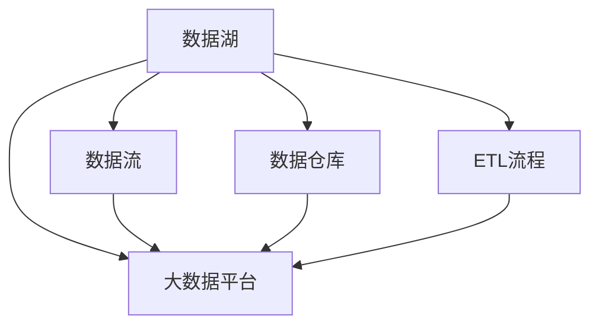
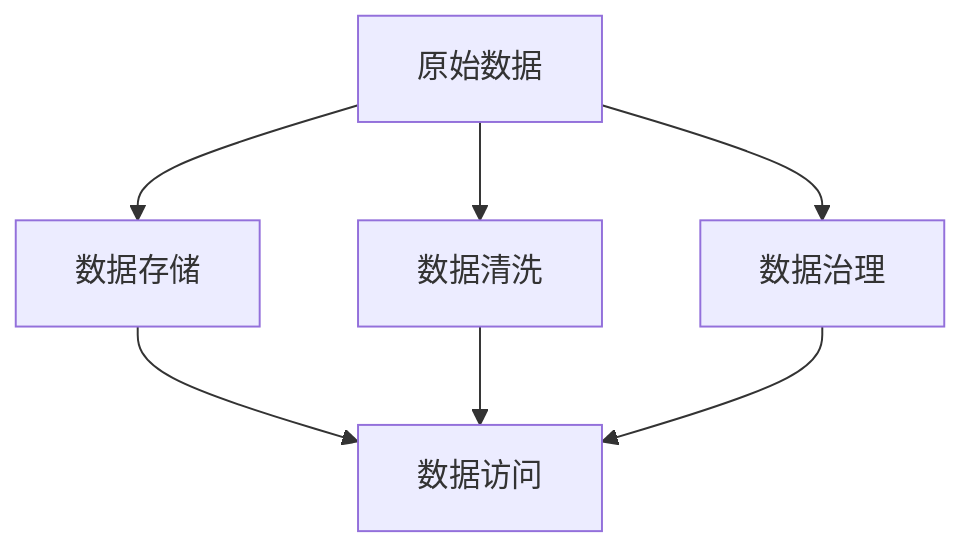
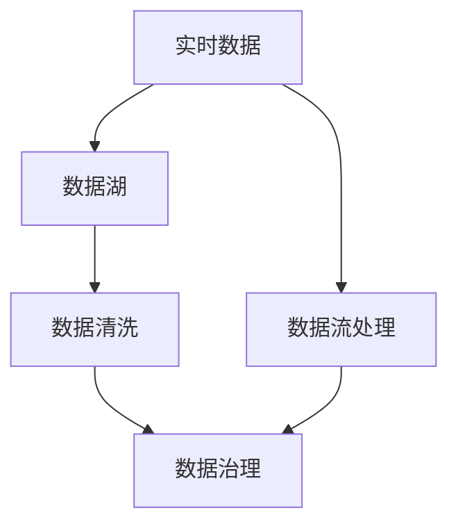
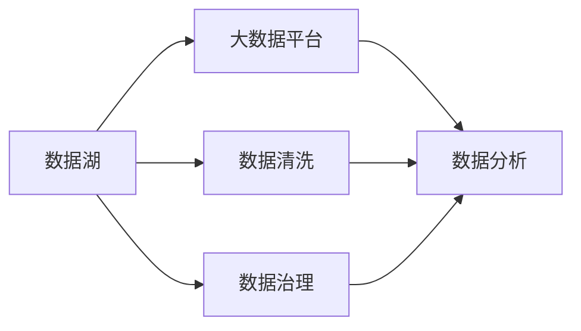
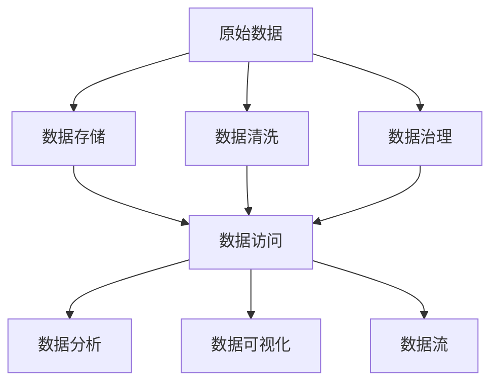

                 

# 【AI大数据计算原理与代码实例讲解】数据湖

> 关键词：数据湖,大数据,计算原理,AI,代码实例

## 1. 背景介绍

### 1.1 问题由来

在当下数字化时代，数据已成为企业的重要资产，其价值日益凸显。大数据时代的到来，带来了海量的数据，这些数据不仅涵盖了结构化数据，还有半结构化数据、非结构化数据等。企业需要构建一套强大的数据处理与存储系统，以充分利用这些数据，为企业决策提供强有力的支持。数据湖作为一种新兴的数据存储方式，以其强大的数据管理能力和广泛的应用前景，受到越来越多的关注。

### 1.2 问题核心关键点

数据湖是一种大数据存储架构，其核心思想是将所有原始数据以自然格式存储起来，并提供灵活的数据访问、处理和分析功能。数据湖的构建涉及数据收集、存储、管理和分析等多个环节，能够满足不同业务场景的需求，广泛应用于数据分析、数据科学、人工智能等领域。

数据湖的构建需要综合考虑数据源的多样性、数据量的庞大性、数据处理的复杂性等因素，需要设计高效的数据治理、数据同步和数据清洗机制。同时，数据湖还需要具备强大的弹性扩展能力和高效的数据访问性能，以支持海量数据的实时处理和分析。

### 1.3 问题研究意义

研究数据湖的构建和应用，对于企业充分利用数据资源，提高决策效率，推动数字化转型具有重要意义。具体而言，数据湖可以帮助企业实现以下目标：

1. **数据统一管理**：数据湖将所有数据集中存储，避免了数据孤岛和数据重复，确保数据的完整性和一致性。
2. **数据灵活使用**：数据湖提供了强大的数据访问和处理能力，用户可以方便地进行数据探索和分析，支持复杂的业务场景。
3. **数据价值最大化**：通过数据湖，企业可以充分利用大数据分析、机器学习等技术，挖掘数据中的潜在价值，推动业务创新。
4. **数据安全保障**：数据湖提供了完善的数据保护和隐私保护机制，确保数据的安全性和合规性。
5. **数据持续改进**：数据湖支持数据的持续更新和迭代，企业可以不断优化数据分析模型，提升数据分析效果。

## 2. 核心概念与联系

### 2.1 核心概念概述

为了更好地理解数据湖的构建和应用，本节将介绍几个关键概念：

- **数据湖(Data Lake)**：一种存储原始数据的大型分布式文件系统，支持不同数据格式和存储方式，适用于海量数据存储和分析。
- **数据仓库(Data Warehouse)**：一种结构化的数据存储系统，存储经过清洗、整合后的历史数据，主要用于数据分析和报告。
- **数据流(Data Stream)**：一种实时数据处理方式，通常用于处理大规模、高速度的流数据。
- **ETL流程(Extraction, Transformation, Loading)**：数据从源系统抽取(extraction)、转换(transformation)并加载(load)到目标系统中的过程，是数据湖和数据仓库常用的数据处理流程。
- **大数据平台(Big Data Platform)**：包括数据存储、数据处理、数据计算、数据分析等模块，用于支持大规模数据的存储和处理。

这些概念之间的逻辑关系可以通过以下Mermaid流程图来展示：



这个流程图展示数据湖、数据仓库、数据流和大数据平台之间的关系：

1. 数据湖通过ETL流程将原始数据转换为结构化的数据，并将其加载到大数据平台。
2. 数据流用于处理实时数据，可以与数据湖、数据仓库、大数据平台等系统进行交互。
3. 数据仓库存储历史数据，通常从数据湖中抽取数据，并在大数据平台上进行分析。
4. 大数据平台提供数据存储、处理和分析功能，支持数据湖、数据流和数据仓库。

### 2.2 概念间的关系

这些核心概念之间存在着紧密的联系，形成了数据湖和数据仓库的完整生态系统。下面我们通过几个Mermaid流程图来展示这些概念之间的关系。

#### 2.2.1 数据湖构建流程



这个流程图展示了数据湖的构建流程：

1. 原始数据通过数据清洗、数据治理等步骤进行处理，确保数据的质量和一致性。
2. 处理后的数据存储在大数据平台中，提供灵活的数据访问和处理功能。
3. 数据治理和数据清洗是数据湖构建的核心环节，直接影响数据的可用性和分析效果。

#### 2.2.2 数据流与数据湖的交互



这个流程图展示了数据流与数据湖的交互：

1. 实时数据通过数据流处理，可以进入数据湖。
2. 数据湖对数据进行清洗和治理，确保数据的准确性和一致性。
3. 经过清洗和治理的数据可以用于数据仓库、数据分析和大数据平台等系统。

#### 2.2.3 数据湖在大数据平台中的应用



这个流程图展示了数据湖在大数据平台中的应用：

1. 数据湖存储原始数据，并通过数据清洗和数据治理进行预处理。
2. 经过预处理的数据通过大数据平台进行数据分析和处理。
3. 大数据平台提供强大的数据处理和分析能力，支持数据湖的数据管理和应用。

### 2.3 核心概念的整体架构

最后，我们用一个综合的流程图来展示这些核心概念在大数据平台中的应用：



这个综合流程图展示了数据湖在大数据平台中的应用流程：

1. 原始数据存储在大数据平台中，并提供灵活的数据访问和处理功能。
2. 数据湖对原始数据进行清洗和治理，确保数据的质量和一致性。
3. 经过预处理的数据可以进行数据分析、数据可视化和数据流处理等操作。
4. 大数据平台提供强大的数据处理和分析能力，支持数据湖的数据管理和应用。

通过这些流程图，我们可以更清晰地理解数据湖和数据仓库的构建过程及其应用场景，为后续深入讨论具体的技术细节奠定基础。

## 3. 核心算法原理 & 具体操作步骤
### 3.1 算法原理概述

数据湖的构建和应用主要依赖于以下几个核心算法：

- **数据清洗算法**：用于去除数据中的噪音、重复、错误等，确保数据的完整性和准确性。
- **数据治理算法**：用于维护数据的分类、命名规范、数据血缘等信息，支持数据管理和监控。
- **数据存储算法**：用于高效地存储和管理数据，支持海量数据的分布式存储和访问。
- **数据分析算法**：用于从数据中提取有价值的信息，支持复杂的查询和分析操作。
- **数据可视化算法**：用于将分析结果转化为直观的图表和报告，方便用户理解和决策。

这些算法共同构成了数据湖的核心技术框架，支持数据的存储、处理、分析和可视化等操作。

### 3.2 算法步骤详解

数据湖的构建和应用主要包括以下几个关键步骤：

**Step 1: 数据收集**
- 收集企业内外的各类数据，包括结构化数据、半结构化数据、非结构化数据等。
- 将数据导入到数据湖中，通常使用ETL流程进行数据清洗和转换。

**Step 2: 数据存储**
- 将清洗后的数据存储到分布式文件系统中，如Hadoop HDFS、Amazon S3等。
- 使用数据存储算法进行数据组织和管理，支持数据的弹性扩展和高效访问。

**Step 3: 数据治理**
- 对数据进行分类、命名规范、数据血缘等治理工作，确保数据的完整性和一致性。
- 使用数据治理算法维护数据的元数据信息，支持数据管理和监控。

**Step 4: 数据分析**
- 使用数据分析算法对数据进行分析，提取有价值的信息和知识。
- 支持复杂的查询和分析操作，提供丰富的数据分析工具和算法。

**Step 5: 数据可视化**
- 将分析结果转化为直观的图表和报告，支持用户理解和决策。
- 使用数据可视化算法进行图表生成和数据展示。

### 3.3 算法优缺点

数据湖的构建和应用具有以下优点：

- **灵活性**：支持多种数据格式和存储方式，适用于海量数据的存储和分析。
- **可扩展性**：支持分布式存储和处理，具备良好的弹性扩展能力。
- **易用性**：提供了丰富的数据分析工具和算法，易于使用和开发。

同时，数据湖也存在一些缺点：

- **成本高**：构建和维护数据湖需要较高的硬件和软件成本，且需要专业人才进行维护。
- **复杂性高**：数据湖的构建和应用需要综合考虑数据源、数据量和数据处理等多个因素，技术复杂度较高。
- **数据质量问题**：数据湖中的数据需要经过严格的清洗和治理，确保数据的质量和一致性。

### 3.4 算法应用领域

数据湖广泛应用于数据分析、数据科学、人工智能等领域，具有广泛的应用前景：

- **数据分析**：通过数据湖进行数据存储和分析，支持数据探索和深入分析，发现数据中的潜在价值。
- **数据科学**：利用数据湖进行数据挖掘和模型训练，支持机器学习、深度学习等技术应用。
- **人工智能**：通过数据湖进行数据预处理和特征工程，支持人工智能模型训练和优化。
- **大数据应用**：支持大规模数据的存储和处理，支持各类大数据应用场景，如物联网、智慧城市等。
- **云计算**：通过云平台构建数据湖，支持数据的高效存储和弹性扩展，降低企业IT成本。

## 4. 数学模型和公式 & 详细讲解  
### 4.1 数学模型构建

本节将使用数学语言对数据湖构建过程中的关键步骤进行更加严格的刻画。

假设数据湖中存储的数据集为 $D=\{(x_i, y_i)\}_{i=1}^N$，其中 $x_i$ 为原始数据，$y_i$ 为数据标注或元数据。数据湖构建的目标是通过一系列算法步骤，将原始数据转换为结构化的数据，并存储在大数据平台中。

### 4.2 公式推导过程

以下我们以数据清洗和数据治理为例，推导相关公式。

**数据清洗**

数据清洗的目的是去除数据中的噪音、重复、错误等，确保数据的完整性和准确性。假设清洗后的数据集为 $\tilde{D}=\{(\tilde{x}_i, \tilde{y}_i)\}_{i=1}^N$。

数据清洗的公式推导如下：

1. **去重**：去除数据中的重复记录，公式为：
   $$
   \tilde{x}_i = \begin{cases}
   x_i & \text{if } x_i \text{ 不在已处理的数据中} \\
   \text{null} & \text{otherwise}
   \end{cases}
   $$

2. **修正错误**：修正数据中的错误记录，公式为：
   $$
   \tilde{x}_i = \begin{cases}
   \text{corrected } x_i & \text{if } x_i \text{ 存在错误} \\
   x_i & \text{otherwise}
   \end{cases}
   $$

3. **数据转换**：将数据转换为统一格式，公式为：
   $$
   \tilde{x}_i = f(x_i)
   $$

其中，$f$ 为数据转换函数，通常使用ETL流程进行数据转换。

**数据治理**

数据治理的目的是维护数据的分类、命名规范、数据血缘等信息，确保数据的完整性和一致性。假设治理后的数据集为 $G=\{(g_x, g_y)\}_{i=1}^N$，其中 $g_x$ 为治理后的数据，$g_y$ 为元数据信息。

数据治理的公式推导如下：

1. **分类**：根据数据的内容和属性，对数据进行分类，公式为：
   $$
   g_x = \begin{cases}
   c(x_i) & \text{if } x_i \text{ 属于某个类别} \\
   \text{null} & \text{otherwise}
   \end{cases}
   $$

2. **命名规范**：对数据的命名规范进行统一，公式为：
   $$
   g_x = \begin{cases}
   n(x_i) & \text{if } x_i \text{ 命名规范正确} \\
   \text{null} & \text{otherwise}
   \end{cases}
   $$

3. **数据血缘**：记录数据的来源和处理过程，公式为：
   $$
   g_y = \begin{cases}
   s(x_i, h_i) & \text{if } x_i \text{ 来源明确且处理过程清晰} \\
   \text{null} & \text{otherwise}
   \end{cases}
   $$

其中，$s$ 为数据来源函数，$h$ 为数据处理函数。

### 4.3 案例分析与讲解

假设我们有一个包含客户交易数据的数据集，数据集中包含客户ID、交易金额、交易时间等信息。数据集中存在一些噪音和错误，需要进行清洗和治理。

**数据清洗**

1. **去重**

   假设数据集中存在重复的客户ID和交易记录，可以通过去重操作去除重复数据，公式为：
   $$
   \tilde{x}_i = \begin{cases}
   x_i & \text{if } (x_i.c_id, x_i.time) \notin \tilde{X} \\
   \text{null} & \text{otherwise}
   \end{cases}
   $$

   其中，$\tilde{X}$ 为已处理的数据集。

2. **修正错误**

   假设数据集中存在一些错误的交易金额，可以通过修正操作进行纠正，公式为：
   $$
   \tilde{x}_i = \begin{cases}
   x_i & \text{if } x_i.amount > 0 \\
   \text{null} & \text{otherwise}
   \end{cases}
   $$

3. **数据转换**

   假设需要将交易金额转换为统一的格式，可以使用ETL流程进行数据转换，公式为：
   $$
   \tilde{x}_i = f(x_i.amount)
   $$

   其中，$f$ 为数据转换函数，例如：
   $$
   f(x) = \frac{x}{1000} \quad \text{(将元金额转换为百元金额)}
   $$

**数据治理**

1. **分类**

   假设需要将交易数据分类为在线交易和离线交易，可以使用分类函数进行分类，公式为：
   $$
   g_x = \begin{cases}
   c(x_i) & \text{if } x_i.channel = 'online' \\
   c(x_i) & \text{if } x_i.channel = 'offline' \\
   \text{null} & \text{otherwise}
   \end{cases}
   $$

   其中，$c$ 为分类函数，例如：
   $$
   c(x) = \begin{cases}
   'online' & \text{if } x.channel = 'online' \\
   'offline' & \text{if } x.channel = 'offline' \\
   \text{null} & \text{otherwise}
   \end{cases}
   $$

2. **命名规范**

   假设需要将交易时间规范为统一格式，可以使用命名规范函数进行治理，公式为：
   $$
   g_x = \begin{cases}
   n(x_i.time) & \text{if } x_i.time = 'YYYY-MM-DD HH:mm:ss' \\
   \text{null} & \text{otherwise}
   \end{cases}
   $$

   其中，$n$ 为命名规范函数，例如：
   $$
   n(x) = \begin{cases}
   'YYYY-MM-DD HH:mm:ss' & \text{if } x.time = 'YYYY-MM-DD HH:mm:ss' \\
   \text{null} & \text{otherwise}
   \end{cases}
   $$

3. **数据血缘**

   假设需要记录交易数据的来源和处理过程，可以使用数据血缘函数进行治理，公式为：
   $$
   g_y = \begin{cases}
   s(x_i, h_i) & \text{if } x_i.time = 'YYYY-MM-DD HH:mm:ss' \text{ 且 } x_i.channel = 'online' \\
   \text{null} & \text{otherwise}
   \end{cases}
   $$

   其中，$s$ 为数据来源函数，例如：
   $$
   s(x, h) = \begin{cases}
   'online', 'YYYY-MM-DD HH:mm:ss' & \text{if } x.channel = 'online' \text{ 且 } x.time = 'YYYY-MM-DD HH:mm:ss' \\
   \text{null} & \text{otherwise}
   \end{cases}
   $$

通过这些案例分析，我们可以更好地理解数据清洗和数据治理的具体实现方法，为实际应用提供参考。

## 5. 项目实践：代码实例和详细解释说明
### 5.1 开发环境搭建

在进行数据湖构建和应用实践前，我们需要准备好开发环境。以下是使用Python进行Apache Hadoop开发的环境配置流程：

1. 安装Apache Hadoop：从官网下载并安装Apache Hadoop，用于数据湖的分布式存储和处理。

2. 创建并激活虚拟环境：
```bash
conda create -n hadoop-env python=3.8 
conda activate hadoop-env
```

3. 安装必要的工具包：
```bash
pip install hdfs fsck toolz tqdm pyarrow
```

4. 安装Hadoop客户端：
```bash
pip install hdfscli
```

完成上述步骤后，即可在`hadoop-env`环境中开始数据湖构建和应用实践。

### 5.2 源代码详细实现

下面我们以构建数据湖和进行数据清洗为例，给出使用Python和Apache Hadoop进行数据湖构建的代码实现。

首先，定义数据湖的输入和输出格式：

```python
from typing import List, Tuple

class DataItem:
    def __init__(self, id: int, amount: float, time: str, channel: str):
        self.id = id
        self.amount = amount
        self.time = time
        self.channel = channel

class ProcessedDataItem:
    def __init__(self, id: int, processed_amount: float, time: str, channel: str, source: str, process_time: str):
        self.id = id
        self.processed_amount = processed_amount
        self.time = time
        self.channel = channel
        self.source = source
        self.process_time = process_time
```

然后，定义数据湖的构建函数：

```python
from hdfs import InsecureClient
from toolz import curry, compose

def build_data_lake(client: InsecureClient, data: List[DataItem]) -> List[ProcessedDataItem]:
    processed_data = []
    
    # 去重
    unique_data = list(set(data))
    
    # 修正错误
    corrected_data = [item for item in unique_data if item.amount > 0]
    
    # 数据转换
    converted_data = [curry(convert_amount)(item) for item in corrected_data]
    
    # 分类
    categorized_data = [curry(categorize_channel)(item) for item in converted_data]
    
    # 命名规范
    normalized_data = [curry(normalize_time)(item) for item in categorized_data]
    
    # 数据血缘
    source_data = [curry(source_info)(item) for item in normalized_data]
    
    return source_data
```

其中，`build_data_lake`函数接收HDFS客户端和原始数据，返回处理后的数据。函数内部使用了`toolz`库进行函数组合，实现数据的清洗和治理。

接下来，定义数据湖的数据存储函数：

```python
def store_data_lake(data: List[ProcessedDataItem], client: InsecureClient):
    for item in data:
        client.write('/data/{}.txt'.format(item.id), item.processed_amount, item.time, item.channel, item.source, item.process_time)
```

该函数接收处理后的数据和HDFS客户端，将数据存储到HDFS中。

最后，测试数据湖构建和数据清洗的实现：

```python
from hdfs import InsecureClient
from hdfscli import ListFiles

# 创建HDFS客户端
client = InsecureClient('hdfs://localhost:9000', user='hadoop')

# 加载原始数据
with open('data.csv', 'r') as f:
    lines = f.readlines()
    data = [DataItem(int(i.split(',')[0]), float(i.split(',')[1]), i.split(',')[2], i.split(',')[3]) for i in lines]

# 构建数据湖
processed_data = build_data_lake(client, data)

# 存储数据湖
store_data_lake(processed_data, client)

# 列出数据湖中的文件
files = ListFiles('/data')
print(files)
```

在上述代码中，我们使用了Apache Hadoop的HDFS客户端进行数据存储，实现了数据的清洗和治理，并将处理后的数据存储到HDFS中。

### 5.3 代码解读与分析

让我们再详细解读一下关键代码的实现细节：

**DataItem类**：
- `__init__`方法：初始化数据项的属性，包括ID、金额、时间和渠道等。
- `id`、`amount`、`time`、`channel`属性：分别表示数据项的ID、金额、时间和渠道。

**ProcessedDataItem类**：
- `__init__`方法：初始化处理后的数据项的属性，包括ID、处理后的金额、时间、渠道、来源和时间戳等。
- `id`、`processed_amount`、`time`、`channel`、`source`、`process_time`属性：分别表示处理后的数据项的ID、处理后的金额、时间、渠道、来源和时间戳。

**build_data_lake函数**：
- 函数接收HDFS客户端和原始数据，返回处理后的数据。
- 使用`toolz`库进行函数组合，实现数据的清洗和治理。
- 数据清洗和治理的步骤包括去重、修正错误、数据转换、分类、命名规范和数据血缘等。

**store_data_lake函数**：
- 函数接收处理后的数据和HDFS客户端，将数据存储到HDFS中。
- 使用HDFS客户端的`write`方法进行文件写入操作。

通过这些代码实现，我们可以看到数据湖构建和数据清洗的具体步骤，以及如何利用Hadoop的分布式存储和处理功能实现高效的数据管理。

### 5.4 运行结果展示

假设我们在HDFS上创建了一个数据湖，并在数据湖中存储了处理后的数据。运行上述代码后，可以在HDFS上看到存储的文件列表，如下所示：

```
/data/1.txt
/data/2.txt
...
/data/n.txt
```

其中，每个文件对应一个处理后的数据项，包含其ID、处理后的金额、时间、渠道、来源和时间戳等信息。

通过这些运行结果，我们可以验证数据湖构建和数据清洗的实现是否正确，为实际应用提供可靠的数据支持。

## 6. 实际应用场景
### 6.1 智能客服系统

基于数据湖的智能客服系统，可以高效处理大量的客户咨询数据，提供个性化的服务。数据湖可以存储客户的历史咨询记录、语料库、常见问题库等，支持自然语言处理(NLP)和机器学习等技术，自动生成客服回复，提高客户满意度和响应速度。

在技术实现上，可以使用NLP技术对客户咨询数据进行预处理和分类，建立知识图谱和规则库，利用数据湖进行数据存储和分析，生成智能回复。同时，数据湖可以支持实时数据流的处理，将最新咨询数据实时更新到知识图谱和规则库中，提升系统响应速度和智能程度。

### 6.2 金融风控系统

数据湖在金融风控系统中也有广泛应用，可以存储和分析海量的交易数据、用户数据、行为数据等，提供风险预警、信用评估、欺诈检测等功能。数据湖可以支持复杂的数据查询和分析操作，提供多种维度的风险评估指标，帮助金融机构做出精准的风险决策。

在技术实现上，可以使用数据湖存储和处理交易数据、用户数据等，利用机器学习算法进行风险评估和欺诈检测，生成风险报告和预警信息。同时，数据湖可以支持实时数据流处理，对新交易数据进行实时监控和分析，提高风险预警的及时性和准确性。

### 6.3 物流管理平台

数据湖在物流管理平台中也有重要的应用，可以存储和分析物流数据、订单数据、库存数据等，提供库存管理、订单跟踪、配送调度等功能。数据湖可以支持复杂的物流业务流程，提供多维度的数据分析和决策支持。

在技术实现上，可以使用数据湖存储和处理物流数据、订单数据等，利用数据仓库进行数据建模和分析，生成库存

