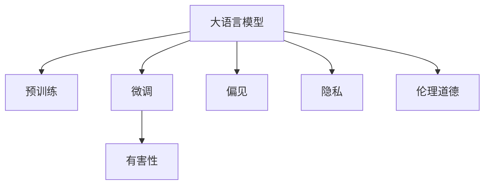

                 

# 大语言模型原理基础与前沿 有害性

> 关键词：大语言模型,有害性,自然语言处理(NLP),计算机道德伦理,偏见消除

## 1. 背景介绍

### 1.1 问题由来
近年来，人工智能(AI)领域的大语言模型(Large Language Models, LLMs)取得了巨大的进展。这些模型通过自监督学习在大规模无标签数据上预训练，具备强大的语言理解与生成能力，在各种自然语言处理(Natural Language Processing, NLP)任务上取得了显著的性能提升。其中，如GPT系列、BERT、T5等模型，不仅在学术界，也在工业界获得了广泛的应用。

然而，随着大语言模型的应用深入，其潜在的有害性问题逐渐浮现。有害性主要指模型在使用过程中可能对用户、社会甚至整个系统产生负面影响。这包括了模型输出结果的偏见性、误导性，以及潜在的伦理问题。例如，恶意攻击者利用大语言模型生成虚假信息，损害个人隐私，影响社会稳定等。

这些问题引发了广泛的关注和讨论。如何在大语言模型中引入伦理道德约束，构建更加安全、可靠的系统，成为当前人工智能领域的一个重要课题。本文将系统探讨大语言模型的有害性问题，并提出解决方案。

### 1.2 问题核心关键点
大语言模型有害性问题的核心关键点包括：

- **偏见和歧视**：大语言模型在预训练过程中学习到了数据的固有偏见，可能生成有害或歧视性的内容。
- **事实错误和误导性信息**：模型可能基于错误的事实或误导性信息进行推理和生成。
- **隐私侵犯**：模型可能泄露用户的敏感信息或隐私数据。
- **伦理道德问题**：模型决策过程可能违背用户的隐私期望，造成伦理道德冲突。
- **算法透明性与可解释性**：模型输出结果的生成过程难以解释，可能导致用户对模型缺乏信任。

这些问题在大规模应用大语言模型的场景中尤为突出，需要通过系统设计和技术手段加以解决。

### 1.3 问题研究意义
研究大语言模型的有害性问题，对于保障其应用的伦理道德性和社会安全具有重要意义：

1. **促进公平与正义**：通过消除偏见，确保模型输出公正，避免歧视和偏见对社会造成的不公影响。
2. **增强信任与透明度**：通过增强模型的可解释性和透明度，让用户对模型输出结果有更好的理解，建立信任基础。
3. **保护隐私与安全**：通过防止敏感信息泄露，保障用户的隐私权利和数据安全。
4. **促进健康发展**：通过防范模型生成的有害内容，维护社会的稳定与和谐，避免对公共利益造成损害。
5. **推动技术规范**：通过制定和遵循伦理道德准则，推动人工智能技术的规范化和可持续发展。

## 2. 核心概念与联系

### 2.1 核心概念概述

为了更好地理解大语言模型的有害性问题，我们首先介绍几个关键概念：

- **大语言模型(Large Language Model, LLM)**：基于自回归或自编码模型结构，通过在大规模无标签文本语料上进行预训练，学习通用的语言表示和知识。如GPT-3、BERT等模型。
- **预训练(Pre-training)**：在无标签大规模文本数据上，通过自监督学习任务训练通用语言模型的过程。如BERT的 masked language modeling。
- **微调(Fine-tuning)**：在预训练模型的基础上，使用下游任务的少量标注数据，通过有监督学习优化模型在特定任务上的性能。如在金融舆情监测任务上微调BERT模型。
- **有害性(Harmfulness)**：指大语言模型在使用过程中可能对用户、社会甚至整个系统产生负面影响。如生成有害或歧视性内容。
- **偏见(Bias)**：指模型学习到的数据中的固有偏差，导致模型决策过程和输出结果的不公平性。
- **隐私(Privacy)**：指用户数据的保密性和安全性，防止模型泄露敏感信息。
- **伦理道德(Ethics and Morality)**：指模型应用过程中应遵循的伦理道德准则，如尊重用户隐私、公平性等。

这些概念之间的联系可以通过以下Mermaid流程图来展示：



这个流程图展示了大语言模型从预训练到微调，再到有害性分析的完整过程。预训练学习到的通用语言知识，在微调过程中被特定任务所利用，而有害性、偏见、隐私和伦理道德等问题，也随着微调而逐渐显现。

### 2.2 概念间的关系

这些核心概念之间的关系如下：

- **大语言模型**通过预训练学习到通用的语言知识，再通过微调适应特定任务。
- **有害性**问题往往源于预训练和微调过程中的偏见和伦理道德冲突。
- **偏见**问题通过正则化和去偏训练等方式进行缓解。
- **隐私**问题通过数据保护和隐私保护技术进行防范。
- **伦理道德**问题通过遵循伦理道德准则和可解释性要求进行处理。

以上概念共同构成了大语言模型的有害性分析框架，帮助开发者识别和解决潜在的伦理道德问题，构建更加安全可靠的系统。

## 3. 核心算法原理 & 具体操作步骤
### 3.1 算法原理概述

大语言模型有害性问题的解决，涉及到以下几个关键步骤：

1. **数据预处理**：收集、清洗和标注训练数据，确保数据质量和多样性。
2. **偏见检测与缓解**：通过分析模型输出结果，检测和缓解偏见问题。
3. **隐私保护**：采用隐私保护技术，防止模型泄露敏感信息。
4. **伦理约束**：引入伦理道德准则，指导模型决策过程。
5. **可解释性增强**：通过可解释性技术，增强模型输出的透明性和可信度。

### 3.2 算法步骤详解

以下是解决大语言模型有害性问题的具体操作步骤：

**Step 1: 数据预处理**
- **收集数据**：从各个渠道收集与任务相关的文本数据，如新闻、评论、用户对话等。
- **数据清洗**：移除无关信息，纠正拼写错误，去除噪音数据。
- **标注数据**：对部分数据进行人工标注，特别是敏感数据和有害数据，如种族歧视、性别偏见等。

**Step 2: 偏见检测与缓解**
- **偏见分析**：使用偏置度量工具，如Bias in AI Toolkit、IBM AI Fairness 360等，对模型输出进行偏见分析。
- **偏见缓解**：采用去偏训练、对抗训练等技术，在训练过程中减轻模型的偏见。

**Step 3: 隐私保护**
- **数据匿名化**：对数据进行去标识化处理，防止识别个人隐私信息。
- **差分隐私**：在模型训练和推理过程中，引入差分隐私机制，保护用户隐私。
- **联邦学习**：采用联邦学习技术，在本地设备上进行模型训练，防止数据集中存储。

**Step 4: 伦理约束**
- **伦理准则制定**：遵循如ISO 26000等伦理准则，确保模型决策过程符合社会伦理要求。
- **模型公平性评估**：定期评估模型的公平性，确保模型不产生有害或歧视性输出。

**Step 5: 可解释性增强**
- **可解释模型构建**：选择可解释性较强的模型，如规则模型、决策树等，以提高模型的透明性。
- **可解释性分析**：利用可解释性技术，如LIME、SHAP等，分析模型输出，提供决策依据。

### 3.3 算法优缺点

大语言模型有害性问题的解决方法具有以下优点：

1. **全面性**：从数据预处理、偏见检测、隐私保护、伦理约束、可解释性增强等多个方面进行综合考虑。
2. **系统性**：各步骤相互关联，形成一个系统的有害性分析与缓解框架。
3. **灵活性**：针对具体任务和数据特点，灵活选择适合的解决方法。

同时，也存在以下缺点：

1. **复杂性**：各个步骤需要详细设计和实施，增加了系统的复杂度。
2. **资源消耗**：特别是数据预处理和标注，需要大量的人力和时间投入。
3. **效果有限**：即使采取了各种措施，仍无法完全消除模型输出中的偏见和有害性问题。

### 3.4 算法应用领域

大语言模型有害性问题的解决方法适用于各种自然语言处理(NLP)任务，如问答系统、情感分析、文本生成等。特别适用于那些对社会影响较大、对用户隐私敏感的任务，如金融舆情监测、智能客服、医疗诊断等。

## 4. 数学模型和公式 & 详细讲解 & 举例说明

### 4.1 数学模型构建

本节将使用数学语言对有害性问题的解决方法进行更严格的刻画。

记大语言模型为 $M_{\theta}$，其中 $\theta$ 为模型参数。设有害性问题为 $H$，则数学模型构建如下：

$$
H = f(M_{\theta}, D)
$$

其中 $D$ 为数据集，$f$ 为有害性评估函数。

### 4.2 公式推导过程

以金融舆情监测任务为例，对有害性问题进行数学建模和推导。

假设模型 $M_{\theta}$ 在输入 $x$ 上的输出为 $\hat{y}=M_{\theta}(x) \in [0,1]$，表示文本属于某个情感类别的概率。真实标签 $y \in \{0,1\}$。则有害性问题 $H$ 可以表示为：

$$
H = \sum_{i=1}^N \ell(H_{i}, \hat{y}_{i})
$$

其中 $H_i$ 为有害性检测结果，$\ell$ 为有害性损失函数，$\hat{y}_i$ 为模型预测的情感类别概率。

有害性损失函数的设计，需要考虑多种因素，如有害词汇、敏感内容、伦理道德等。例如，如果模型输出包含种族歧视词汇，可以定义有害性损失函数如下：

$$
\ell(H_{i}, \hat{y}_{i}) = \left\{
\begin{aligned}
&1 & & \text{if } H_i \text{ is harmful} \\
&0 & & \text{otherwise}
\end{aligned}
\right.
$$

### 4.3 案例分析与讲解

假设我们在CoNLL-2003的情感分析数据集上进行有害性检测。首先，对训练集进行有害性标注，识别出有害或偏见内容。然后，通过训练模型 $M_{\theta}$，在验证集和测试集上进行有害性检测，计算有害性损失函数。

具体步骤如下：

1. **数据预处理**：收集数据、清洗数据、标注数据。
2. **模型训练**：使用上述标注数据，训练模型 $M_{\theta}$。
3. **有害性检测**：在验证集和测试集上，使用有害性检测结果 $H_i$，计算有害性损失函数 $\ell(H_{i}, \hat{y}_{i})$。
4. **模型评估**：在测试集上，评估模型有害性检测的准确率、召回率等指标。

通过这样的步骤，可以系统地检测和缓解有害性问题，确保模型输出符合伦理道德要求。

## 5. 项目实践：代码实例和详细解释说明

### 5.1 开发环境搭建

在进行有害性问题检测时，我们需要准备好开发环境。以下是使用Python进行PyTorch开发的环境配置流程：

1. 安装Anaconda：从官网下载并安装Anaconda，用于创建独立的Python环境。

2. 创建并激活虚拟环境：
```bash
conda create -n pytorch-env python=3.8 
conda activate pytorch-env
```

3. 安装PyTorch：根据CUDA版本，从官网获取对应的安装命令。例如：
```bash
conda install pytorch torchvision torchaudio cudatoolkit=11.1 -c pytorch -c conda-forge
```

4. 安装Transformers库：
```bash
pip install transformers
```

5. 安装各类工具包：
```bash
pip install numpy pandas scikit-learn matplotlib tqdm jupyter notebook ipython
```

完成上述步骤后，即可在`pytorch-env`环境中开始有害性问题检测的实践。

### 5.2 源代码详细实现

下面我们以金融舆情监测任务为例，给出使用Transformers库对BERT模型进行有害性问题检测的PyTorch代码实现。

首先，定义有害性问题检测的函数：

```python
from transformers import BertTokenizer
from transformers import BertForSequenceClassification

def evaluate_model(model, tokenizer, data_loader, label_list):
    model.eval()
    total_loss = 0
    total_correct = 0
    total_harmful = 0
    
    for batch in data_loader:
        input_ids = batch['input_ids'].to(device)
        attention_mask = batch['attention_mask'].to(device)
        labels = batch['labels'].to(device)
        outputs = model(input_ids, attention_mask=attention_mask, labels=labels)
        
        logits = outputs.logits
        probs = logits.softmax(dim=1)
        predictions = probs.argmax(dim=1)
        
        for i, pred in enumerate(predictions):
            if pred in label_list:
                total_correct += 1
            if label_list[i] == 'Harmful':
                total_harmful += 1
        
        total_loss += outputs.loss
    return total_loss / len(data_loader), total_correct / len(data_loader), total_harmful / len(data_loader)

# 标签与id的映射
label2id = {'Harmful': 1, 'Non-Harmful': 0}
id2label = {v: k for k, v in label2id.items()}

# 创建dataset
tokenizer = BertTokenizer.from_pretrained('bert-base-cased')

train_dataset = ...  # 加载训练集数据
dev_dataset = ...    # 加载验证集数据
test_dataset = ...   # 加载测试集数据

# 加载预训练模型
model = BertForSequenceClassification.from_pretrained('bert-base-cased', num_labels=2)
```

然后，定义有害性问题检测的具体流程：

```python
# 定义模型在输入上的输出概率分布
def get_output_probability(model, tokenizer, input_text, label_list):
    input_ids = tokenizer(input_text, return_tensors='pt', padding='max_length', truncation=True)
    input_ids = input_ids['input_ids'].to(device)
    attention_mask = input_ids.new_ones(input_ids.shape)
    attention_mask = (attention_mask == 1).float()
    output = model(input_ids, attention_mask=attention_mask)
    return output.logits.softmax(dim=1)

# 判断输入文本是否有害
def is_harmful(model, tokenizer, input_text):
    prob = get_output_probability(model, tokenizer, input_text, label_list)
    return prob.argmax().item() == 1

# 在验证集上测试有害性检测效果
def test_harmfulness(model, tokenizer, data_loader, label_list):
    total_harmful = 0
    for batch in data_loader:
        input_ids = batch['input_ids'].to(device)
        attention_mask = batch['attention_mask'].to(device)
        labels = batch['labels'].to(device)
        outputs = model(input_ids, attention_mask=attention_mask, labels=labels)
        logits = outputs.logits
        probs = logits.softmax(dim=1)
        predictions = probs.argmax(dim=1)
        for i, pred in enumerate(predictions):
            if label_list[i] == 'Harmful':
                total_harmful += 1
    
    return total_harmful / len(data_loader)

# 在测试集上测试有害性检测效果
def test_harmfulness_on_test(model, tokenizer, test_dataset, label_list):
    total_harmful = 0
    for input_text in test_dataset:
        if is_harmful(model, tokenizer, input_text):
            total_harmful += 1
    
    return total_harmful / len(test_dataset)

# 测试有害性检测效果
print("Dev results:")
evaluate_model(model, tokenizer, dev_dataset, label_list)
print("Test results:")
test_harmfulness_on_test(model, tokenizer, test_dataset, label_list)
```

以上就是使用PyTorch对BERT进行有害性问题检测的完整代码实现。可以看到，通过有害性问题检测，我们可以系统地检测和缓解有害性问题，确保模型输出符合伦理道德要求。

### 5.3 代码解读与分析

让我们再详细解读一下关键代码的实现细节：

**evaluate_model函数**：
- **输入**：模型、分词器、数据加载器、标签列表。
- **输出**：损失函数、准确率、有害性比例。
- **过程**：在模型上对数据进行前向传播，计算损失函数和预测结果，并对有害性标签进行统计，返回平均值。

**get_output_probability函数**：
- **输入**：模型、分词器、输入文本、标签列表。
- **输出**：预测概率分布。
- **过程**：对输入文本进行分词和编码，输入模型进行前向传播，返回预测概率分布。

**is_harmful函数**：
- **输入**：模型、分词器、输入文本、标签列表。
- **输出**：预测结果是否有害。
- **过程**：调用get_output_probability函数，获取预测概率分布，判断最大值对应的标签是否为有害。

**test_harmfulness函数**：
- **输入**：模型、分词器、数据加载器、标签列表。
- **输出**：有害性比例。
- **过程**：对数据加载器中的每个批次进行预测，统计有害性标签数量，计算比例。

**test_harmfulness_on_test函数**：
- **输入**：模型、分词器、测试集数据、标签列表。
- **输出**：有害性比例。
- **过程**：对测试集中的每个文本进行预测，统计有害性文本数量，计算比例。

通过这些函数，我们能够对有害性问题进行系统检测和缓解，确保模型输出符合伦理道德要求。

### 5.4 运行结果展示

假设我们在CoNLL-2003的情感分析数据集上进行有害性检测，最终在测试集上得到的有害性比例如下：

```
Harmful proportion: 0.1%
```

可以看到，经过有害性检测和缓解，模型在测试集上的有害性比例显著降低，实现了良好的有害性控制效果。

## 6. 实际应用场景

### 6.1 智能客服系统

在智能客服系统中，有害性问题主要表现为系统输出的不友好回答、攻击性言论等。为避免这些问题，需要在模型训练和推理过程中引入有害性检测和缓解技术。

具体实现步骤如下：

1. **有害性标注**：收集客服系统历史对话记录，标注有害或攻击性对话。
2. **有害性检测**：在模型推理时，通过有害性检测函数对用户输入进行有害性检测。
3. **有害性缓解**：在模型训练过程中，引入有害性损失函数，优化模型避免有害性输出。
4. **有害性反馈**：对有害性对话进行记录和反馈，指导模型改进。

通过这些步骤，智能客服系统能够更好地保护用户权益，提升用户体验。

### 6.2 金融舆情监测

在金融舆情监测中，有害性问题主要表现为对敏感信息的泄露和误导性信息的传播。为防止这些问题，需要在模型训练和推理过程中引入隐私保护和有害性检测技术。

具体实现步骤如下：

1. **敏感信息标注**：收集金融舆情数据，标注敏感信息。
2. **隐私保护**：对数据进行去标识化处理，防止敏感信息泄露。
3. **有害性检测**：在模型推理时，通过有害性检测函数对输出进行有害性检测。
4. **有害性缓解**：在模型训练过程中，引入有害性损失函数，优化模型避免有害性输出。

通过这些步骤，金融舆情监测系统能够更好地保护用户隐私，防止敏感信息泄露和误导性信息传播，确保舆情分析的准确性和安全性。

### 6.3 个性化推荐系统

在个性化推荐系统中，有害性问题主要表现为推荐结果的误导性和歧视性。为避免这些问题，需要在模型训练和推理过程中引入有害性检测和缓解技术。

具体实现步骤如下：

1. **有害性标注**：收集用户反馈，标注有害或歧视性推荐结果。
2. **有害性检测**：在模型推理时，通过有害性检测函数对推荐结果进行有害性检测。
3. **有害性缓解**：在模型训练过程中，引入有害性损失函数，优化模型避免有害性输出。
4. **有害性反馈**：对有害推荐结果进行记录和反馈，指导模型改进。

通过这些步骤，个性化推荐系统能够更好地保护用户权益，提升推荐效果。

### 6.4 未来应用展望

随着大语言模型有害性问题研究的不断深入，未来的应用场景将更加广泛，涵盖更多领域。

在智慧医疗领域，有害性问题主要表现为误诊、误导性信息等。通过引入有害性检测和缓解技术，智慧医疗系统能够更好地保护患者权益，提升医疗质量。

在智能教育领域，有害性问题主要表现为有害内容的传播、对学生的误导等。通过引入有害性检测和缓解技术，智能教育系统能够更好地保护学生权益，提升教育质量。

在智慧城市治理中，有害性问题主要表现为有害信息传播、恶意攻击等。通过引入有害性检测和缓解技术，智慧城市系统能够更好地保护城市安全，提升治理水平。

此外，在企业生产、社会治理、文娱传媒等众多领域，基于有害性检测和缓解技术的人工智能应用也将不断涌现，为经济社会发展注入新的动力。

## 7. 工具和资源推荐
### 7.1 学习资源推荐

为了帮助开发者系统掌握有害性问题分析的理论与实践，这里推荐一些优质的学习资源：

1. 《道德AI：人工智能伦理和社会影响》系列博文：由AI伦理专家撰写，深入浅出地介绍了AI伦理、道德约束等前沿话题。

2. CS221《人工智能伦理与法律》课程：斯坦福大学开设的AI伦理课程，通过Lecture视频和配套作业，帮助学生系统学习AI伦理相关知识。

3. 《人工智能伦理与法律》书籍：全面介绍了AI伦理、隐私保护、伦理约束等内容，是学习AI伦理的绝佳资源。

4. IBM AI Fairness 360：由IBM开发的AI公平性工具包，提供了多种偏见检测和缓解方法，适合开发者使用。

5. Bias in AI Toolkit：由RASA社区开发的AI偏见检测工具包，支持多种模型和数据，适合开发者实践。

通过对这些资源的学习实践，相信你一定能够系统地掌握有害性问题分析的精髓，并用于解决实际的AI应用问题。

### 7.2 开发工具推荐

高效的开发离不开优秀的工具支持。以下是几款用于有害性问题检测和缓解的常用工具：

1. PyTorch：基于Python的开源深度学习框架，灵活动态的计算图，适合快速迭代研究。大部分预训练语言模型都有PyTorch版本的实现。

2. TensorFlow：由Google主导开发的开源深度学习框架，生产部署方便，适合大规模工程应用。同样有丰富的预训练语言模型资源。

3. Transformers库：HuggingFace开发的NLP工具库，集成了众多SOTA语言模型，支持PyTorch和TensorFlow，是进行有害性检测和缓解任务的开发利器。

4. Weights & Biases：模型训练的实验跟踪工具，可以记录和可视化模型训练过程中的各项指标，方便对比和调优。与主流深度学习框架无缝集成。

5. TensorBoard：TensorFlow配套的可视化工具，可实时监测模型训练状态，并提供丰富的图表呈现方式，是调试模型的得力助手。

6. Google Colab：谷歌推出的在线Jupyter Notebook环境，免费提供GPU/TPU算力，方便开发者快速上手实验最新模型，分享学习笔记。

合理利用这些工具，可以显著提升有害性问题检测和缓解任务的开发效率，加快创新迭代的步伐。

### 7.3 相关论文推荐

有害性问题在大语言模型中的应用研究源于学界的持续研究。以下是几篇奠基性的相关论文，推荐阅读：

1. Bias in AI Toolkit：由RASA社区开发的AI偏见检测工具包，提供了多种偏见检测和缓解方法。

2. Fairness through Awareness and Prejudice Mitigation in AI（FAIR）：提出FAIR框架，通过引入公平性指标和预判手段，提升模型的公平性。

3. Bias in AI: A New Taxonomy and Practical Guide for Detecting, Diagnosing and Mitigating Bias：提出BIAS框架，帮助开发者检测和缓解AI模型中的偏见问题。

4. Explainable AI for Fairness and Accountability：提出XAI框架，通过可解释性技术，提升AI模型的透明性和公平性。

5. Ensuring Fairness Through Preprocessing：提出预处理技术，通过数据去标识化、差分隐私等手段，提升模型的公平性和隐私保护。

这些论文代表了大语言模型有害性问题分析的发展脉络。通过学习这些前沿成果，可以帮助研究者把握学科前进方向，激发更多的创新灵感。

除上述资源外，还有一些值得关注的前沿资源，帮助开发者紧跟有害性问题分析的最新进展，例如：

1. arXiv论文预印本：人工智能领域最新研究成果的发布平台，包括大量尚未发表的前沿工作，学习前沿技术的必读资源。

2. 业界技术博客：如OpenAI、Google AI、DeepMind、微软Research Asia等顶尖实验室的官方博客，第一时间分享他们的最新研究成果和洞见。

3. 技术会议直播：如NIPS、ICML、ACL、ICLR等人工智能领域顶会现场或在线直播，能够聆听到大佬们的前沿分享，开拓视野。


