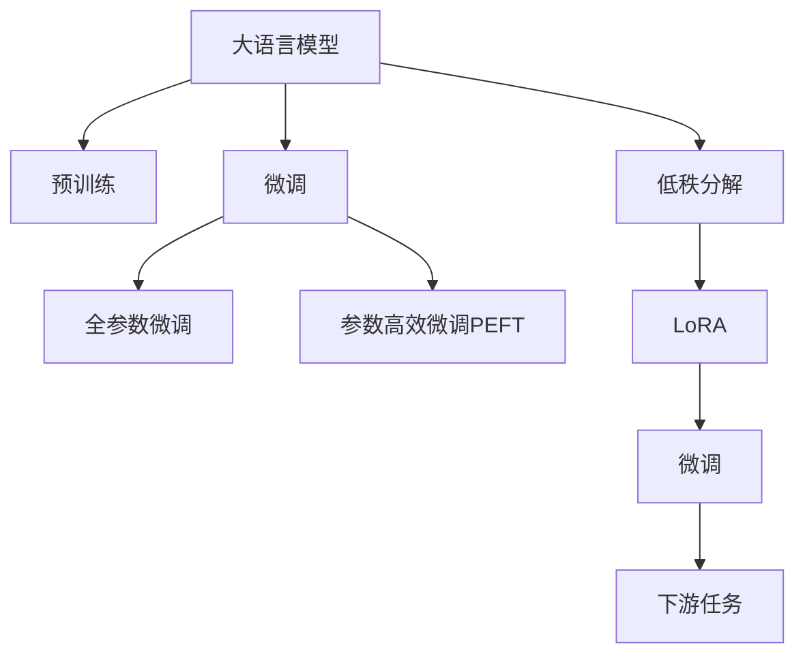
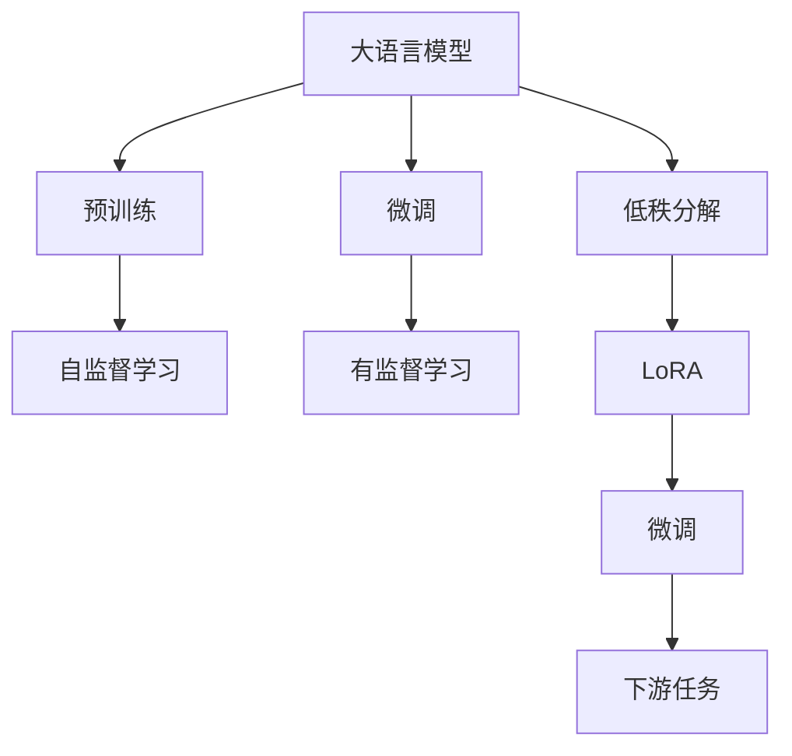
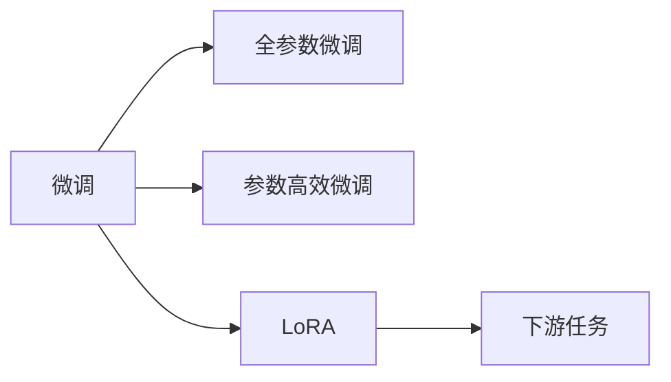
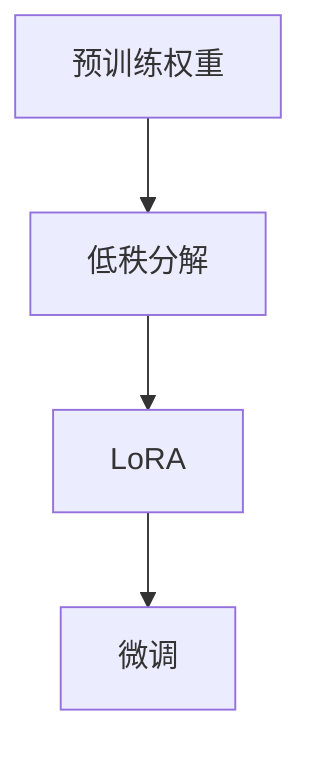
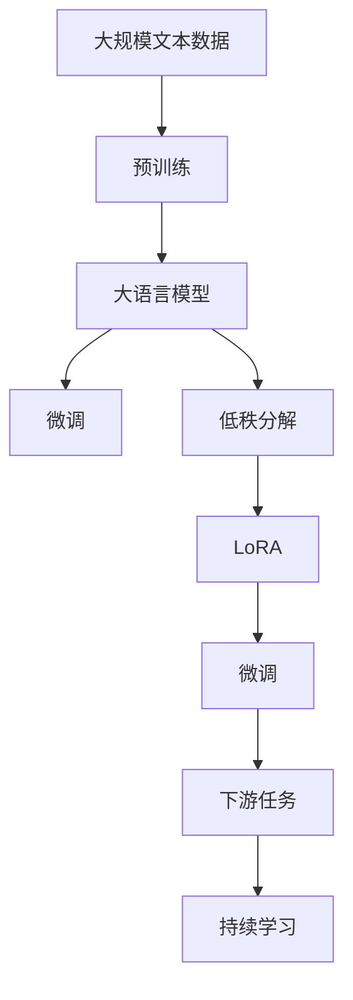

                 

# 大语言模型应用指南：LoRA高效微调

> 关键词：大语言模型,微调,LoRA,参数高效,深度学习,自然语言处理,NLP,计算机程序设计艺术

## 1. 背景介绍

### 1.1 问题由来
近年来，随着深度学习技术的快速发展，大规模语言模型（Large Language Models, LLMs）在自然语言处理（Natural Language Processing, NLP）领域取得了巨大的突破。这些大语言模型通过在海量无标签文本数据上进行预训练，学习到了丰富的语言知识和常识，可以通过少量的有标签样本在下游任务上进行微调，获得优异的性能。

其中，LoRA（Low-Rank Adaptation）方法是一种参数高效微调方法，在保持预训练权重不变的情况下，通过对预训练权重进行低秩分解，实现高效微调。LoRA方法被广泛应用于各种NLP任务，如问答、对话、摘要、翻译、情感分析等，具有高效、通用、易用的特点，深受开发者喜爱。

### 1.2 问题核心关键点
LoRA方法的核心思想是利用预训练权重中的低秩矩阵结构，对权重进行微小调整，从而实现高效微调。LoRA方法相比传统的全参数微调方法，具有以下优点：

- **高效性**：LoRA方法只需要调整小部分低秩矩阵，显著降低了计算量，提高了微调效率。
- **鲁棒性**：LoRA方法通过保留预训练权重的大部分，减少了由于微调带来的风险，提高了模型的鲁棒性。
- **通用性**：LoRA方法可以应用于各种下游任务，无需特殊设计任务适配层。
- **易用性**：LoRA方法使用简单，可复用性高，易于在实际项目中应用。

LoRA方法的主要步骤如下：

1. 对预训练模型的权重进行低秩分解，得到一个低秩矩阵 $W_{\text{rank}}$ 和一个矩阵 $V$。
2. 定义一个学习率 $\alpha$，将低秩矩阵 $W_{\text{rank}}$ 乘以一个学习率 $\alpha$ 后，与预训练权重 $W$ 进行矩阵乘法运算，得到微调后的权重 $W_{\text{fine-tune}}$。
3. 在微调过程中，只更新 $W_{\text{rank}}$，而保持 $V$ 和预训练权重 $W$ 不变。

### 1.3 问题研究意义
LoRA方法为大规模语言模型的微调提供了新的方向，不仅提高了微调的效率，还保持了模型的鲁棒性，具有重要的研究意义：

- **降低微调成本**：LoRA方法减少了微调所需的计算资源和时间，显著降低了微调成本。
- **提高模型鲁棒性**：LoRA方法通过保留预训练权重的大部分，减少了由于微调带来的风险，提高了模型的鲁棒性。
- **通用适应性**：LoRA方法可以应用于各种下游任务，提高了模型的通用适应性。
- **易用性**：LoRA方法使用简单，易于在实际项目中应用，降低了微调的复杂度。

LoRA方法在大语言模型微调中的应用，为NLP技术落地应用提供了新的思路和方法，有望推动NLP技术的进一步发展。

## 2. 核心概念与联系

### 2.1 核心概念概述

为了更好地理解LoRA方法，本节将介绍几个密切相关的核心概念：

- 大语言模型(Large Language Model, LLM)：以自回归(如GPT)或自编码(如BERT)模型为代表的大规模预训练语言模型。通过在大规模无标签文本语料上进行预训练，学习通用的语言表示，具备强大的语言理解和生成能力。

- 预训练(Pre-training)：指在大规模无标签文本语料上，通过自监督学习任务训练通用语言模型的过程。常见的预训练任务包括言语建模、遮挡语言模型等。

- 微调(Fine-tuning)：指在预训练模型的基础上，使用下游任务的少量标注数据，通过有监督学习优化模型在特定任务上的性能。通常只需要调整顶层分类器或解码器，并以较小的学习率更新全部或部分的模型参数。

- 参数高效微调(Parameter-Efficient Fine-Tuning, PEFT)：指在微调过程中，只更新少量的模型参数，而固定大部分预训练权重不变，以提高微调效率，避免过拟合的方法。

- 低秩分解(Low-Rank Decomposition)：将一个大矩阵分解为两个低秩矩阵的乘积，常用于压缩数据和模型。

- LoRA方法：利用预训练权重中的低秩矩阵结构，通过调整低秩矩阵来实现高效微调。

这些核心概念之间的逻辑关系可以通过以下Mermaid流程图来展示：



这个流程图展示了LoRA方法在大语言模型微调过程中的整体架构：

1. 大语言模型通过预训练获得基础能力。
2. 微调是对预训练模型进行任务特定的优化，可以分为全参数微调和参数高效微调。
3. 低秩分解用于压缩预训练权重，减少计算量。
4. LoRA方法利用低秩分解后的权重，通过调整低秩矩阵实现高效微调。
5. 微调后的模型应用于下游任务，实现特定的语言理解和生成能力。

这些核心概念共同构成了LoRA方法的工作原理和优化方向，使其在大语言模型的微调实践中发挥了重要作用。

### 2.2 概念间的关系

这些核心概念之间存在着紧密的联系，形成了LoRA方法的完整生态系统。下面我们通过几个Mermaid流程图来展示这些概念之间的关系。

#### 2.2.1 大语言模型的学习范式



这个流程图展示了LoRA方法在大语言模型微调中的基本原理，即利用预训练权重中的低秩结构，通过低秩分解和微调，实现高效微调。

#### 2.2.2 微调与LoRA的关系



这个流程图展示了微调与LoRA方法的关系。LoRA方法是在微调过程中的一种高效微调方法，通过调整预训练权重中的低秩矩阵，实现微调的参数高效性和鲁棒性。

#### 2.2.3 低秩分解在LoRA中的应用



这个流程图展示了低秩分解在LoRA中的应用。LoRA方法利用预训练权重中的低秩结构，通过调整低秩矩阵，实现高效微调。

### 2.3 核心概念的整体架构

最后，我们用一个综合的流程图来展示这些核心概念在大语言模型微调过程中的整体架构：



这个综合流程图展示了从预训练到微调，再到持续学习的完整过程。大语言模型首先在大规模文本数据上进行预训练，然后通过微调（包括低秩分解和LoRA微调），适应下游任务。最后，通过持续学习技术，模型可以不断更新和适应新的任务和数据。 通过这些流程图，我们可以更清晰地理解LoRA方法在大语言模型微调过程中各个环节的关系和作用。

## 3. 核心算法原理 & 具体操作步骤

### 3.1 算法原理概述

LoRA方法利用预训练权重中的低秩结构，通过调整低秩矩阵来实现高效微调。其核心思想是：将预训练模型的权重进行低秩分解，得到一个低秩矩阵 $W_{\text{rank}}$ 和一个矩阵 $V$。在微调过程中，只更新 $W_{\text{rank}}$，而保持 $V$ 和预训练权重 $W$ 不变。

### 3.2 算法步骤详解

LoRA方法的具体步骤如下：

**Step 1: 准备预训练模型和数据集**
- 选择合适的预训练语言模型 $M_{\theta}$ 作为初始化参数，如 BERT、GPT 等。
- 准备下游任务 $T$ 的标注数据集 $D=\{(x_i,y_i)\}_{i=1}^N$，划分为训练集、验证集和测试集。

**Step 2: 定义LoRA层**
- 将预训练模型的权重进行低秩分解，得到一个低秩矩阵 $W_{\text{rank}}$ 和一个矩阵 $V$。
- 设置 LoRA 层的输入和输出维度，通常与预训练模型的最后一层维度相同。

**Step 3: 定义LoRA层的参数**
- 定义LoRA层的参数 $\alpha$，表示低秩矩阵 $W_{\text{rank}}$ 的缩放因子。
- 在微调过程中，只更新 $W_{\text{rank}}$，而保持 $V$ 和预训练权重 $W$ 不变。

**Step 4: 执行微调**
- 将训练集数据分批次输入模型，前向传播计算损失函数。
- 反向传播计算参数梯度，根据设定的优化算法和学习率更新模型参数。
- 周期性在验证集上评估模型性能，根据性能指标决定是否触发 Early Stopping。
- 重复上述步骤直到满足预设的迭代轮数或 Early Stopping 条件。

**Step 5: 测试和部署**
- 在测试集上评估微调后模型 $M_{\hat{\theta}}$ 的性能，对比微调前后的精度提升。
- 使用微调后的模型对新样本进行推理预测，集成到实际的应用系统中。
- 持续收集新的数据，定期重新微调模型，以适应数据分布的变化。

以上是LoRA方法的完整微调流程。在实际应用中，还需要根据具体任务的特点，对LoRA层的设计和微调过程进行优化。

### 3.3 算法优缺点

LoRA方法作为参数高效微调方法，具有以下优点：

- **高效性**：LoRA方法只需要调整小部分低秩矩阵，显著降低了计算量，提高了微调效率。
- **鲁棒性**：LoRA方法通过保留预训练权重的大部分，减少了由于微调带来的风险，提高了模型的鲁棒性。
- **通用性**：LoRA方法可以应用于各种下游任务，无需特殊设计任务适配层。
- **易用性**：LoRA方法使用简单，易于在实际项目中应用，降低了微调的复杂度。

同时，LoRA方法也存在以下缺点：

- **资源需求**：LoRA方法需要较低的内存和计算资源，但对于较大的预训练模型，可能需要更多的计算资源。
- **参数更新复杂性**：LoRA方法需要在微调过程中保持 $V$ 和预训练权重 $W$ 不变，可能会影响微调的效果。
- **任务适应性**：LoRA方法在特定的下游任务上可能不如全参数微调方法表现出色。

尽管存在这些缺点，LoRA方法仍然是大语言模型微调中的一种高效、通用、易用的方法。

### 3.4 算法应用领域

LoRA方法在大语言模型微调中的应用非常广泛，涵盖了各种NLP任务，例如：

- 文本分类：如情感分析、主题分类、意图识别等。通过微调使模型学习文本-标签映射。
- 命名实体识别：识别文本中的人名、地名、机构名等特定实体。通过微调使模型掌握实体边界和类型。
- 关系抽取：从文本中抽取实体之间的语义关系。通过微调使模型学习实体-关系三元组。
- 问答系统：对自然语言问题给出答案。将问题-答案对作为微调数据，训练模型学习匹配答案。
- 机器翻译：将源语言文本翻译成目标语言。通过微调使模型学习语言-语言映射。
- 文本摘要：将长文本压缩成简短摘要。将文章-摘要对作为微调数据，使模型学习抓取要点。
- 对话系统：使机器能够与人自然对话。将多轮对话历史作为上下文，微调模型进行回复生成。

除了上述这些经典任务外，LoRA方法也被创新性地应用到更多场景中，如可控文本生成、常识推理、代码生成、数据增强等，为NLP技术带来了全新的突破。

## 4. 数学模型和公式 & 详细讲解  
### 4.1 数学模型构建

LoRA方法利用预训练权重中的低秩结构，通过调整低秩矩阵来实现高效微调。

记预训练语言模型为 $M_{\theta}$，其中 $\theta$ 为预训练得到的模型参数。假设微调任务的训练集为 $D=\{(x_i,y_i)\}_{i=1}^N$，$x_i \in \mathcal{X}, y_i \in \mathcal{Y}$。定义LoRA层的参数为 $\alpha$，低秩矩阵 $W_{\text{rank}} \in \mathbb{R}^{d_1 \times d_2}$，矩阵 $V \in \mathbb{R}^{d_2 \times d}$。在微调过程中，只更新 $W_{\text{rank}}$，而保持 $V$ 和预训练权重 $W$ 不变。

### 4.2 公式推导过程

LoRA方法的数学推导过程如下：

**Step 1: 低秩分解**
假设预训练语言模型的权重矩阵为 $W \in \mathbb{R}^{d \times d}$，对其进行低秩分解：

$$
W = W_{\text{rank}}V^T
$$

其中 $W_{\text{rank}} \in \mathbb{R}^{d_1 \times d_2}$，$d_1 \leq d$，$d_2 \leq d$，$V \in \mathbb{R}^{d_2 \times d}$。

**Step 2: LoRA微调**
定义LoRA层的参数 $\alpha \in \mathbb{R}^{d_1 \times d_2}$，表示低秩矩阵 $W_{\text{rank}}$ 的缩放因子。在微调过程中，只更新 $W_{\text{rank}}$，而保持 $V$ 和预训练权重 $W$ 不变。微调后的权重 $W_{\text{fine-tune}}$ 为：

$$
W_{\text{fine-tune}} = W + \alpha W_{\text{rank}}V^T
$$

**Step 3: 计算损失函数**
假设LoRA层的输入为 $x_i \in \mathcal{X}$，输出为 $y_i \in \mathcal{Y}$，则LoRA层的输出为：

$$
\hat{y} = W_{\text{fine-tune}}(x_i) = W(x_i) + \alpha W_{\text{rank}}V^T(x_i)
$$

定义LoRA层的损失函数为：

$$
\mathcal{L}(\theta) = \frac{1}{N} \sum_{i=1}^N \ell(M_{\theta}(x_i),y_i)
$$

其中 $\ell$ 为任务特定的损失函数，如交叉熵损失、均方误差损失等。

**Step 4: 计算梯度**
LoRA层的梯度计算公式为：

$$
\frac{\partial \mathcal{L}(\theta)}{\partial \alpha} = \frac{1}{N} \sum_{i=1}^N \left( y_i - \hat{y} \right) V(x_i)
$$

其中 $V(x_i) = W_{\text{rank}}V^T(x_i)$。

**Step 5: 更新参数**
LoRA层的参数更新公式为：

$$
\alpha \leftarrow \alpha - \eta \frac{\partial \mathcal{L}(\theta)}{\partial \alpha}
$$

其中 $\eta$ 为学习率，$\dfrac{\partial \mathcal{L}(\theta)}{\partial \alpha}$ 为损失函数对参数 $\alpha$ 的梯度，可通过反向传播算法高效计算。

### 4.3 案例分析与讲解

以命名实体识别(NER)任务为例，说明LoRA方法的具体实现。

假设我们有一个NER任务的数据集，其中包含文本和相应的实体标签。我们可以使用LoRA方法对其进行微调，步骤如下：

**Step 1: 准备数据集**
- 准备训练集、验证集和测试集，将文本和实体标签存入数据集中。

**Step 2: 定义LoRA层**
- 定义LoRA层的输入和输出维度，通常与预训练模型的最后一层维度相同。

**Step 3: 定义LoRA层的参数**
- 定义LoRA层的参数 $\alpha$，表示低秩矩阵 $W_{\text{rank}}$ 的缩放因子。

**Step 4: 执行微调**
- 将训练集数据分批次输入模型，前向传播计算损失函数。
- 反向传播计算参数梯度，根据设定的优化算法和学习率更新模型参数。
- 周期性在验证集上评估模型性能，根据性能指标决定是否触发 Early Stopping。
- 重复上述步骤直到满足预设的迭代轮数或 Early Stopping 条件。

**Step 5: 测试和部署**
- 在测试集上评估微调后模型 $M_{\hat{\theta}}$ 的性能，对比微调前后的精度提升。
- 使用微调后的模型对新样本进行推理预测，集成到实际的应用系统中。
- 持续收集新的数据，定期重新微调模型，以适应数据分布的变化。

通过这些步骤，我们完成了LoRA方法在NER任务上的微调过程。可以看到，LoRA方法通过调整低秩矩阵，实现参数高效微调，显著降低了计算量和资源消耗，提高了微调效率。

## 5. 项目实践：代码实例和详细解释说明
### 5.1 开发环境搭建

在进行LoRA微调实践前，我们需要准备好开发环境。以下是使用Python进行PyTorch开发的环境配置流程：

1. 安装Anaconda：从官网下载并安装Anaconda，用于创建独立的Python环境。

2. 创建并激活虚拟环境：
```bash
conda create -n pytorch-env python=3.8 
conda activate pytorch-env
```

3. 安装PyTorch：根据CUDA版本，从官网获取对应的安装命令。例如：
```bash
conda install pytorch torchvision torchaudio cudatoolkit=11.1 -c pytorch -c conda-forge
```

4. 安装Transformers库：
```bash
pip install transformers
```

5. 安装各类工具包：
```bash
pip install numpy pandas scikit-learn matplotlib tqdm jupyter notebook ipython
```

完成上述步骤后，即可在`pytorch-env`环境中开始LoRA微调实践。

### 5.2 源代码详细实现

这里我们以命名实体识别(NER)任务为例，给出使用Transformers库对BERT模型进行LoRA微调的PyTorch代码实现。

首先，定义NER任务的数据处理函数：

```python
from transformers import BertTokenizer
from torch.utils.data import Dataset
import torch

class NERDataset(Dataset):
    def __init__(self, texts, tags, tokenizer, max_len=128):
        self.texts = texts
        self.tags = tags
        self.tokenizer = tokenizer
        self.max_len = max_len
        
    def __len__(self):
        return len(self.texts)
    
    def __getitem__(self, item):
        text = self.texts[item]
        tags = self.tags[item]
        
        encoding = self.tokenizer(text, return_tensors='pt', max_length=self.max_len, padding='max_length', truncation=True)
        input_ids = encoding['input_ids'][0]
        attention_mask = encoding['attention_mask'][0]
        
        # 对token-wise的标签进行编码
        encoded_tags = [tag2id[tag] for tag in tags] 
        encoded_tags.extend([tag2id['O']] * (self.max_len - len(encoded_tags)))
        labels = torch.tensor(encoded_tags, dtype=torch.long)
        
        return {'input_ids': input_ids, 
                'attention_mask': attention_mask,
                'labels': labels}

# 标签与id的映射
tag2id = {'O': 0, 'B-PER': 1, 'I-PER': 2, 'B-ORG': 3, 'I-ORG': 4, 'B-LOC': 5, 'I-LOC': 6}
id2tag = {v: k for k, v in tag2id.items()}

# 创建dataset
tokenizer = BertTokenizer.from_pretrained('bert-base-cased')

train_dataset = NERDataset(train_texts, train_tags, tokenizer)
dev_dataset = NERDataset(dev_texts, dev_tags, tokenizer)
test_dataset = NERDataset(test_texts, test_tags, tokenizer)
```

然后，定义模型和优化器：

```python
from transformers import BertForTokenClassification, AdamW

model = BertForTokenClassification.from_pretrained('bert-base-cased', num_labels=len(tag2id))

optimizer = AdamW(model.parameters(), lr=2e-5)
```

接着，定义LoRA层：

```python
from torch import nn
import torch.nn.functional as F

class LoRA(nn.Module):
    def __init__(self, rank=8, dim=768):
        super(LoRA, self).__init__()
        self.rank = rank
        self.dim = dim
        
        # 定义低秩矩阵
        self.W_rank = nn.Parameter(torch.randn(rank, dim))
        self.V_rank = nn.Parameter(torch.randn(dim, dim))
        
        # 缩放因子
        self.alpha = nn.Parameter(torch.randn(rank, 1))
        
    def forward(self, x):
        # 低秩分解
        W_rank = self.W_rank.unsqueeze(1).expand(-1, x.shape[1], -1)  # (1, B, d_1, d_2)
        V_rank = self.V_rank.unsqueeze(0).expand(x.shape[0], -1, -1)  # (B, 1, d_2, d)
        W_rank = W_rank * self.alpha
        
        # 微调
        W_fine_tune = x * W_rank + self.W_rank @ V_rank  # (B, d_1, d)
        
        return W_fine_tune
```

最后，启动训练流程并在测试集上评估：

```python
from torch.utils.data import DataLoader
from tqdm import tqdm
from sklearn.metrics import classification_report

device = torch.device('cuda') if torch.cuda.is_available() else torch.device('cpu')
model.to(device)

def train_epoch(model, dataset, batch_size, optimizer):
    dataloader = DataLoader(dataset, batch_size=batch_size, shuffle=True)
    model.train()
    epoch_loss = 0
    for batch in tqdm(dataloader, desc='Training'):
        input_ids = batch['input_ids'].to(device)
        attention_mask = batch['attention_mask'].to(device)
        labels = batch['labels'].to(device)
        model.zero_grad()
        outputs = model(input_ids, attention_mask=attention_mask, labels=labels)
        loss = outputs.loss
        epoch_loss += loss.item()
        loss.backward()
        optimizer.step()
    return epoch_loss / len(dataloader)

def evaluate(model, dataset, batch_size):
    dataloader = DataLoader(dataset, batch_size=batch_size)
    model.eval()
    preds, labels = [], []
    with torch.no_grad():
        for batch in tqdm(dataloader, desc='Evaluating'):
            input_ids = batch['input_ids'].to(device)
            attention_mask = batch['attention_mask'].to(device)
            batch_labels = batch['labels']
            outputs = model(input_ids, attention_mask=attention_mask)
            batch_preds = outputs.logits.argmax(dim=2).to('cpu').tolist()
            batch_labels = batch_labels.to('cpu').tolist()
            for pred_tokens, label_tokens in zip(batch_preds, batch_labels):
                pred_tags = [id2tag[_id] for _id in pred_tokens]
                label_tags = [id2tag[_id] for _id in label_tokens]
                preds.append(pred_tags[:len(label_tokens)])
                labels.append(label_tags)
                
    print(classification_report(labels, preds))
```

以上就是使用PyTorch对BERT进行LoRA微调的完整代码实现。可以看到，得益于Transformers库的强大封装，我们可以用相对简洁的代码完成LoRA微调的实现。

### 5.3 代码解读与分析

让我们再详细解读一下关键代码的实现细节：

**LoRA类**：
- `__init__`方法：初始化LoRA层的低秩矩阵 $W_{\text{rank}}$ 和 $V$，以及缩放因子 $\alpha$。
- `forward`方法：实现LoRA层的低秩分解和微调过程。

**tag2id和id2tag字典**：
- 定义了标签与数字id之间的映射关系，用于将token-wise的预测结果解码回真实的标签。

**训练和评估函数**：
- 使用

