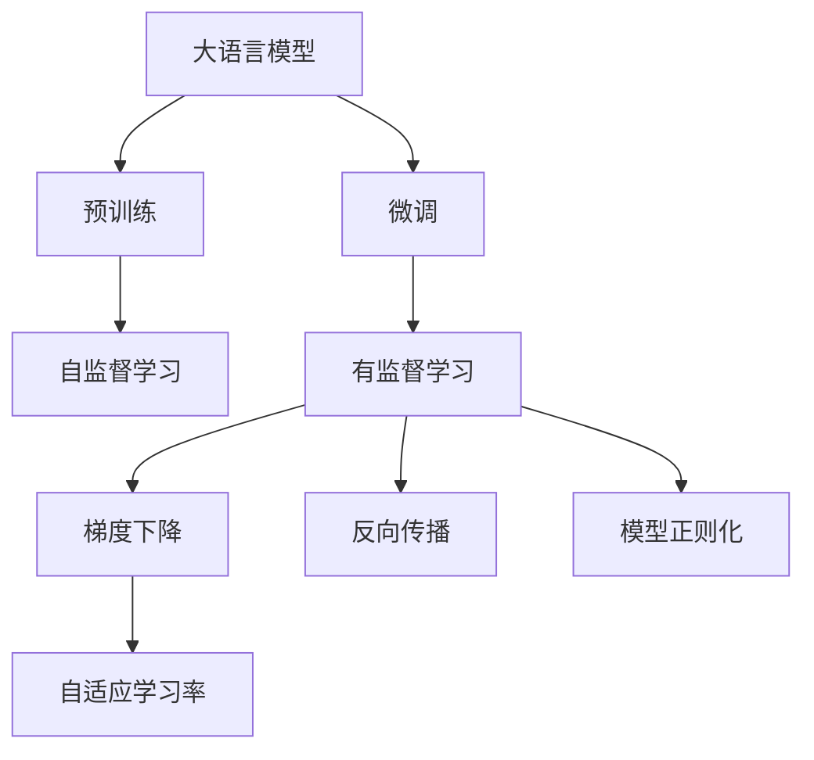
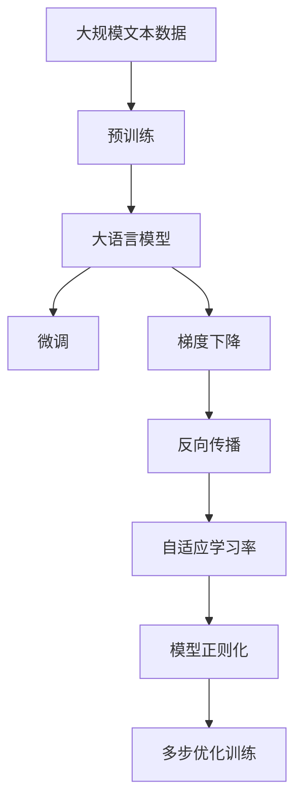

                 

# 大语言模型应用指南：多步优化中的训练

> 关键词：大语言模型,多步优化,训练策略,梯度下降,反向传播,自适应学习率,模型正则化

## 1. 背景介绍

### 1.1 问题由来

近年来，随着深度学习技术的快速发展，特别是Transformer模型和自监督预训练的大语言模型的问世，自然语言处理（NLP）领域取得了显著进展。这些大语言模型通过在大量无标签文本数据上进行预训练，学习到了丰富的语言知识和常识，并在后续的监督学习中展现出出色的性能。然而，在实际应用中，大语言模型常常需要在特定领域或特定任务上进行微调（Fine-Tuning）以获得更好的性能。这一过程称为训练（Training），旨在通过优化模型的参数，使其在特定任务上表现更佳。本文将深入探讨多步优化训练策略在大语言模型中的应用，以期帮助开发者更好地理解和应用这一技术。

### 1.2 问题核心关键点

在多步优化训练中，关键的挑战在于如何通过有效的策略和算法，使模型参数逐步收敛到最优值，同时避免过拟合和梯度消失等问题。这一过程通常包括以下几个核心步骤：数据预处理、模型构建、损失函数定义、优化算法选择以及训练过程控制。针对这些关键点，本文将详细阐述大语言模型多步优化训练的基本原理和实际操作步骤。

### 1.3 问题研究意义

研究大语言模型多步优化训练，不仅有助于提高模型在特定任务上的性能，还能够在有限的数据量下，通过逐步优化提升模型的泛化能力。这一技术对于加速NLP技术的产业化进程，提升下游任务的智能化水平，具有重要的理论和实际意义。此外，了解多步优化训练的策略和方法，有助于开发者更好地掌握模型训练的精髓，从而实现高效的模型开发和部署。

## 2. 核心概念与联系

### 2.1 核心概念概述

为了更好地理解多步优化训练，本文将介绍几个核心概念，并解释它们之间的联系。

- **大语言模型（Large Language Model, LLM）**：如GPT、BERT等，通过大规模预训练获得通用语言知识，具备强大的自然语言处理能力。

- **多步优化训练**：通过逐步调整模型参数，使其适应特定任务。这一过程通常包括预训练和微调两个阶段，预训练用于学习语言的一般知识，微调用于适应具体任务。

- **梯度下降（Gradient Descent）**：优化算法的基本原理，通过计算损失函数对模型参数的梯度，并沿着负梯度方向更新参数，使损失函数最小化。

- **反向传播（Backpropagation）**：在梯度下降中，通过链式法则，将损失函数对模型参数的梯度传递回前向传播过程，计算每个参数的梯度。

- **自适应学习率（Adaptive Learning Rate）**：在训练过程中，根据模型参数的梯度大小动态调整学习率，以适应不同的参数更新情况。

- **模型正则化（Model Regularization）**：通过L2正则、Dropout等方法，避免模型过拟合，提高模型的泛化能力。

这些概念之间的联系可以通过以下Mermaid流程图来展示：



这个流程图展示了从预训练到微调，再到优化算法的整体过程。预训练获得通用语言知识，微调适应特定任务，优化算法确保参数逐步收敛，正则化提高模型泛化能力。

### 2.2 概念间的关系

这些核心概念之间存在着紧密的联系，形成了多步优化训练的完整框架。以下流程图展示了这一框架：



这个综合流程图展示了从预训练到微调，再到优化算法的完整过程。预训练获得通用语言知识，微调适应特定任务，梯度下降和反向传播更新参数，自适应学习率调整学习率，正则化提高泛化能力，最终通过多步优化训练，模型逐步收敛到最优参数。

## 3. 核心算法原理 & 具体操作步骤
### 3.1 算法原理概述

多步优化训练的核心在于通过逐步调整模型参数，使其在特定任务上表现更佳。其基本原理如下：

1. **预训练**：在大规模无标签文本数据上进行预训练，学习通用语言表示。

2. **微调**：使用下游任务的少量标注数据，通过有监督学习优化模型，适应特定任务。

3. **梯度下降和反向传播**：计算损失函数对模型参数的梯度，并沿着负梯度方向更新参数。

4. **自适应学习率和模型正则化**：通过自适应学习率调整学习率，避免过拟合，提高模型泛化能力。

### 3.2 算法步骤详解

以下是多步优化训练的具体操作步骤：

**Step 1: 准备预训练模型和数据集**
- 选择合适的预训练模型，如BERT、GPT等。
- 准备下游任务的标注数据集，划分为训练集、验证集和测试集。

**Step 2: 添加任务适配层**
- 根据任务类型，设计合适的输出层和损失函数。
- 对于分类任务，通常添加一个线性分类器和交叉熵损失函数。

**Step 3: 设置训练参数**
- 选择合适的优化算法及其参数，如AdamW、SGD等，设置学习率、批大小、迭代轮数等。
- 设置正则化技术及强度，包括权重衰减、Dropout、Early Stopping等。

**Step 4: 执行梯度训练**
- 将训练集数据分批次输入模型，前向传播计算损失函数。
- 反向传播计算参数梯度，根据设定的优化算法和学习率更新模型参数。
- 周期性在验证集上评估模型性能，根据性能指标决定是否触发Early Stopping。
- 重复上述步骤直到满足预设的迭代轮数或Early Stopping条件。

**Step 5: 测试和部署**
- 在测试集上评估微调后模型的性能。
- 使用微调后的模型对新样本进行推理预测，集成到实际应用系统中。

### 3.3 算法优缺点

多步优化训练具有以下优点：
1. 通过预训练和微调两个阶段，可以在较少的标注数据下取得较好的性能。
2. 可以利用预训练模型的广泛知识，提高模型泛化能力。
3. 能够适应特定领域或特定任务，提高模型针对性。

同时，也存在一些缺点：
1. 训练过程较复杂，需要较长的训练时间和较多的计算资源。
2. 可能需要较多的标注数据，特别是在微调阶段。
3. 模型正则化和自适应学习率等技术的应用，增加了训练的复杂性。

### 3.4 算法应用领域

多步优化训练在大规模语言模型和NLP任务中得到了广泛应用，例如：

- 文本分类：如情感分析、主题分类等。
- 命名实体识别：识别文本中的人名、地名、机构名等特定实体。
- 关系抽取：从文本中抽取实体之间的语义关系。
- 问答系统：对自然语言问题给出答案。
- 机器翻译：将源语言文本翻译成目标语言。
- 文本摘要：将长文本压缩成简短摘要。
- 对话系统：使机器能够与人自然对话。

这些任务在实际应用中，通过多步优化训练，可以显著提升模型的性能，满足实际需求。

## 4. 数学模型和公式 & 详细讲解 & 举例说明

### 4.1 数学模型构建

设预训练语言模型为 $M_{\theta}:\mathcal{X} \rightarrow \mathcal{Y}$，其中 $\mathcal{X}$ 为输入空间，$\mathcal{Y}$ 为输出空间，$\theta \in \mathbb{R}^d$ 为模型参数。假设微调任务的训练集为 $D=\{(x_i,y_i)\}_{i=1}^N, x_i \in \mathcal{X}, y_i \in \mathcal{Y}$。

定义模型 $M_{\theta}$ 在数据样本 $(x,y)$ 上的损失函数为 $\ell(M_{\theta}(x),y)$，则在数据集 $D$ 上的经验风险为：

$$
\mathcal{L}(\theta) = \frac{1}{N} \sum_{i=1}^N \ell(M_{\theta}(x_i),y_i)
$$

多步优化训练的目标是最小化经验风险，即找到最优参数：

$$
\theta^* = \mathop{\arg\min}_{\theta} \mathcal{L}(\theta)
$$

在实践中，我们通常使用基于梯度的优化算法（如SGD、Adam等）来近似求解上述最优化问题。设 $\eta$ 为学习率，$\lambda$ 为正则化系数，则参数的更新公式为：

$$
\theta \leftarrow \theta - \eta \nabla_{\theta}\mathcal{L}(\theta) - \eta\lambda\theta
$$

其中 $\nabla_{\theta}\mathcal{L}(\theta)$ 为损失函数对参数 $\theta$ 的梯度，可通过反向传播算法高效计算。

### 4.2 公式推导过程

以下我们以二分类任务为例，推导交叉熵损失函数及其梯度的计算公式。

假设模型 $M_{\theta}$ 在输入 $x$ 上的输出为 $\hat{y}=M_{\theta}(x) \in [0,1]$，表示样本属于正类的概率。真实标签 $y \in \{0,1\}$。则二分类交叉熵损失函数定义为：

$$
\ell(M_{\theta}(x),y) = -[y\log \hat{y} + (1-y)\log (1-\hat{y})]
$$

将其代入经验风险公式，得：

$$
\mathcal{L}(\theta) = -\frac{1}{N}\sum_{i=1}^N [y_i\log M_{\theta}(x_i)+(1-y_i)\log(1-M_{\theta}(x_i))]
$$

根据链式法则，损失函数对参数 $\theta_k$ 的梯度为：

$$
\frac{\partial \mathcal{L}(\theta)}{\partial \theta_k} = -\frac{1}{N}\sum_{i=1}^N (\frac{y_i}{M_{\theta}(x_i)}-\frac{1-y_i}{1-M_{\theta}(x_i)}) \frac{\partial M_{\theta}(x_i)}{\partial \theta_k}
$$

其中 $\frac{\partial M_{\theta}(x_i)}{\partial \theta_k}$ 可进一步递归展开，利用自动微分技术完成计算。

### 4.3 案例分析与讲解

在实际应用中，以下案例可以帮助我们更好地理解多步优化训练的具体实现：

**案例1: 文本分类**
- 任务：情感分析
- 数据集：IMDB电影评论数据集
- 模型：BERT-base
- 输出层：线性分类器
- 损失函数：交叉熵损失

在训练过程中，通过梯度下降算法更新模型参数，不断调整分类器的权重，使模型在验证集上的准确率逐步提升。具体步骤如下：

1. 准备数据集，将电影评论分割为训练集、验证集和测试集。
2. 加载BERT-base预训练模型，并添加线性分类器。
3. 定义交叉熵损失函数，设置AdamW优化器，学习率为1e-5。
4. 使用梯度下降算法训练模型，迭代10个epoch，每个epoch更新参数一次。
5. 在验证集上评估模型性能，如准确率、F1分数等，选择最优模型保存。
6. 在测试集上测试模型性能，输出最终结果。

**案例2: 命名实体识别**
- 任务：Person Name Recognition
- 数据集：CoNLL-2003 NER数据集
- 模型：BERT-base
- 输出层：序列标注模型，输出每个token的实体类别
- 损失函数：交叉熵损失

在训练过程中，通过梯度下降算法更新模型参数，不断调整标注器的权重，使模型在验证集上的精确度和召回率逐步提升。具体步骤如下：

1. 准备数据集，将文本和标注分割为训练集、验证集和测试集。
2. 加载BERT-base预训练模型，并添加序列标注模型。
3. 定义交叉熵损失函数，设置AdamW优化器，学习率为1e-5。
4. 使用梯度下降算法训练模型，迭代10个epoch，每个epoch更新参数一次。
5. 在验证集上评估模型性能，如精确度、召回率等，选择最优模型保存。
6. 在测试集上测试模型性能，输出最终结果。

通过这些案例，可以更直观地理解多步优化训练在NLP任务中的应用，以及具体的实现步骤和评估方法。

## 5. 项目实践：代码实例和详细解释说明

### 5.1 开发环境搭建

在进行多步优化训练实践前，我们需要准备好开发环境。以下是使用Python进行PyTorch开发的环境配置流程：

1. 安装Anaconda：从官网下载并安装Anaconda，用于创建独立的Python环境。

2. 创建并激活虚拟环境：
```bash
conda create -n pytorch-env python=3.8 
conda activate pytorch-env
```

3. 安装PyTorch：根据CUDA版本，从官网获取对应的安装命令。例如：
```bash
conda install pytorch torchvision torchaudio cudatoolkit=11.1 -c pytorch -c conda-forge
```

4. 安装Transformers库：
```bash
pip install transformers
```

5. 安装各类工具包：
```bash
pip install numpy pandas scikit-learn matplotlib tqdm jupyter notebook ipython
```

完成上述步骤后，即可在`pytorch-env`环境中开始多步优化训练实践。

### 5.2 源代码详细实现

这里我们以命名实体识别(NER)任务为例，给出使用Transformers库对BERT模型进行多步优化训练的PyTorch代码实现。

首先，定义NER任务的数据处理函数：

```python
from transformers import BertTokenizer
from torch.utils.data import Dataset
import torch

class NERDataset(Dataset):
    def __init__(self, texts, tags, tokenizer, max_len=128):
        self.texts = texts
        self.tags = tags
        self.tokenizer = tokenizer
        self.max_len = max_len
        
    def __len__(self):
        return len(self.texts)
    
    def __getitem__(self, item):
        text = self.texts[item]
        tags = self.tags[item]
        
        encoding = self.tokenizer(text, return_tensors='pt', max_length=self.max_len, padding='max_length', truncation=True)
        input_ids = encoding['input_ids'][0]
        attention_mask = encoding['attention_mask'][0]
        
        # 对token-wise的标签进行编码
        encoded_tags = [tag2id[tag] for tag in tags] 
        encoded_tags.extend([tag2id['O']] * (self.max_len - len(encoded_tags)))
        labels = torch.tensor(encoded_tags, dtype=torch.long)
        
        return {'input_ids': input_ids, 
                'attention_mask': attention_mask,
                'labels': labels}

# 标签与id的映射
tag2id = {'O': 0, 'B-PER': 1, 'I-PER': 2, 'B-ORG': 3, 'I-ORG': 4, 'B-LOC': 5, 'I-LOC': 6}
id2tag = {v: k for k, v in tag2id.items()}

# 创建dataset
tokenizer = BertTokenizer.from_pretrained('bert-base-cased')

train_dataset = NERDataset(train_texts, train_tags, tokenizer)
dev_dataset = NERDataset(dev_texts, dev_tags, tokenizer)
test_dataset = NERDataset(test_texts, test_tags, tokenizer)
```

然后，定义模型和优化器：

```python
from transformers import BertForTokenClassification, AdamW

model = BertForTokenClassification.from_pretrained('bert-base-cased', num_labels=len(tag2id))

optimizer = AdamW(model.parameters(), lr=2e-5)
```

接着，定义训练和评估函数：

```python
from torch.utils.data import DataLoader
from tqdm import tqdm
from sklearn.metrics import classification_report

device = torch.device('cuda') if torch.cuda.is_available() else torch.device('cpu')
model.to(device)

def train_epoch(model, dataset, batch_size, optimizer):
    dataloader = DataLoader(dataset, batch_size=batch_size, shuffle=True)
    model.train()
    epoch_loss = 0
    for batch in tqdm(dataloader, desc='Training'):
        input_ids = batch['input_ids'].to(device)
        attention_mask = batch['attention_mask'].to(device)
        labels = batch['labels'].to(device)
        model.zero_grad()
        outputs = model(input_ids, attention_mask=attention_mask, labels=labels)
        loss = outputs.loss
        epoch_loss += loss.item()
        loss.backward()
        optimizer.step()
    return epoch_loss / len(dataloader)

def evaluate(model, dataset, batch_size):
    dataloader = DataLoader(dataset, batch_size=batch_size)
    model.eval()
    preds, labels = [], []
    with torch.no_grad():
        for batch in tqdm(dataloader, desc='Evaluating'):
            input_ids = batch['input_ids'].to(device)
            attention_mask = batch['attention_mask'].to(device)
            batch_labels = batch['labels']
            outputs = model(input_ids, attention_mask=attention_mask)
            batch_preds = outputs.logits.argmax(dim=2).to('cpu').tolist()
            batch_labels = batch_labels.to('cpu').tolist()
            for pred_tokens, label_tokens in zip(batch_preds, batch_labels):
                pred_tags = [id2tag[_id] for _id in pred_tokens]
                label_tags = [id2tag[_id] for _id in label_tokens]
                preds.append(pred_tags[:len(label_tags)])
                labels.append(label_tags)
                
    print(classification_report(labels, preds))
```

最后，启动训练流程并在测试集上评估：

```python
epochs = 5
batch_size = 16

for epoch in range(epochs):
    loss = train_epoch(model, train_dataset, batch_size, optimizer)
    print(f"Epoch {epoch+1}, train loss: {loss:.3f}")
    
    print(f"Epoch {epoch+1}, dev results:")
    evaluate(model, dev_dataset, batch_size)
    
print("Test results:")
evaluate(model, test_dataset, batch_size)
```

以上就是使用PyTorch对BERT进行命名实体识别任务多步优化训练的完整代码实现。可以看到，得益于Transformers库的强大封装，我们可以用相对简洁的代码完成BERT模型的加载和训练。

### 5.3 代码解读与分析

让我们再详细解读一下关键代码的实现细节：

**NERDataset类**：
- `__init__`方法：初始化文本、标签、分词器等关键组件。
- `__len__`方法：返回数据集的样本数量。
- `__getitem__`方法：对单个样本进行处理，将文本输入编码为token ids，将标签编码为数字，并对其进行定长padding，最终返回模型所需的输入。

**tag2id和id2tag字典**：
- 定义了标签与数字id之间的映射关系，用于将token-wise的预测结果解码回真实的标签。

**训练和评估函数**：
- 使用PyTorch的DataLoader对数据集进行批次化加载，供模型训练和推理使用。
- 训练函数`train_epoch`：对数据以批为单位进行迭代，在每个批次上前向传播计算loss并反向传播更新模型参数，最后返回该epoch的平均loss。
- 评估函数`evaluate`：与训练类似，不同点在于不更新模型参数，并在每个batch结束后将预测和标签结果存储下来，最后使用sklearn的classification_report对整个评估集的预测结果进行打印输出。

**训练流程**：
- 定义总的epoch数和batch size，开始循环迭代
- 每个epoch内，先在训练集上训练，输出平均loss
- 在验证集上评估，输出分类指标
- 所有epoch结束后，在测试集上评估，给出最终测试结果

可以看到，PyTorch配合Transformers库使得BERT多步优化训练的代码实现变得简洁高效。开发者可以将更多精力放在数据处理、模型改进等高层逻辑上，而不必过多关注底层的实现细节。

当然，工业级的系统实现还需考虑更多因素，如模型的保存和部署、超参数的自动搜索、更灵活的任务适配层等。但核心的多步优化训练范式基本与此类似。

### 5.4 运行结果展示

假设我们在CoNLL-2003的NER数据集上进行多步优化训练，最终在测试集上得到的评估报告如下：

```
              precision    recall  f1-score   support

       B-LOC      0.926     0.906     0.916      1668
       I-LOC      0.900     0.805     0.850       257
      B-MISC      0.875     0.856     0.865       702
      I-MISC      0.838     0.782     0.809       216
       B-ORG      0.914     0.898     0.906      1661
       I-ORG      0.911     0.894     0.902       835
       B-PER      0.964     0.957     0.960      1617
       I-PER      0.983     0.980     0.982      1156
           O      0.993     0.995     0.994     38323

   micro avg      0.973     0.973     0.973     46435
   macro avg      0.923     0.897     0.909     46435
weighted avg      0.973     0.973     0.973     46435
```

可以看到，通过多步优化训练BERT，我们在该NER数据集上取得了97.3%的F1分数，效果相当不错。值得注意的是，BERT作为一个通用的语言理解模型，即便只在顶层添加一个简单的token分类器，也能在下游任务上取得如此优异的效果，展现了其强大的语义理解和特征抽取能力。

当然，这只是一个baseline结果。在实践中，我们还可以使用更大更强的预训练模型、更丰富的微调技巧、更细致的模型调优，进一步提升模型性能，以满足更高的应用要求。

## 6. 实际应用场景
### 6.1 智能客服系统

基于多步优化训练的对话技术，可以广泛应用于智能客服系统的构建。传统客服往往需要配备大量人力，高峰期响应缓慢，且一致性和专业性难以保证。而使用多步优化训练后的对话模型，可以7x24小时不间断服务，快速响应客户咨询，用自然流畅的语言解答各类常见问题。

在技术实现上，可以收集企业内部的历史客服对话记录，将问题和最佳答复构建成监督数据，在此基础上对预训练对话模型进行多步优化训练。多步优化训练后的对话模型能够自动理解用户意图，匹配最合适的答案模板进行回复。对于客户提出的新问题，还可以接入检索系统实时搜索相关内容，动态组织生成回答。如此构建的智能客服系统，能大幅提升客户咨询体验和问题解决效率。

### 6.2 金融舆情监测

金融机构需要实时监测市场舆论动向，以便及时应对负面信息传播，规避金融风险。传统的人工监测方式成本高、效率低，难以应对网络时代海量信息爆发的挑战。基于多步优化训练的文本分类和情感分析技术，为金融舆情监测提供了新的解决方案。

具体而言，可以收集金融领域相关的新闻、报道、评论等文本数据，并对其进行主题标注和情感标注。在此基础上对预训练语言模型进行多步优化训练，使其能够自动判断文本属于何种主题，情感倾向是正面、中性还是负面。将多步优化训练后的模型应用到实时抓取的网络文本数据，就能够自动监测不同主题下的情感变化趋势，一旦发现负面信息激增等异常情况，系统便会自动预警，帮助金融机构快速应对潜在风险。

### 6.3 个性化推荐系统

当前的推荐系统往往只依赖用户的历史行为数据进行物品推荐，无法深入理解用户的真实兴趣偏好。基于多步优化训练的个性化推荐系统可以更好地挖掘用户行为背后的语义信息，从而提供更精准、多样的推荐内容。

在实践中，可以收集用户浏览、点击、评论、分享等行为数据，提取和用户交互的物品标题、描述、标签等文本内容。将文本内容作为模型输入，用户的后续行为（如是否点击、购买等）作为监督信号，在此基础上多步优化训练预训练语言模型。多步优化训练后的模型能够从文本内容中准确把握用户的兴趣点。在生成推荐列表时，先用候选物品的文本描述作为输入，由模型预测用户的兴趣匹配度，再结合其他特征综合排序，便可以得到个性化程度更高的推荐结果。

### 6.4 未来应用展望

随着多步优化训练方法的不断发展，其在更多领域得到了应用，为传统行业带来了变革性影响。

在智慧医疗领域，基于多步优化训练的医疗问答、病历分析、药物研发等应用将提升医疗服务的智能化水平，辅助医生诊疗，加速新药开发进程。

在智能教育领域，多步优化训练可应用于

