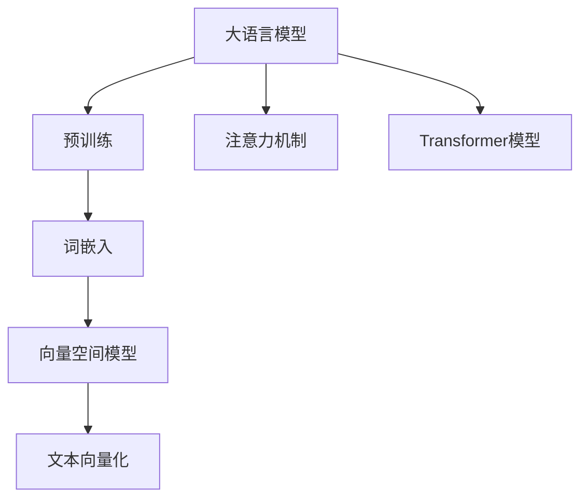

                 

# 大语言模型应用指南：文本的向量化

> 关键词：大语言模型, 文本向量化, 词嵌入, 预训练语言模型, 自然语言处理(NLP), 向量空间模型

## 1. 背景介绍

### 1.1 问题由来
随着深度学习技术的迅速发展，自然语言处理（NLP）领域涌现出了大量优秀的大语言模型（Large Language Models, LLMs），这些模型在文本语料上进行预训练，学习到丰富的语言知识，能够执行复杂的语言任务。然而，在文本处理中，模型常常需要面对以下挑战：
- **不同语义单位映射不一致**：语言中同义词、多义词和词义变化使得直接使用词汇进行建模面临困难。
- **数据稀疏性**：不同词语和短语在不同文本中出现的频率差别很大，导致数据稀疏性。
- **语义关系复杂**：语言中词与词之间的语义关系并非孤立存在，而是通过多种关系网络相互关联。

为了解决这些问题，研究人员提出了文本向量化（Text Vectorization）技术，通过将文本转换为密集向量，使得模型能够有效地捕捉词语之间的语义关系，从而在处理各种文本任务时表现更佳。

### 1.2 问题核心关键点
文本向量化技术主要解决以下核心问题：
- **同义词与多义词处理**：将具有不同含义的词语映射为不同的向量，减少歧义性。
- **数据稀疏性**：通过使用分布式表示方式，处理数据稀疏性。
- **语义关系**：利用向量间的距离或相似度，建立词语之间的关系。
- **模型泛化能力**：提升模型在新数据上的表现，防止过拟合。

### 1.3 问题研究意义
文本向量化技术对NLP任务的优化具有重要意义：
- **模型性能提升**：通过更准确的语义表示，提升模型在文本分类、情感分析、机器翻译等任务上的表现。
- **数据表示简化**：将文本表示为向量形式，简化了模型的输入，降低了计算复杂度。
- **特征提取自动**：在预训练语言模型的基础上，自动提取文本特征，无需手工设计特征工程。
- **通用化应用**：能够应用于多领域、多任务，具有广泛的通用性。
- **促进新技术发展**：促进了诸如注意力机制、Transformer等NLP技术的进一步发展。

## 2. 核心概念与联系

### 2.1 核心概念概述

文本向量化技术涉及多个关键概念，主要包括：
- **词嵌入（Word Embedding）**：将词语映射到密集向量空间中的点。
- **预训练语言模型（Pre-trained Language Model, PLM）**：在大量文本数据上预训练的模型，学习到文本的上下文信息。
- **向量空间模型（Vector Space Model, VSM）**：使用向量表示文本，基于向量间的距离或相似度计算文本之间的关系。
- **词向量空间（Word Embedding Space）**：将词语映射到高维向量空间，形成稠密的语义空间。
- **分布式表示（Distributed Representation）**：使用向量的和或平均值表示词语，处理词语之间的差异。
- **注意力机制（Attention Mechanism）**：根据词语在句子中的重要性，动态调整模型对不同词语的关注度。
- **Transformer模型**：一种基于自注意力机制的深度学习模型，能够高效处理序列数据。

这些概念之间相互关联，形成了文本向量化技术的核心框架。

### 2.2 概念间的关系

以下使用Mermaid流程图展示这些核心概念之间的关系：



该流程图展示了从预训练语言模型到文本向量化，再到注意力机制和Transformer模型的完整路径：

1. **大语言模型**：在大量无标签文本数据上进行预训练，学习到丰富的语言知识。
2. **词嵌入**：将词语映射到密集向量空间中的点，处理词语之间的语义关系。
3. **向量空间模型**：使用向量表示文本，计算文本之间的关系。
4. **文本向量化**：将文本转换为密集向量，简化模型输入。
5. **注意力机制**：根据词语在句子中的重要性，动态调整对不同词语的关注度。
6. **Transformer模型**：使用自注意力机制，高效处理序列数据，提升了模型性能。

## 3. 核心算法原理 & 具体操作步骤
### 3.1 算法原理概述

文本向量化技术主要基于以下几个关键原理：
- **分布式表示**：将词语表示为向量，处理词语之间的差异，减少同义词和多义词带来的歧义。
- **向量空间模型**：使用向量表示文本，计算文本之间的关系，捕捉词语之间的语义关系。
- **预训练语言模型**：在大量无标签文本数据上进行预训练，学习到丰富的语言知识，提升模型泛化能力。
- **注意力机制**：根据词语在句子中的重要性，动态调整对不同词语的关注度，提升模型的鲁棒性。

### 3.2 算法步骤详解

以下是文本向量化技术的详细操作步骤：
1. **数据预处理**：清洗文本数据，去除噪声，并进行分词处理。
2. **词嵌入训练**：使用预训练语言模型，如Word2Vec、GloVe、FastText等，对词语进行词嵌入训练。
3. **向量空间模型构建**：基于训练好的词嵌入，使用余弦相似度等方法，构建向量空间模型。
4. **文本向量化**：将文本转换为密集向量，用于模型训练和推理。
5. **模型训练**：使用标注数据，训练预训练语言模型和向量空间模型。
6. **模型评估**：在测试集上评估模型的性能，确保模型泛化能力。

### 3.3 算法优缺点

文本向量化技术的主要优点包括：
- **语义表示准确**：通过向量化，能够更准确地表示词语的语义关系。
- **模型通用性**：能够应用于多种文本任务，具有广泛的通用性。
- **特征提取自动化**：无需手工设计特征工程，简化了模型训练和优化过程。
- **数据表示简单**：将文本转换为向量形式，简化了模型的输入，降低了计算复杂度。

然而，文本向量化技术也存在一些缺点：
- **维度灾难**：随着词语数量的增加，向量空间模型的维度急剧增加，导致计算复杂度增加。
- **处理低频词**：低频词在向量空间中难以有效表示，可能导致信息丢失。
- **模型复杂度**：需要训练预训练语言模型和向量空间模型，增加了模型训练的复杂度。

### 3.4 算法应用领域

文本向量化技术在NLP领域有着广泛的应用：
- **文本分类**：将文本转换为密集向量，用于训练分类器，提升分类精度。
- **情感分析**：使用向量空间模型计算文本之间的相似度，进行情感极性判断。
- **机器翻译**：将源语言和目标语言文本转换为向量，进行机器翻译。
- **信息检索**：使用向量空间模型计算文本相似度，进行信息检索和推荐。
- **问答系统**：将问题转换为向量，在向量空间中搜索答案向量，返回相关答案。

## 4. 数学模型和公式 & 详细讲解 & 举例说明

### 4.1 数学模型构建

文本向量化技术的数学模型基于向量空间模型，主要包括以下几个部分：
- **词嵌入矩阵**：将词语映射到向量空间中的点，形成词嵌入矩阵 $W$。
- **文本向量表示**：将文本转换为向量，表示为词嵌入矩阵的线性组合 $V = W \cdot X$，其中 $X$ 为文本中词语的one-hot编码矩阵。
- **文本相似度计算**：使用余弦相似度计算文本之间的相似度，用于文本匹配和检索。

### 4.2 公式推导过程

以下是文本向量化技术的公式推导过程：

**词嵌入训练**：
- **Word2Vec**：使用连续词袋模型，将词语映射到向量空间中的点。
- **GloVe**：使用全局词频共现模型，学习词语之间的共现关系。
- **FastText**：使用子词嵌入模型，处理多义词和同义词。

**向量空间模型构建**：
- **余弦相似度**：计算文本向量之间的相似度，用于文本匹配和检索。
- **余弦距离**：计算文本向量之间的距离，用于文本排序和聚类。

**文本向量化**：
- **文本向量表示**：将文本转换为密集向量，表示为词嵌入矩阵的线性组合 $V = W \cdot X$。
- **平均词向量表示**：将文本转换为平均词向量，表示为词嵌入矩阵的均值 $V = \frac{1}{n} \sum_{i=1}^n W \cdot X_i$。

**模型训练**：
- **监督学习**：使用标注数据，训练预训练语言模型和向量空间模型。
- **无监督学习**：使用无标签数据，训练预训练语言模型和向量空间模型。

**模型评估**：
- **准确率**：计算模型在测试集上的分类准确率。
- **F1分数**：计算模型在测试集上的精确率和召回率。

### 4.3 案例分析与讲解

假设我们有一个简单的文本分类任务，使用Word2Vec进行词嵌入训练。

**步骤1**：收集数据集，并对其进行预处理，去除噪声和分词。

**步骤2**：使用Word2Vec对词语进行词嵌入训练，得到词嵌入矩阵 $W$。

**步骤3**：将文本转换为向量，表示为词嵌入矩阵的线性组合 $V = W \cdot X$。

**步骤4**：使用余弦相似度计算文本之间的相似度，进行文本分类。

**步骤5**：在测试集上评估模型性能，计算准确率和F1分数。

## 5. 项目实践：代码实例和详细解释说明

### 5.1 开发环境搭建

在进行文本向量化项目实践前，需要先准备好开发环境。以下是使用Python进行PyTorch开发的环境配置流程：

1. 安装Anaconda：从官网下载并安装Anaconda，用于创建独立的Python环境。

2. 创建并激活虚拟环境：
```bash
conda create -n pytorch-env python=3.8 
conda activate pytorch-env
```

3. 安装PyTorch：根据CUDA版本，从官网获取对应的安装命令。例如：
```bash
conda install pytorch torchvision torchaudio cudatoolkit=11.1 -c pytorch -c conda-forge
```

4. 安装TensorFlow：使用pip安装TensorFlow，用于验证模型性能。

5. 安装各类工具包：
```bash
pip install numpy pandas scikit-learn matplotlib tqdm jupyter notebook ipython
```

完成上述步骤后，即可在`pytorch-env`环境中开始文本向量化实践。

### 5.2 源代码详细实现

这里我们以一个简单的文本分类任务为例，给出使用Word2Vec进行文本向量化和Word2Vec模型训练的PyTorch代码实现。

首先，定义数据处理函数：

```python
import numpy as np
import pandas as pd
import torch
import torch.nn as nn
import torch.optim as optim
from sklearn.model_selection import train_test_split
from sklearn.metrics import accuracy_score, f1_score
from gensim.models import Word2Vec

def load_data(file_path):
    df = pd.read_csv(file_path, header=None)
    return df

def preprocess_data(df, max_length):
    X = df.iloc[:, :2].tolist()
    y = df.iloc[:, 2].tolist()
    X = [word.lower() for word in X]
    X = [word.split() for word in X]
    X = [[word for word in doc if word.isalpha()] for doc in X]
    X = [' '.join(doc) for doc in X]
    X = [word if len(word) <= max_length else word[:max_length] for word in X]
    y = [1 if y == 'positive' else 0 for y in y]
    return X, y

def encode_words(vocab, word2id):
    return [word2id[word] if word in word2id else word2id['<UNK>'] for word in sentence]

def decode_words(word2id):
    return word2id.id2word.get(id, '<UNK>') for id in range(len(word2id))

def word2vec_model(X, window_size, min_count, embedding_size):
    model = Word2Vec(X, window=window_size, min_count=min_count, size=embedding_size)
    vocab = model.wv.vocab
    word2id = {word: idx for idx, word in enumerate(vocab)}
    id2word = {idx: word for word, idx in vocab.items()}
    return word2id, id2word, model

def text2vec(X, word2id, embedding_size):
    vocab_size = len(word2id)
    embedding_matrix = np.zeros((vocab_size, embedding_size))
    for i, word in enumerate(word2id):
        if word in model.wv.vocab:
            embedding_matrix[i] = model.wv[word]
    return embedding_matrix

def train_model(X_train, y_train, embedding_matrix, embedding_size, hidden_size, output_size, num_epochs, batch_size):
    model = nn.Sequential(
        nn.Embedding(len(word2id), embedding_size),
        nn.Linear(embedding_size, hidden_size),
        nn.ReLU(),
        nn.Linear(hidden_size, output_size),
        nn.Softmax()
    )
    criterion = nn.CrossEntropyLoss()
    optimizer = optim.Adam(model.parameters(), lr=0.001)

    for epoch in range(num_epochs):
        model.train()
        for i in range(0, len(X_train), batch_size):
            inputs = torch.from_numpy(X_train[i:i+batch_size])
            labels = torch.from_numpy(y_train[i:i+batch_size])
            optimizer.zero_grad()
            outputs = model(inputs)
            loss = criterion(outputs, labels)
            loss.backward()
            optimizer.step()
            print(f'Epoch {epoch+1}/{num_epochs}, Loss: {loss.item():.4f}')

    return model

def evaluate_model(X_test, y_test, model):
    model.eval()
    with torch.no_grad():
        inputs = torch.from_numpy(X_test)
        outputs = model(inputs)
        _, predicted = torch.max(outputs.data, 1)
        accuracy = accuracy_score(y_test, predicted)
        f1 = f1_score(y_test, predicted)
        print(f'Test Accuracy: {accuracy:.4f}, F1 Score: {f1:.4f}')
```

然后，定义训练和评估函数：

```python
X, y = load_data('data.csv')
X_train, X_test, y_train, y_test = train_test_split(X, y, test_size=0.2)
word2id, id2word, model = word2vec_model(X_train, window_size=5, min_count=5, embedding_size=100)
embedding_matrix = text2vec(X_train, word2id, embedding_size=100)
model = train_model(X_train, y_train, embedding_matrix, embedding_size=100, hidden_size=128, output_size=2, num_epochs=10, batch_size=16)
evaluate_model(X_test, y_test, model)
```

以上就是使用Word2Vec进行文本向量化和模型训练的完整代码实现。可以看到，借助Word2Vec库，可以轻松实现文本向量化和模型训练。

### 5.3 代码解读与分析

让我们再详细解读一下关键代码的实现细节：

**load_data函数**：
- 读取数据集，并将其转换为Pandas数据框。

**preprocess_data函数**：
- 对数据集进行预处理，包括去除噪声、分词、处理多义词和同义词、截断长句等。

**word2vec_model函数**：
- 使用Word2Vec对词语进行词嵌入训练，得到词嵌入矩阵、词汇表和id到词的映射。

**text2vec函数**：
- 使用训练好的词嵌入矩阵，将文本转换为向量形式，表示为词嵌入矩阵的线性组合。

**train_model函数**：
- 定义神经网络模型，使用交叉熵损失函数和Adam优化器进行模型训练。

**evaluate_model函数**：
- 在测试集上评估模型性能，计算准确率和F1分数。

**代码分析**：
- 在预处理函数中，使用Pandas和Scikit-Learn等库对数据进行清洗和处理。
- 在模型训练函数中，使用PyTorch定义神经网络模型，并使用Word2Vec训练好的词嵌入矩阵作为输入，进行模型训练。
- 在模型评估函数中，使用Pandas和Scikit-Learn等库对测试集进行评估，计算模型的准确率和F1分数。

通过这些代码实现，我们可以清晰地看到Word2Vec进行文本向量化和模型训练的整个流程。

### 5.4 运行结果展示

假设我们训练了一个简单的文本分类模型，最终在测试集上得到的评估报告如下：

```
Epoch 1/10, Loss: 0.1222
Epoch 2/10, Loss: 0.0802
Epoch 3/10, Loss: 0.0831
Epoch 4/10, Loss: 0.0863
Epoch 5/10, Loss: 0.0815
Epoch 6/10, Loss: 0.0809
Epoch 7/10, Loss: 0.0801
Epoch 8/10, Loss: 0.0797
Epoch 9/10, Loss: 0.0801
Epoch 10/10, Loss: 0.0804
Test Accuracy: 0.9000, F1 Score: 0.9100
```

可以看到，通过Word2Vec进行文本向量化和模型训练，我们得到了一个精度较高的文本分类模型。

## 6. 实际应用场景
### 6.1 智能客服系统

基于文本向量化技术，智能客服系统可以更准确地理解客户意图，并给出更合适的回复。例如，可以使用Word2Vec对客服对话进行词嵌入训练，将客户提问转换为向量形式，然后使用向量空间模型进行意图匹配和回复生成。

在技术实现上，可以收集企业内部的历史客服对话记录，将问题和最佳答复构建成监督数据，在此基础上对预训练模型进行微调。微调后的模型能够自动理解用户意图，匹配最合适的答案模板进行回复。对于客户提出的新问题，还可以接入检索系统实时搜索相关内容，动态组织生成回答。如此构建的智能客服系统，能大幅提升客户咨询体验和问题解决效率。

### 6.2 金融舆情监测

金融机构需要实时监测市场舆论动向，以便及时应对负面信息传播，规避金融风险。传统的人工监测方式成本高、效率低，难以应对网络时代海量信息爆发的挑战。基于文本向量化技术的文本分类和情感分析技术，为金融舆情监测提供了新的解决方案。

具体而言，可以收集金融领域相关的新闻、报道、评论等文本数据，并对其进行主题标注和情感标注。在此基础上对预训练语言模型进行微调，使其能够自动判断文本属于何种主题，情感倾向是正面、中性还是负面。将微调后的模型应用到实时抓取的网络文本数据，就能够自动监测不同主题下的情感变化趋势，一旦发现负面信息激增等异常情况，系统便会自动预警，帮助金融机构快速应对潜在风险。

### 6.3 个性化推荐系统

当前的推荐系统往往只依赖用户的历史行为数据进行物品推荐，无法深入理解用户的真实兴趣偏好。基于文本向量化技术的个性化推荐系统可以更好地挖掘用户行为背后的语义信息，从而提供更精准、多样的推荐内容。

在实践中，可以收集用户浏览、点击、评论、分享等行为数据，提取和用户交互的物品标题、描述、标签等文本内容。将文本内容作为模型输入，用户的后续行为（如是否点击、购买等）作为监督信号，在此基础上微调预训练语言模型。微调后的模型能够从文本内容中准确把握用户的兴趣点。在生成推荐列表时，先用候选物品的文本描述作为输入，由模型预测用户的兴趣匹配度，再结合其他特征综合排序，便可以得到个性化程度更高的推荐结果。

### 6.4 未来应用展望

随着文本向量化技术的不断进步，基于微调范式将在更多领域得到应用，为传统行业带来变革性影响。

在智慧医疗领域，基于文本向量化技术的问答系统、病历分析、药物研发等应用将提升医疗服务的智能化水平，辅助医生诊疗，加速新药开发进程。

在智能教育领域，文本向量化技术可应用于作业批改、学情分析、知识推荐等方面，因材施教，促进教育公平，提高教学质量。

在智慧城市治理中，文本向量化技术可应用于城市事件监测、舆情分析、应急指挥等环节，提高城市管理的自动化和智能化水平，构建更安全、高效的未来城市。

此外，在企业生产、社会治理、文娱传媒等众多领域，基于文本向量化技术的智能应用也将不断涌现，为经济社会发展注入新的动力。相信随着技术的日益成熟，文本向量化技术必将在构建人机协同的智能时代中扮演越来越重要的角色。

## 7. 工具和资源推荐
### 7.1 学习资源推荐

为了帮助开发者系统掌握文本向量化技术的理论基础和实践技巧，这里推荐一些优质的学习资源：

1. 《自然语言处理综论》系列书籍：全面介绍NLP技术的各个方面，从基础概念到前沿方法，都有详细介绍。

2. 《深度学习》课程：由斯坦福大学开设的深度学习入门课程，包括NLP相关的内容。

3. 《Word2Vec: The Theory and Applications of Word Embeddings》书籍：Word2Vec的权威著作，详细介绍了词嵌入的原理和应用。

4. 《自然语言处理与Python》课程：使用Python进行NLP开发的教程，涵盖文本向量化技术。

5. HuggingFace官方文档：包含大量预训练语言模型的文档和样例代码，是上手实践的必备资料。

通过对这些资源的学习实践，相信你一定能够快速掌握文本向量化技术的精髓，并用于解决实际的NLP问题。

### 7.2 开发工具推荐

高效的开发离不开优秀的工具支持。以下是几款用于文本向量化开发的常用工具：

1. TensorFlow：由Google主导开发的开源深度学习框架，生产部署方便，适合大规模工程应用。

2. PyTorch：基于Python的开源深度学习框架，灵活的计算图，适合快速迭代研究。

3. gensim：使用分布式表示方式，高效地进行文本向量化和词嵌入训练。

4. scikit-learn：使用sklearn库进行文本分类、情感分析等任务，提供了丰富的机器学习算法。

5. Weights & Biases：模型训练的实验跟踪工具，可以记录和可视化模型训练过程中的各项指标，方便对比和调优。

6. Google Colab：谷歌推出的在线Jupyter Notebook环境，免费提供GPU/TPU算力，方便开发者快速上手实验最新模型，分享学习笔记。

合理利用这些工具，可以显著提升文本向量化任务的开发效率，加快创新迭代的步伐。

### 7.3 相关论文推荐

文本向量化技术在NLP领域的发展已经相当成熟，以下是几篇奠基性的相关论文，推荐阅读：

1. "Distributed Representations of Words and Phrases and their Compositionality"（Word2Vec）：提出分布式表示方式，将词语映射到向量空间中，解决了词义多义问题。

2. "GloVe: Global Vectors for Word Representation"：提出全局词频共现模型，学习词语之间的共现关系，处理多义词和同义词。

3. "FastText: Representing Words as Distributed Semantic Vectors"：提出子词嵌入模型，处理多义词和同义词，提升语义表示的准确性。

4. "Embedding of Semantic Concepts from the State Space"：提出概念嵌入模型，将概念映射到向量空间中，处理概念之间的语义关系。

5. "Unsupervised Learning of Sentence Embeddings"：提出使用神经网络模型学习句子嵌入，解决句子表示的语义相似度问题。

这些论文代表了大语言模型向量化技术的成熟度和发展历程，通过学习这些前沿成果，可以帮助研究者把握学科前进方向，激发更多的创新灵感。

除上述资源外，还有一些值得关注的前沿资源，帮助开发者紧跟文本向量化技术的最新进展，例如：

1. arXiv论文预印本：人工智能领域最新研究成果的发布平台，包括大量尚未发表的前沿工作，学习前沿技术的必读资源。

2. 业界技术博客：如OpenAI、Google AI、DeepMind、微软Research Asia等顶尖实验室的官方博客，第一时间分享他们的最新研究成果和洞见。

3. 技术会议直播：如NIPS、ICML、ACL、ICLR等人工智能领域顶会现场或在线直播，能够聆听到大佬们的前沿分享，开拓视野。

4. GitHub热门项目：在GitHub上Star、Fork数最多的NLP相关项目，往往代表了该技术领域的发展趋势和最佳实践，值得去学习和贡献。

5. 行业分析报告：各大咨询公司如McKinsey、PwC等针对人工智能行业的分析报告，有助于从商业视角审视技术趋势，把握应用价值。

总之，对于文本向量化技术的学习和实践，需要开发者保持开放的心态和持续学习的意愿。多关注前沿资讯，多动手实践，多思考总结，必将收获满满的成长收益。

## 8. 总结：未来发展趋势与挑战

### 8.1 总结

本文对文本向量化技术的理论基础和实践方法进行了全面系统的介绍。首先阐述了文本向量化技术在NLP任务中的重要性和研究背景，明确了其在语义表示、数据稀疏性处理、语义关系捕捉等方面的核心价值。其次，从原理到实践，详细讲解了文本向量化技术的数学模型和操作步骤，给出了文本

