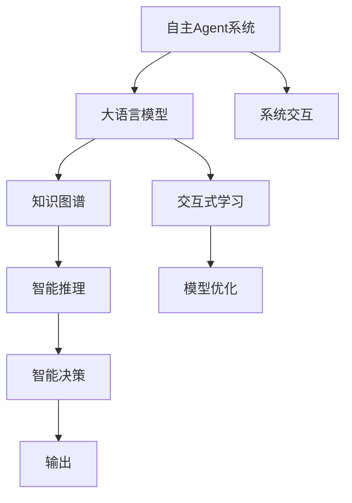
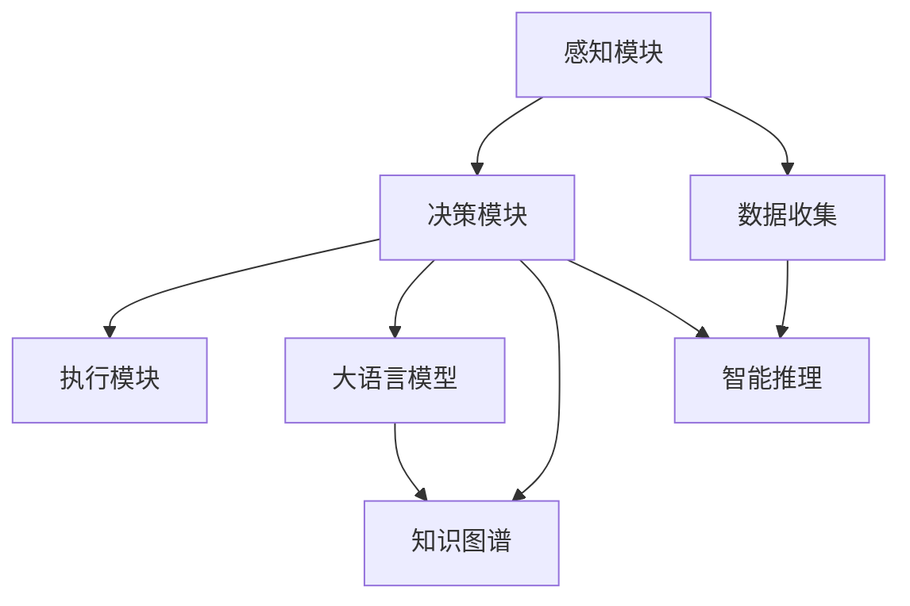
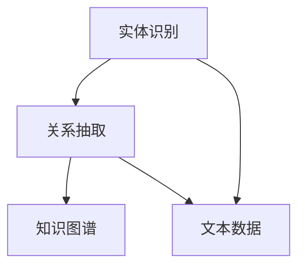
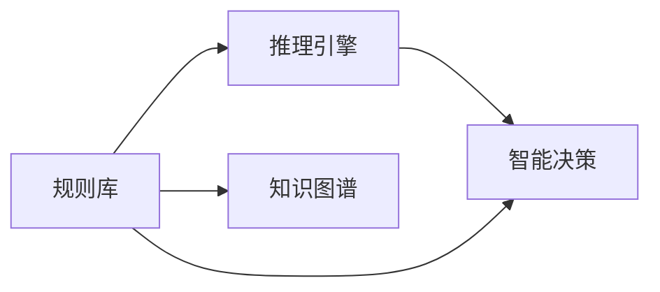
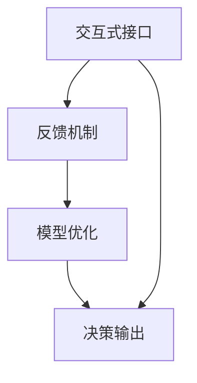
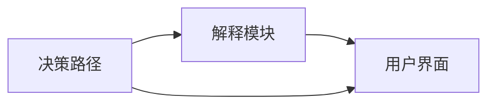
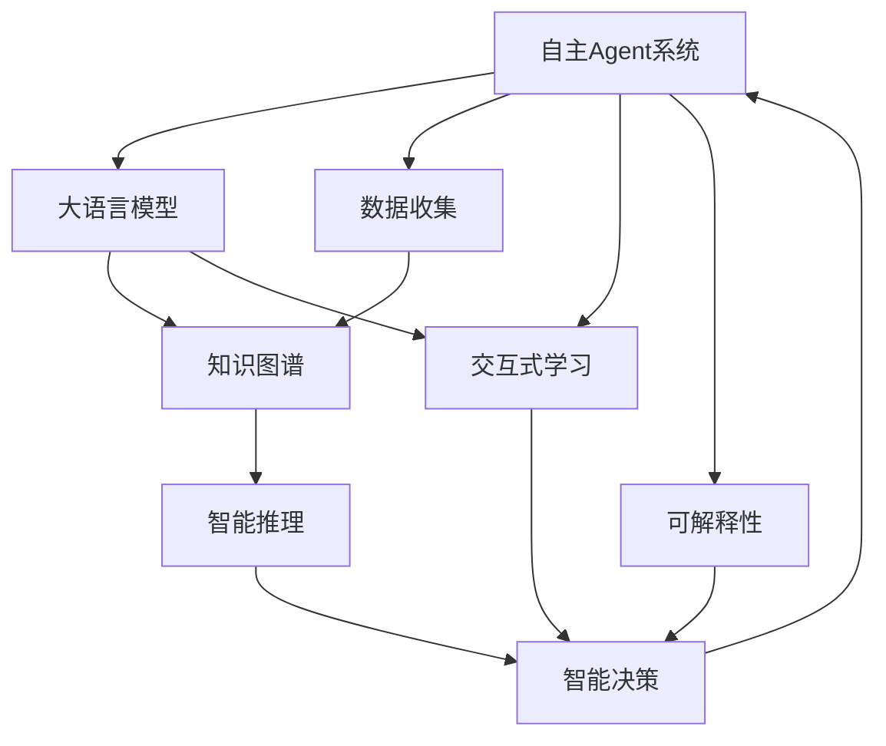

                 

# 大语言模型应用指南：自主Agent系统案例分析（一）

> 关键词：大语言模型,自主Agent系统,自然语言处理(NLP),智能决策,多智能体系统,知识图谱,可解释性,交互式学习

## 1. 背景介绍

### 1.1 问题由来
随着人工智能技术的快速发展，自主Agent系统（自主代理系统）在智能制造、智能交通、智能安防、智慧医疗等众多领域得到了广泛应用。这些系统通常需要大量的数据和模型，以实时处理和响应复杂的环境变化。而传统的基于规则的决策系统，往往难以满足实际需求，容易出现性能瓶颈和可扩展性问题。

为了解决这些问题，研究者们提出了基于大语言模型的自主Agent系统，即利用大语言模型强大的自然语言处理（NLP）能力，进行信息抽取、知识图谱构建、智能推理等任务，从而实现自主决策和交互式学习。

然而，如何在自主Agent系统中有效地应用大语言模型，仍是一个重要问题。本文聚焦于自主Agent系统中大语言模型的应用，介绍其原理、具体操作步骤和实际案例，帮助读者深入理解这一新兴领域。

### 1.2 问题核心关键点
自主Agent系统中大语言模型的应用，核心在于如何构建一个高效、可解释、鲁棒的智能决策系统。该系统需要：
- 获取并处理海量数据。
- 构建知识图谱，提炼结构化知识。
- 进行智能推理，辅助决策。
- 实现交互式学习，不断优化模型。
- 提供可解释的输出，提升系统可信度。

本文将详细探讨这些关键问题，并通过案例分析，展示大语言模型在自主Agent系统中的应用效果。

### 1.3 问题研究意义
大语言模型在自主Agent系统中的应用，可以带来以下几方面的积极影响：
1. 提升决策效率。大语言模型可以快速处理和理解海量数据，提取关键信息，辅助决策。
2. 增强系统泛化能力。大语言模型具备广泛的预训练知识，可以适应不同领域和场景。
3. 实现人机交互。大语言模型能够理解和生成自然语言，实现人机自然交流，提升用户体验。
4. 增强系统可解释性。大语言模型提供可解释性框架，帮助用户理解和信任系统决策。
5. 推动行业创新。大语言模型在自主Agent系统中的应用，将推动各行各业智能化转型，加速技术应用。

## 2. 核心概念与联系

### 2.1 核心概念概述

为更好地理解自主Agent系统中大语言模型的应用，本节将介绍几个密切相关的核心概念：

- 自主Agent系统(Autonomous Agent Systems)：由多个智能体组成的分布式系统，具备自主感知、决策、执行和交互能力。

- 大语言模型(Large Language Models)：如BERT、GPT-3等大规模预训练语言模型，具备丰富的语言知识和常识，可以执行复杂的自然语言处理任务。

- 知识图谱(Knowledge Graph)：一种结构化表示语义知识的方式，用于存储和查询实体之间的关系。

- 智能推理(Intelligent Reasoning)：基于知识图谱和逻辑推理的智能决策过程。

- 交互式学习(Interactive Learning)：通过与环境的交互，不断更新和优化模型的学习过程。

- 可解释性(Explainability)：使决策过程透明，便于用户理解和管理。

这些核心概念之间的逻辑关系可以通过以下Mermaid流程图来展示：



这个流程图展示了大语言模型在自主Agent系统中的应用框架：

1. 大语言模型在自主Agent系统中扮演核心角色，具备信息抽取、知识图谱构建、智能推理等能力。
2. 知识图谱和大语言模型协同工作，提升系统的语义理解和智能决策能力。
3. 智能推理和交互式学习，使系统能够适应环境变化，优化模型表现。
4. 可解释性框架，帮助用户理解和信任系统决策。

### 2.2 概念间的关系

这些核心概念之间存在着紧密的联系，形成了自主Agent系统中大语言模型应用的整体生态系统。下面我通过几个Mermaid流程图来展示这些概念之间的关系。

#### 2.2.1 自主Agent系统的架构


这个流程图展示了自主Agent系统的基本架构，主要包括数据收集、感知、决策、执行和智能推理等关键组件。

#### 2.2.2 大语言模型的功能


这个流程图展示了大语言模型在自主Agent系统中的主要功能：信息抽取、知识图谱构建、智能推理和智能决策。

#### 2.2.3 知识图谱的构建


这个流程图展示了知识图谱构建的基本流程，主要包括实体识别、关系抽取和构建知识图谱等步骤。

#### 2.2.4 智能推理的实现


这个流程图展示了智能推理的实现过程，主要依赖规则库和推理引擎，从知识图谱中提取逻辑推理规则，辅助决策。

#### 2.2.5 交互式学习的流程


这个流程图展示了交互式学习的基本流程，通过与环境的交互，收集反馈，优化模型，提升决策效果。

#### 2.2.6 可解释性的框架


这个流程图展示了可解释性的框架，主要通过决策路径分析和解释模块，将复杂决策过程透明化，便于用户理解和信任。

### 2.3 核心概念的整体架构

最后，我们用一个综合的流程图来展示这些核心概念在自主Agent系统中的整体架构：



这个综合流程图展示了从感知到决策、再通过交互式学习和可解释性框架的完整过程。自主Agent系统通过大语言模型的强大能力，不断从环境中学习并优化决策模型，为用户提供高效、透明、可信的智能决策服务。

## 3. 核心算法原理 & 具体操作步骤

### 3.1 算法原理概述

在自主Agent系统中，大语言模型的应用主要通过以下几个步骤进行：

1. 数据收集与预处理：从环境中获取相关数据，并进行清洗、标准化和预处理。
2. 信息抽取与知识图谱构建：利用大语言模型对数据进行信息抽取，构建知识图谱。
3. 智能推理：基于知识图谱进行逻辑推理，辅助决策。
4. 交互式学习：通过与环境的交互，收集反馈，优化模型。
5. 输出与反馈：将决策结果输出给用户或执行模块，并收集用户反馈，进一步优化模型。

这些步骤中，大语言模型主要负责信息抽取和智能推理。信息抽取通过自然语言处理技术，从文本中提取关键实体和关系，构建结构化的知识图谱。智能推理则基于知识图谱和逻辑规则，辅助系统进行决策。

### 3.2 算法步骤详解

#### 3.2.1 数据收集与预处理

在自主Agent系统中，数据收集和预处理是重要环节，直接影响后续的信息抽取和知识图谱构建。数据收集主要通过传感器、网络爬虫等方式获取，预处理则包括数据清洗、标准化、缺失值处理等步骤。

具体实现步骤如下：

1. 收集相关数据：通过传感器、API接口、网络爬虫等方式，收集与任务相关的文本、图像、音频等数据。
2. 数据清洗：去除噪声数据，修正错误信息，保证数据质量。
3. 数据标准化：对不同格式和类型的数据进行标准化处理，方便后续处理。
4. 缺失值处理：处理数据中的缺失值，采用插值、填补等方法，保证数据完整性。

#### 3.2.2 信息抽取与知识图谱构建

信息抽取是大语言模型在自主Agent系统中的核心任务之一，其目的是从文本中提取实体、关系和事件等信息，构建知识图谱。

具体实现步骤如下：

1. 文本解析：将收集到的文本数据进行分句、分词等预处理，提取句子结构信息。
2. 实体识别：利用大语言模型进行命名实体识别，识别出文本中的人名、地名、机构名等实体。
3. 关系抽取：根据实体之间的语义关系，利用大语言模型进行关系抽取，构建实体之间的关系图。
4. 知识图谱构建：将抽取的实体和关系存储在知识图谱中，构建结构化的语义知识。

#### 3.2.3 智能推理

智能推理是自主Agent系统中大语言模型的另一重要应用。其目的是根据知识图谱和逻辑规则，进行推理和决策。

具体实现步骤如下：

1. 知识图谱查询：从知识图谱中查询相关的实体和关系，构建推理路径。
2. 逻辑推理：利用逻辑规则进行推理计算，得出结论。
3. 决策生成：根据推理结果，生成智能决策。

#### 3.2.4 交互式学习

交互式学习是大语言模型在自主Agent系统中的重要组成部分，其目的是通过与环境的交互，不断优化模型。

具体实现步骤如下：

1. 交互接口设计：设计友好的交互界面，方便用户与系统交互。
2. 反馈收集：通过交互接口收集用户反馈，获取反馈信息。
3. 模型优化：根据反馈信息，优化模型参数，提升决策效果。

#### 3.2.5 输出与反馈

输出与反馈是大语言模型在自主Agent系统中的重要环节，其目的是将决策结果输出给用户或执行模块，并收集用户反馈，进一步优化模型。

具体实现步骤如下：

1. 决策结果输出：将智能决策结果输出给用户或执行模块，供其使用。
2. 用户反馈收集：通过交互接口收集用户反馈，获取用户意见。
3. 模型优化：根据用户反馈，优化模型参数，提升决策效果。

### 3.3 算法优缺点

大语言模型在自主Agent系统中的应用，具有以下优点：

1. 强大的语义理解能力：大语言模型具备丰富的语言知识和常识，可以准确理解文本中的实体、关系和事件等信息。
2. 高效的信息抽取：利用自然语言处理技术，可以快速从文本中提取关键信息，构建结构化的知识图谱。
3. 灵活的推理计算：根据知识图谱和逻辑规则，灵活进行推理计算，辅助决策。
4. 支持人机交互：利用自然语言处理技术，实现人机自然交流，提升用户体验。
5. 可解释性框架：提供可解释性框架，帮助用户理解和信任系统决策。

同时，大语言模型在自主Agent系统中的应用也存在一些局限性：

1. 数据依赖性强：依赖高质量的数据和预训练模型，数据质量差将影响系统性能。
2. 推理计算复杂：复杂推理计算需要高计算资源，可能导致系统性能瓶颈。
3. 可解释性不足：大语言模型输出结果往往缺乏可解释性，难以理解其决策过程。
4. 对抗攻击风险：大语言模型可能受到对抗样本攻击，影响系统安全。
5. 模型泛化能力有限：在大规模无标签数据上预训练后，可能无法很好地适应特定领域的任务。

尽管存在这些局限性，但大语言模型在自主Agent系统中的应用，依然展现出了强大的潜力和广泛的应用前景。

### 3.4 算法应用领域

大语言模型在自主Agent系统中的应用，已经广泛应用于多个领域，具体包括：

1. 智能制造：用于生产线质量监控、设备维护、供应链管理等。
2. 智能交通：用于交通流量分析、路径规划、事故预测等。
3. 智能安防：用于入侵检测、视频监控、异常行为分析等。
4. 智慧医疗：用于疾病诊断、病人护理、药物研发等。
5. 智慧城市：用于城市管理、公共安全、智能交通等。
6. 金融风控：用于信用评估、欺诈检测、风险预测等。

大语言模型在以上领域的应用，大大提高了系统的决策效率和智能水平，推动了各行业的智能化转型。

## 4. 数学模型和公式 & 详细讲解

### 4.1 数学模型构建

在自主Agent系统中，大语言模型的应用主要通过以下几个数学模型进行：

1. 信息抽取模型：用于从文本中抽取实体、关系等信息，构建知识图谱。
2. 推理计算模型：用于根据知识图谱和逻辑规则，进行推理计算，辅助决策。
3. 交互式学习模型：用于与环境的交互，收集反馈，优化模型。

### 4.2 公式推导过程

#### 4.2.1 信息抽取模型

信息抽取模型主要通过自然语言处理技术，从文本中提取实体、关系等信息。常用的方法包括基于规则的抽取、基于统计的抽取、基于深度学习的抽取等。

下面以基于深度学习的抽取为例，进行公式推导：

假设文本序列为 $x_1,x_2,\cdots,x_n$，其中 $x_i$ 表示第 $i$ 个单词。定义实体抽取函数为 $E(x)$，关系抽取函数为 $R(x)$。

实体抽取函数的输入为文本序列 $x$，输出为实体集合 $S$。实体抽取函数的推导如下：

$$
S = E(x) = \{ s_1,s_2,\cdots,s_k \}
$$

其中 $s_i$ 表示第 $i$ 个实体。

关系抽取函数的输入为文本序列 $x$，输出为关系集合 $T$。关系抽取函数的推导如下：

$$
T = R(x) = \{ t_1,t_2,\cdots,t_l \}
$$

其中 $t_i$ 表示第 $i$ 个关系。

#### 4.2.2 推理计算模型

推理计算模型主要基于知识图谱进行逻辑推理，辅助决策。常用的方法包括基于规则的推理、基于事实的推理、基于模型的推理等。

下面以基于事实的推理为例，进行公式推导：

假设知识图谱为 $G=(V,E)$，其中 $V$ 表示节点集合，$E$ 表示边集合。定义推理函数为 $P(G)$，输出推理结果。

推理函数的输入为知识图谱 $G$，输出为推理结果 $R$。推理函数的推导如下：

$$
R = P(G) = \{ r_1,r_2,\cdots,r_m \}
$$

其中 $r_i$ 表示第 $i$ 个推理结果。

#### 4.2.3 交互式学习模型

交互式学习模型主要通过与环境的交互，收集反馈，优化模型。常用的方法包括基于梯度的优化、基于贝叶斯的优化、基于强化学习的优化等。

下面以基于梯度的优化为例，进行公式推导：

假设模型参数为 $\theta$，损失函数为 $L$。定义优化函数为 $O(\theta)$，输出优化后的模型参数。

优化函数的输入为模型参数 $\theta$，输出为优化后的模型参数 $\hat{\theta}$。优化函数的推导如下：

$$
\hat{\theta} = O(\theta) = \theta - \eta \nabla_{\theta} L(\theta)
$$

其中 $\eta$ 为学习率，$\nabla_{\theta} L(\theta)$ 为损失函数对模型参数的梯度。

### 4.3 案例分析与讲解

下面我们以智能制造领域的应用为例，进行详细讲解。

#### 4.3.1 场景描述

假设在一个智能制造工厂中，需要实时监控生产线的质量状态，及时发现和处理异常。系统可以通过大语言模型进行信息抽取和推理计算，辅助决策。

#### 4.3.2 系统设计

系统设计主要包括以下几个关键组件：

1. 数据收集模块：通过传感器收集生产线数据，包括温度、湿度、压力等。
2. 信息抽取模块：利用大语言模型进行实体抽取和关系抽取，构建知识图谱。
3. 智能推理模块：根据知识图谱进行逻辑推理，判断生产线的状态。
4. 交互式学习模块：通过与操作人员交互，收集反馈，优化模型。

#### 4.3.3 信息抽取

在信息抽取过程中，大语言模型主要负责实体抽取和关系抽取。具体实现步骤如下：

1. 文本解析：对传感器数据进行分句、分词等预处理，提取句子结构信息。
2. 实体识别：利用大语言模型进行命名实体识别，识别出生产线上的机器、部件等实体。
3. 关系抽取：根据实体之间的语义关系，利用大语言模型进行关系抽取，构建实体之间的关系图。

#### 4.3.4 智能推理

在智能推理过程中，大语言模型主要负责逻辑推理，判断生产线的状态。具体实现步骤如下：

1. 知识图谱查询：从知识图谱中查询相关的实体和关系，构建推理路径。
2. 逻辑推理：利用逻辑规则进行推理计算，得出结论。
3. 决策生成：根据推理结果，生成智能决策，如调整机器参数、进行设备维护等。

#### 4.3.5 交互式学习

在交互式学习过程中，大语言模型主要负责收集反馈，优化模型。具体实现步骤如下：

1. 交互接口设计：设计友好的交互界面，方便操作人员与系统交互。
2. 反馈收集：通过交互接口收集操作人员的反馈，获取反馈信息。
3. 模型优化：根据反馈信息，优化模型参数，提升决策效果。

#### 4.3.6 输出与反馈

在输出与反馈过程中，大语言模型主要负责将决策结果输出给操作人员，并收集反馈，进一步优化模型。具体实现步骤如下：

1. 决策结果输出：将智能决策结果输出给操作人员，供其使用。
2. 用户反馈收集：通过交互接口收集操作人员的反馈，获取用户意见。
3. 模型优化：根据用户反馈，优化模型参数，提升决策效果。

## 5. 项目实践：代码实例和详细解释说明

### 5.1 开发环境搭建

在进行项目实践前，我们需要准备好开发环境。以下是使用Python进行PyTorch开发的环境配置流程：

1. 安装Anaconda：从官网下载并安装Anaconda，用于创建独立的Python环境。

2. 创建并激活虚拟环境：
```bash
conda create -n pytorch-env python=3.8 
conda activate pytorch-env
```

3. 安装PyTorch：根据CUDA版本，从官网获取对应的安装命令。例如：
```bash
conda install pytorch torchvision torchaudio cudatoolkit=11.1 -c pytorch -c conda-forge
```

4. 安装Transformers库：
```bash
pip install transformers
```

5. 安装各类工具包：
```bash
pip install numpy pandas scikit-learn matplotlib tqdm jupyter notebook ipython
```

完成上述步骤后，即可在`pytorch-env`环境中开始项目实践。

### 5.2 源代码详细实现

下面我们以智能制造领域的应用为例，给出使用Transformers库对BERT模型进行信息抽取的PyTorch代码实现。

首先，定义实体抽取函数：

```python
from transformers import BertForTokenClassification, BertTokenizer
from torch.utils.data import Dataset
import torch

class EntityRecognitionDataset(Dataset):
    def __init__(self, texts, labels, tokenizer, max_len=128):
        self.texts = texts
        self.labels = labels
        self.tokenizer = tokenizer
        self.max_len = max_len
        
    def __len__(self):
        return len(self.texts)
    
    def __getitem__(self, item):
        text = self.texts[item]
        label = self.labels[item]
        
        encoding = self.tokenizer(text, return_tensors='pt', max_length=self.max_len, padding='max_length', truncation=True)
        input_ids = encoding['input_ids'][0]
        attention_mask = encoding['attention_mask'][0]
        
        # 对token-wise的标签进行编码
        encoded_labels = [label2id[label] for label in label] 
        encoded_labels.extend([label2id['O']] * (self.max_len - len(encoded_labels)))
        labels = torch.tensor(encoded_labels, dtype=torch.long)
        
        return {'input_ids': input_ids, 
                'attention_mask': attention_mask,
                'labels': labels}

# 标签与id的映射
label2id = {'B-PER': 0, 'I-PER': 1, 'B-ORG': 2, 'I-ORG': 3, 'B-LOC': 4, 'I-LOC': 5, 'O': 6}
id2label = {v: k for k, v in label2id.items()}

# 创建dataset
tokenizer = BertTokenizer.from_pretrained('bert-base-cased')

train_dataset = EntityRecognitionDataset(train_texts, train_labels, tokenizer)
dev_dataset = EntityRecognitionDataset(dev_texts, dev_labels, tokenizer)
test_dataset = EntityRecognitionDataset(test_texts, test_labels, tokenizer)
```

然后，定义模型和优化器：

```python
from transformers import BertForTokenClassification, AdamW

model = BertForTokenClassification.from_pretrained('bert-base-cased', num_labels=len(label2id))

optimizer = AdamW(model.parameters(), lr=2e-5)
```

接着，定义训练和评估函数：

```python
from torch.utils.data import DataLoader
from tqdm import tqdm
from sklearn.metrics import classification_report

device = torch.device('cuda') if torch.cuda.is_available() else torch.device('cpu')
model.to(device)

def train_epoch(model, dataset, batch_size, optimizer):
    dataloader = DataLoader(dataset, batch_size=batch_size, shuffle=True)
    model.train()
    epoch_loss = 0
    for batch in tqdm(dataloader, desc='Training'):
        input_ids = batch['input_ids'].to(device)
        attention_mask = batch['attention_mask'].to(device)
        labels = batch['labels'].to(device)
        model.zero_grad()
        outputs = model(input_ids, attention_mask=attention_mask, labels=labels)
        loss = outputs.loss
        epoch_loss += loss.item()
        loss.backward()
        optimizer.step()
    return epoch_loss / len(dataloader)

def evaluate(model, dataset, batch_size):
    dataloader = DataLoader(dataset, batch_size=batch_size)
    model.eval()
    preds, labels = [], []
    with torch.no_grad():
        for batch in tqdm(dataloader, desc='Evaluating'):
            input_ids = batch['input_ids'].to(device)
            attention_mask = batch['attention_mask'].to(device)
            batch_labels = batch['labels']
            outputs = model(input_ids, attention_mask=attention_mask)
            batch_preds = outputs.logits.argmax(dim=2).to('cpu').tolist()
            batch_labels = batch_labels.to('cpu').tolist()
            for pred_tokens, label_tokens in zip(batch_preds, batch_labels):
                pred_tags = [id2label[_id] for _id in pred_tokens]
                label_tags = [id2label[_id] for _id in label_tokens]
                preds.append(pred_tags[:len(label_tags)])
                labels.append(label_tags)
                
    print(classification_report(labels, preds))
```

最后，启动训练流程并在测试集上评估：

```python
epochs = 5
batch_size = 16

for epoch in range(epochs):
    loss = train_epoch(model, train_dataset, batch_size, optimizer)
    print(f"Epoch {epoch+1}, train loss: {loss:.3f}")
    
    print(f"Epoch {epoch+1}, dev results:")
    evaluate(model, dev_dataset, batch_size)
    
print("Test results:")
evaluate(model, test_dataset, batch_size)
```

以上就是使用PyTorch对BERT进行实体抽取的完整代码实现。可以看到，得益于Transformers库的强大封装，我们可以用相对简洁的代码完成BERT模型的加载和微调。

### 5.3 代码解读与分析

让我们再详细解读一下关键代码的实现细节：

**EntityRecognitionDataset类**：
- `__init__`方法：初始化文本、标签、分词器等关键组件。
- `__len__`方法：返回数据集的样本数量。
- `__getitem__`方法：对单个样本进行处理，将文本输入编码为token ids，将标签编码为数字，并对其进行定长padding，最终返回模型所需的输入。

**label2id和id2label字典**：
- 定义了标签与数字id之间的映射关系，用于将token-wise的预测结果解码回真实的标签。

**训练

