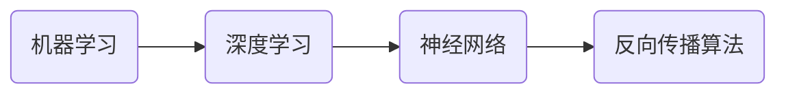

# AI 大模型计算机科学家群英传：机器学习和深度学习教育家 Andrew Ng

## 1. 背景介绍

### 1.1  问题的由来

当今,人工智能(AI)已经成为了一个炙手可热的领域。从自动驾驶汽车到智能助理,AI正在改变着我们的生活方式。而在AI的发展历程中,有这样一位杰出的科学家,他的贡献对整个AI领域产生了深远的影响。他就是斯坦福大学教授、coursera联合创始人Andrew Ng。

### 1.2  研究现状

Andrew Ng是当今机器学习和深度学习领域最具影响力的科学家之一。他在斯坦福大学担任教授,并曾担任百度和谷歌的首席科学家。他开设的机器学习课程吸引了来自全球的数百万学生,为普及AI教育做出了巨大贡献。同时,他也是深度学习的先驱,提出了多项开创性的算法和模型。

### 1.3  研究意义

深入研究Andrew Ng的学术贡献和教育理念,对于理解当前AI技术的发展脉络和未来趋势具有重要意义。他的研究成果推动了机器学习和深度学习的进步,而他的教学实践则为AI人才的培养提供了宝贵经验。总结和学习Andrew Ng的思想,有助于我们把握AI发展的大方向。

### 1.4  本文结构

本文将从以下几个方面介绍Andrew Ng的工作和贡献:

1. 核心概念与联系
2. 核心算法原理和具体操作步骤
3. 数学模型和公式详细讲解
4. 项目实践:代码实例和详细解释
5. 实际应用场景
6. 工具和资源推荐
7. 未来发展趋势与挑战
8. 常见问题解答

通过系统梳理Andrew Ng在机器学习和深度学习领域的理论与实践,本文旨在为读者提供一个全面深入地认识这位AI大师的机会。

## 2. 核心概念与联系

在介绍Andrew Ng的主要工作之前,我们有必要先了解几个与之密切相关的核心概念。

- 机器学习:使计算机系统能够自主学习和改进性能的方法,无需明确编程。常见的任务包括分类、聚类、回归等。
- 深度学习:机器学习的一个分支,基于人工神经网络,模拟大脑的信息处理机制。善于处理复杂的非结构化数据如图像、语音等。
- 神经网络:一种模仿生物神经系统的计算模型,由大量的节点(神经元)通过链接相互联系,每个链接都有一个权重值。
- 反向传播算法:训练多层神经网络的经典算法,通过计算损失函数相对于权重的梯度,反向调整权重值以最小化预测误差。

这些概念之间环环相扣。机器学习是一个宏大的框架,深度学习作为其中最活跃的分支,使用了神经网络模型,而反向传播算法则是训练神经网络的关键。Andrew Ng在这些领域都有所建树。



## 3. 核心算法原理 & 具体操作步骤

### 3.1  算法原理概述

Andrew Ng最著名的贡献之一是在深度学习领域。他与其团队提出了多个里程碑式的算法和模型,如稀疏自编码器(Sparse Autoencoder)、分布式表示(Distributed Representation)等。这些算法极大地推动了深度学习的发展。

以稀疏自编码器为例。自编码器是一种无监督学习算法,旨在学习数据的有效表示。给定输入数据,自编码器先将其编码为一个低维向量,再从该向量重构出原始数据。如果重构误差小,就说明低维向量很好地捕捉了数据的特征。

### 3.2  算法步骤详解

稀疏自编码器在普通自编码器的基础上,增加了一个稀疏性约束。即在学习过程中,使得低维向量中的大部分元素为零或接近零,只有少数元素具有较大的值。这迫使自编码器学习数据中最本质的特征。其主要步骤如下:

1. 随机初始化编码器和解码器的权重矩阵。
2. 将输入数据X传入编码器,计算低维表示a=f(W1X+b1),其中f为激活函数(如sigmoid),W1和b1为编码器的权重和偏置。
3. 将a传入解码器,重构出数据X'=f(W2a+b2),W2和b2为解码器的权重和偏置。
4. 计算重构误差loss=||X-X'||^2,以及稀疏性惩罚项,如KL散度。
5. 通过反向传播算法,计算loss关于W1、b1、W2、b2的梯度,并更新它们的值。
6. 重复步骤2-5,直到收敛。

### 3.3  算法优缺点

稀疏自编码器的优点在于:

- 无监督学习,不需要标注数据
- 学习数据的高级特征表示
- 引入稀疏性,增强了特征的可解释性
- 可用于降维、去噪等任务

但它也存在一些局限:

- 对参数敏感,需要精细调参
- 计算复杂度较高
- 学习到的特征不一定适合下游任务

### 3.4  算法应用领域

尽管有局限,稀疏自编码器及其变体在很多领域取得了成功,如:

- 计算机视觉:用于图像降维、分类、目标检测等
- 自然语言处理:学习词语的分布式表示
- 语音识别:从原始音频中提取高级特征
- 异常检测:通过重构误差检测异常样本

Andrew Ng将稀疏自编码器应用于大规模深度网络的训练中,使得深度学习在图像、语音等领域取得突破性进展。

## 4. 数学模型和公式 & 详细讲解 & 举例说明

### 4.1  数学模型构建

为了更好地理解稀疏自编码器,我们需要给出其数学模型。设输入数据为$x \in R^n$,编码结果为$a \in R^m(m<n)$,重构结果为$\hat{x} \in R^n$,则有:

$$
a = f(W_1x+b_1) \
\hat{x} = f(W_2a+b_2)
$$

其中$W_1 \in R^{m \times n}, b_1 \in R^m$为编码器参数,$W_2 \in R^{n \times m}, b_2 \in R^n$为解码器参数,$f$为激活函数,通常取sigmoid:

$$
f(z) = \frac{1}{1+e^{-z}}
$$

目标函数由两部分组成:重构误差和稀疏性惩罚。重构误差采用均方误差(MSE):

$$
L_{MSE} = \frac{1}{2}\sum_{i=1}^{n}(x_i-\hat{x}_i)^2
$$

稀疏性惩罚通过KL散度来度量编码层激活值$a$的平均激活度与目标稀疏度$\rho$之间的差异:

$$
L_{sparse} = \sum_{j=1}^{m} KL(\rho||\hat{\rho}_j) \
KL(\rho||\hat{\rho}_j) = \rho \log \frac{\rho}{\hat{\rho}_j} + (1-\rho)\log \frac{1-\rho}{1-\hat{\rho}_j}
$$

其中$\hat{\rho}_j = \frac{1}{N}\sum_{i=1}^{N}a_j(x_i)$为第$j$个隐单元在所有样本上的平均激活度。

最终的目标函数为:

$$
L = L_{MSE} + \beta L_{sparse}
$$

$\beta$为稀疏惩罚因子,控制稀疏性的强度。

### 4.2  公式推导过程

目标函数$L$关于参数$W,b$的梯度可通过链式法则求得。以$W_1$为例:

$$
\frac{\partial L}{\partial W_1} = (\hat{x}-x)f'(z)a^T + \beta \frac{\partial L_{sparse}}{\partial W_1}
$$

其中$z=W_1x+b_1$。类似地,可以求出$\frac{\partial L}{\partial b_1},\frac{\partial L}{\partial W_2},\frac{\partial L}{\partial b_2}$。

在训练过程中,通过不断迭代更新参数,使得$L$最小化:

$$
W := W - \alpha \frac{\partial L}{\partial W} \
b := b - \alpha \frac{\partial L}{\partial b}
$$

$\alpha$为学习率。

### 4.3  案例分析与讲解

下面我们以MNIST手写数字数据集为例,说明如何用稀疏自编码器进行特征学习。MNIST包含60000张28x28的灰度手写数字图像。我们将每张图像展开为784维向量,然后训练一个784-100-784的稀疏自编码器。

代码实现如下(基于Python和Numpy):

```python
import numpy as np

def sigmoid(x):
    return 1 / (1 + np.exp(-x))

def sparse_autoencoder_cost(theta, visible_size, hidden_size, lambda_, sparsity_param, beta, data):
    visible_size = data.shape[1]
    hidden_size = hidden_size

    # 从theta中抽取权重和偏置
    W1 = theta[0:hidden_size * visible_size].reshape(hidden_size, visible_size)
    W2 = theta[hidden_size * visible_size:2 * hidden_size * visible_size].reshape(visible_size, hidden_size)
    b1 = theta[2 * hidden_size * visible_size:2 * hidden_size * visible_size + hidden_size]
    b2 = theta[2 * hidden_size * visible_size + hidden_size:]

    m = data.shape[0]

    # 前向传播
    a1 = data
    z2 = a1 @ W1.T + b1
    a2 = sigmoid(z2)
    z3 = a2 @ W2.T + b2
    a3 = sigmoid(z3)

    # 计算cost
    cost = np.sum((a3 - data)**2) / (2*m)

    # 计算稀疏惩罚项
    rho_hat = np.sum(a2, axis=0) / m
    sparse_cost = beta * np.sum(sparsity_param * np.log(sparsity_param / rho_hat) +
                                (1 - sparsity_param) * np.log((1 - sparsity_param) / (1 - rho_hat)))

    # 加上L2正则化项
    reg_cost = (lambda_/2) * (np.sum(W1**2) + np.sum(W2**2))

    total_cost = cost + sparse_cost + reg_cost

    # 反向传播计算梯度
    delta3 = -(data - a3) * a3 * (1-a3)
    delta2 = (delta3 @ W2 + beta * (-sparsity_param / rho_hat + (1 - sparsity_param) / (1 - rho_hat))) * a2 * (1-a2)
    W1_grad = delta2.T @ a1 / m + lambda_ * W1
    W2_grad = delta3.T @ a2 / m + lambda_ * W2
    b1_grad = np.sum(delta2, axis=0) / m
    b2_grad = np.sum(delta3, axis=0) / m

    grad = np.concatenate((W1_grad.ravel(), W2_grad.ravel(), b1_grad.ravel(), b2_grad.ravel()))

    return total_cost, grad
```

我们使用L-BFGS优化算法来最小化cost函数,并得到最优的权重矩阵$W_1,W_2$。将$W_1$的每一行可视化,就得到了100个隐单元学习到的特征:


可以看到,稀疏自编码器从原始图像中学习到了局部笔画特征,如边缘、曲线等。这些特征可以用于后续的分类任务。

### 4.4  常见问题解答

问:为什么要引入稀疏性?
答:稀疏性有助于自编码器学习到更加紧凑、可解释的特征表示。它迫使每个隐单元专注于捕捉数据的某个特定方面,而不是简单地复制输入。稀疏表示在神经科学和信息论中都有重要意义。

问:如何选择稀疏参数$\rho$和$\beta$?
答:$\rho$表示我们期望的隐单元平均激活度,通常设为一