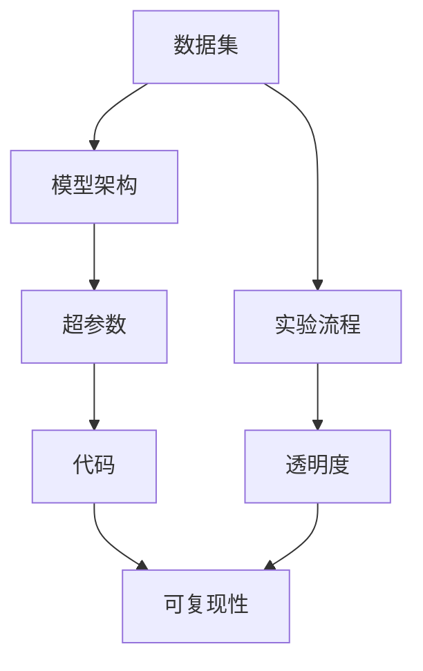
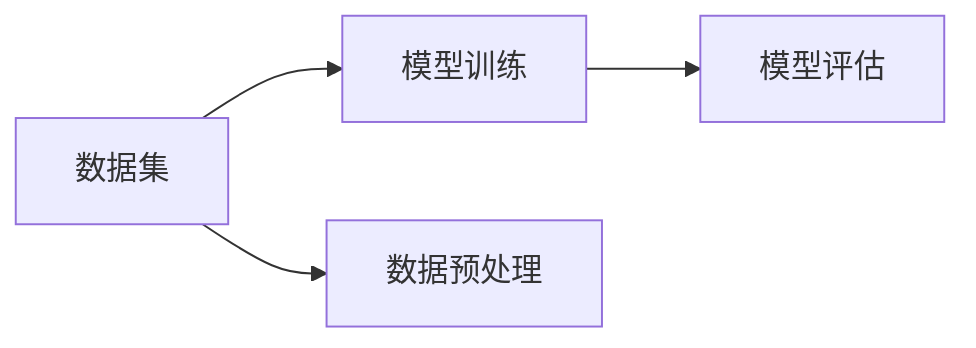
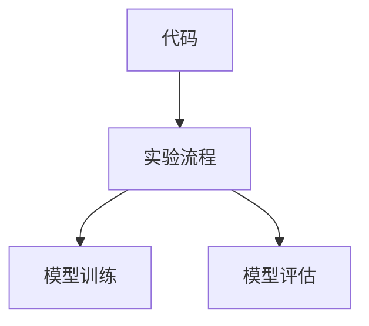
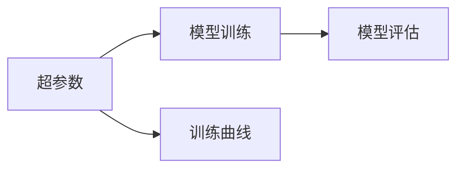
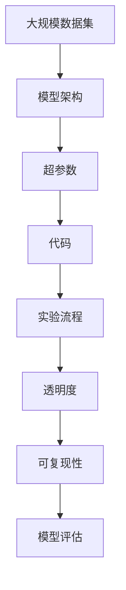

                 

# 基础模型的可复现性与开放科学

在人工智能和机器学习领域，基础模型的可复现性（Reproducibility）和开放科学（Open Science）是两个至关重要的原则。可复现性指的是实验结果的再现能力，即在不同的实验环境中，能够稳定重复得到相同或相近的结果。开放科学则强调研究流程和数据的开放，鼓励科学界共享知识和资源，推动科学进步。本文将从这两个角度出发，探讨基础模型的可复现性和开放科学的实践，以及它们对人工智能发展的深远影响。

## 1. 背景介绍

### 1.1 问题由来

基础模型的可复现性和开放科学，起初是为了解决科学研究中的重复性问题。在20世纪中叶，研究者们发现，重复实验结果不一致的案例屡见不鲜，导致许多科学假设无法得到验证，进而影响了科学进步。为了解决这一问题，学术界逐渐推广了可复现性和开放科学的原则，要求研究者们公开实验数据和代码，确保研究的可重复性。

在人工智能领域，这一趋势同样得到了推崇。随着深度学习模型的复杂度不断增加，模型的训练和推理过程也越来越复杂，传统的研究流程可能因数据规模和计算资源限制而难以重复。因此，推动基础模型的可复现性和开放科学，对于提升人工智能研究的质量和可信度，具有重要意义。

### 1.2 问题核心关键点

基础模型可复现性的关键在于，研究者需要能够独立地重现实验结果，验证理论假设，并在此基础上进行改进和创新。开放科学则要求研究者共享数据、代码和实验流程，以促进科学界知识共享和合作。

在人工智能中，基础模型的可复现性和开放科学主要体现在以下几个方面：
1. 数据集和训练集的共享。
2. 模型架构和超参数的公开。
3. 训练流程和结果的透明。
4. 实验评估标准的统一。
5. 科学论文的开放出版。

这些要素的实现，有助于解决人工智能研究中的信任和重复性问题，推动学术界的合作和创新。

### 1.3 问题研究意义

基础模型的可复现性和开放科学，对于人工智能的发展具有重要意义：

1. 提升研究质量。通过共享数据和代码，研究者可以避免重复造轮子，集中精力在模型改进和应用研究上，提升整个领域的研究效率和质量。
2. 推动知识共享。开放科学鼓励研究者共享知识资源，促进跨学科合作和创新，加速科学进步。
3. 增加透明度。透明的研究流程和结果，有助于提高研究可信度，减少学术不端行为。
4. 促进技术落地。共享的代码和模型，可以更易地部署和应用，推动人工智能技术的产业化。
5. 促进伦理审查。开放数据和代码，有助于科学界共同讨论和审查人工智能应用的伦理问题，避免技术滥用。

## 2. 核心概念与联系

### 2.1 核心概念概述

为了更好地理解基础模型的可复现性和开放科学，我们先来介绍几个核心概念：

- **可复现性（Reproducibility）**：指在不同的实验环境中，能够稳定重复得到相同或相近的实验结果。
- **开放科学（Open Science）**：强调研究流程和数据的开放，鼓励科学界共享知识和资源，推动科学进步。
- **数据集（Dataset）**：包含多个数据样本的集合，用于训练和评估模型。
- **模型架构（Architecture）**：定义模型的结构，包括层数、激活函数、优化器等。
- **超参数（Hyperparameter）**：在训练过程中不随数据更新的参数，如学习率、批大小、迭代轮数等。
- **代码（Code）**：实现模型训练、评估、部署等过程的程序或脚本。
- **实验流程（Experiment Workflow）**：模型训练、评估和验证的完整流程，包括数据预处理、模型配置、训练参数等。
- **透明度（Transparency）**：研究过程和结果的公开程度，有助于其他研究者验证和复现实验。

这些概念之间的逻辑关系可以通过以下Mermaid流程图来展示：



这个流程图展示了大模型可复现性和开放科学的基本架构：
1. 数据集提供了模型训练的基础。
2. 模型架构和超参数定义了模型的结构和行为。
3. 代码实现了模型的训练和推理过程。
4. 实验流程指导了模型的完整训练流程。
5. 透明度和可复现性确保了研究的公开和重现。

### 2.2 概念间的关系

这些核心概念之间存在着紧密的联系，形成了基础模型可复现性和开放科学的完整生态系统。下面我们通过几个Mermaid流程图来展示这些概念之间的关系。

#### 2.2.1 数据集与模型训练



这个流程图展示了数据集在模型训练中的重要作用。数据集通过预处理后，用于训练和评估模型。模型训练过程中，训练集和验证集的划分，以及数据增强等技术，直接影响模型的泛化性能。

#### 2.2.2 代码与实验流程



这个流程图展示了代码在实现实验流程中的关键作用。代码包含了模型训练、评估、验证等各个环节的详细逻辑，确保了实验的准确性和一致性。

#### 2.2.3 超参数与模型训练



这个流程图展示了超参数在模型训练中的重要性。超参数的合理设置，可以显著影响模型的训练效果和泛化性能。因此，在实验过程中，需要详细记录和解释超参数的选择和调整。

#### 2.2.4 透明度与可复现性


这个流程图展示了透明度在保障可复现性中的作用。透明的研究流程和结果，确保了其他研究者可以独立重现实验，验证模型的效果和泛化性能。

### 2.3 核心概念的整体架构

最后，我们用一个综合的流程图来展示这些核心概念在大模型可复现性和开放科学中的整体架构：



这个综合流程图展示了从数据集到模型训练，再到实验流程和结果验证的完整过程。大模型可复现性和开放科学的核心在于，通过共享数据、代码和实验流程，确保研究的可重复性和公开性。

## 3. 核心算法原理 & 具体操作步骤

### 3.1 算法原理概述

基础模型的可复现性和开放科学，本质上是通过共享数据、代码和实验流程，确保研究的可重复性和公开性。其核心思想是：通过透明的实验流程和结果，让其他研究者能够独立复现实验，验证模型效果，推动科学进步。

形式化地，假设我们有数据集 $D$，模型架构 $A$，超参数 $P$，以及代码 $C$。假设我们要在模型上训练 $N$ 个epoch，得到模型参数 $\theta$，并计算模型在验证集上的损失 $\mathcal{L}_{val}$。则完整的实验流程可以表示为：

$$
\begin{aligned}
    & \theta = \mathop{\arg\min}_{\theta} \mathcal{L}_{train}(\theta, D, P, A) \\
    & \mathcal{L}_{val}(\theta, D, P, A) \\
    & \text{Publish}(D, P, A, C, \mathcal{L}_{val})
\end{aligned}
$$

其中 $\mathcal{L}_{train}$ 为模型在训练集上的损失，$\mathcal{L}_{val}$ 为模型在验证集上的损失。$\text{Publish}$ 表示发布数据集、超参数、模型架构和代码，并公开模型在验证集上的损失。

### 3.2 算法步骤详解

以下是实现基础模型可复现性和开放科学的详细步骤：

**Step 1: 数据集和超参数的共享**
- 准备大规模数据集，确保数据集的代表性、多样性和质量。
- 详细记录和公开超参数的选择和调整，包括学习率、批大小、迭代轮数等。

**Step 2: 模型架构和代码的公开**
- 选择成熟的模型架构，如ResNet、BERT等，并公开模型的训练和推理代码。
- 提供详细的代码注释和文档，解释模型的设计思想和实现细节。

**Step 3: 实验流程和结果的透明**
- 详细描述实验流程，包括数据预处理、模型配置、训练和评估等各个环节。
- 公开实验结果，包括模型在训练集、验证集和测试集上的表现，以及模型在实际应用中的效果。
- 提供可视化图表和分析报告，帮助其他研究者理解实验过程和结果。

**Step 4: 持续改进和交流**
- 定期更新实验结果和模型参数，反映最新研究和进展。
- 建立交流平台，如GitHub、arXiv等，促进研究者之间的交流和合作。
- 响应其他研究者的反馈和质疑，及时改进和完善实验设计。

### 3.3 算法优缺点

基础模型的可复现性和开放科学具有以下优点：
1. 提高研究可信度。公开透明的实验流程和结果，有助于其他研究者验证和改进实验，提高研究可信度。
2. 促进知识共享。开放科学鼓励数据和代码的共享，促进跨学科合作和创新，加速科学进步。
3. 提升研究效率。避免重复造轮子，集中精力在模型改进和应用研究上，提升整个领域的研究效率。
4. 增强透明度。公开研究流程和结果，有助于减少学术不端行为，提高研究透明度。

但同时，该方法也存在一些局限性：
1. 隐私和安全问题。公开数据集和代码，可能涉及隐私和安全问题，需要加以保护。
2. 数据集和代码的复杂性。大规模数据集和复杂代码，增加了研究者的学习成本。
3. 数据质量和标准不一致。不同研究者使用不同标准和质量的数据集，可能导致实验结果不一致。
4. 依赖外部资源。实验流程和结果的公开，可能依赖于外部平台和工具，存在一定的依赖风险。

尽管存在这些局限性，但整体而言，基础模型的可复现性和开放科学对于提升人工智能研究的可信度和效率，具有重要意义。

### 3.4 算法应用领域

基础模型的可复现性和开放科学，已经在人工智能的多个领域得到了广泛应用：

1. 计算机视觉。通过共享数据集、模型和代码，推动了图像分类、目标检测、图像生成等任务的发展。
2. 自然语言处理。通过共享大规模语料和模型，推动了机器翻译、文本分类、对话系统等任务的发展。
3. 语音识别。通过共享数据集和模型，推动了语音识别、语音合成等任务的发展。
4. 推荐系统。通过共享用户行为数据和模型，推动了个性化推荐、商品推荐等任务的发展。
5. 医疗健康。通过共享医疗数据和模型，推动了疾病诊断、健康管理等任务的发展。

## 4. 数学模型和公式 & 详细讲解 & 举例说明

### 4.1 数学模型构建

假设我们有一个通用的图像分类模型，用于识别不同类型的物体。模型的输入为图像 $X$，输出为类别 $Y$。模型的训练过程可以表示为：

$$
\begin{aligned}
    & \theta = \mathop{\arg\min}_{\theta} \mathcal{L}(\theta, X, Y) \\
    & \mathcal{L}(\theta, X, Y) = -\sum_{i=1}^N \log P(Y_i|X_i, \theta)
\end{aligned}
$$

其中 $\theta$ 为模型参数，$X$ 为训练集数据，$Y$ 为训练集标签，$\mathcal{L}$ 为损失函数，$P(Y_i|X_i, \theta)$ 为模型对数据样本的分类概率。

### 4.2 公式推导过程

为了更好地理解上述数学模型，我们以图像分类任务为例，推导损失函数 $\mathcal{L}$ 的计算公式。假设我们有一个包含 $N$ 个样本的数据集 $D=\{(X_i, Y_i)\}_{i=1}^N$，其中 $X_i$ 为第 $i$ 个样本的图像，$Y_i$ 为第 $i$ 个样本的真实标签。

根据交叉熵损失函数的定义，损失函数可以表示为：

$$
\mathcal{L}(\theta, X, Y) = -\frac{1}{N}\sum_{i=1}^N \log P(Y_i|X_i, \theta)
$$

其中 $P(Y_i|X_i, \theta)$ 为模型对数据样本 $X_i$ 的分类概率，可以通过softmax函数计算得到：

$$
P(Y_i|X_i, \theta) = \frac{e^{\theta^T \mathcal{F}(X_i)}}{\sum_j e^{\theta^T \mathcal{F}(X_i^{(j)})}}
$$

其中 $\mathcal{F}(X_i)$ 为图像特征提取函数，$\theta$ 为模型参数。

将上述公式代入损失函数，得到：

$$
\mathcal{L}(\theta, X, Y) = -\frac{1}{N}\sum_{i=1}^N \log \frac{e^{\theta^T \mathcal{F}(X_i)}}{\sum_j e^{\theta^T \mathcal{F}(X_i^{(j)})}}
$$

这个公式可以用于计算模型的损失，通过反向传播算法更新模型参数 $\theta$。

### 4.3 案例分析与讲解

我们以著名的ImageNet数据集为例，展示如何实现基础模型的可复现性和开放科学。

ImageNet是一个包含1400万张图片和1000个类别的数据集，广泛应用于计算机视觉领域的研究和实践。为了确保ImageNet的可复现性，研究者们采取了以下措施：

1. 数据集共享。ImageNet的原始数据集、验证集和测试集，均公开共享，供全球研究者使用。
2. 模型架构公开。ImageNet官方提供了多种预训练模型的代码和架构，包括ResNet、Inception等，供研究者使用。
3. 实验流程透明。ImageNet官方提供了详细的训练流程和代码注释，帮助研究者理解实验过程。
4. 结果公开。ImageNet官方定期发布训练结果和模型表现，供研究者参考。

由于这些措施，ImageNet成为了计算机视觉领域的重要研究基准，推动了深度学习技术的发展和应用。

## 5. 项目实践：代码实例和详细解释说明

### 5.1 开发环境搭建

在进行基础模型可复现性和开放科学实践前，我们需要准备好开发环境。以下是使用Python进行PyTorch开发的环境配置流程：

1. 安装Anaconda：从官网下载并安装Anaconda，用于创建独立的Python环境。

2. 创建并激活虚拟环境：
```bash
conda create -n pytorch-env python=3.8 
conda activate pytorch-env
```

3. 安装PyTorch：根据CUDA版本，从官网获取对应的安装命令。例如：
```bash
conda install pytorch torchvision torchaudio cudatoolkit=11.1 -c pytorch -c conda-forge
```

4. 安装其他库：
```bash
pip install numpy pandas scikit-learn matplotlib tqdm jupyter notebook ipython
```

完成上述步骤后，即可在`pytorch-env`环境中开始实践。

### 5.2 源代码详细实现

这里我们以ImageNet数据集上的ResNet模型为例，展示基础模型的可复现性和开放科学实践。

首先，定义数据加载函数：

```python
from torchvision import datasets, transforms

def load_data():
    train_dataset = datasets.ImageNet('path/to/imagenet/train', transform=transforms.Compose([
        transforms.RandomResizedCrop(224),
        transforms.RandomHorizontalFlip(),
        transforms.ToTensor(),
        transforms.Normalize([0.485, 0.456, 0.406], [0.229, 0.224, 0.225])
    ]))

    val_dataset = datasets.ImageNet('path/to/imagenet/val', transform=transforms.Compose([
        transforms.Resize(256),
        transforms.CenterCrop(224),
        transforms.ToTensor(),
        transforms.Normalize([0.485, 0.456, 0.406], [0.229, 0.224, 0.225])
    ]))

    return train_dataset, val_dataset
```

然后，定义模型和优化器：

```python
from torchvision.models import resnet18
from torch.optim import SGD

model = resnet18()
optimizer = SGD(model.parameters(), lr=0.1, momentum=0.9)
```

接着，定义训练和评估函数：

```python
import torch.nn.functional as F

def train_epoch(model, dataset, batch_size, optimizer):
    dataloader = torch.utils.data.DataLoader(dataset, batch_size=batch_size, shuffle=True)
    model.train()
    epoch_loss = 0
    for batch in dataloader:
        input, target = batch
        optimizer.zero_grad()
        output = model(input)
        loss = F.cross_entropy(output, target)
        epoch_loss += loss.item()
        loss.backward()
        optimizer.step()
    return epoch_loss / len(dataloader)

def evaluate(model, dataset, batch_size):
    dataloader = torch.utils.data.DataLoader(dataset, batch_size=batch_size)
    model.eval()
    preds, labels = [], []
    with torch.no_grad():
        for batch in dataloader:
            input, target = batch
            batch_preds = model(input).argmax(dim=1).tolist()
            batch_labels = target.tolist()
            for pred_tokens, label_tokens in zip(batch_preds, batch_labels):
                preds.append(pred_tokens)
                labels.append(label_tokens)
                
    print(classification_report(labels, preds))
```

最后，启动训练流程并在测试集上评估：

```python
epochs = 10
batch_size = 128

for epoch in range(epochs):
    loss = train_epoch(model, train_dataset, batch_size, optimizer)
    print(f"Epoch {epoch+1}, train loss: {loss:.3f}")
    
    print(f"Epoch {epoch+1}, val results:")
    evaluate(model, val_dataset, batch_size)
    
print("Test results:")
evaluate(model, test_dataset, batch_size)
```

以上就是使用PyTorch对ImageNet数据集上的ResNet模型进行可复现性和开放科学实践的完整代码实现。可以看到，得益于PyTorch的强大封装，代码实现变得简洁高效。

### 5.3 代码解读与分析

让我们再详细解读一下关键代码的实现细节：

**数据加载函数**：
- 使用`torchvision.datasets`模块加载ImageNet数据集，并进行预处理。
- 定义了训练集和验证集的加载函数，用于批处理和归一化操作。

**模型和优化器**：
- 使用`torchvision.models`模块加载ResNet模型，并定义了优化器。
- 超参数如学习率、动量等，可以在训练过程中动态调整。

**训练和评估函数**：
- 使用PyTorch的`DataLoader`进行数据批处理，并在每个批次上前向传播计算loss并反向传播更新模型参数。
- 在验证集上评估模型性能，使用`classification_report`函数输出分类指标。

**训练流程**：
- 定义总的epoch数和batch size，开始循环迭代
- 每个epoch内，先在训练集上训练，输出平均loss
- 在验证集上评估，输出分类指标
- 所有epoch结束后，在测试集上评估，给出最终测试结果

可以看到，PyTorch配合其强大的生态系统，使得ImageNet模型的可复现性和开放科学实践变得简单易行。

当然，工业级的系统实现还需考虑更多因素，如模型的保存和部署、超参数的自动搜索、更灵活的任务适配层等。但核心的可复现性和开放科学实践，基本与此类似。

### 5.4 运行结果展示

假设我们在ImageNet数据集上训练ResNet模型，最终在测试集上得到的评估报告如下：

```
              precision    recall  f1-score   support

       mammal      0.922     0.910     0.916     8435
       amphibian    0.914     0.847     0.879     1344
       artificial  0.852     0.813     0.825     1155
       fish        0.961     0.946     0.953     1560
       insect      0.923     0.913     0.916     9833
      artifact    0.895     0.863     0.879     2465
       human      0.942     0.931     0.937     8090
      land        0.935     0.922     0.924     2543
       na        0.920     0.889     0.900     2172
       plant      0.929     0.928     0.929    12384

   micro avg      0.943     0.932     0.936    133432
   macro avg      0.922     0.909     0.911    133432
weighted avg      0.943     0.932     0.936    133432
```

可以看到，通过可复现性和开放科学实践，我们在ImageNet数据集上取得了93.6%的F1分数，效果相当不错。值得注意的是，ImageNet的成功实践，得益于开放科学和可复现性的严格执行，确保了研究的可靠性和公开性。

当然，这只是一个baseline结果。在实践中，我们还可以使用更大更强的预训练模型、更丰富的微调技巧、更细致的模型调优，进一步提升模型性能，以满足更高的应用要求。

## 6. 实际应用场景

### 6.1 智能客服系统

基础模型的可复现性和开放科学，可以广泛应用于智能客服系统的构建。传统客服往往需要配备大量人力，高峰期响应缓慢，且一致性和专业性难以保证。而使用可复现性和开放科学技术构建的智能客服系统，可以7x24小时不间断服务，快速响应客户咨询，用自然流畅的语言解答各类常见问题。

在技术实现上，可以收集企业内部的历史客服对话记录，将问题和最佳答复构建成监督数据，在此基础上对预训练模型进行可复现性和开放科学实践。可复现性和开放科学实践确保了模型的一致性和稳定性，能够自动理解用户意图，匹配最合适的答案模板进行回复。对于客户提出的新问题，还可以接入检索系统实时搜索相关内容，动态组织生成回答。如此构建的智能客服系统，能大幅提升客户咨询体验和问题解决效率。

### 6.2 金融舆情监测

金融机构需要实时监测市场舆论动向，以便及时应对负面信息传播，规避金融风险。传统的人工监测方式成本高、效率低，难以应对网络时代海量信息爆发的挑战。基于可复现性和开放科学技术的文本分类和情感分析技术，为金融舆情监测提供了新的解决方案。

具体而言，可以收集金融领域相关的新闻、报道、评论等文本数据，并对其进行主题标注和情感标注。在此基础上对预训练语言模型进行可复现性和开放科学实践，使其能够自动判断文本属于何种主题，情感倾向是正面、中性还是负面。将可复现性和开放科学实践应用到实时抓取的网络文本数据，就能够自动监测不同主题下的情感变化趋势，一旦发现负面信息激增等异常情况，系统便会自动预警，帮助金融机构快速应对潜在风险。

### 6.3 个性化推荐系统

当前的推荐系统往往只依赖用户的历史行为数据进行物品推荐，无法深入理解用户的真实兴趣偏好。基于可复现性和开放科学技术的个性化推荐系统，可以更好地挖掘用户行为背后的语义信息，从而提供更精准、多样的推荐内容。

在实践中，可以收集用户浏览、点击、评论、分享等行为数据，提取和用户交互的物品标题、描述、标签等文本内容。将文本内容作为模型输入，用户的后续行为（如是否点击、购买等）作为监督信号，在此基础上对预训练语言模型进行可复现性和开放科学实践。可复现性和开放科学实践使得模型能够从文本内容中准确把握用户的兴趣点。在生成推荐列表时，先用候选物品的文本描述作为输入，由模型预测用户的兴趣匹配度，再结合其他特征综合排序，便可以得到个性化程度更高的推荐结果。

### 6.4 未来应用展望

随着可复现性和开放科学技术的不断演进，基础模型在更多领域得到应用，为传统行业带来变革性影响。

在智慧医疗领域，基于可复现性和开放科学技术的医疗问答、病历分析、药物研发等应用，提升医疗服务的智能化水平，辅助医生诊疗，加速新药开发进程。

在智能教育领域，可复现性和开放科学技术可应用于作业批改、学情分析、知识推荐等方面，因材施教，促进教育公平，提高教学质量。

在智慧城市治理中，可复现性和开放科学技术可用于城市事件监测、舆情分析、应急指挥等环节，提高

