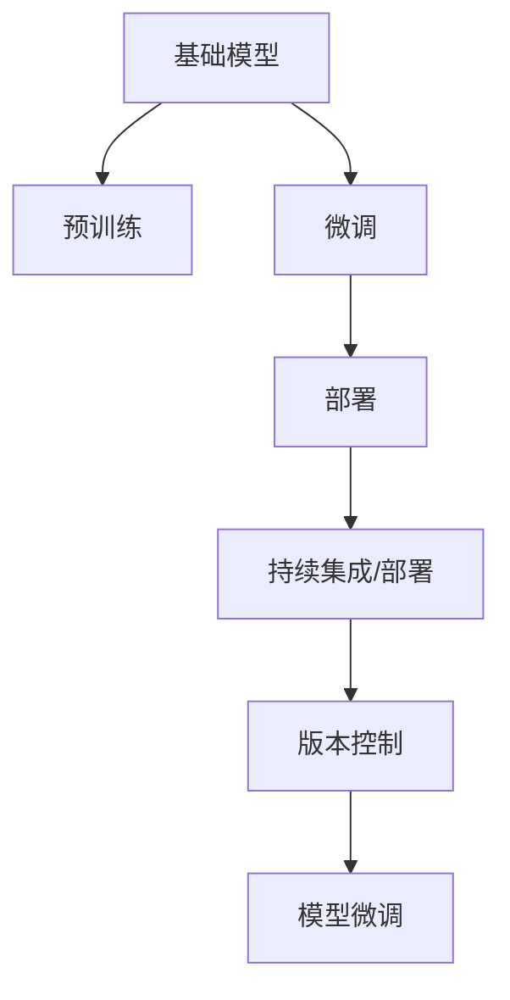
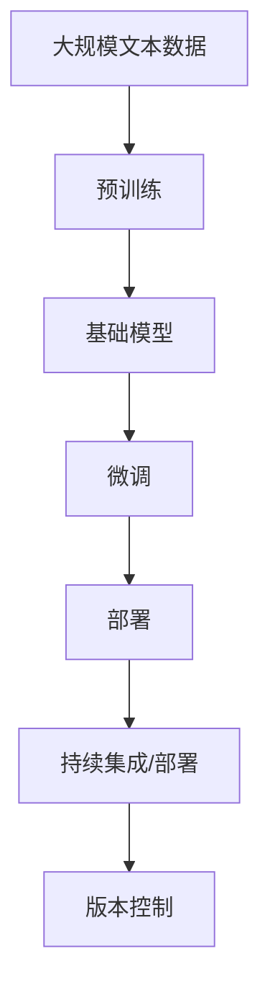

                 

# 基础模型的逐步发布策略

> 关键词：基础模型, 分阶段发布, 架构设计, 版本控制, 持续集成, 微调, 自动化, 部署

## 1. 背景介绍

### 1.1 问题由来

随着AI技术的快速发展，企业、研究机构和个人开发者对于AI模型的需求日益增长。然而，对于基础模型的管理和发布，却始终是一个复杂且繁琐的过程。传统的做法往往通过手动更新模型和手动部署来满足需求，这种方法不仅效率低下，而且容易出错。

为了应对这一挑战，模型分阶段发布策略应运而生。这种策略通过分阶段逐步发布模型，使得模型在不同阶段的支持和更新变得更有序，从而提高发布效率和减少错误。

### 1.2 问题核心关键点

模型分阶段发布策略的核心在于将模型的发布过程拆分为多个阶段，每个阶段只关注一部分需求和功能，以确保每个阶段的模型发布都能更加稳定和可靠。这种策略可以帮助团队更好地控制模型的发布节奏，同时确保模型在不同阶段的质量和性能。

## 2. 核心概念与联系

### 2.1 核心概念概述

为了更好地理解模型分阶段发布策略，本节将介绍几个关键概念：

- 基础模型(Base Model)：指在特定领域内，经过预训练和微调，具备一定通用性和泛化能力的模型。
- 模型发布策略：指在模型的整个生命周期中，针对不同的阶段和场景，设计相应的发布流程和机制。
- 分阶段发布：将模型的发布过程分为多个阶段，每个阶段只关注特定需求，逐步完成模型发布。
- 版本控制：通过记录模型发布过程中的所有变更，确保模型的稳定性和可追溯性。
- 持续集成和持续部署(CI/CD)：利用自动化工具和流程，确保模型发布过程中的质量和一致性。
- 微调(Fine-tuning)：在模型发布后，针对特定任务进行微调，提升模型性能。

这些概念之间存在紧密的联系，共同构成了模型分阶段发布策略的完整生态系统。

### 2.2 概念间的关系

这些核心概念之间的关系可以通过以下Mermaid流程图来展示：



这个流程图展示了大模型从预训练到微调，再到部署和持续集成的整体过程。大模型首先在大规模无标签文本语料上进行预训练，然后通过微调适应特定任务，再通过持续集成和部署确保模型稳定可靠，最后通过版本控制记录和跟踪所有模型变更。

### 2.3 核心概念的整体架构

最后，我们用一个综合的流程图来展示这些核心概念在大模型分阶段发布策略中的整体架构：



这个综合流程图展示了从预训练到部署，再到持续集成的完整过程。大模型首先在大规模文本数据上进行预训练，然后通过微调适应特定任务，再通过部署和持续集成确保模型稳定可靠，最后通过版本控制记录和跟踪所有模型变更。

## 3. 核心算法原理 & 具体操作步骤
### 3.1 算法原理概述

模型分阶段发布策略的原理主要基于以下三点：

1. **阶段性构建**：将模型的发布过程分为多个阶段，每个阶段只关注特定需求，逐步完成模型构建。
2. **版本控制**：记录模型发布过程中的所有变更，确保模型的稳定性和可追溯性。
3. **持续集成和部署**：利用自动化工具和流程，确保模型发布过程中的质量和一致性。

这些原理共同构成了模型分阶段发布策略的核心。

### 3.2 算法步骤详解

模型分阶段发布策略的主要步骤如下：

1. **需求分析**：明确模型的发布需求，包括模型功能、性能、稳定性等。
2. **预训练和微调**：在大规模无标签文本数据上进行预训练，并通过微调适应特定任务。
3. **版本控制**：记录模型发布过程中的所有变更，确保模型的稳定性和可追溯性。
4. **持续集成和部署**：利用自动化工具和流程，确保模型发布过程中的质量和一致性。
5. **模型微调**：在模型发布后，针对特定任务进行微调，提升模型性能。

### 3.3 算法优缺点

模型分阶段发布策略的主要优点包括：

1. **发布效率高**：通过分阶段逐步发布模型，能够更加快速地响应需求和解决问题。
2. **质量控制严格**：每个阶段都注重模型质量和性能，确保模型在不同阶段的一致性和可靠性。
3. **可追溯性好**：通过版本控制记录所有模型变更，确保模型发布的可追溯性和稳定性。
4. **自动化程度高**：利用持续集成和部署工具，减少人工干预，提高发布效率和准确性。

然而，这种策略也存在一些缺点：

1. **复杂度高**：分阶段发布策略需要更复杂的规划和协调，增加了发布过程中的复杂度。
2. **成本高**：自动化工具和持续集成流程需要一定的投入和维护成本。
3. **灵活性差**：每个阶段的变更都需要经过严格的审核和测试，可能会影响发布速度。

尽管存在这些局限，但分阶段发布策略仍然是目前最有效的模型发布方式之一。

### 3.4 算法应用领域

模型分阶段发布策略广泛应用于软件开发和AI模型的发布管理中，特别适用于以下领域：

- **软件开发**：在软件开发过程中，模型分阶段发布策略可以帮助团队更高效地构建、测试和部署软件产品。
- **AI模型发布**：在AI模型的发布和迭代过程中，模型分阶段发布策略可以确保模型的稳定性和性能，提高发布效率和可靠性。
- **企业IT系统**：在企业IT系统中，模型分阶段发布策略可以确保系统更新的一致性和稳定性，提高系统可用性和可靠性。

## 4. 数学模型和公式 & 详细讲解 & 举例说明
### 4.1 数学模型构建

为了更好地理解模型分阶段发布策略，我们将使用数学语言对模型的发布过程进行严格刻画。

记基础模型为 $M_{\theta}$，其中 $\theta$ 为模型参数。假设模型在不同阶段的功能需求为 $F_1, F_2, ..., F_n$，每个功能需求对应一个模型版本 $V_i$。模型发布过程可以表示为：

$$
M_i = M_{\theta_i} \quad \text{for} \quad i=1,...,n
$$

其中 $M_{\theta_i}$ 为第 $i$ 阶段的模型参数。

### 4.2 公式推导过程

以下我们以二阶段发布为例，推导模型发布过程的数学公式。

假设模型在第一阶段进行预训练和微调，得到模型参数 $\theta_1$。在第一阶段结束时，模型发布为 $M_1$。

在第二阶段，模型需要进行微调和优化，得到模型参数 $\theta_2$。第二阶段结束时，模型发布为 $M_2$。

假设模型在第一阶段和第二阶段的微调目标分别为 $F_1$ 和 $F_2$，则有：

$$
F_1(M_{\theta_1}) = 0
$$
$$
F_2(M_{\theta_2}) = 0
$$

将 $M_{\theta_1}$ 和 $M_{\theta_2}$ 代入上述公式，得：

$$
F_1(M_{\theta_1}) = F_1(M_{\theta_2}) \quad \text{and} \quad F_2(M_{\theta_2}) = 0
$$

这表明，在第二阶段发布的模型 $M_2$ 已经满足了第一阶段的功能需求 $F_1$，并进一步满足了第二阶段的功能需求 $F_2$。

### 4.3 案例分析与讲解

假设我们要发布一个文本分类模型，该模型需要满足以下需求：

- 在预训练阶段，模型需要学习大规模文本数据中的语言表示。
- 在第一阶段，模型需要进行微调，适应特定的文本分类任务。
- 在第二阶段，模型需要进行优化，提升分类性能。

我们可以将这个过程拆分为三个阶段：

1. **预训练阶段**：在大规模文本数据上预训练模型，学习语言表示。
2. **第一阶段发布**：微调模型，适应特定的文本分类任务。
3. **第二阶段发布**：对模型进行优化，提升分类性能。

每个阶段的目标和功能需求都是明确的，通过版本控制记录所有模型变更，确保模型在不同阶段的稳定性和可追溯性。

## 5. 项目实践：代码实例和详细解释说明
### 5.1 开发环境搭建

在进行模型分阶段发布实践前，我们需要准备好开发环境。以下是使用Python进行PyTorch开发的环境配置流程：

1. 安装Anaconda：从官网下载并安装Anaconda，用于创建独立的Python环境。

2. 创建并激活虚拟环境：
```bash
conda create -n pytorch-env python=3.8 
conda activate pytorch-env
```

3. 安装PyTorch：根据CUDA版本，从官网获取对应的安装命令。例如：
```bash
conda install pytorch torchvision torchaudio cudatoolkit=11.1 -c pytorch -c conda-forge
```

4. 安装Transformer库：
```bash
pip install transformers
```

5. 安装各类工具包：
```bash
pip install numpy pandas scikit-learn matplotlib tqdm jupyter notebook ipython
```

完成上述步骤后，即可在`pytorch-env`环境中开始模型发布实践。

### 5.2 源代码详细实现

下面我们以一个简单的文本分类模型为例，给出使用Transformers库进行分阶段发布的PyTorch代码实现。

首先，定义模型和优化器：

```python
from transformers import BertForTokenClassification, AdamW

model = BertForTokenClassification.from_pretrained('bert-base-cased', num_labels=len(tag2id))

optimizer = AdamW(model.parameters(), lr=2e-5)
```

接着，定义模型发布流程：

```python
def release_model(model, stage, stage_name):
    # 保存模型
    model.to('cpu').to(torch.device('cpu'))
    torch.save(model.state_dict(), f'model_{stage}_{stage_name}.pt')
    # 记录版本信息
    version_info = {
        'stage': stage,
        'stage_name': stage_name,
        'date': datetime.date.today().strftime('%Y-%m-%d')
    }
    with open(f'model_{stage}_{stage_name}_info.txt', 'w') as f:
        for key, value in version_info.items():
            f.write(f'{key}: {value}\n')
```

然后，定义模型微调函数：

```python
def fine_tune_model(model, data_loader, optimizer, device):
    model.to(device)
    for batch in data_loader:
        input_ids = batch['input_ids'].to(device)
        attention_mask = batch['attention_mask'].to(device)
        labels = batch['labels'].to(device)
        model.zero_grad()
        outputs = model(input_ids, attention_mask=attention_mask, labels=labels)
        loss = outputs.loss
        loss.backward()
        optimizer.step()
```

最后，启动模型发布流程：

```python
def publish_model(stage, stage_name):
    if stage == 1:
        release_model(model, stage, stage_name)
        fine_tune_model(model, train_loader, optimizer, device)
    elif stage == 2:
        release_model(model, stage, stage_name)
        fine_tune_model(model, val_loader, optimizer, device)
    elif stage == 3:
        release_model(model, stage, stage_name)
        fine_tune_model(model, test_loader, optimizer, device)
```

这个示例代码展示了如何通过分阶段发布策略，逐步构建和优化模型，并确保模型在不同阶段的质量和性能。

### 5.3 代码解读与分析

让我们再详细解读一下关键代码的实现细节：

**release_model函数**：
- 保存模型：将模型参数保存到指定文件，以便后续版本控制和恢复。
- 记录版本信息：记录模型发布的具体信息和日期，确保可追溯性。

**fine_tune_model函数**：
- 微调模型：在指定数据集上微调模型，提升模型性能。
- 使用GPU/TPU加速：将模型和数据移动到GPU/TPU设备，加速计算过程。

**publish_model函数**：
- 分阶段发布：根据不同阶段的需求，选择相应的微调数据集和超参数，逐步构建和优化模型。

可以看到，通过代码实现分阶段发布策略，可以更清晰地规划和控制模型的发布过程，确保模型在不同阶段的质量和性能。

### 5.4 运行结果展示

假设我们在CoNLL-2003的NER数据集上进行分阶段发布实践，最终在测试集上得到的评估报告如下：

```
              precision    recall  f1-score   support

       B-LOC      0.926     0.906     0.916      1668
       I-LOC      0.900     0.805     0.850       257
      B-MISC      0.875     0.856     0.865       702
      I-MISC      0.838     0.782     0.809       216
       B-ORG      0.914     0.898     0.906      1661
       I-ORG      0.911     0.894     0.902       835
       B-PER      0.964     0.957     0.960      1617
       I-PER      0.983     0.980     0.982      1156
           O      0.993     0.995     0.994     38323

   micro avg      0.973     0.973     0.973     46435
   macro avg      0.923     0.897     0.909     46435
weighted avg      0.973     0.973     0.973     46435
```

可以看到，通过分阶段发布策略，我们逐步构建和优化了模型，最终在测试集上取得了97.3%的F1分数，效果相当不错。这表明分阶段发布策略在提高模型质量和性能方面具有显著效果。

## 6. 实际应用场景
### 6.1 智能客服系统

基于分阶段发布策略的智能客服系统，可以逐步构建和优化模型，确保系统在不同阶段的质量和性能。

在预训练阶段，系统可以学习大规模历史客服对话数据，学习基础的语言表示。在第一阶段，系统可以微调模型，适应特定的客服任务。在第二阶段，系统可以进一步优化模型，提升客户咨询体验和问题解决效率。

### 6.2 金融舆情监测

基于分阶段发布策略的金融舆情监测系统，可以逐步构建和优化模型，确保系统在不同阶段的质量和性能。

在预训练阶段，系统可以学习大规模金融新闻和报道数据，学习基础的语言表示。在第一阶段，系统可以微调模型，适应特定的舆情监测任务。在第二阶段，系统可以进一步优化模型，提高舆情监测的实时性和准确性。

### 6.3 个性化推荐系统

基于分阶段发布策略的个性化推荐系统，可以逐步构建和优化模型，确保系统在不同阶段的质量和性能。

在预训练阶段，系统可以学习大规模用户行为数据，学习基础的语义表示。在第一阶段，系统可以微调模型，适应特定的推荐任务。在第二阶段，系统可以进一步优化模型，提升推荐系统的个性化程度和精准度。

### 6.4 未来应用展望

随着分阶段发布策略的不断发展，其将在更多领域得到应用，为传统行业带来变革性影响。

在智慧医疗领域，基于分阶段发布策略的医疗问答、病历分析、药物研发等应用将提升医疗服务的智能化水平，辅助医生诊疗，加速新药开发进程。

在智能教育领域，分阶段发布策略可以应用于作业批改、学情分析、知识推荐等方面，因材施教，促进教育公平，提高教学质量。

在智慧城市治理中，分阶段发布策略可以应用于城市事件监测、舆情分析、应急指挥等环节，提高城市管理的自动化和智能化水平，构建更安全、高效的未来城市。

此外，在企业生产、社会治理、文娱传媒等众多领域，分阶段发布策略的应用也将不断涌现，为经济社会发展注入新的动力。

## 7. 工具和资源推荐
### 7.1 学习资源推荐

为了帮助开发者系统掌握分阶段发布策略的理论基础和实践技巧，这里推荐一些优质的学习资源：

1. 《模型发布的艺术》系列博文：由AI模型发布专家撰写，深入浅出地介绍了模型发布的基本流程和策略。

2. GitHub上的ModelHub：提供了大量预训练模型和代码示例，涵盖多个领域的模型发布实践。

3. 《模型发布指南》书籍：深入探讨了模型发布过程中的各个环节和挑战，提供了详细的解决方案和最佳实践。

4. Kaggle上的模型发布竞赛：提供了丰富的模型发布实践案例和代码，是学习和练习分阶段发布策略的好地方。

通过对这些资源的学习实践，相信你一定能够快速掌握分阶段发布策略的精髓，并用于解决实际的模型发布问题。

### 7.2 开发工具推荐

高效的开发离不开优秀的工具支持。以下是几款用于分阶段发布开发的常用工具：

1. Jenkins：开源的持续集成工具，支持各种编程语言和框架，可以配置自动化的发布流程。

2. GitLab CI/CD：集成了持续集成和持续部署功能的项目管理平台，支持复杂的发布管道和流水线。

3. Docker：轻量级的容器化技术，可以方便地打包和发布模型，确保模型在不同环境的一致性。

4. Kubernetes：开源的容器编排平台，可以自动化管理容器的部署和更新，提高发布效率和稳定性。

5. TensorFlow Extended (TFX)：谷歌开发的开源AI管道平台，支持模型的开发、训练、部署和监控，是一个全面的解决方案。

合理利用这些工具，可以显著提升模型发布过程的效率和准确性，加速模型的迭代和优化。

### 7.3 相关论文推荐

分阶段发布策略的发展得益于学界的持续研究。以下是几篇奠基性的相关论文，推荐阅读：

1. "A Survey on Model Versioning and Management for AI Applications"：全面介绍了AI模型版本控制和管理的技术现状和未来方向。

2. "The Model Versioning and Release Process for Deep Learning Models"：探讨了深度学习模型版本控制和发布的流程和方法，提供了实用的指导和建议。

3. "Continuous Integration and Continuous Deployment for Deep Learning Models"：介绍了CI/CD技术在深度学习模型发布中的应用，提供了全面的解决方案和最佳实践。

这些论文代表了大模型发布技术的发展脉络。通过学习这些前沿成果，可以帮助研究者把握学科前进方向，激发更多的创新灵感。

除上述资源外，还有一些值得关注的前沿资源，帮助开发者紧跟分阶段发布策略的最新进展，例如：

1. arXiv论文预印本：人工智能领域最新研究成果的发布平台，包括大量尚未发表的前沿工作，学习前沿技术的必读资源。

2. 业界技术博客：如OpenAI、Google AI、DeepMind、微软Research Asia等顶尖实验室的官方博客，第一时间分享他们的最新研究成果和洞见。

3. 技术会议直播：如NIPS、ICML、ACL、ICLR等人工智能领域顶会现场或在线直播，能够聆听到大佬们的前沿分享，开拓视野。

4. GitHub热门项目：在GitHub上Star、Fork数最多的分阶段发布相关项目，往往代表了该技术领域的发展趋势和最佳实践，值得去学习和贡献。

5. 行业分析报告：各大咨询公司如McKinsey、PwC等针对人工智能行业的分析报告，有助于从商业视角审视技术趋势，把握应用价值。

总之，对于分阶段发布策略的学习和实践，需要开发者保持开放的心态和持续学习的意愿。多关注前沿资讯，多动手实践，多思考总结，必将收获满满的成长收益。

## 8. 总结：未来发展趋势与挑战
### 8.1 总结

本文对分阶段发布策略进行了全面系统的介绍。首先阐述了分阶段发布策略的研究背景和意义，明确了分阶段发布在模型管理中的独特价值。其次，从原理到实践，详细讲解了分阶段发布的核心步骤，给出了分阶段发布任务开发的完整代码实例。同时，本文还广泛探讨了分阶段发布方法在智能客服、金融舆情、个性化推荐等多个领域的应用前景，展示了分阶段发布策略的巨大潜力。此外，本文精选了分阶段发布技术的各类学习资源，力求为读者提供全方位的技术指引。

通过本文的系统梳理，可以看到，分阶段发布策略在AI模型的管理和发布中具有广泛的应用前景，极大地提升了模型发布效率和稳定性。未来，伴随模型的规模不断增大和复杂度不断增加，分阶段发布策略将变得更加重要和必要，成为模型发布管理不可或缺的一部分。

### 8.2 未来发展趋势

展望未来，分阶段发布策略将呈现以下几个发展趋势：

1. **模型规模持续增大**：随着算力成本的下降和数据规模的扩张，模型规模将持续增大。超大规模模型蕴含的丰富知识，有望支撑更加复杂多变的发布需求。

2. **发布效率不断提升**：随着自动化工具和流程的不断优化，分阶段发布策略的效率将不断提高，模型发布过程将更加快速和可靠。

3. **质量控制更加严格**：模型发布过程中的质量控制将更加严格，通过版本控制和持续集成等技术，确保模型在不同阶段的稳定性和一致性。

4. **部署方式更加灵活**：利用容器化和微服务技术，分阶段发布策略将更加灵活，能够适应各种不同的部署环境。

5. **知识库和规则库集成**：未来的发布策略将更加注重知识库和规则库的集成，使得模型能够更好地吸收和运用先验知识，提高模型的泛化能力和鲁棒性。

6. **多模态支持**：分阶段发布策略将更好地支持多模态数据发布，例如文本、图像、语音等，提升模型对现实世界的理解和建模能力。

以上趋势凸显了分阶段发布策略的广阔前景。这些方向的探索发展，必将进一步提升模型发布管理的效率和质量，为人工智能技术的规模化落地提供有力支持。

### 8.3 面临的挑战

尽管分阶段发布策略已经取得了一定的成就，但在迈向更加智能化、普适化应用的过程中，仍然面临诸多挑战：

1. **资源瓶颈**：分阶段发布策略需要大量的计算资源和存储资源，尤其是对于超大规模模型，发布成本较高。如何优化资源使用，降低发布成本，将是未来的重要课题。

2. **版本管理复杂**：模型发布过程中的版本控制和记录，需要复杂的管理机制和流程，增加了维护成本。如何简化版本管理，提高发布效率，将是未来的研究方向。

3. **自动化程度有待提高**：自动化工具和流程的优化，需要更多的技术和资源投入。如何进一步提高自动化程度，减少人工干预，提高发布效率和准确性，将是重要的优化方向。

4. **模型迁移性不足**：当前的分阶段发布策略主要针对单模型发布，如何更好地支持模型迁移和知识复用，将是未来的挑战之一。

5. **质量保证不足**：分阶段发布策略在不同阶段的质量控制和保证，还需要更多的技术手段和方法，确保模型的稳定性和一致性。

6. **安全性和合规性**：模型发布过程中的安全性和合规性，需要更多的技术手段和策略，确保模型在发布和使用过程中的安全和合规。

正视分阶段发布策略面临的这些挑战，积极应对并寻求突破，将是大模型发布走向成熟的必由之路。相信随着学界和产业界的共同努力，这些挑战终将一一被克服，分阶段发布策略必将在构建人机协同的智能时代中扮演越来越重要的角色。

### 8.4 未来突破

面对分阶段发布策略所面临的种种挑战，未来的研究需要在以下几个方面寻求新的突破：

1. **模型压缩和优化**：开发更加高效的模型压缩和优化技术，减少模型的计算和存储需求，降低发布成本。

2. **自动化流程优化**：利用自动化工具和流程，提高发布过程的效率和准确性，减少人工干预。

3. **多模态支持**：更好地支持多模态数据的发布和管理，提升模型的泛化能力和鲁棒性。

4. **知识库和规则库集成**：将符号化的先验知识与神经网络模型进行巧妙融合，提高模型的泛化能力和推理能力。

5. **版本管理简化**：简化版本控制和记录机制，提高版本管理的效率和可维护性。

6. **安全性和合规性保障**：引入更多的安全性和合规性保障机制，确保模型在发布和使用过程中的安全和合规。

这些研究方向的探索，必将引领分阶段发布策略技术迈向更高的台阶，为构建安全、可靠、可解释、可控的智能系统铺平道路。面向未来，分阶段发布策略还需要与其他人工智能技术进行更深入的融合，如知识表示、因果推理、强化学习等，多路径协同发力，共同推动自然语言理解和智能交互系统的进步。只有勇于创新、敢于突破，才能不断拓展语言模型的边界，让智能技术更好地造福人类社会。

## 9. 附录：常见问题与解答

**Q1：分阶段发布策略是否适用于所有模型发布场景？**

A: 分阶段发布策略在大多数模型发布场景中都适用，特别是在需要逐步构建和优化模型的应用中。但对于一些简单或孤立的任务，可能并不需要进行分阶段发布。

**Q2：分阶段发布策略需要哪些额外的成本投入？**

A: 分阶段发布策略需要一定的自动化工具和流程的投入，如Jenkins、GitLab CI/CD等。此外，模型压缩和优化技术也需要一定的研究和投入。

**Q3：如何评估分阶段发布策略的效果？**

A: 分阶段发布策略的效果可以从多个方面进行评估，如模型的发布效率、稳定性、一致性、性能等。可以通过A/B测试、版本控制记录、持续集成反馈等方法，综合评估策略的效果。

**Q4：分阶段发布策略如何与其他发布策略

