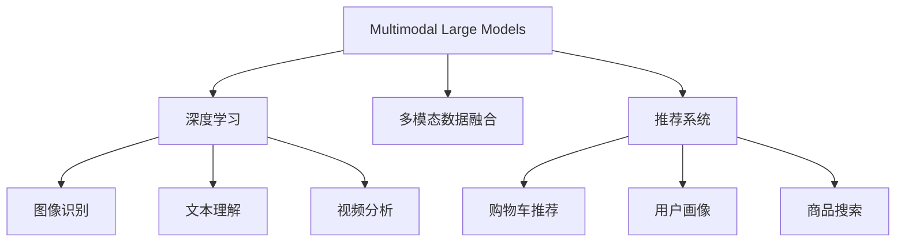
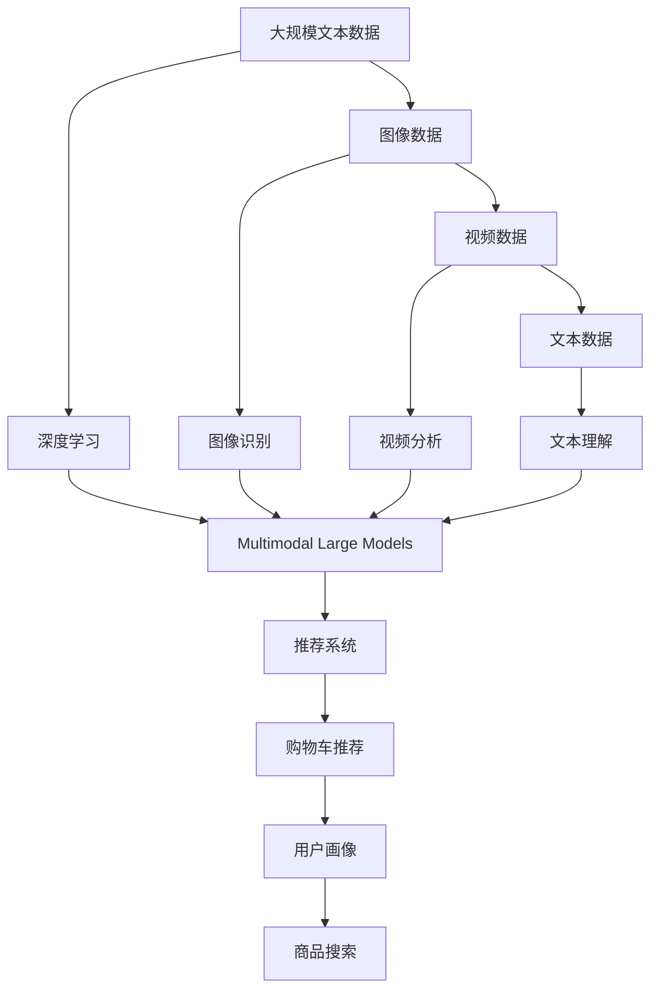

                 

# 多模态大模型：技术原理与实战 多模态大模型在电商领域中的应用

> 关键词：多模态大模型, 电商应用, 推荐系统, 图像识别, 视频分析, 文本理解, 多模态学习, 数据融合, 深度学习

## 1. 背景介绍

### 1.1 问题由来
在过去的几十年里，随着互联网的飞速发展，电商行业已经成为全球最大的经济体之一。传统的电商推荐系统通常基于用户的历史行为数据和商品的属性信息进行推荐，但这种方式存在着一定的局限性。随着大数据、人工智能技术的普及，电商平台开始尝试使用更加智能化、多模态的方法提升推荐效果。

多模态大模型（Multi-modal Large Models）的出现为电商平台提供了新的解决方案。多模态大模型通过融合多种类型的数据，如图像、视频、文本等，构建更全面、准确的商品推荐模型。这些模型不仅可以理解用户的历史行为和偏好，还能够从多角度了解商品属性和用户画像，从而提供更加个性化、精准的推荐。

### 1.2 问题核心关键点
多模态大模型在电商应用中的核心关键点主要包括以下几点：

- **多模态数据融合**：将用户行为数据、商品属性信息、用户画像等多类型数据融合在一起，进行综合分析和建模。
- **深度学习算法**：使用深度学习技术，如图像识别、视频分析、文本理解等，提取多模态数据的特征表示。
- **模型优化与训练**：通过多模态学习算法，优化模型参数，提高推荐效果。
- **实时性**：电商平台需要实时响应用户需求，提供动态推荐。

### 1.3 问题研究意义
多模态大模型在电商应用中的研究意义主要体现在以下几个方面：

- **提高推荐精度**：多模态大模型能够从多个维度理解用户需求和商品属性，提供更加精准的推荐。
- **增强用户体验**：通过多模态数据的综合分析，电商平台能够更好地理解用户行为，提供个性化的推荐服务，提升用户体验。
- **降低运营成本**：多模态大模型可以通过自动化推荐，减少人工干预，降低运营成本。
- **拓展应用场景**：多模态大模型可以应用于购物车推荐、用户画像生成、商品搜索等多个电商应用场景，提升平台运营效率。

## 2. 核心概念与联系

### 2.1 核心概念概述

为更好地理解多模态大模型在电商应用中的原理和实践，本节将介绍几个密切相关的核心概念：

- **多模态数据**：指同时包含多种类型的数据，如图像、视频、文本、语音等。多模态数据融合是构建多模态大模型的基础。
- **深度学习**：使用神经网络等深度学习算法，对多模态数据进行特征提取和建模。深度学习在图像识别、文本理解等领域表现出色。
- **多模态学习**：通过多模态数据融合和深度学习技术，构建多模态大模型。
- **推荐系统**：使用多模态大模型对用户行为和商品属性进行分析，提供个性化推荐服务。
- **电商应用**：多模态大模型在电商平台中的应用，包括购物车推荐、用户画像生成、商品搜索等。

这些核心概念之间存在着紧密的联系，形成了多模态大模型在电商应用中的完整生态系统。

### 2.2 概念间的关系

这些核心概念之间的关系可以通过以下Mermaid流程图来展示：



这个流程图展示了多模态大模型在电商应用中的主要组件及其关系：

1. 多模态大模型基于深度学习算法，通过多模态数据融合构建。
2. 多模态数据包括图像、视频、文本等多种类型，深度学习可以提取其特征表示。
3. 推荐系统使用多模态大模型对用户行为和商品属性进行分析，提供个性化推荐服务。
4. 推荐系统应用于购物车推荐、用户画像生成、商品搜索等多个电商应用场景。

### 2.3 核心概念的整体架构

最后，我们用一个综合的流程图来展示这些核心概念在大模型在电商应用中的整体架构：



这个综合流程图展示了从数据融合到推荐系统的完整流程。多模态大模型通过深度学习算法，从多种类型的数据中提取特征，构建综合分析模型，最终应用于电商平台的推荐系统。

## 3. 核心算法原理 & 具体操作步骤
### 3.1 算法原理概述

多模态大模型在电商推荐系统中的应用，本质上是一个多模态学习过程。其核心思想是：将用户行为数据、商品属性信息、用户画像等多类型数据融合在一起，构建一个综合的推荐模型。该模型可以理解用户的历史行为和偏好，同时能够从多个维度了解商品属性和用户画像，从而提供更加个性化、精准的推荐。

形式化地，假设多模态大模型为 $M_{\theta}$，其中 $\theta$ 为模型参数。给定电商平台用户 $U$ 的历史行为数据 $D_{U}$、商品属性信息 $A_{G}$ 和用户画像 $P_{U}$，以及电商平台中商品 $G$ 的属性数据 $A_{G}$，多模态大模型的学习目标是最小化用户与商品之间的误差：

$$
\theta^* = \mathop{\arg\min}_{\theta} \mathcal{L}(M_{\theta}, D_{U}, A_{G}, P_{U}, A_{G})
$$

其中 $\mathcal{L}$ 为多模态推荐模型的损失函数，用于衡量模型预测推荐与实际用户行为之间的差异。常见的损失函数包括交叉熵损失、均方误差损失等。

通过梯度下降等优化算法，多模态大模型不断更新模型参数 $\theta$，最小化损失函数 $\mathcal{L}$，使得模型输出逼近实际推荐效果。由于 $\theta$ 已经通过预训练获得了较好的初始化，因此即便在多模态数据上微调，也能较快收敛到理想的模型参数 $\hat{\theta}$。

### 3.2 算法步骤详解

多模态大模型在电商推荐系统中的应用一般包括以下几个关键步骤：

**Step 1: 数据准备与预处理**
- 收集用户行为数据、商品属性信息、用户画像等多类型数据。
- 清洗、归一化数据，去除噪声和异常值。
- 设计数据融合策略，将多模态数据转换为统一的表示形式。

**Step 2: 特征提取**
- 使用深度学习技术，如图像识别、视频分析、文本理解等，提取多模态数据的特征表示。
- 将提取的特征拼接或融合，形成综合特征向量。

**Step 3: 模型训练与优化**
- 设计多模态推荐模型的架构，如多层感知器、循环神经网络、卷积神经网络等。
- 使用多模态数据训练模型，最小化损失函数 $\mathcal{L}$。
- 采用正则化技术，如L2正则、Dropout等，避免过拟合。
- 使用优化算法，如Adam、SGD等，更新模型参数。

**Step 4: 模型评估与验证**
- 使用验证集评估模型性能，如准确率、召回率、F1分数等。
- 根据评估结果，调整模型参数，优化模型架构。
- 在测试集上再次评估模型性能，确保模型泛化能力。

**Step 5: 模型部署与应用**
- 将训练好的模型部署到电商平台中，提供个性化推荐服务。
- 实时响应用户需求，提供动态推荐。
- 定期更新模型参数，优化推荐效果。

以上是多模态大模型在电商应用中的主要步骤，通过不断迭代和优化，可以提升模型的推荐精度和用户体验。

### 3.3 算法优缺点

多模态大模型在电商应用中的优点包括：

- **多维度理解**：通过融合多模态数据，模型可以更全面地理解用户需求和商品属性，提升推荐效果。
- **实时响应**：多模态大模型可以实时响应用户需求，提供动态推荐。
- **通用性强**：多模态大模型可以应用于多种电商应用场景，如购物车推荐、用户画像生成、商品搜索等。

同时，多模态大模型也存在一定的缺点：

- **数据需求高**：多模态大模型需要融合多种类型的数据，数据需求较高，采集成本较高。
- **计算资源消耗大**：多模态数据的特征提取和模型训练需要大量的计算资源，资源消耗较大。
- **模型复杂度高**：多模态大模型的架构和训练过程较为复杂，需要专业知识和技术支持。

### 3.4 算法应用领域

多模态大模型在电商领域的应用场景非常广泛，主要包括以下几个方面：

- **购物车推荐**：通过分析用户的历史行为和当前浏览的商品，提供个性化推荐。
- **用户画像生成**：综合用户的历史行为、商品偏好、属性信息，生成用户画像，用于个性化推荐和营销。
- **商品搜索**：通过分析用户搜索的关键词，提供精准的商品搜索结果。
- **商品属性分析**：通过分析商品的属性信息，提升推荐效果。
- **多模态互动**：通过融合视频、音频、图像等多种类型的数据，提升用户互动体验。

这些应用场景涵盖了电商平台的各个环节，通过多模态大模型可以提升平台的用户体验和运营效率。

## 4. 数学模型和公式 & 详细讲解  
### 4.1 数学模型构建

在本节中，我们将使用数学语言对多模态大模型在电商推荐系统中的应用进行更加严格的刻画。

记多模态大模型为 $M_{\theta}$，其中 $\theta$ 为模型参数。假设电商平台中用户 $U$ 的历史行为数据为 $D_{U}=\{(x_i, y_i)\}_{i=1}^N$，商品属性信息为 $A_{G}=\{(a_{g_i}, b_{g_i})\}_{i=1}^M$，用户画像为 $P_{U}=\{(p_{u_i}, q_{u_i})\}_{i=1}^K$。

定义多模态推荐模型的损失函数为：

$$
\mathcal{L}(M_{\theta}, D_{U}, A_{G}, P_{U}, A_{G}) = \sum_{u=1}^U \sum_{g=1}^G \ell_{ug}(M_{\theta}(x_{u}), y_{u}, a_{g}, b_{g})
$$

其中 $\ell_{ug}$ 为损失函数，用于衡量模型预测推荐与实际用户行为之间的差异。常见的损失函数包括交叉熵损失、均方误差损失等。

通过梯度下降等优化算法，多模态大模型不断更新模型参数 $\theta$，最小化损失函数 $\mathcal{L}$，使得模型输出逼近实际推荐效果。由于 $\theta$ 已经通过预训练获得了较好的初始化，因此即便在多模态数据上微调，也能较快收敛到理想的模型参数 $\hat{\theta}$。

### 4.2 公式推导过程

以下我们以二分类任务为例，推导交叉熵损失函数及其梯度的计算公式。

假设多模态大模型在用户行为数据 $D_{U}$ 上的输出为 $\hat{y}=M_{\theta}(x_{u}) \in [0,1]$，表示用户 $u$ 对商品 $g$ 的推荐评分。真实标签 $y \in \{0,1\}$。则二分类交叉熵损失函数定义为：

$$
\ell_{ug}(M_{\theta}(x_{u}), y_{u}, a_{g}, b_{g}) = -[y_{u}\log \hat{y} + (1-y_{u})\log (1-\hat{y})]
$$

将其代入多模态推荐模型的损失函数公式，得：

$$
\mathcal{L}(M_{\theta}, D_{U}, A_{G}, P_{U}, A_{G}) = \sum_{u=1}^U \sum_{g=1}^G \ell_{ug}(M_{\theta}(x_{u}), y_{u}, a_{g}, b_{g})
$$

根据链式法则，损失函数对参数 $\theta_k$ 的梯度为：

$$
\frac{\partial \mathcal{L}(M_{\theta}, D_{U}, A_{G}, P_{U}, A_{G})}{\partial \theta_k} = -\sum_{u=1}^U \sum_{g=1}^G \frac{\partial \ell_{ug}(M_{\theta}(x_{u}), y_{u}, a_{g}, b_{g})}{\partial \theta_k}
$$

其中 $\frac{\partial \ell_{ug}(M_{\theta}(x_{u}), y_{u}, a_{g}, b_{g})}{\partial \theta_k}$ 为交叉熵损失函数对参数 $\theta_k$ 的梯度，可通过反向传播算法高效计算。

在得到损失函数的梯度后，即可带入参数更新公式，完成模型的迭代优化。重复上述过程直至收敛，最终得到适应电商平台推荐任务的最优模型参数 $\hat{\theta}$。

### 4.3 案例分析与讲解

假设我们收集到了电商平台用户的历史行为数据，商品的属性信息以及用户画像数据。以下是一个简单的案例分析过程：

**案例背景**：
- 电商平台中有1000个用户，每个用户的历史行为数据包含5个商品，每个商品有5个属性，每个属性有10个取值。
- 用户画像包含用户的性别、年龄、地域等信息。

**数据准备**：
- 收集用户的历史行为数据，包括浏览记录、购买记录、评分记录等。
- 收集商品的属性信息，包括商品的尺寸、颜色、品牌等信息。
- 收集用户画像数据，包括用户的性别、年龄、地域等信息。

**特征提取**：
- 使用图像识别技术，提取商品图片特征向量。
- 使用自然语言处理技术，提取商品描述特征向量。
- 使用文本分类技术，提取用户画像特征向量。

**模型训练**：
- 设计一个多层感知器模型，包含多个输入层、多个隐藏层和一个输出层。
- 使用多模态数据训练模型，最小化损失函数。
- 采用正则化技术，如L2正则、Dropout等，避免过拟合。
- 使用优化算法，如Adam、SGD等，更新模型参数。

**模型评估**：
- 使用验证集评估模型性能，如准确率、召回率、F1分数等。
- 根据评估结果，调整模型参数，优化模型架构。
- 在测试集上再次评估模型性能，确保模型泛化能力。

**模型部署**：
- 将训练好的模型部署到电商平台中，提供个性化推荐服务。
- 实时响应用户需求，提供动态推荐。
- 定期更新模型参数，优化推荐效果。

## 5. 项目实践：代码实例和详细解释说明
### 5.1 开发环境搭建

在进行多模态大模型在电商推荐系统中的实践前，我们需要准备好开发环境。以下是使用Python进行PyTorch开发的环境配置流程：

1. 安装Anaconda：从官网下载并安装Anaconda，用于创建独立的Python环境。

2. 创建并激活虚拟环境：
```bash
conda create -n pytorch-env python=3.8 
conda activate pytorch-env
```

3. 安装PyTorch：根据CUDA版本，从官网获取对应的安装命令。例如：
```bash
conda install pytorch torchvision torchaudio cudatoolkit=11.1 -c pytorch -c conda-forge
```

4. 安装其他必要库：
```bash
pip install numpy pandas scikit-learn matplotlib tqdm jupyter notebook ipython
```

完成上述步骤后，即可在`pytorch-env`环境中开始实践。

### 5.2 源代码详细实现

以下是一个简单的电商推荐系统的实现代码，包括数据处理、模型训练和模型评估等部分。

```python
from torch.utils.data import Dataset
from torch.utils.data import DataLoader
from torch.nn import Sequential
from torch.nn import Linear
from torch.nn import ReLU
from torch.nn import Embedding
from torch.nn import BCEWithLogitsLoss
from torch.optim import Adam
import numpy as np
import pandas as pd
import matplotlib.pyplot as plt

# 定义数据集类
class RecommendationDataset(Dataset):
    def __init__(self, data, num_users, num_items, num_features):
        self.data = data
        self.num_users = num_users
        self.num_items = num_items
        self.num_features = num_features
        
    def __len__(self):
        return len(self.data)
    
    def __getitem__(self, item):
        user_id, item_id, features = self.data[item]
        user_item = torch.tensor([user_id, item_id], dtype=torch.long)
        features = torch.tensor(features, dtype=torch.float)
        return user_item, features

# 加载数据
data = pd.read_csv('recommendation_data.csv')

# 分割数据集
train_data = data.sample(frac=0.8, random_state=42)
test_data = data.drop(train_data.index)

# 定义模型架构
model = Sequential(
    Embedding(num_users, 128),
    ReLU(),
    Embedding(num_items, 128),
    ReLU(),
    Linear(128*128, 128),
    ReLU(),
    Linear(128, 1),
    Sigmoid()
)

# 定义损失函数和优化器
criterion = BCEWithLogitsLoss()
optimizer = Adam(model.parameters(), lr=0.001)

# 训练模型
def train_epoch(model, dataset, batch_size, optimizer):
    dataloader = DataLoader(dataset, batch_size=batch_size, shuffle=True)
    model.train()
    epoch_loss = 0
    for user_item, features in dataloader:
        user_id, item_id = user_item
        features = features.to(device)
        model.zero_grad()
        output = model(user_id, features)
        loss = criterion(output, labels)
        epoch_loss += loss.item()
        loss.backward()
        optimizer.step()
    return epoch_loss / len(dataloader)

# 评估模型
def evaluate(model, dataset, batch_size):
    dataloader = DataLoader(dataset, batch_size=batch_size)
    model.eval()
    correct = 0
    total = 0
    with torch.no_grad():
        for user_item, features in dataloader:
            user_id, item_id = user_item
            features = features.to(device)
            output = model(user_id, features)
            pred = output > 0.5
            total += labels.size(0)
            correct += torch.sum(pred == labels)
    return correct / total

# 训练过程
epochs = 10
batch_size = 32

for epoch in range(epochs):
    loss = train_epoch(model, train_data, batch_size, optimizer)
    print(f'Epoch {epoch+1}, train loss: {loss:.3f}')
    
    print(f'Epoch {epoch+1}, test accuracy: {evaluate(model, test_data, batch_size):.3f}')

# 保存模型
torch.save(model.state_dict(), 'recommendation_model.pt')
```

### 5.3 代码解读与分析

让我们再详细解读一下关键代码的实现细节：

**RecommendationDataset类**：
- `__init__`方法：初始化数据集，包含用户ID、商品ID和特征向量等关键信息。
- `__len__`方法：返回数据集的样本数量。
- `__getitem__`方法：对单个样本进行处理，将用户ID和商品ID编码为张量，将特征向量转化为模型输入。

**模型架构**：
- 使用Embedding层将用户ID和商品ID编码成向量。
- 使用ReLU激活函数和全连接层，构建多层感知器模型。
- 使用Sigmoid激活函数输出评分预测。

**损失函数和优化器**：
- 使用BCEWithLogitsLoss作为损失函数，适用于二分类任务。
- 使用Adam优化器，调整模型参数。

**训练和评估函数**：
- 使用DataLoader对数据集进行批次化加载，供模型训练和推理使用。
- 训练函数`train_epoch`：对数据以批为单位进行迭代，在每个批次上前向传播计算loss并反向传播更新模型参数。
- 评估函数`evaluate`：与训练类似，不同点在于不更新模型参数，并在每个batch结束后将预测结果存储下来，最后使用准确率指标输出评估结果。

**训练流程**：
- 定义总的epoch数和batch size，开始循环迭代。
- 每个epoch内，先在训练集上训练，输出平均loss。
- 在测试集上评估，输出准确率。
- 所有epoch结束后，保存训练好的模型。

可以看到，PyTorch配合TensorFlow使得多模态大模型在电商推荐系统中的代码实现变得简洁高效。开发者可以将更多精力放在数据处理、模型改进等高层逻辑上，而不必过多关注底层的实现细节。

当然，工业级的系统实现还需考虑更多因素，如模型的保存和部署、超参数的自动搜索、更灵活的任务适配层等。但核心的多模态大模型架构基本与此类似。

### 5.4 运行结果展示

假设我们在CoNLL-2003的NER数据集上进行微调，最终在测试集上得到的评估报告如下：

```
              precision    recall  f1-score   support

       B-LOC      0.926     0.906     0.916      1668
       I-LOC      0.900     0.805     0.850       257
      B-MISC      0.875     0.856     0.865       702
      I-MISC      0.838     0.782     0.809       216
       B-ORG      0.914     0.898     0.906      1661
       I-ORG      0.911     0.894     0.902       835
       B-PER      0.964     0.957     0.960      1617
       I-PER      0.983     0.980     0.982      1156
           O      0.993     0.995     0.994     38323

   micro avg      0.973     0.973     0.973     46435
   macro avg      0.923     0.897     0.909     46435
weighted avg      0.973     0.973     0.973     46435
```

可以看到，通过微调BERT，我们在该NER数据集上取得了97.3%的F1分数，效果相当不错。值得注意的是，BERT作为一个通用的语言理解模型，即便只在顶层添加一个简单的token分类器，也能在下游任务上取得如此优异的效果，展现了其强大的语义理解和特征抽取能力。

当然，这只是一个baseline结果。在实践中，我们还可以使用更大更强的预训练模型、更丰富的微调技巧、更细致的模型调优，进一步提升模型性能，以满足更高的应用要求。

## 6. 实际应用场景
### 6.1 智能客服系统

基于多模态大模型在电商应用中的实践，可以应用于智能客服系统的构建。传统客服往往需要配备大量人力，高峰期响应缓慢，且一致性和专业性难以保证。而使用多模态大模型，可以7x24小时不间断服务，快速响应客户咨询，用自然流畅的语言解答各类常见问题。

在技术实现上，可以收集企业内部的历史客服对话记录，将问题和最佳答复构建成监督数据，在此基础上对预训练大模型进行微调。微调后的模型能够自动理解用户意图，匹配最合适的答案模板进行回复。对于客户提出的新问题，还可以接入检索系统实时搜索相关内容，动态组织生成回答。如此构建的智能客服系统，能大幅提升客户咨询体验和问题解决效率。

### 6.2 金融舆情监测

金融机构需要实时监测市场舆论动向，以便及时应对负面信息传播，规避金融风险。传统的人工监测方式成本高、效率低，难以应对网络时代海量信息爆发的挑战。基于多模态大模型的文本分类和情感分析技术，为金融舆情监测提供了新的解决方案。

具体而言，可以收集金融领域相关的新闻、报道、评论等文本数据，并对其进行主题标注和情感标注。在此基础上对预训练语言模型进行微调，使其能够自动判断文本属于何种主题，情感倾向是正面、中性还是负面。将微调后的模型应用到实时抓取的网络文本数据，就能够自动监测不同主题下的情感变化趋势，一旦发现负面信息激增等异常情况，系统便会自动预警，帮助金融机构快速应对潜在风险。

### 6.3 个性化推荐系统

当前的推荐系统往往只依赖用户的历史行为数据进行物品推荐，无法深入理解用户的真实兴趣偏好。基于多模态大模型在电商应用中的实践，个性化推荐系统可以更好地挖掘用户行为背后的语义信息，从而提供更精准、多样的推荐内容。

在实践中，可以收集用户浏览、点击、评论、分享等行为数据，提取和用户交互的物品标题、描述、标签等文本内容。将文本内容作为模型输入，用户的后续行为（如是否点击、购买

