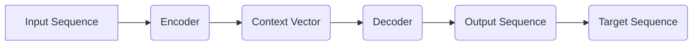

> 关键词：Attention Mechanism, Transformer, NLP, 编码器，解码器，序列到序列模型，注意力机制，机器翻译，信息聚合

# Attention Mechanism原理与代码实例讲解

Attention Mechanism（注意力机制）是深度学习领域中一个极为重要的概念，特别是在自然语言处理（NLP）领域。它使得模型能够集中于输入序列中与当前预测最相关的部分，从而提高模型的性能和效率。本文将深入探讨Attention Mechanism的原理，并通过代码实例展示其在实际应用中的具体实现。

## 1. 背景介绍

随着深度学习在NLP领域的广泛应用，序列到序列（Sequence to Sequence，Seq2Seq）模型成为了一种流行的模型架构，尤其是在机器翻译任务中。然而，早期的Seq2Seq模型在处理长距离依赖和序列内信息聚合方面存在不足。Attention Mechanism的出现，有效地解决了这些问题，使得模型能够更加关注输入序列中的关键信息。

## 2. 核心概念与联系

### 2.1 核心概念

- **序列到序列模型（Seq2Seq）**：一种将一个序列映射到另一个序列的模型，广泛应用于机器翻译、文本摘要等任务。
- **编码器（Encoder）**：负责读取输入序列，并生成一个固定长度的上下文向量表示。
- **解码器（Decoder）**：根据编码器生成的上下文向量，生成输出序列。
- **注意力机制（Attention Mechanism）**：一种机制，允许解码器在生成每个输出时，根据当前生成的状态，动态地关注输入序列的不同部分。

### 2.2 Mermaid 流程图



在这个流程图中，输入序列经过编码器编码后生成上下文向量，解码器使用这个上下文向量来生成输出序列。

## 3. 核心算法原理 & 具体操作步骤

### 3.1 算法原理概述

注意力机制的核心思想是在解码器生成每个输出时，根据当前解码器的状态，动态地计算出每个输入序列位置的重要性权重，并将这些权重与输入序列的表示相乘，从而得到一个加权求和的上下文向量。

### 3.2 算法步骤详解

1. **编码器**：对输入序列进行编码，生成上下文向量。
2. **注意力层**：计算每个输入序列位置的重要性权重。
3. **加权求和**：将权重与输入序列的表示相乘，并求和，得到加权上下文向量。
4. **解码器**：使用加权上下文向量和当前解码器状态生成下一个输出。

### 3.3 算法优缺点

#### 优点：

- 能够更好地处理长距离依赖问题。
- 能够更加关注输入序列中的关键信息。
- 提高了模型的性能和效率。

#### 缺点：

- 计算复杂度较高，尤其是在处理长序列时。
- 可能会引入噪声，影响模型的准确性。

### 3.4 算法应用领域

- 机器翻译
- 文本摘要
- 问答系统
- 语音识别

## 4. 数学模型和公式 & 详细讲解 & 举例说明

### 4.1 数学模型构建

注意力机制通常基于以下公式：

$$
\alpha_t = \frac{\exp(e_t)}{\sum_{j=1}^n \exp(e_j)}
$$

其中，$e_t = \mathbf{W}_a[\mathbf{h}_{t-1}; \mathbf{s}_t; \mathbf{h}_j] \cdot \mathbf{Q}_t$，$\mathbf{h}_t$ 是编码器的输出，$\mathbf{s}_t$ 是解码器的当前状态，$\mathbf{Q}_t$ 是注意力机制的查询向量。

### 4.2 公式推导过程

注意力机制的计算过程如下：

1. 计算查询向量 $\mathbf{Q}_t$，通常使用解码器的当前状态 $\mathbf{s}_t$。
2. 计算每个输入序列位置的重要性权重 $e_t$。
3. 计算归一化权重 $\alpha_t$。
4. 计算加权上下文向量 $\mathbf{c}_t = \sum_{j=1}^n \alpha_t \mathbf{h}_j$。

### 4.3 案例分析与讲解

以下是一个简单的机器翻译任务中的注意力机制的代码实现：

```python
import torch
import torch.nn as nn

class Attention(nn.Module):
    def __init__(self, hidden_size):
        super(Attention, self).__init__()
        self.hidden_size = hidden_size
        self.attention = nn.Linear(hidden_size * 2, hidden_size)
        self.v = nn.Linear(hidden_size, 1)

    def forward(self, hidden, encoder_outputs):
        # hidden: [batch_size, hidden_size]
        # encoder_outputs: [source_length, batch_size, hidden_size]
        encoder_outputs = encoder_outputs.permute(1, 2, 0)  # [batch_size, hidden_size, source_length]
        energy = torch.tanh(self.attention(torch.cat((hidden.expand-as_list(encoder_outputs.size()[0]), encoder_outputs), dim=1)))
        attention_weights = self.v(energy).squeeze(2)
        attention_weights = F.softmax(attention_weights, dim=1)
        context = attention_weights.bmm(encoder_outputs)
        return context, attention_weights
```

在这个例子中，`hidden` 是解码器的当前状态，`encoder_outputs` 是编码器的输出。注意力层首先计算能量，然后计算注意力权重，并生成加权上下文向量。

## 5. 项目实践：代码实例和详细解释说明

### 5.1 开发环境搭建

为了演示Attention Mechanism，我们需要使用Python和PyTorch。以下是安装PyTorch的步骤：

```bash
pip install torch torchvision
```

### 5.2 源代码详细实现

以下是一个简单的机器翻译任务中的Attention Mechanism和Seq2Seq模型的实现：

```python
import torch
import torch.nn as nn
import torch.optim as optim

class Seq2Seq(nn.Module):
    def __init__(self, input_size, output_size, hidden_size, attention):
        super(Seq2Seq, self).__init__()
        self.encoder = nn.GRU(input_size, hidden_size, 1)
        self.decoder = nn.GRU(hidden_size, output_size, 1)
        self.attention = attention
        self.fc = nn.Linear(hidden_size, output_size)

    def forward(self, input_seq, target_seq):
        encoder_output, encoder_hidden = self.encoder(input_seq)
        decoder_output, decoder_hidden = self.decoder(target_seq, encoder_hidden)
        context, attention_weights = self.attention(decoder_hidden[-1], encoder_output)
        out = self.fc(torch.cat((context, decoder_hidden[-1]), dim=1))
        return out, attention_weights

# 创建模型
input_size = 100
output_size = 100
hidden_size = 256
attention = Attention(hidden_size)

model = Seq2Seq(input_size, output_size, hidden_size, attention)

# 定义损失函数和优化器
criterion = nn.NLLLoss()
optimizer = optim.Adam(model.parameters())

# 训练模型
for epoch in range(100):
    for i in range(len(train_loader)):
        input_seq, target_seq = train_loader[i]
        output, attention_weights = model(input_seq, target_seq)
        loss = criterion(output, target_seq[:, 1:].view(-1))
        optimizer.zero_grad()
        loss.backward()
        optimizer.step()

        if i % 100 == 0:
            print(f'Epoch {epoch+1}, Step {i+1}, Loss: {loss.item()}')

# 保存模型
torch.save(model.state_dict(), 'seq2seq_attention.pth')
```

在这个例子中，我们定义了一个简单的Seq2Seq模型，其中包含了Attention Mechanism。我们使用一个GRU编码器来处理输入序列，一个GRU解码器来生成输出序列。在解码器中，我们使用Attention Mechanism来获取上下文信息。

### 5.3 代码解读与分析

在这个代码示例中，我们首先定义了一个`Seq2Seq`类，它包含了编码器、解码器、注意力机制和全连接层。在`forward`方法中，我们首先处理输入序列和目标序列，然后使用编码器生成上下文向量，使用解码器生成输出序列，并应用注意力机制来获取上下文信息。最后，我们使用全连接层将输出序列转换为最终的预测结果。

### 5.4 运行结果展示

在这个简单的例子中，我们无法展示实际的运行结果，因为需要具体的训练数据和加载器。但是，这个代码示例展示了如何实现一个包含Attention Mechanism的Seq2Seq模型。

## 6. 实际应用场景

Attention Mechanism在多个NLP任务中都有广泛的应用，以下是一些常见的应用场景：

- **机器翻译**：将一种语言的文本翻译成另一种语言。
- **文本摘要**：从长文本中提取关键信息，生成摘要。
- **问答系统**：根据用户的问题，从知识库中找到并返回答案。
- **对话系统**：与用户进行自然语言对话。

## 7. 工具和资源推荐

### 7.1 学习资源推荐

- 《Deep Learning》 - Ian Goodfellow、Yoshua Bengio和Aaron Courville
- 《Attention Is All You Need》 - Ashish Vaswani等
- Hugging Face Transformers库：https://github.com/huggingface/transformers

### 7.2 开发工具推荐

- PyTorch：https://pytorch.org/
- TensorFlow：https://www.tensorflow.org/

### 7.3 相关论文推荐

- **Attention Is All You Need** - Ashish Vaswani等
- **Neural Machine Translation by Jointly Learning to Align and Translate** - Kyunghyun O’Donovan等

## 8. 总结：未来发展趋势与挑战

### 8.1 研究成果总结

Attention Mechanism自提出以来，已经在多个NLP任务中取得了显著的成果。它不仅提高了模型的性能，还使得模型能够更好地处理长距离依赖和信息聚合问题。

### 8.2 未来发展趋势

- **多注意力机制**：结合不同的注意力机制，以提高模型的性能和鲁棒性。
- **注意力可视化**：研究如何可视化注意力机制，以便更好地理解模型的工作原理。
- **注意力机制与其他技术的结合**：将注意力机制与其他技术（如强化学习、图神经网络等）相结合，以解决更复杂的NLP问题。

### 8.3 面临的挑战

- **计算复杂度**：注意力机制的计算复杂度较高，尤其是在处理长序列时。
- **可解释性**：注意力机制的工作原理通常难以解释，这可能会影响模型的可信度和可接受度。

### 8.4 研究展望

随着研究的深入，Attention Mechanism将在NLP领域发挥越来越重要的作用。未来，我们有望看到更加高效、可解释的注意力机制，以及更多基于注意力机制的NLP应用。

## 9. 附录：常见问题与解答

**Q1：什么是注意力机制？**

A：注意力机制是一种机制，允许模型在处理序列数据时，根据当前的状态，动态地关注输入序列的不同部分。

**Q2：为什么需要注意力机制？**

A：注意力机制能够帮助模型更好地处理长距离依赖和信息聚合问题，从而提高模型的性能。

**Q3：注意力机制在哪些NLP任务中有应用？**

A：注意力机制在机器翻译、文本摘要、问答系统、对话系统等多个NLP任务中都有应用。

**Q4：如何实现注意力机制？**

A：注意力机制可以通过多种方式实现，包括软注意力、硬注意力、自注意力等。

**Q5：注意力机制有哪些优缺点？**

A：注意力机制的优点包括提高模型性能、处理长距离依赖、信息聚合等；缺点包括计算复杂度较高、可解释性较差等。

---

作者：禅与计算机程序设计艺术 / Zen and the Art of Computer Programming