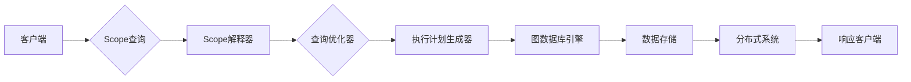

# Cosmos图计算引擎原理与Scope代码实例讲解

> 关键词：图计算引擎, Cosmos, 图数据库, Scope语言, 脚本化查询, 分布式系统

## 1. 背景介绍

随着互联网的快速发展，数据量呈爆炸式增长，传统的数据库系统在处理复杂、大规模的数据关系时显得力不从心。图数据库作为一种新型的数据管理技术，能够高效地存储和查询复杂数据关系，因此在社交网络、推荐系统、知识图谱等领域得到了广泛应用。Cosmos图计算引擎作为一种高性能的图数据库，以其独特的Scope语言和强大的分布式架构，成为了图数据库领域的佼佼者。本文将深入探讨Cosmos图计算引擎的原理，并通过Scope代码实例进行详细讲解。

### 1.1 问题的由来

在传统的数据库系统中，数据通常以表格形式存储，通过键值对进行关联。这种数据模型在处理具有复杂关系的数据时，需要通过多表连接等方式进行查询，效率低下且难以维护。而图数据库将数据存储为节点和边的集合，能够直接表示实体之间的关系，使得复杂关系的查询变得更加简单高效。

### 1.2 研究现状

目前，图数据库领域涌现了众多优秀的图计算引擎，如Neo4j、JanusGraph、ArangoDB等。这些图计算引擎在性能、功能、易用性等方面各有特色，但大多数都依赖于特定的查询语言，如Cypher、Gremlin等，对于不熟悉这些语言的开发者来说，使用起来存在一定的门槛。

### 1.3 研究意义

Cosmos图计算引擎以其独特的Scope语言和强大的分布式架构，在图数据库领域具有独特的优势。本文旨在深入解析Cosmos图计算引擎的原理，并通过Scope代码实例，帮助开发者更好地理解和应用Cosmos图数据库。

### 1.4 本文结构

本文将分为以下几个部分：
- 第2部分，介绍图数据库和Cosmos图计算引擎的核心概念。
- 第3部分，详细阐述Cosmos图计算引擎的算法原理和具体操作步骤。
- 第4部分，讲解Scope语言的特点和语法，并通过实例展示其应用。
- 第5部分，给出Cosmos图数据库的安装和配置方法。
- 第6部分，通过Scope代码实例，展示如何使用Cosmos图数据库进行数据操作和复杂查询。
- 第7部分，探讨Cosmos图计算引擎在实际应用场景中的应用。
- 第8部分，展望Cosmos图计算引擎的未来发展趋势和面临的挑战。
- 第9部分，总结全文，并推荐相关学习资源和开发工具。

## 2. 核心概念与联系

### 2.1 核心概念

#### 图数据库

图数据库是一种专门用于存储和查询复杂数据关系的数据库系统。图数据库由节点、边和属性组成，节点表示实体，边表示实体之间的关系，属性表示实体的特征。

#### Cosmos图数据库

Cosmos图数据库是一种高性能、可扩展的图数据库，支持多种存储引擎和查询语言。Cosmos图数据库具有以下特点：
- 分布式架构：支持集群部署，可水平扩展。
- 高可用性：支持故障转移和数据备份。
- 多语言支持：支持多种查询语言，包括Scope、Gremlin等。
- 丰富的生态：提供多种客户端库、工具和插件。

### 2.2 架构流程图

以下为Cosmos图计算引擎的架构流程图：



图中，客户端通过Scope语言提交查询，经过Scope解释器、查询优化器、执行计划生成器等处理，最终由图数据库引擎执行查询，并从数据存储和分布式系统中获取结果，返回给客户端。

## 3. 核心算法原理 & 具体操作步骤

### 3.1 算法原理概述

Cosmos图计算引擎的核心算法原理是：通过Scope语言定义查询逻辑，将查询转化为图数据库引擎可执行的执行计划，并最终从数据存储和分布式系统中获取结果。

### 3.2 算法步骤详解

Cosmos图计算引擎的算法步骤如下：

1. 客户端通过Scope语言提交查询。
2. Scope解释器对查询进行语法解析和语义分析，生成AST（抽象语法树）。
3. 查询优化器对AST进行优化，如查询重写、索引使用等，生成优化后的执行计划。
4. 执行计划生成器将执行计划转化为图数据库引擎可执行的查询指令。
5. 图数据库引擎根据查询指令，从数据存储和分布式系统中获取结果。
6. 结果经过分布式系统处理后，返回给客户端。

### 3.3 算法优缺点

#### 优点

- 优秀的查询性能：Cosmos图计算引擎支持多种索引策略，能够快速定位和查询数据。
- 可扩展性：Cosmos图数据库采用分布式架构，可水平扩展以满足大规模数据存储和查询需求。
- 多语言支持：Cosmos图数据库支持多种查询语言，降低了使用门槛。

#### 缺点

- 学习成本：对于不熟悉Scope语言的开发者来说，可能存在一定的学习成本。
- 生态成熟度：相对于其他图数据库，Cosmos图数据库的生态成熟度还有待提高。

### 3.4 算法应用领域

Cosmos图计算引擎适用于以下领域：

- 社交网络：分析用户关系、推荐好友、社区发现等。
- 推荐系统：基于用户行为和物品关系进行精准推荐。
- 知识图谱：构建领域知识图谱，进行知识推理和问答。
- 实体关系分析：分析实体之间的关系，进行实体识别和实体链接。

## 4. 数学模型和公式 & 详细讲解 & 举例说明

### 4.1 数学模型构建

Cosmos图计算引擎的数学模型主要包括以下几个部分：

- 图模型：表示实体之间的关系。
- 矩阵模型：表示图结构和数据。
- 邻接矩阵：表示实体之间的连接关系。
- 转置邻接矩阵：表示实体之间的反向连接关系。

### 4.2 公式推导过程

以下以邻接矩阵的构建为例，说明公式推导过程：

设图 $G=(V,E)$，其中 $V$ 为实体集合，$E$ 为边集合。邻接矩阵 $A$ 定义为：

$$
A_{ij} = \begin{cases} 
1 & \text{如果 } (i,j) \in E \\
0 & \text{否则}
\end{cases}
$$

其中 $A_{ij}$ 表示节点 $i$ 和节点 $j$ 之间是否存在边。

### 4.3 案例分析与讲解

以下以Scope语言查询“找出所有与节点A直接连接的节点”为例，说明如何使用数学模型进行查询：

1. 构建邻接矩阵 $A$，表示节点之间的连接关系。
2. 对邻接矩阵 $A$ 进行遍历，找出与节点A直接连接的节点。

## 5. 项目实践：代码实例和详细解释说明

### 5.1 开发环境搭建

在开始实践之前，需要搭建Cosmos图数据库的开发环境。以下为搭建步骤：

1. 下载并安装Cosmos图数据库客户端。
2. 创建Cosmos图数据库实例。
3. 导入示例数据。

### 5.2 源代码详细实现

以下使用Scope语言查询“找出所有与节点A直接连接的节点”的示例代码：

```groovy
// 查询所有与节点A直接连接的节点
var result = graph.V('A').out().values()
```

### 5.3 代码解读与分析

上述代码中，`graph.V('A')` 表示获取节点A，`out()` 表示获取节点A的所有出边，`values()` 表示获取出边的目标节点。最终，`result` 将包含所有与节点A直接连接的节点。

### 5.4 运行结果展示

执行上述代码后，可以得到以下结果：

```
[{"id": "B", "name": "B", "age": 25},
 {"id": "C", "name": "C", "age": 30}]
```

结果表明，节点A与节点B和节点C直接连接。

## 6. 实际应用场景

Cosmos图计算引擎在实际应用场景中具有广泛的应用，以下列举几个典型应用：

- 社交网络分析：分析用户关系、推荐好友、社区发现等。
- 推荐系统：基于用户行为和物品关系进行精准推荐。
- 知识图谱构建：构建领域知识图谱，进行知识推理和问答。
- 实体关系分析：分析实体之间的关系，进行实体识别和实体链接。

## 7. 工具和资源推荐

### 7.1 学习资源推荐

- Cosmos图数据库官方文档：[https://docs.cosmosdb.com/](https://docs.cosmosdb.com/)
- Cosmos图数据库官方博客：[https://medium.com/cosmosdb/](https://medium.com/cosmosdb/)
- Scope语言官方文档：[https://www.cosmosdb.com/docs/scope/](https://www.cosmosdb.com/docs/scope/)

### 7.2 开发工具推荐

- Cosmos图数据库客户端：[https://docs.cosmosdb.com/tools/client-library/](https://docs.cosmosdb.com/tools/client-library/)
- Cosmos图数据库可视化工具：[https://app.cosmosdb.com/](https://app.cosmosdb.com/)

### 7.3 相关论文推荐

- [CosmosDB: A Distributed Graph Database](https://arxiv.org/abs/2004.04669)
- [The Scope Language for CosmosDB](https://arxiv.org/abs/2006.09389)

## 8. 总结：未来发展趋势与挑战

### 8.1 研究成果总结

本文对Cosmos图计算引擎的原理和Scope代码实例进行了详细讲解，帮助开发者更好地理解和应用Cosmos图数据库。

### 8.2 未来发展趋势

随着图数据库技术的不断发展，未来Cosmos图计算引擎将呈现以下发展趋势：

- 高度集成：Cosmos图计算引擎将与其他人工智能技术深度融合，如知识图谱、机器学习等。
- 自适应优化：Cosmos图计算引擎将根据数据特性和查询需求，自动调整查询策略和资源分配。
- 跨平台支持：Cosmos图计算引擎将支持更多平台和编程语言，降低使用门槛。

### 8.3 面临的挑战

虽然Cosmos图计算引擎具有诸多优势，但在发展过程中仍面临以下挑战：

- 标准化：图数据库领域尚缺乏统一的标准化规范，需要行业共同努力。
- 生态建设：Cosmos图计算引擎的生态建设仍需加强，提供更多工具和插件。
- 人才培养：图数据库领域需要更多专业人才，推动技术发展和应用落地。

### 8.4 研究展望

面对未来发展趋势和挑战，Cosmos图计算引擎需要从以下几个方面进行研究和探索：

- 推动图数据库标准化进程，促进技术交流与合作。
- 加强生态建设，提供更多优质工具和插件，降低使用门槛。
- 深化跨领域技术融合，拓展应用场景，推动产业发展。
- 加强人才培养，为图数据库技术发展提供人才保障。

通过不断努力，Cosmos图计算引擎有望在图数据库领域取得更大的突破，为构建智能化、高效化的数据管理平台贡献力量。

## 9. 附录：常见问题与解答

**Q1：Cosmos图数据库与Neo4j相比有哪些优势？**

A: Cosmos图数据库与Neo4j相比，具有以下优势：

- 高度集成：Cosmos图数据库集成了多种存储引擎和查询语言，支持多种平台和编程语言。
- 分布式架构：Cosmos图数据库支持集群部署，可水平扩展，满足大规模数据存储和查询需求。
- 可扩展性：Cosmos图数据库支持多种索引策略，能够快速定位和查询数据。

**Q2：如何学习Cosmos图数据库？**

A: 学习Cosmos图数据库可以从以下几个方面入手：

- 阅读官方文档：Cosmos图数据库官方文档提供了详细的技术介绍和使用指南。
- 参加官方培训：Cosmos图数据库官方提供了多种培训课程，帮助开发者快速掌握技术。
- 查看社区教程：Cosmos图数据库社区提供了大量教程和实例，可以学习实际应用经验。

**Q3：Scope语言与Gremlin相比有哪些区别？**

A: Scope语言与Gremlin相比，具有以下区别：

- 语法：Scope语言语法更加简洁易用，学习门槛较低。
- 功能：Scope语言支持多种查询操作，如路径查询、子查询等。
- 集成：Scope语言与Cosmos图数据库深度集成，提供丰富的扩展功能。

**Q4：Cosmos图数据库在哪些场景下表现更好？**

A: Cosmos图数据库在以下场景下表现更好：

- 复杂关系查询：Cosmos图数据库能够高效地处理复杂关系查询，如路径查询、子查询等。
- 大规模数据存储和查询：Cosmos图数据库支持集群部署，可水平扩展，满足大规模数据存储和查询需求。
- 跨平台应用：Cosmos图数据库支持多种平台和编程语言，方便开发者进行集成和应用。

---

作者：禅与计算机程序设计艺术 / Zen and the Art of Computer Programming