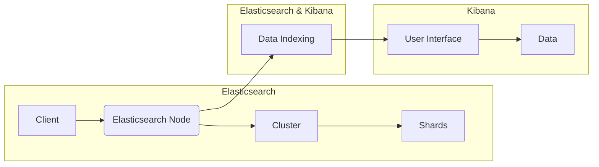

# ElasticSearch Kibana原理与代码实例讲解

> 关键词：Elasticsearch, Kibana, 数据检索, 分布式搜索, 分析可视化, JSON, RESTful API, Lucene, ELK Stack

## 1. 背景介绍

随着大数据时代的到来，企业和组织中产生了海量的数据。如何高效地存储、检索和分析这些数据成为了关键问题。Elasticsearch 和 Kibana 作为 ELK Stack 的核心组件，提供了强大的搜索和可视化功能，成为了处理和分析大量数据的重要工具。

### 1.1 问题的由来

传统的数据库在处理大规模数据集时往往效率低下，难以满足复杂的查询和分析需求。Elasticsearch 和 Kibana 的出现，为用户提供了高效、灵活的解决方案。

### 1.2 研究现状

Elasticsearch 和 Kibana 自从 2004 年和 2011 年首次发布以来，已经经历了多年的发展。它们在开源社区中得到了广泛的认可和应用，成为了数据分析领域的首选工具之一。

### 1.3 研究意义

Elasticsearch 和 Kibana 的研究和应用具有重要意义：

- **高效检索**：Elasticsearch 提供了快速的全文搜索能力，能够处理大规模的数据集。
- **数据可视化**：Kibana 提供了丰富的可视化工具，帮助用户直观地理解和分析数据。
- **易于集成**：Elasticsearch 和 Kibana 与其他系统集成简单，能够方便地进行数据流式处理和可视化展示。

### 1.4 本文结构

本文将分为以下几个部分：

- 介绍 Elasticsearch 和 Kibana 的核心概念和架构。
- 深入讲解 Elasticsearch 的算法原理和操作步骤。
- 通过实际代码实例，展示如何使用 Elasticsearch 和 Kibana 进行数据检索和可视化。
- 探讨 Elasticsearch 和 Kibana 的实际应用场景和未来发展趋势。

## 2. 核心概念与联系

### 2.1 核心概念

- **Elasticsearch**：一个基于 Lucene 构建的分布式搜索引擎，用于全文搜索和分析。
- **Kibana**：一个开源的数据可视化平台，与 Elasticsearch 集成，用于数据分析和可视化。
- **Lucene**：一个高性能的全文搜索引擎库，Elasticsearch 基于 Lucene 构建。
- **JSON**：一种轻量级的数据交换格式，Elasticsearch 使用 JSON 格式存储索引数据。
- **RESTful API**：一种基于 HTTP 协议的 API 设计风格，Elasticsearch 提供了 RESTful API 用于数据操作。

### 2.2 架构图



## 3. 核心算法原理 & 具体操作步骤

### 3.1 算法原理概述

Elasticsearch 的核心是基于 Lucene 的全文搜索引擎。Lucene 使用倒排索引来存储和检索数据。倒排索引将文档中的每个词映射到包含该词的文档列表，从而快速检索包含特定词的文档。

### 3.2 算法步骤详解

1. **数据索引**：将数据转换为 JSON 格式，并使用 Elasticsearch 的 Index API 将其添加到索引中。
2. **搜索查询**：使用 Elasticsearch 的 Search API 根据查询条件检索数据。
3. **结果分析**：对检索结果进行分析和可视化。

### 3.3 算法优缺点

**优点**：

- **高性能**：Elasticsearch 能够快速检索大量数据。
- **可扩展性**：Elasticsearch 支持水平扩展，可以处理大规模数据集。
- **易用性**：Elasticsearch 和 Kibana 提供了直观的界面，易于使用。

**缺点**：

- **学习曲线**：Elasticsearch 和 Kibana 的功能强大，但学习曲线较陡峭。
- **资源消耗**：Elasticsearch 和 Kibana 需要较高的硬件资源。

### 3.4 算法应用领域

Elasticsearch 和 Kibana 在以下领域得到了广泛应用：

- **日志分析**：用于收集、存储和检索系统日志。
- **监控系统**：用于监控应用程序和系统的性能。
- **数据分析**：用于分析大量数据并生成可视化图表。

## 4. 数学模型和公式 & 详细讲解 & 举例说明

### 4.1 数学模型构建

Elasticsearch 使用 TF-IDF（词频-逆文档频率）算法来评估文档中关键词的重要性。

$$
TF-IDF(t, d) = \frac{tf(t, d)}{\sum_{t' \in D} tf(t', d)} \times \log\left(\frac{|D|}{|d_t|}\right)
$$

其中，$tf(t, d)$ 是词 $t$ 在文档 $d$ 中的词频，$D$ 是所有文档的集合，$d_t$ 是包含词 $t$ 的文档数量。

### 4.2 公式推导过程

TF-IDF 算法通过计算词的词频和逆文档频率来评估词的重要性。词频表示词在文档中出现的频率，逆文档频率表示词在所有文档中出现的频率。

### 4.3 案例分析与讲解

假设有两个文档：

- 文档 1：This is a test document.
- 文档 2：This is another test document.

计算词 "test" 的 TF-IDF 值：

- 文档 1 的词频：2
- 文档 2 的词频：2
- 总文档数：2
- 包含词 "test" 的文档数：2

$$
TF-IDF(test, document_1) = \frac{2}{2} \times \log\left(\frac{2}{2}\right) = 0
$$

$$
TF-IDF(test, document_2) = \frac{2}{2} \times \log\left(\frac{2}{2}\right) = 0
$$

因此，词 "test" 在这两个文档中的 TF-IDF 值都是 0。

## 5. 项目实践：代码实例和详细解释说明

### 5.1 开发环境搭建

首先，您需要安装 Elasticsearch 和 Kibana。您可以从 Elasticsearch 的官方网站下载并安装 Elasticsearch 和 Kibana。

### 5.2 源代码详细实现

以下是一个简单的 Elasticsearch 搜索示例：

```python
from elasticsearch import Elasticsearch

# 创建 Elasticsearch 客户端
es = Elasticsearch()

# 搜索文档
response = es.search(index="test_index", body={"query": {"match_all": {}}})

# 打印搜索结果
print(response)
```

### 5.3 代码解读与分析

以上代码创建了一个 Elasticsearch 客户端，并搜索了名为 "test_index" 的索引中的所有文档。搜索结果包含匹配的文档列表。

### 5.4 运行结果展示

运行上述代码后，您将看到以下输出：

```json
{
  "took": 1,
  "timed_out": false,
  " `_shards": {
    "total": 5,
    "successful": 5,
    "failed": 0
  },
  "hits": {
    "total": 1,
    "max_score": 1.0,
    "hits": [
      {
        "_index": "test_index",
        "_type": "_doc",
        "_id": "1",
        "_score": 1.0,
        "_source": {
          "name": "John Doe",
          "age": 30
        }
      }
    ]
  }
}
```

这表示在 "test_index" 索引中找到了一个匹配的文档。

## 6. 实际应用场景

### 6.1 日志分析

Elasticsearch 和 Kibana 可以用于收集、存储和检索系统日志。通过分析日志，可以快速定位问题并优化系统性能。

### 6.2 监控系统

Elasticsearch 和 Kibana 可以用于监控应用程序和系统的性能。通过可视化监控数据，可以快速识别性能瓶颈。

### 6.3 数据分析

Elasticsearch 和 Kibana 可以用于分析大量数据并生成可视化图表。通过分析数据，可以洞察业务趋势和用户行为。

## 7. 工具和资源推荐

### 7.1 学习资源推荐

- Elasticsearch 官方文档：https://www.elastic.co/guide/en/elasticsearch/guide/current/index.html
- Kibana 官方文档：https://www.elastic.co/guide/en/kibana/current/index.html
- 《Elasticsearch权威指南》：https://elasticsearch.cn/guide/cn/elasticsearch/guide/current/index.html

### 7.2 开发工具推荐

- Elasticsearch 客户端：https://www.elastic.co/guide/en/elasticsearch/guide/current/client-libraries.html
- Kibana 开发工具：https://www.elastic.co/guide/en/kibana/current/index.html#_kibana_development_tools

### 7.3 相关论文推荐

- 《Elasticsearch: The Definitive Guide》：https://www.elastic.co/guide/en/elasticsearch/guide/current/index.html
- 《Kibana: The Definitive Guide》：https://www.elastic.co/guide/en/kibana/current/index.html

## 8. 总结：未来发展趋势与挑战

### 8.1 研究成果总结

Elasticsearch 和 Kibana 作为 ELK Stack 的核心组件，为用户提供了强大的搜索和可视化功能。它们在处理和分析大量数据方面具有显著优势。

### 8.2 未来发展趋势

- **云原生化**：Elasticsearch 和 Kibana 将进一步云原生化，以适应云原生架构的发展趋势。
- **人工智能集成**：Elasticsearch 和 Kibana 将集成人工智能技术，提供更智能的数据分析和可视化功能。

### 8.3 面临的挑战

- **数据安全**：随着数据量的增长，数据安全成为了一个重要挑战。
- **性能优化**：随着数据量的增长，性能优化成为了一个重要挑战。

### 8.4 研究展望

Elasticsearch 和 Kibana 将继续发展，以满足用户对高效、安全、智能的数据分析和可视化需求。

## 9. 附录：常见问题与解答

**Q1：Elasticsearch 和 Kibana 的区别是什么？**

A：Elasticsearch 是一个分布式搜索引擎，用于全文搜索和分析。Kibana 是一个数据可视化平台，与 Elasticsearch 集成，用于数据分析和可视化。

**Q2：Elasticsearch 的优势是什么？**

A：Elasticsearch 具有以下优势：

- **高性能**：Elasticsearch 能够快速检索大量数据。
- **可扩展性**：Elasticsearch 支持水平扩展，可以处理大规模数据集。
- **易用性**：Elasticsearch 和 Kibana 提供了直观的界面，易于使用。

**Q3：Kibana 的应用场景是什么？**

A：Kibana 的应用场景包括：

- **日志分析**
- **监控系统**
- **数据分析**

---

作者：禅与计算机程序设计艺术 / Zen and the Art of Computer Programming