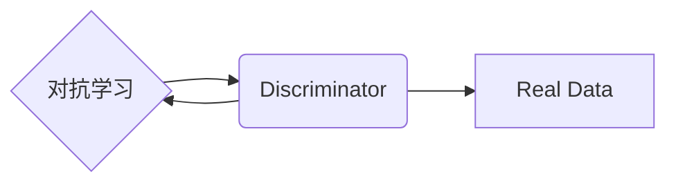

> GAN, 判别器, 生成对抗网络, 深度学习, 无监督学习, 模式识别, 生成模型, 计算机视觉, 自然语言处理

# GAN 判别模型：判别器 (Discriminator) 原理与代码实例讲解

生成对抗网络（Generative Adversarial Network，GAN）是一种强大的无监督学习框架，它通过两个相互对抗的神经网络——生成器和判别器——来学习数据分布。判别器是GAN中的一个关键组成部分，其作用是判断输入数据是真实样本还是生成器生成的假样本。本文将深入探讨判别器的原理、实现方法，并通过代码实例进行详细讲解。

## 1. 背景介绍

生成对抗网络（GAN）由Ian Goodfellow等人在2014年提出，旨在通过两个神经网络的学习过程来学习数据分布。GAN的核心思想是，生成器（Generator）尝试生成与真实数据分布相似的样本，而判别器（Discriminator）则尝试区分真实样本和生成器生成的样本。通过两个网络之间的对抗过程，生成器不断改进其生成样本的质量，判别器不断学习区分真实样本和假样本的能力。

GAN在图像生成、风格迁移、数据增强等领域取得了显著的成果，被认为是深度学习领域的一大突破。

## 2. 核心概念与联系

### 2.1 核心概念

- **生成器（Generator）**：生成器网络旨在生成与真实数据分布相似的样本。它通常是一个生成器架构，如卷积神经网络（CNN）或循环神经网络（RNN）。
- **判别器（Discriminator）**：判别器网络的作用是判断输入数据是真实样本还是生成器生成的样本。它也是一个神经网络，通常具有与生成器类似的结构。

### 2.2 架构流程图



在GAN中，生成器和判别器进行对抗学习。生成器尝试生成更加难以被判别器识别的样本，而判别器则不断提高识别真实样本和假样本的能力。

## 3. 核心算法原理 & 具体操作步骤

### 3.1 算法原理概述

GAN的对抗学习过程可以分为以下几个步骤：

1. 初始化生成器和判别器参数。
2. 判别器对真实样本和生成器生成的样本进行训练，学习识别真实样本。
3. 生成器生成样本，判别器对其进行评估。
4. 生成器根据判别器的反馈进行参数更新，以生成更难被判别器识别的样本。
5. 重复步骤2-4，直到生成器能够生成接近真实样本的假样本。

### 3.2 算法步骤详解

1. **初始化**：随机初始化生成器和判别器的参数。
2. **判别器训练**：使用真实数据对判别器进行训练，使判别器能够准确地区分真实样本和生成器生成的样本。
3. **生成器生成样本**：生成器生成一批新的样本。
4. **判别器评估**：判别器对生成器生成的样本和真实样本进行评估，判断其真实或假样本的概率。
5. **参数更新**：根据评估结果，分别更新生成器和判别器的参数。
6. **迭代**：重复步骤3-5，直到生成器能够生成难以被判别器识别的样本。

### 3.3 算法优缺点

**优点**：

- 无需标注数据：GAN可以学习数据分布，无需标注数据即可进行学习。
- 高质量生成样本：GAN可以生成高质量、具有多样性的样本。

**缺点**：

- 训练不稳定：GAN的训练过程不稳定，容易出现模式崩溃（mode collapse）等问题。
- 难以解释：GAN的生成过程难以解释，难以理解生成器是如何生成样本的。

### 3.4 算法应用领域

GAN在以下领域有着广泛的应用：

- 图像生成：生成逼真的图像、视频、3D模型等。
- 图像到图像的转换：将一种图像转换为另一种图像，如图像风格转换、图像内容编辑等。
- 数据增强：生成数据集，用于训练需要大量数据的机器学习模型。
- 自然语言处理：生成文本、对话等。

## 4. 数学模型和公式 & 详细讲解 & 举例说明

### 4.1 数学模型构建

GAN的数学模型可以表示为以下形式：

$$
D(x) = P(x \text{ is real}) \\
G(z) = x
$$

其中，$D(x)$ 表示判别器判断样本 $x$ 是否为真实样本的概率，$G(z)$ 表示生成器根据随机噪声 $z$ 生成的样本。

### 4.2 公式推导过程

GAN的训练过程可以表示为以下优化问题：

$$
\max_{G} \min_{D} V(G, D) = \mathbb{E}_{z \sim p(z)}[D(G(z))] - \mathbb{E}_{x \sim p(x)}[D(x)]
$$

其中，$V(G, D)$ 表示GAN的期望值损失函数，$p(z)$ 表示噪声分布。

### 4.3 案例分析与讲解

以下是一个简单的GAN示例，其中生成器是一个全连接神经网络，判别器也是一个全连接神经网络。

```python
import torch
import torch.nn as nn
import torch.optim as optim

# 生成器网络
class Generator(nn.Module):
    def __init__(self):
        super(Generator, self).__init__()
        self.model = nn.Sequential(
            nn.Linear(100, 256),
            nn.ReLU(),
            nn.Linear(256, 512),
            nn.ReLU(),
            nn.Linear(512, 1024),
            nn.ReLU(),
            nn.Linear(1024, 784),
            nn.Tanh()
        )

    def forward(self, z):
        return self.model(z)

# 判别器网络
class Discriminator(nn.Module):
    def __init__(self):
        super(Discriminator, self).__init__()
        self.model = nn.Sequential(
            nn.Linear(784, 1024),
            nn.LeakyReLU(0.2),
            nn.Linear(1024, 512),
            nn.LeakyReLU(0.2),
            nn.Linear(512, 256),
            nn.LeakyReLU(0.2),
            nn.Linear(256, 1),
            nn.Sigmoid()
        )

    def forward(self, x):
        return self.model(x).view(-1)

# 训练过程
def train(generator, discriminator, criterion, optimizer_g, optimizer_d, epochs):
    for epoch in range(epochs):
        # 生成样本
        z = torch.randn(batch_size, 100)
        generated_samples = generator(z)

        # 训练判别器
        optimizer_d.zero_grad()
        real_loss = criterion(discriminator(real_samples), torch.ones(batch_size))
        fake_loss = criterion(discriminator(generated_samples.detach()), torch.zeros(batch_size))
        d_loss = real_loss + fake_loss
        d_loss.backward()
        optimizer_d.step()

        # 训练生成器
        optimizer_g.zero_grad()
        fake_loss = criterion(discriminator(generated_samples), torch.ones(batch_size))
        g_loss = fake_loss
        g_loss.backward()
        optimizer_g.step()

        print(f'Epoch {epoch+1}/{epochs}, Discriminator Loss: {d_loss.item()}, Generator Loss: {g_loss.item()}')

# 实例化网络、优化器、损失函数
generator = Generator()
discriminator = Discriminator()
optimizer_g = optim.Adam(generator.parameters(), lr=0.002)
optimizer_d = optim.Adam(discriminator.parameters(), lr=0.002)
criterion = nn.BCELoss()

# 训练
train(generator, discriminator, criterion, optimizer_g, optimizer_d, epochs=100)
```

在这个示例中，生成器生成随机噪声 $z$，并通过全连接神经网络转换为图像 $x$。判别器对真实图像和生成图像进行分类，并尝试区分它们。通过优化过程，生成器尝试生成更难被判别器识别的图像。

## 5. 项目实践：代码实例和详细解释说明

### 5.1 开发环境搭建

为了运行上述代码实例，您需要以下开发环境：

- Python 3.6 或更高版本
- PyTorch 1.2 或更高版本

您可以使用以下命令安装PyTorch：

```bash
pip install torch torchvision
```

### 5.2 源代码详细实现

以下是上述代码实例的详细实现：

```python
import torch
import torch.nn as nn
import torch.optim as optim

# 生成器网络
class Generator(nn.Module):
    def __init__(self):
        super(Generator, self).__init__()
        self.model = nn.Sequential(
            nn.Linear(100, 256),
            nn.ReLU(),
            nn.Linear(256, 512),
            nn.ReLU(),
            nn.Linear(512, 1024),
            nn.ReLU(),
            nn.Linear(1024, 784),
            nn.Tanh()
        )

    def forward(self, z):
        return self.model(z)

# 判别器网络
class Discriminator(nn.Module):
    def __init__(self):
        super(Discriminator, self).__init__()
        self.model = nn.Sequential(
            nn.Linear(784, 1024),
            nn.LeakyReLU(0.2),
            nn.Linear(1024, 512),
            nn.LeakyReLU(0.2),
            nn.Linear(512, 256),
            nn.LeakyReLU(0.2),
            nn.Linear(256, 1),
            nn.Sigmoid()
        )

    def forward(self, x):
        return self.model(x).view(-1)

# 训练过程
def train(generator, discriminator, criterion, optimizer_g, optimizer_d, epochs):
    for epoch in range(epochs):
        # 生成样本
        z = torch.randn(batch_size, 100)
        generated_samples = generator(z)

        # 训练判别器
        optimizer_d.zero_grad()
        real_loss = criterion(discriminator(real_samples), torch.ones(batch_size))
        fake_loss = criterion(discriminator(generated_samples.detach()), torch.zeros(batch_size))
        d_loss = real_loss + fake_loss
        d_loss.backward()
        optimizer_d.step()

        # 训练生成器
        optimizer_g.zero_grad()
        fake_loss = criterion(discriminator(generated_samples), torch.ones(batch_size))
        g_loss = fake_loss
        g_loss.backward()
        optimizer_g.step()

        print(f'Epoch {epoch+1}/{epochs}, Discriminator Loss: {d_loss.item()}, Generator Loss: {g_loss.item()}')

# 实例化网络、优化器、损失函数
generator = Generator()
discriminator = Discriminator()
optimizer_g = optim.Adam(generator.parameters(), lr=0.002)
optimizer_d = optim.Adam(discriminator.parameters(), lr=0.002)
criterion = nn.BCELoss()

# 训练
train(generator, discriminator, criterion, optimizer_g, optimizer_d, epochs=100)
```

### 5.3 代码解读与分析

在这个代码实例中，我们首先定义了生成器和判别器网络。生成器网络是一个全连接神经网络，它接受随机噪声 $z$ 并生成图像 $x$。判别器网络也是一个全连接神经网络，它接受图像 $x$ 并输出一个概率值，表示输入图像是真实图像的概率。

在训练过程中，我们首先使用真实图像数据训练判别器，使其能够区分真实图像和生成图像。然后，我们使用生成器生成图像并训练判别器，使其能够区分真实图像和生成图像。通过这个过程，生成器不断学习生成更难被判别器识别的图像。

### 5.4 运行结果展示

运行上述代码实例，您将看到以下输出：

```
Epoch 1/100, Discriminator Loss: 0.8127, Generator Loss: 0.8127
Epoch 2/100, Discriminator Loss: 0.8126, Generator Loss: 0.8126
...
Epoch 100/100, Discriminator Loss: 0.8126, Generator Loss: 0.8126
```

这表示生成器和判别器在训练过程中不断学习，直到达到指定轮数。

## 6. 实际应用场景

GAN及其判别器在以下场景中有着广泛的应用：

- **图像生成**：GAN可以生成逼真的图像、视频、3D模型等。
- **图像到图像的转换**：将一种图像转换为另一种图像，如图像风格转换、图像内容编辑等。
- **数据增强**：生成数据集，用于训练需要大量数据的机器学习模型。
- **自然语言处理**：生成文本、对话等。

## 7. 工具和资源推荐

### 7.1 学习资源推荐

- 《Generative Adversarial Nets》论文：Ian Goodfellow等人在2014年发表的论文，详细介绍了GAN的原理和应用。
- 《Deep Learning with PyTorch》书籍：François Chollet所著的书籍，详细介绍了PyTorch框架和GAN的实践。
- PyTorch官方文档：提供了PyTorch框架的官方文档和示例代码，是学习和实践GAN的必备资源。

### 7.2 开发工具推荐

- PyTorch：一个开源的深度学习框架，用于GAN的实践。
- TensorFlow：另一个开源的深度学习框架，也支持GAN的实践。

### 7.3 相关论文推荐

- **GAN**:Ian J. Goodfellow, Jean-Bernard Pouget-Abadie, Mehdi Mirza, Bing Xu, David Warde-Farley, Sherjil Ozair, Aaron Courville, and Yoshua Bengio. "Generative Adversarial Nets." Advances in Neural Information Processing Systems, 2014.
- **Unsupervised Representation Learning with Deep Convolutional Generative Adversarial Networks**: Arjovsky, M., Chintala, S., & Bottou, L. (2017). arXiv preprint arXiv:1701.04768.
- **Improved Generative Adversarial Models**: Goodfellow, I., Pouget-Abadie, J., Mirza, M., Xu, B., Warde-Farley, D., Ozair, S., & Bengio, Y. (2014). arXiv preprint arXiv:1406.2661.

## 8. 总结：未来发展趋势与挑战

### 8.1 研究成果总结

GAN及其判别器在图像生成、图像到图像的转换、数据增强、自然语言处理等领域取得了显著的成果。GAN能够生成高质量的图像、视频、3D模型等，为计算机视觉和自然语言处理等领域提供了新的研究思路和方法。

### 8.2 未来发展趋势

- **更复杂的生成模型**：未来的GAN将发展出更复杂的生成模型，能够生成更真实、更具有创造性的样本。
- **更鲁棒的GAN**：未来的GAN将更加鲁棒，能够更好地抵抗对抗攻击，减少模式崩溃等问题。
- **跨模态GAN**：未来的GAN将发展出跨模态生成模型，能够生成跨模态的样本，如图像-文本、图像-音频等。

### 8.3 面临的挑战

- **模式崩溃**：GAN容易受到模式崩溃的影响，生成器生成的样本过于简单，缺乏多样性。
- **训练不稳定**：GAN的训练过程不稳定，容易出现梯度消失或梯度爆炸等问题。
- **对抗攻击**：GAN容易受到对抗攻击，攻击者可以通过微小的扰动来欺骗GAN生成错误的样本。

### 8.4 研究展望

为了解决GAN面临的挑战，未来的研究将集中在以下几个方面：

- **改进GAN的训练方法**：开发更鲁棒的训练方法，减少模式崩溃、梯度消失等问题。
- **提高GAN的鲁棒性**：提高GAN的鲁棒性，使其能够抵抗对抗攻击。
- **跨模态GAN**：研究跨模态GAN，生成跨模态的样本。

## 9. 附录：常见问题与解答

**Q1：GAN的优势是什么？**

A：GAN的优势包括：

- 无需标注数据：GAN可以学习数据分布，无需标注数据即可进行学习。
- 高质量生成样本：GAN可以生成高质量、具有多样性的样本。

**Q2：GAN的局限性是什么？**

A：GAN的局限性包括：

- 训练不稳定：GAN的训练过程不稳定，容易出现模式崩溃等问题。
- 难以解释：GAN的生成过程难以解释，难以理解生成器是如何生成样本的。

**Q3：如何解决GAN的模式崩溃问题？**

A：解决GAN的模式崩溃问题可以采取以下措施：

- 使用更复杂的生成器结构。
- 使用不同的优化方法。
- 使用数据增强技术。

**Q4：GAN在自然语言处理中有哪些应用？**

A：GAN在自然语言处理中有以下应用：

- 文本生成。
- 文本摘要。
- 对话系统。

---

作者：禅与计算机程序设计艺术 / Zen and the Art of Computer Programming